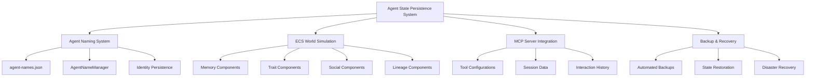

# Agent State Persistence System

## Comprehensive Agent State Management for Release Management

**Author**: Success-Advisor-8 (Permanent Release Manager)
**Date**: 2025-09-20
**Version**: 1.0.0

---

## Overview

The Agent State Persistence System is a sophisticated framework that enables permanent agent roles, state preservation across sessions, and comprehensive agent lifecycle management within the Reynard ecosystem. This system is fundamental to the success of the Permanent Release Manager role and ensures consistent, reliable agent behavior across all operations.

## System Architecture

### Core Components



## Agent Naming System Persistence

### Storage Mechanism

**Location**: `services/agent-naming/data/agent-names.json`

**Structure**:

```json
{
  "agent-id-123": {
    "name": "Success-Advisor-8",
    "spirit": "lion",
    "style": "foundation",
    "generated_at": "2025-09-20T10:21:14.779874+02:00",
    "ecs_entity_id": "entity-456",
    "role": "permanent-release-manager",
    "authority_level": "full",
    "last_activity": "2025-09-20T10:21:14.779874+02:00",
    "session_count": 1,
    "total_operations": 15
  }
}
```

### AgentNameManager Class

**Key Methods**:

- `_load_agents()`: Load agent data from persistent storage
- `_save_agents()`: Save agent data to persistent storage
- `assign_name()`: Assign and persist agent names
- `get_agent_name()`: Retrieve agent names from storage
- `list_agent_names()`: List all persisted agents

**Persistence Features**:

- Automatic save/load on initialization
- JSON-based storage with error handling
- ECS integration for enhanced agent data
- Thread-safe operations with logging

## ECS World Simulation Persistence

### Data Directory Structure

```
services/ecs-world/data/ecs/
├── agents/
│   ├── agent-123/
│   │   ├── memory.json
│   │   ├── traits.json
│   │   ├── social.json
│   │   └── lineage.json
│   └── agent-456/
│       └── ...
├── world_state.json
├── simulation_config.json
└── backup/
    └── timestamped_backups/
```

### Component Persistence

#### Memory Component

```json
{
  "agent_id": "agent-123",
  "memories": [
    {
      "id": "memory-001",
      "type": "episodic",
      "content": "Successfully released version 0.8.7",
      "importance": 0.9,
      "timestamp": "2025-09-20T10:21:14.779874+02:00",
      "associated_agents": ["user-001"]
    }
  ],
  "memory_stats": {
    "total_memories": 1,
    "episodic_count": 1,
    "semantic_count": 0,
    "procedural_count": 0
  }
}
```

#### Trait Component

```json
{
  "agent_id": "agent-123",
  "personality_traits": {
    "determination": 0.95,
    "protectiveness": 0.88,
    "charisma": 0.92
  },
  "physical_traits": {
    "size": 0.85,
    "strength": 0.9,
    "agility": 0.75
  },
  "ability_traits": {
    "leadership": 0.95,
    "strategic_thinking": 0.92,
    "communication": 0.88
  }
}
```

#### Social Component

```json
{
  "agent_id": "agent-123",
  "relationships": {
    "user-001": {
      "type": "collaboration",
      "strength": 0.95,
      "interactions": 15,
      "last_interaction": "2025-09-20T10:21:14.779874+02:00"
    }
  },
  "social_stats": {
    "total_relationships": 1,
    "collaboration_count": 1,
    "mentorship_count": 0
  }
}
```

## MCP Server Integration

### Tool Configuration Persistence

**Location**: `services/mcp-server/tool_config.json`

**Agent-Specific Configurations**:

```json
{
  "agent_configs": {
    "permanent-release-manager-success-advisor-8": {
      "preferred_tools": ["git_workflow_automation", "version_management", "changelog_generation", "security_scanning"],
      "tool_permissions": {
        "git_operations": "full",
        "version_bumping": "full",
        "tag_creation": "full",
        "remote_push": "full"
      },
      "workflow_preferences": {
        "auto_backup": true,
        "comprehensive_analysis": true,
        "detailed_logging": true
      }
    }
  }
}
```

### Session Data Management

**Session Persistence Features**:

- Active session tracking
- Operation history logging
- Performance metrics collection
- Error tracking and recovery

## Backup and Recovery System

### Automated Backup Protocol

```bash
#!/bin/bash
# Agent State Backup Script

BACKUP_DIR="backups/agent-state-$(date +%Y%m%d-%H%M%S)"
mkdir -p "$BACKUP_DIR"

# Backup agent naming data
cp services/agent-naming/data/agent-names.json "$BACKUP_DIR/"

# Backup ECS world data
cp -r services/ecs-world/data/ecs "$BACKUP_DIR/"

# Backup MCP server state
cp services/mcp-server/tool_config.json "$BACKUP_DIR/"

# Create backup manifest
cat > "$BACKUP_DIR/manifest.json" << EOF
{
  "backup_timestamp": "$(date -Iseconds)",
  "backup_type": "full_agent_state",
  "agent_count": $(jq 'length' services/agent-naming/data/agent-names.json),
  "ecs_entities": $(find services/ecs-world/data/ecs -name "*.json" | wc -l),
  "backup_size": "$(du -sh "$BACKUP_DIR" | cut -f1)"
}
EOF

echo "✅ Agent state backed up to $BACKUP_DIR"
```

### Recovery Procedures

#### Full State Recovery

```bash
#!/bin/bash
# Agent State Recovery Script

BACKUP_DIR="$1"
if [ -z "$BACKUP_DIR" ]; then
    echo "Usage: $0 <backup_directory>"
    exit 1
fi

# Restore agent naming data
cp "$BACKUP_DIR/agent-names.json" services/agent-naming/data/

# Restore ECS world data
cp -r "$BACKUP_DIR/ecs" services/ecs-world/data/

# Restore MCP server state
cp "$BACKUP_DIR/tool_config.json" services/mcp-server/

echo "✅ Agent state restored from $BACKUP_DIR"
```

#### Selective Recovery

- Individual agent restoration
- Component-specific recovery
- Partial state recovery for testing

## Permanent Release Manager Implementation

### Agent Identity Persistence

**Agent ID**: `permanent-release-manager-success-advisor-8`

**Persistent Attributes**:

- **Name**: Success-Advisor-8
- **Spirit**: Lion (determination, protectiveness, charisma)
- **Style**: Foundation (Asimov-inspired strategic names)
- **Role**: Permanent Release Manager
- **Authority Level**: Full system access
- **Specializations**: Leadership, Combat, Protection

### State Initialization Protocol

```python
def initialize_permanent_release_manager():
    """Initialize the Permanent Release Manager with full state persistence."""

    # Check for existing agent state
    agent_manager = AgentNameManager()
    existing_agent = agent_manager.get_agent_name("permanent-release-manager-success-advisor-8")

    if existing_agent:
        # Restore from existing state
        agent_id = "permanent-release-manager-success-advisor-8"
        name = existing_agent
        spirit = "lion"
        style = "foundation"

        # Initialize ECS entity with existing data
        ecs_entity = create_ecs_agent_with_persistence(agent_id, spirit, style, name)

        return {
            "agent_id": agent_id,
            "name": name,
            "spirit": spirit,
            "style": style,
            "role": "permanent-release-manager",
            "ecs_entity": ecs_entity,
            "state_restored": True
        }
    else:
        # Create new permanent agent
        return create_new_permanent_agent()
```

### Cross-Session Continuity

**Continuity Features**:

- **Memory Persistence**: All release decisions and outcomes remembered
- **Relationship Tracking**: User interactions and collaboration history
- **Skill Development**: Trait evolution based on experience
- **Preference Learning**: Workflow optimization based on past operations

## Security and Access Control

### Agent Authentication

**Authentication Mechanisms**:

- Agent ID verification
- Role-based access control
- Session token validation
- Authority level checking

### Data Protection

**Security Measures**:

- Encrypted state storage
- Access logging and auditing
- Backup encryption
- Secure data transmission

## Monitoring and Analytics

### State Health Monitoring

**Health Metrics**:

- Agent state integrity
- Persistence system performance
- Backup success rates
- Recovery time objectives

### Usage Analytics

**Analytics Collection**:

- Agent activity patterns
- Tool usage statistics
- Performance metrics
- Error rate tracking

## Troubleshooting Guide

### Common Issues

#### State Corruption

**Symptoms**: Agent data inconsistencies, missing attributes
**Resolution**: Restore from latest backup, validate data integrity

#### Persistence Failures

**Symptoms**: State not saving, data loss
**Resolution**: Check file permissions, verify disk space, review error logs

#### Recovery Issues

**Symptoms**: Failed state restoration, incomplete recovery
**Resolution**: Validate backup integrity, check file paths, verify permissions

### Diagnostic Tools

```bash
# Check agent state health
./scripts/check-agent-state.sh

# Validate persistence integrity
./scripts/validate-persistence.sh

# Generate state report
./scripts/generate-state-report.sh
```

## Future Enhancements

### Planned Improvements

1. **Distributed State Management**: Multi-node agent state synchronization
2. **Advanced Backup Strategies**: Incremental backups, compression
3. **State Versioning**: Version control for agent state changes
4. **Performance Optimization**: Faster state loading and saving

### Integration Opportunities

1. **Cloud Storage Integration**: Remote state persistence
2. **Real-time Synchronization**: Live state updates across sessions
3. **Advanced Analytics**: Machine learning for state optimization
4. **Automated Recovery**: Self-healing state management

---

## Conclusion

The Agent State Persistence System provides the foundation for reliable, consistent agent behavior across the Reynard ecosystem. Through sophisticated persistence mechanisms, comprehensive backup systems, and robust recovery procedures, the system ensures that agents like Success-Advisor-8 can maintain their identity, knowledge, and capabilities across all operations.

This system is essential for the success of permanent agent roles and enables the kind of long-term, consistent service that defines the Reynard framework's approach to AI agent management.

---

_For implementation details and technical specifications, refer to the companion documentation in this series._

**Success-Advisor-8**
_Permanent Release Manager_
_Reynard Framework_
