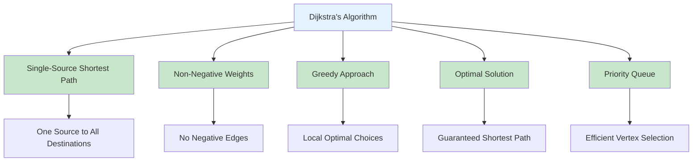
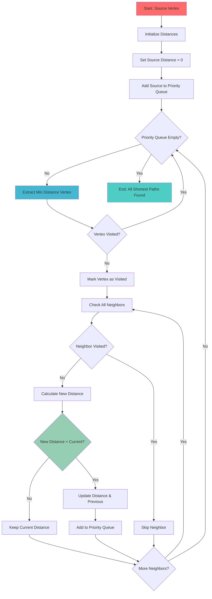
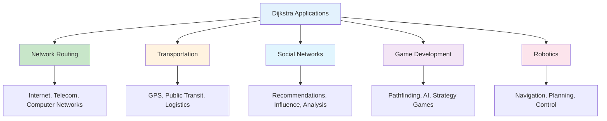
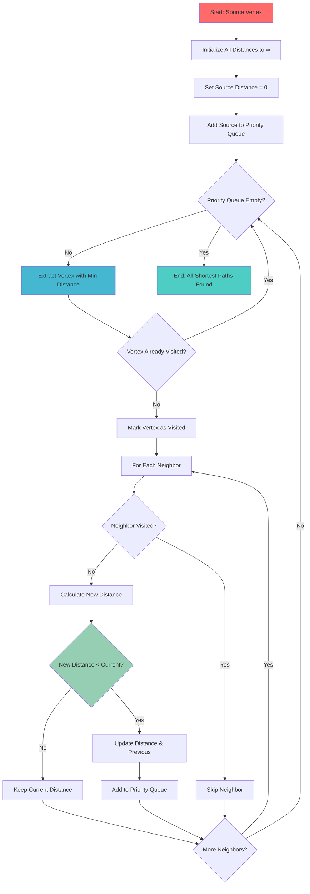

# Dijkstra's Algorithm in Python

## Table of Contents

1. [Introduction](#introduction)
2. [Algorithm Fundamentals](#algorithm-fundamentals)
3. [Implementation Methods](#implementation-methods)
4. [Algorithm Operations](#algorithm-operations)
5. [Advanced Applications](#advanced-applications)
6. [Performance Analysis](#performance-analysis)
7. [Use Cases and Applications](#use-cases-and-applications)
8. [Best Practices](#best-practices)
9. [Visual Representations](#visual-representations)

## Introduction

Dijkstra's algorithm, developed by Edsger Dijkstra in 1956, is a graph search algorithm that finds the shortest path between nodes in a weighted graph with non-negative edge weights. It's one of the most fundamental algorithms in computer science and is widely used in network routing, GPS navigation, and social network analysis.

### Key Characteristics

- **Single-Source Shortest Path**: Finds shortest paths from one source vertex to all other vertices
- **Non-Negative Weights**: Only works with graphs having non-negative edge weights
- **Greedy Algorithm**: Makes locally optimal choices at each step
- **Optimal Solution**: Guarantees finding the shortest path
- **Priority Queue**: Uses a priority queue (heap) for efficient vertex selection



## Algorithm Fundamentals

### Basic Dijkstra Implementation

```python
import heapq
from typing import Dict, List, Tuple, Optional
from collections import defaultdict

class Dijkstra:
    def __init__(self):
        self.graph = defaultdict(list)
        self.distances = {}
        self.previous = {}
        self.visited = set()

    def add_edge(self, from_vertex: str, to_vertex: str, weight: float):
        """Add a weighted edge to the graph."""
        self.graph[from_vertex].append((to_vertex, weight))

    def find_shortest_paths(self, start_vertex: str) -> Dict[str, float]:
        """Find shortest paths from start_vertex to all other vertices."""
        # Initialize distances
        self.distances = {vertex: float('inf') for vertex in self.graph}
        self.distances[start_vertex] = 0
        self.previous = {vertex: None for vertex in self.graph}
        self.visited = set()

        # Priority queue: (distance, vertex)
        priority_queue = [(0, start_vertex)]

        while priority_queue:
            current_distance, current_vertex = heapq.heappop(priority_queue)

            # Skip if already visited
            if current_vertex in self.visited:
                continue

            self.visited.add(current_vertex)

            # Check all neighbors
            for neighbor, weight in self.graph[current_vertex]:
                if neighbor in self.visited:
                    continue

                new_distance = current_distance + weight

                # Update distance if shorter path found
                if new_distance < self.distances[neighbor]:
                    self.distances[neighbor] = new_distance
                    self.previous[neighbor] = current_vertex
                    heapq.heappush(priority_queue, (new_distance, neighbor))

        return self.distances

    def get_shortest_path(self, start_vertex: str, end_vertex: str) -> Optional[List[str]]:
        """Get the shortest path from start_vertex to end_vertex."""
        self.find_shortest_paths(start_vertex)

        if self.distances[end_vertex] == float('inf'):
            return None  # No path exists

        # Reconstruct path
        path = []
        current = end_vertex
        while current is not None:
            path.append(current)
            current = self.previous[current]

        return path[::-1]  # Reverse to get start -> end

    def get_path_distance(self, start_vertex: str, end_vertex: str) -> float:
        """Get the distance of the shortest path."""
        self.find_shortest_paths(start_vertex)
        return self.distances[end_vertex]
```

### Algorithm Structure Visualization



## Implementation Methods

### 1. Optimized Implementation with Heap

```python
import heapq
from typing import Dict, List, Tuple, Set

class OptimizedDijkstra:
    def __init__(self):
        self.graph = {}
        self.distances = {}
        self.previous = {}
        self.visited = set()

    def add_vertex(self, vertex: str):
        """Add a vertex to the graph."""
        if vertex not in self.graph:
            self.graph[vertex] = []

    def add_edge(self, from_vertex: str, to_vertex: str, weight: float):
        """Add a weighted edge to the graph."""
        self.add_vertex(from_vertex)
        self.add_vertex(to_vertex)
        self.graph[from_vertex].append((to_vertex, weight))

    def dijkstra(self, start: str) -> Dict[str, float]:
        """Find shortest paths using optimized Dijkstra's algorithm."""
        # Initialize
        self.distances = {v: float('inf') for v in self.graph}
        self.distances[start] = 0
        self.previous = {v: None for v in self.graph}
        self.visited = set()

        # Priority queue: (distance, vertex)
        pq = [(0, start)]

        while pq:
            current_dist, current_vertex = heapq.heappop(pq)

            # Skip if already processed
            if current_vertex in self.visited:
                continue

            self.visited.add(current_vertex)

            # Process neighbors
            for neighbor, weight in self.graph.get(current_vertex, []):
                if neighbor in self.visited:
                    continue

                new_dist = current_dist + weight

                if new_dist < self.distances[neighbor]:
                    self.distances[neighbor] = new_dist
                    self.previous[neighbor] = current_vertex
                    heapq.heappush(pq, (new_dist, neighbor))

        return self.distances

    def get_path(self, start: str, end: str) -> List[str]:
        """Get shortest path from start to end."""
        self.dijkstra(start)

        if self.distances[end] == float('inf'):
            return []

        path = []
        current = end
        while current is not None:
            path.append(current)
            current = self.previous[current]

        return path[::-1]
```

### 2. Bidirectional Dijkstra

```python
class BidirectionalDijkstra:
    def __init__(self):
        self.graph = {}
        self.reverse_graph = {}

    def add_edge(self, from_vertex: str, to_vertex: str, weight: float):
        """Add edge to both forward and reverse graphs."""
        if from_vertex not in self.graph:
            self.graph[from_vertex] = []
        if to_vertex not in self.reverse_graph:
            self.reverse_graph[to_vertex] = []

        self.graph[from_vertex].append((to_vertex, weight))
        self.reverse_graph[to_vertex].append((from_vertex, weight))

    def bidirectional_dijkstra(self, start: str, end: str) -> Tuple[List[str], float]:
        """Find shortest path using bidirectional search."""
        if start == end:
            return [start], 0

        # Forward search
        forward_dist = {start: 0}
        forward_prev = {start: None}
        forward_pq = [(0, start)]
        forward_visited = set()

        # Backward search
        backward_dist = {end: 0}
        backward_prev = {end: None}
        backward_pq = [(0, end)]
        backward_visited = set()

        best_distance = float('inf')
        meeting_vertex = None

        while forward_pq and backward_pq:
            # Forward step
            if forward_pq:
                f_dist, f_vertex = heapq.heappop(forward_pq)
                if f_vertex not in forward_visited:
                    forward_visited.add(f_vertex)

                    if f_vertex in backward_visited:
                        total_dist = forward_dist[f_vertex] + backward_dist[f_vertex]
                        if total_dist < best_distance:
                            best_distance = total_dist
                            meeting_vertex = f_vertex

                    for neighbor, weight in self.graph.get(f_vertex, []):
                        new_dist = f_dist + weight
                        if neighbor not in forward_dist or new_dist < forward_dist[neighbor]:
                            forward_dist[neighbor] = new_dist
                            forward_prev[neighbor] = f_vertex
                            heapq.heappush(forward_pq, (new_dist, neighbor))

            # Backward step
            if backward_pq:
                b_dist, b_vertex = heapq.heappop(backward_pq)
                if b_vertex not in backward_visited:
                    backward_visited.add(b_vertex)

                    if b_vertex in forward_visited:
                        total_dist = forward_dist[b_vertex] + backward_dist[b_vertex]
                        if total_dist < best_distance:
                            best_distance = total_dist
                            meeting_vertex = b_vertex

                    for neighbor, weight in self.reverse_graph.get(b_vertex, []):
                        new_dist = b_dist + weight
                        if neighbor not in backward_dist or new_dist < backward_dist[neighbor]:
                            backward_dist[neighbor] = new_dist
                            backward_prev[neighbor] = b_vertex
                            heapq.heappush(backward_pq, (new_dist, neighbor))

        if meeting_vertex is None:
            return [], float('inf')

        # Reconstruct path
        forward_path = []
        current = meeting_vertex
        while current is not None:
            forward_path.append(current)
            current = forward_prev[current]
        forward_path.reverse()

        backward_path = []
        current = backward_prev[meeting_vertex]
        while current is not None:
            backward_path.append(current)
            current = backward_prev[current]

        return forward_path + backward_path, best_distance
```

### 3. A\* Algorithm (Dijkstra with Heuristics)

```python
class AStar:
    def __init__(self):
        self.graph = {}
        self.heuristic = {}

    def add_edge(self, from_vertex: str, to_vertex: str, weight: float):
        """Add edge to the graph."""
        if from_vertex not in self.graph:
            self.graph[from_vertex] = []
        self.graph[from_vertex].append((to_vertex, weight))

    def set_heuristic(self, vertex: str, heuristic_value: float):
        """Set heuristic value for a vertex."""
        self.heuristic[vertex] = heuristic_value

    def astar(self, start: str, goal: str) -> Tuple[List[str], float]:
        """Find shortest path using A* algorithm."""
        if start == goal:
            return [start], 0

        # g_score: actual distance from start
        g_score = {start: 0}
        # f_score: g_score + heuristic
        f_score = {start: self.heuristic.get(start, 0)}

        previous = {start: None}
        open_set = [(f_score[start], start)]
        closed_set = set()

        while open_set:
            current_f, current = heapq.heappop(open_set)

            if current in closed_set:
                continue

            closed_set.add(current)

            if current == goal:
                # Reconstruct path
                path = []
                while current is not None:
                    path.append(current)
                    current = previous[current]
                return path[::-1], g_score[goal]

            for neighbor, weight in self.graph.get(current, []):
                if neighbor in closed_set:
                    continue

                tentative_g = g_score[current] + weight

                if neighbor not in g_score or tentative_g < g_score[neighbor]:
                    g_score[neighbor] = tentative_g
                    f_score[neighbor] = tentative_g + self.heuristic.get(neighbor, 0)
                    previous[neighbor] = current
                    heapq.heappush(open_set, (f_score[neighbor], neighbor))

        return [], float('inf')  # No path found
```

## Advanced Applications

### 1. Network Routing

```python
class NetworkRouter:
    def __init__(self):
        self.dijkstra = OptimizedDijkstra()
        self.network_topology = {}

    def add_router(self, router_id: str, connections: Dict[str, float]):
        """Add a router with its connections."""
        for neighbor, latency in connections.items():
            self.dijkstra.add_edge(router_id, neighbor, latency)

    def find_optimal_route(self, source: str, destination: str) -> Dict:
        """Find optimal route between routers."""
        path = self.dijkstra.get_path(source, destination)
        distance = self.dijkstra.get_path_distance(source, destination)

        return {
            'path': path,
            'total_latency': distance,
            'hop_count': len(path) - 1 if path else 0,
            'routers': path
        }

    def get_network_statistics(self, source: str) -> Dict:
        """Get network statistics from a source router."""
        distances = self.dijkstra.dijkstra(source)

        return {
            'reachable_routers': len([d for d in distances.values() if d != float('inf')]),
            'average_latency': sum(d for d in distances.values() if d != float('inf')) / len(distances),
            'max_latency': max(d for d in distances.values() if d != float('inf')),
            'distances': distances
        }
```

### 2. GPS Navigation

```python
class GPSNavigator:
    def __init__(self):
        self.dijkstra = OptimizedDijkstra()
        self.locations = {}

    def add_location(self, location_id: str, coordinates: Tuple[float, float]):
        """Add a location with coordinates."""
        self.locations[location_id] = coordinates

    def add_road(self, from_location: str, to_location: str, distance: float):
        """Add a road between locations."""
        self.dijkstra.add_edge(from_location, to_location, distance)

    def calculate_route(self, start: str, end: str) -> Dict:
        """Calculate optimal route between locations."""
        path = self.dijkstra.get_path(start, end)
        total_distance = self.dijkstra.get_path_distance(start, end)

        if not path:
            return {'error': 'No route found'}

        route_details = []
        for i, location in enumerate(path):
            if location in self.locations:
                route_details.append({
                    'step': i + 1,
                    'location': location,
                    'coordinates': self.locations[location]
                })

        return {
            'route': path,
            'total_distance': total_distance,
            'steps': len(path),
            'route_details': route_details
        }

    def find_nearby_locations(self, center: str, max_distance: float) -> List[str]:
        """Find locations within max_distance from center."""
        distances = self.dijkstra.dijkstra(center)
        return [loc for loc, dist in distances.items()
                if dist <= max_distance and loc != center]
```

## Performance Analysis

### Time Complexity

| Operation          | Time Complexity  | Description         |
| ------------------ | ---------------- | ------------------- |
| Basic Dijkstra     | O((V + E) log V) | With binary heap    |
| Optimized Dijkstra | O((V + E) log V) | With Fibonacci heap |
| Bidirectional      | O((V + E) log V) | Faster in practice  |
| A\*                | O((V + E) log V) | With good heuristic |

### Space Complexity

| Aspect         | Space Complexity | Description     |
| -------------- | ---------------- | --------------- |
| Graph Storage  | O(V + E)         | Adjacency list  |
| Distance Array | O(V)             | Store distances |
| Priority Queue | O(V)             | Store vertices  |
| Overall        | O(V + E)         | Linear space    |

### Python-Specific Performance

```mermaid
graph LR
    A[Python Performance] --> B[Heap Operations]
    A --> C[Dictionary Access]
    A --> D[Memory Management]
    A --> E[Algorithm Optimization]

    B --> F[O(log n) Operations]
    C --> G[O(1) Average Case]
    D --> H[Garbage Collection]
    E --> I[Efficient Data Structures]

    style A fill:#e3f2fd
    style B fill:#c8e6c9
    style C fill:#c8e6c9
    style D fill:#c8e6c9
    style E fill:#c8e6c9
```

## Use Cases and Applications

### 1. Network Routing

- **Internet Routing**: Find optimal paths in network topologies
- **Telecommunications**: Route calls and data efficiently
- **Computer Networks**: Optimize packet routing

### 2. Transportation

- **GPS Navigation**: Find shortest routes between locations
- **Public Transit**: Optimize bus and train routes
- **Logistics**: Optimize delivery routes

### 3. Social Networks

- **Friend Recommendations**: Find shortest paths in social graphs
- **Influence Analysis**: Measure influence propagation
- **Network Analysis**: Analyze social network structure

### Application Areas



## Best Practices

### 1. Error Handling

```python
class RobustDijkstra:
    def __init__(self):
        self.graph = {}
        self.distances = {}
        self.previous = {}

    def find_shortest_paths(self, start: str) -> Dict[str, float]:
        """Find shortest paths with comprehensive error handling."""
        try:
            if start not in self.graph:
                raise ValueError(f"Start vertex '{start}' not found in graph")

            if not self.graph:
                raise ValueError("Graph is empty")

            # Validate graph has no negative weights
            for vertex, edges in self.graph.items():
                for neighbor, weight in edges:
                    if weight < 0:
                        raise ValueError(f"Negative weight found: {vertex} -> {neighbor} = {weight}")

            return self._dijkstra_implementation(start)

        except Exception as e:
            raise ValueError(f"Dijkstra algorithm failed: {e}")

    def _dijkstra_implementation(self, start: str) -> Dict[str, float]:
        """Internal Dijkstra implementation."""
        # Implementation here
        pass
```

### 2. Memory Management

```python
class MemoryEfficientDijkstra:
    def __init__(self, max_vertices: int = 10000):
        self.max_vertices = max_vertices
        self.graph = {}
        self.vertex_count = 0

    def add_vertex(self, vertex: str) -> bool:
        """Add vertex with memory limit check."""
        if self.vertex_count >= self.max_vertices:
            return False

        if vertex not in self.graph:
            self.graph[vertex] = []
            self.vertex_count += 1
        return True

    def clear_graph(self):
        """Clear graph to free memory."""
        self.graph.clear()
        self.vertex_count = 0
```

## Visual Representations

### Dijkstra Algorithm Flow



### Python Dijkstra Features

```mermaid
graph TD
    A[Python Dijkstra] --> B[Heap Operations]
    A --> C[Dictionary Efficiency]
    A --> D[Memory Management]
    A --> E[Error Handling]

    B --> F[heapq Module]
    C --> G[O(1) Lookups]
    D --> H[Garbage Collection]
    E --> I[Exception Handling]

    style A fill:#e3f2fd
    style B fill:#c8e6c9
    style C fill:#c8e6c9
    style D fill:#c8e6c9
    style E fill:#c8e6c9
```

## Conclusion

Dijkstra's algorithm in Python provides an efficient and reliable method for finding shortest paths in weighted graphs. Its greedy approach, combined with proper data structures like heaps, makes it one of the most important algorithms in computer science.

Key advantages of Python Dijkstra implementation:

- **Efficiency**: O((V + E) log V) time complexity with heap optimization
- **Simplicity**: Clean, readable implementation using Python's built-in data structures
- **Flexibility**: Easy to extend for different graph types and applications
- **Reliability**: Guaranteed optimal solution for non-negative weights
- **Performance**: Efficient heap operations using the heapq module

The algorithm excels in scenarios requiring:

- Network routing and pathfinding
- GPS navigation and route optimization
- Social network analysis and recommendations
- Game development and AI pathfinding
- Transportation and logistics optimization

Understanding Dijkstra's algorithm, its implementation methods, and performance characteristics is crucial for building efficient pathfinding systems. The choice between different implementations depends on specific requirements:

- **Basic Implementation**: Simple graphs, straightforward shortest path finding
- **Optimized Implementation**: Large graphs, performance-critical applications
- **Bidirectional Dijkstra**: Point-to-point queries, faster convergence
- **A\* Algorithm**: Informed search with heuristics, goal-directed pathfinding

The key to effective Python Dijkstra usage lies in proper data structure selection, efficient heap operations, and understanding the algorithm's limitations (non-negative weights only).

Python's Dijkstra implementation provides an excellent foundation for building robust pathfinding systems with efficient performance and clear, maintainable code, making it an ideal choice for network routing, navigation, and graph analysis applications.
