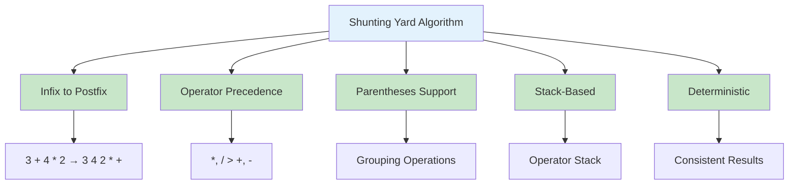
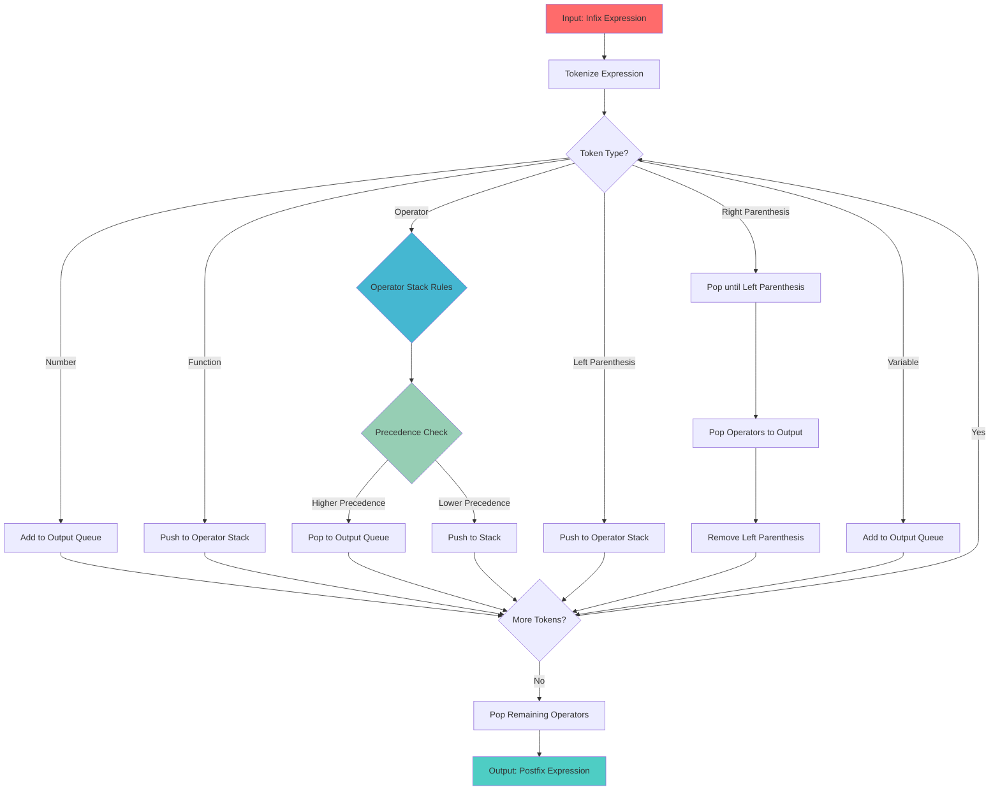
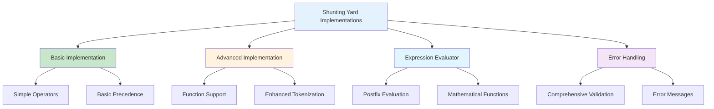
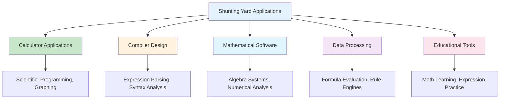
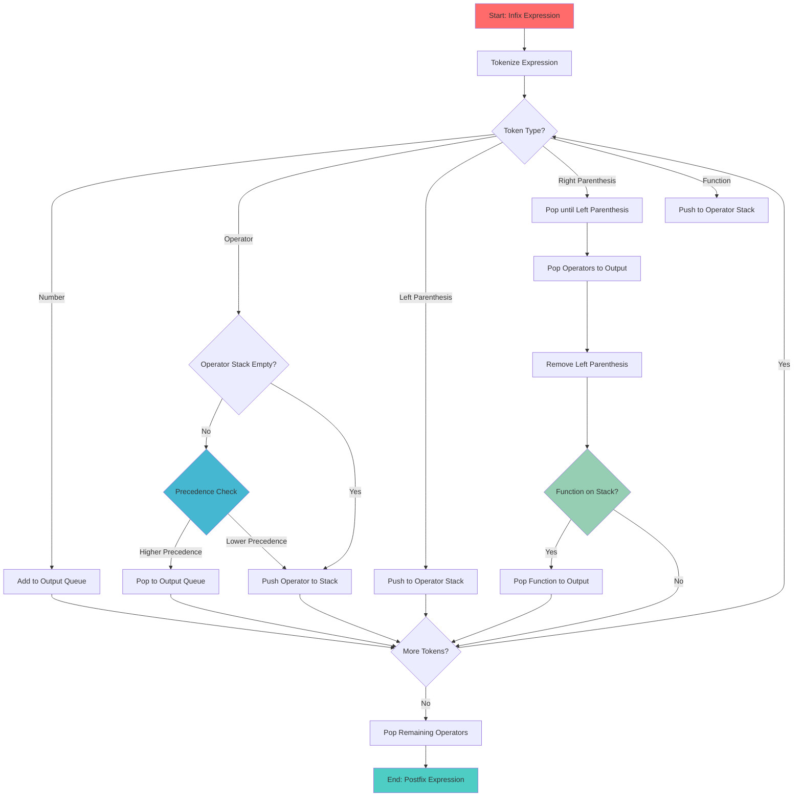
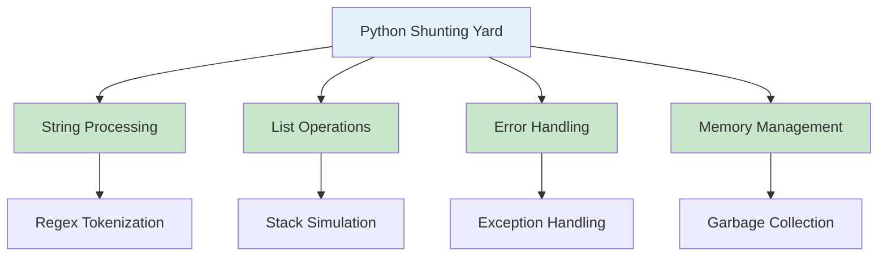

# Shunting Yard Algorithm in Python

## Table of Contents

1. [Introduction](#introduction)
2. [Algorithm Fundamentals](#algorithm-fundamentals)
3. [Implementation Methods](#implementation-methods)
4. [Algorithm Operations](#algorithm-operations)
5. [Advanced Applications](#advanced-applications)
6. [Performance Analysis](#performance-analysis)
7. [Use Cases and Applications](#use-cases-and-applications)
8. [Best Practices](#best-practices)
9. [Visual Representations](#visual-representations)

## Introduction

The Shunting Yard algorithm, developed by Edsger Dijkstra in 1961, is a method for parsing mathematical expressions specified in infix notation and converting them to postfix notation (Reverse Polish Notation, RPN). The algorithm is named "Shunting Yard" because its operation resembles that of a railroad shunting yard, where operators are "shunted" to the appropriate position.

### Key Characteristics

- **Infix to Postfix Conversion**: Converts mathematical expressions from infix to postfix notation
- **Operator Precedence**: Handles operator precedence and associativity correctly
- **Parentheses Support**: Properly handles nested parentheses and grouping
- **Stack-Based**: Uses a stack data structure for operator management
- **Deterministic**: Produces consistent results for the same input



## Algorithm Fundamentals

### Basic Shunting Yard Implementation

```python
class ShuntingYard:
    def __init__(self):
        # Operator precedence (higher number = higher precedence)
        self.precedence = {
            '+': 2, '-': 2,
            '*': 3, '/': 3, '%': 3,
            '^': 4, '**': 4,
            '!': 5  # Factorial (unary)
        }

        # Operator associativity ('L' for left, 'R' for right)
        self.associativity = {
            '+': 'L', '-': 'L',
            '*': 'L', '/': 'L', '%': 'L',
            '^': 'R', '**': 'R',
            '!': 'R'  # Right associative
        }

        # Unary operators
        self.unary_operators = {'+', '-', '!'}

        # Function names
        self.functions = {
            'sin', 'cos', 'tan', 'log', 'ln', 'sqrt', 'abs', 'max', 'min'
        }

    def tokenize(self, expression: str) -> list:
        """Tokenize the input expression into tokens."""
        import re

        # Regular expression to match numbers, operators, parentheses, and functions
        pattern = r'''
            \d+\.?\d*          # Numbers (integers and decimals)
            |[a-zA-Z_][a-zA-Z0-9_]*  # Function names and variables
            |[+\-*/%^!()]      # Operators and parentheses
            |\s+               # Whitespace
        '''

        tokens = re.findall(pattern, expression, re.VERBOSE)
        # Filter out whitespace tokens
        return [token for token in tokens if not token.isspace()]

    def is_number(self, token: str) -> bool:
        """Check if token is a number."""
        try:
            float(token)
            return True
        except ValueError:
            return False

    def is_function(self, token: str) -> bool:
        """Check if token is a function."""
        return token in self.functions

    def is_operator(self, token: str) -> bool:
        """Check if token is an operator."""
        return token in self.precedence

    def is_left_parenthesis(self, token: str) -> bool:
        """Check if token is a left parenthesis."""
        return token == '('

    def is_right_parenthesis(self, token: str) -> bool:
        """Check if token is a right parenthesis."""
        return token == ')'

    def get_precedence(self, operator: str) -> int:
        """Get precedence of an operator."""
        return self.precedence.get(operator, 0)

    def get_associativity(self, operator: str) -> str:
        """Get associativity of an operator."""
        return self.associativity.get(operator, 'L')

    def shunting_yard(self, expression: str) -> str:
        """Convert infix expression to postfix notation."""
        tokens = self.tokenize(expression)
        output_queue = []
        operator_stack = []

        for token in tokens:
            if self.is_number(token):
                output_queue.append(token)

            elif self.is_function(token):
                operator_stack.append(token)

            elif self.is_operator(token):
                while (operator_stack and
                       operator_stack[-1] != '(' and
                       operator_stack[-1] in self.functions or
                       (self.is_operator(operator_stack[-1]) and
                        ((self.get_associativity(token) == 'L' and
                          self.get_precedence(token) <= self.get_precedence(operator_stack[-1])) or
                         (self.get_associativity(token) == 'R' and
                          self.get_precedence(token) < self.get_precedence(operator_stack[-1]))))):
                    output_queue.append(operator_stack.pop())
                operator_stack.append(token)

            elif self.is_left_parenthesis(token):
                operator_stack.append(token)

            elif self.is_right_parenthesis(token):
                while operator_stack and operator_stack[-1] != '(':
                    output_queue.append(operator_stack.pop())
                if not operator_stack:
                    raise ValueError("Mismatched parentheses")
                operator_stack.pop()  # Remove '('

                # If there's a function on the stack, pop it
                if operator_stack and self.is_function(operator_stack[-1]):
                    output_queue.append(operator_stack.pop())

            else:
                # Assume it's a variable
                output_queue.append(token)

        # Pop remaining operators
        while operator_stack:
            if operator_stack[-1] == '(':
                raise ValueError("Mismatched parentheses")
            output_queue.append(operator_stack.pop())

        return ' '.join(output_queue)
```

### Algorithm Structure Visualization



## Implementation Methods

### 1. Basic Implementation with Error Handling

```python
class ShuntingYardBasic:
    def __init__(self):
        self.precedence = {'+': 2, '-': 2, '*': 3, '/': 3, '^': 4}
        self.associativity = {'+': 'L', '-': 'L', '*': 'L', '/': 'L', '^': 'R'}

    def convert(self, expression: str) -> str:
        """Convert infix to postfix with comprehensive error handling."""
        try:
            tokens = expression.split()
            output = []
            operators = []

            for token in tokens:
                if self._is_number(token):
                    output.append(token)
                elif token in self.precedence:
                    self._handle_operator(token, operators, output)
                elif token == '(':
                    operators.append(token)
                elif token == ')':
                    self._handle_right_parenthesis(operators, output)
                else:
                    raise ValueError(f"Unknown token: {token}")

            # Pop remaining operators
            while operators:
                if operators[-1] == '(':
                    raise ValueError("Mismatched parentheses")
                output.append(operators.pop())

            return ' '.join(output)

        except Exception as e:
            raise ValueError(f"Error parsing expression: {e}")

    def _is_number(self, token: str) -> bool:
        """Check if token is a number."""
        try:
            float(token)
            return True
        except ValueError:
            return False

    def _handle_operator(self, token: str, operators: list, output: list):
        """Handle operator precedence and associativity."""
        while (operators and
               operators[-1] != '(' and
               operators[-1] in self.precedence and
               ((self.associativity[token] == 'L' and
                 self.precedence[token] <= self.precedence[operators[-1]]) or
                (self.associativity[token] == 'R' and
                 self.precedence[token] < self.precedence[operators[-1]]))):
            output.append(operators.pop())
        operators.append(token)

    def _handle_right_parenthesis(self, operators: list, output: list):
        """Handle right parenthesis."""
        while operators and operators[-1] != '(':
            output.append(operators.pop())
        if not operators:
            raise ValueError("Mismatched parentheses")
        operators.pop()  # Remove '('
```

### 2. Advanced Implementation with Functions

```python
class ShuntingYardAdvanced:
    def __init__(self):
        self.precedence = {
            '+': 2, '-': 2,
            '*': 3, '/': 3, '%': 3,
            '^': 4, '**': 4,
            '!': 5
        }
        self.associativity = {
            '+': 'L', '-': 'L',
            '*': 'L', '/': 'L', '%': 'L',
            '^': 'R', '**': 'R',
            '!': 'R'
        }
        self.functions = {
            'sin', 'cos', 'tan', 'log', 'ln', 'sqrt', 'abs', 'max', 'min'
        }
        self.unary_operators = {'+', '-', '!'}

    def convert(self, expression: str) -> str:
        """Convert infix to postfix with function support."""
        import re

        # Enhanced tokenization with function support
        pattern = r'''
            \d+\.?\d*          # Numbers
            |[a-zA-Z_][a-zA-Z0-9_]*  # Functions and variables
            |[+\-*/%^!()]      # Operators and parentheses
            |\s+               # Whitespace
        '''

        tokens = re.findall(pattern, expression, re.VERBOSE)
        tokens = [token for token in tokens if not token.isspace()]

        output = []
        operators = []
        i = 0

        while i < len(tokens):
            token = tokens[i]

            if self._is_number(token):
                output.append(token)

            elif token in self.functions:
                operators.append(token)

            elif token in self.precedence:
                self._handle_operator(token, operators, output)

            elif token == '(':
                operators.append(token)

            elif token == ')':
                self._handle_right_parenthesis(operators, output)

            else:
                # Variable
                output.append(token)

            i += 1

        # Pop remaining operators
        while operators:
            if operators[-1] == '(':
                raise ValueError("Mismatched parentheses")
            output.append(operators.pop())

        return ' '.join(output)

    def _handle_operator(self, token: str, operators: list, output: list):
        """Handle operator with precedence and associativity."""
        while (operators and
               operators[-1] != '(' and
               (operators[-1] in self.functions or
                (operators[-1] in self.precedence and
                 ((self.associativity[token] == 'L' and
                   self.precedence[token] <= self.precedence[operators[-1]]) or
                  (self.associativity[token] == 'R' and
                   self.precedence[token] < self.precedence[operators[-1]]))))):
            output.append(operators.pop())
        operators.append(token)

    def _handle_right_parenthesis(self, operators: list, output: list):
        """Handle right parenthesis and function calls."""
        while operators and operators[-1] != '(':
            output.append(operators.pop())
        if not operators:
            raise ValueError("Mismatched parentheses")
        operators.pop()  # Remove '('

        # If there's a function on the stack, pop it
        if operators and operators[-1] in self.functions:
            output.append(operators.pop())
```

### 3. Expression Evaluator

```python
class PostfixEvaluator:
    def __init__(self):
        self.functions = {
            'sin': lambda x: math.sin(x),
            'cos': lambda x: math.cos(x),
            'tan': lambda x: math.tan(x),
            'log': lambda x: math.log10(x),
            'ln': lambda x: math.log(x),
            'sqrt': lambda x: math.sqrt(x),
            'abs': lambda x: abs(x),
            'max': lambda x, y: max(x, y),
            'min': lambda x, y: min(x, y)
        }

    def evaluate(self, postfix_expression: str) -> float:
        """Evaluate a postfix expression."""
        import math

        tokens = postfix_expression.split()
        stack = []

        for token in tokens:
            if self._is_number(token):
                stack.append(float(token))
            elif token in self.functions:
                if token in ['max', 'min']:
                    if len(stack) < 2:
                        raise ValueError(f"Function {token} requires 2 arguments")
                    b, a = stack.pop(), stack.pop()
                    result = self.functions[token](a, b)
                else:
                    if len(stack) < 1:
                        raise ValueError(f"Function {token} requires 1 argument")
                    a = stack.pop()
                    result = self.functions[token](a)
                stack.append(result)
            elif token in ['+', '-', '*', '/', '^', '%']:
                if len(stack) < 2:
                    raise ValueError(f"Operator {token} requires 2 operands")
                b, a = stack.pop(), stack.pop()
                result = self._apply_operator(token, a, b)
                stack.append(result)
            else:
                raise ValueError(f"Unknown token: {token}")

        if len(stack) != 1:
            raise ValueError("Invalid expression")

        return stack[0]

    def _is_number(self, token: str) -> bool:
        """Check if token is a number."""
        try:
            float(token)
            return True
        except ValueError:
            return False

    def _apply_operator(self, operator: str, a: float, b: float) -> float:
        """Apply operator to operands."""
        if operator == '+':
            return a + b
        elif operator == '-':
            return a - b
        elif operator == '*':
            return a * b
        elif operator == '/':
            if b == 0:
                raise ValueError("Division by zero")
            return a / b
        elif operator == '^':
            return a ** b
        elif operator == '%':
            if b == 0:
                raise ValueError("Modulo by zero")
            return a % b
        else:
            raise ValueError(f"Unknown operator: {operator}")
```

### Implementation Comparison



## Algorithm Operations

### 1. Expression Parsing

```python
class ExpressionParser:
    def __init__(self):
        self.shunting_yard = ShuntingYard()
        self.evaluator = PostfixEvaluator()

    def parse_and_evaluate(self, expression: str) -> float:
        """Parse infix expression and evaluate it."""
        try:
            # Convert to postfix
            postfix = self.shunting_yard.shunting_yard(expression)
            print(f"Infix: {expression}")
            print(f"Postfix: {postfix}")

            # Evaluate postfix
            result = self.evaluator.evaluate(postfix)
            return result
        except Exception as e:
            raise ValueError(f"Error parsing expression: {e}")

    def validate_expression(self, expression: str) -> bool:
        """Validate if expression is well-formed."""
        try:
            self.shunting_yard.shunting_yard(expression)
            return True
        except:
            return False

    def get_expression_tokens(self, expression: str) -> list:
        """Get tokens from expression."""
        return self.shunting_yard.tokenize(expression)
```

### 2. Advanced Operations

```python
class AdvancedShuntingYard:
    def __init__(self):
        self.precedence = {
            '+': 2, '-': 2,
            '*': 3, '/': 3, '%': 3,
            '^': 4, '**': 4,
            '!': 5
        }
        self.associativity = {
            '+': 'L', '-': 'L',
            '*': 'L', '/': 'L', '%': 'L',
            '^': 'R', '**': 'R',
            '!': 'R'
        }

    def convert_with_variables(self, expression: str, variables: dict = None) -> str:
        """Convert expression with variable substitution."""
        if variables is None:
            variables = {}

        tokens = self.shunting_yard.tokenize(expression)
        substituted_tokens = []

        for token in tokens:
            if token in variables:
                substituted_tokens.append(str(variables[token]))
            else:
                substituted_tokens.append(token)

        substituted_expression = ' '.join(substituted_tokens)
        return self.shunting_yard.shunting_yard(substituted_expression)

    def convert_to_ast(self, expression: str) -> dict:
        """Convert infix expression to Abstract Syntax Tree."""
        postfix = self.shunting_yard.shunting_yard(expression)
        tokens = postfix.split()
        stack = []

        for token in tokens:
            if self.shunting_yard.is_number(token):
                stack.append({'type': 'number', 'value': float(token)})
            elif token in self.precedence:
                if len(stack) < 2:
                    raise ValueError("Invalid expression")
                right = stack.pop()
                left = stack.pop()
                stack.append({
                    'type': 'operator',
                    'operator': token,
                    'left': left,
                    'right': right
                })
            else:
                stack.append({'type': 'variable', 'name': token})

        if len(stack) != 1:
            raise ValueError("Invalid expression")

        return stack[0]

    def optimize_expression(self, expression: str) -> str:
        """Optimize expression by removing unnecessary parentheses."""
        # This is a simplified optimization
        # In practice, you'd want more sophisticated optimization
        tokens = self.shunting_yard.tokenize(expression)
        optimized = []
        paren_count = 0

        for i, token in enumerate(tokens):
            if token == '(':
                paren_count += 1
                # Only add parenthesis if it's necessary
                if i > 0 and tokens[i-1] in self.precedence:
                    optimized.append(token)
            elif token == ')':
                paren_count -= 1
                if paren_count > 0:
                    optimized.append(token)
            else:
                optimized.append(token)

        return ' '.join(optimized)
```

## Advanced Applications

### 1. Calculator Application

```python
class Calculator:
    def __init__(self):
        self.parser = ExpressionParser()
        self.history = []

    def calculate(self, expression: str) -> float:
        """Calculate expression and store in history."""
        try:
            result = self.parser.parse_and_evaluate(expression)
            self.history.append({
                'expression': expression,
                'result': result,
                'timestamp': time.time()
            })
            return result
        except Exception as e:
            raise ValueError(f"Calculation error: {e}")

    def get_history(self) -> list:
        """Get calculation history."""
        return self.history

    def clear_history(self):
        """Clear calculation history."""
        self.history = []

    def evaluate_with_variables(self, expression: str, variables: dict) -> float:
        """Evaluate expression with variable substitution."""
        try:
            # Substitute variables
            substituted = expression
            for var, value in variables.items():
                substituted = substituted.replace(var, str(value))

            return self.calculate(substituted)
        except Exception as e:
            raise ValueError(f"Variable evaluation error: {e}")
```

### 2. Expression Validator

```python
class ExpressionValidator:
    def __init__(self):
        self.shunting_yard = ShuntingYard()

    def validate_syntax(self, expression: str) -> dict:
        """Validate expression syntax and return detailed results."""
        result = {
            'valid': False,
            'errors': [],
            'warnings': [],
            'tokens': []
        }

        try:
            tokens = self.shunting_yard.tokenize(expression)
            result['tokens'] = tokens

            # Check for balanced parentheses
            if not self._check_balanced_parentheses(tokens):
                result['errors'].append("Unbalanced parentheses")
                return result

            # Check for valid tokens
            for token in tokens:
                if not (self.shunting_yard.is_number(token) or
                       self.shunting_yard.is_operator(token) or
                       self.shunting_yard.is_function(token) or
                       token in ['(', ')'] or
                       self._is_variable(token)):
                    result['errors'].append(f"Invalid token: {token}")

            # Try to convert to postfix
            self.shunting_yard.shunting_yard(expression)
            result['valid'] = len(result['errors']) == 0

        except Exception as e:
            result['errors'].append(str(e))

        return result

    def _check_balanced_parentheses(self, tokens: list) -> bool:
        """Check if parentheses are balanced."""
        count = 0
        for token in tokens:
            if token == '(':
                count += 1
            elif token == ')':
                count -= 1
                if count < 0:
                    return False
        return count == 0

    def _is_variable(self, token: str) -> bool:
        """Check if token is a valid variable name."""
        import re
        return re.match(r'^[a-zA-Z_][a-zA-Z0-9_]*$', token) is not None
```

### 3. Mathematical Function Parser

```python
class MathFunctionParser:
    def __init__(self):
        self.shunting_yard = ShuntingYard()
        self.evaluator = PostfixEvaluator()

    def parse_function(self, function_def: str) -> dict:
        """Parse function definition like 'f(x) = x^2 + 2*x + 1'."""
        try:
            # Split function definition
            if '=' not in function_def:
                raise ValueError("Function definition must contain '='")

            left, right = function_def.split('=', 1)
            left = left.strip()
            right = right.strip()

            # Extract function name and parameters
            func_match = re.match(r'(\w+)\s*\((.*?)\)', left)
            if not func_match:
                raise ValueError("Invalid function definition format")

            func_name = func_match.group(1)
            params_str = func_match.group(2)
            parameters = [p.strip() for p in params_str.split(',') if p.strip()]

            # Convert expression to postfix
            postfix = self.shunting_yard.shunting_yard(right)

            return {
                'name': func_name,
                'parameters': parameters,
                'expression': right,
                'postfix': postfix
            }

        except Exception as e:
            raise ValueError(f"Error parsing function: {e}")

    def evaluate_function(self, func_def: dict, arguments: dict) -> float:
        """Evaluate function with given arguments."""
        if len(arguments) != len(func_def['parameters']):
            raise ValueError("Number of arguments doesn't match parameters")

        # Substitute arguments into expression
        expression = func_def['expression']
        for param, value in zip(func_def['parameters'], arguments.values()):
            expression = expression.replace(param, str(value))

        # Evaluate the expression
        return self.evaluator.evaluate(
            self.shunting_yard.shunting_yard(expression)
        )
```

## Performance Analysis

### Time Complexity

| Operation          | Time Complexity | Description                 |
| ------------------ | --------------- | --------------------------- |
| Tokenization       | O(n)            | Process each character once |
| Shunting Yard      | O(n)            | Process each token once     |
| Postfix Evaluation | O(n)            | Process each token once     |
| Overall            | O(n)            | Linear time complexity      |

### Space Complexity

| Aspect         | Space Complexity | Description               |
| -------------- | ---------------- | ------------------------- |
| Token Storage  | O(n)             | Store all tokens          |
| Operator Stack | O(n)             | Worst case: all operators |
| Output Queue   | O(n)             | Store all output tokens   |
| Overall        | O(n)             | Linear space complexity   |

### Python-Specific Performance

```mermaid
graph LR
    A[Python Performance] --> B[String Operations]
    A --> C[List Operations]
    A --> D[Stack Operations]
    A --> E[Memory Management]

    B --> F[O(n) Tokenization]
    C --> G[O(1) Append/Pop]
    D --> H[Efficient Stack]
    E --> I[Garbage Collection]

    style A fill:#e3f2fd
    style B fill:#c8e6c9
    style C fill:#c8e6c9
    style D fill:#c8e6c9
    style E fill:#c8e6c9
```

## Use Cases and Applications

### 1. Calculator Applications

- **Scientific Calculators**: Handle complex mathematical expressions
- **Programming Calculators**: Support variables and functions
- **Graphing Calculators**: Parse function definitions for plotting

### 2. Compiler Design

- **Expression Parsing**: Parse arithmetic expressions in programming languages
- **Syntax Analysis**: Convert infix expressions to postfix for evaluation
- **Code Generation**: Generate efficient code for expression evaluation

### 3. Mathematical Software

- **Computer Algebra Systems**: Parse and manipulate mathematical expressions
- **Numerical Analysis**: Convert expressions for numerical evaluation
- **Symbolic Mathematics**: Handle symbolic expressions and variables

### 4. Data Processing

- **Formula Evaluation**: Evaluate mathematical formulas in spreadsheets
- **Rule Engines**: Parse and evaluate business rules
- **Configuration Parsing**: Parse mathematical expressions in configuration files

### Application Areas



## Best Practices

### 1. Error Handling

```python
class RobustShuntingYard:
    def __init__(self):
        self.precedence = {'+': 2, '-': 2, '*': 3, '/': 3, '^': 4}
        self.associativity = {'+': 'L', '-': 'L', '*': 'L', '/': 'L', '^': 'R'}

    def convert(self, expression: str) -> str:
        """Convert with comprehensive error handling."""
        try:
            if not expression or not expression.strip():
                raise ValueError("Empty expression")

            tokens = self._tokenize_safely(expression)
            if not tokens:
                raise ValueError("No valid tokens found")

            return self._shunting_yard_safe(tokens)

        except Exception as e:
            raise ValueError(f"Error converting expression '{expression}': {e}")

    def _tokenize_safely(self, expression: str) -> list:
        """Safe tokenization with validation."""
        import re

        # More robust tokenization pattern
        pattern = r'''
            \d+\.?\d*          # Numbers
            |[a-zA-Z_][a-zA-Z0-9_]*  # Variables and functions
            |[+\-*/^()]        # Operators and parentheses
            |\s+               # Whitespace
        '''

        tokens = re.findall(pattern, expression, re.VERBOSE)
        tokens = [token for token in tokens if not token.isspace()]

        if not tokens:
            raise ValueError("No valid tokens found")

        return tokens

    def _shunting_yard_safe(self, tokens: list) -> str:
        """Safe shunting yard implementation."""
        output = []
        operators = []
        paren_count = 0

        for i, token in enumerate(tokens):
            if self._is_number(token):
                output.append(token)
            elif token in self.precedence:
                self._handle_operator_safe(token, operators, output)
            elif token == '(':
                operators.append(token)
                paren_count += 1
            elif token == ')':
                paren_count -= 1
                if paren_count < 0:
                    raise ValueError("Unbalanced parentheses")
                self._handle_right_parenthesis_safe(operators, output)
            else:
                # Assume variable
                output.append(token)

        if paren_count != 0:
            raise ValueError("Unbalanced parentheses")

        # Pop remaining operators
        while operators:
            if operators[-1] == '(':
                raise ValueError("Unbalanced parentheses")
            output.append(operators.pop())

        return ' '.join(output)

    def _handle_operator_safe(self, token: str, operators: list, output: list):
        """Safe operator handling."""
        while (operators and
               operators[-1] != '(' and
               operators[-1] in self.precedence and
               ((self.associativity[token] == 'L' and
                 self.precedence[token] <= self.precedence[operators[-1]]) or
                (self.associativity[token] == 'R' and
                 self.precedence[token] < self.precedence[operators[-1]]))):
            output.append(operators.pop())
        operators.append(token)

    def _handle_right_parenthesis_safe(self, operators: list, output: list):
        """Safe right parenthesis handling."""
        while operators and operators[-1] != '(':
            output.append(operators.pop())
        if not operators:
            raise ValueError("Unbalanced parentheses")
        operators.pop()  # Remove '('
```

### 2. Memory Management

```python
class MemoryEfficientShuntingYard:
    def __init__(self):
        self.precedence = {'+': 2, '-': 2, '*': 3, '/': 3, '^': 4}
        self.associativity = {'+': 'L', '-': 'L', '*': 'L', '/': 'L', '^': 'R'}

    def convert_streaming(self, expression: str) -> str:
        """Convert expression using streaming approach to minimize memory."""
        import re

        # Process expression character by character
        output = []
        operators = []
        current_token = ""
        paren_count = 0

        for char in expression:
            if char.isspace():
                if current_token:
                    self._process_token(current_token, operators, output)
                    current_token = ""
            elif char in self.precedence or char in '()':
                if current_token:
                    self._process_token(current_token, operators, output)
                    current_token = ""
                self._process_token(char, operators, output)
                if char == '(':
                    paren_count += 1
                elif char == ')':
                    paren_count -= 1
            else:
                current_token += char

        # Process final token
        if current_token:
            self._process_token(current_token, operators, output)

        if paren_count != 0:
            raise ValueError("Unbalanced parentheses")

        # Pop remaining operators
        while operators:
            output.append(operators.pop())

        return ' '.join(output)

    def _process_token(self, token: str, operators: list, output: list):
        """Process individual token."""
        if self._is_number(token):
            output.append(token)
        elif token in self.precedence:
            self._handle_operator(token, operators, output)
        elif token == '(':
            operators.append(token)
        elif token == ')':
            self._handle_right_parenthesis(operators, output)
        else:
            output.append(token)  # Variable
```

### 3. Validation

```python
class ShuntingYardValidator:
    def __init__(self):
        self.shunting_yard = ShuntingYard()

    def validate_expression(self, expression: str) -> dict:
        """Comprehensive expression validation."""
        result = {
            'valid': False,
            'errors': [],
            'warnings': [],
            'suggestions': []
        }

        try:
            # Basic validation
            if not expression or not expression.strip():
                result['errors'].append("Expression is empty")
                return result

            # Token validation
            tokens = self.shunting_yard.tokenize(expression)
            self._validate_tokens(tokens, result)

            # Syntax validation
            self._validate_syntax(tokens, result)

            # Try conversion
            self.shunting_yard.shunting_yard(expression)

            result['valid'] = len(result['errors']) == 0

        except Exception as e:
            result['errors'].append(str(e))

        return result

    def _validate_tokens(self, tokens: list, result: dict):
        """Validate individual tokens."""
        for token in tokens:
            if not (self.shunting_yard.is_number(token) or
                   self.shunting_yard.is_operator(token) or
                   self.shunting_yard.is_function(token) or
                   token in ['(', ')'] or
                   self._is_valid_variable(token)):
                result['errors'].append(f"Invalid token: {token}")

    def _validate_syntax(self, tokens: list, result: dict):
        """Validate expression syntax."""
        # Check parentheses balance
        paren_count = 0
        for token in tokens:
            if token == '(':
                paren_count += 1
            elif token == ')':
                paren_count -= 1
                if paren_count < 0:
                    result['errors'].append("Unbalanced parentheses")
                    return

        if paren_count != 0:
            result['errors'].append("Unbalanced parentheses")

        # Check for consecutive operators
        for i in range(len(tokens) - 1):
            if (tokens[i] in self.shunting_yard.precedence and
                tokens[i+1] in self.shunting_yard.precedence):
                result['warnings'].append(f"Consecutive operators: {tokens[i]} {tokens[i+1]}")

    def _is_valid_variable(self, token: str) -> bool:
        """Check if token is a valid variable name."""
        import re
        return re.match(r'^[a-zA-Z_][a-zA-Z0-9_]*$', token) is not None
```

## Visual Representations

### Shunting Yard Process Flow



### Python Shunting Yard Features



### Algorithm Comparison

```mermaid
graph TD
    A[Expression Parsing Algorithms] --> B[Shunting Yard]
    A --> C[Recursive Descent]
    A --> D[Operator Precedence]
    A --> E[Pratt Parser]

    B --> F[Stack-Based]
    B --> G[Infix to Postfix]
    B --> H[O(n) Complexity]

    C --> I[Recursive Approach]
    C --> J[Top-Down Parsing]
    C --> K[Grammar-Based]

    D --> L[Precedence Tables]
    D --> M[Bottom-Up Parsing]
    D --> N[Complex Implementation]

    E --> O[Pratt Parsing]
    E --> P[Precedence Climbing]
    E --> Q[Elegant Design]

    style B fill:#c8e6c9
    style C fill:#e1f5fe
    style D fill:#fff3e0
    style E fill:#f3e5f5
```

## Conclusion

The Shunting Yard algorithm in Python provides a robust and efficient method for converting infix mathematical expressions to postfix notation. Its stack-based approach, combined with proper handling of operator precedence and associativity, makes it an essential tool for expression parsing and evaluation.

Key advantages of Python Shunting Yard implementation:

- **Simplicity**: Clear and straightforward implementation using Python's list as stack
- **Flexibility**: Easy to extend with new operators and functions
- **Error Handling**: Comprehensive error detection and reporting
- **Performance**: O(n) time complexity with efficient memory usage
- **Maintainability**: Clean, readable code structure

The algorithm excels in scenarios requiring:

- Mathematical expression parsing and evaluation
- Calculator and computational applications
- Compiler design and syntax analysis
- Educational tools for learning expression parsing
- Data processing with mathematical formulas

Understanding the Shunting Yard algorithm, its implementation methods, and performance characteristics is crucial for building efficient expression parsing systems. The choice between different implementations depends on specific requirements:

- **Basic Implementation**: Simple operators, basic precedence handling
- **Advanced Implementation**: Function support, enhanced tokenization
- **Expression Evaluator**: Complete parsing and evaluation pipeline
- **Robust Implementation**: Comprehensive error handling and validation

The key to effective Python Shunting Yard usage lies in proper tokenization, stack management, and error handling. Python's rich string processing capabilities and list operations make it an excellent choice for implementing this algorithm.

Python's Shunting Yard implementation provides an excellent foundation for building robust expression parsing systems with comprehensive error handling and flexible operator support, making it an ideal choice for mathematical computing and compiler design applications.
