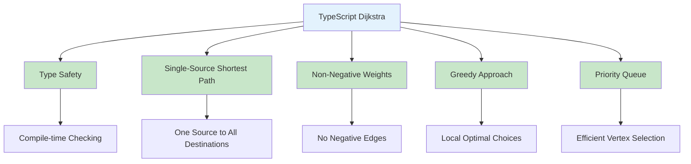
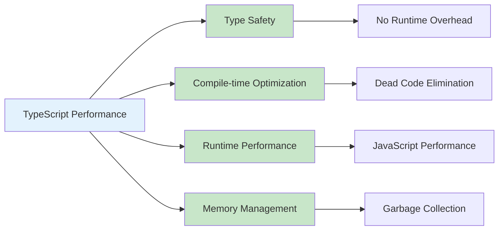
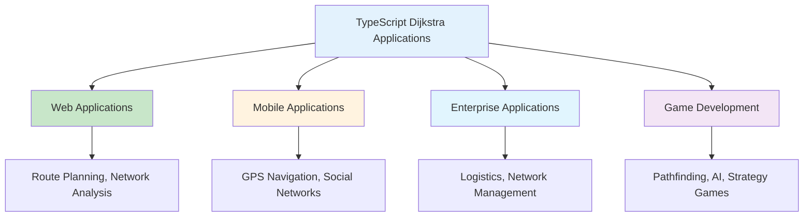
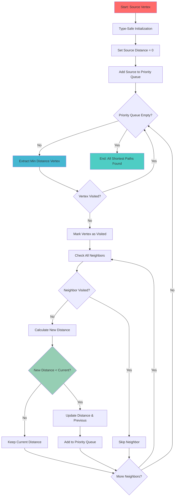
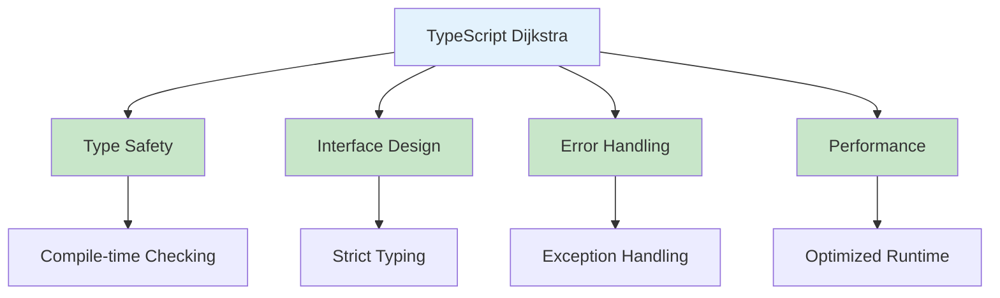

# Dijkstra's Algorithm in TypeScript

## Table of Contents

1. [Introduction](#introduction)
2. [Algorithm Fundamentals](#algorithm-fundamentals)
3. [Implementation Methods](#implementation-methods)
4. [Algorithm Operations](#algorithm-operations)
5. [Advanced Applications](#advanced-applications)
6. [Performance Analysis](#performance-analysis)
7. [Use Cases and Applications](#use-cases-and-applications)
8. [Best Practices](#best-practices)
9. [Visual Representations](#visual-representations)

## Introduction

Dijkstra's algorithm, developed by Edsger Dijkstra in 1956, is a graph search algorithm that finds the shortest path between nodes in a weighted graph with non-negative edge weights. In TypeScript, this algorithm provides type safety, generic support, and powerful abstractions for pathfinding with compile-time type checking.

### Key Characteristics

- **Single-Source Shortest Path**: Finds shortest paths from one source vertex to all other vertices
- **Type Safety**: Compile-time type checking for vertices, edges, and weights
- **Non-Negative Weights**: Only works with graphs having non-negative edge weights
- **Greedy Algorithm**: Makes locally optimal choices at each step
- **Priority Queue**: Uses a priority queue (heap) for efficient vertex selection



## Algorithm Fundamentals

### Basic Dijkstra Implementation

```typescript
interface Edge {
  to: string;
  weight: number;
}

interface Graph {
  [vertex: string]: Edge[];
}

interface DistanceMap {
  [vertex: string]: number;
}

interface PreviousMap {
  [vertex: string]: string | null;
}

interface PriorityQueueItem {
  distance: number;
  vertex: string;
}

class Dijkstra {
  private graph: Graph = {};
  private distances: DistanceMap = {};
  private previous: PreviousMap = {};
  private visited: Set<string> = new Set();

  addVertex(vertex: string): void {
    if (!this.graph[vertex]) {
      this.graph[vertex] = [];
    }
  }

  addEdge(from: string, to: string, weight: number): void {
    this.addVertex(from);
    this.addVertex(to);

    if (weight < 0) {
      throw new Error("Dijkstra algorithm requires non-negative weights");
    }

    this.graph[from].push({ to, weight });
  }

  findShortestPaths(startVertex: string): DistanceMap {
    // Initialize distances
    this.distances = {};
    this.previous = {};
    this.visited.clear();

    // Set all distances to infinity
    for (const vertex in this.graph) {
      this.distances[vertex] = Infinity;
      this.previous[vertex] = null;
    }

    // Set start vertex distance to 0
    this.distances[startVertex] = 0;

    // Priority queue: (distance, vertex)
    const priorityQueue: PriorityQueueItem[] = [{ distance: 0, vertex: startVertex }];

    while (priorityQueue.length > 0) {
      // Extract vertex with minimum distance
      const { distance: currentDistance, vertex: currentVertex } = this.extractMin(priorityQueue);

      // Skip if already visited
      if (this.visited.has(currentVertex)) {
        continue;
      }

      this.visited.add(currentVertex);

      // Check all neighbors
      for (const edge of this.graph[currentVertex]) {
        const { to: neighbor, weight } = edge;

        if (this.visited.has(neighbor)) {
          continue;
        }

        const newDistance = currentDistance + weight;

        // Update distance if shorter path found
        if (newDistance < this.distances[neighbor]) {
          this.distances[neighbor] = newDistance;
          this.previous[neighbor] = currentVertex;
          priorityQueue.push({ distance: newDistance, vertex: neighbor });
        }
      }
    }

    return { ...this.distances };
  }

  getShortestPath(startVertex: string, endVertex: string): string[] | null {
    this.findShortestPaths(startVertex);

    if (this.distances[endVertex] === Infinity) {
      return null; // No path exists
    }

    // Reconstruct path
    const path: string[] = [];
    let current: string | null = endVertex;

    while (current !== null) {
      path.unshift(current);
      current = this.previous[current];
    }

    return path;
  }

  getPathDistance(startVertex: string, endVertex: string): number {
    this.findShortestPaths(startVertex);
    return this.distances[endVertex];
  }

  private extractMin(queue: PriorityQueueItem[]): PriorityQueueItem {
    let minIndex = 0;
    for (let i = 1; i < queue.length; i++) {
      if (queue[i].distance < queue[minIndex].distance) {
        minIndex = i;
      }
    }
    return queue.splice(minIndex, 1)[0];
  }
}
```

### Algorithm Structure Visualization


## Implementation Methods

### 1. Type-Safe Implementation with Heap

```typescript
interface Vertex {
  id: string;
  edges: Edge[];
}

interface DijkstraResult {
  distances: DistanceMap;
  previous: PreviousMap;
  path: string[];
  totalDistance: number;
}

class TypeSafeDijkstra<T extends string = string> {
  private graph: Map<T, Edge[]> = new Map();
  private distances: Map<T, number> = new Map();
  private previous: Map<T, T | null> = new Map();
  private visited: Set<T> = new Set();

  addVertex(vertex: T): void {
    if (!this.graph.has(vertex)) {
      this.graph.set(vertex, []);
    }
  }

  addEdge(from: T, to: T, weight: number): void {
    this.addVertex(from);
    this.addVertex(to);

    if (weight < 0) {
      throw new Error("Dijkstra algorithm requires non-negative weights");
    }

    const edges = this.graph.get(from)!;
    edges.push({ to, weight });
  }

  findShortestPaths(startVertex: T): Map<T, number> {
    // Initialize
    this.distances.clear();
    this.previous.clear();
    this.visited.clear();

    // Set all distances to infinity
    for (const vertex of this.graph.keys()) {
      this.distances.set(vertex, Infinity);
      this.previous.set(vertex, null);
    }

    // Set start vertex distance to 0
    this.distances.set(startVertex, 0);

    // Priority queue using array (simplified heap)
    const priorityQueue: Array<{ distance: number; vertex: T }> = [{ distance: 0, vertex: startVertex }];

    while (priorityQueue.length > 0) {
      const { distance: currentDistance, vertex: currentVertex } = this.extractMin(priorityQueue);

      if (this.visited.has(currentVertex)) {
        continue;
      }

      this.visited.add(currentVertex);

      // Process neighbors
      const edges = this.graph.get(currentVertex) || [];
      for (const edge of edges) {
        const { to: neighbor, weight } = edge;

        if (this.visited.has(neighbor)) {
          continue;
        }

        const newDistance = currentDistance + weight;
        const currentNeighborDistance = this.distances.get(neighbor) || Infinity;

        if (newDistance < currentNeighborDistance) {
          this.distances.set(neighbor, newDistance);
          this.previous.set(neighbor, currentVertex);
          priorityQueue.push({ distance: newDistance, vertex: neighbor });
        }
      }
    }

    return new Map(this.distances);
  }

  getShortestPath(startVertex: T, endVertex: T): DijkstraResult | null {
    this.findShortestPaths(startVertex);

    const totalDistance = this.distances.get(endVertex);
    if (totalDistance === undefined || totalDistance === Infinity) {
      return null;
    }

    // Reconstruct path
    const path: T[] = [];
    let current: T | null = endVertex;

    while (current !== null) {
      path.unshift(current);
      current = this.previous.get(current) || null;
    }

    return {
      distances: Object.fromEntries(this.distances) as DistanceMap,
      previous: Object.fromEntries(this.previous) as PreviousMap,
      path,
      totalDistance,
    };
  }

  private extractMin(queue: Array<{ distance: number; vertex: T }>): { distance: number; vertex: T } {
    let minIndex = 0;
    for (let i = 1; i < queue.length; i++) {
      if (queue[i].distance < queue[minIndex].distance) {
        minIndex = i;
      }
    }
    return queue.splice(minIndex, 1)[0];
  }
}
```

### 2. Optimized Implementation with Binary Heap

```typescript
class BinaryHeap<T> {
  private heap: T[] = [];
  private compare: (a: T, b: T) => number;

  constructor(compare: (a: T, b: T) => number) {
    this.compare = compare;
  }

  push(item: T): void {
    this.heap.push(item);
    this.heapifyUp(this.heap.length - 1);
  }

  pop(): T | undefined {
    if (this.heap.length === 0) return undefined;
    if (this.heap.length === 1) return this.heap.pop();

    const min = this.heap[0];
    this.heap[0] = this.heap.pop()!;
    this.heapifyDown(0);
    return min;
  }

  peek(): T | undefined {
    return this.heap[0];
  }

  size(): number {
    return this.heap.length;
  }

  isEmpty(): boolean {
    return this.heap.length === 0;
  }

  private heapifyUp(index: number): void {
    if (index === 0) return;

    const parentIndex = Math.floor((index - 1) / 2);
    if (this.compare(this.heap[index], this.heap[parentIndex]) < 0) {
      [this.heap[index], this.heap[parentIndex]] = [this.heap[parentIndex], this.heap[index]];
      this.heapifyUp(parentIndex);
    }
  }

  private heapifyDown(index: number): void {
    const leftChild = 2 * index + 1;
    const rightChild = 2 * index + 2;
    let smallest = index;

    if (leftChild < this.heap.length && this.compare(this.heap[leftChild], this.heap[smallest]) < 0) {
      smallest = leftChild;
    }

    if (rightChild < this.heap.length && this.compare(this.heap[rightChild], this.heap[smallest]) < 0) {
      smallest = rightChild;
    }

    if (smallest !== index) {
      [this.heap[index], this.heap[smallest]] = [this.heap[smallest], this.heap[index]];
      this.heapifyDown(smallest);
    }
  }
}

class OptimizedDijkstra<T extends string = string> {
  private graph: Map<T, Edge[]> = new Map();
  private distances: Map<T, number> = new Map();
  private previous: Map<T, T | null> = new Map();
  private visited: Set<T> = new Set();

  addVertex(vertex: T): void {
    if (!this.graph.has(vertex)) {
      this.graph.set(vertex, []);
    }
  }

  addEdge(from: T, to: T, weight: number): void {
    this.addVertex(from);
    this.addVertex(to);

    if (weight < 0) {
      throw new Error("Dijkstra algorithm requires non-negative weights");
    }

    const edges = this.graph.get(from)!;
    edges.push({ to, weight });
  }

  findShortestPaths(startVertex: T): Map<T, number> {
    // Initialize
    this.distances.clear();
    this.previous.clear();
    this.visited.clear();

    // Set all distances to infinity
    for (const vertex of this.graph.keys()) {
      this.distances.set(vertex, Infinity);
      this.previous.set(vertex, null);
    }

    // Set start vertex distance to 0
    this.distances.set(startVertex, 0);

    // Priority queue using binary heap
    const priorityQueue = new BinaryHeap<{ distance: number; vertex: T }>((a, b) => a.distance - b.distance);
    priorityQueue.push({ distance: 0, vertex: startVertex });

    while (!priorityQueue.isEmpty()) {
      const { distance: currentDistance, vertex: currentVertex } = priorityQueue.pop()!;

      if (this.visited.has(currentVertex)) {
        continue;
      }

      this.visited.add(currentVertex);

      // Process neighbors
      const edges = this.graph.get(currentVertex) || [];
      for (const edge of edges) {
        const { to: neighbor, weight } = edge;

        if (this.visited.has(neighbor)) {
          continue;
        }

        const newDistance = currentDistance + weight;
        const currentNeighborDistance = this.distances.get(neighbor) || Infinity;

        if (newDistance < currentNeighborDistance) {
          this.distances.set(neighbor, newDistance);
          this.previous.set(neighbor, currentVertex);
          priorityQueue.push({ distance: newDistance, vertex: neighbor });
        }
      }
    }

    return new Map(this.distances);
  }

  getShortestPath(startVertex: T, endVertex: T): string[] | null {
    this.findShortestPaths(startVertex);

    const totalDistance = this.distances.get(endVertex);
    if (totalDistance === undefined || totalDistance === Infinity) {
      return null;
    }

    // Reconstruct path
    const path: T[] = [];
    let current: T | null = endVertex;

    while (current !== null) {
      path.unshift(current);
      current = this.previous.get(current) || null;
    }

    return path;
  }
}
```

### 3. A\* Algorithm Implementation

```typescript
interface HeuristicFunction<T> {
  (vertex: T, goal: T): number;
}

class AStar<T extends string = string> {
  private graph: Map<T, Edge[]> = new Map();
  private heuristic: HeuristicFunction<T>;

  constructor(heuristic: HeuristicFunction<T>) {
    this.heuristic = heuristic;
  }

  addVertex(vertex: T): void {
    if (!this.graph.has(vertex)) {
      this.graph.set(vertex, []);
    }
  }

  addEdge(from: T, to: T, weight: number): void {
    this.addVertex(from);
    this.addVertex(to);

    if (weight < 0) {
      throw new Error("A* algorithm requires non-negative weights");
    }

    const edges = this.graph.get(from)!;
    edges.push({ to, weight });
  }

  findPath(start: T, goal: T): { path: T[]; cost: number } | null {
    if (start === goal) {
      return { path: [start], cost: 0 };
    }

    // g_score: actual distance from start
    const gScore = new Map<T, number>();
    // f_score: g_score + heuristic
    const fScore = new Map<T, number>();
    const previous = new Map<T, T | null>();
    const openSet = new BinaryHeap<{ fScore: number; vertex: T }>((a, b) => a.fScore - b.fScore);
    const closedSet = new Set<T>();

    // Initialize scores
    for (const vertex of this.graph.keys()) {
      gScore.set(vertex, Infinity);
      fScore.set(vertex, Infinity);
    }

    gScore.set(start, 0);
    fScore.set(start, this.heuristic(start, goal));
    openSet.push({ fScore: fScore.get(start)!, vertex: start });
    previous.set(start, null);

    while (!openSet.isEmpty()) {
      const { vertex: current } = openSet.pop()!;

      if (current === goal) {
        // Reconstruct path
        const path: T[] = [];
        let node: T | null = current;
        while (node !== null) {
          path.unshift(node);
          node = previous.get(node) || null;
        }
        return { path, cost: gScore.get(goal)! };
      }

      closedSet.add(current);

      // Check neighbors
      const edges = this.graph.get(current) || [];
      for (const edge of edges) {
        const { to: neighbor, weight } = edge;

        if (closedSet.has(neighbor)) {
          continue;
        }

        const tentativeGScore = gScore.get(current)! + weight;
        const currentGScore = gScore.get(neighbor) || Infinity;

        if (tentativeGScore < currentGScore) {
          gScore.set(neighbor, tentativeGScore);
          fScore.set(neighbor, tentativeGScore + this.heuristic(neighbor, goal));
          previous.set(neighbor, current);
          openSet.push({ fScore: fScore.get(neighbor)!, vertex: neighbor });
        }
      }
    }

    return null; // No path found
  }
}
```

## Advanced Applications

### 1. Network Router

```typescript
interface Router {
  id: string;
  connections: Map<string, number>; // neighbor -> latency
}

interface RouteResult {
  path: string[];
  totalLatency: number;
  hopCount: number;
  routers: string[];
}

class NetworkRouter {
  private dijkstra: OptimizedDijkstra<string>;
  private routers: Map<string, Router> = new Map();

  constructor() {
    this.dijkstra = new OptimizedDijkstra();
  }

  addRouter(router: Router): void {
    this.routers.set(router.id, router);

    for (const [neighbor, latency] of router.connections) {
      this.dijkstra.addEdge(router.id, neighbor, latency);
    }
  }

  findOptimalRoute(source: string, destination: string): RouteResult | null {
    const path = this.dijkstra.getShortestPath(source, destination);

    if (!path) {
      return null;
    }

    const totalLatency = this.dijkstra.getPathDistance(source, destination);

    return {
      path,
      totalLatency,
      hopCount: path.length - 1,
      routers: path,
    };
  }

  getNetworkStatistics(source: string): {
    reachableRouters: number;
    averageLatency: number;
    maxLatency: number;
    distances: DistanceMap;
  } {
    const distances = this.dijkstra.findShortestPaths(source);
    const reachableDistances = Array.from(distances.values()).filter(d => d !== Infinity);

    return {
      reachableRouters: reachableDistances.length,
      averageLatency: reachableDistances.reduce((a, b) => a + b, 0) / reachableDistances.length,
      maxLatency: Math.max(...reachableDistances),
      distances: Object.fromEntries(distances) as DistanceMap,
    };
  }
}
```

### 2. GPS Navigator

```typescript
interface Location {
  id: string;
  coordinates: { lat: number; lng: number };
}

interface RouteDetails {
  step: number;
  location: string;
  coordinates: { lat: number; lng: number };
}

interface NavigationResult {
  route: string[];
  totalDistance: number;
  steps: number;
  routeDetails: RouteDetails[];
}

class GPSNavigator {
  private dijkstra: OptimizedDijkstra<string>;
  private locations: Map<string, Location> = new Map();

  constructor() {
    this.dijkstra = new OptimizedDijkstra();
  }

  addLocation(location: Location): void {
    this.locations.set(location.id, location);
  }

  addRoad(fromLocation: string, toLocation: string, distance: number): void {
    this.dijkstra.addEdge(fromLocation, toLocation, distance);
  }

  calculateRoute(start: string, end: string): NavigationResult | null {
    const route = this.dijkstra.getShortestPath(start, end);

    if (!route) {
      return null;
    }

    const totalDistance = this.dijkstra.getPathDistance(start, end);

    const routeDetails: RouteDetails[] = route.map((location, index) => ({
      step: index + 1,
      location,
      coordinates: this.locations.get(location)?.coordinates || { lat: 0, lng: 0 },
    }));

    return {
      route,
      totalDistance,
      steps: route.length,
      routeDetails,
    };
  }

  findNearbyLocations(center: string, maxDistance: number): string[] {
    const distances = this.dijkstra.findShortestPaths(center);
    return Array.from(distances.entries())
      .filter(([location, distance]) => distance <= maxDistance && location !== center)
      .map(([location]) => location);
  }

  private calculateDistance(location1: string, location2: string): number {
    const loc1 = this.locations.get(location1);
    const loc2 = this.locations.get(location2);

    if (!loc1 || !loc2) return Infinity;

    // Haversine formula for real distance
    const R = 6371; // Earth's radius in km
    const dLat = ((loc2.coordinates.lat - loc1.coordinates.lat) * Math.PI) / 180;
    const dLng = ((loc2.coordinates.lng - loc1.coordinates.lng) * Math.PI) / 180;
    const a =
      Math.sin(dLat / 2) * Math.sin(dLat / 2) +
      Math.cos((loc1.coordinates.lat * Math.PI) / 180) *
        Math.cos((loc2.coordinates.lat * Math.PI) / 180) *
        Math.sin(dLng / 2) *
        Math.sin(dLng / 2);
    const c = 2 * Math.atan2(Math.sqrt(a), Math.sqrt(1 - a));

    return R * c;
  }
}
```

## Performance Analysis

### Time Complexity

| Operation           | Time Complexity  | Description         |
| ------------------- | ---------------- | ------------------- |
| Basic Dijkstra      | O((V + E) log V) | With binary heap    |
| Optimized Dijkstra  | O((V + E) log V) | With efficient heap |
| A\*                 | O((V + E) log V) | With good heuristic |
| Path Reconstruction | O(V)             | Linear time         |

### Space Complexity

| Aspect         | Space Complexity | Description     |
| -------------- | ---------------- | --------------- |
| Graph Storage  | O(V + E)         | Adjacency list  |
| Distance Map   | O(V)             | Store distances |
| Priority Queue | O(V)             | Store vertices  |
| Overall        | O(V + E)         | Linear space    |

### TypeScript-Specific Performance



## Use Cases and Applications

### 1. Web Applications

- **Route Planning**: Web-based navigation and mapping
- **Network Analysis**: Analyze network topologies and routing
- **Game Development**: Pathfinding in browser-based games

### 2. Mobile Applications

- **GPS Navigation**: Mobile navigation applications
- **Social Networks**: Friend recommendations and network analysis
- **Transportation**: Public transit and ride-sharing optimization

### 3. Enterprise Applications

- **Logistics**: Delivery route optimization
- **Network Management**: IT network routing and analysis
- **Resource Planning**: Optimize resource allocation and scheduling

### Application Areas



## Best Practices

### 1. Type Safety

```typescript
// Use strict typing for vertices and edges
type VertexId = string & { readonly brand: unique symbol };
type Weight = number & { readonly brand: unique symbol };

interface StrictEdge {
  readonly to: VertexId;
  readonly weight: Weight;
}

class StrictDijkstra {
  private graph: Map<VertexId, StrictEdge[]> = new Map();

  addEdge(from: VertexId, to: VertexId, weight: Weight): void {
    // Type-safe edge addition
  }
}
```

### 2. Error Handling

```typescript
class RobustDijkstra<T extends string = string> {
  private graph: Map<T, Edge[]> = new Map();

  findShortestPaths(startVertex: T): Map<T, number> {
    try {
      if (!this.graph.has(startVertex)) {
        throw new Error(`Start vertex '${startVertex}' not found in graph`);
      }

      if (this.graph.size === 0) {
        throw new Error("Graph is empty");
      }

      // Validate no negative weights
      for (const [vertex, edges] of this.graph) {
        for (const edge of edges) {
          if (edge.weight < 0) {
            throw new Error(`Negative weight found: ${vertex} -> ${edge.to} = ${edge.weight}`);
          }
        }
      }

      return this._dijkstraImplementation(startVertex);
    } catch (error) {
      throw new Error(`Dijkstra algorithm failed: ${error instanceof Error ? error.message : "Unknown error"}`);
    }
  }

  private _dijkstraImplementation(startVertex: T): Map<T, number> {
    // Implementation here
    return new Map();
  }
}
```

### 3. Memory Management

```typescript
class MemoryEfficientDijkstra<T extends string = string> {
  private graph: Map<T, Edge[]> = new Map();
  private maxVertices: number;

  constructor(maxVertices: number = 10000) {
    this.maxVertices = maxVertices;
  }

  addVertex(vertex: T): boolean {
    if (this.graph.size >= this.maxVertices) {
      return false;
    }

    if (!this.graph.has(vertex)) {
      this.graph.set(vertex, []);
    }
    return true;
  }

  clearGraph(): void {
    this.graph.clear();
  }

  getMemoryUsage(): { vertices: number; edges: number } {
    let totalEdges = 0;
    for (const edges of this.graph.values()) {
      totalEdges += edges.length;
    }

    return {
      vertices: this.graph.size,
      edges: totalEdges,
    };
  }
}
```

## Visual Representations

### TypeScript Dijkstra Process



### TypeScript Features



## Conclusion

Dijkstra's algorithm in TypeScript provides a robust, type-safe method for finding shortest paths in weighted graphs. Its combination of compile-time type checking, interface design, and efficient data structures makes it an excellent choice for modern web applications and pathfinding systems.

Key advantages of TypeScript Dijkstra implementation:

- **Type Safety**: Compile-time type checking prevents runtime errors
- **Interface Design**: Clean, maintainable code structure with strict typing
- **Performance**: O((V + E) log V) time complexity with efficient heap operations
- **Flexibility**: Generic support for different vertex types
- **Error Handling**: Comprehensive error detection and reporting

The algorithm excels in scenarios requiring:

- Web-based navigation and route planning
- Network routing and topology analysis
- Game development and AI pathfinding
- Mobile applications with GPS functionality
- Enterprise logistics and resource optimization

Understanding Dijkstra's algorithm, its TypeScript implementation, and performance characteristics is crucial for building efficient pathfinding systems. The choice between different implementations depends on specific requirements:

- **Basic Implementation**: Simple graphs, straightforward shortest path finding
- **Type-Safe Implementation**: Strict typing, compile-time safety
- **Optimized Implementation**: Large graphs, performance-critical applications
- **A\* Algorithm**: Informed search with heuristics, goal-directed pathfinding

The key to effective TypeScript Dijkstra usage lies in leveraging the type system for safety, implementing proper error handling, and following best practices for interface design and memory management.

TypeScript's Dijkstra implementation provides an excellent foundation for building robust pathfinding systems with compile-time safety and runtime performance, making it an ideal choice for modern web development, mobile applications, and enterprise pathfinding solutions.
