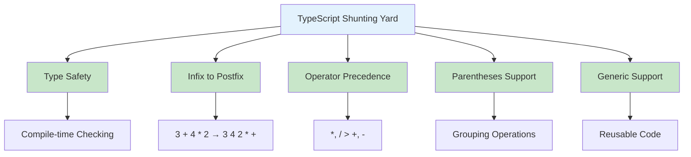
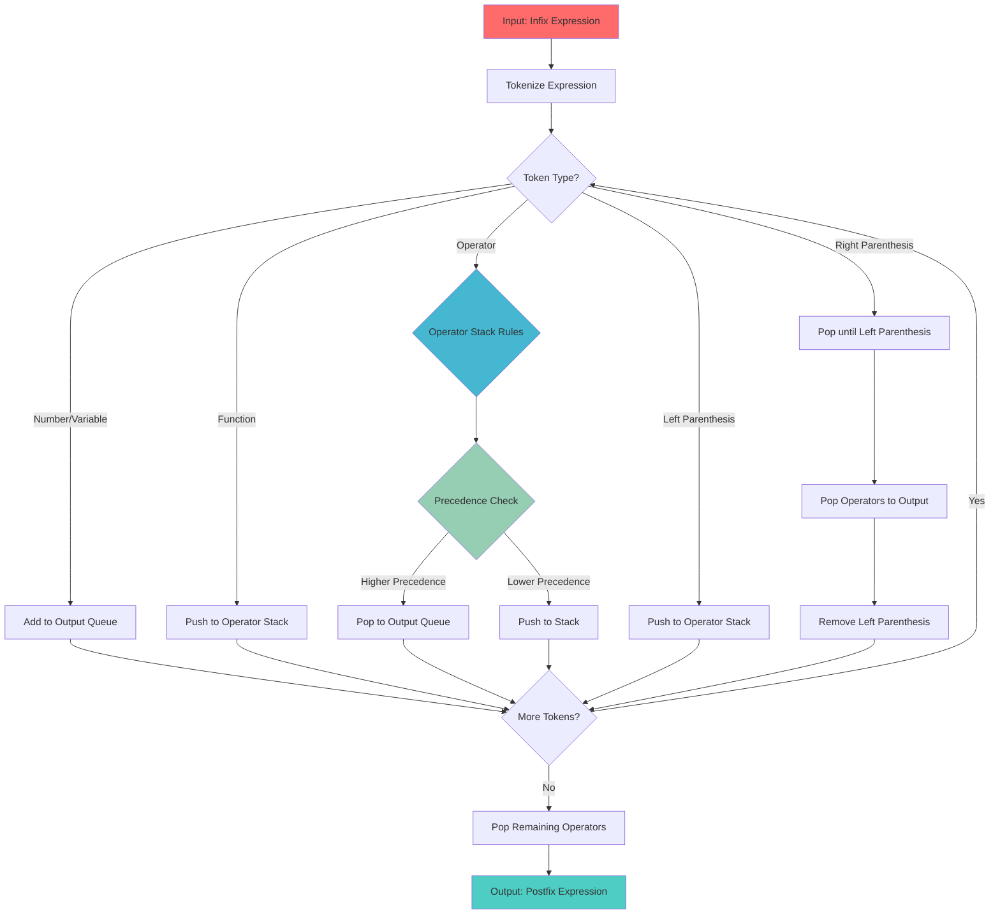
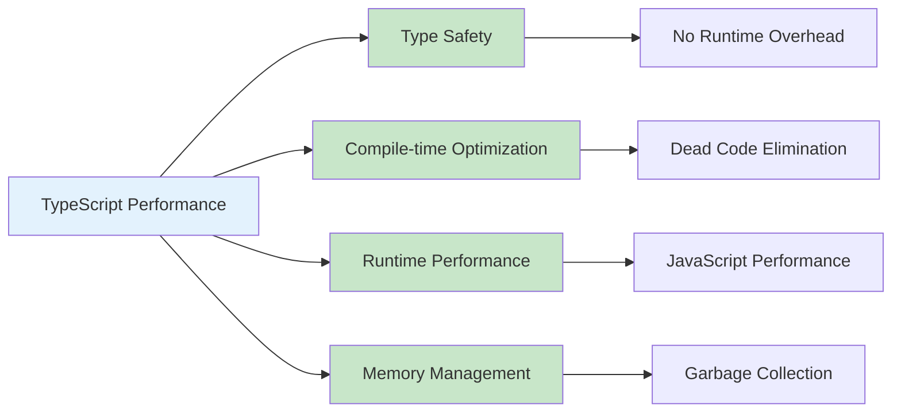
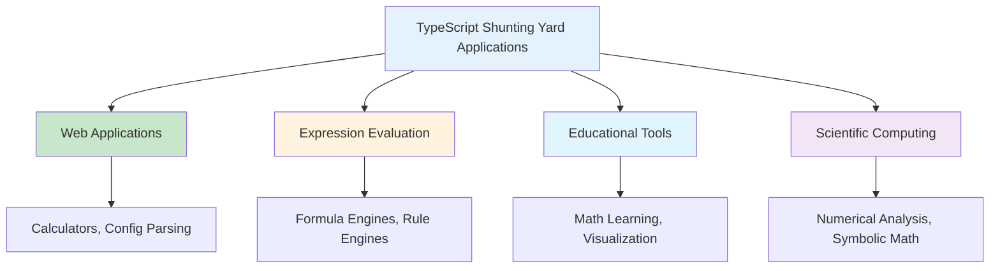
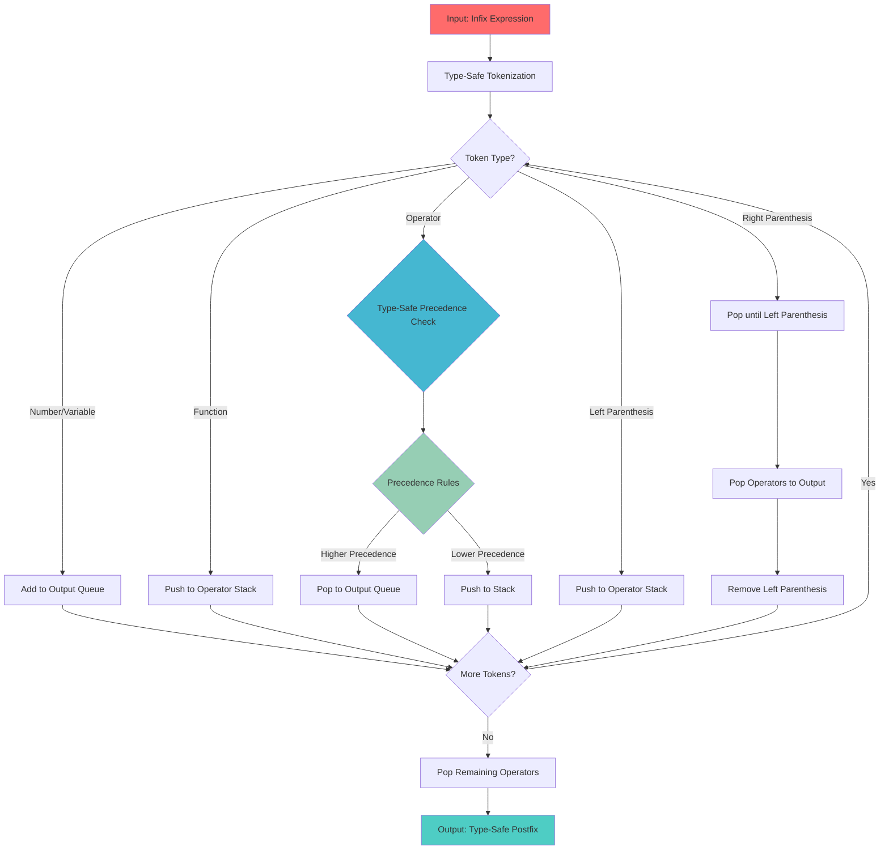
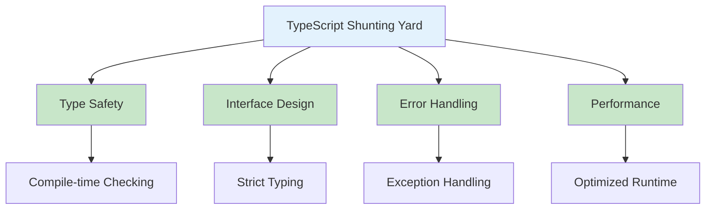

# Shunting Yard Algorithm in TypeScript

## Table of Contents

1. [Introduction](#introduction)
2. [Algorithm Fundamentals](#algorithm-fundamentals)
3. [Implementation Methods](#implementation-methods)
4. [Algorithm Operations](#algorithm-operations)
5. [Advanced Applications](#advanced-applications)
6. [Performance Analysis](#performance-analysis)
7. [Use Cases and Applications](#use-cases-and-applications)
8. [Best Practices](#best-practices)
9. [Visual Representations](#visual-representations)

## Introduction

The Shunting Yard algorithm, developed by Edsger Dijkstra in 1961, is a method for parsing mathematical expressions specified in infix notation and converting them to postfix notation (Reverse Polish Notation, RPN). In TypeScript, this algorithm provides type safety, generic support, and powerful abstractions for expression parsing with compile-time type checking.

### Key Characteristics

- **Infix to Postfix Conversion**: Converts mathematical expressions from infix to postfix notation
- **Type Safety**: Compile-time type checking for tokens and operations
- **Operator Precedence**: Handles operator precedence and associativity correctly
- **Parentheses Support**: Properly handles nested parentheses and grouping
- **Stack-Based**: Uses a stack data structure for operator management



## Algorithm Fundamentals

### Basic Shunting Yard Implementation

```typescript
interface Token {
  type: "number" | "operator" | "function" | "parenthesis" | "variable";
  value: string;
  precedence?: number;
  associativity?: "left" | "right";
}

interface OperatorConfig {
  precedence: number;
  associativity: "left" | "right";
}

class ShuntingYard {
  private precedence: Map<string, number> = new Map([
    ["+", 2],
    ["-", 2],
    ["*", 3],
    ["/", 3],
    ["%", 3],
    ["^", 4],
    ["**", 4],
    ["!", 5],
  ]);

  private associativity: Map<string, "left" | "right"> = new Map([
    ["+", "left"],
    ["-", "left"],
    ["*", "left"],
    ["/", "left"],
    ["%", "left"],
    ["^", "right"],
    ["**", "right"],
    ["!", "right"],
  ]);

  private functions: Set<string> = new Set(["sin", "cos", "tan", "log", "ln", "sqrt", "abs", "max", "min"]);

  tokenize(expression: string): Token[] {
    const tokens: Token[] = [];
    const regex = /(\d+\.?\d*|[a-zA-Z_][a-zA-Z0-9_]*|[+\-*/%^!()]|\s+)/g;
    let match;

    while ((match = regex.exec(expression)) !== null) {
      const token = match[0];
      if (token.trim() === "") continue;

      if (this.isNumber(token)) {
        tokens.push({ type: "number", value: token });
      } else if (this.functions.has(token)) {
        tokens.push({ type: "function", value: token });
      } else if (this.precedence.has(token)) {
        tokens.push({
          type: "operator",
          value: token,
          precedence: this.precedence.get(token),
          associativity: this.associativity.get(token),
        });
      } else if (token === "(" || token === ")") {
        tokens.push({ type: "parenthesis", value: token });
      } else {
        tokens.push({ type: "variable", value: token });
      }
    }

    return tokens;
  }

  private isNumber(token: string): boolean {
    return !isNaN(parseFloat(token)) && isFinite(parseFloat(token));
  }

  convert(expression: string): string {
    const tokens = this.tokenize(expression);
    const output: string[] = [];
    const operators: Token[] = [];

    for (const token of tokens) {
      switch (token.type) {
        case "number":
        case "variable":
          output.push(token.value);
          break;

        case "function":
          operators.push(token);
          break;

        case "operator":
          this.handleOperator(token, operators, output);
          break;

        case "parenthesis":
          if (token.value === "(") {
            operators.push(token);
          } else {
            this.handleRightParenthesis(operators, output);
          }
          break;
      }
    }

    // Pop remaining operators
    while (operators.length > 0) {
      const op = operators.pop()!;
      if (op.value === "(") {
        throw new Error("Mismatched parentheses");
      }
      output.push(op.value);
    }

    return output.join(" ");
  }

  private handleOperator(token: Token, operators: Token[], output: string[]): void {
    while (operators.length > 0) {
      const top = operators[operators.length - 1];

      if (top.value === "(" || top.type === "function") {
        break;
      }

      if (top.type === "operator") {
        const shouldPop =
          (token.associativity === "left" && token.precedence! <= top.precedence!) ||
          (token.associativity === "right" && token.precedence! < top.precedence!);

        if (!shouldPop) break;
      }

      output.push(operators.pop()!.value);
    }

    operators.push(token);
  }

  private handleRightParenthesis(operators: Token[], output: string[]): void {
    while (operators.length > 0 && operators[operators.length - 1].value !== "(") {
      output.push(operators.pop()!.value);
    }

    if (operators.length === 0) {
      throw new Error("Mismatched parentheses");
    }

    operators.pop(); // Remove '('

    // If there's a function on the stack, pop it
    if (operators.length > 0 && operators[operators.length - 1].type === "function") {
      output.push(operators.pop()!.value);
    }
  }
}
```

### Algorithm Structure Visualization



## Implementation Methods

### 1. Type-Safe Implementation

```typescript
interface ExpressionToken {
  readonly type: "number" | "operator" | "function" | "parenthesis" | "variable";
  readonly value: string;
  readonly precedence?: number;
  readonly associativity?: "left" | "right";
}

interface OperatorDefinition {
  readonly precedence: number;
  readonly associativity: "left" | "right";
  readonly arity: "unary" | "binary";
}

class TypeSafeShuntingYard {
  private readonly operators: Map<string, OperatorDefinition> = new Map([
    ["+", { precedence: 2, associativity: "left", arity: "binary" }],
    ["-", { precedence: 2, associativity: "left", arity: "binary" }],
    ["*", { precedence: 3, associativity: "left", arity: "binary" }],
    ["/", { precedence: 3, associativity: "left", arity: "binary" }],
    ["^", { precedence: 4, associativity: "right", arity: "binary" }],
    ["!", { precedence: 5, associativity: "right", arity: "unary" }],
  ]);

  private readonly functions: ReadonlySet<string> = new Set(["sin", "cos", "tan", "log", "ln", "sqrt", "abs"]);

  convert(expression: string): string {
    const tokens = this.tokenize(expression);
    const output: string[] = [];
    const stack: ExpressionToken[] = [];

    for (const token of tokens) {
      switch (token.type) {
        case "number":
        case "variable":
          output.push(token.value);
          break;

        case "function":
          stack.push(token);
          break;

        case "operator":
          this.processOperator(token, stack, output);
          break;

        case "parenthesis":
          if (token.value === "(") {
            stack.push(token);
          } else {
            this.processRightParenthesis(stack, output);
          }
          break;
      }
    }

    this.popRemainingOperators(stack, output);
    return output.join(" ");
  }

  private processOperator(token: ExpressionToken, stack: ExpressionToken[], output: string[]): void {
    const operatorDef = this.operators.get(token.value);
    if (!operatorDef) {
      throw new Error(`Unknown operator: ${token.value}`);
    }

    while (stack.length > 0) {
      const top = stack[stack.length - 1];

      if (top.value === "(" || top.type === "function") {
        break;
      }

      if (top.type === "operator" && top.precedence !== undefined) {
        const shouldPop =
          (operatorDef.associativity === "left" && operatorDef.precedence <= top.precedence) ||
          (operatorDef.associativity === "right" && operatorDef.precedence < top.precedence);

        if (!shouldPop) break;
      }

      output.push(stack.pop()!.value);
    }

    stack.push(token);
  }

  private processRightParenthesis(stack: ExpressionToken[], output: string[]): void {
    while (stack.length > 0 && stack[stack.length - 1].value !== "(") {
      output.push(stack.pop()!.value);
    }

    if (stack.length === 0) {
      throw new Error("Mismatched parentheses");
    }

    stack.pop(); // Remove '('

    // Pop function if present
    if (stack.length > 0 && stack[stack.length - 1].type === "function") {
      output.push(stack.pop()!.value);
    }
  }

  private popRemainingOperators(stack: ExpressionToken[], output: string[]): void {
    while (stack.length > 0) {
      const token = stack.pop()!;
      if (token.value === "(") {
        throw new Error("Mismatched parentheses");
      }
      output.push(token.value);
    }
  }

  private tokenize(expression: string): ExpressionToken[] {
    const tokens: ExpressionToken[] = [];
    const regex = /(\d+\.?\d*|[a-zA-Z_][a-zA-Z0-9_]*|[+\-*/%^!()]|\s+)/g;
    let match;

    while ((match = regex.exec(expression)) !== null) {
      const value = match[0];
      if (value.trim() === "") continue;

      if (this.isNumber(value)) {
        tokens.push({ type: "number", value });
      } else if (this.functions.has(value)) {
        tokens.push({ type: "function", value });
      } else if (this.operators.has(value)) {
        const def = this.operators.get(value)!;
        tokens.push({
          type: "operator",
          value,
          precedence: def.precedence,
          associativity: def.associativity,
        });
      } else if (value === "(" || value === ")") {
        tokens.push({ type: "parenthesis", value });
      } else {
        tokens.push({ type: "variable", value });
      }
    }

    return tokens;
  }

  private isNumber(value: string): boolean {
    return !isNaN(parseFloat(value)) && isFinite(parseFloat(value));
  }
}
```

### 2. Postfix Evaluator

```typescript
interface MathFunction {
  (x: number): number;
}

interface BinaryMathFunction {
  (x: number, y: number): number;
}

class PostfixEvaluator {
  private readonly functions: Map<string, MathFunction> = new Map([
    ["sin", Math.sin],
    ["cos", Math.cos],
    ["tan", Math.tan],
    ["log", Math.log10],
    ["ln", Math.log],
    ["sqrt", Math.sqrt],
    ["abs", Math.abs],
  ]);

  private readonly binaryFunctions: Map<string, BinaryMathFunction> = new Map([
    ["max", Math.max],
    ["min", Math.min],
  ]);

  evaluate(postfixExpression: string): number {
    const tokens = postfixExpression.split(" ");
    const stack: number[] = [];

    for (const token of tokens) {
      if (this.isNumber(token)) {
        stack.push(parseFloat(token));
      } else if (this.functions.has(token)) {
        if (stack.length < 1) {
          throw new Error(`Function ${token} requires 1 argument`);
        }
        const arg = stack.pop()!;
        const result = this.functions.get(token)!(arg);
        stack.push(result);
      } else if (this.binaryFunctions.has(token)) {
        if (stack.length < 2) {
          throw new Error(`Function ${token} requires 2 arguments`);
        }
        const b = stack.pop()!;
        const a = stack.pop()!;
        const result = this.binaryFunctions.get(token)!(a, b);
        stack.push(result);
      } else if (this.isOperator(token)) {
        if (stack.length < 2) {
          throw new Error(`Operator ${token} requires 2 operands`);
        }
        const b = stack.pop()!;
        const a = stack.pop()!;
        const result = this.applyOperator(token, a, b);
        stack.push(result);
      } else {
        throw new Error(`Unknown token: ${token}`);
      }
    }

    if (stack.length !== 1) {
      throw new Error("Invalid expression");
    }

    return stack[0];
  }

  private isNumber(token: string): boolean {
    return !isNaN(parseFloat(token)) && isFinite(parseFloat(token));
  }

  private isOperator(token: string): boolean {
    return ["+", "-", "*", "/", "^", "%"].includes(token);
  }

  private applyOperator(operator: string, a: number, b: number): number {
    switch (operator) {
      case "+":
        return a + b;
      case "-":
        return a - b;
      case "*":
        return a * b;
      case "/":
        if (b === 0) throw new Error("Division by zero");
        return a / b;
      case "^":
        return Math.pow(a, b);
      case "%":
        if (b === 0) throw new Error("Modulo by zero");
        return a % b;
      default:
        throw new Error(`Unknown operator: ${operator}`);
    }
  }
}
```

### 3. Expression Parser with Error Handling

```typescript
interface ParseResult {
  success: boolean;
  postfix?: string;
  error?: string;
  tokens?: ExpressionToken[];
}

class ExpressionParser {
  private readonly shuntingYard: TypeSafeShuntingYard;
  private readonly evaluator: PostfixEvaluator;

  constructor() {
    this.shuntingYard = new TypeSafeShuntingYard();
    this.evaluator = new PostfixEvaluator();
  }

  parse(expression: string): ParseResult {
    try {
      if (!expression || !expression.trim()) {
        return { success: false, error: "Empty expression" };
      }

      const tokens = this.shuntingYard.tokenize(expression);
      if (tokens.length === 0) {
        return { success: false, error: "No valid tokens found" };
      }

      const postfix = this.shuntingYard.convert(expression);
      return { success: true, postfix, tokens };
    } catch (error) {
      return {
        success: false,
        error: error instanceof Error ? error.message : "Unknown error",
      };
    }
  }

  parseAndEvaluate(expression: string): number {
    const result = this.parse(expression);
    if (!result.success || !result.postfix) {
      throw new Error(result.error || "Parse failed");
    }
    return this.evaluator.evaluate(result.postfix);
  }

  validate(expression: string): boolean {
    const result = this.parse(expression);
    return result.success;
  }
}
```

## Advanced Applications

### 1. Calculator Application

```typescript
interface CalculationHistory {
  expression: string;
  result: number;
  timestamp: Date;
  postfix: string;
}

class Calculator {
  private readonly parser: ExpressionParser;
  private history: CalculationHistory[] = [];

  constructor() {
    this.parser = new ExpressionParser();
  }

  calculate(expression: string): number {
    try {
      const result = this.parser.parseAndEvaluate(expression);
      const parseResult = this.parser.parse(expression);

      this.history.push({
        expression,
        result,
        timestamp: new Date(),
        postfix: parseResult.postfix || "",
      });

      return result;
    } catch (error) {
      throw new Error(`Calculation error: ${error instanceof Error ? error.message : "Unknown error"}`);
    }
  }

  getHistory(): ReadonlyArray<CalculationHistory> {
    return [...this.history];
  }

  clearHistory(): void {
    this.history = [];
  }

  evaluateWithVariables(expression: string, variables: Record<string, number>): number {
    let substitutedExpression = expression;

    for (const [variable, value] of Object.entries(variables)) {
      const regex = new RegExp(`\\b${variable}\\b`, "g");
      substitutedExpression = substitutedExpression.replace(regex, value.toString());
    }

    return this.calculate(substitutedExpression);
  }
}
```

### 2. Function Parser

```typescript
interface FunctionDefinition {
  name: string;
  parameters: string[];
  expression: string;
  postfix: string;
}

class FunctionParser {
  private readonly parser: ExpressionParser;

  constructor() {
    this.parser = new ExpressionParser();
  }

  parseFunction(definition: string): FunctionDefinition {
    const match = definition.match(/^(\w+)\s*\((.*?)\)\s*=\s*(.+)$/);
    if (!match) {
      throw new Error("Invalid function definition format");
    }

    const [, name, paramsStr, expression] = match;
    const parameters = paramsStr
      .split(",")
      .map(p => p.trim())
      .filter(p => p);

    const parseResult = this.parser.parse(expression);
    if (!parseResult.success || !parseResult.postfix) {
      throw new Error(`Invalid expression: ${parseResult.error}`);
    }

    return {
      name,
      parameters,
      expression,
      postfix: parseResult.postfix,
    };
  }

  evaluateFunction(func: FunctionDefinition, arguments: Record<string, number>): number {
    if (Object.keys(arguments).length !== func.parameters.length) {
      throw new Error("Number of arguments does not match parameters");
    }

    let substitutedExpression = func.expression;
    for (const [param, value] of Object.entries(arguments)) {
      if (!func.parameters.includes(param)) {
        throw new Error(`Unknown parameter: ${param}`);
      }
      const regex = new RegExp(`\\b${param}\\b`, "g");
      substitutedExpression = substitutedExpression.replace(regex, value.toString());
    }

    return this.parser.parseAndEvaluate(substitutedExpression);
  }
}
```

## Performance Analysis

### Time Complexity

| Operation          | Time Complexity | Description                 |
| ------------------ | --------------- | --------------------------- |
| Tokenization       | O(n)            | Process each character once |
| Shunting Yard      | O(n)            | Process each token once     |
| Postfix Evaluation | O(n)            | Process each token once     |
| Overall            | O(n)            | Linear time complexity      |

### Space Complexity

| Aspect         | Space Complexity | Description               |
| -------------- | ---------------- | ------------------------- |
| Token Storage  | O(n)             | Store all tokens          |
| Operator Stack | O(n)             | Worst case: all operators |
| Output Queue   | O(n)             | Store all output tokens   |
| Overall        | O(n)             | Linear space complexity   |

### TypeScript-Specific Performance



## Use Cases and Applications

### 1. Calculator Applications

- **Web Calculators**: Browser-based mathematical calculators
- **Mobile Apps**: Calculator applications for mobile devices
- **Scientific Software**: Advanced mathematical computation tools

### 2. Expression Evaluation

- **Configuration Parsing**: Parse mathematical expressions in config files
- **Formula Engines**: Evaluate formulas in spreadsheet applications
- **Rule Engines**: Parse and evaluate business rules

### 3. Educational Tools

- **Math Learning**: Interactive expression parsing tutorials
- **Algorithm Visualization**: Demonstrate parsing algorithms
- **Expression Practice**: Practice mathematical expression evaluation

### Application Areas



## Best Practices

### 1. Type Safety

```typescript
// Use strict typing for tokens
interface StrictToken {
  readonly type: "number" | "operator" | "function" | "parenthesis" | "variable";
  readonly value: string;
  readonly precedence?: number;
  readonly associativity?: "left" | "right";
}

// Use branded types for expression safety
type ExpressionString = string & { readonly brand: unique symbol };
type PostfixString = string & { readonly brand: unique symbol };

class TypeSafeExpressionParser {
  parse(expression: ExpressionString): PostfixString {
    // Implementation with type safety
    return this.shuntingYard.convert(expression) as PostfixString;
  }
}
```

### 2. Error Handling

```typescript
class RobustExpressionParser {
  parse(expression: string): ParseResult {
    try {
      if (!this.validateInput(expression)) {
        return { success: false, error: "Invalid input" };
      }

      const result = this.shuntingYard.convert(expression);
      return { success: true, postfix: result };
    } catch (error) {
      return {
        success: false,
        error: error instanceof Error ? error.message : "Unknown error",
      };
    }
  }

  private validateInput(expression: string): boolean {
    return expression.length > 0 && expression.trim().length > 0;
  }
}
```

### 3. Memory Management

```typescript
class MemoryEfficientParser {
  private readonly tokenCache = new Map<string, ExpressionToken[]>();

  parse(expression: string): string {
    // Use caching for repeated expressions
    if (this.tokenCache.has(expression)) {
      const tokens = this.tokenCache.get(expression)!;
      return this.convertTokens(tokens);
    }

    const tokens = this.tokenize(expression);
    this.tokenCache.set(expression, tokens);
    return this.convertTokens(tokens);
  }

  clearCache(): void {
    this.tokenCache.clear();
  }
}
```

## Visual Representations

### TypeScript Shunting Yard Process



### TypeScript Features



## Conclusion

The Shunting Yard algorithm in TypeScript provides a robust, type-safe method for converting infix mathematical expressions to postfix notation. Its combination of compile-time type checking, interface design, and error handling makes it an excellent choice for modern web applications and mathematical computing.

Key advantages of TypeScript Shunting Yard implementation:

- **Type Safety**: Compile-time type checking prevents runtime errors
- **Interface Design**: Clean, maintainable code structure
- **Error Handling**: Comprehensive error detection and reporting
- **Performance**: O(n) time complexity with efficient memory usage
- **Maintainability**: Strong typing and clear interfaces

The algorithm excels in scenarios requiring:

- Web-based calculator applications
- Expression evaluation in configuration systems
- Educational tools for learning expression parsing
- Scientific computing and mathematical software
- Formula engines and rule evaluation systems

Understanding the Shunting Yard algorithm, its TypeScript implementation, and performance characteristics is crucial for building efficient expression parsing systems. The choice between different implementations depends on specific requirements:

- **Basic Implementation**: Simple operators, basic precedence handling
- **Type-Safe Implementation**: Comprehensive type checking and validation
- **Postfix Evaluator**: Complete parsing and evaluation pipeline
- **Expression Parser**: Advanced error handling and function support

The key to effective TypeScript Shunting Yard usage lies in leveraging the type system for safety, implementing proper error handling, and following best practices for interface design and memory management.

TypeScript's Shunting Yard implementation provides an excellent foundation for building robust expression parsing systems with compile-time safety and runtime performance, making it an ideal choice for modern web development and mathematical computing applications.
