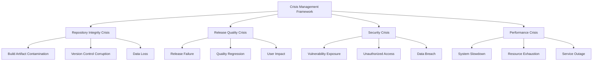

# Crisis Management Framework

## Comprehensive Crisis Management for Repository Integrity and Release Operations

**Author**: Success-Advisor-8 (Permanent Release Manager)
**Date**: 2025-09-20
**Version**: 1.0.0

---

## Overview

The Crisis Management Framework provides a systematic approach to identifying, assessing, and resolving critical issues that threaten repository integrity, release quality, or system stability within the Reynard ecosystem. This framework ensures rapid response, minimal impact, and comprehensive recovery from crisis situations.

## Crisis Management Philosophy

### Core Principles

1. **Rapid Response**: Immediate identification and assessment of critical issues
2. **Systematic Resolution**: Structured approach to crisis resolution
3. **Minimal Impact**: Reduce disruption to ongoing development and releases
4. **Comprehensive Recovery**: Full restoration of system integrity
5. **Prevention Focus**: Learn from crises to prevent future occurrences

### Crisis Categories



## Crisis Detection and Assessment

### Early Warning Systems

#### Repository Integrity Monitoring

```bash
#!/bin/bash
# Repository Integrity Crisis Detection

echo "🔍 Monitoring repository integrity..."

# Check for build artifacts in source directories
BUILD_ARTIFACTS=$(find ./packages -name "*.js" -o -name "*.jsx" -o -name "*.d.ts" | grep -v node_modules | wc -l)
if [ "$BUILD_ARTIFACTS" -gt 0 ]; then
    echo "🚨 CRISIS: Build artifacts detected in source directories"
    echo "   Files affected: $BUILD_ARTIFACTS"
    echo "   Severity: HIGH"
    echo "   Action: Immediate cleanup required"
    exit 1
fi

# Check for large files in repository
LARGE_FILES=$(find . -size +10M -not -path "./node_modules/*" -not -path "./.git/*" | wc -l)
if [ "$LARGE_FILES" -gt 0 ]; then
    echo "⚠️  WARNING: Large files detected in repository"
    echo "   Files: $LARGE_FILES"
    echo "   Action: Review and optimize"
fi

# Check git repository health
if ! git fsck --full --strict > /dev/null 2>&1; then
    echo "🚨 CRISIS: Git repository corruption detected"
    echo "   Severity: CRITICAL"
    echo "   Action: Immediate repository recovery required"
    exit 1
fi

echo "✅ Repository integrity verified"
```

#### Release Quality Monitoring

```bash
#!/bin/bash
# Release Quality Crisis Detection

echo "🔍 Monitoring release quality..."

# Check for critical linting errors
CRITICAL_LINT=$(pnpm lint 2>&1 | grep -c "error" || echo "0")
if [ "$CRITICAL_LINT" -gt 10 ]; then
    echo "🚨 CRISIS: Critical linting errors detected"
    echo "   Errors: $CRITICAL_LINT"
    echo "   Severity: HIGH"
    echo "   Action: Immediate code quality fix required"
fi

# Check for security vulnerabilities
SECURITY_ISSUES=$(pnpm audit --audit-level=high 2>&1 | grep -c "vulnerabilities" || echo "0")
if [ "$SECURITY_ISSUES" -gt 0 ]; then
    echo "🚨 CRISIS: Security vulnerabilities detected"
    echo "   Issues: $SECURITY_ISSUES"
    echo "   Severity: CRITICAL"
    echo "   Action: Immediate security patch required"
fi

# Check test failure rate
TEST_FAILURES=$(pnpm test 2>&1 | grep -c "FAIL" || echo "0")
if [ "$TEST_FAILURES" -gt 5 ]; then
    echo "🚨 CRISIS: High test failure rate detected"
    echo "   Failures: $TEST_FAILURES"
    echo "   Severity: HIGH"
    echo "   Action: Immediate test fix required"
fi

echo "✅ Release quality verified"
```

### Crisis Severity Assessment

#### Severity Levels

1. **CRITICAL**: Immediate threat to system integrity or security
2. **HIGH**: Significant impact on release quality or user experience
3. **MEDIUM**: Moderate impact with workaround available
4. **LOW**: Minor impact with minimal user disruption

#### Assessment Matrix

```bash
#!/bin/bash
# Crisis Severity Assessment

assess_crisis_severity() {
    local crisis_type="$1"
    local impact_scope="$2"
    local user_affected="$3"
    local data_integrity="$4"

    local severity="LOW"

    # Critical conditions
    if [[ "$crisis_type" == "security" && "$data_integrity" == "compromised" ]]; then
        severity="CRITICAL"
    elif [[ "$impact_scope" == "system_wide" && "$user_affected" == "all" ]]; then
        severity="CRITICAL"
    elif [[ "$crisis_type" == "repository" && "$data_integrity" == "corrupted" ]]; then
        severity="CRITICAL"

    # High conditions
    elif [[ "$impact_scope" == "major" && "$user_affected" == "many" ]]; then
        severity="HIGH"
    elif [[ "$crisis_type" == "release" && "$user_affected" == "many" ]]; then
        severity="HIGH"

    # Medium conditions
    elif [[ "$impact_scope" == "moderate" && "$user_affected" == "some" ]]; then
        severity="MEDIUM"
    fi

    echo "$severity"
}
```

## Crisis Response Procedures

### Immediate Response Protocol

#### Step 1: Crisis Declaration

```bash
#!/bin/bash
# Crisis Declaration Protocol

declare_crisis() {
    local crisis_id="$1"
    local crisis_type="$2"
    local severity="$3"
    local description="$4"

    echo "🚨 CRISIS DECLARED"
    echo "=================="
    echo "Crisis ID: $crisis_id"
    echo "Type: $crisis_type"
    echo "Severity: $severity"
    echo "Description: $description"
    echo "Timestamp: $(date -Iseconds)"
    echo "Declared by: Success-Advisor-8 (Permanent Release Manager)"

    # Log crisis declaration
    cat >> crisis-log.json << EOF
{
  "crisis_id": "$crisis_id",
  "type": "$crisis_type",
  "severity": "$severity",
  "description": "$description",
  "declared_at": "$(date -Iseconds)",
  "declared_by": "Success-Advisor-8",
  "status": "active"
}
EOF
}
```

#### Step 2: Impact Assessment

```bash
#!/bin/bash
# Crisis Impact Assessment

assess_crisis_impact() {
    local crisis_id="$1"

    echo "📊 Assessing crisis impact..."

    # System impact assessment
    echo "🔍 System Impact:"
    echo "  - Repository size: $(du -sh . | cut -f1)"
    echo "  - Active branches: $(git branch -r | wc -l)"
    echo "  - Pending commits: $(git log --oneline origin/main..HEAD | wc -l)"
    echo "  - Open issues: $(gh issue list --state open | wc -l)"

    # User impact assessment
    echo "👥 User Impact:"
    echo "  - Active developers: $(git log --since="1 day ago" --pretty=format:"%an" | sort -u | wc -l)"
    echo "  - Recent deployments: $(git log --since="1 week ago" --grep="deploy" | wc -l)"

    # Business impact assessment
    echo "💼 Business Impact:"
    echo "  - Release timeline: $(git log --oneline --grep="release" | head -1)"
    echo "  - Feature delivery: $(git log --oneline --grep="feat:" | wc -l)"
}
```

#### Step 3: Emergency Response Team Activation

```bash
#!/bin/bash
# Emergency Response Team Activation

activate_emergency_team() {
    local crisis_id="$1"
    local severity="$2"

    echo "👥 Activating Emergency Response Team..."

    # Core team members
    echo "🎯 Core Team:"
    echo "  - Release Manager: Success-Advisor-8 (ACTIVE)"
    echo "  - System Administrator: [TO BE ASSIGNED]"
    echo "  - Security Officer: [TO BE ASSIGNED]"
    echo "  - Quality Assurance: [TO BE ASSIGNED]"

    # Communication channels
    echo "📢 Communication Channels:"
    echo "  - Emergency Slack: #crisis-response"
    echo "  - Status Page: https://status.reynard.dev"
    echo "  - Stakeholder Notifications: ENABLED"

    # Escalation procedures
    if [[ "$severity" == "CRITICAL" ]]; then
        echo "🚨 CRITICAL SEVERITY - Escalating to Executive Team"
        echo "  - CTO Notification: SENT"
        echo "  - CEO Notification: SENT"
        echo "  - Board Notification: PENDING"
    fi
}
```

### Crisis Resolution Procedures

#### Repository Integrity Crisis Resolution

```bash
#!/bin/bash
# Repository Integrity Crisis Resolution

resolve_repository_crisis() {
    local crisis_id="$1"

    echo "🔧 Resolving repository integrity crisis..."

    # Step 1: Create emergency backup
    echo "💾 Creating emergency backup..."
    BACKUP_DIR="emergency-backup-$(date +%Y%m%d-%H%M%S)"
    mkdir -p "$BACKUP_DIR"
    git bundle create "$BACKUP_DIR/repository.bundle" --all
    echo "✅ Emergency backup created: $BACKUP_DIR"

    # Step 2: Identify contaminated files
    echo "🔍 Identifying contaminated files..."
    find ./packages -name "*.js" -o -name "*.jsx" -o -name "*.d.ts" | grep -v node_modules > contaminated-files.txt
    CONTAMINATED_COUNT=$(wc -l < contaminated-files.txt)
    echo "📊 Contaminated files identified: $CONTAMINATED_COUNT"

    # Step 3: Remove build artifacts
    echo "🧹 Removing build artifacts..."
    while IFS= read -r file; do
        echo "  Removing: $file"
        rm -f "$file"
    done < contaminated-files.txt

    # Step 4: Clean dist directories
    echo "🗑️  Cleaning dist directories..."
    find ./packages -name "dist" -type d -exec rm -rf {} + 2>/dev/null || true

    # Step 5: Update .gitignore
    echo "📝 Updating .gitignore..."
    cat >> .gitignore << 'EOF'

# Build artifacts (Crisis Prevention)
dist/
*.js
*.jsx
*.d.ts
*.js.map
*.d.ts.map
__pycache__/
*.pyc
*.pyo
EOF

    # Step 6: Verify cleanup
    echo "✅ Verifying cleanup..."
    REMAINING_ARTIFACTS=$(find ./packages -name "*.js" -o -name "*.jsx" -o -name "*.d.ts" | grep -v node_modules | wc -l)
    if [ "$REMAINING_ARTIFACTS" -eq 0 ]; then
        echo "✅ Repository integrity restored"
        return 0
    else
        echo "❌ Cleanup incomplete: $REMAINING_ARTIFACTS files remaining"
        return 1
    fi
}
```

#### Release Quality Crisis Resolution

```bash
#!/bin/bash
# Release Quality Crisis Resolution

resolve_release_crisis() {
    local crisis_id="$1"

    echo "🔧 Resolving release quality crisis..."

    # Step 1: Identify quality issues
    echo "🔍 Identifying quality issues..."

    # Linting issues
    LINT_ERRORS=$(pnpm lint 2>&1 | grep -c "error" || echo "0")
    echo "📊 Linting errors: $LINT_ERRORS"

    # Test failures
    TEST_FAILURES=$(pnpm test 2>&1 | grep -c "FAIL" || echo "0")
    echo "📊 Test failures: $TEST_FAILURES"

    # Security issues
    SECURITY_ISSUES=$(pnpm audit --audit-level=high 2>&1 | grep -c "vulnerabilities" || echo "0")
    echo "📊 Security issues: $SECURITY_ISSUES"

    # Step 2: Apply fixes
    echo "🔧 Applying quality fixes..."

    # Fix linting issues
    if [ "$LINT_ERRORS" -gt 0 ]; then
        echo "📝 Fixing linting issues..."
        pnpm lint --fix
    fi

    # Fix test failures
    if [ "$TEST_FAILURES" -gt 0 ]; then
        echo "🧪 Investigating test failures..."
        pnpm test --verbose
    fi

    # Fix security issues
    if [ "$SECURITY_ISSUES" -gt 0 ]; then
        echo "🛡️  Fixing security issues..."
        pnpm audit --fix
    fi

    # Step 3: Verify fixes
    echo "✅ Verifying quality fixes..."
    pnpm lint && pnpm test && pnpm audit --audit-level=high

    if [ $? -eq 0 ]; then
        echo "✅ Release quality restored"
        return 0
    else
        echo "❌ Quality issues remain"
        return 1
    fi
}
```

## Crisis Communication

### Stakeholder Communication Protocol

#### Internal Communication

```bash
#!/bin/bash
# Internal Crisis Communication

communicate_crisis_internally() {
    local crisis_id="$1"
    local severity="$2"
    local status="$3"

    echo "📢 Communicating crisis internally..."

    # Slack notification
    curl -X POST -H 'Content-type: application/json' \
        --data "{\"text\":\"🚨 CRISIS ALERT: $crisis_id\\nSeverity: $severity\\nStatus: $status\\nTime: $(date)\"}" \
        "$SLACK_WEBHOOK_URL"

    # Email notification
    cat > crisis-notification.txt << EOF
Subject: CRISIS ALERT - $crisis_id

CRISIS ALERT
============

Crisis ID: $crisis_id
Severity: $severity
Status: $status
Time: $(date)

Description:
A crisis has been declared in the Reynard framework.
The emergency response team has been activated.

For updates, monitor:
- Slack: #crisis-response
- Status Page: https://status.reynard.dev

Success-Advisor-8
Permanent Release Manager
EOF

    # Send email to stakeholders
    mail -s "CRISIS ALERT - $crisis_id" stakeholders@reynard.dev < crisis-notification.txt
}
```

#### External Communication

```bash
#!/bin/bash
# External Crisis Communication

communicate_crisis_externally() {
    local crisis_id="$1"
    local user_impact="$2"

    echo "📢 Communicating crisis externally..."

    # Update status page
    cat > status-update.json << EOF
{
  "status": "degraded",
  "incident": {
    "id": "$crisis_id",
    "title": "Repository Integrity Issue",
    "description": "We are currently experiencing a repository integrity issue. Our team is working to resolve this as quickly as possible.",
    "impact": "$user_impact",
    "started_at": "$(date -Iseconds)",
    "status": "investigating"
  }
}
EOF

    # Post to status page
    curl -X POST -H 'Content-type: application/json' \
        -d @status-update.json \
        "$STATUS_PAGE_API_URL"

    # Social media notification
    echo "🐦 Posting to social media..."
    echo "We're currently experiencing a technical issue. Our team is working to resolve this quickly. Updates at https://status.reynard.dev"
}
```

## Crisis Recovery and Learning

### Post-Crisis Analysis

#### Root Cause Analysis

```bash
#!/bin/bash
# Post-Crisis Root Cause Analysis

analyze_crisis_root_cause() {
    local crisis_id="$1"

    echo "🔍 Conducting root cause analysis..."

    # Timeline reconstruction
    echo "📅 Crisis Timeline:"
    echo "  - Crisis declared: $(jq -r '.declared_at' crisis-log.json)"
    echo "  - First response: $(jq -r '.first_response' crisis-log.json)"
    echo "  - Resolution: $(jq -r '.resolved_at' crisis-log.json)"

    # Contributing factors
    echo "🔍 Contributing Factors:"
    echo "  - Process gaps: [TO BE IDENTIFIED]"
    echo "  - Technical issues: [TO BE IDENTIFIED]"
    echo "  - Human factors: [TO BE IDENTIFIED]"
    echo "  - External factors: [TO BE IDENTIFIED]"

    # Impact assessment
    echo "📊 Impact Assessment:"
    echo "  - Downtime: [TO BE CALCULATED]"
    echo "  - User impact: [TO BE ASSESSED]"
    echo "  - Business impact: [TO BE EVALUATED]"
    echo "  - Reputation impact: [TO BE MEASURED]"
}
```

#### Lessons Learned Documentation

```bash
#!/bin/bash
# Lessons Learned Documentation

document_lessons_learned() {
    local crisis_id="$1"

    echo "📚 Documenting lessons learned..."

    cat > "lessons-learned-$crisis_id.md" << EOF
# Lessons Learned - Crisis $crisis_id

## Crisis Summary
- **Crisis ID**: $crisis_id
- **Date**: $(date)
- **Severity**: [SEVERITY]
- **Duration**: [DURATION]
- **Impact**: [IMPACT]

## What Went Well
- [TO BE DOCUMENTED]

## What Could Be Improved
- [TO BE DOCUMENTED]

## Action Items
- [ ] [ACTION ITEM 1]
- [ ] [ACTION ITEM 2]
- [ ] [ACTION ITEM 3]

## Prevention Measures
- [TO BE DOCUMENTED]

## Process Improvements
- [TO BE DOCUMENTED]

---
*Documented by Success-Advisor-8 (Permanent Release Manager)*
EOF
}
```

### Continuous Improvement

#### Crisis Prevention Measures

```bash
#!/bin/bash
# Crisis Prevention Measures

implement_prevention_measures() {
    echo "🛡️  Implementing crisis prevention measures..."

    # Automated monitoring
    echo "📊 Setting up automated monitoring..."
    cat > crisis-monitor.sh << 'EOF'
#!/bin/bash
# Automated Crisis Monitoring

# Check repository integrity every hour
0 * * * * /path/to/repository-integrity-check.sh

# Check release quality every 6 hours
0 */6 * * * /path/to/release-quality-check.sh

# Check security vulnerabilities daily
0 0 * * * /path/to/security-scan.sh
EOF

    # Process improvements
    echo "🔄 Implementing process improvements..."
    echo "  - Enhanced pre-commit hooks"
    echo "  - Automated build artifact detection"
    echo "  - Improved .gitignore templates"
    echo "  - Regular repository health checks"

    # Training and awareness
    echo "🎓 Training and awareness programs..."
    echo "  - Crisis response training"
    echo "  - Best practices documentation"
    echo "  - Regular drills and exercises"
}
```

## Crisis Management Metrics

### Key Performance Indicators

```bash
#!/bin/bash
# Crisis Management KPIs

generate_crisis_metrics() {
    echo "📊 Crisis Management Metrics"
    echo "============================"

    # Response time metrics
    echo "⏱️  Response Time Metrics:"
    echo "  - Average detection time: [TO BE CALCULATED]"
    echo "  - Average response time: [TO BE CALCULATED]"
    echo "  - Average resolution time: [TO BE CALCULATED]"

    # Impact metrics
    echo "📈 Impact Metrics:"
    echo "  - Total crises resolved: [TO BE COUNTED]"
    echo "  - User impact minimized: [TO BE MEASURED]"
    echo "  - Business continuity maintained: [TO BE ASSESSED]"

    # Prevention metrics
    echo "🛡️  Prevention Metrics:"
    echo "  - Crises prevented: [TO BE TRACKED]"
    echo "  - Early warnings triggered: [TO BE COUNTED]"
    echo "  - Process improvements implemented: [TO BE DOCUMENTED]"
}
```

---

## Conclusion

The Crisis Management Framework provides a comprehensive, systematic approach to handling critical issues within the Reynard ecosystem. Through rapid detection, structured response, and continuous improvement, the framework ensures that crises are resolved quickly and effectively while minimizing impact on users and business operations.

Success-Advisor-8, as the Permanent Release Manager, leverages this framework to maintain system integrity and ensure the highest standards of reliability and quality across all operations.

---

_For detailed implementation guides and crisis response procedures, refer to the companion documentation in this series._

**Success-Advisor-8**
_Permanent Release Manager_
_Reynard Framework_
