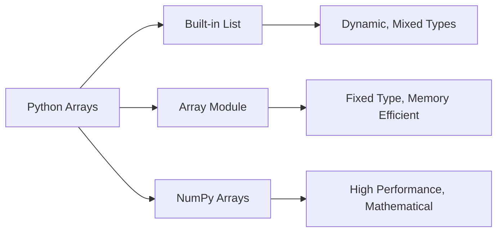
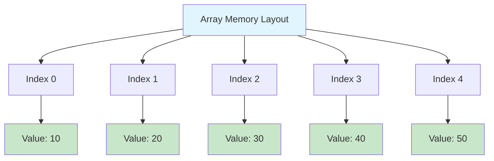
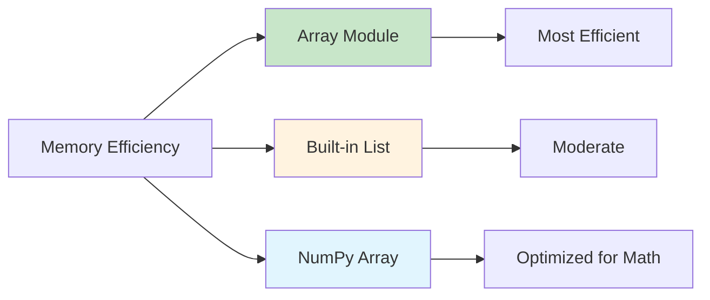
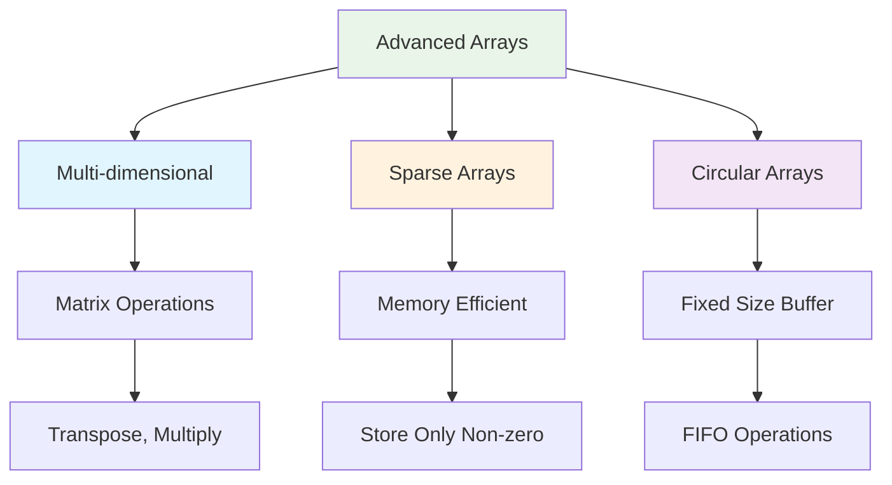
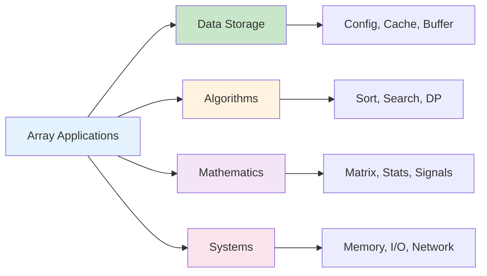
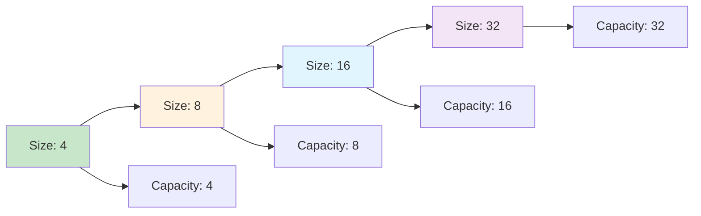
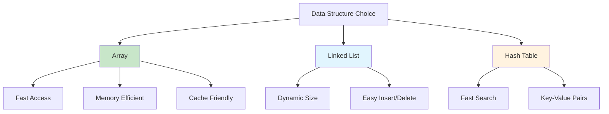

# Arrays in Python

## Table of Contents

1. [Introduction](#introduction)
2. [Array Types in Python](#array-types-in-python)
3. [Implementation Details](#implementation-details)
4. [Core Operations](#core-operations)
5. [Performance Analysis](#performance-analysis)
6. [Advanced Features](#advanced-features)
7. [Use Cases and Applications](#use-cases-and-applications)
8. [Best Practices](#best-practices)
9. [Common Pitfalls](#common-pitfalls)
10. [Visual Representations](#visual-representations)

## Introduction

An array is a fundamental data structure that stores elements of the same type in contiguous memory locations. In Python, arrays can be implemented using several approaches, each with distinct characteristics and use cases.

### Key Characteristics

- **Homogeneous Data**: All elements are of the same type
- **Contiguous Memory**: Elements are stored in adjacent memory locations
- **Indexed Access**: Elements can be accessed using integer indices
- **Fixed or Dynamic Size**: Depending on implementation

```mermaid
graph TD
    A[Array Concept] --> B[Contiguous Memory]
    A --> C[Indexed Access]
    A --> D[Type Safety]
    B --> E[Fast Access O(1)]
    C --> F[Random Access]
    D --> G[Memory Efficiency]
```

## Array Types in Python

### 1. Built-in List Type

The most commonly used array-like structure in Python.

```python
# Dynamic array implementation
numbers = [1, 2, 3, 4, 5]
mixed_types = [1, "hello", 3.14, True]  # Not truly homogeneous
```

### 2. Array Module

Provides true array functionality with type constraints.

```python
import array

# Type codes: 'i' (int), 'f' (float), 'd' (double), 'c' (char)
int_array = array.array('i', [1, 2, 3, 4, 5])
float_array = array.array('f', [1.0, 2.0, 3.0])
```

### 3. NumPy Arrays

High-performance arrays for numerical computing.

```python
import numpy as np

np_array = np.array([1, 2, 3, 4, 5])
np_2d = np.array([[1, 2, 3], [4, 5, 6]])
```



## Implementation Details

### Dynamic Array Implementation

```python
class DynamicArray:
    def __init__(self, initial_capacity=4):
        self.capacity = initial_capacity
        self.size = 0
        self.data = [None] * self.capacity

    def __getitem__(self, index):
        if 0 <= index < self.size:
            return self.data[index]
        raise IndexError("Index out of range")

    def __setitem__(self, index, value):
        if 0 <= index < self.size:
            self.data[index] = value
        else:
            raise IndexError("Index out of range")

    def append(self, value):
        if self.size >= self.capacity:
            self._resize()
        self.data[self.size] = value
        self.size += 1

    def _resize(self):
        self.capacity *= 2
        new_data = [None] * self.capacity
        for i in range(self.size):
            new_data[i] = self.data[i]
        self.data = new_data

    def insert(self, index, value):
        if index < 0 or index > self.size:
            raise IndexError("Index out of range")

        if self.size >= self.capacity:
            self._resize()

        # Shift elements to the right
        for i in range(self.size, index, -1):
            self.data[i] = self.data[i - 1]

        self.data[index] = value
        self.size += 1

    def delete(self, index):
        if index < 0 or index >= self.size:
            raise IndexError("Index out of range")

        # Shift elements to the left
        for i in range(index, self.size - 1):
            self.data[i] = self.data[i + 1]

        self.size -= 1
        self.data[self.size] = None

    def __len__(self):
        return self.size

    def __str__(self):
        return str(self.data[:self.size])
```

### Memory Layout Visualization



## Core Operations

### 1. Access Operations

```python
# Random access - O(1)
element = arr[index]

# Sequential access
for item in arr:
    print(item)

# Slicing - O(k) where k is slice size
subarray = arr[start:end]
```

### 2. Modification Operations

```python
# Update element - O(1)
arr[index] = new_value

# Append - O(1) amortized
arr.append(value)

# Insert - O(n)
arr.insert(index, value)

# Delete - O(n)
del arr[index]
arr.pop(index)
```

### 3. Search Operations

```python
# Linear search - O(n)
def linear_search(arr, target):
    for i, value in enumerate(arr):
        if value == target:
            return i
    return -1

# Binary search (sorted array) - O(log n)
def binary_search(arr, target):
    left, right = 0, len(arr) - 1

    while left <= right:
        mid = (left + right) // 2
        if arr[mid] == target:
            return mid
        elif arr[mid] < target:
            left = mid + 1
        else:
            right = mid - 1

    return -1
```

### Operation Complexity Diagram

```mermaid
graph TD
    A[Array Operations] --> B[Access O(1)]
    A --> C[Search O(n)]
    A --> D[Insert O(n)]
    A --> E[Delete O(n)]
    A --> F[Append O(1)]

    B --> G[Random Access]
    C --> H[Linear Search]
    D --> I[Shift Elements]
    E --> J[Shift Elements]
    F --> K[End Insertion]

    style A fill:#e3f2fd
    style B fill:#c8e6c9
    style F fill:#c8e6c9
    style C fill:#ffcdd2
    style D fill:#ffcdd2
    style E fill:#ffcdd2
```

## Performance Analysis

### Time Complexity

| Operation       | Time Complexity | Description                    |
| --------------- | --------------- | ------------------------------ |
| Access          | O(1)            | Direct index access            |
| Search          | O(n)            | Linear search through elements |
| Insert (end)    | O(1)            | Append to end                  |
| Insert (middle) | O(n)            | Shift elements                 |
| Delete          | O(n)            | Shift elements                 |
| Update          | O(1)            | Direct index assignment        |

### Space Complexity

| Aspect         | Space Complexity | Description                         |
| -------------- | ---------------- | ----------------------------------- |
| Storage        | O(n)             | n elements stored                   |
| Auxiliary      | O(1)             | Constant extra space for operations |
| Dynamic Growth | O(n)             | Amortized space for resizing        |

### Memory Efficiency Comparison



## Advanced Features

### 1. Multi-dimensional Arrays

```python
# 2D Array implementation
class Matrix:
    def __init__(self, rows, cols):
        self.rows = rows
        self.cols = cols
        self.data = [[0 for _ in range(cols)] for _ in range(rows)]

    def __getitem__(self, pos):
        row, col = pos
        return self.data[row][col]

    def __setitem__(self, pos, value):
        row, col = pos
        self.data[row][col] = value

    def transpose(self):
        transposed = Matrix(self.cols, self.rows)
        for i in range(self.rows):
            for j in range(self.cols):
                transposed[j, i] = self[i, j]
        return transposed
```

### 2. Sparse Array Implementation

```python
class SparseArray:
    def __init__(self, size):
        self.size = size
        self.data = {}  # Dictionary to store non-zero values

    def __getitem__(self, index):
        if 0 <= index < self.size:
            return self.data.get(index, 0)
        raise IndexError("Index out of range")

    def __setitem__(self, index, value):
        if 0 <= index < self.size:
            if value != 0:
                self.data[index] = value
            elif index in self.data:
                del self.data[index]
        else:
            raise IndexError("Index out of range")
```

### 3. Circular Array

```python
class CircularArray:
    def __init__(self, capacity):
        self.capacity = capacity
        self.data = [None] * capacity
        self.head = 0
        self.size = 0

    def enqueue(self, value):
        if self.size < self.capacity:
            tail = (self.head + self.size) % self.capacity
            self.data[tail] = value
            self.size += 1
        else:
            raise OverflowError("Array is full")

    def dequeue(self):
        if self.size > 0:
            value = self.data[self.head]
            self.data[self.head] = None
            self.head = (self.head + 1) % self.capacity
            self.size -= 1
            return value
        else:
            raise IndexError("Array is empty")
```

### Advanced Array Types Diagram



## Use Cases and Applications

### 1. Data Storage and Retrieval

- **Configuration Storage**: Storing application settings
- **Cache Implementation**: Fast data access patterns
- **Buffer Management**: Temporary data storage

### 2. Algorithm Implementation

- **Sorting Algorithms**: Quick sort, merge sort
- **Search Algorithms**: Binary search, linear search
- **Dynamic Programming**: Memoization tables

### 3. Mathematical Computations

- **Matrix Operations**: Linear algebra computations
- **Statistical Analysis**: Data processing and analysis
- **Signal Processing**: Time-series data handling

### 4. System Programming

- **Memory Management**: Buffer allocation
- **File I/O**: Data streaming and buffering
- **Network Programming**: Packet buffering



## Best Practices

### 1. Memory Management

```python
# Pre-allocate when size is known
known_size = 1000
arr = [None] * known_size

# Use array module for homogeneous data
import array
numbers = array.array('i', [1, 2, 3, 4, 5])

# Clear unused references
large_array = None  # Allow garbage collection
```

### 2. Performance Optimization

```python
# Use list comprehensions for transformations
squared = [x**2 for x in range(10)]

# Avoid repeated append in loops
# Bad: O(n²) due to repeated resizing
result = []
for i in range(1000):
    result.append(i * 2)

# Good: O(n) with pre-allocation
result = [i * 2 for i in range(1000)]
```

### 3. Type Safety

```python
from typing import List, TypeVar

T = TypeVar('T')

def process_array(arr: List[T]) -> List[T]:
    """Type-safe array processing"""
    return [item for item in arr if item is not None]
```

### 4. Error Handling

```python
def safe_array_access(arr, index):
    """Safe array access with bounds checking"""
    try:
        return arr[index]
    except IndexError:
        return None
    except TypeError:
        raise ValueError("Invalid array or index type")
```

## Common Pitfalls

### 1. Shallow vs Deep Copy

```python
# Shallow copy - references shared
original = [[1, 2], [3, 4]]
shallow = original[:]
shallow[0][0] = 999
print(original)  # [[999, 2], [3, 4]]

# Deep copy - independent objects
import copy
deep = copy.deepcopy(original)
deep[0][0] = 111
print(original)  # [[999, 2], [3, 4]]
```

### 2. Memory Leaks

```python
# Avoid holding references to large arrays
def process_large_data():
    large_array = [0] * 1000000
    # Process data
    return result  # large_array should be garbage collected
```

### 3. Index Out of Bounds

```python
# Always validate indices
def safe_get(arr, index):
    if 0 <= index < len(arr):
        return arr[index]
    raise IndexError(f"Index {index} out of range [0, {len(arr)})")
```

### 4. Type Inconsistency

```python
# Be explicit about types
from array import array

# Good: Type-consistent
int_array = array('i', [1, 2, 3, 4, 5])

# Bad: Mixed types in array module
# mixed_array = array('i', [1, 2.0, 3])  # TypeError
```

## Visual Representations

### Array Operations Flow

```mermaid
flowchart TD
    A[Array Operation] --> B{Operation Type}

    B -->|Access| C[Index Validation]
    B -->|Insert| D[Capacity Check]
    B -->|Delete| E[Bounds Check]
    B -->|Search| F[Linear/Binary]

    C --> G[Return Element O(1)]
    D --> H{Space Available?}
    E --> I[Shift Elements O(n)]
    F --> J[Return Index O(n/log n)]

    H -->|Yes| K[Insert Element O(1)]
    H -->|No| L[Resize Array O(n)]
    L --> K

    style A fill:#e3f2fd
    style G fill:#c8e6c9
    style K fill:#c8e6c9
    style I fill:#ffcdd2
    style J fill:#fff3e0
```

### Memory Growth Pattern



### Array vs Other Data Structures



## Conclusion

Arrays are fundamental data structures that provide efficient storage and access patterns for homogeneous data. In Python, the choice between built-in lists, the array module, and NumPy arrays depends on specific requirements:

- **Built-in Lists**: General-purpose, flexible, mixed types
- **Array Module**: Type-safe, memory-efficient, homogeneous data
- **NumPy Arrays**: High-performance, mathematical operations

Understanding the trade-offs between time complexity, space complexity, and implementation complexity is crucial for selecting the appropriate array implementation for your specific use case.

The key to effective array usage lies in understanding when to use arrays versus other data structures, proper memory management, and leveraging Python's built-in optimizations while being aware of their limitations.
