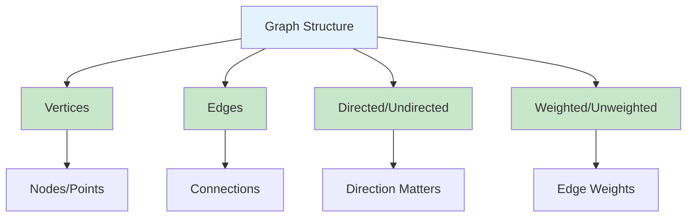
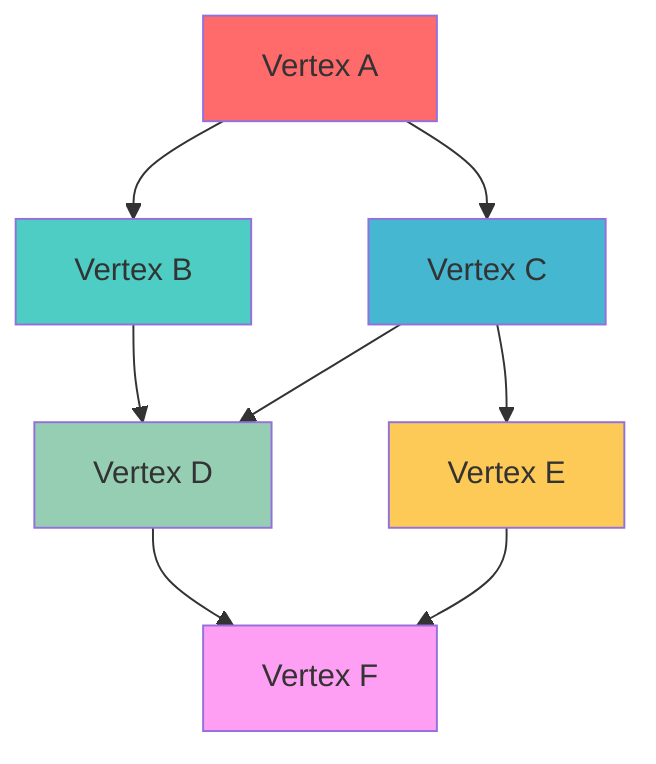
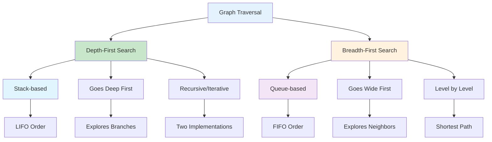
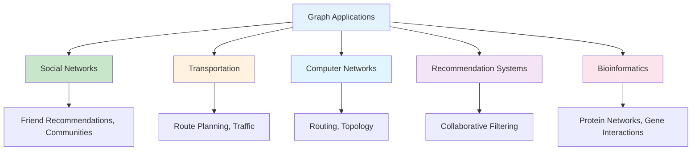
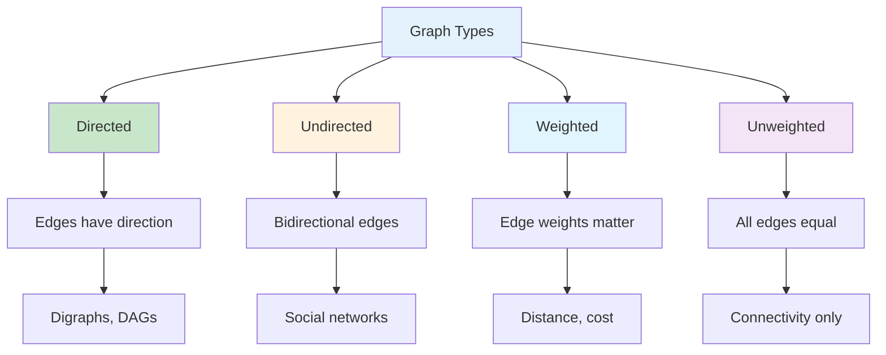

# Graphs in Python

## Table of Contents

1. [Introduction](#introduction)
2. [Graph Fundamentals](#graph-fundamentals)
3. [Graph Representations](#graph-representations)
4. [Graph Traversal Algorithms](#graph-traversal-algorithms)
5. [Shortest Path Algorithms](#shortest-path-algorithms)
6. [Minimum Spanning Tree](#minimum-spanning-tree)
7. [Advanced Graph Algorithms](#advanced-graph-algorithms)
8. [Performance Analysis](#performance-analysis)
9. [Use Cases and Applications](#use-cases-and-applications)
10. [Best Practices](#best-practices)
11. [Visual Representations](#visual-representations)

## Introduction

A graph is a non-linear data structure consisting of vertices (nodes) connected by edges. Graphs are fundamental in computer science and are used to model relationships, networks, and complex systems. They provide powerful abstractions for solving problems in various domains.

### Key Characteristics

- **Vertices (Nodes)**: Fundamental units of the graph
- **Edges**: Connections between vertices
- **Directed/Undirected**: Edges may have direction
- **Weighted/Unweighted**: Edges may have associated weights



## Graph Fundamentals

### Basic Graph Implementation

```python
class Graph:
    def __init__(self, directed=False):
        self.vertices = {}
        self.directed = directed

    def add_vertex(self, vertex):
        """Add a vertex to the graph"""
        if vertex not in self.vertices:
            self.vertices[vertex] = []

    def add_edge(self, from_vertex, to_vertex, weight=1):
        """Add an edge between two vertices"""
        if from_vertex not in self.vertices:
            self.add_vertex(from_vertex)
        if to_vertex not in self.vertices:
            self.add_vertex(to_vertex)

        self.vertices[from_vertex].append((to_vertex, weight))

        if not self.directed:
            self.vertices[to_vertex].append((from_vertex, weight))

    def remove_vertex(self, vertex):
        """Remove a vertex and all its edges"""
        if vertex in self.vertices:
            # Remove all edges to this vertex
            for v in self.vertices:
                self.vertices[v] = [(neighbor, weight) for neighbor, weight in self.vertices[v] if neighbor != vertex]

            # Remove the vertex
            del self.vertices[vertex]

    def remove_edge(self, from_vertex, to_vertex):
        """Remove an edge between two vertices"""
        if from_vertex in self.vertices:
            self.vertices[from_vertex] = [(neighbor, weight) for neighbor, weight in self.vertices[from_vertex] if neighbor != to_vertex]

        if not self.directed and to_vertex in self.vertices:
            self.vertices[to_vertex] = [(neighbor, weight) for neighbor, weight in self.vertices[to_vertex] if neighbor != from_vertex]

    def get_neighbors(self, vertex):
        """Get all neighbors of a vertex"""
        return self.vertices.get(vertex, [])

    def get_vertices(self):
        """Get all vertices in the graph"""
        return list(self.vertices.keys())

    def get_edges(self):
        """Get all edges in the graph"""
        edges = []
        for vertex in self.vertices:
            for neighbor, weight in self.vertices[vertex]:
                if self.directed or vertex < neighbor:  # Avoid duplicates in undirected graphs
                    edges.append((vertex, neighbor, weight))
        return edges

    def has_vertex(self, vertex):
        """Check if a vertex exists"""
        return vertex in self.vertices

    def has_edge(self, from_vertex, to_vertex):
        """Check if an edge exists between two vertices"""
        if from_vertex not in self.vertices:
            return False
        return any(neighbor == to_vertex for neighbor, _ in self.vertices[from_vertex])

    def get_degree(self, vertex):
        """Get the degree of a vertex"""
        if vertex not in self.vertices:
            return 0
        return len(self.vertices[vertex])

    def is_connected(self):
        """Check if the graph is connected (for undirected graphs)"""
        if not self.vertices:
            return True

        visited = set()
        start_vertex = next(iter(self.vertices))
        self._dfs_connected(start_vertex, visited)
        return len(visited) == len(self.vertices)

    def _dfs_connected(self, vertex, visited):
        """Helper method for connectivity check"""
        visited.add(vertex)
        for neighbor, _ in self.vertices[vertex]:
            if neighbor not in visited:
                self._dfs_connected(neighbor, visited)
```

### Graph Structure Visualization



## Graph Representations

### 1. Adjacency List

```python
class AdjacencyListGraph:
    def __init__(self, directed=False):
        self.adj_list = {}
        self.directed = directed

    def add_vertex(self, vertex):
        """Add a vertex to the graph"""
        if vertex not in self.adj_list:
            self.adj_list[vertex] = []

    def add_edge(self, from_vertex, to_vertex, weight=1):
        """Add an edge between two vertices"""
        if from_vertex not in self.adj_list:
            self.adj_list[from_vertex] = []
        if to_vertex not in self.adj_list:
            self.adj_list[to_vertex] = []

        self.adj_list[from_vertex].append((to_vertex, weight))

        if not self.directed:
            self.adj_list[to_vertex].append((from_vertex, weight))

    def get_neighbors(self, vertex):
        """Get all neighbors of a vertex"""
        return self.adj_list.get(vertex, [])

    def get_vertices(self):
        """Get all vertices"""
        return list(self.adj_list.keys())

    def get_edges(self):
        """Get all edges"""
        edges = []
        for vertex in self.adj_list:
            for neighbor, weight in self.adj_list[vertex]:
                if self.directed or vertex < neighbor:
                    edges.append((vertex, neighbor, weight))
        return edges
```

### 2. Adjacency Matrix

```python
class AdjacencyMatrixGraph:
    def __init__(self, vertices, directed=False):
        self.vertices = vertices
        self.directed = directed
        self.matrix = [[0] * len(vertices) for _ in range(len(vertices))]
        self.vertex_to_index = {vertex: i for i, vertex in enumerate(vertices)}

    def add_edge(self, from_vertex, to_vertex, weight=1):
        """Add an edge between two vertices"""
        from_idx = self.vertex_to_index[from_vertex]
        to_idx = self.vertex_to_index[to_vertex]

        self.matrix[from_idx][to_idx] = weight

        if not self.directed:
            self.matrix[to_idx][from_idx] = weight

    def remove_edge(self, from_vertex, to_vertex):
        """Remove an edge between two vertices"""
        from_idx = self.vertex_to_index[from_vertex]
        to_idx = self.vertex_to_index[to_vertex]

        self.matrix[from_idx][to_idx] = 0

        if not self.directed:
            self.matrix[to_idx][from_idx] = 0

    def has_edge(self, from_vertex, to_vertex):
        """Check if an edge exists between two vertices"""
        from_idx = self.vertex_to_index[from_vertex]
        to_idx = self.vertex_to_index[to_vertex]
        return self.matrix[from_idx][to_idx] != 0

    def get_neighbors(self, vertex):
        """Get all neighbors of a vertex"""
        vertex_idx = self.vertex_to_index[vertex]
        neighbors = []

        for i, weight in enumerate(self.matrix[vertex_idx]):
            if weight != 0:
                neighbors.append((self.vertices[i], weight))

        return neighbors

    def get_degree(self, vertex):
        """Get the degree of a vertex"""
        vertex_idx = self.vertex_to_index[vertex]
        degree = 0

        for weight in self.matrix[vertex_idx]:
            if weight != 0:
                degree += 1

        return degree
```

### 3. Edge List

```python
class EdgeListGraph:
    def __init__(self, directed=False):
        self.edges = []
        self.directed = directed
        self.vertices = set()

    def add_edge(self, from_vertex, to_vertex, weight=1):
        """Add an edge between two vertices"""
        self.edges.append((from_vertex, to_vertex, weight))
        self.vertices.add(from_vertex)
        self.vertices.add(to_vertex)

        if not self.directed:
            self.edges.append((to_vertex, from_vertex, weight))

    def remove_edge(self, from_vertex, to_vertex):
        """Remove an edge between two vertices"""
        self.edges = [(f, t, w) for f, t, w in self.edges if not (f == from_vertex and t == to_vertex)]

        if not self.directed:
            self.edges = [(f, t, w) for f, t, w in self.edges if not (f == to_vertex and t == from_vertex)]

    def get_neighbors(self, vertex):
        """Get all neighbors of a vertex"""
        neighbors = []
        for from_vertex, to_vertex, weight in self.edges:
            if from_vertex == vertex:
                neighbors.append((to_vertex, weight))
        return neighbors

    def get_vertices(self):
        """Get all vertices"""
        return list(self.vertices)

    def get_edges(self):
        """Get all edges"""
        return self.edges
```

### Representation Comparison

```mermaid
graph TD
    A[Graph Representations] --> B[Adjacency List]
    A --> C[Adjacency Matrix]
    A --> D[Edge List]

    B --> E[Space: O(V + E)]
    B --> F[Time: O(degree)]

    C --> G[Space: O(V²)]
    C --> H[Time: O(1)]

    D --> I[Space: O(E)]
    D --> J[Time: O(E)]

    style A fill:#e3f2fd
    style B fill:#c8e6c9
    style C fill:#fff3e0
    style D fill:#e1f5fe
```

## Graph Traversal Algorithms

### 1. Depth-First Search (DFS)

```python
class GraphTraversal:
    def __init__(self, graph):
        self.graph = graph

    def dfs_recursive(self, start_vertex, visited=None):
        """Depth-First Search using recursion"""
        if visited is None:
            visited = set()

        visited.add(start_vertex)
        result = [start_vertex]

        for neighbor, _ in self.graph.get_neighbors(start_vertex):
            if neighbor not in visited:
                result.extend(self.dfs_recursive(neighbor, visited))

        return result

    def dfs_iterative(self, start_vertex):
        """Depth-First Search using iteration"""
        visited = set()
        stack = [start_vertex]
        result = []

        while stack:
            vertex = stack.pop()
            if vertex not in visited:
                visited.add(vertex)
                result.append(vertex)

                # Add neighbors in reverse order to maintain left-to-right traversal
                neighbors = [neighbor for neighbor, _ in self.graph.get_neighbors(vertex)]
                stack.extend(reversed(neighbors))

        return result

    def dfs_path(self, start_vertex, target_vertex):
        """Find a path from start to target using DFS"""
        visited = set()
        path = []

        def dfs_helper(vertex):
            if vertex == target_vertex:
                return True

            visited.add(vertex)
            path.append(vertex)

            for neighbor, _ in self.graph.get_neighbors(vertex):
                if neighbor not in visited:
                    if dfs_helper(neighbor):
                        return True

            path.pop()
            return False

        if dfs_helper(start_vertex):
            path.append(target_vertex)
            return path
        return None
```

### 2. Breadth-First Search (BFS)

```python
from collections import deque

class GraphTraversal:
    def bfs(self, start_vertex):
        """Breadth-First Search"""
        visited = set()
        queue = deque([start_vertex])
        result = []

        while queue:
            vertex = queue.popleft()
            if vertex not in visited:
                visited.add(vertex)
                result.append(vertex)

                for neighbor, _ in self.graph.get_neighbors(vertex):
                    if neighbor not in visited:
                        queue.append(neighbor)

        return result

    def bfs_shortest_path(self, start_vertex, target_vertex):
        """Find shortest path using BFS"""
        if start_vertex == target_vertex:
            return [start_vertex]

        visited = set()
        queue = deque([(start_vertex, [start_vertex])])

        while queue:
            vertex, path = queue.popleft()

            for neighbor, _ in self.graph.get_neighbors(vertex):
                if neighbor == target_vertex:
                    return path + [neighbor]

                if neighbor not in visited:
                    visited.add(neighbor)
                    queue.append((neighbor, path + [neighbor]))

        return None

    def bfs_levels(self, start_vertex):
        """BFS with level information"""
        visited = set()
        queue = deque([(start_vertex, 0)])
        levels = {}

        while queue:
            vertex, level = queue.popleft()

            if vertex not in visited:
                visited.add(vertex)
                levels[vertex] = level

                for neighbor, _ in self.graph.get_neighbors(vertex):
                    if neighbor not in visited:
                        queue.append((neighbor, level + 1))

        return levels
```

### Traversal Visualization



## Shortest Path Algorithms

### 1. Dijkstra's Algorithm

```python
import heapq

class ShortestPath:
    def __init__(self, graph):
        self.graph = graph

    def dijkstra(self, start_vertex):
        """Find shortest paths from start vertex to all other vertices"""
        distances = {vertex: float('inf') for vertex in self.graph.get_vertices()}
        distances[start_vertex] = 0
        previous = {vertex: None for vertex in self.graph.get_vertices()}

        # Priority queue: (distance, vertex)
        pq = [(0, start_vertex)]
        visited = set()

        while pq:
            current_distance, current_vertex = heapq.heappop(pq)

            if current_vertex in visited:
                continue

            visited.add(current_vertex)

            for neighbor, weight in self.graph.get_neighbors(current_vertex):
                if neighbor in visited:
                    continue

                new_distance = current_distance + weight

                if new_distance < distances[neighbor]:
                    distances[neighbor] = new_distance
                    previous[neighbor] = current_vertex
                    heapq.heappush(pq, (new_distance, neighbor))

        return distances, previous

    def get_shortest_path(self, start_vertex, target_vertex):
        """Get shortest path from start to target"""
        distances, previous = self.dijkstra(start_vertex)

        if distances[target_vertex] == float('inf'):
            return None, float('inf')

        path = []
        current = target_vertex

        while current is not None:
            path.append(current)
            current = previous[current]

        path.reverse()
        return path, distances[target_vertex]
```

### 2. Bellman-Ford Algorithm

```python
class ShortestPath:
    def bellman_ford(self, start_vertex):
        """Find shortest paths using Bellman-Ford algorithm"""
        vertices = self.graph.get_vertices()
        distances = {vertex: float('inf') for vertex in vertices}
        distances[start_vertex] = 0
        previous = {vertex: None for vertex in vertices}

        # Relax edges V-1 times
        for _ in range(len(vertices) - 1):
            for from_vertex, to_vertex, weight in self.graph.get_edges():
                if distances[from_vertex] != float('inf') and distances[from_vertex] + weight < distances[to_vertex]:
                    distances[to_vertex] = distances[from_vertex] + weight
                    previous[to_vertex] = from_vertex

        # Check for negative cycles
        for from_vertex, to_vertex, weight in self.graph.get_edges():
            if distances[from_vertex] != float('inf') and distances[from_vertex] + weight < distances[to_vertex]:
                raise ValueError("Graph contains negative cycle")

        return distances, previous
```

### 3. Floyd-Warshall Algorithm

```python
class ShortestPath:
    def floyd_warshall(self):
        """Find shortest paths between all pairs of vertices"""
        vertices = self.graph.get_vertices()
        n = len(vertices)
        vertex_to_index = {vertex: i for i, vertex in enumerate(vertices)}

        # Initialize distance matrix
        dist = [[float('inf')] * n for _ in range(n)]
        next_vertex = [[None] * n for _ in range(n)]

        # Set diagonal to 0
        for i in range(n):
            dist[i][i] = 0

        # Set initial distances from edges
        for from_vertex, to_vertex, weight in self.graph.get_edges():
            i = vertex_to_index[from_vertex]
            j = vertex_to_index[to_vertex]
            dist[i][j] = weight
            next_vertex[i][j] = j

        # Floyd-Warshall algorithm
        for k in range(n):
            for i in range(n):
                for j in range(n):
                    if dist[i][k] + dist[k][j] < dist[i][j]:
                        dist[i][j] = dist[i][k] + dist[k][j]
                        next_vertex[i][j] = next_vertex[i][k]

        return dist, next_vertex, vertex_to_index

    def get_path_floyd_warshall(self, start_vertex, target_vertex, dist, next_vertex, vertex_to_index):
        """Get path using Floyd-Warshall results"""
        start_idx = vertex_to_index[start_vertex]
        target_idx = vertex_to_index[target_vertex]

        if dist[start_idx][target_idx] == float('inf'):
            return None

        path = [start_vertex]
        current = start_idx

        while current != target_idx:
            current = next_vertex[current][target_idx]
            path.append(vertices[current])

        return path
```

## Minimum Spanning Tree

### 1. Kruskal's Algorithm

```python
class UnionFind:
    def __init__(self, vertices):
        self.parent = {vertex: vertex for vertex in vertices}
        self.rank = {vertex: 0 for vertex in vertices}

    def find(self, vertex):
        if self.parent[vertex] != vertex:
            self.parent[vertex] = self.find(self.parent[vertex])
        return self.parent[vertex]

    def union(self, vertex1, vertex2):
        root1 = self.find(vertex1)
        root2 = self.find(vertex2)

        if root1 == root2:
            return False

        if self.rank[root1] < self.rank[root2]:
            self.parent[root1] = root2
        elif self.rank[root1] > self.rank[root2]:
            self.parent[root2] = root1
        else:
            self.parent[root2] = root1
            self.rank[root1] += 1

        return True

class MinimumSpanningTree:
    def __init__(self, graph):
        self.graph = graph

    def kruskal(self):
        """Find minimum spanning tree using Kruskal's algorithm"""
        edges = self.graph.get_edges()
        edges.sort(key=lambda x: x[2])  # Sort by weight

        mst_edges = []
        union_find = UnionFind(self.graph.get_vertices())

        for from_vertex, to_vertex, weight in edges:
            if union_find.union(from_vertex, to_vertex):
                mst_edges.append((from_vertex, to_vertex, weight))

                if len(mst_edges) == len(self.graph.get_vertices()) - 1:
                    break

        return mst_edges
```

### 2. Prim's Algorithm

```python
class MinimumSpanningTree:
    def prim(self, start_vertex):
        """Find minimum spanning tree using Prim's algorithm"""
        vertices = self.graph.get_vertices()
        mst_edges = []
        visited = {start_vertex}

        # Priority queue: (weight, from_vertex, to_vertex)
        pq = []

        # Add edges from start vertex
        for neighbor, weight in self.graph.get_neighbors(start_vertex):
            heapq.heappush(pq, (weight, start_vertex, neighbor))

        while pq and len(visited) < len(vertices):
            weight, from_vertex, to_vertex = heapq.heappop(pq)

            if to_vertex not in visited:
                visited.add(to_vertex)
                mst_edges.append((from_vertex, to_vertex, weight))

                # Add edges from new vertex
                for neighbor, edge_weight in self.graph.get_neighbors(to_vertex):
                    if neighbor not in visited:
                        heapq.heappush(pq, (edge_weight, to_vertex, neighbor))

        return mst_edges
```

## Advanced Graph Algorithms

### 1. Topological Sort

```python
class GraphAlgorithms:
    def __init__(self, graph):
        self.graph = graph

    def topological_sort(self):
        """Topological sort using DFS"""
        visited = set()
        temp_visited = set()
        result = []

        def dfs(vertex):
            if vertex in temp_visited:
                raise ValueError("Graph contains cycle")

            if vertex in visited:
                return

            temp_visited.add(vertex)

            for neighbor, _ in self.graph.get_neighbors(vertex):
                dfs(neighbor)

            temp_visited.remove(vertex)
            visited.add(vertex)
            result.append(vertex)

        for vertex in self.graph.get_vertices():
            if vertex not in visited:
                dfs(vertex)

        return result[::-1]  # Reverse to get correct order

    def topological_sort_kahn(self):
        """Topological sort using Kahn's algorithm"""
        in_degree = {vertex: 0 for vertex in self.graph.get_vertices()}

        # Calculate in-degrees
        for vertex in self.graph.get_vertices():
            for neighbor, _ in self.graph.get_neighbors(vertex):
                in_degree[neighbor] += 1

        # Queue for vertices with no incoming edges
        queue = deque([vertex for vertex, degree in in_degree.items() if degree == 0])
        result = []

        while queue:
            vertex = queue.popleft()
            result.append(vertex)

            for neighbor, _ in self.graph.get_neighbors(vertex):
                in_degree[neighbor] -= 1
                if in_degree[neighbor] == 0:
                    queue.append(neighbor)

        if len(result) != len(self.graph.get_vertices()):
            raise ValueError("Graph contains cycle")

        return result
```

### 2. Strongly Connected Components

```python
class GraphAlgorithms:
    def kosaraju(self):
        """Find strongly connected components using Kosaraju's algorithm"""
        # Step 1: Get finish times using DFS
        visited = set()
        finish_times = []

        def dfs1(vertex):
            visited.add(vertex)
            for neighbor, _ in self.graph.get_neighbors(vertex):
                if neighbor not in visited:
                    dfs1(neighbor)
            finish_times.append(vertex)

        for vertex in self.graph.get_vertices():
            if vertex not in visited:
                dfs1(vertex)

        # Step 2: Create transpose graph
        transpose_graph = Graph(directed=True)
        for vertex in self.graph.get_vertices():
            transpose_graph.add_vertex(vertex)

        for from_vertex, to_vertex, weight in self.graph.get_edges():
            transpose_graph.add_edge(to_vertex, from_vertex, weight)

        # Step 3: DFS on transpose graph in reverse finish time order
        visited = set()
        sccs = []

        def dfs2(vertex, component):
            visited.add(vertex)
            component.append(vertex)
            for neighbor, _ in transpose_graph.get_neighbors(vertex):
                if neighbor not in visited:
                    dfs2(neighbor, component)

        for vertex in reversed(finish_times):
            if vertex not in visited:
                component = []
                dfs2(vertex, component)
                sccs.append(component)

        return sccs
```

### 3. Cycle Detection

```python
class GraphAlgorithms:
    def has_cycle_directed(self):
        """Detect cycle in directed graph"""
        visited = set()
        rec_stack = set()

        def dfs(vertex):
            visited.add(vertex)
            rec_stack.add(vertex)

            for neighbor, _ in self.graph.get_neighbors(vertex):
                if neighbor not in visited:
                    if dfs(neighbor):
                        return True
                elif neighbor in rec_stack:
                    return True

            rec_stack.remove(vertex)
            return False

        for vertex in self.graph.get_vertices():
            if vertex not in visited:
                if dfs(vertex):
                    return True

        return False

    def has_cycle_undirected(self):
        """Detect cycle in undirected graph"""
        visited = set()

        def dfs(vertex, parent):
            visited.add(vertex)

            for neighbor, _ in self.graph.get_neighbors(vertex):
                if neighbor not in visited:
                    if dfs(neighbor, vertex):
                        return True
                elif neighbor != parent:
                    return True

            return False

        for vertex in self.graph.get_vertices():
            if vertex not in visited:
                if dfs(vertex, None):
                    return True

        return False
```

## Performance Analysis

### Time Complexity

| Algorithm        | Time Complexity  | Space Complexity | Description                          |
| ---------------- | ---------------- | ---------------- | ------------------------------------ |
| DFS              | O(V + E)         | O(V)             | Depth-first traversal                |
| BFS              | O(V + E)         | O(V)             | Breadth-first traversal              |
| Dijkstra         | O((V + E) log V) | O(V)             | Shortest path (non-negative weights) |
| Bellman-Ford     | O(VE)            | O(V)             | Shortest path (negative weights)     |
| Floyd-Warshall   | O(V³)            | O(V²)            | All-pairs shortest paths             |
| Kruskal          | O(E log E)       | O(V)             | Minimum spanning tree                |
| Prim             | O(E log V)       | O(V)             | Minimum spanning tree                |
| Topological Sort | O(V + E)         | O(V)             | Linear ordering                      |

### Space Complexity

| Representation   | Space Complexity | Description      |
| ---------------- | ---------------- | ---------------- |
| Adjacency List   | O(V + E)         | Vertices + edges |
| Adjacency Matrix | O(V²)            | V × V matrix     |
| Edge List        | O(E)             | List of edges    |

### Performance Characteristics

```mermaid
graph LR
    A[Graph Performance] --> B[Traversal: O(V + E)]
    A --> C[Shortest Path: O(V log V)]
    A --> D[MST: O(E log V)]
    A --> E[All-Pairs: O(V³)]

    B --> F[DFS, BFS]
    C --> G[Dijkstra]
    D --> H[Kruskal, Prim]
    E --> I[Floyd-Warshall]

    style A fill:#e3f2fd
    style B fill:#c8e6c9
    style C fill:#fff3e0
    style D fill:#e1f5fe
    style E fill:#f3e5f5
```

## Use Cases and Applications

### 1. Social Networks

- **Friend Recommendations**: Graph traversal algorithms
- **Influence Analysis**: Centrality measures
- **Community Detection**: Clustering algorithms

### 2. Transportation Networks

- **Route Planning**: Shortest path algorithms
- **Traffic Optimization**: Flow algorithms
- **Network Analysis**: Connectivity analysis

### 3. Computer Networks

- **Routing Protocols**: Path finding
- **Network Topology**: Graph representation
- **Load Balancing**: Graph algorithms

### 4. Recommendation Systems

- **Collaborative Filtering**: Graph-based recommendations
- **Content Similarity**: Graph similarity measures
- **User Behavior**: Graph analysis

### 5. Bioinformatics

- **Protein Networks**: Graph modeling
- **Gene Interactions**: Network analysis
- **Evolutionary Trees**: Tree structures

### Application Areas



## Best Practices

### 1. Graph Representation Selection

```python
# Choose representation based on use case
def choose_representation(vertices, edges, operations):
    if operations == "frequent_edge_queries":
        return "adjacency_matrix"
    elif operations == "sparse_graph":
        return "adjacency_list"
    elif operations == "edge_iteration":
        return "edge_list"
    else:
        return "adjacency_list"  # Default choice
```

### 2. Memory Management

```python
class MemoryEfficientGraph:
    def __init__(self, max_vertices=10000):
        self.max_vertices = max_vertices
        self.vertices = {}
        self.vertex_count = 0

    def add_vertex(self, vertex):
        if self.vertex_count >= self.max_vertices:
            self._remove_oldest_vertex()

        if vertex not in self.vertices:
            self.vertices[vertex] = []
            self.vertex_count += 1

    def _remove_oldest_vertex(self):
        # Remove vertex with least connections
        min_degree_vertex = min(self.vertices.keys(),
                               key=lambda v: len(self.vertices[v]))
        self.remove_vertex(min_degree_vertex)
```

### 3. Algorithm Optimization

```python
class OptimizedGraph:
    def __init__(self):
        self.vertices = {}
        self.edge_count = 0
        self.cached_components = None

    def add_edge(self, from_vertex, to_vertex, weight=1):
        # Invalidate cache when graph changes
        self.cached_components = None
        self.edge_count += 1
        # ... rest of implementation

    def get_connected_components(self):
        if self.cached_components is None:
            self.cached_components = self._compute_components()
        return self.cached_components
```

### 4. Error Handling

```python
class SafeGraph:
    def __init__(self):
        self.vertices = {}

    def add_edge(self, from_vertex, to_vertex, weight=1):
        try:
            if from_vertex not in self.vertices:
                self.vertices[from_vertex] = []
            if to_vertex not in self.vertices:
                self.vertices[to_vertex] = []

            self.vertices[from_vertex].append((to_vertex, weight))
            return True
        except Exception as e:
            print(f"Error adding edge: {e}")
            return False

    def get_shortest_path(self, start, end):
        try:
            # Implementation with error handling
            if start not in self.vertices or end not in self.vertices:
                return None, "Vertex not found"

            # ... shortest path algorithm
            return path, distance
        except Exception as e:
            return None, f"Error: {e}"
```

## Visual Representations

### Graph Operations Flow

```mermaid
flowchart TD
    A[Graph Operation] --> B{Operation Type}

    B -->|Traversal| C[DFS/BFS]
    B -->|Shortest Path| D[Dijkstra/Bellman-Ford]
    B -->|MST| E[Kruskal/Prim]
    B -->|Topological| F[DFS/Kahn]

    C --> G[Visit All Vertices]
    D --> H[Find Optimal Path]
    E --> I[Find Minimum Tree]
    F --> J[Linear Ordering]

    G --> K[O(V + E)]
    H --> L[O(V log V)]
    I --> M[O(E log V)]
    J --> N[O(V + E)]

    style A fill:#e3f2fd
    style C fill:#c8e6c9
    style D fill:#fff3e0
    style E fill:#e1f5fe
    style F fill:#f3e5f5
```

### Graph Types Comparison



### Algorithm Complexity Visualization

```mermaid
graph LR
    A[Algorithm Complexity] --> B[O(V + E)]
    A --> C[O(V log V)]
    A --> D[O(V³)]

    B --> E[DFS, BFS, Topological]
    C --> F[Dijkstra, Prim]
    D --> G[Floyd-Warshall]

    style A fill:#e3f2fd
    style B fill:#c8e6c9
    style C fill:#fff3e0
    style D fill:#ffcdd2
```

## Conclusion

Graphs are powerful data structures that model complex relationships and networks. They provide essential abstractions for solving problems in various domains, from social networks to transportation systems.

Key advantages of graphs:

- **Flexible Modeling**: Can represent complex relationships
- **Rich Algorithms**: Many well-studied algorithms available
- **Real-world Applications**: Directly applicable to many problems
- **Scalable**: Can handle large-scale networks
- **Versatile**: Support both directed and undirected relationships

Graphs excel in scenarios requiring:

- Network analysis and modeling
- Path finding and optimization
- Relationship analysis
- Dependency management
- Resource allocation

Understanding graph representations, traversal algorithms, and optimization techniques is crucial for building efficient systems that handle complex relationships and networks.

The choice between different graph representations and algorithms depends on specific requirements such as:

- Graph density (sparse vs. dense)
- Operation frequency (read vs. write heavy)
- Memory constraints
- Performance requirements
- Problem domain characteristics

Python provides excellent support for graph implementation through built-in data structures and libraries like NetworkX, making it an ideal language for graph-based applications and algorithms.
