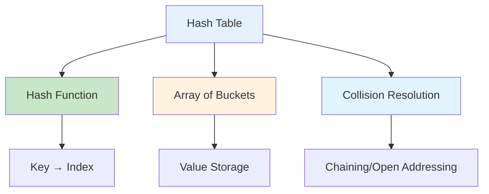
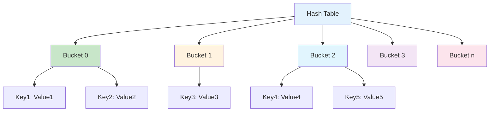
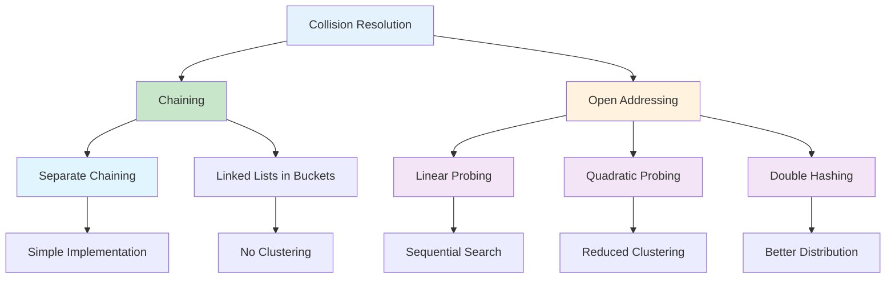
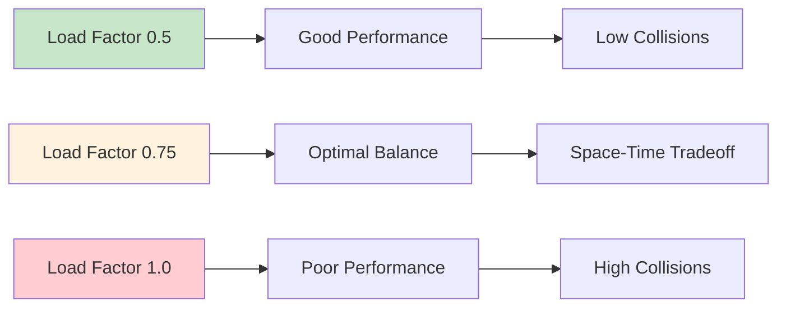
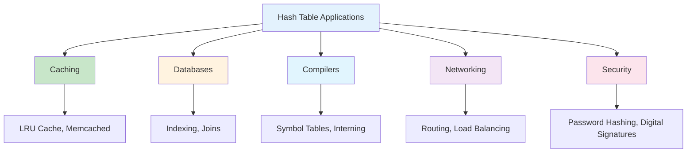
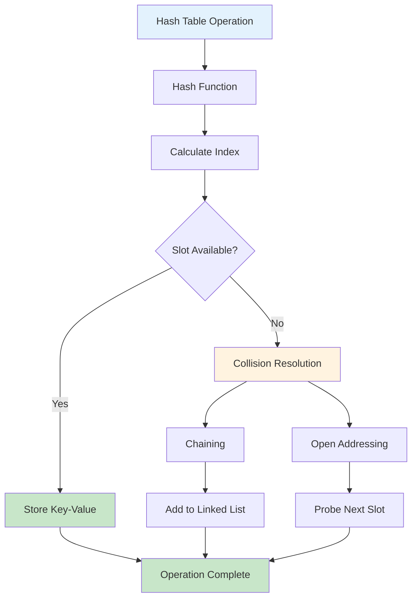

# Hash Tables in Python

## Table of Contents

1. [Introduction](#introduction)
2. [Hash Table Fundamentals](#hash-table-fundamentals)
3. [Python Dictionary Implementation](#python-dictionary-implementation)
4. [Hash Functions](#hash-functions)
5. [Collision Resolution](#collision-resolution)
6. [Performance Analysis](#performance-analysis)
7. [Advanced Hash Table Types](#advanced-hash-table-types)
8. [Use Cases and Applications](#use-cases-and-applications)
9. [Best Practices](#best-practices)
10. [Visual Representations](#visual-representations)

## Introduction

A hash table (hash map) is a data structure that implements an associative array abstract data type, using a hash function to compute an index into an array of buckets or slots. Hash tables provide average O(1) time complexity for search, insert, and delete operations.

### Key Characteristics

- **Key-Value Storage**: Maps keys to values
- **Hash Function**: Converts keys to array indices
- **Collision Handling**: Manages multiple keys mapping to same index
- **Dynamic Resizing**: Grows/shrinks as needed



## Hash Table Fundamentals

### Basic Hash Table Implementation

```python
class HashTable:
    def __init__(self, initial_capacity=16, load_factor=0.75):
        self.capacity = initial_capacity
        self.load_factor = load_factor
        self.size = 0
        self.buckets = [[] for _ in range(self.capacity)]

    def _hash(self, key):
        """Simple hash function using built-in hash()"""
        return hash(key) % self.capacity

    def _resize(self):
        """Resize the hash table when load factor is exceeded"""
        old_buckets = self.buckets
        self.capacity *= 2
        self.buckets = [[] for _ in range(self.capacity)]
        self.size = 0

        for bucket in old_buckets:
            for key, value in bucket:
                self.put(key, value)

    def put(self, key, value):
        """Insert or update a key-value pair"""
        if self.size >= self.capacity * self.load_factor:
            self._resize()

        index = self._hash(key)
        bucket = self.buckets[index]

        # Check if key already exists
        for i, (k, v) in enumerate(bucket):
            if k == key:
                bucket[i] = (key, value)
                return

        # Add new key-value pair
        bucket.append((key, value))
        self.size += 1

    def get(self, key):
        """Retrieve value for a key"""
        index = self._hash(key)
        bucket = self.buckets[index]

        for k, v in bucket:
            if k == key:
                return v

        raise KeyError(f"Key '{key}' not found")

    def delete(self, key):
        """Remove a key-value pair"""
        index = self._hash(key)
        bucket = self.buckets[index]

        for i, (k, v) in enumerate(bucket):
            if k == key:
                del bucket[i]
                self.size -= 1
                return v

        raise KeyError(f"Key '{key}' not found")

    def contains(self, key):
        """Check if key exists"""
        try:
            self.get(key)
            return True
        except KeyError:
            return False

    def keys(self):
        """Get all keys"""
        for bucket in self.buckets:
            for key, _ in bucket:
                yield key

    def values(self):
        """Get all values"""
        for bucket in self.buckets:
            for _, value in bucket:
                yield value

    def items(self):
        """Get all key-value pairs"""
        for bucket in self.buckets:
            for key, value in bucket:
                yield key, value
```

### Hash Table Structure



## Python Dictionary Implementation

### Built-in Dictionary Features

```python
# Dictionary creation and operations
my_dict = {'name': 'Alice', 'age': 30, 'city': 'New York'}

# Accessing values
name = my_dict['name']  # Direct access
age = my_dict.get('age', 0)  # Safe access with default

# Modifying values
my_dict['age'] = 31  # Update existing
my_dict['email'] = 'alice@example.com'  # Add new

# Dictionary methods
keys = my_dict.keys()
values = my_dict.values()
items = my_dict.items()

# Dictionary comprehension
squares = {x: x**2 for x in range(10)}
filtered = {k: v for k, v in my_dict.items() if isinstance(v, int)}
```

### Advanced Dictionary Operations

```python
from collections import defaultdict, Counter, OrderedDict

# DefaultDict - provides default values for missing keys
dd = defaultdict(list)
dd['fruits'].append('apple')
dd['fruits'].append('banana')

# Counter - counts hashable objects
counter = Counter(['apple', 'banana', 'apple', 'orange'])
print(counter['apple'])  # 2

# OrderedDict - maintains insertion order (Python 3.7+ dicts are ordered)
od = OrderedDict()
od['first'] = 1
od['second'] = 2
od['third'] = 3

# Dictionary merging (Python 3.9+)
dict1 = {'a': 1, 'b': 2}
dict2 = {'c': 3, 'd': 4}
merged = dict1 | dict2  # {'a': 1, 'b': 2, 'c': 3, 'd': 4}
```

## Hash Functions

### Hash Function Properties

```python
class HashFunction:
    @staticmethod
    def simple_hash(key, table_size):
        """Simple hash function using modulo"""
        return hash(key) % table_size

    @staticmethod
    def djb2_hash(key):
        """DJB2 hash function - good distribution"""
        hash_value = 5381
        for char in str(key):
            hash_value = ((hash_value << 5) + hash_value) + ord(char)
        return hash_value

    @staticmethod
    def sdbm_hash(key):
        """SDBM hash function"""
        hash_value = 0
        for char in str(key):
            hash_value = ord(char) + (hash_value << 6) + (hash_value << 16) - hash_value
        return hash_value

    @staticmethod
    def fnv_hash(key):
        """FNV-1a hash function"""
        hash_value = 2166136261
        for char in str(key):
            hash_value ^= ord(char)
            hash_value *= 16777619
        return hash_value
```

### Hash Function Characteristics

```mermaid
graph TD
    A[Hash Function] --> B[Deterministic]
    A --> C[Uniform Distribution]
    A --> D[Fast Computation]
    A --> E[Avalanche Effect]

    B --> F[Same input → Same output]
    C --> G[Even bucket distribution]
    D --> H[O(1) computation time]
    E --> I[Small input change → Large output change]

    style A fill:#e3f2fd
    style B fill:#c8e6c9
    style C fill:#c8e6c9
    style D fill:#c8e6c9
    style E fill:#c8e6c9
```

## Collision Resolution

### 1. Chaining (Separate Chaining)

```python
class ChainingHashTable:
    def __init__(self, capacity=16):
        self.capacity = capacity
        self.buckets = [[] for _ in range(capacity)]
        self.size = 0

    def _hash(self, key):
        return hash(key) % self.capacity

    def put(self, key, value):
        index = self._hash(key)
        bucket = self.buckets[index]

        # Check if key exists and update
        for i, (k, v) in enumerate(bucket):
            if k == key:
                bucket[i] = (key, value)
                return

        # Add new key-value pair
        bucket.append((key, value))
        self.size += 1

    def get(self, key):
        index = self._hash(key)
        bucket = self.buckets[index]

        for k, v in bucket:
            if k == key:
                return v

        raise KeyError(f"Key '{key}' not found")
```

### 2. Open Addressing (Linear Probing)

```python
class OpenAddressingHashTable:
    def __init__(self, capacity=16):
        self.capacity = capacity
        self.keys = [None] * capacity
        self.values = [None] * capacity
        self.size = 0
        self.deleted = [False] * capacity

    def _hash(self, key):
        return hash(key) % self.capacity

    def _find_slot(self, key):
        """Find slot for key using linear probing"""
        index = self._hash(key)

        while self.keys[index] is not None:
            if self.keys[index] == key and not self.deleted[index]:
                return index
            index = (index + 1) % self.capacity

        return index

    def put(self, key, value):
        index = self._find_slot(key)

        if self.keys[index] is None or self.deleted[index]:
            self.size += 1

        self.keys[index] = key
        self.values[index] = value
        self.deleted[index] = False

    def get(self, key):
        index = self._find_slot(key)

        if self.keys[index] == key and not self.deleted[index]:
            return self.values[index]

        raise KeyError(f"Key '{key}' not found")

    def delete(self, key):
        index = self._find_slot(key)

        if self.keys[index] == key and not self.deleted[index]:
            self.deleted[index] = True
            self.size -= 1
            return self.values[index]

        raise KeyError(f"Key '{key}' not found")
```

### Collision Resolution Methods



## Performance Analysis

### Time Complexity

| Operation | Average Case | Worst Case | Description                          |
| --------- | ------------ | ---------- | ------------------------------------ |
| Search    | O(1)         | O(n)       | Hash function + collision resolution |
| Insert    | O(1)         | O(n)       | Hash function + collision resolution |
| Delete    | O(1)         | O(n)       | Hash function + collision resolution |
| Resize    | O(n)         | O(n)       | Rehash all elements                  |

### Space Complexity

| Aspect      | Space Complexity | Description                      |
| ----------- | ---------------- | -------------------------------- |
| Storage     | O(n)             | n key-value pairs                |
| Auxiliary   | O(1)             | Constant extra space             |
| Load Factor | O(n)             | Space for load factor management |

### Load Factor Impact



## Advanced Hash Table Types

### 1. Consistent Hashing

```python
import hashlib

class ConsistentHash:
    def __init__(self, nodes=None, replicas=3):
        self.replicas = replicas
        self.ring = {}
        self.sorted_keys = []

        if nodes:
            for node in nodes:
                self.add_node(node)

    def _hash(self, key):
        return int(hashlib.md5(key.encode()).hexdigest(), 16)

    def add_node(self, node):
        for i in range(self.replicas):
            key = self._hash(f"{node}:{i}")
            self.ring[key] = node
            self.sorted_keys.append(key)

        self.sorted_keys.sort()

    def remove_node(self, node):
        for i in range(self.replicas):
            key = self._hash(f"{node}:{i}")
            del self.ring[key]
            self.sorted_keys.remove(key)

    def get_node(self, key):
        if not self.ring:
            return None

        hash_key = self._hash(key)

        for ring_key in self.sorted_keys:
            if hash_key <= ring_key:
                return self.ring[ring_key]

        return self.ring[self.sorted_keys[0]]
```

### 2. Bloom Filter

```python
import hashlib
from bitarray import bitarray

class BloomFilter:
    def __init__(self, size, hash_count):
        self.size = size
        self.hash_count = hash_count
        self.bit_array = bitarray(size)
        self.bit_array.setall(0)

    def _hash(self, item, seed):
        hash_obj = hashlib.md5()
        hash_obj.update(f"{item}{seed}".encode())
        return int(hash_obj.hexdigest(), 16) % self.size

    def add(self, item):
        for i in range(self.hash_count):
            index = self._hash(item, i)
            self.bit_array[index] = 1

    def contains(self, item):
        for i in range(self.hash_count):
            index = self._hash(item, i)
            if self.bit_array[index] == 0:
                return False
        return True
```

### 3. Cuckoo Hash Table

```python
class CuckooHashTable:
    def __init__(self, capacity=16):
        self.capacity = capacity
        self.table1 = [None] * capacity
        self.table2 = [None] * capacity
        self.size = 0
        self.max_attempts = capacity

    def _hash1(self, key):
        return hash(key) % self.capacity

    def _hash2(self, key):
        return (hash(key) * 31) % self.capacity

    def put(self, key, value):
        if self.size >= self.capacity:
            self._resize()

        current_key, current_value = key, value

        for _ in range(self.max_attempts):
            # Try table1
            index1 = self._hash1(current_key)
            if self.table1[index1] is None:
                self.table1[index1] = (current_key, current_value)
                self.size += 1
                return

            # Evict and try table2
            evicted_key, evicted_value = self.table1[index1]
            self.table1[index1] = (current_key, current_value)
            current_key, current_value = evicted_key, evicted_value

            # Try table2
            index2 = self._hash2(current_key)
            if self.table2[index2] is None:
                self.table2[index2] = (current_key, current_value)
                self.size += 1
                return

            # Evict and continue
            evicted_key, evicted_value = self.table2[index2]
            self.table2[index2] = (current_key, current_value)
            current_key, current_value = evicted_key, evicted_value

        # If we get here, we need to resize
        self._resize()
        self.put(current_key, current_value)

    def get(self, key):
        index1 = self._hash1(key)
        if self.table1[index1] and self.table1[index1][0] == key:
            return self.table1[index1][1]

        index2 = self._hash2(key)
        if self.table2[index2] and self.table2[index2][0] == key:
            return self.table2[index2][1]

        raise KeyError(f"Key '{key}' not found")
```

## Use Cases and Applications

### 1. Caching Systems

- **LRU Cache**: Least Recently Used cache implementation
- **Memcached**: Distributed memory caching system
- **Redis**: In-memory data structure store

### 2. Database Systems

- **Indexing**: Primary and secondary indexes
- **Join Operations**: Hash joins for table operations
- **Query Optimization**: Hash-based query processing

### 3. Compiler Design

- **Symbol Tables**: Variable and function lookup
- **String Interning**: Efficient string storage
- **Type Checking**: Type information storage

### 4. Network Applications

- **Routing Tables**: IP address to interface mapping
- **Session Management**: User session storage
- **Load Balancing**: Consistent hashing for distribution

### Application Areas



## Best Practices

### 1. Hash Function Selection

```python
# Good hash function characteristics
def good_hash_function(key):
    # Deterministic
    # Uniform distribution
    # Fast computation
    # Avalanche effect
    return hash(key)

# Avoid poor hash functions
def bad_hash_function(key):
    # Too simple - causes clustering
    return len(str(key)) % 1000
```

### 2. Load Factor Management

```python
class OptimizedHashTable:
    def __init__(self, initial_capacity=16, max_load_factor=0.75):
        self.capacity = initial_capacity
        self.max_load_factor = max_load_factor
        self.size = 0
        self.buckets = [[] for _ in range(self.capacity)]

    def _should_resize(self):
        return self.size >= self.capacity * self.max_load_factor

    def put(self, key, value):
        if self._should_resize():
            self._resize()
        # ... rest of implementation
```

### 3. Memory Management

```python
# Proper cleanup
def clear_hash_table(ht):
    ht.buckets.clear()
    ht.size = 0
    ht.capacity = 16
    ht.buckets = [[] for _ in range(ht.capacity)]

# Weak references for large objects
import weakref

class WeakValueHashTable:
    def __init__(self):
        self.data = weakref.WeakValueDictionary()
```

### 4. Thread Safety

```python
import threading

class ThreadSafeHashTable:
    def __init__(self):
        self.data = {}
        self.lock = threading.RLock()

    def put(self, key, value):
        with self.lock:
            self.data[key] = value

    def get(self, key):
        with self.lock:
            return self.data.get(key)
```

## Visual Representations

### Hash Table Operations Flow



### Collision Resolution Visualization

```mermaid
graph TD
    A[Hash Collision] --> B[Key1 → Index 2]
    A --> C[Key2 → Index 2]

    B --> D[Store Key1: Value1]
    C --> E[Collision Detected]

    E --> F[Chaining Solution]
    E --> G[Open Addressing Solution]

    F --> H[Index 2: [Key1, Key2]]
    G --> I[Key2 → Index 3]

    style A fill:#e3f2fd
    style E fill:#ffcdd2
    style F fill:#c8e6c9
    style G fill:#fff3e0
```

### Performance Comparison

```mermaid
graph LR
    A[Data Structure] --> B[Hash Table]
    A --> C[Binary Search Tree]
    A --> D[Array]

    B --> E[Search: O(1)]
    B --> F[Insert: O(1)]
    B --> G[Delete: O(1)]

    C --> H[Search: O(log n)]
    C --> I[Insert: O(log n)]
    C --> J[Delete: O(log n)]

    D --> K[Search: O(n)]
    D --> L[Insert: O(n)]
    D --> M[Delete: O(n)]

    style B fill:#c8e6c9
    style C fill:#fff3e0
    style D fill:#ffcdd2
```

## Conclusion

Hash tables are fundamental data structures that provide efficient key-value storage and retrieval. Python's built-in dictionary is a highly optimized hash table implementation that serves most use cases effectively.

Key considerations for hash table usage:

- **Hash Function Quality**: Critical for performance and distribution
- **Load Factor Management**: Balance between space and time efficiency
- **Collision Resolution**: Choose appropriate strategy for your use case
- **Memory Management**: Consider memory usage and cleanup
- **Thread Safety**: Use appropriate synchronization for concurrent access

Hash tables excel in scenarios requiring fast lookups, caching, and associative data storage. Understanding their implementation details and performance characteristics is essential for building efficient applications.

The choice between different hash table implementations depends on specific requirements such as memory constraints, access patterns, and concurrency needs. Python's dictionary provides an excellent starting point, with specialized implementations available for specific use cases.
