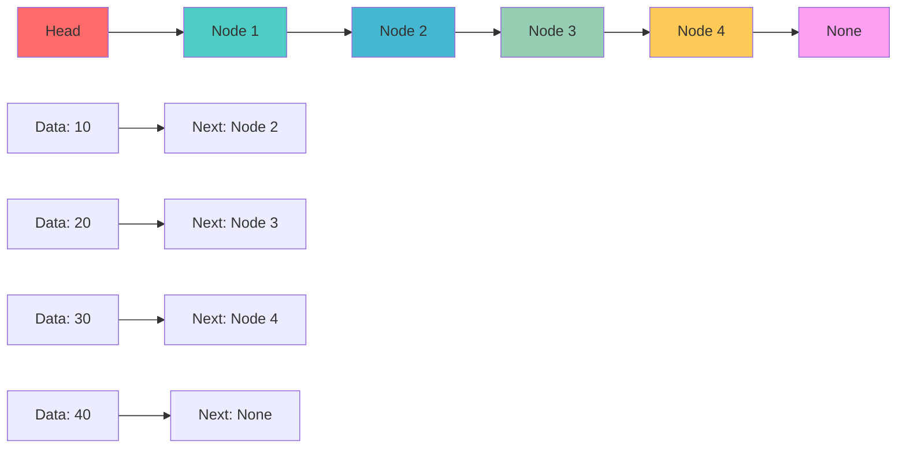
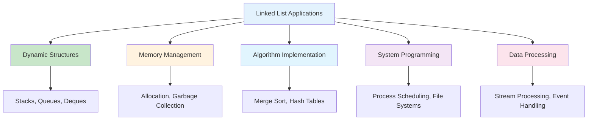
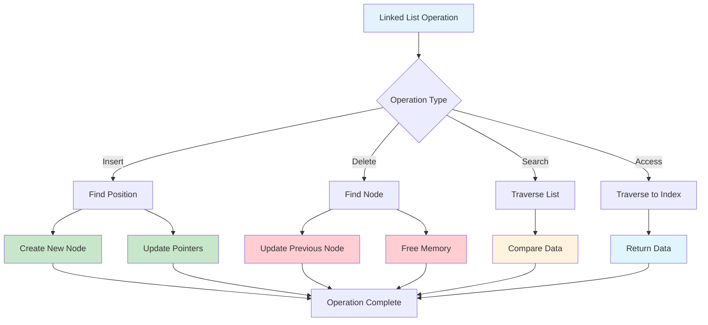

# Linked Lists in Python

## Table of Contents

1. [Introduction](#introduction)
2. [Linked List Fundamentals](#linked-list-fundamentals)
3. [Types of Linked Lists](#types-of-linked-lists)
4. [Basic Operations](#basic-operations)
5. [Advanced Operations](#advanced-operations)
6. [Performance Analysis](#performance-analysis)
7. [Use Cases and Applications](#use-cases-and-applications)
8. [Best Practices](#best-practices)
9. [Visual Representations](#visual-representations)

## Introduction

A linked list is a linear data structure where elements are stored in nodes, and each node contains a data field and a reference (link) to the next node in the sequence. Unlike arrays, linked lists don't store elements in contiguous memory locations, providing dynamic size and efficient insertion/deletion operations.

### Key Characteristics

- **Dynamic Size**: Can grow and shrink during runtime
- **Non-contiguous Memory**: Elements stored in different memory locations
- **Sequential Access**: Must traverse from head to access elements
- **Efficient Insertion/Deletion**: O(1) for known positions

```mermaid
graph TD
    A[Linked List Structure] --> B[Dynamic Size]
    A --> C[Non-contiguous Memory]
    A --> D[Sequential Access]
    A --> E[Efficient Insertion/Deletion]

    B --> F[Grows/Shrinks at Runtime]
    C --> G[Memory Flexibility]
    D --> H[Must Traverse from Head]
    E --> I[O(1) for Known Positions]

    style A fill:#e3f2fd
    style B fill:#c8e6c9
    style C fill:#c8e6c9
    style D fill:#c8e6c9
    style E fill:#c8e6c9
```

## Linked List Fundamentals

### Basic Node Structure

```python
class ListNode:
    def __init__(self, data):
        self.data = data
        self.next = None

    def __str__(self):
        return str(self.data)

    def __repr__(self):
        return f"ListNode({self.data})"
```

### Singly Linked List Implementation

```python
class SinglyLinkedList:
    def __init__(self):
        self.head = None
        self.size = 0

    def is_empty(self):
        """Check if the linked list is empty"""
        return self.head is None

    def get_size(self):
        """Get the number of nodes in the linked list"""
        return self.size

    def prepend(self, data):
        """Add a new node at the beginning"""
        new_node = ListNode(data)
        new_node.next = self.head
        self.head = new_node
        self.size += 1

    def append(self, data):
        """Add a new node at the end"""
        new_node = ListNode(data)

        if self.is_empty():
            self.head = new_node
        else:
            current = self.head
            while current.next:
                current = current.next
            current.next = new_node

        self.size += 1

    def insert_at(self, index, data):
        """Insert a new node at a specific index"""
        if index < 0 or index > self.size:
            raise IndexError("Index out of range")

        if index == 0:
            self.prepend(data)
            return

        new_node = ListNode(data)
        current = self.head

        for _ in range(index - 1):
            current = current.next

        new_node.next = current.next
        current.next = new_node
        self.size += 1

    def delete_first(self):
        """Delete the first node"""
        if self.is_empty():
            raise IndexError("List is empty")

        data = self.head.data
        self.head = self.head.next
        self.size -= 1
        return data

    def delete_last(self):
        """Delete the last node"""
        if self.is_empty():
            raise IndexError("List is empty")

        if self.size == 1:
            data = self.head.data
            self.head = None
            self.size = 0
            return data

        current = self.head
        while current.next.next:
            current = current.next

        data = current.next.data
        current.next = None
        self.size -= 1
        return data

    def delete_at(self, index):
        """Delete a node at a specific index"""
        if index < 0 or index >= self.size:
            raise IndexError("Index out of range")

        if index == 0:
            return self.delete_first()

        current = self.head
        for _ in range(index - 1):
            current = current.next

        data = current.next.data
        current.next = current.next.next
        self.size -= 1
        return data

    def get(self, index):
        """Get data at a specific index"""
        if index < 0 or index >= self.size:
            raise IndexError("Index out of range")

        current = self.head
        for _ in range(index):
            current = current.next

        return current.data

    def set(self, index, data):
        """Set data at a specific index"""
        if index < 0 or index >= self.size:
            raise IndexError("Index out of range")

        current = self.head
        for _ in range(index):
            current = current.next

        current.data = data

    def find(self, data):
        """Find the index of a data element"""
        current = self.head
        index = 0

        while current:
            if current.data == data:
                return index
            current = current.next
            index += 1

        return -1

    def contains(self, data):
        """Check if data exists in the list"""
        return self.find(data) != -1

    def to_list(self):
        """Convert linked list to Python list"""
        result = []
        current = self.head
        while current:
            result.append(current.data)
            current = current.next
        return result

    def __str__(self):
        if self.is_empty():
            return "[]"

        result = []
        current = self.head
        while current:
            result.append(str(current.data))
            current = current.next

        return " -> ".join(result)

    def __repr__(self):
        return f"SinglyLinkedList({self.to_list()})"
```

### Linked List Structure Visualization



## Types of Linked Lists

### 1. Doubly Linked List

```python
class DoublyListNode:
    def __init__(self, data):
        self.data = data
        self.next = None
        self.prev = None

class DoublyLinkedList:
    def __init__(self):
        self.head = None
        self.tail = None
        self.size = 0

    def is_empty(self):
        """Check if the list is empty"""
        return self.head is None

    def prepend(self, data):
        """Add a new node at the beginning"""
        new_node = DoublyListNode(data)

        if self.is_empty():
            self.head = self.tail = new_node
        else:
            new_node.next = self.head
            self.head.prev = new_node
            self.head = new_node

        self.size += 1

    def append(self, data):
        """Add a new node at the end"""
        new_node = DoublyListNode(data)

        if self.is_empty():
            self.head = self.tail = new_node
        else:
            new_node.prev = self.tail
            self.tail.next = new_node
            self.tail = new_node

        self.size += 1

    def delete_first(self):
        """Delete the first node"""
        if self.is_empty():
            raise IndexError("List is empty")

        data = self.head.data

        if self.size == 1:
            self.head = self.tail = None
        else:
            self.head = self.head.next
            self.head.prev = None

        self.size -= 1
        return data

    def delete_last(self):
        """Delete the last node"""
        if self.is_empty():
            raise IndexError("List is empty")

        data = self.tail.data

        if self.size == 1:
            self.head = self.tail = None
        else:
            self.tail = self.tail.prev
            self.tail.next = None

        self.size -= 1
        return data

    def traverse_forward(self):
        """Traverse the list from head to tail"""
        result = []
        current = self.head
        while current:
            result.append(current.data)
            current = current.next
        return result

    def traverse_backward(self):
        """Traverse the list from tail to head"""
        result = []
        current = self.tail
        while current:
            result.append(current.data)
            current = current.prev
        return result
```

### 2. Circular Linked List

```python
class CircularLinkedList:
    def __init__(self):
        self.head = None
        self.size = 0

    def is_empty(self):
        """Check if the list is empty"""
        return self.head is None

    def append(self, data):
        """Add a new node at the end"""
        new_node = ListNode(data)

        if self.is_empty():
            self.head = new_node
            new_node.next = self.head
        else:
            current = self.head
            while current.next != self.head:
                current = current.next

            current.next = new_node
            new_node.next = self.head

        self.size += 1

    def prepend(self, data):
        """Add a new node at the beginning"""
        new_node = ListNode(data)

        if self.is_empty():
            self.head = new_node
            new_node.next = self.head
        else:
            current = self.head
            while current.next != self.head:
                current = current.next

            new_node.next = self.head
            self.head = new_node
            current.next = self.head

        self.size += 1

    def delete(self, data):
        """Delete a node with specific data"""
        if self.is_empty():
            return False

        current = self.head
        prev = None

        # Find the node to delete
        while True:
            if current.data == data:
                break
            prev = current
            current = current.next

            if current == self.head:
                return False  # Data not found

        # Delete the node
        if current == self.head and current.next == self.head:
            # Only one node
            self.head = None
        elif current == self.head:
            # Delete head node
            prev = self.head
            while prev.next != self.head:
                prev = prev.next
            self.head = current.next
            prev.next = self.head
        else:
            # Delete middle or tail node
            prev.next = current.next

        self.size -= 1
        return True

    def traverse(self):
        """Traverse the circular list"""
        if self.is_empty():
            return []

        result = []
        current = self.head

        while True:
            result.append(current.data)
            current = current.next
            if current == self.head:
                break

        return result
```

### 3. Skip List

```python
import random

class SkipListNode:
    def __init__(self, data, level):
        self.data = data
        self.forward = [None] * (level + 1)

class SkipList:
    def __init__(self, max_level=16, probability=0.5):
        self.max_level = max_level
        self.probability = probability
        self.level = 0
        self.head = SkipListNode(float('-inf'), max_level)

    def _random_level(self):
        """Generate random level for a new node"""
        level = 0
        while random.random() < self.probability and level < self.max_level:
            level += 1
        return level

    def insert(self, data):
        """Insert a new node"""
        update = [None] * (self.max_level + 1)
        current = self.head

        # Find the position to insert
        for i in range(self.level, -1, -1):
            while current.forward[i] and current.forward[i].data < data:
                current = current.forward[i]
            update[i] = current

        current = current.forward[0]

        # If data already exists, don't insert
        if current is None or current.data != data:
            new_level = self._random_level()

            # If new level is higher than current level
            if new_level > self.level:
                for i in range(self.level + 1, new_level + 1):
                    update[i] = self.head
                self.level = new_level

            # Create new node
            new_node = SkipListNode(data, new_level)

            # Update forward pointers
            for i in range(new_level + 1):
                new_node.forward[i] = update[i].forward[i]
                update[i].forward[i] = new_node

    def search(self, data):
        """Search for a node with given data"""
        current = self.head

        for i in range(self.level, -1, -1):
            while current.forward[i] and current.forward[i].data < data:
                current = current.forward[i]

        current = current.forward[0]
        return current is not None and current.data == data

    def delete(self, data):
        """Delete a node with given data"""
        update = [None] * (self.max_level + 1)
        current = self.head

        # Find the node to delete
        for i in range(self.level, -1, -1):
            while current.forward[i] and current.forward[i].data < data:
                current = current.forward[i]
            update[i] = current

        current = current.forward[0]

        # If node exists, delete it
        if current is not None and current.data == data:
            for i in range(self.level + 1):
                if update[i].forward[i] != current:
                    break
                update[i].forward[i] = current.forward[i]

            # Update level if necessary
            while self.level > 0 and self.head.forward[self.level] is None:
                self.level -= 1

            return True

        return False
```

### Linked List Types Comparison

```mermaid
graph TD
    A[Linked List Types] --> B[Singly Linked]
    A --> C[Doubly Linked]
    A --> D[Circular Linked]
    A --> E[Skip List]

    B --> F[One Pointer per Node]
    B --> G[Forward Traversal Only]

    C --> H[Two Pointers per Node]
    C --> I[Bidirectional Traversal]

    D --> J[Last Points to First]
    D --> K[No Null Terminator]

    E --> L[Multiple Levels]
    E --> M[O(log n) Search]

    style A fill:#e3f2fd
    style B fill:#c8e6c9
    style C fill:#fff3e0
    style D fill:#e1f5fe
    style E fill:#f3e5f5
```

## Basic Operations

### 1. Reversal Operations

```python
class LinkedListOperations:
    def __init__(self, linked_list):
        self.linked_list = linked_list

    def reverse_iterative(self):
        """Reverse the linked list iteratively"""
        prev = None
        current = self.linked_list.head

        while current:
            next_node = current.next
            current.next = prev
            prev = current
            current = next_node

        self.linked_list.head = prev

    def reverse_recursive(self):
        """Reverse the linked list recursively"""
        def reverse_helper(current, prev):
            if current is None:
                return prev

            next_node = current.next
            current.next = prev
            return reverse_helper(next_node, current)

        self.linked_list.head = reverse_helper(self.linked_list.head, None)

    def reverse_in_groups(self, k):
        """Reverse the linked list in groups of k"""
        def reverse_group(head, k):
            if head is None:
                return None

            current = head
            prev = None
            count = 0

            # Reverse first k nodes
            while current and count < k:
                next_node = current.next
                current.next = prev
                prev = current
                current = next_node
                count += 1

            # Recursively reverse remaining groups
            if current:
                head.next = reverse_group(current, k)

            return prev

        self.linked_list.head = reverse_group(self.linked_list.head, k)
```

### 2. Detection Operations

```python
class LinkedListOperations:
    def detect_cycle(self):
        """Detect if there's a cycle in the linked list"""
        if self.linked_list.head is None:
            return False

        slow = fast = self.linked_list.head

        while fast and fast.next:
            slow = slow.next
            fast = fast.next.next

            if slow == fast:
                return True

        return False

    def find_cycle_start(self):
        """Find the starting node of a cycle"""
        if self.linked_list.head is None:
            return None

        slow = fast = self.linked_list.head

        # Detect cycle
        while fast and fast.next:
            slow = slow.next
            fast = fast.next.next

            if slow == fast:
                break
        else:
            return None  # No cycle

        # Find cycle start
        slow = self.linked_list.head
        while slow != fast:
            slow = slow.next
            fast = fast.next

        return slow

    def find_middle(self):
        """Find the middle node of the linked list"""
        if self.linked_list.head is None:
            return None

        slow = fast = self.linked_list.head

        while fast and fast.next:
            slow = slow.next
            fast = fast.next.next

        return slow

    def find_nth_from_end(self, n):
        """Find the nth node from the end"""
        if self.linked_list.head is None or n <= 0:
            return None

        first = second = self.linked_list.head

        # Move first pointer n positions ahead
        for _ in range(n):
            if first is None:
                return None
            first = first.next

        # Move both pointers until first reaches end
        while first:
            first = first.next
            second = second.next

        return second
```

### 3. Merging Operations

```python
class LinkedListOperations:
    def merge_sorted(self, other_list):
        """Merge two sorted linked lists"""
        dummy = ListNode(0)
        current = dummy

        list1 = self.linked_list.head
        list2 = other_list.head

        while list1 and list2:
            if list1.data <= list2.data:
                current.next = list1
                list1 = list1.next
            else:
                current.next = list2
                list2 = list2.next
            current = current.next

        # Attach remaining nodes
        current.next = list1 if list1 else list2

        self.linked_list.head = dummy.next
        self.linked_list.size += other_list.size

    def merge_sort(self):
        """Sort the linked list using merge sort"""
        def merge_sort_helper(head):
            if head is None or head.next is None:
                return head

            # Find middle
            slow = fast = head
            while fast.next and fast.next.next:
                slow = slow.next
                fast = fast.next.next

            # Split into two halves
            mid = slow.next
            slow.next = None

            # Recursively sort both halves
            left = merge_sort_helper(head)
            right = merge_sort_helper(mid)

            # Merge sorted halves
            return self._merge(left, right)

        self.linked_list.head = merge_sort_helper(self.linked_list.head)

    def _merge(self, left, right):
        """Helper method to merge two sorted lists"""
        dummy = ListNode(0)
        current = dummy

        while left and right:
            if left.data <= right.data:
                current.next = left
                left = left.next
            else:
                current.next = right
                right = right.next
            current = current.next

        current.next = left if left else right
        return dummy.next
```

## Advanced Operations

### 1. Palindrome Detection

```python
class AdvancedLinkedListOperations:
    def __init__(self, linked_list):
        self.linked_list = linked_list

    def is_palindrome_stack(self):
        """Check if linked list is palindrome using stack"""
        if self.linked_list.head is None:
            return True

        stack = []
        current = self.linked_list.head

        # Push all elements to stack
        while current:
            stack.append(current.data)
            current = current.next

        # Check palindrome
        current = self.linked_list.head
        while current:
            if current.data != stack.pop():
                return False
            current = current.next

        return True

    def is_palindrome_optimized(self):
        """Check if linked list is palindrome using O(1) space"""
        if self.linked_list.head is None:
            return True

        # Find middle
        slow = fast = self.linked_list.head
        while fast and fast.next:
            slow = slow.next
            fast = fast.next.next

        # Reverse second half
        second_half = self._reverse(slow)

        # Compare both halves
        first_half = self.linked_list.head
        result = True

        while second_half:
            if first_half.data != second_half.data:
                result = False
                break
            first_half = first_half.next
            second_half = second_half.next

        # Restore second half
        self._reverse(slow)

        return result

    def _reverse(self, head):
        """Helper method to reverse a linked list"""
        prev = None
        current = head

        while current:
            next_node = current.next
            current.next = prev
            prev = current
            current = next_node

        return prev
```

### 2. Intersection Detection

```python
class AdvancedLinkedListOperations:
    def find_intersection(self, other_list):
        """Find intersection point of two linked lists"""
        len1 = self.linked_list.get_size()
        len2 = other_list.get_size()

        # Make both lists the same length
        current1 = self.linked_list.head
        current2 = other_list.head

        if len1 > len2:
            for _ in range(len1 - len2):
                current1 = current1.next
        else:
            for _ in range(len2 - len1):
                current2 = current2.next

        # Find intersection
        while current1 and current2:
            if current1 == current2:
                return current1
            current1 = current1.next
            current2 = current2.next

        return None

    def create_intersection(self, other_list, position):
        """Create intersection between two lists at given position"""
        if position < 0 or position >= self.linked_list.get_size():
            raise IndexError("Invalid position")

        # Find the node at position
        current = self.linked_list.head
        for _ in range(position):
            current = current.next

        # Make other list point to this node
        other_current = other_list.head
        while other_current.next:
            other_current = other_current.next
        other_current.next = current
```

### 3. Advanced Manipulations

```python
class AdvancedLinkedListOperations:
    def remove_duplicates(self):
        """Remove duplicate nodes from sorted linked list"""
        if self.linked_list.head is None:
            return

        current = self.linked_list.head
        while current and current.next:
            if current.data == current.next.data:
                current.next = current.next.next
                self.linked_list.size -= 1
            else:
                current = current.next

    def remove_duplicates_unsorted(self):
        """Remove duplicates from unsorted linked list"""
        if self.linked_list.head is None:
            return

        seen = set()
        current = self.linked_list.head
        prev = None

        while current:
            if current.data in seen:
                prev.next = current.next
                self.linked_list.size -= 1
            else:
                seen.add(current.data)
                prev = current
            current = current.next

    def swap_nodes(self, x, y):
        """Swap two nodes without swapping data"""
        if x == y:
            return

        # Find nodes and their previous nodes
        prev_x = prev_y = None
        curr_x = curr_y = self.linked_list.head

        while curr_x and curr_x.data != x:
            prev_x = curr_x
            curr_x = curr_x.next

        while curr_y and curr_y.data != y:
            prev_y = curr_y
            curr_y = curr_y.next

        if curr_x is None or curr_y is None:
            return

        # Update previous nodes
        if prev_x:
            prev_x.next = curr_y
        else:
            self.linked_list.head = curr_y

        if prev_y:
            prev_y.next = curr_x
        else:
            self.linked_list.head = curr_x

        # Update next nodes
        curr_x.next, curr_y.next = curr_y.next, curr_x.next
```

## Performance Analysis

### Time Complexity

| Operation             | Time Complexity | Description              |
| --------------------- | --------------- | ------------------------ |
| Access                | O(n)            | Must traverse from head  |
| Search                | O(n)            | Linear search required   |
| Insertion (beginning) | O(1)            | Direct head modification |
| Insertion (end)       | O(n)            | Must traverse to end     |
| Insertion (middle)    | O(n)            | Must find position       |
| Deletion (beginning)  | O(1)            | Direct head modification |
| Deletion (end)        | O(n)            | Must traverse to end     |
| Deletion (middle)     | O(n)            | Must find position       |

### Space Complexity

| Aspect    | Space Complexity | Description                         |
| --------- | ---------------- | ----------------------------------- |
| Storage   | O(n)             | n nodes with data and pointers      |
| Auxiliary | O(1)             | Constant extra space for operations |
| Recursion | O(n)             | Stack space for recursive calls     |

### Performance Characteristics

```mermaid
graph LR
    A[Linked List Performance] --> B[O(1) Insert/Delete at Head]
    A --> C[O(n) Access/Search]
    A --> D[O(n) Insert/Delete at End]
    A --> E[Dynamic Size]

    B --> F[Efficient for Stacks]
    C --> G[Sequential Access Only]
    D --> H[Must Traverse]
    E --> I[No Pre-allocation]

    style A fill:#e3f2fd
    style B fill:#c8e6c9
    style C fill:#ffcdd2
    style D fill:#fff3e0
    style E fill:#c8e6c9
```

## Use Cases and Applications

### 1. Dynamic Data Structures

- **Stacks**: LIFO operations with O(1) push/pop
- **Queues**: FIFO operations with O(1) enqueue/dequeue
- **Deques**: Double-ended operations

### 2. Memory Management

- **Dynamic Allocation**: Flexible memory usage
- **Garbage Collection**: Reference tracking
- **Memory Pools**: Efficient memory management

### 3. Algorithm Implementation

- **Merge Sort**: Efficient merging of sorted lists
- **Radix Sort**: Digit-based sorting
- **Hash Table Chaining**: Collision resolution

### 4. System Programming

- **Process Scheduling**: Task queues
- **File Systems**: Directory structures
- **Network Protocols**: Packet queuing

### 5. Data Processing

- **Stream Processing**: Continuous data handling
- **Event Handling**: Event queues
- **Buffer Management**: Data buffering

### Application Areas



## Best Practices

### 1. Memory Management

```python
class MemoryEfficientLinkedList:
    def __init__(self):
        self.head = None
        self.size = 0
        self.free_nodes = []  # Pool of free nodes

    def _get_node(self, data):
        """Get a node from pool or create new one"""
        if self.free_nodes:
            node = self.free_nodes.pop()
            node.data = data
            node.next = None
        else:
            node = ListNode(data)
        return node

    def _return_node(self, node):
        """Return node to pool for reuse"""
        node.data = None
        node.next = None
        self.free_nodes.append(node)

    def delete_at(self, index):
        """Delete with memory management"""
        if index < 0 or index >= self.size:
            raise IndexError("Index out of range")

        if index == 0:
            old_head = self.head
            self.head = self.head.next
            self._return_node(old_head)
        else:
            current = self.head
            for _ in range(index - 1):
                current = current.next

            old_node = current.next
            current.next = current.next.next
            self._return_node(old_node)

        self.size -= 1
```

### 2. Error Handling

```python
class SafeLinkedList:
    def __init__(self):
        self.head = None
        self.size = 0

    def safe_insert(self, index, data):
        """Safely insert with error handling"""
        try:
            if index < 0 or index > self.size:
                raise IndexError("Index out of range")

            if index == 0:
                self.prepend(data)
            else:
                self.insert_at(index, data)
            return True
        except Exception as e:
            print(f"Error inserting: {e}")
            return False

    def safe_delete(self, index):
        """Safely delete with error handling"""
        try:
            if index < 0 or index >= self.size:
                raise IndexError("Index out of range")

            return self.delete_at(index)
        except Exception as e:
            print(f"Error deleting: {e}")
            return None
```

### 3. Validation

```python
class ValidatedLinkedList:
    def __init__(self, validator=None):
        self.head = None
        self.size = 0
        self.validator = validator

    def insert_with_validation(self, index, data):
        """Insert with data validation"""
        if self.validator and not self.validator(data):
            raise ValueError(f"Invalid data: {data}")

        self.insert_at(index, data)

    def is_valid(self):
        """Check if all data is valid"""
        if not self.validator:
            return True

        current = self.head
        while current:
            if not self.validator(current.data):
                return False
            current = current.next
        return True
```

### 4. Monitoring

```python
class MonitoredLinkedList:
    def __init__(self):
        self.head = None
        self.size = 0
        self.operations_count = 0
        self.max_size_reached = 0

    def insert_at(self, index, data):
        """Insert with monitoring"""
        self.operations_count += 1
        self.max_size_reached = max(self.max_size_reached, self.size + 1)

        # ... insertion logic

    def delete_at(self, index):
        """Delete with monitoring"""
        self.operations_count += 1

        # ... deletion logic

    def get_stats(self):
        """Get linked list statistics"""
        return {
            'current_size': self.size,
            'max_size_reached': self.max_size_reached,
            'operations_count': self.operations_count
        }
```

## Visual Representations

### Linked List Operations Flow



### Linked List vs Array

```mermaid
graph TD
    A[Data Structure Choice] --> B[Linked List]
    A --> C[Array]

    B --> D[Dynamic Size]
    B --> E[O(1) Insert/Delete]
    B --> F[Sequential Access]
    B --> G[Memory Overhead]

    C --> H[Fixed Size]
    C --> I[O(n) Insert/Delete]
    C --> J[Random Access]
    C --> K[Memory Efficient]

    D --> L[Grows/Shrinks]
    E --> M[At Known Positions]
    F --> N[Must Traverse]
    G --> O[Pointers + Data]

    H --> P[Pre-allocated]
    I --> Q[Shift Elements]
    J --> R[Direct Indexing]
    K --> S[Contiguous Memory]

    style B fill:#c8e6c9
    style C fill:#e1f5fe
    style D fill:#c8e6c9
    style E fill:#c8e6c9
    style F fill:#ffcdd2
    style G fill:#ffcdd2
    style H fill:#fff3e0
    style I fill:#ffcdd2
    style J fill:#c8e6c9
    style K fill:#c8e6c9
```

### Memory Layout Comparison

```mermaid
graph TD
    A[Memory Layout] --> B[Array]
    A --> C[Linked List]

    B --> D[Contiguous Memory]
    B --> E[Fixed Size]
    B --> F[Cache Friendly]

    C --> G[Scattered Memory]
    C --> H[Dynamic Size]
    C --> I[Cache Misses]

    D --> J[Memory[0,1,2,3,4]]
    E --> K[Pre-allocated]
    F --> L[Sequential Access]

    G --> M[Memory[0,5,2,8,1]]
    H --> N[Grows as Needed]
    I --> O[Pointer Following]

    style A fill:#e3f2fd
    style B fill:#c8e6c9
    style C fill:#fff3e0
    style D fill:#c8e6c9
    style E fill:#c8e6c9
    style F fill:#c8e6c9
    style G fill:#ffcdd2
    style H fill:#c8e6c9
    style I fill:#ffcdd2
```

## Conclusion

Linked lists are fundamental data structures that provide dynamic size and efficient insertion/deletion operations. They are essential in computer science and are used in various applications from system programming to algorithm implementation.

Key advantages of linked lists:

- **Dynamic Size**: Can grow and shrink during runtime
- **Efficient Insertion/Deletion**: O(1) for known positions
- **Memory Flexibility**: Non-contiguous memory allocation
- **No Memory Waste**: Only allocate what's needed
- **Easy Implementation**: Simple node-based structure

Linked lists excel in scenarios requiring:

- Dynamic data structures (stacks, queues)
- Frequent insertion/deletion operations
- Memory-constrained environments
- Implementation of other data structures
- Algorithm implementations (merge sort, etc.)

Understanding linked list operations and their performance characteristics is crucial for building efficient software systems. The choice between different linked list types depends on specific requirements:

- **Singly Linked**: Simple implementation, forward traversal only
- **Doubly Linked**: Bidirectional traversal, more memory overhead
- **Circular Linked**: No null termination, continuous traversal
- **Skip List**: Multiple levels, O(log n) search complexity

The trade-offs between linked lists and arrays depend on the specific use case:

- Use linked lists when you need dynamic size and frequent insertions/deletions
- Use arrays when you need random access and memory efficiency
- Consider the access patterns and operation frequencies in your application

Python's dynamic nature makes it well-suited for linked list implementation, though the overhead of Python objects should be considered for performance-critical applications.
