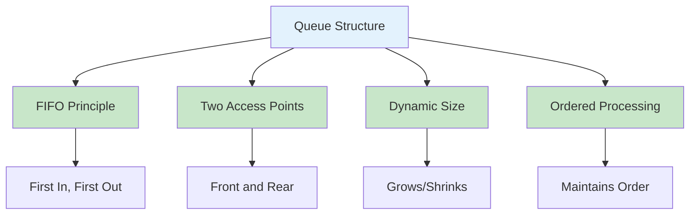
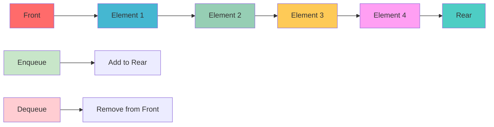
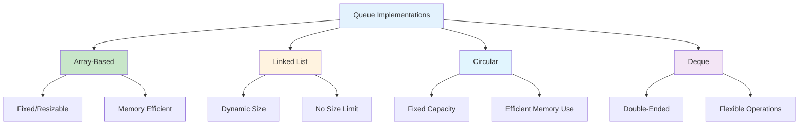
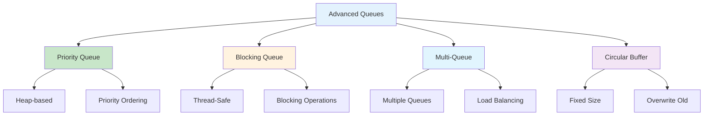
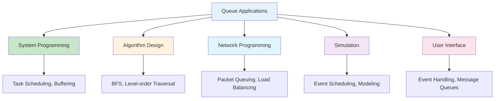
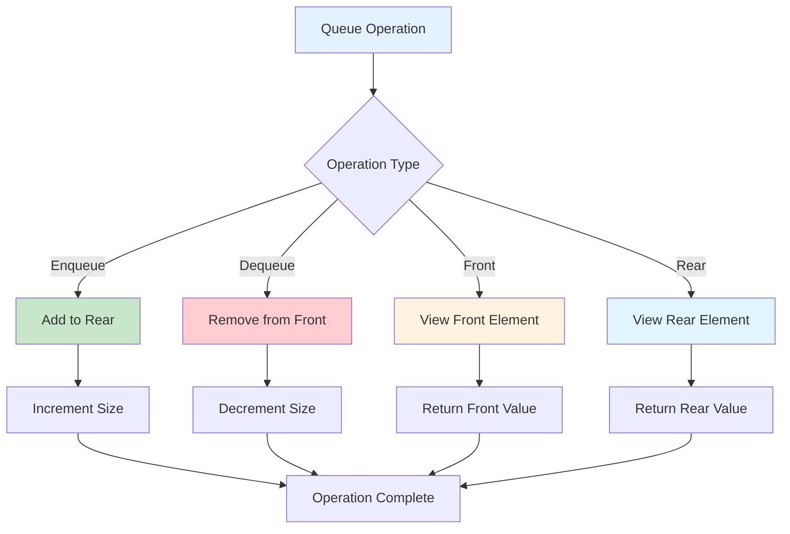
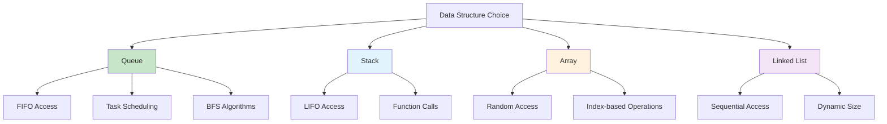
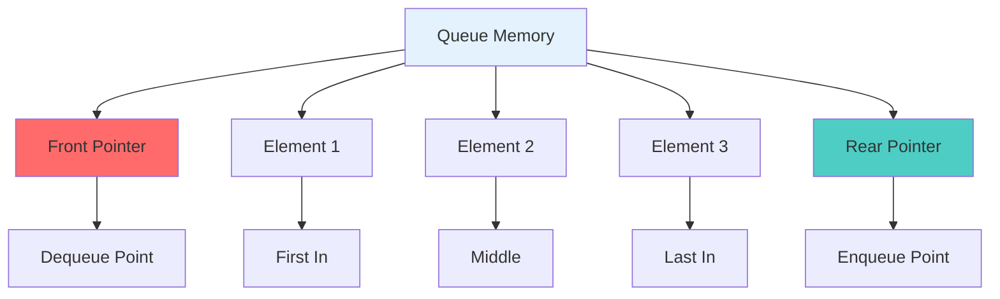

# Queues in Python

## Table of Contents

1. [Introduction](#introduction)
2. [Queue Fundamentals](#queue-fundamentals)
3. [Implementation Methods](#implementation-methods)
4. [Queue Operations](#queue-operations)
5. [Advanced Queue Types](#advanced-queue-types)
6. [Performance Analysis](#performance-analysis)
7. [Use Cases and Applications](#use-cases-and-applications)
8. [Best Practices](#best-practices)
9. [Visual Representations](#visual-representations)

## Introduction

A queue is a linear data structure that follows the First In, First Out (FIFO) principle. Elements are added at the rear (enqueue) and removed from the front (dequeue). Queues are fundamental in computer science and are used in various applications from task scheduling to breadth-first search algorithms.

### Key Characteristics

- **FIFO Principle**: First element added is the first to be removed
- **Two Access Points**: Front (dequeue) and rear (enqueue)
- **Dynamic Size**: Can grow and shrink as needed
- **Ordered Processing**: Maintains insertion order



## Queue Fundamentals

### Basic Queue Implementation

```python
class Queue:
    def __init__(self):
        self.items = []

    def enqueue(self, item):
        """Add an item to the rear of the queue"""
        self.items.append(item)

    def dequeue(self):
        """Remove and return the front item from the queue"""
        if self.is_empty():
            raise IndexError("Queue is empty")
        return self.items.pop(0)

    def front(self):
        """Return the front item without removing it"""
        if self.is_empty():
            raise IndexError("Queue is empty")
        return self.items[0]

    def rear(self):
        """Return the rear item without removing it"""
        if self.is_empty():
            raise IndexError("Queue is empty")
        return self.items[-1]

    def is_empty(self):
        """Check if the queue is empty"""
        return len(self.items) == 0

    def size(self):
        """Return the number of items in the queue"""
        return len(self.items)

    def __str__(self):
        return f"Queue({self.items})"

    def __repr__(self):
        return f"Queue({self.items})"
```

### Queue with Linked List Implementation

```python
class QueueNode:
    def __init__(self, data):
        self.data = data
        self.next = None

class LinkedQueue:
    def __init__(self):
        self.front = None
        self.rear = None
        self.size = 0

    def enqueue(self, data):
        """Add an item to the rear of the queue"""
        new_node = QueueNode(data)

        if self.rear is None:
            self.front = self.rear = new_node
        else:
            self.rear.next = new_node
            self.rear = new_node

        self.size += 1

    def dequeue(self):
        """Remove and return the front item from the queue"""
        if self.is_empty():
            raise IndexError("Queue is empty")

        data = self.front.data
        self.front = self.front.next

        if self.front is None:
            self.rear = None

        self.size -= 1
        return data

    def front(self):
        """Return the front item without removing it"""
        if self.is_empty():
            raise IndexError("Queue is empty")
        return self.front.data

    def is_empty(self):
        """Check if the queue is empty"""
        return self.front is None

    def size(self):
        """Return the number of items in the queue"""
        return self.size

    def to_list(self):
        """Convert queue to list for display"""
        result = []
        current = self.front
        while current:
            result.append(current.data)
            current = current.next
        return result
```

### Queue Structure Visualization



## Implementation Methods

### 1. Array-Based Queue

```python
class ArrayQueue:
    def __init__(self, capacity=10):
        self.capacity = capacity
        self.items = [None] * capacity
        self.front_index = 0
        self.rear_index = -1
        self.size = 0

    def enqueue(self, item):
        """Add an item to the rear of the queue"""
        if self.is_full():
            self._resize()

        self.rear_index = (self.rear_index + 1) % self.capacity
        self.items[self.rear_index] = item
        self.size += 1

    def dequeue(self):
        """Remove and return the front item from the queue"""
        if self.is_empty():
            raise IndexError("Queue is empty")

        item = self.items[self.front_index]
        self.items[self.front_index] = None
        self.front_index = (self.front_index + 1) % self.capacity
        self.size -= 1
        return item

    def front(self):
        """Return the front item without removing it"""
        if self.is_empty():
            raise IndexError("Queue is empty")
        return self.items[self.front_index]

    def is_empty(self):
        """Check if the queue is empty"""
        return self.size == 0

    def is_full(self):
        """Check if the queue is full"""
        return self.size == self.capacity

    def size(self):
        """Return the number of items in the queue"""
        return self.size

    def _resize(self):
        """Double the capacity of the queue"""
        old_capacity = self.capacity
        self.capacity *= 2
        new_items = [None] * self.capacity

        for i in range(self.size):
            new_items[i] = self.items[(self.front_index + i) % old_capacity]

        self.items = new_items
        self.front_index = 0
        self.rear_index = self.size - 1
```

### 2. Circular Queue

```python
class CircularQueue:
    def __init__(self, capacity):
        self.capacity = capacity
        self.items = [None] * capacity
        self.front = 0
        self.rear = 0
        self.size = 0

    def enqueue(self, item):
        """Add an item to the rear of the queue"""
        if self.is_full():
            raise OverflowError("Queue is full")

        self.items[self.rear] = item
        self.rear = (self.rear + 1) % self.capacity
        self.size += 1

    def dequeue(self):
        """Remove and return the front item from the queue"""
        if self.is_empty():
            raise IndexError("Queue is empty")

        item = self.items[self.front]
        self.items[self.front] = None
        self.front = (self.front + 1) % self.capacity
        self.size -= 1
        return item

    def front(self):
        """Return the front item without removing it"""
        if self.is_empty():
            raise IndexError("Queue is empty")
        return self.items[self.front]

    def is_empty(self):
        """Check if the queue is empty"""
        return self.size == 0

    def is_full(self):
        """Check if the queue is full"""
        return self.size == self.capacity

    def size(self):
        """Return the number of items in the queue"""
        return self.size
```

### 3. Deque (Double-Ended Queue)

```python
from collections import deque

class Deque:
    def __init__(self):
        self.items = deque()

    def add_front(self, item):
        """Add an item to the front of the deque"""
        self.items.appendleft(item)

    def add_rear(self, item):
        """Add an item to the rear of the deque"""
        self.items.append(item)

    def remove_front(self):
        """Remove and return the front item from the deque"""
        if self.is_empty():
            raise IndexError("Deque is empty")
        return self.items.popleft()

    def remove_rear(self):
        """Remove and return the rear item from the deque"""
        if self.is_empty():
            raise IndexError("Deque is empty")
        return self.items.pop()

    def peek_front(self):
        """Return the front item without removing it"""
        if self.is_empty():
            raise IndexError("Deque is empty")
        return self.items[0]

    def peek_rear(self):
        """Return the rear item without removing it"""
        if self.is_empty():
            raise IndexError("Deque is empty")
        return self.items[-1]

    def is_empty(self):
        """Check if the deque is empty"""
        return len(self.items) == 0

    def size(self):
        """Return the number of items in the deque"""
        return len(self.items)
```

### Implementation Comparison



## Queue Operations

### Basic Operations

```python
class QueueOperations:
    @staticmethod
    def reverse_queue(queue):
        """Reverse the order of elements in a queue"""
        if queue.is_empty():
            return

        stack = []
        # Move all elements to stack
        while not queue.is_empty():
            stack.append(queue.dequeue())

        # Move all elements back to queue
        while stack:
            queue.enqueue(stack.pop())

    @staticmethod
    def find_middle(queue):
        """Find the middle element of a queue"""
        if queue.is_empty():
            return None

        temp_queue = Queue()
        size = queue.size()
        middle_index = size // 2

        # Move elements until we reach the middle
        for i in range(middle_index):
            temp_queue.enqueue(queue.dequeue())

        middle_element = queue.front()

        # Restore the queue
        while not temp_queue.is_empty():
            queue.enqueue(temp_queue.dequeue())

        return middle_element

    @staticmethod
    def interleave_queue(queue):
        """Interleave first half with second half"""
        if queue.size() % 2 != 0:
            raise ValueError("Queue size must be even")

        stack = []
        half_size = queue.size() // 2

        # Push first half to stack
        for _ in range(half_size):
            stack.append(queue.dequeue())

        # Enqueue stack elements to queue
        while stack:
            queue.enqueue(stack.pop())

        # Move first half to rear
        for _ in range(half_size):
            queue.enqueue(queue.dequeue())

        # Push first half to stack again
        for _ in range(half_size):
            stack.append(queue.dequeue())

        # Interleave elements
        while stack:
            queue.enqueue(stack.pop())
            queue.enqueue(queue.dequeue())
```

### Advanced Operations

```python
class AdvancedQueueOperations:
    @staticmethod
    def generate_binary_numbers(n):
        """Generate binary numbers from 1 to n using queue"""
        queue = Queue()
        result = []

        queue.enqueue("1")

        for _ in range(n):
            binary = queue.dequeue()
            result.append(binary)

            queue.enqueue(binary + "0")
            queue.enqueue(binary + "1")

        return result

    @staticmethod
    def sliding_window_maximum(arr, k):
        """Find maximum in each sliding window of size k"""
        if not arr or k <= 0:
            return []

        result = []
        queue = deque()  # Store indices

        # Process first window
        for i in range(k):
            while queue and arr[i] >= arr[queue[-1]]:
                queue.pop()
            queue.append(i)

        # Process remaining elements
        for i in range(k, len(arr)):
            result.append(arr[queue[0]])

            # Remove elements outside current window
            while queue and queue[0] <= i - k:
                queue.popleft()

            # Remove elements smaller than current
            while queue and arr[i] >= arr[queue[-1]]:
                queue.pop()

            queue.append(i)

        result.append(arr[queue[0]])
        return result

    @staticmethod
    def task_scheduler(tasks, n):
        """Schedule tasks with cooldown period"""
        from collections import Counter

        task_counts = Counter(tasks)
        max_freq = max(task_counts.values())
        max_count = sum(1 for count in task_counts.values() if count == max_freq)

        return max(len(tasks), (max_freq - 1) * (n + 1) + max_count)
```

## Advanced Queue Types

### 1. Priority Queue

```python
import heapq

class PriorityQueue:
    def __init__(self):
        self.heap = []
        self.index = 0

    def enqueue(self, item, priority):
        """Add an item with priority to the queue"""
        heapq.heappush(self.heap, (priority, self.index, item))
        self.index += 1

    def dequeue(self):
        """Remove and return the highest priority item"""
        if self.is_empty():
            raise IndexError("Priority queue is empty")
        priority, index, item = heapq.heappop(self.heap)
        return item

    def peek(self):
        """Return the highest priority item without removing it"""
        if self.is_empty():
            raise IndexError("Priority queue is empty")
        priority, index, item = self.heap[0]
        return item

    def is_empty(self):
        """Check if the priority queue is empty"""
        return len(self.heap) == 0

    def size(self):
        """Return the number of items in the priority queue"""
        return len(self.heap)

    def change_priority(self, item, new_priority):
        """Change priority of an existing item"""
        for i, (priority, index, existing_item) in enumerate(self.heap):
            if existing_item == item:
                self.heap[i] = (new_priority, index, item)
                heapq.heapify(self.heap)
                return True
        return False
```

### 2. Blocking Queue

```python
import threading
import time

class BlockingQueue:
    def __init__(self, max_size=None):
        self.max_size = max_size
        self.queue = []
        self.lock = threading.RLock()
        self.not_empty = threading.Condition(self.lock)
        self.not_full = threading.Condition(self.lock)

    def enqueue(self, item, timeout=None):
        """Add an item to the queue, blocking if full"""
        with self.not_full:
            if self.max_size and len(self.queue) >= self.max_size:
                if timeout is None:
                    self.not_full.wait()
                elif not self.not_full.wait(timeout):
                    raise TimeoutError("Queue is full")

            self.queue.append(item)
            self.not_empty.notify()

    def dequeue(self, timeout=None):
        """Remove and return an item from the queue, blocking if empty"""
        with self.not_empty:
            if not self.queue:
                if timeout is None:
                    self.not_empty.wait()
                elif not self.not_empty.wait(timeout):
                    raise TimeoutError("Queue is empty")

            item = self.queue.pop(0)
            self.not_full.notify()
            return item

    def peek(self):
        """Return the front item without removing it"""
        with self.lock:
            if not self.queue:
                raise IndexError("Queue is empty")
            return self.queue[0]

    def is_empty(self):
        """Check if the queue is empty"""
        with self.lock:
            return len(self.queue) == 0

    def is_full(self):
        """Check if the queue is full"""
        with self.lock:
            return self.max_size and len(self.queue) >= self.max_size

    def size(self):
        """Return the number of items in the queue"""
        with self.lock:
            return len(self.queue)
```

### 3. Multi-Queue System

```python
class MultiQueue:
    def __init__(self, num_queues=3):
        self.queues = [Queue() for _ in range(num_queues)]
        self.current_queue = 0

    def enqueue(self, item, queue_index=None):
        """Add an item to a specific queue or round-robin"""
        if queue_index is None:
            queue_index = self.current_queue
            self.current_queue = (self.current_queue + 1) % len(self.queues)

        if 0 <= queue_index < len(self.queues):
            self.queues[queue_index].enqueue(item)
        else:
            raise IndexError("Invalid queue index")

    def dequeue(self, queue_index=None):
        """Remove and return an item from a specific queue"""
        if queue_index is None:
            # Find first non-empty queue
            for i in range(len(self.queues)):
                if not self.queues[i].is_empty():
                    return self.queues[i].dequeue()
            raise IndexError("All queues are empty")

        if 0 <= queue_index < len(self.queues):
            return self.queues[queue_index].dequeue()
        else:
            raise IndexError("Invalid queue index")

    def is_empty(self, queue_index=None):
        """Check if a specific queue or all queues are empty"""
        if queue_index is None:
            return all(queue.is_empty() for queue in self.queues)

        if 0 <= queue_index < len(self.queues):
            return self.queues[queue_index].is_empty()
        else:
            raise IndexError("Invalid queue index")

    def size(self, queue_index=None):
        """Return the size of a specific queue or total size"""
        if queue_index is None:
            return sum(queue.size() for queue in self.queues)

        if 0 <= queue_index < len(self.queues):
            return self.queues[queue_index].size()
        else:
            raise IndexError("Invalid queue index")
```

### Advanced Queue Types



## Performance Analysis

### Time Complexity

| Operation | Time Complexity | Description               |
| --------- | --------------- | ------------------------- |
| Enqueue   | O(1)            | Add element to rear       |
| Dequeue   | O(1)            | Remove element from front |
| Front     | O(1)            | Access front element      |
| Rear      | O(1)            | Access rear element       |
| Size      | O(1)            | Count elements            |
| IsEmpty   | O(1)            | Check if empty            |

### Space Complexity

| Aspect    | Space Complexity | Description           |
| --------- | ---------------- | --------------------- |
| Storage   | O(n)             | n elements stored     |
| Auxiliary | O(1)             | Constant extra space  |
| Circular  | O(n)             | Fixed size allocation |

### Performance Characteristics

```mermaid
graph LR
    A[Queue Performance] --> B[O(1) Operations]
    A --> C[Memory Efficient]
    A --> D[Order Preserving]
    A --> E[Simple Implementation]

    B --> F[Enqueue, Dequeue, Front]
    C --> G[Only stores data]
    D --> H[FIFO Order]
    E --> I[Minimal overhead]

    style A fill:#e3f2fd
    style B fill:#c8e6c9
    style C fill:#c8e6c9
    style D fill:#c8e6c9
    style E fill:#c8e6c9
```

## Use Cases and Applications

### 1. Task Scheduling

- **CPU Scheduling**: Process scheduling algorithms
- **Job Queues**: Background task processing
- **Print Spooling**: Print job management

### 2. Breadth-First Search

- **Graph Traversal**: Level-order traversal
- **Tree Traversal**: Breadth-first tree traversal
- **Shortest Path**: Finding shortest paths in unweighted graphs

### 3. Buffer Management

- **Data Streaming**: Buffering data streams
- **Network Buffers**: Packet queuing
- **I/O Buffering**: Input/output buffering

### 4. Event Handling

- **Event Queues**: Event-driven programming
- **Message Queues**: Inter-process communication
- **Request Queuing**: Web server request handling

### 5. Simulation

- **Discrete Event Simulation**: Event scheduling
- **Queueing Theory**: Service system modeling
- **Traffic Simulation**: Vehicle flow modeling

### Application Areas



## Best Practices

### 1. Error Handling

```python
class SafeQueue:
    def __init__(self):
        self.items = []

    def enqueue(self, item):
        """Safely add item to queue"""
        try:
            self.items.append(item)
            return True
        except Exception as e:
            print(f"Error enqueuing item: {e}")
            return False

    def dequeue(self):
        """Safely remove item from queue"""
        if self.is_empty():
            return None
        return self.items.pop(0)

    def peek(self):
        """Safely peek at front item"""
        if self.is_empty():
            return None
        return self.items[0]
```

### 2. Memory Management

```python
class MemoryEfficientQueue:
    def __init__(self, max_size=1000):
        self.items = []
        self.max_size = max_size

    def enqueue(self, item):
        """Add item with size limit"""
        if len(self.items) >= self.max_size:
            # Remove oldest item (front of queue)
            self.dequeue()
        self.items.append(item)

    def clear(self):
        """Clear all items"""
        self.items.clear()

    def trim_to_size(self, size):
        """Trim queue to specified size"""
        if len(self.items) > size:
            self.items = self.items[-size:]
```

### 3. Monitoring

```python
class MonitoredQueue:
    def __init__(self):
        self.items = []
        self.operations_count = 0
        self.max_size_reached = 0

    def enqueue(self, item):
        """Enqueue with monitoring"""
        self.items.append(item)
        self.operations_count += 1
        self.max_size_reached = max(self.max_size_reached, len(self.items))

    def dequeue(self):
        """Dequeue with monitoring"""
        if self.is_empty():
            raise IndexError("Queue is empty")
        self.operations_count += 1
        return self.items.pop(0)

    def get_stats(self):
        """Get queue statistics"""
        return {
            'current_size': len(self.items),
            'max_size_reached': self.max_size_reached,
            'operations_count': self.operations_count
        }
```

### 4. Validation

```python
class ValidatedQueue:
    def __init__(self, validator=None):
        self.items = []
        self.validator = validator

    def enqueue(self, item):
        """Enqueue item with validation"""
        if self.validator and not self.validator(item):
            raise ValueError(f"Invalid item: {item}")
        self.items.append(item)

    def is_valid(self):
        """Check if all items are valid"""
        if not self.validator:
            return True

        for item in self.items:
            if not self.validator(item):
                return False
        return True
```

## Visual Representations

### Queue Operations Flow



### Queue vs Other Structures



### Queue Memory Layout



## Conclusion

Queues are fundamental data structures that provide efficient FIFO (First In, First Out) access patterns. They are essential in computer science and are used in various applications from system programming to algorithm implementation.

Key advantages of queues:

- **Order Preservation**: Maintains insertion order
- **Efficient Operations**: O(1) time complexity for basic operations
- **Fair Processing**: Ensures first-come, first-served processing
- **Natural for BFS**: Perfect for breadth-first algorithms
- **Task Scheduling**: Ideal for managing work queues

Queues excel in scenarios requiring:

- Task scheduling and job processing
- Breadth-first search algorithms
- Buffer management and data streaming
- Event handling and message queuing
- Simulation and modeling

Understanding queue operations and their applications is crucial for building efficient software systems. The choice between different queue implementations depends on specific requirements such as memory constraints, concurrency needs, and performance characteristics.

Python's built-in collections.deque provides an excellent foundation for queue implementation, with specialized implementations available for specific use cases requiring priority ordering, thread safety, or other advanced features.
