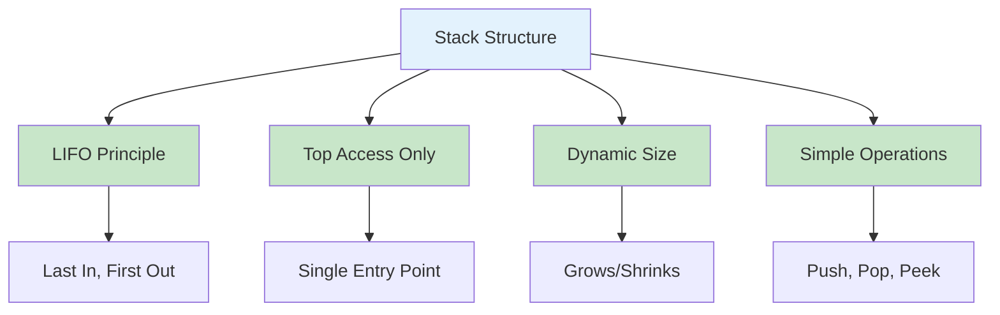
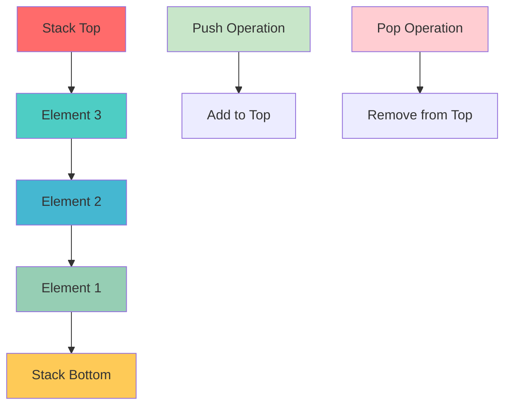
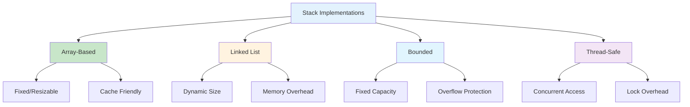
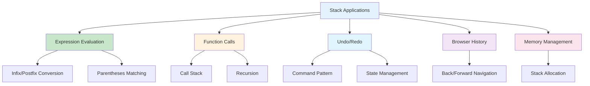
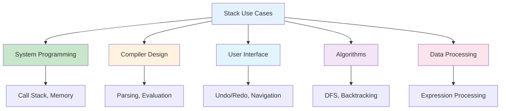
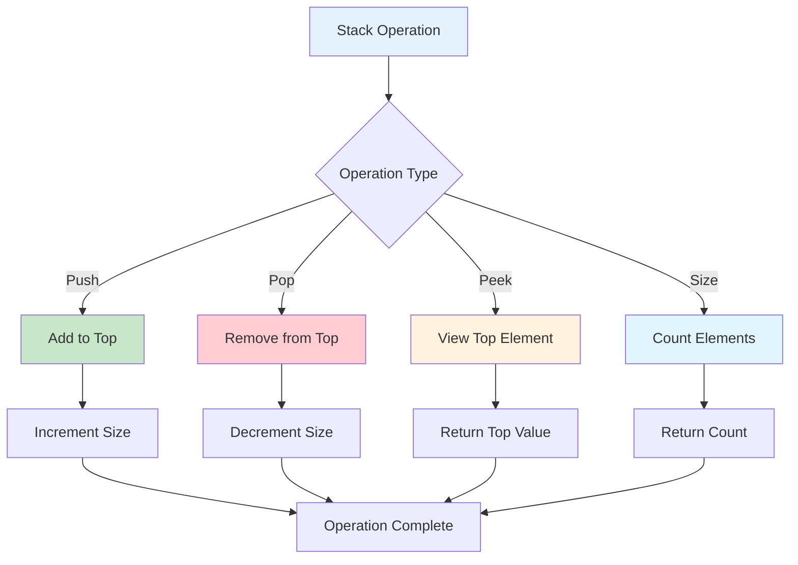
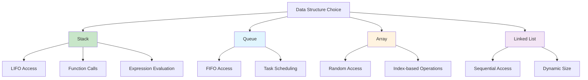
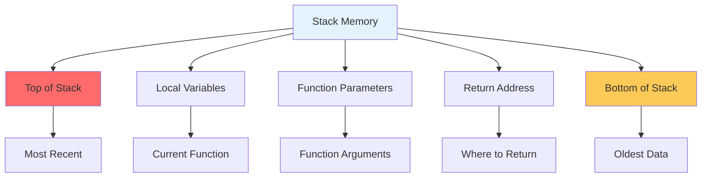

# Stacks in Python

## Table of Contents

1. [Introduction](#introduction)
2. [Stack Fundamentals](#stack-fundamentals)
3. [Implementation Methods](#implementation-methods)
4. [Stack Operations](#stack-operations)
5. [Advanced Stack Applications](#advanced-stack-applications)
6. [Performance Analysis](#performance-analysis)
7. [Use Cases and Applications](#use-cases-and-applications)
8. [Best Practices](#best-practices)
9. [Visual Representations](#visual-representations)

## Introduction

A stack is a linear data structure that follows the Last In, First Out (LIFO) principle. Elements are added and removed from the same end, called the "top" of the stack. Stacks are fundamental in computer science and are used in various applications from function call management to expression evaluation.

### Key Characteristics

- **LIFO Principle**: Last element added is the first to be removed
- **Single Access Point**: Only the top element is accessible
- **Dynamic Size**: Can grow and shrink as needed
- **Simple Operations**: Push, pop, peek, and isEmpty



## Stack Fundamentals

### Basic Stack Implementation

```python
class Stack:
    def __init__(self):
        self.items = []

    def push(self, item):
        """Add an item to the top of the stack"""
        self.items.append(item)

    def pop(self):
        """Remove and return the top item from the stack"""
        if self.is_empty():
            raise IndexError("Stack is empty")
        return self.items.pop()

    def peek(self):
        """Return the top item without removing it"""
        if self.is_empty():
            raise IndexError("Stack is empty")
        return self.items[-1]

    def is_empty(self):
        """Check if the stack is empty"""
        return len(self.items) == 0

    def size(self):
        """Return the number of items in the stack"""
        return len(self.items)

    def __str__(self):
        return f"Stack({self.items})"

    def __repr__(self):
        return f"Stack({self.items})"
```

### Stack with Linked List Implementation

```python
class StackNode:
    def __init__(self, data):
        self.data = data
        self.next = None

class LinkedStack:
    def __init__(self):
        self.top = None
        self.size = 0

    def push(self, data):
        """Add an item to the top of the stack"""
        new_node = StackNode(data)
        new_node.next = self.top
        self.top = new_node
        self.size += 1

    def pop(self):
        """Remove and return the top item from the stack"""
        if self.is_empty():
            raise IndexError("Stack is empty")

        data = self.top.data
        self.top = self.top.next
        self.size -= 1
        return data

    def peek(self):
        """Return the top item without removing it"""
        if self.is_empty():
            raise IndexError("Stack is empty")
        return self.top.data

    def is_empty(self):
        """Check if the stack is empty"""
        return self.top is None

    def size(self):
        """Return the number of items in the stack"""
        return self.size

    def to_list(self):
        """Convert stack to list for display"""
        result = []
        current = self.top
        while current:
            result.append(current.data)
            current = current.next
        return result
```

### Stack Structure Visualization



## Implementation Methods

### 1. Array-Based Stack

```python
class ArrayStack:
    def __init__(self, capacity=10):
        self.capacity = capacity
        self.items = [None] * capacity
        self.top_index = -1

    def push(self, item):
        """Add an item to the top of the stack"""
        if self.is_full():
            self._resize()

        self.top_index += 1
        self.items[self.top_index] = item

    def pop(self):
        """Remove and return the top item from the stack"""
        if self.is_empty():
            raise IndexError("Stack is empty")

        item = self.items[self.top_index]
        self.items[self.top_index] = None
        self.top_index -= 1
        return item

    def peek(self):
        """Return the top item without removing it"""
        if self.is_empty():
            raise IndexError("Stack is empty")
        return self.items[self.top_index]

    def is_empty(self):
        """Check if the stack is empty"""
        return self.top_index == -1

    def is_full(self):
        """Check if the stack is full"""
        return self.top_index == self.capacity - 1

    def size(self):
        """Return the number of items in the stack"""
        return self.top_index + 1

    def _resize(self):
        """Double the capacity of the stack"""
        old_capacity = self.capacity
        self.capacity *= 2
        new_items = [None] * self.capacity

        for i in range(old_capacity):
            new_items[i] = self.items[i]

        self.items = new_items
```

### 2. Bounded Stack

```python
class BoundedStack:
    def __init__(self, max_size):
        self.max_size = max_size
        self.items = []

    def push(self, item):
        """Add an item to the top of the stack"""
        if self.is_full():
            raise OverflowError("Stack is full")
        self.items.append(item)

    def pop(self):
        """Remove and return the top item from the stack"""
        if self.is_empty():
            raise IndexError("Stack is empty")
        return self.items.pop()

    def peek(self):
        """Return the top item without removing it"""
        if self.is_empty():
            raise IndexError("Stack is empty")
        return self.items[-1]

    def is_empty(self):
        """Check if the stack is empty"""
        return len(self.items) == 0

    def is_full(self):
        """Check if the stack is full"""
        return len(self.items) == self.max_size

    def size(self):
        """Return the number of items in the stack"""
        return len(self.items)
```

### 3. Thread-Safe Stack

```python
import threading

class ThreadSafeStack:
    def __init__(self):
        self.items = []
        self.lock = threading.RLock()

    def push(self, item):
        """Add an item to the top of the stack"""
        with self.lock:
            self.items.append(item)

    def pop(self):
        """Remove and return the top item from the stack"""
        with self.lock:
            if self.is_empty():
                raise IndexError("Stack is empty")
            return self.items.pop()

    def peek(self):
        """Return the top item without removing it"""
        with self.lock:
            if self.is_empty():
                raise IndexError("Stack is empty")
            return self.items[-1]

    def is_empty(self):
        """Check if the stack is empty"""
        with self.lock:
            return len(self.items) == 0

    def size(self):
        """Return the number of items in the stack"""
        with self.lock:
            return len(self.items)
```

### Implementation Comparison



## Stack Operations

### Basic Operations

```python
class StackOperations:
    @staticmethod
    def reverse_stack(stack):
        """Reverse the order of elements in a stack"""
        if stack.is_empty():
            return

        # Use recursion to reverse
        def _reverse_helper():
            if stack.is_empty():
                return

            item = stack.pop()
            _reverse_helper()
            _insert_at_bottom(item)

        def _insert_at_bottom(item):
            if stack.is_empty():
                stack.push(item)
                return

            temp = stack.pop()
            _insert_at_bottom(item)
            stack.push(temp)

        _reverse_helper()

    @staticmethod
    def sort_stack(stack):
        """Sort a stack using another stack"""
        temp_stack = Stack()

        while not stack.is_empty():
            temp = stack.pop()

            while not temp_stack.is_empty() and temp_stack.peek() > temp:
                stack.push(temp_stack.pop())

            temp_stack.push(temp)

        # Copy back to original stack
        while not temp_stack.is_empty():
            stack.push(temp_stack.pop())

    @staticmethod
    def find_middle(stack):
        """Find the middle element of a stack"""
        if stack.is_empty():
            return None

        temp_stack = Stack()
        size = stack.size()
        middle_index = size // 2

        # Pop elements until we reach the middle
        for i in range(middle_index):
            temp_stack.push(stack.pop())

        middle_element = stack.peek()

        # Restore the stack
        while not temp_stack.is_empty():
            stack.push(temp_stack.pop())

        return middle_element
```

### Advanced Operations

```python
class AdvancedStackOperations:
    @staticmethod
    def evaluate_postfix(expression):
        """Evaluate a postfix expression using a stack"""
        stack = Stack()
        operators = {'+', '-', '*', '/', '^'}

        for token in expression.split():
            if token in operators:
                if stack.size() < 2:
                    raise ValueError("Invalid expression")

                b = stack.pop()
                a = stack.pop()

                if token == '+':
                    result = a + b
                elif token == '-':
                    result = a - b
                elif token == '*':
                    result = a * b
                elif token == '/':
                    if b == 0:
                        raise ValueError("Division by zero")
                    result = a / b
                elif token == '^':
                    result = a ** b

                stack.push(result)
            else:
                try:
                    stack.push(float(token))
                except ValueError:
                    raise ValueError(f"Invalid token: {token}")

        if stack.size() != 1:
            raise ValueError("Invalid expression")

        return stack.pop()

    @staticmethod
    def infix_to_postfix(expression):
        """Convert infix expression to postfix using stack"""
        stack = Stack()
        output = []
        precedence = {'+': 1, '-': 1, '*': 2, '/': 2, '^': 3}
        operators = set(precedence.keys())

        for token in expression.split():
            if token.isalnum():
                output.append(token)
            elif token == '(':
                stack.push(token)
            elif token == ')':
                while not stack.is_empty() and stack.peek() != '(':
                    output.append(stack.pop())
                if not stack.is_empty():
                    stack.pop()  # Remove '('
            elif token in operators:
                while (not stack.is_empty() and
                       stack.peek() != '(' and
                       precedence.get(stack.peek(), 0) >= precedence[token]):
                    output.append(stack.pop())
                stack.push(token)

        while not stack.is_empty():
            output.append(stack.pop())

        return ' '.join(output)
```

### Operation Complexity

```mermaid
graph TD
    A[Stack Operations] --> B[Push O(1)]
    A --> C[Pop O(1)]
    A --> D[Peek O(1)]
    A --> E[Size O(1)]
    A --> F[IsEmpty O(1)]

    B --> G[Add to Top]
    C --> H[Remove from Top]
    D --> I[View Top Element]
    E --> J[Count Elements]
    F --> K[Check if Empty]

    style A fill:#e3f2fd
    style B fill:#c8e6c9
    style C fill:#c8e6c9
    style D fill:#c8e6c9
    style E fill:#c8e6c9
    style F fill:#c8e6c9
```

## Advanced Stack Applications

### 1. Expression Evaluation

```python
class ExpressionEvaluator:
    def __init__(self):
        self.operators = {
            '+': lambda a, b: a + b,
            '-': lambda a, b: a - b,
            '*': lambda a, b: a * b,
            '/': lambda a, b: a / b,
            '^': lambda a, b: a ** b
        }
        self.precedence = {'+': 1, '-': 1, '*': 2, '/': 2, '^': 3}

    def evaluate_infix(self, expression):
        """Evaluate infix expression using two stacks"""
        values = Stack()
        operators = Stack()

        i = 0
        while i < len(expression):
            char = expression[i]

            if char == ' ':
                i += 1
                continue
            elif char == '(':
                operators.push(char)
            elif char.isdigit():
                num = 0
                while i < len(expression) and expression[i].isdigit():
                    num = num * 10 + int(expression[i])
                    i += 1
                values.push(num)
                continue
            elif char == ')':
                while not operators.is_empty() and operators.peek() != '(':
                    self._apply_operator(values, operators)
                operators.pop()  # Remove '('
            elif char in self.operators:
                while (not operators.is_empty() and
                       operators.peek() != '(' and
                       self.precedence[operators.peek()] >= self.precedence[char]):
                    self._apply_operator(values, operators)
                operators.push(char)

            i += 1

        while not operators.is_empty():
            self._apply_operator(values, operators)

        return values.pop()

    def _apply_operator(self, values, operators):
        """Apply operator to top two values"""
        if values.size() < 2:
            raise ValueError("Invalid expression")

        b = values.pop()
        a = values.pop()
        op = operators.pop()

        if op not in self.operators:
            raise ValueError(f"Unknown operator: {op}")

        result = self.operators[op](a, b)
        values.push(result)
```

### 2. Balanced Parentheses Checker

```python
class ParenthesesChecker:
    @staticmethod
    def is_balanced(expression):
        """Check if parentheses are balanced"""
        stack = Stack()
        opening = {'(', '[', '{'}
        closing = {')', ']', '}'}
        pairs = {'(': ')', '[': ']', '{': '}'}

        for char in expression:
            if char in opening:
                stack.push(char)
            elif char in closing:
                if stack.is_empty():
                    return False

                top = stack.pop()
                if pairs[top] != char:
                    return False

        return stack.is_empty()

    @staticmethod
    def find_unbalanced_position(expression):
        """Find position of first unbalanced parenthesis"""
        stack = Stack()
        opening = {'(', '[', '{'}
        closing = {')', ']', '}'}
        pairs = {'(': ')', '[': ']', '{': '}'}

        for i, char in enumerate(expression):
            if char in opening:
                stack.push((char, i))
            elif char in closing:
                if stack.is_empty():
                    return i

                top_char, top_pos = stack.pop()
                if pairs[top_char] != char:
                    return i

        if not stack.is_empty():
            return stack.pop()[1]

        return -1  # Balanced
```

### 3. Undo/Redo System

```python
class UndoRedoSystem:
    def __init__(self):
        self.undo_stack = Stack()
        self.redo_stack = Stack()
        self.current_state = None

    def execute_command(self, command):
        """Execute a command and add to undo stack"""
        if self.current_state is not None:
            self.undo_stack.push(self.current_state)

        # Execute command
        new_state = command.execute()
        self.current_state = new_state

        # Clear redo stack
        self.redo_stack = Stack()

    def undo(self):
        """Undo the last command"""
        if self.undo_stack.is_empty():
            return False

        if self.current_state is not None:
            self.redo_stack.push(self.current_state)

        self.current_state = self.undo_stack.pop()
        return True

    def redo(self):
        """Redo the last undone command"""
        if self.redo_stack.is_empty():
            return False

        if self.current_state is not None:
            self.undo_stack.push(self.current_state)

        self.current_state = self.redo_stack.pop()
        return True

    def can_undo(self):
        """Check if undo is possible"""
        return not self.undo_stack.is_empty()

    def can_redo(self):
        """Check if redo is possible"""
        return not self.redo_stack.is_empty()
```

### Advanced Applications



## Performance Analysis

### Time Complexity

| Operation | Time Complexity | Description             |
| --------- | --------------- | ----------------------- |
| Push      | O(1)            | Add element to top      |
| Pop       | O(1)            | Remove element from top |
| Peek      | O(1)            | Access top element      |
| Size      | O(1)            | Count elements          |
| IsEmpty   | O(1)            | Check if empty          |

### Space Complexity

| Aspect    | Space Complexity | Description                     |
| --------- | ---------------- | ------------------------------- |
| Storage   | O(n)             | n elements stored               |
| Auxiliary | O(1)             | Constant extra space            |
| Recursion | O(n)             | Stack depth for recursive calls |

### Performance Characteristics

```mermaid
graph LR
    A[Stack Performance] --> B[O(1) Operations]
    A --> C[Memory Efficient]
    A --> D[Cache Friendly]
    A --> E[Simple Implementation]

    B --> F[Push, Pop, Peek]
    C --> G[Only stores data]
    D --> H[Sequential access]
    E --> I[Minimal overhead]

    style A fill:#e3f2fd
    style B fill:#c8e6c9
    style C fill:#c8e6c9
    style D fill:#c8e6c9
    style E fill:#c8e6c9
```

## Use Cases and Applications

### 1. Function Call Management

- **Call Stack**: Managing function calls and returns
- **Recursion**: Implementing recursive algorithms
- **Exception Handling**: Stack unwinding during exceptions

### 2. Expression Processing

- **Infix to Postfix**: Converting mathematical expressions
- **Postfix Evaluation**: Computing expression results
- **Syntax Parsing**: Parsing programming languages

### 3. Memory Management

- **Stack Allocation**: Local variable storage
- **Garbage Collection**: Tracking object references
- **Buffer Management**: Temporary data storage

### 4. User Interface

- **Undo/Redo**: Command history management
- **Browser Navigation**: Back/forward functionality
- **Menu Systems**: Hierarchical navigation

### 5. Algorithm Implementation

- **Depth-First Search**: Graph traversal
- **Backtracking**: Problem-solving algorithms
- **Tower of Hanoi**: Classic recursive problem

### Application Areas



## Best Practices

### 1. Error Handling

```python
class SafeStack:
    def __init__(self):
        self.items = []

    def push(self, item):
        """Safely add item to stack"""
        try:
            self.items.append(item)
            return True
        except Exception as e:
            print(f"Error pushing item: {e}")
            return False

    def pop(self):
        """Safely remove item from stack"""
        if self.is_empty():
            return None
        return self.items.pop()

    def peek(self):
        """Safely peek at top item"""
        if self.is_empty():
            return None
        return self.items[-1]
```

### 2. Memory Management

```python
class MemoryEfficientStack:
    def __init__(self):
        self.items = []
        self.max_size = 1000

    def push(self, item):
        """Add item with size limit"""
        if len(self.items) >= self.max_size:
            # Remove oldest item (bottom of stack)
            self.items.pop(0)
        self.items.append(item)

    def clear(self):
        """Clear all items"""
        self.items.clear()

    def trim_to_size(self, size):
        """Trim stack to specified size"""
        if len(self.items) > size:
            self.items = self.items[-size:]
```

### 3. Validation

```python
class ValidatedStack:
    def __init__(self, validator=None):
        self.items = []
        self.validator = validator

    def push(self, item):
        """Push item with validation"""
        if self.validator and not self.validator(item):
            raise ValueError(f"Invalid item: {item}")
        self.items.append(item)

    def is_valid(self):
        """Check if all items are valid"""
        if not self.validator:
            return True

        for item in self.items:
            if not self.validator(item):
                return False
        return True
```

### 4. Monitoring

```python
class MonitoredStack:
    def __init__(self):
        self.items = []
        self.operations_count = 0
        self.max_size_reached = 0

    def push(self, item):
        """Push with monitoring"""
        self.items.append(item)
        self.operations_count += 1
        self.max_size_reached = max(self.max_size_reached, len(self.items))

    def pop(self):
        """Pop with monitoring"""
        if self.is_empty():
            raise IndexError("Stack is empty")
        self.operations_count += 1
        return self.items.pop()

    def get_stats(self):
        """Get stack statistics"""
        return {
            'current_size': len(self.items),
            'max_size_reached': self.max_size_reached,
            'operations_count': self.operations_count
        }
```

## Visual Representations

### Stack Operations Flow



### Stack vs Other Structures



### Stack Memory Layout



## Conclusion

Stacks are fundamental data structures that provide efficient LIFO (Last In, First Out) access patterns. They are essential in computer science and are used in various applications from system programming to algorithm implementation.

Key advantages of stacks:

- **Simple Implementation**: Easy to understand and implement
- **Efficient Operations**: O(1) time complexity for basic operations
- **Memory Efficient**: Minimal overhead
- **Natural for Recursion**: Perfect for recursive algorithms
- **Expression Processing**: Ideal for mathematical expression evaluation

Stacks excel in scenarios requiring:

- Function call management
- Expression evaluation
- Undo/redo functionality
- Depth-first search algorithms
- Syntax parsing and validation

Understanding stack operations and their applications is crucial for building efficient software systems. The choice between different stack implementations depends on specific requirements such as memory constraints, concurrency needs, and performance characteristics.

Python's built-in list provides an excellent foundation for stack implementation, with specialized implementations available for specific use cases requiring thread safety, bounded capacity, or other advanced features.
