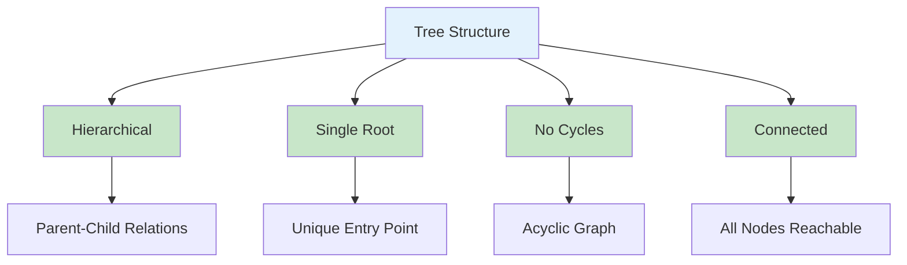
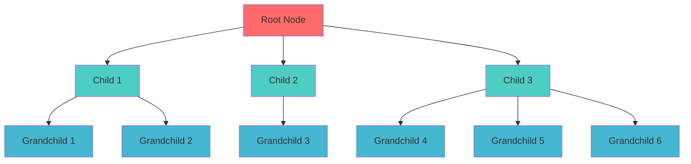
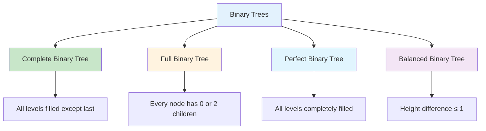
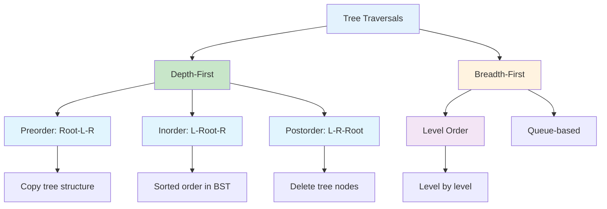
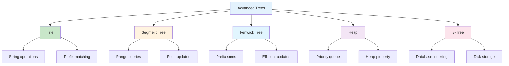
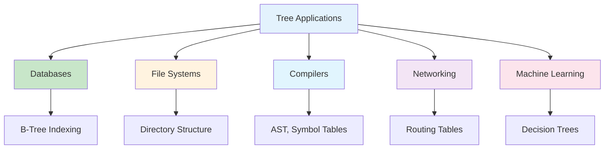
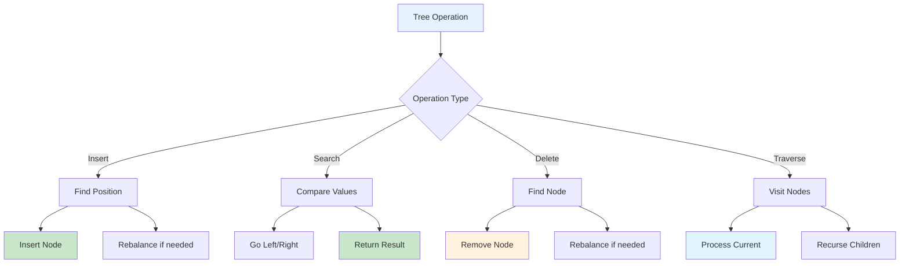
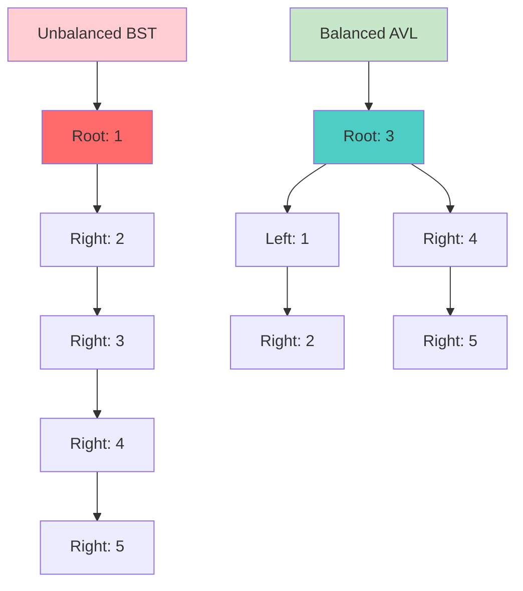
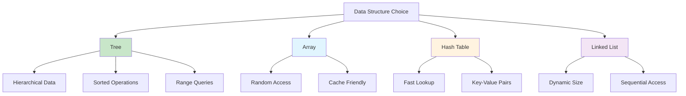

# Trees in Python

## Table of Contents

1. [Introduction](#introduction)
2. [Tree Fundamentals](#tree-fundamentals)
3. [Binary Trees](#binary-trees)
4. [Binary Search Trees](#binary-search-trees)
5. [Balanced Trees](#balanced-trees)
6. [Tree Traversals](#tree-traversals)
7. [Advanced Tree Structures](#advanced-tree-structures)
8. [Performance Analysis](#performance-analysis)
9. [Use Cases and Applications](#use-cases-and-applications)
10. [Implementation Examples](#implementation-examples)
11. [Best Practices](#best-practices)
12. [Visual Representations](#visual-representations)

## Introduction

A tree is a hierarchical data structure consisting of nodes connected by edges, where each node has a parent (except the root) and zero or more children. Trees are fundamental in computer science and are used in various applications from file systems to database indexing.

### Key Characteristics

- **Hierarchical Structure**: Parent-child relationships
- **Single Root**: One node with no parent
- **No Cycles**: Acyclic graph structure
- **Connected**: Every node reachable from root



## Tree Fundamentals

### Basic Tree Node Structure

```python
class TreeNode:
    def __init__(self, data):
        self.data = data
        self.children = []
        self.parent = None

    def add_child(self, child_node):
        child_node.parent = self
        self.children.append(child_node)

    def remove_child(self, child_node):
        if child_node in self.children:
            child_node.parent = None
            self.children.remove(child_node)

    def get_level(self):
        level = 0
        p = self.parent
        while p:
            level += 1
            p = p.parent
        return level

    def print_tree(self, level=0):
        indent = " " * level * 3
        prefix = indent + "|__" if level > 0 else ""
        print(f"{prefix}{self.data}")

        for child in self.children:
            child.print_tree(level + 1)
```

### Tree Properties and Operations

```python
class Tree:
    def __init__(self, root_data):
        self.root = TreeNode(root_data)

    def get_height(self):
        return self._get_height(self.root)

    def _get_height(self, node):
        if not node:
            return 0
        if not node.children:
            return 1

        max_child_height = 0
        for child in node.children:
            child_height = self._get_height(child)
            max_child_height = max(max_child_height, child_height)

        return 1 + max_child_height

    def get_size(self):
        return self._get_size(self.root)

    def _get_size(self, node):
        if not node:
            return 0

        size = 1
        for child in node.children:
            size += self._get_size(child)

        return size

    def find_node(self, data):
        return self._find_node(self.root, data)

    def _find_node(self, node, data):
        if node.data == data:
            return node

        for child in node.children:
            result = self._find_node(child, data)
            if result:
                return result

        return None
```

### Tree Structure Visualization



## Binary Trees

A binary tree is a tree where each node has at most two children, referred to as left and right children.

### Binary Tree Node Implementation

```python
class BinaryTreeNode:
    def __init__(self, data):
        self.data = data
        self.left = None
        self.right = None
        self.parent = None

    def is_leaf(self):
        return self.left is None and self.right is None

    def has_left_child(self):
        return self.left is not None

    def has_right_child(self):
        return self.right is not None

    def has_any_children(self):
        return self.has_left_child() or self.has_right_child()

    def has_both_children(self):
        return self.has_left_child() and self.has_right_child()
```

### Binary Tree Implementation

```python
class BinaryTree:
    def __init__(self, root_data):
        self.root = BinaryTreeNode(root_data)

    def insert_left(self, node, data):
        if node.left is None:
            node.left = BinaryTreeNode(data)
            node.left.parent = node
        else:
            new_node = BinaryTreeNode(data)
            new_node.left = node.left
            node.left = new_node
            new_node.parent = node

    def insert_right(self, node, data):
        if node.right is None:
            node.right = BinaryTreeNode(data)
            node.right.parent = node
        else:
            new_node = BinaryTreeNode(data)
            new_node.right = node.right
            node.right = new_node
            new_node.parent = node

    def get_height(self):
        return self._get_height(self.root)

    def _get_height(self, node):
        if node is None:
            return 0
        return 1 + max(self._get_height(node.left), self._get_height(node.right))

    def get_size(self):
        return self._get_size(self.root)

    def _get_size(self, node):
        if node is None:
            return 0
        return 1 + self._get_size(node.left) + self._get_size(node.right)
```

### Binary Tree Types



## Binary Search Trees

A Binary Search Tree (BST) is a binary tree where for each node, all values in the left subtree are less than the node's value, and all values in the right subtree are greater than the node's value.

### BST Implementation

```python
class BSTNode:
    def __init__(self, data):
        self.data = data
        self.left = None
        self.right = None
        self.parent = None

    def insert(self, data):
        if data < self.data:
            if self.left is None:
                self.left = BSTNode(data)
                self.left.parent = self
            else:
                self.left.insert(data)
        elif data > self.data:
            if self.right is None:
                self.right = BSTNode(data)
                self.right.parent = self
            else:
                self.right.insert(data)
        # If data == self.data, we don't insert duplicates

    def find(self, data):
        if data == self.data:
            return self
        elif data < self.data and self.left:
            return self.left.find(data)
        elif data > self.data and self.right:
            return self.right.find(data)
        return None

    def delete(self, data):
        if data < self.data and self.left:
            self.left = self.left.delete(data)
        elif data > self.data and self.right:
            self.right = self.right.delete(data)
        else:
            # Node to delete found
            if self.left is None:
                return self.right
            elif self.right is None:
                return self.left

            # Node with two children
            min_node = self.right.find_min()
            self.data = min_node.data
            self.right = self.right.delete(min_node.data)

        return self

    def find_min(self):
        current = self
        while current.left:
            current = current.left
        return current

    def find_max(self):
        current = self
        while current.right:
            current = current.right
        return current

    def inorder_traversal(self):
        result = []
        if self.left:
            result.extend(self.left.inorder_traversal())
        result.append(self.data)
        if self.right:
            result.extend(self.right.inorder_traversal())
        return result
```

### BST Operations Visualization

```mermaid
graph TD
    A[BST Operations] --> B[Insert]
    A --> C[Search]
    A --> D[Delete]
    A --> E[Traverse]

    B --> F[Compare with root]
    B --> G[Go left if smaller]
    B --> H[Go right if larger]

    C --> I[Binary search O(log n)]
    D --> J[Find successor]
    D --> K[Replace and remove]

    E --> L[Inorder: Sorted order]
    E --> M[Preorder: Root first]
    E --> N[Postorder: Root last]

    style A fill:#e3f2fd
    style I fill:#c8e6c9
    style F fill:#fff3e0
    style G fill:#fff3e0
    style H fill:#fff3e0
```

## Balanced Trees

### AVL Tree Implementation

```python
class AVLNode:
    def __init__(self, data):
        self.data = data
        self.left = None
        self.right = None
        self.parent = None
        self.height = 1

    def get_balance(self):
        left_height = self.left.height if self.left else 0
        right_height = self.right.height if self.right else 0
        return left_height - right_height

    def update_height(self):
        left_height = self.left.height if self.left else 0
        right_height = self.right.height if self.right else 0
        self.height = 1 + max(left_height, right_height)

class AVLTree:
    def __init__(self):
        self.root = None

    def insert(self, data):
        self.root = self._insert(self.root, data)

    def _insert(self, node, data):
        # Standard BST insertion
        if node is None:
            return AVLNode(data)

        if data < node.data:
            node.left = self._insert(node.left, data)
        elif data > node.data:
            node.right = self._insert(node.right, data)
        else:
            return node  # Duplicate values not allowed

        # Update height
        node.update_height()

        # Get balance factor
        balance = node.get_balance()

        # Left Left Case
        if balance > 1 and data < node.left.data:
            return self._rotate_right(node)

        # Right Right Case
        if balance < -1 and data > node.right.data:
            return self._rotate_left(node)

        # Left Right Case
        if balance > 1 and data > node.left.data:
            node.left = self._rotate_left(node.left)
            return self._rotate_right(node)

        # Right Left Case
        if balance < -1 and data < node.right.data:
            node.right = self._rotate_right(node.right)
            return self._rotate_left(node)

        return node

    def _rotate_left(self, z):
        y = z.right
        T2 = y.left

        # Perform rotation
        y.left = z
        z.right = T2

        # Update heights
        z.update_height()
        y.update_height()

        return y

    def _rotate_right(self, z):
        y = z.left
        T3 = y.right

        # Perform rotation
        y.right = z
        z.left = T3

        # Update heights
        z.update_height()
        y.update_height()

        return y
```

### Red-Black Tree Implementation

```python
class RBNode:
    RED = True
    BLACK = False

    def __init__(self, data, color=RED):
        self.data = data
        self.color = color
        self.left = None
        self.right = None
        self.parent = None

class RedBlackTree:
    def __init__(self):
        self.nil = RBNode(0, RBNode.BLACK)
        self.root = self.nil

    def insert(self, data):
        new_node = RBNode(data)
        self._insert_node(new_node)
        self._fix_insert(new_node)

    def _insert_node(self, node):
        y = self.nil
        x = self.root

        while x != self.nil:
            y = x
            if node.data < x.data:
                x = x.left
            else:
                x = x.right

        node.parent = y
        if y == self.nil:
            self.root = node
        elif node.data < y.data:
            y.left = node
        else:
            y.right = node

        node.left = self.nil
        node.right = self.nil
        node.color = RBNode.RED

    def _fix_insert(self, node):
        while node.parent.color == RBNode.RED:
            if node.parent == node.parent.parent.left:
                y = node.parent.parent.right
                if y.color == RBNode.RED:
                    node.parent.color = RBNode.BLACK
                    y.color = RBNode.BLACK
                    node.parent.parent.color = RBNode.RED
                    node = node.parent.parent
                else:
                    if node == node.parent.right:
                        node = node.parent
                        self._left_rotate(node)
                    node.parent.color = RBNode.BLACK
                    node.parent.parent.color = RBNode.RED
                    self._right_rotate(node.parent.parent)
            else:
                y = node.parent.parent.left
                if y.color == RBNode.RED:
                    node.parent.color = RBNode.BLACK
                    y.color = RBNode.BLACK
                    node.parent.parent.color = RBNode.RED
                    node = node.parent.parent
                else:
                    if node == node.parent.left:
                        node = node.parent
                        self._right_rotate(node)
                    node.parent.color = RBNode.BLACK
                    node.parent.parent.color = RBNode.RED
                    self._left_rotate(node.parent.parent)

        self.root.color = RBNode.BLACK

    def _left_rotate(self, x):
        y = x.right
        x.right = y.left
        if y.left != self.nil:
            y.left.parent = x
        y.parent = x.parent
        if x.parent == self.nil:
            self.root = y
        elif x == x.parent.left:
            x.parent.left = y
        else:
            x.parent.right = y
        y.left = x
        x.parent = y

    def _right_rotate(self, y):
        x = y.left
        y.left = x.right
        if x.right != self.nil:
            x.right.parent = y
        x.parent = y.parent
        if y.parent == self.nil:
            self.root = x
        elif y == y.parent.right:
            y.parent.right = x
        else:
            y.parent.left = x
        x.right = y
        y.parent = x
```

### Balanced Tree Comparison

```mermaid
graph TD
    A[Balanced Trees] --> B[AVL Tree]
    A --> C[Red-Black Tree]
    A --> D[B-Tree]
    A --> E[Splay Tree]

    B --> F[Strictly Balanced]
    B --> G[Height diff ≤ 1]
    B --> H[O(log n) operations]

    C --> I[Loosely Balanced]
    C --> J[Color properties]
    C --> K[O(log n) operations]

    D --> L[Multi-way tree]
    D --> M[Disk-based storage]

    E --> N[Self-adjusting]
    E --> O[Amortized O(log n)]

    style A fill:#e3f2fd
    style B fill:#c8e6c9
    style C fill:#fff3e0
    style D fill:#e1f5fe
    style E fill:#f3e5f5
```

## Tree Traversals

### Depth-First Traversals

```python
class TreeTraversal:
    @staticmethod
    def preorder(node, result=None):
        if result is None:
            result = []

        if node:
            result.append(node.data)
            TreeTraversal.preorder(node.left, result)
            TreeTraversal.preorder(node.right, result)

        return result

    @staticmethod
    def inorder(node, result=None):
        if result is None:
            result = []

        if node:
            TreeTraversal.inorder(node.left, result)
            result.append(node.data)
            TreeTraversal.inorder(node.right, result)

        return result

    @staticmethod
    def postorder(node, result=None):
        if result is None:
            result = []

        if node:
            TreeTraversal.postorder(node.left, result)
            TreeTraversal.postorder(node.right, result)
            result.append(node.data)

        return result

    @staticmethod
    def preorder_iterative(root):
        if not root:
            return []

        result = []
        stack = [root]

        while stack:
            node = stack.pop()
            result.append(node.data)

            if node.right:
                stack.append(node.right)
            if node.left:
                stack.append(node.left)

        return result

    @staticmethod
    def inorder_iterative(root):
        result = []
        stack = []
        current = root

        while stack or current:
            while current:
                stack.append(current)
                current = current.left

            current = stack.pop()
            result.append(current.data)
            current = current.right

        return result
```

### Breadth-First Traversal

```python
from collections import deque

class TreeTraversal:
    @staticmethod
    def level_order(root):
        if not root:
            return []

        result = []
        queue = deque([root])

        while queue:
            level_size = len(queue)
            level = []

            for _ in range(level_size):
                node = queue.popleft()
                level.append(node.data)

                if node.left:
                    queue.append(node.left)
                if node.right:
                    queue.append(node.right)

            result.append(level)

        return result

    @staticmethod
    def level_order_simple(root):
        if not root:
            return []

        result = []
        queue = deque([root])

        while queue:
            node = queue.popleft()
            result.append(node.data)

            if node.left:
                queue.append(node.left)
            if node.right:
                queue.append(node.right)

        return result
```

### Traversal Visualization



## Advanced Tree Structures

### Trie (Prefix Tree)

```python
class TrieNode:
    def __init__(self):
        self.children = {}
        self.is_end_of_word = False
        self.word_count = 0

class Trie:
    def __init__(self):
        self.root = TrieNode()

    def insert(self, word):
        node = self.root
        for char in word:
            if char not in node.children:
                node.children[char] = TrieNode()
            node = node.children[char]
            node.word_count += 1
        node.is_end_of_word = True

    def search(self, word):
        node = self.root
        for char in word:
            if char not in node.children:
                return False
            node = node.children[char]
        return node.is_end_of_word

    def starts_with(self, prefix):
        node = self.root
        for char in prefix:
            if char not in node.children:
                return False
            node = node.children[char]
        return True

    def count_words_with_prefix(self, prefix):
        node = self.root
        for char in prefix:
            if char not in node.children:
                return 0
            node = node.children[char]
        return node.word_count

    def delete(self, word):
        if not self.search(word):
            return False

        node = self.root
        for char in word:
            node.children[char].word_count -= 1
            if node.children[char].word_count == 0:
                del node.children[char]
                return True
            node = node.children[char]

        node.is_end_of_word = False
        return True
```

### Segment Tree

```python
class SegmentTree:
    def __init__(self, arr):
        self.n = len(arr)
        self.tree = [0] * (4 * self.n)
        self.build(arr, 0, 0, self.n - 1)

    def build(self, arr, node, start, end):
        if start == end:
            self.tree[node] = arr[start]
        else:
            mid = (start + end) // 2
            self.build(arr, 2 * node + 1, start, mid)
            self.build(arr, 2 * node + 2, mid + 1, end)
            self.tree[node] = self.tree[2 * node + 1] + self.tree[2 * node + 2]

    def update(self, idx, val):
        self._update(0, 0, self.n - 1, idx, val)

    def _update(self, node, start, end, idx, val):
        if start == end:
            self.tree[node] = val
        else:
            mid = (start + end) // 2
            if idx <= mid:
                self._update(2 * node + 1, start, mid, idx, val)
            else:
                self._update(2 * node + 2, mid + 1, end, idx, val)
            self.tree[node] = self.tree[2 * node + 1] + self.tree[2 * node + 2]

    def query(self, l, r):
        return self._query(0, 0, self.n - 1, l, r)

    def _query(self, node, start, end, l, r):
        if r < start or end < l:
            return 0
        if l <= start and end <= r:
            return self.tree[node]

        mid = (start + end) // 2
        left_sum = self._query(2 * node + 1, start, mid, l, r)
        right_sum = self._query(2 * node + 2, mid + 1, end, l, r)
        return left_sum + right_sum
```

### Fenwick Tree (Binary Indexed Tree)

```python
class FenwickTree:
    def __init__(self, size):
        self.size = size
        self.tree = [0] * (size + 1)

    def update(self, index, delta):
        index += 1  # 1-indexed
        while index <= self.size:
            self.tree[index] += delta
            index += index & (-index)

    def query(self, index):
        index += 1  # 1-indexed
        result = 0
        while index > 0:
            result += self.tree[index]
            index -= index & (-index)
        return result

    def range_query(self, left, right):
        return self.query(right) - self.query(left - 1)
```

### Advanced Tree Types



## Performance Analysis

### Time Complexity Comparison

| Operation | BST      | AVL      | Red-Black | B-Tree   | Trie |
| --------- | -------- | -------- | --------- | -------- | ---- |
| Search    | O(log n) | O(log n) | O(log n)  | O(log n) | O(m) |
| Insert    | O(log n) | O(log n) | O(log n)  | O(log n) | O(m) |
| Delete    | O(log n) | O(log n) | O(log n)  | O(log n) | O(m) |
| Min/Max   | O(log n) | O(log n) | O(log n)  | O(log n) | O(m) |

_Where m is the length of the string/key_

### Space Complexity

| Structure | Space Complexity          | Description                |
| --------- | ------------------------- | -------------------------- |
| BST       | O(n)                      | n nodes                    |
| AVL       | O(n)                      | n nodes + height info      |
| Red-Black | O(n)                      | n nodes + color info       |
| B-Tree    | O(n)                      | n nodes, multiple children |
| Trie      | O(ALPHABET*SIZE * N \_ M) | N words, M average length  |

### Performance Characteristics

```mermaid
graph LR
    A[Tree Performance] --> B[Search Time]
    A --> C[Insert Time]
    A --> D[Delete Time]
    A --> E[Space Usage]

    B --> F[O(log n) - Balanced]
    B --> G[O(n) - Unbalanced]

    C --> H[O(log n) - Balanced]
    C --> I[O(n) - Unbalanced]

    D --> J[O(log n) - Balanced]
    D --> K[O(n) - Unbalanced]

    E --> L[O(n) - All trees]

    style A fill:#e3f2fd
    style F fill:#c8e6c9
    style H fill:#c8e6c9
    style J fill:#c8e6c9
    style G fill:#ffcdd2
    style I fill:#ffcdd2
    style K fill:#ffcdd2
```

## Use Cases and Applications

### 1. Database Systems

- **B-Trees**: Database indexing, file systems
- **B+ Trees**: Database storage, range queries
- **Tries**: Full-text search, autocomplete

### 2. File Systems

- **Directory Structure**: Hierarchical file organization
- **Inode Management**: File metadata storage
- **Path Resolution**: Efficient file lookup

### 3. Compiler Design

- **Abstract Syntax Trees**: Code representation
- **Symbol Tables**: Variable and function lookup
- **Parse Trees**: Grammar analysis

### 4. Network Routing

- **Routing Tables**: IP address lookup
- **Decision Trees**: Packet routing decisions
- **Trie-based Routing**: Longest prefix matching

### 5. Machine Learning

- **Decision Trees**: Classification algorithms
- **Random Forests**: Ensemble learning
- **Gradient Boosting**: Sequential model building

### Application Areas



## Implementation Examples

### Expression Tree

```python
class ExpressionNode:
    def __init__(self, value, left=None, right=None):
        self.value = value
        self.left = left
        self.right = right

    def is_operator(self):
        return self.value in ['+', '-', '*', '/']

    def evaluate(self):
        if not self.is_operator():
            return float(self.value)

        left_val = self.left.evaluate()
        right_val = self.right.evaluate()

        if self.value == '+':
            return left_val + right_val
        elif self.value == '-':
            return left_val - right_val
        elif self.value == '*':
            return left_val * right_val
        elif self.value == '/':
            return left_val / right_val

class ExpressionTree:
    def __init__(self, postfix_expression):
        self.root = self._build_tree(postfix_expression)

    def _build_tree(self, postfix):
        stack = []
        operators = set(['+', '-', '*', '/'])

        for token in postfix:
            if token in operators:
                right = stack.pop()
                left = stack.pop()
                node = ExpressionNode(token, left, right)
                stack.append(node)
            else:
                stack.append(ExpressionNode(token))

        return stack[0] if stack else None

    def evaluate(self):
        return self.root.evaluate() if self.root else 0
```

### File System Tree

```python
class FileSystemNode:
    def __init__(self, name, is_directory=False, size=0):
        self.name = name
        self.is_directory = is_directory
        self.size = size
        self.children = []
        self.parent = None

    def add_child(self, child):
        child.parent = self
        self.children.append(child)
        if not child.is_directory:
            self._update_size(child.size)

    def _update_size(self, size):
        self.size += size
        if self.parent:
            self.parent._update_size(size)

    def find_file(self, filename):
        if not self.is_directory:
            return self if self.name == filename else None

        for child in self.children:
            result = child.find_file(filename)
            if result:
                return result
        return None

    def get_path(self):
        path = []
        current = self
        while current:
            path.append(current.name)
            current = current.parent
        return '/'.join(reversed(path))

    def list_files(self, recursive=False):
        files = []
        for child in self.children:
            if not child.is_directory:
                files.append(child)
            elif recursive:
                files.extend(child.list_files(True))
        return files
```

## Best Practices

### 1. Memory Management

```python
# Proper cleanup for tree nodes
def delete_tree(node):
    if node:
        delete_tree(node.left)
        delete_tree(node.right)
        node.left = None
        node.right = None
        del node
```

### 2. Error Handling

```python
def safe_tree_search(root, target):
    try:
        return root.find(target) if root else None
    except AttributeError:
        return None
    except Exception as e:
        print(f"Error during search: {e}")
        return None
```

### 3. Thread Safety

```python
import threading

class ThreadSafeBST:
    def __init__(self):
        self.root = None
        self.lock = threading.RLock()

    def insert(self, data):
        with self.lock:
            if self.root is None:
                self.root = BSTNode(data)
            else:
                self.root.insert(data)

    def search(self, data):
        with self.lock:
            return self.root.find(data) if self.root else None
```

### 4. Validation

```python
def validate_bst(node, min_val=float('-inf'), max_val=float('inf')):
    if node is None:
        return True

    if node.data <= min_val or node.data >= max_val:
        return False

    return (validate_bst(node.left, min_val, node.data) and
            validate_bst(node.right, node.data, max_val))
```

## Visual Representations

### Tree Operations Flow



### Tree Balance Visualization



### Tree vs Other Structures



## Conclusion

Trees are fundamental data structures that provide efficient solutions for hierarchical data organization and various computational problems. The choice of tree type depends on specific requirements:

- **Binary Search Trees**: Simple implementation, good for basic operations
- **AVL Trees**: Strictly balanced, guaranteed O(log n) performance
- **Red-Black Trees**: Loosely balanced, good for frequent insertions/deletions
- **B-Trees**: Multi-way trees, excellent for disk-based storage
- **Tries**: Specialized for string operations and prefix matching

Understanding tree properties, traversal methods, and balancing techniques is crucial for implementing efficient tree-based solutions. The key to effective tree usage lies in selecting the appropriate tree type for your specific use case and understanding the trade-offs between different implementations.

Trees continue to be essential in modern computing, from database systems to machine learning algorithms, making them a critical topic for any software developer to master.
