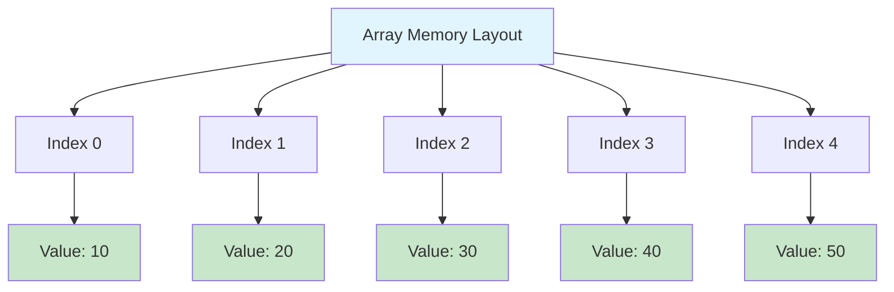
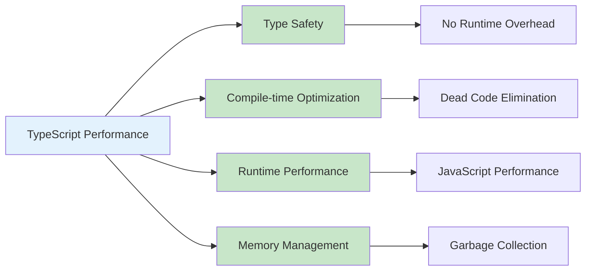
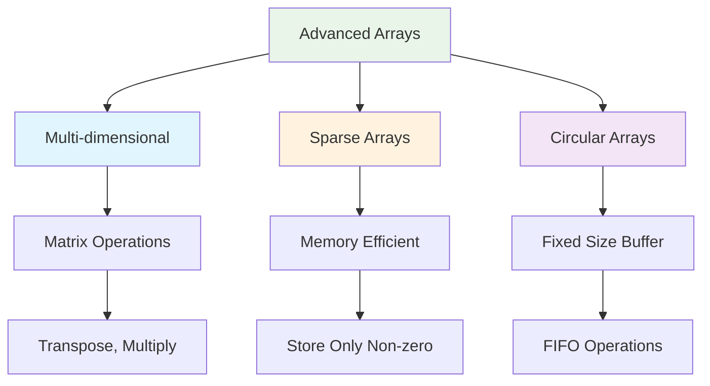
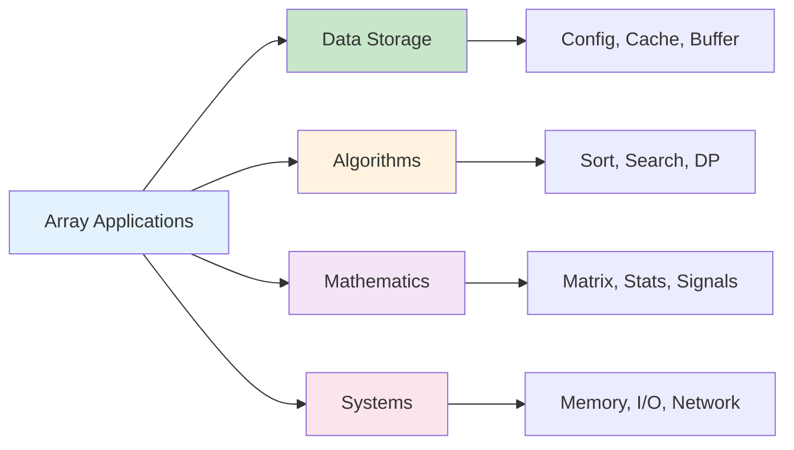
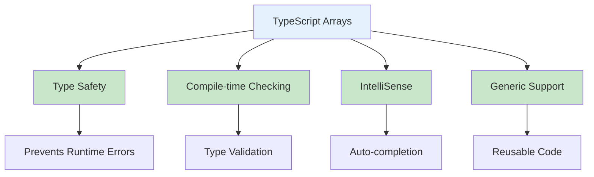
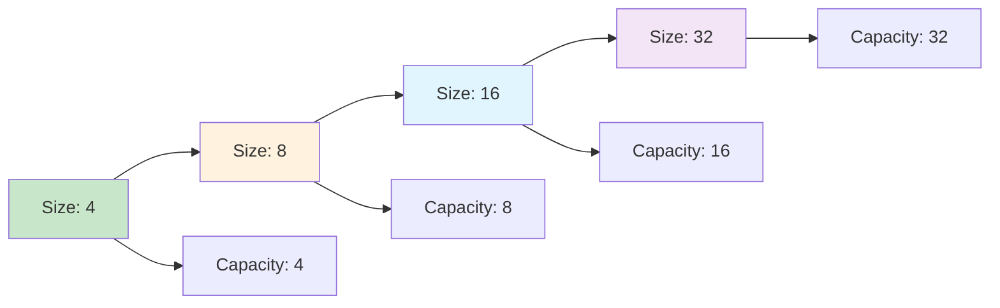

# Arrays in TypeScript

## Table of Contents

1. [Introduction](#introduction)
2. [Array Types in TypeScript](#array-types-in-typescript)
3. [Implementation Details](#implementation-details)
4. [Core Operations](#core-operations)
5. [Performance Analysis](#performance-analysis)
6. [Advanced Features](#advanced-features)
7. [Use Cases and Applications](#use-cases-and-applications)
8. [Best Practices](#best-practices)
9. [Common Pitfalls](#common-pitfalls)
10. [Visual Representations](#visual-representations)

## Introduction

An array is a fundamental data structure that stores elements of the same type in contiguous memory locations. In TypeScript, arrays provide type safety, performance optimization, and rich built-in methods for data manipulation. TypeScript's type system enhances array operations with compile-time type checking and IntelliSense support.

### Key Characteristics

- **Type Safety**: Compile-time type checking for array elements
- **Contiguous Memory**: Elements stored in adjacent memory locations
- **Indexed Access**: Elements accessible using integer indices
- **Dynamic Size**: Can grow and shrink as needed
- **Rich API**: Extensive built-in methods for manipulation

```mermaid
graph TD
    A[TypeScript Array] --> B[Type Safety]
    A --> C[Contiguous Memory]
    A --> D[Indexed Access]
    A --> E[Dynamic Size]
    A --> F[Rich API]

    B --> G[Compile-time Checking]
    C --> H[Fast Access O(1)]
    D --> I[Random Access]
    E --> J[Grows/Shrinks]
    F --> K[Built-in Methods]

    style A fill:#e3f2fd
    style B fill:#c8e6c9
    style C fill:#c8e6c9
    style D fill:#c8e6c9
    style E fill:#c8e6c9
    style F fill:#c8e6c9
```

## Array Types in TypeScript

### 1. Basic Array Declarations

```typescript
// Array of numbers
const numbers: number[] = [1, 2, 3, 4, 5];

// Alternative syntax
const numbersAlt: Array<number> = [1, 2, 3, 4, 5];

// Array of strings
const names: string[] = ["Alice", "Bob", "Charlie"];

// Array of mixed types using union types
const mixed: (string | number)[] = ["hello", 42, "world", 100];

// Array of objects
interface Person {
  name: string;
  age: number;
}

const people: Person[] = [
  { name: "Alice", age: 30 },
  { name: "Bob", age: 25 },
];

// Readonly array
const readonlyNumbers: readonly number[] = [1, 2, 3, 4, 5];
```

### 2. Tuple Types

```typescript
// Fixed-length arrays with specific types
const coordinates: [number, number] = [10, 20];
const personInfo: [string, number, boolean] = ["John", 30, true];

// Optional tuple elements
const optionalTuple: [string, number?] = ["hello"];
const optionalTuple2: [string, number?] = ["hello", 42];

// Rest elements in tuples
const restTuple: [string, ...number[]] = ["hello", 1, 2, 3, 4];

// Labeled tuple elements
const labeledTuple: [name: string, age: number, active: boolean] = ["John", 30, true];
```

### 3. Generic Array Types

```typescript
// Generic array class
class GenericArray<T> {
  private items: T[] = [];

  add(item: T): void {
    this.items.push(item);
  }

  get(index: number): T | undefined {
    return this.items[index];
  }

  remove(index: number): T | undefined {
    return this.items.splice(index, 1)[0];
  }

  size(): number {
    return this.items.length;
  }

  toArray(): T[] {
    return [...this.items];
  }
}

// Usage
const stringArray = new GenericArray<string>();
stringArray.add("hello");
stringArray.add("world");

const numberArray = new GenericArray<number>();
numberArray.add(1);
numberArray.add(2);
```

### TypeScript Array Types

```mermaid
graph TD
    A[TypeScript Arrays] --> B[Basic Arrays]
    A --> C[Tuples]
    A --> D[Generic Arrays]
    A --> E[Readonly Arrays]

    B --> F[number[], string[]]
    C --> G[Fixed Length]
    D --> H[Type Parameter T]
    E --> I[Immutable]

    F --> J[Type Safety]
    G --> K[Specific Types]
    H --> L[Reusable]
    I --> M[No Mutations]

    style A fill:#e3f2fd
    style B fill:#c8e6c9
    style C fill:#fff3e0
    style D fill:#e1f5fe
    style E fill:#f3e5f5
```

## Implementation Details

### Custom Array Implementation

```typescript
interface IArray<T> {
  length: number;
  push(item: T): number;
  pop(): T | undefined;
  shift(): T | undefined;
  unshift(item: T): number;
  splice(start: number, deleteCount?: number, ...items: T[]): T[];
  slice(start?: number, end?: number): T[];
  indexOf(item: T): number;
  includes(item: T): boolean;
  forEach(callback: (item: T, index: number) => void): void;
  map<U>(callback: (item: T, index: number) => U): U[];
  filter(callback: (item: T, index: number) => boolean): T[];
  reduce<U>(callback: (acc: U, item: T, index: number) => U, initial: U): U;
}

class CustomArray<T> implements IArray<T> {
  private items: T[] = [];
  private capacity: number = 4;

  constructor(initialCapacity: number = 4) {
    this.capacity = initialCapacity;
    this.items = new Array(this.capacity);
  }

  get length(): number {
    return this.items.length;
  }

  private resize(newCapacity: number): void {
    const newItems = new Array(newCapacity);
    for (let i = 0; i < this.items.length; i++) {
      newItems[i] = this.items[i];
    }
    this.items = newItems;
    this.capacity = newCapacity;
  }

  push(item: T): number {
    if (this.items.length >= this.capacity) {
      this.resize(this.capacity * 2);
    }
    this.items.push(item);
    return this.items.length;
  }

  pop(): T | undefined {
    const item = this.items.pop();
    if (this.items.length < this.capacity / 4 && this.capacity > 4) {
      this.resize(this.capacity / 2);
    }
    return item;
  }

  shift(): T | undefined {
    if (this.items.length === 0) return undefined;

    const item = this.items[0];
    for (let i = 0; i < this.items.length - 1; i++) {
      this.items[i] = this.items[i + 1];
    }
    this.items.length--;

    if (this.items.length < this.capacity / 4 && this.capacity > 4) {
      this.resize(this.capacity / 2);
    }

    return item;
  }

  unshift(item: T): number {
    if (this.items.length >= this.capacity) {
      this.resize(this.capacity * 2);
    }

    for (let i = this.items.length; i > 0; i--) {
      this.items[i] = this.items[i - 1];
    }
    this.items[0] = item;
    this.items.length++;

    return this.items.length;
  }

  splice(start: number, deleteCount: number = 0, ...items: T[]): T[] {
    const deleted: T[] = [];
    const startIndex = start < 0 ? Math.max(0, this.items.length + start) : start;
    const endIndex = Math.min(startIndex + deleteCount, this.items.length);

    // Collect deleted items
    for (let i = startIndex; i < endIndex; i++) {
      deleted.push(this.items[i]);
    }

    // Remove deleted items
    const remaining = this.items.slice(endIndex);
    this.items.length = startIndex;

    // Add new items
    for (const item of items) {
      this.items.push(item);
    }

    // Add remaining items
    for (const item of remaining) {
      this.items.push(item);
    }

    return deleted;
  }

  slice(start: number = 0, end: number = this.items.length): T[] {
    const startIndex = start < 0 ? Math.max(0, this.items.length + start) : start;
    const endIndex = end < 0 ? Math.max(0, this.items.length + end) : end;

    const result: T[] = [];
    for (let i = startIndex; i < Math.min(endIndex, this.items.length); i++) {
      result.push(this.items[i]);
    }

    return result;
  }

  indexOf(item: T): number {
    for (let i = 0; i < this.items.length; i++) {
      if (this.items[i] === item) {
        return i;
      }
    }
    return -1;
  }

  includes(item: T): boolean {
    return this.indexOf(item) !== -1;
  }

  forEach(callback: (item: T, index: number) => void): void {
    for (let i = 0; i < this.items.length; i++) {
      callback(this.items[i], i);
    }
  }

  map<U>(callback: (item: T, index: number) => U): U[] {
    const result: U[] = [];
    for (let i = 0; i < this.items.length; i++) {
      result.push(callback(this.items[i], i));
    }
    return result;
  }

  filter(callback: (item: T, index: number) => boolean): T[] {
    const result: T[] = [];
    for (let i = 0; i < this.items.length; i++) {
      if (callback(this.items[i], i)) {
        result.push(this.items[i]);
      }
    }
    return result;
  }

  reduce<U>(callback: (acc: U, item: T, index: number) => U, initial: U): U {
    let acc = initial;
    for (let i = 0; i < this.items.length; i++) {
      acc = callback(acc, this.items[i], i);
    }
    return acc;
  }
}
```

### Memory Layout Visualization



## Core Operations

### 1. Access Operations

```typescript
class ArrayOperations {
  // Random access - O(1)
  static getElement<T>(arr: T[], index: number): T | undefined {
    if (index < 0 || index >= arr.length) {
      return undefined;
    }
    return arr[index];
  }

  // Sequential access
  static iterate<T>(arr: T[], callback: (item: T, index: number) => void): void {
    for (let i = 0; i < arr.length; i++) {
      callback(arr[i], i);
    }
  }

  // Slicing - O(k) where k is slice size
  static slice<T>(arr: T[], start: number, end?: number): T[] {
    return arr.slice(start, end);
  }

  // Safe access with bounds checking
  static safeGet<T>(arr: T[], index: number, defaultValue: T): T {
    return index >= 0 && index < arr.length ? arr[index] : defaultValue;
  }
}
```

### 2. Modification Operations

```typescript
class ArrayModifications {
  // Update element - O(1)
  static update<T>(arr: T[], index: number, value: T): boolean {
    if (index < 0 || index >= arr.length) {
      return false;
    }
    arr[index] = value;
    return true;
  }

  // Append - O(1) amortized
  static append<T>(arr: T[], value: T): number {
    return arr.push(value);
  }

  // Insert - O(n)
  static insert<T>(arr: T[], index: number, value: T): boolean {
    if (index < 0 || index > arr.length) {
      return false;
    }
    arr.splice(index, 0, value);
    return true;
  }

  // Delete - O(n)
  static delete<T>(arr: T[], index: number): T | undefined {
    if (index < 0 || index >= arr.length) {
      return undefined;
    }
    return arr.splice(index, 1)[0];
  }

  // Remove by value
  static removeValue<T>(arr: T[], value: T): boolean {
    const index = arr.indexOf(value);
    if (index !== -1) {
      arr.splice(index, 1);
      return true;
    }
    return false;
  }
}
```

### 3. Search Operations

```typescript
class ArraySearch {
  // Linear search - O(n)
  static linearSearch<T>(arr: T[], target: T): number {
    for (let i = 0; i < arr.length; i++) {
      if (arr[i] === target) {
        return i;
      }
    }
    return -1;
  }

  // Binary search (sorted array) - O(log n)
  static binarySearch<T>(arr: T[], target: T, compareFn?: (a: T, b: T) => number): number {
    let left = 0;
    let right = arr.length - 1;

    const compare =
      compareFn ||
      ((a: T, b: T) => {
        if (a < b) return -1;
        if (a > b) return 1;
        return 0;
      });

    while (left <= right) {
      const mid = Math.floor((left + right) / 2);
      const comparison = compare(arr[mid], target);

      if (comparison === 0) {
        return mid;
      } else if (comparison < 0) {
        left = mid + 1;
      } else {
        right = mid - 1;
      }
    }

    return -1;
  }

  // Find all occurrences
  static findAll<T>(arr: T[], target: T): number[] {
    const indices: number[] = [];
    for (let i = 0; i < arr.length; i++) {
      if (arr[i] === target) {
        indices.push(i);
      }
    }
    return indices;
  }

  // Find with custom predicate
  static findIndex<T>(arr: T[], predicate: (item: T, index: number) => boolean): number {
    for (let i = 0; i < arr.length; i++) {
      if (predicate(arr[i], i)) {
        return i;
      }
    }
    return -1;
  }
}
```

### Operation Complexity Diagram

```mermaid
graph TD
    A[Array Operations] --> B[Access O(1)]
    A --> C[Search O(n)]
    A --> D[Insert O(n)]
    A --> E[Delete O(n)]
    A --> F[Append O(1)]

    B --> G[Random Access]
    C --> H[Linear Search]
    D --> I[Shift Elements]
    E --> J[Shift Elements]
    F --> K[End Insertion]

    style A fill:#e3f2fd
    style B fill:#c8e6c9
    style F fill:#c8e6c9
    style C fill:#ffcdd2
    style D fill:#ffcdd2
    style E fill:#ffcdd2
```

## Performance Analysis

### Time Complexity

| Operation       | Time Complexity | Description                    |
| --------------- | --------------- | ------------------------------ |
| Access          | O(1)            | Direct index access            |
| Search          | O(n)            | Linear search through elements |
| Insert (end)    | O(1)            | Append to end                  |
| Insert (middle) | O(n)            | Shift elements                 |
| Delete          | O(n)            | Shift elements                 |
| Update          | O(1)            | Direct index assignment        |

### Space Complexity

| Aspect         | Space Complexity | Description                         |
| -------------- | ---------------- | ----------------------------------- |
| Storage        | O(n)             | n elements stored                   |
| Auxiliary      | O(1)             | Constant extra space for operations |
| Dynamic Growth | O(n)             | Amortized space for resizing        |

### TypeScript-Specific Performance



## Advanced Features

### 1. Multi-dimensional Arrays

```typescript
class Matrix<T> {
  private data: T[][];
  private rows: number;
  private cols: number;

  constructor(rows: number, cols: number, initialValue: T) {
    this.rows = rows;
    this.cols = cols;
    this.data = Array(rows)
      .fill(null)
      .map(() => Array(cols).fill(initialValue));
  }

  get(row: number, col: number): T | undefined {
    if (row < 0 || row >= this.rows || col < 0 || col >= this.cols) {
      return undefined;
    }
    return this.data[row][col];
  }

  set(row: number, col: number, value: T): boolean {
    if (row < 0 || row >= this.rows || col < 0 || col >= this.cols) {
      return false;
    }
    this.data[row][col] = value;
    return true;
  }

  transpose(): Matrix<T> {
    const transposed = new Matrix<T>(this.cols, this.rows, this.data[0][0]);
    for (let i = 0; i < this.rows; i++) {
      for (let j = 0; j < this.cols; j++) {
        transposed.set(j, i, this.data[i][j]);
      }
    }
    return transposed;
  }

  forEach(callback: (value: T, row: number, col: number) => void): void {
    for (let i = 0; i < this.rows; i++) {
      for (let j = 0; j < this.cols; j++) {
        callback(this.data[i][j], i, j);
      }
    }
  }

  map<U>(callback: (value: T, row: number, col: number) => U): Matrix<U> {
    const result = new Matrix<U>(this.rows, this.cols, callback(this.data[0][0], 0, 0));
    for (let i = 0; i < this.rows; i++) {
      for (let j = 0; j < this.cols; j++) {
        result.set(i, j, callback(this.data[i][j], i, j));
      }
    }
    return result;
  }
}
```

### 2. Sparse Array Implementation

```typescript
class SparseArray<T> {
  private data: Map<number, T> = new Map();
  private length: number;

  constructor(length: number) {
    this.length = length;
  }

  get(index: number): T | undefined {
    if (index < 0 || index >= this.length) {
      return undefined;
    }
    return this.data.get(index);
  }

  set(index: number, value: T): boolean {
    if (index < 0 || index >= this.length) {
      return false;
    }

    if (value === undefined || value === null) {
      this.data.delete(index);
    } else {
      this.data.set(index, value);
    }

    return true;
  }

  has(index: number): boolean {
    return this.data.has(index);
  }

  delete(index: number): boolean {
    return this.data.delete(index);
  }

  forEach(callback: (value: T, index: number) => void): void {
    for (const [index, value] of this.data) {
      callback(value, index);
    }
  }

  map<U>(callback: (value: T, index: number) => U): SparseArray<U> {
    const result = new SparseArray<U>(this.length);
    for (const [index, value] of this.data) {
      result.set(index, callback(value, index));
    }
    return result;
  }

  getDensity(): number {
    return this.data.size / this.length;
  }
}
```

### 3. Circular Array

```typescript
class CircularArray<T> {
  private data: T[];
  private head: number = 0;
  private size: number = 0;
  private capacity: number;

  constructor(capacity: number) {
    this.capacity = capacity;
    this.data = new Array(capacity);
  }

  enqueue(item: T): boolean {
    if (this.size >= this.capacity) {
      return false; // Array is full
    }

    const tail = (this.head + this.size) % this.capacity;
    this.data[tail] = item;
    this.size++;
    return true;
  }

  dequeue(): T | undefined {
    if (this.size === 0) {
      return undefined;
    }

    const item = this.data[this.head];
    this.data[this.head] = undefined as T;
    this.head = (this.head + 1) % this.capacity;
    this.size--;
    return item;
  }

  peek(): T | undefined {
    if (this.size === 0) {
      return undefined;
    }
    return this.data[this.head];
  }

  isEmpty(): boolean {
    return this.size === 0;
  }

  isFull(): boolean {
    return this.size === this.capacity;
  }

  getSize(): number {
    return this.size;
  }

  toArray(): T[] {
    const result: T[] = [];
    for (let i = 0; i < this.size; i++) {
      const index = (this.head + i) % this.capacity;
      result.push(this.data[index]);
    }
    return result;
  }
}
```

### Advanced Array Types



## Use Cases and Applications

### 1. Data Storage and Retrieval

- **Configuration Storage**: Storing application settings
- **Cache Implementation**: Fast data access patterns
- **Buffer Management**: Temporary data storage

### 2. Algorithm Implementation

- **Sorting Algorithms**: Quick sort, merge sort
- **Search Algorithms**: Binary search, linear search
- **Dynamic Programming**: Memoization tables

### 3. Mathematical Computations

- **Matrix Operations**: Linear algebra computations
- **Statistical Analysis**: Data processing and analysis
- **Signal Processing**: Time-series data handling

### 4. System Programming

- **Memory Management**: Buffer allocation
- **File I/O**: Data streaming and buffering
- **Network Programming**: Packet buffering

### Application Areas



## Best Practices

### 1. Type Safety

```typescript
// Use strict typing
const numbers: number[] = [1, 2, 3, 4, 5];

// Avoid any type
const badArray: any[] = [1, "hello", true]; // Avoid this

// Use union types when needed
const mixedArray: (string | number)[] = ["hello", 42, "world"];

// Use readonly when appropriate
const readonlyArray: readonly number[] = [1, 2, 3, 4, 5];

// Use const assertions for immutable data
const colors = ["red", "green", "blue"] as const;
type Color = (typeof colors)[number]; // 'red' | 'green' | 'blue'
```

### 2. Performance Optimization

```typescript
// Pre-allocate when size is known
const knownSize = 1000;
const arr = new Array(knownSize);

// Use typed arrays for numeric data
const floatArray = new Float64Array(1000);
const intArray = new Int32Array(1000);

// Avoid repeated array creation in loops
const result: number[] = [];
for (let i = 0; i < 1000; i++) {
  result.push(i * 2); // Good
}

// Bad: creates new array each iteration
// for (let i = 0; i < 1000; i++) {
//   const temp = [i * 2]; // Bad
// }
```

### 3. Error Handling

```typescript
class SafeArray<T> {
  private data: T[];

  constructor(initialData: T[] = []) {
    this.data = [...initialData];
  }

  get(index: number): T | undefined {
    try {
      if (index < 0 || index >= this.data.length) {
        return undefined;
      }
      return this.data[index];
    } catch (error) {
      console.error("Error accessing array:", error);
      return undefined;
    }
  }

  set(index: number, value: T): boolean {
    try {
      if (index < 0 || index >= this.data.length) {
        return false;
      }
      this.data[index] = value;
      return true;
    } catch (error) {
      console.error("Error setting array value:", error);
      return false;
    }
  }

  push(value: T): number {
    try {
      return this.data.push(value);
    } catch (error) {
      console.error("Error pushing to array:", error);
      return this.data.length;
    }
  }
}
```

### 4. Functional Programming

```typescript
// Use functional methods
const numbers = [1, 2, 3, 4, 5];

// Map
const doubled = numbers.map(x => x * 2);

// Filter
const evens = numbers.filter(x => x % 2 === 0);

// Reduce
const sum = numbers.reduce((acc, x) => acc + x, 0);

// Chain operations
const result = numbers
  .filter(x => x > 2)
  .map(x => x * 2)
  .reduce((acc, x) => acc + x, 0);

// Use for...of for iteration
for (const item of numbers) {
  console.log(item);
}

// Use forEach for side effects
numbers.forEach((item, index) => {
  console.log(`${index}: ${item}`);
});
```

## Common Pitfalls

### 1. Type Issues

```typescript
// Pitfall: Implicit any
const badArray = [1, "hello", true]; // Type: (string | number | boolean)[]

// Solution: Explicit typing
const goodArray: (string | number | boolean)[] = [1, "hello", true];

// Pitfall: Array mutation
const original = [1, 2, 3];
const modified = original.push(4); // Modifies original

// Solution: Use spread operator
const original2 = [1, 2, 3];
const modified2 = [...original2, 4]; // Creates new array
```

### 2. Performance Issues

```typescript
// Pitfall: Inefficient array operations
const arr = [1, 2, 3, 4, 5];
for (let i = 0; i < arr.length; i++) {
  arr.splice(i, 1); // O(n) operation in loop
}

// Solution: Use reverse iteration or filter
const arr2 = [1, 2, 3, 4, 5];
const filtered = arr2.filter((_, index) => index % 2 === 0);

// Pitfall: Unnecessary array creation
function processItems(items: number[]) {
  return items.map(x => x * 2).filter(x => x > 5);
}

// Solution: Combine operations
function processItemsOptimized(items: number[]) {
  return items.reduce<number[]>((acc, x) => {
    const doubled = x * 2;
    if (doubled > 5) {
      acc.push(doubled);
    }
    return acc;
  }, []);
}
```

### 3. Memory Issues

```typescript
// Pitfall: Memory leaks with closures
function createCallbacks() {
  const largeArray = new Array(1000000).fill(0);
  return largeArray.map((_, index) => () => {
    console.log(index); // Keeps reference to largeArray
  });
}

// Solution: Avoid closures or use weak references
function createCallbacksOptimized() {
  const largeArray = new Array(1000000).fill(0);
  return largeArray.map((_, index) => {
    const value = index; // Capture value, not reference
    return () => console.log(value);
  });
}
```

## Visual Representations

### Array Operations Flow

```mermaid
flowchart TD
    A[Array Operation] --> B{Operation Type}

    B -->|Access| C[Index Validation]
    B -->|Insert| D[Capacity Check]
    B -->|Delete| E[Bounds Check]
    B -->|Search| F[Linear/Binary]

    C --> G[Return Element O(1)]
    D --> H{Space Available?}
    E --> I[Shift Elements O(n)]
    F --> J[Return Index O(n/log n)]

    H -->|Yes| K[Insert Element O(1)]
    H -->|No| L[Resize Array O(n)]
    L --> K

    style A fill:#e3f2fd
    style G fill:#c8e6c9
    style K fill:#c8e6c9
    style I fill:#ffcdd2
    style J fill:#fff3e0
```

### TypeScript Array Features



### Memory Growth Pattern



## Conclusion

Arrays in TypeScript provide a powerful combination of type safety, performance, and rich functionality. The TypeScript type system enhances array operations with compile-time checking, IntelliSense support, and generic type support.

Key advantages of TypeScript arrays:

- **Type Safety**: Compile-time type checking prevents runtime errors
- **Performance**: Optimized JavaScript execution with no runtime overhead
- **Rich API**: Extensive built-in methods for data manipulation
- **Generic Support**: Reusable code with type parameters
- **IntelliSense**: Enhanced development experience with auto-completion

TypeScript arrays excel in scenarios requiring:

- Type-safe data storage and manipulation
- Performance-critical applications
- Complex data transformations
- Mathematical computations
- System programming tasks

Understanding TypeScript's type system, performance characteristics, and best practices is crucial for building efficient and maintainable applications. The choice between different array implementations depends on specific requirements such as:

- **Basic Arrays**: General-purpose, type-safe data storage
- **Typed Arrays**: High-performance numeric computations
- **Sparse Arrays**: Memory-efficient storage for sparse data
- **Circular Arrays**: Fixed-size buffers with FIFO operations

The key to effective TypeScript array usage lies in leveraging the type system for safety, understanding performance implications, and following best practices for memory management and error handling.

TypeScript's array implementation provides an excellent foundation for building robust applications with compile-time safety and runtime performance, making it an ideal choice for modern web development and system programming.
