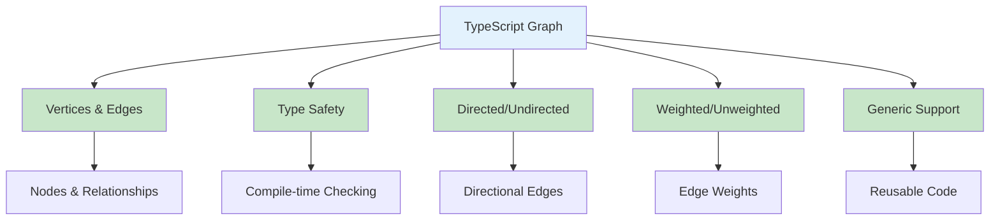
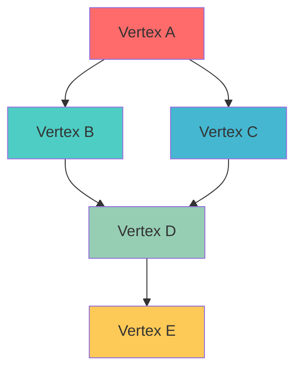
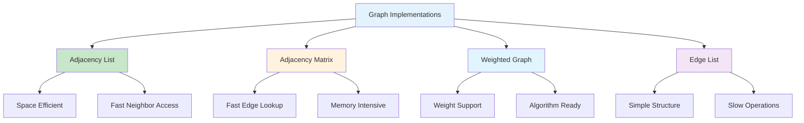
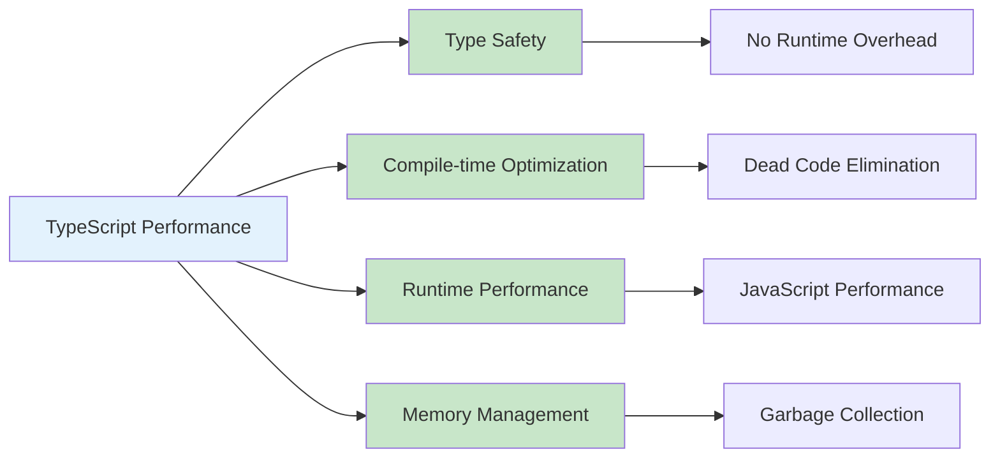
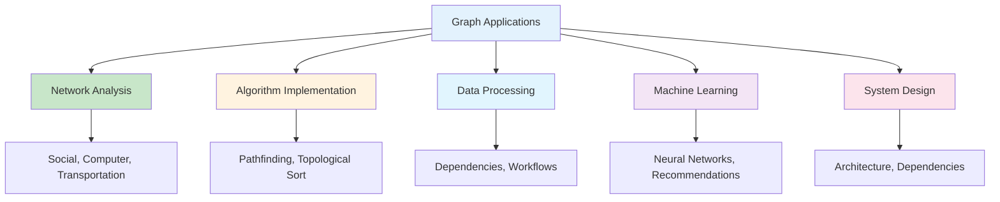
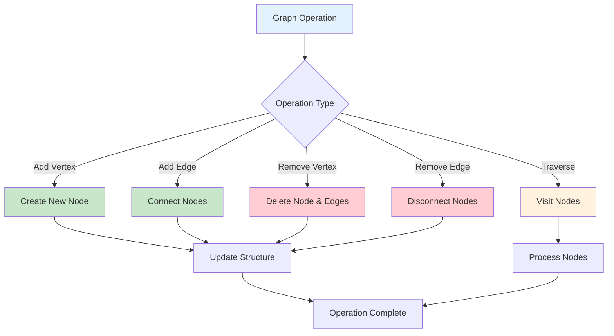
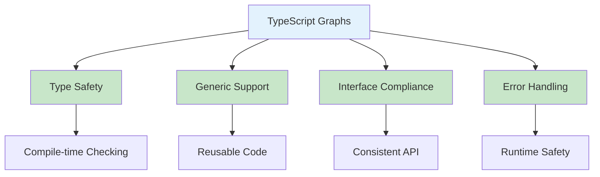
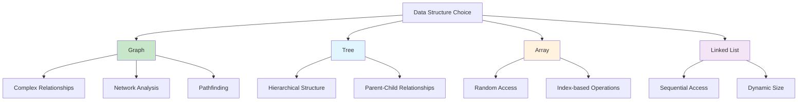

# Graphs in TypeScript

## Table of Contents

1. [Introduction](#introduction)
2. [Graph Fundamentals](#graph-fundamentals)
3. [Implementation Methods](#implementation-methods)
4. [Graph Operations](#graph-operations)
5. [Advanced Graph Applications](#advanced-graph-applications)
6. [Performance Analysis](#performance-analysis)
7. [Use Cases and Applications](#use-cases-and-applications)
8. [Best Practices](#best-practices)
9. [Visual Representations](#visual-representations)

## Introduction

A graph is a non-linear data structure consisting of vertices (nodes) connected by edges. In TypeScript, graphs provide type safety, generic support, and powerful abstractions for modeling relationships and networks with compile-time type checking.

### Key Characteristics

- **Vertices and Edges**: Nodes connected by relationships
- **Directed/Undirected**: Edges can have direction
- **Weighted/Unweighted**: Edges can have weights
- **Cyclic/Acyclic**: May or may not contain cycles
- **Type Safety**: Compile-time type checking for vertices and edges



## Graph Fundamentals

### Basic Graph Implementation

```typescript
interface IGraph<T> {
  addVertex(vertex: T): void;
  removeVertex(vertex: T): void;
  addEdge(from: T, to: T, weight?: number): void;
  removeEdge(from: T, to: T): void;
  getNeighbors(vertex: T): T[];
  hasVertex(vertex: T): boolean;
  hasEdge(from: T, to: T): boolean;
  getVertices(): T[];
  getEdges(): [T, T, number?][];
  size(): number;
  clear(): void;
}

class Graph<T> implements IGraph<T> {
  private vertices: Set<T> = new Set();
  private edges: Map<T, Map<T, number>> = new Map();

  addVertex(vertex: T): void {
    this.vertices.add(vertex);
    if (!this.edges.has(vertex)) {
      this.edges.set(vertex, new Map());
    }
  }

  removeVertex(vertex: T): void {
    this.vertices.delete(vertex);
    this.edges.delete(vertex);

    // Remove all edges to this vertex
    for (const [from, neighbors] of this.edges) {
      neighbors.delete(vertex);
    }
  }

  addEdge(from: T, to: T, weight: number = 1): void {
    if (!this.vertices.has(from)) {
      this.addVertex(from);
    }
    if (!this.vertices.has(to)) {
      this.addVertex(to);
    }

    this.edges.get(from)!.set(to, weight);
  }

  removeEdge(from: T, to: T): void {
    this.edges.get(from)?.delete(to);
  }

  getNeighbors(vertex: T): T[] {
    const neighbors = this.edges.get(vertex);
    return neighbors ? Array.from(neighbors.keys()) : [];
  }

  hasVertex(vertex: T): boolean {
    return this.vertices.has(vertex);
  }

  hasEdge(from: T, to: T): boolean {
    return this.edges.get(from)?.has(to) ?? false;
  }

  getVertices(): T[] {
    return Array.from(this.vertices);
  }

  getEdges(): [T, T, number?][] {
    const edges: [T, T, number?][] = [];
    for (const [from, neighbors] of this.edges) {
      for (const [to, weight] of neighbors) {
        edges.push([from, to, weight]);
      }
    }
    return edges;
  }

  size(): number {
    return this.vertices.size;
  }

  clear(): void {
    this.vertices.clear();
    this.edges.clear();
  }
}
```

### Graph Structure Visualization



## Implementation Methods

### 1. Adjacency List Graph

```typescript
class AdjacencyListGraph<T> implements IGraph<T> {
  private vertices: Set<T> = new Set();
  private adjacencyList: Map<T, T[]> = new Map();

  addVertex(vertex: T): void {
    this.vertices.add(vertex);
    if (!this.adjacencyList.has(vertex)) {
      this.adjacencyList.set(vertex, []);
    }
  }

  addEdge(from: T, to: T): void {
    if (!this.vertices.has(from)) {
      this.addVertex(from);
    }
    if (!this.vertices.has(to)) {
      this.addVertex(to);
    }

    const neighbors = this.adjacencyList.get(from)!;
    if (!neighbors.includes(to)) {
      neighbors.push(to);
    }
  }

  getNeighbors(vertex: T): T[] {
    return this.adjacencyList.get(vertex) || [];
  }

  hasEdge(from: T, to: T): boolean {
    const neighbors = this.adjacencyList.get(from);
    return neighbors ? neighbors.includes(to) : false;
  }

  getVertices(): T[] {
    return Array.from(this.vertices);
  }

  size(): number {
    return this.vertices.size;
  }
}
```

### 2. Adjacency Matrix Graph

```typescript
class AdjacencyMatrixGraph<T> implements IGraph<T> {
  private vertices: T[] = [];
  private matrix: number[][] = [];
  private vertexIndex: Map<T, number> = new Map();

  addVertex(vertex: T): void {
    if (this.vertexIndex.has(vertex)) {
      return;
    }

    const index = this.vertices.length;
    this.vertices.push(vertex);
    this.vertexIndex.set(vertex, index);

    // Expand matrix
    for (let i = 0; i < this.matrix.length; i++) {
      this.matrix[i].push(0);
    }
    this.matrix.push(new Array(this.vertices.length).fill(0));
  }

  addEdge(from: T, to: T, weight: number = 1): void {
    if (!this.vertexIndex.has(from)) {
      this.addVertex(from);
    }
    if (!this.vertexIndex.has(to)) {
      this.addVertex(to);
    }

    const fromIndex = this.vertexIndex.get(from)!;
    const toIndex = this.vertexIndex.get(to)!;
    this.matrix[fromIndex][toIndex] = weight;
  }

  hasEdge(from: T, to: T): boolean {
    const fromIndex = this.vertexIndex.get(from);
    const toIndex = this.vertexIndex.get(to);

    if (fromIndex === undefined || toIndex === undefined) {
      return false;
    }

    return this.matrix[fromIndex][toIndex] > 0;
  }

  getNeighbors(vertex: T): T[] {
    const vertexIndex = this.vertexIndex.get(vertex);
    if (vertexIndex === undefined) {
      return [];
    }

    const neighbors: T[] = [];
    for (let i = 0; i < this.matrix[vertexIndex].length; i++) {
      if (this.matrix[vertexIndex][i] > 0) {
        neighbors.push(this.vertices[i]);
      }
    }
    return neighbors;
  }

  getVertices(): T[] {
    return [...this.vertices];
  }

  size(): number {
    return this.vertices.length;
  }
}
```

### 3. Weighted Graph

```typescript
interface WeightedEdge<T> {
  to: T;
  weight: number;
}

class WeightedGraph<T> implements IGraph<T> {
  private vertices: Set<T> = new Set();
  private edges: Map<T, WeightedEdge<T>[]> = new Map();

  addVertex(vertex: T): void {
    this.vertices.add(vertex);
    if (!this.edges.has(vertex)) {
      this.edges.set(vertex, []);
    }
  }

  addEdge(from: T, to: T, weight: number = 1): void {
    if (!this.vertices.has(from)) {
      this.addVertex(from);
    }
    if (!this.vertices.has(to)) {
      this.addVertex(to);
    }

    const neighbors = this.edges.get(from)!;
    const existingEdge = neighbors.find(edge => edge.to === to);

    if (existingEdge) {
      existingEdge.weight = weight;
    } else {
      neighbors.push({ to, weight });
    }
  }

  getNeighbors(vertex: T): T[] {
    const neighbors = this.edges.get(vertex);
    return neighbors ? neighbors.map(edge => edge.to) : [];
  }

  getWeight(from: T, to: T): number | undefined {
    const neighbors = this.edges.get(from);
    if (!neighbors) return undefined;

    const edge = neighbors.find(edge => edge.to === to);
    return edge ? edge.weight : undefined;
  }

  hasEdge(from: T, to: T): boolean {
    const neighbors = this.edges.get(from);
    return neighbors ? neighbors.some(edge => edge.to === to) : false;
  }

  getVertices(): T[] {
    return Array.from(this.vertices);
  }

  size(): number {
    return this.vertices.size;
  }
}
```

### Implementation Comparison



## Graph Operations

### 1. Graph Traversal

```typescript
class GraphTraversal<T> {
  static dfs(graph: IGraph<T>, startVertex: T): T[] {
    const visited: T[] = [];
    const visitedSet = new Set<T>();

    const dfsHelper = (vertex: T) => {
      if (visitedSet.has(vertex)) return;

      visitedSet.add(vertex);
      visited.push(vertex);

      const neighbors = graph.getNeighbors(vertex);
      for (const neighbor of neighbors) {
        dfsHelper(neighbor);
      }
    };

    dfsHelper(startVertex);
    return visited;
  }

  static bfs(graph: IGraph<T>, startVertex: T): T[] {
    const visited: T[] = [];
    const visitedSet = new Set<T>();
    const queue: T[] = [startVertex];

    while (queue.length > 0) {
      const vertex = queue.shift()!;

      if (visitedSet.has(vertex)) continue;

      visitedSet.add(vertex);
      visited.push(vertex);

      const neighbors = graph.getNeighbors(vertex);
      for (const neighbor of neighbors) {
        if (!visitedSet.has(neighbor)) {
          queue.push(neighbor);
        }
      }
    }

    return visited;
  }

  static findPath(graph: IGraph<T>, start: T, end: T): T[] | null {
    const visited = new Set<T>();
    const queue: { vertex: T; path: T[] }[] = [{ vertex: start, path: [start] }];

    while (queue.length > 0) {
      const { vertex, path } = queue.shift()!;

      if (vertex === end) {
        return path;
      }

      if (visited.has(vertex)) continue;
      visited.add(vertex);

      const neighbors = graph.getNeighbors(vertex);
      for (const neighbor of neighbors) {
        if (!visited.has(neighbor)) {
          queue.push({ vertex: neighbor, path: [...path, neighbor] });
        }
      }
    }

    return null;
  }
}
```

### 2. Shortest Path Algorithms

```typescript
class ShortestPath<T> {
  static dijkstra(graph: WeightedGraph<T>, start: T, end: T): { path: T[]; distance: number } | null {
    const distances = new Map<T, number>();
    const previous = new Map<T, T | null>();
    const unvisited = new Set<T>();

    // Initialize distances
    for (const vertex of graph.getVertices()) {
      distances.set(vertex, Infinity);
      previous.set(vertex, null);
      unvisited.add(vertex);
    }
    distances.set(start, 0);

    while (unvisited.size > 0) {
      // Find vertex with minimum distance
      let current: T | null = null;
      let minDistance = Infinity;

      for (const vertex of unvisited) {
        const distance = distances.get(vertex)!;
        if (distance < minDistance) {
          minDistance = distance;
          current = vertex;
        }
      }

      if (current === null || current === end) break;
      unvisited.delete(current);

      // Update distances to neighbors
      const neighbors = graph.getNeighbors(current);
      for (const neighbor of neighbors) {
        if (!unvisited.has(neighbor)) continue;

        const weight = graph.getWeight(current, neighbor)!;
        const newDistance = distances.get(current)! + weight;

        if (newDistance < distances.get(neighbor)!) {
          distances.set(neighbor, newDistance);
          previous.set(neighbor, current);
        }
      }
    }

    // Reconstruct path
    if (distances.get(end) === Infinity) {
      return null;
    }

    const path: T[] = [];
    let current: T | null = end;
    while (current !== null) {
      path.unshift(current);
      current = previous.get(current)!;
    }

    return { path, distance: distances.get(end)! };
  }
}
```

### 3. Cycle Detection

```typescript
class CycleDetection<T> {
  static hasCycle(graph: IGraph<T>): boolean {
    const visited = new Set<T>();
    const recursionStack = new Set<T>();

    const hasCycleHelper = (vertex: T): boolean => {
      if (recursionStack.has(vertex)) {
        return true;
      }

      if (visited.has(vertex)) {
        return false;
      }

      visited.add(vertex);
      recursionStack.add(vertex);

      const neighbors = graph.getNeighbors(vertex);
      for (const neighbor of neighbors) {
        if (hasCycleHelper(neighbor)) {
          return true;
        }
      }

      recursionStack.delete(vertex);
      return false;
    };

    for (const vertex of graph.getVertices()) {
      if (!visited.has(vertex)) {
        if (hasCycleHelper(vertex)) {
          return true;
        }
      }
    }

    return false;
  }

  static findCycle(graph: IGraph<T>): T[] | null {
    const visited = new Set<T>();
    const recursionStack = new Set<T>();
    const path: T[] = [];

    const findCycleHelper = (vertex: T): boolean => {
      if (recursionStack.has(vertex)) {
        // Found cycle, extract path
        const cycleStart = path.indexOf(vertex);
        return true;
      }

      if (visited.has(vertex)) {
        return false;
      }

      visited.add(vertex);
      recursionStack.add(vertex);
      path.push(vertex);

      const neighbors = graph.getNeighbors(vertex);
      for (const neighbor of neighbors) {
        if (findCycleHelper(neighbor)) {
          return true;
        }
      }

      recursionStack.delete(vertex);
      path.pop();
      return false;
    };

    for (const vertex of graph.getVertices()) {
      if (!visited.has(vertex)) {
        if (findCycleHelper(vertex)) {
          return path;
        }
      }
    }

    return null;
  }
}
```

## Advanced Graph Applications

### 1. Social Network Analysis

```typescript
interface User {
  id: string;
  name: string;
  friends: string[];
}

class SocialNetwork {
  private graph: Graph<string> = new Graph();
  private users: Map<string, User> = new Map();

  addUser(user: User): void {
    this.users.set(user.id, user);
    this.graph.addVertex(user.id);

    for (const friendId of user.friends) {
      this.graph.addEdge(user.id, friendId);
      this.graph.addEdge(friendId, user.id); // Undirected
    }
  }

  findMutualFriends(user1: string, user2: string): string[] {
    const friends1 = new Set(this.graph.getNeighbors(user1));
    const friends2 = new Set(this.graph.getNeighbors(user2));

    return Array.from(friends1).filter(friend => friends2.has(friend));
  }

  findShortestPath(user1: string, user2: string): string[] | null {
    return GraphTraversal.findPath(this.graph, user1, user2);
  }

  getRecommendations(userId: string): string[] {
    const friends = this.graph.getNeighbors(userId);
    const recommendations = new Map<string, number>();

    for (const friend of friends) {
      const friendOfFriends = this.graph.getNeighbors(friend);
      for (const friendOfFriend of friendOfFriends) {
        if (friendOfFriend !== userId && !friends.includes(friendOfFriend)) {
          recommendations.set(friendOfFriend, (recommendations.get(friendOfFriend) || 0) + 1);
        }
      }
    }

    return Array.from(recommendations.entries())
      .sort((a, b) => b[1] - a[1])
      .map(([userId]) => userId);
  }
}
```

### 2. Route Planning

```typescript
interface Location {
  id: string;
  name: string;
  coordinates: { lat: number; lng: number };
}

class RoutePlanner {
  private graph: WeightedGraph<string> = new WeightedGraph();
  private locations: Map<string, Location> = new Map();

  addLocation(location: Location): void {
    this.locations.set(location.id, location);
    this.graph.addVertex(location.id);
  }

  addRoute(from: string, to: string, distance: number): void {
    this.graph.addEdge(from, to, distance);
    this.graph.addEdge(to, from, distance); // Bidirectional
  }

  findShortestRoute(start: string, end: string): { path: string[]; distance: number } | null {
    return ShortestPath.dijkstra(this.graph, start, end);
  }

  findNearbyLocations(locationId: string, maxDistance: number): string[] {
    const nearby: string[] = [];
    const neighbors = this.graph.getNeighbors(locationId);

    for (const neighbor of neighbors) {
      const distance = this.graph.getWeight(locationId, neighbor);
      if (distance && distance <= maxDistance) {
        nearby.push(neighbor);
      }
    }

    return nearby;
  }

  calculateDistance(location1: string, location2: string): number {
    const loc1 = this.locations.get(location1);
    const loc2 = this.locations.get(location2);

    if (!loc1 || !loc2) return Infinity;

    // Haversine formula for real distance
    const R = 6371; // Earth's radius in km
    const dLat = ((loc2.coordinates.lat - loc1.coordinates.lat) * Math.PI) / 180;
    const dLng = ((loc2.coordinates.lng - loc1.coordinates.lng) * Math.PI) / 180;
    const a =
      Math.sin(dLat / 2) * Math.sin(dLat / 2) +
      Math.cos((loc1.coordinates.lat * Math.PI) / 180) *
        Math.cos((loc2.coordinates.lat * Math.PI) / 180) *
        Math.sin(dLng / 2) *
        Math.sin(dLng / 2);
    const c = 2 * Math.atan2(Math.sqrt(a), Math.sqrt(1 - a));

    return R * c;
  }
}
```

## Performance Analysis

### Time Complexity

| Operation     | Adjacency List | Adjacency Matrix | Description             |
| ------------- | -------------- | ---------------- | ----------------------- |
| Add Vertex    | O(1)           | O(V)             | Add new vertex          |
| Add Edge      | O(1)           | O(1)             | Add new edge            |
| Remove Vertex | O(V + E)       | O(V²)            | Remove vertex and edges |
| Remove Edge   | O(V)           | O(1)             | Remove specific edge    |
| Check Edge    | O(V)           | O(1)             | Check if edge exists    |
| Get Neighbors | O(V)           | O(V)             | Get all neighbors       |

### Space Complexity

| Implementation   | Space Complexity | Description      |
| ---------------- | ---------------- | ---------------- |
| Adjacency List   | O(V + E)         | Vertices + Edges |
| Adjacency Matrix | O(V²)            | V × V matrix     |
| Edge List        | O(E)             | List of edges    |

### TypeScript-Specific Performance



## Use Cases and Applications

### 1. Network Analysis

- **Social Networks**: Friend connections and recommendations
- **Computer Networks**: Network topology and routing
- **Transportation**: Road networks and route planning

### 2. Algorithm Implementation

- **Pathfinding**: Shortest path algorithms
- **Topological Sort**: Dependency resolution
- **Minimum Spanning Tree**: Network optimization

### 3. Data Processing

- **Dependency Graphs**: Package management
- **Workflow Management**: Task dependencies
- **Knowledge Graphs**: Information relationships

### 4. Machine Learning

- **Neural Networks**: Node connections
- **Graph Neural Networks**: Structured data processing
- **Recommendation Systems**: User-item relationships

### Application Areas



## Best Practices

### 1. Type Safety

```typescript
// Use generic types for flexibility
class GenericGraph<T> {
  private vertices: Set<T> = new Set();
  private edges: Map<T, T[]> = new Map();

  addVertex(vertex: T): void {
    this.vertices.add(vertex);
    if (!this.edges.has(vertex)) {
      this.edges.set(vertex, []);
    }
  }

  addEdge(from: T, to: T): void {
    if (!this.vertices.has(from)) {
      this.addVertex(from);
    }
    if (!this.vertices.has(to)) {
      this.addVertex(to);
    }

    const neighbors = this.edges.get(from)!;
    if (!neighbors.includes(to)) {
      neighbors.push(to);
    }
  }
}

// Use type guards for runtime safety
function isStringGraph(graph: IGraph<any>): graph is IGraph<string> {
  const vertices = graph.getVertices();
  return vertices.length === 0 || typeof vertices[0] === "string";
}
```

### 2. Error Handling

```typescript
class SafeGraph<T> {
  private vertices: Set<T> = new Set();
  private edges: Map<T, T[]> = new Map();

  addVertex(vertex: T): boolean {
    try {
      this.vertices.add(vertex);
      if (!this.edges.has(vertex)) {
        this.edges.set(vertex, []);
      }
      return true;
    } catch (error) {
      console.error("Error adding vertex:", error);
      return false;
    }
  }

  addEdge(from: T, to: T): boolean {
    try {
      if (!this.vertices.has(from) || !this.vertices.has(to)) {
        throw new Error("Vertices must exist before adding edge");
      }

      const neighbors = this.edges.get(from)!;
      if (!neighbors.includes(to)) {
        neighbors.push(to);
      }
      return true;
    } catch (error) {
      console.error("Error adding edge:", error);
      return false;
    }
  }

  getNeighbors(vertex: T): T[] {
    try {
      return this.edges.get(vertex) || [];
    } catch (error) {
      console.error("Error getting neighbors:", error);
      return [];
    }
  }
}
```

### 3. Memory Management

```typescript
class MemoryEfficientGraph<T> {
  private vertices: Set<T> = new Set();
  private edges: Map<T, T[]> = new Map();
  private maxVertices: number;

  constructor(maxVertices: number = 10000) {
    this.maxVertices = maxVertices;
  }

  addVertex(vertex: T): boolean {
    if (this.vertices.size >= this.maxVertices) {
      console.warn("Graph capacity reached");
      return false;
    }

    this.vertices.add(vertex);
    if (!this.edges.has(vertex)) {
      this.edges.set(vertex, []);
    }
    return true;
  }

  clear(): void {
    this.vertices.clear();
    this.edges.clear();
  }

  getMemoryUsage(): { vertices: number; edges: number } {
    let totalEdges = 0;
    for (const neighbors of this.edges.values()) {
      totalEdges += neighbors.length;
    }

    return {
      vertices: this.vertices.size,
      edges: totalEdges,
    };
  }
}
```

## Visual Representations

### Graph Operations Flow



### TypeScript Graph Features



### Graph vs Other Structures



## Conclusion

Graphs in TypeScript provide powerful abstractions for modeling complex relationships and networks with type safety, performance, and rich functionality. The combination of TypeScript's type system and graph data structures enables robust, maintainable code for managing interconnected data.

Key advantages of TypeScript graphs:

- **Type Safety**: Compile-time type checking prevents runtime errors
- **Flexible Representation**: Multiple implementation options for different use cases
- **Rich Algorithms**: Built-in support for traversal, pathfinding, and analysis
- **Generic Support**: Reusable code with type parameters
- **Interface Compliance**: Consistent API across implementations

Graphs excel in scenarios requiring:

- Complex relationship modeling
- Network analysis and routing
- Dependency management
- Pathfinding and optimization
- Social network analysis

Understanding graph operations, implementation methods, and performance characteristics is crucial for building efficient applications. The choice between different graph implementations depends on specific requirements:

- **Adjacency List**: Space efficient, good for sparse graphs
- **Adjacency Matrix**: Fast edge lookup, good for dense graphs
- **Weighted Graph**: Supports edge weights for algorithms
- **Edge List**: Simple structure, good for specific algorithms

The key to effective TypeScript graph usage lies in leveraging the type system for safety, understanding performance implications, and following best practices for memory management and error handling.

TypeScript's graph implementation provides an excellent foundation for building robust applications with compile-time safety and runtime performance, making it an ideal choice for modern web development and system programming.
