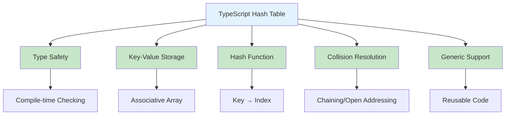
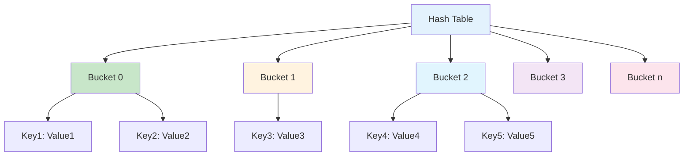
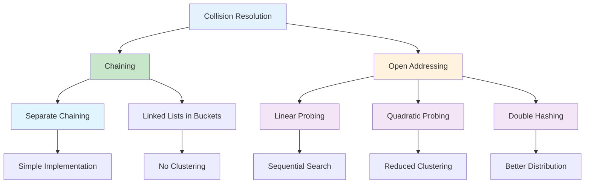
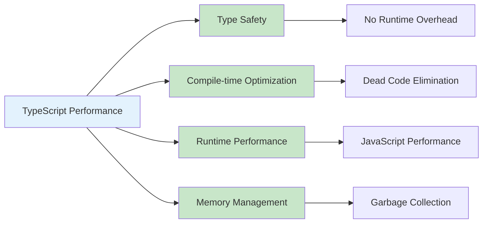
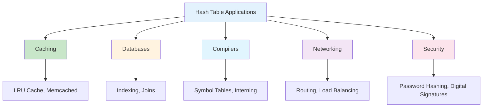
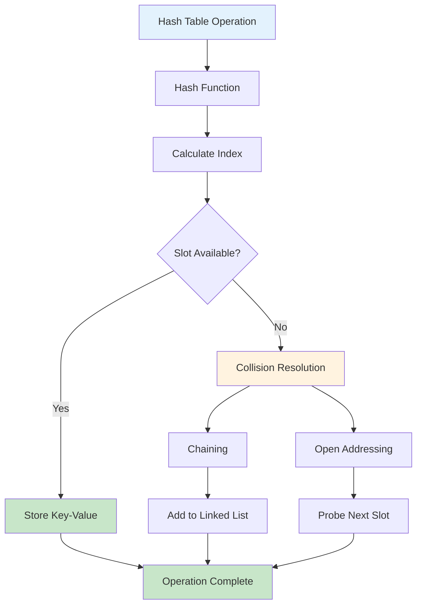
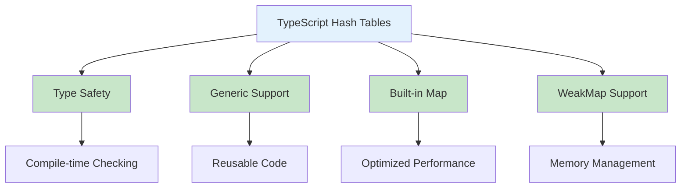

# Hash Tables in TypeScript

## Table of Contents

1. [Introduction](#introduction)
2. [Hash Table Fundamentals](#hash-table-fundamentals)
3. [TypeScript Map Implementation](#typescript-map-implementation)
4. [Hash Functions](#hash-functions)
5. [Collision Resolution](#collision-resolution)
6. [Performance Analysis](#performance-analysis)
7. [Advanced Hash Table Types](#advanced-hash-table-types)
8. [Use Cases and Applications](#use-cases-and-applications)
9. [Best Practices](#best-practices)
10. [Visual Representations](#visual-representations)

## Introduction

A hash table (hash map) is a data structure that implements an associative array abstract data type, using a hash function to compute an index into an array of buckets or slots. In TypeScript, hash tables provide type safety, generic support, and powerful abstractions for key-value storage with average O(1) time complexity for search, insert, and delete operations.

### Key Characteristics

- **Key-Value Storage**: Maps keys to values with type safety
- **Hash Function**: Converts keys to array indices
- **Collision Handling**: Manages multiple keys mapping to same index
- **Dynamic Resizing**: Grows/shrinks as needed
- **Type Safety**: Compile-time type checking for keys and values



## Hash Table Fundamentals

### Basic Hash Table Implementation

```typescript
interface IHashTable<K, V> {
  set(key: K, value: V): void;
  get(key: K): V | undefined;
  has(key: K): boolean;
  delete(key: K): boolean;
  size(): number;
  clear(): void;
  keys(): K[];
  values(): V[];
  entries(): [K, V][];
}

class HashTable<K, V> implements IHashTable<K, V> {
  private buckets: Array<Array<[K, V]>>;
  private capacity: number;
  private size: number = 0;
  private loadFactor: number = 0.75;

  constructor(initialCapacity: number = 16, loadFactor: number = 0.75) {
    this.capacity = initialCapacity;
    this.loadFactor = loadFactor;
    this.buckets = new Array(this.capacity).fill(null).map(() => []);
  }

  private hash(key: K): number {
    const keyString = String(key);
    let hash = 0;
    for (let i = 0; i < keyString.length; i++) {
      const char = keyString.charCodeAt(i);
      hash = (hash << 5) - hash + char;
      hash = hash & hash; // Convert to 32-bit integer
    }
    return Math.abs(hash) % this.capacity;
  }

  private resize(): void {
    const oldBuckets = this.buckets;
    this.capacity *= 2;
    this.buckets = new Array(this.capacity).fill(null).map(() => []);
    this.size = 0;

    for (const bucket of oldBuckets) {
      for (const [key, value] of bucket) {
        this.set(key, value);
      }
    }
  }

  set(key: K, value: V): void {
    if (this.size >= this.capacity * this.loadFactor) {
      this.resize();
    }

    const index = this.hash(key);
    const bucket = this.buckets[index];

    // Check if key already exists
    for (let i = 0; i < bucket.length; i++) {
      if (bucket[i][0] === key) {
        bucket[i][1] = value;
        return;
      }
    }

    // Add new key-value pair
    bucket.push([key, value]);
    this.size++;
  }

  get(key: K): V | undefined {
    const index = this.hash(key);
    const bucket = this.buckets[index];

    for (const [k, v] of bucket) {
      if (k === key) {
        return v;
      }
    }

    return undefined;
  }

  has(key: K): boolean {
    return this.get(key) !== undefined;
  }

  delete(key: K): boolean {
    const index = this.hash(key);
    const bucket = this.buckets[index];

    for (let i = 0; i < bucket.length; i++) {
      if (bucket[i][0] === key) {
        bucket.splice(i, 1);
        this.size--;
        return true;
      }
    }

    return false;
  }

  size(): number {
    return this.size;
  }

  clear(): void {
    this.buckets = new Array(this.capacity).fill(null).map(() => []);
    this.size = 0;
  }

  keys(): K[] {
    const result: K[] = [];
    for (const bucket of this.buckets) {
      for (const [key] of bucket) {
        result.push(key);
      }
    }
    return result;
  }

  values(): V[] {
    const result: V[] = [];
    for (const bucket of this.buckets) {
      for (const [, value] of bucket) {
        result.push(value);
      }
    }
    return result;
  }

  entries(): [K, V][] {
    const result: [K, V][] = [];
    for (const bucket of this.buckets) {
      for (const entry of bucket) {
        result.push(entry);
      }
    }
    return result;
  }
}
```

### Hash Table Structure



## TypeScript Map Implementation

### Built-in Map Features

```typescript
// Map creation and operations
const myMap = new Map<string, number>();
myMap.set("name", 30);
myMap.set("age", 25);
myMap.set("city", 35);

// Type-safe operations
const name: number | undefined = myMap.get("name");
const hasAge: boolean = myMap.has("age");

// Map methods
const keys: string[] = Array.from(myMap.keys());
const values: number[] = Array.from(myMap.values());
const entries: [string, number][] = Array.from(myMap.entries());

// Map iteration
for (const [key, value] of myMap) {
  console.log(`${key}: ${value}`);
}

// Map with custom types
interface Person {
  name: string;
  age: number;
}

const personMap = new Map<string, Person>();
personMap.set("alice", { name: "Alice", age: 30 });
personMap.set("bob", { name: "Bob", age: 25 });

// WeakMap for memory management
const weakMap = new WeakMap<object, string>();
const obj = {};
weakMap.set(obj, "value");
```

### Advanced Map Operations

```typescript
class MapOperations<K, V> {
  // Merge two maps
  static merge<K, V>(map1: Map<K, V>, map2: Map<K, V>): Map<K, V> {
    const result = new Map(map1);
    for (const [key, value] of map2) {
      result.set(key, value);
    }
    return result;
  }

  // Filter map entries
  static filter<K, V>(map: Map<K, V>, predicate: (key: K, value: V) => boolean): Map<K, V> {
    const result = new Map<K, V>();
    for (const [key, value] of map) {
      if (predicate(key, value)) {
        result.set(key, value);
      }
    }
    return result;
  }

  // Map transformation
  static map<K, V, U>(map: Map<K, V>, transform: (key: K, value: V) => U): Map<K, U> {
    const result = new Map<K, U>();
    for (const [key, value] of map) {
      result.set(key, transform(key, value));
    }
    return result;
  }

  // Reduce map values
  static reduce<K, V, U>(map: Map<K, V>, reducer: (acc: U, key: K, value: V) => U, initial: U): U {
    let result = initial;
    for (const [key, value] of map) {
      result = reducer(result, key, value);
    }
    return result;
  }
}
```

## Hash Functions

### Hash Function Implementations

```typescript
class HashFunctions {
  // Simple hash function
  static simpleHash(key: string, tableSize: number): number {
    let hash = 0;
    for (let i = 0; i < key.length; i++) {
      hash += key.charCodeAt(i);
    }
    return hash % tableSize;
  }

  // DJB2 hash function
  static djb2Hash(key: string): number {
    let hash = 5381;
    for (let i = 0; i < key.length; i++) {
      hash = (hash << 5) + hash + key.charCodeAt(i);
    }
    return hash;
  }

  // SDBM hash function
  static sdbmHash(key: string): number {
    let hash = 0;
    for (let i = 0; i < key.length; i++) {
      hash = key.charCodeAt(i) + (hash << 6) + (hash << 16) - hash;
    }
    return hash;
  }

  // FNV-1a hash function
  static fnvHash(key: string): number {
    let hash = 2166136261;
    for (let i = 0; i < key.length; i++) {
      hash ^= key.charCodeAt(i);
      hash *= 16777619;
    }
    return hash;
  }

  // Hash function for objects
  static objectHash(obj: any): number {
    const str = JSON.stringify(obj);
    return this.djb2Hash(str);
  }

  // Hash function for numbers
  static numberHash(num: number): number {
    return Math.abs(num) % 2147483647;
  }
}
```

### Hash Function Characteristics

```mermaid
graph TD
    A[Hash Function] --> B[Deterministic]
    A --> C[Uniform Distribution]
    A --> D[Fast Computation]
    A --> E[Avalanche Effect]

    B --> F[Same input → Same output]
    C --> G[Even bucket distribution]
    D --> H[O(1) computation time]
    E --> I[Small input change → Large output change]

    style A fill:#e3f2fd
    style B fill:#c8e6c9
    style C fill:#c8e6c9
    style D fill:#c8e6c9
    style E fill:#c8e6c9
```

## Collision Resolution

### 1. Chaining (Separate Chaining)

```typescript
class ChainingHashTable<K, V> {
  private buckets: Array<Array<[K, V]>>;
  private capacity: number;
  private size: number = 0;

  constructor(capacity: number = 16) {
    this.capacity = capacity;
    this.buckets = new Array(capacity).fill(null).map(() => []);
  }

  private hash(key: K): number {
    const keyString = String(key);
    let hash = 0;
    for (let i = 0; i < keyString.length; i++) {
      hash = (hash << 5) - hash + keyString.charCodeAt(i);
    }
    return Math.abs(hash) % this.capacity;
  }

  set(key: K, value: V): void {
    const index = this.hash(key);
    const bucket = this.buckets[index];

    // Check if key already exists
    for (let i = 0; i < bucket.length; i++) {
      if (bucket[i][0] === key) {
        bucket[i][1] = value;
        return;
      }
    }

    // Add new key-value pair
    bucket.push([key, value]);
    this.size++;
  }

  get(key: K): V | undefined {
    const index = this.hash(key);
    const bucket = this.buckets[index];

    for (const [k, v] of bucket) {
      if (k === key) {
        return v;
      }
    }

    return undefined;
  }

  delete(key: K): boolean {
    const index = this.hash(key);
    const bucket = this.buckets[index];

    for (let i = 0; i < bucket.length; i++) {
      if (bucket[i][0] === key) {
        bucket.splice(i, 1);
        this.size--;
        return true;
      }
    }

    return false;
  }
}
```

### 2. Open Addressing (Linear Probing)

```typescript
class OpenAddressingHashTable<K, V> {
  private keys: (K | null)[];
  private values: (V | null)[];
  private capacity: number;
  private size: number = 0;
  private deleted: boolean[] = [];

  constructor(capacity: number = 16) {
    this.capacity = capacity;
    this.keys = new Array(capacity).fill(null);
    this.values = new Array(capacity).fill(null);
    this.deleted = new Array(capacity).fill(false);
  }

  private hash(key: K): number {
    const keyString = String(key);
    let hash = 0;
    for (let i = 0; i < keyString.length; i++) {
      hash = (hash << 5) - hash + keyString.charCodeAt(i);
    }
    return Math.abs(hash) % this.capacity;
  }

  private findSlot(key: K): number {
    let index = this.hash(key);

    while (this.keys[index] !== null) {
      if (this.keys[index] === key && !this.deleted[index]) {
        return index;
      }
      index = (index + 1) % this.capacity;
    }

    return index;
  }

  set(key: K, value: V): void {
    const index = this.findSlot(key);

    if (this.keys[index] === null || this.deleted[index]) {
      this.size++;
    }

    this.keys[index] = key;
    this.values[index] = value;
    this.deleted[index] = false;
  }

  get(key: K): V | undefined {
    const index = this.findSlot(key);

    if (this.keys[index] === key && !this.deleted[index]) {
      return this.values[index] as V;
    }

    return undefined;
  }

  delete(key: K): boolean {
    const index = this.findSlot(key);

    if (this.keys[index] === key && !this.deleted[index]) {
      this.deleted[index] = true;
      this.size--;
      return true;
    }

    return false;
  }
}
```

### Collision Resolution Methods



## Performance Analysis

### Time Complexity

| Operation | Average Case | Worst Case | Description                          |
| --------- | ------------ | ---------- | ------------------------------------ |
| Search    | O(1)         | O(n)       | Hash function + collision resolution |
| Insert    | O(1)         | O(n)       | Hash function + collision resolution |
| Delete    | O(1)         | O(n)       | Hash function + collision resolution |
| Resize    | O(n)         | O(n)       | Rehash all elements                  |

### Space Complexity

| Aspect      | Space Complexity | Description                      |
| ----------- | ---------------- | -------------------------------- |
| Storage     | O(n)             | n key-value pairs                |
| Auxiliary   | O(1)             | Constant extra space             |
| Load Factor | O(n)             | Space for load factor management |

### TypeScript-Specific Performance



## Advanced Hash Table Types

### 1. Consistent Hashing

```typescript
class ConsistentHash<T> {
  private ring: Map<number, T> = new Map();
  private sortedKeys: number[] = [];
  private replicas: number;

  constructor(nodes: T[] = [], replicas: number = 3) {
    this.replicas = replicas;
    for (const node of nodes) {
      this.addNode(node);
    }
  }

  private hash(key: string): number {
    let hash = 0;
    for (let i = 0; i < key.length; i++) {
      hash = (hash << 5) - hash + key.charCodeAt(i);
    }
    return hash;
  }

  addNode(node: T): void {
    for (let i = 0; i < this.replicas; i++) {
      const key = this.hash(`${node}:${i}`);
      this.ring.set(key, node);
      this.sortedKeys.push(key);
    }
    this.sortedKeys.sort((a, b) => a - b);
  }

  removeNode(node: T): void {
    for (let i = 0; i < this.replicas; i++) {
      const key = this.hash(`${node}:${i}`);
      this.ring.delete(key);
      const index = this.sortedKeys.indexOf(key);
      if (index !== -1) {
        this.sortedKeys.splice(index, 1);
      }
    }
  }

  getNode(key: string): T | null {
    if (this.ring.size === 0) return null;

    const hash = this.hash(key);

    for (const ringKey of this.sortedKeys) {
      if (hash <= ringKey) {
        return this.ring.get(ringKey) || null;
      }
    }

    return this.ring.get(this.sortedKeys[0]) || null;
  }
}
```

### 2. Bloom Filter

```typescript
class BloomFilter {
  private bitArray: boolean[];
  private size: number;
  private hashCount: number;

  constructor(size: number, hashCount: number) {
    this.size = size;
    this.hashCount = hashCount;
    this.bitArray = new Array(size).fill(false);
  }

  private hash(item: string, seed: number): number {
    let hash = seed;
    for (let i = 0; i < item.length; i++) {
      hash = (hash << 5) - hash + item.charCodeAt(i);
    }
    return Math.abs(hash) % this.size;
  }

  add(item: string): void {
    for (let i = 0; i < this.hashCount; i++) {
      const index = this.hash(item, i);
      this.bitArray[index] = true;
    }
  }

  contains(item: string): boolean {
    for (let i = 0; i < this.hashCount; i++) {
      const index = this.hash(item, i);
      if (!this.bitArray[index]) {
        return false;
      }
    }
    return true;
  }
}
```

### 3. Cuckoo Hash Table

```typescript
class CuckooHashTable<K, V> {
  private table1: (K | null)[];
  private table2: (K | null)[];
  private values1: (V | null)[];
  private values2: (V | null)[];
  private capacity: number;
  private size: number = 0;
  private maxAttempts: number;

  constructor(capacity: number = 16) {
    this.capacity = capacity;
    this.maxAttempts = capacity;
    this.table1 = new Array(capacity).fill(null);
    this.table2 = new Array(capacity).fill(null);
    this.values1 = new Array(capacity).fill(null);
    this.values2 = new Array(capacity).fill(null);
  }

  private hash1(key: K): number {
    const keyString = String(key);
    let hash = 0;
    for (let i = 0; i < keyString.length; i++) {
      hash = (hash << 5) - hash + keyString.charCodeAt(i);
    }
    return Math.abs(hash) % this.capacity;
  }

  private hash2(key: K): number {
    const keyString = String(key);
    let hash = 0;
    for (let i = 0; i < keyString.length; i++) {
      hash = (hash << 5) - hash + keyString.charCodeAt(i);
    }
    return Math.abs((hash * 31) % this.capacity);
  }

  set(key: K, value: V): void {
    if (this.size >= this.capacity) {
      this.resize();
    }

    let currentKey = key;
    let currentValue = value;

    for (let attempt = 0; attempt < this.maxAttempts; attempt++) {
      // Try table1
      const index1 = this.hash1(currentKey);
      if (this.table1[index1] === null) {
        this.table1[index1] = currentKey;
        this.values1[index1] = currentValue;
        this.size++;
        return;
      }

      // Evict and try table2
      const evictedKey = this.table1[index1];
      const evictedValue = this.values1[index1];
      this.table1[index1] = currentKey;
      this.values1[index1] = currentValue;
      currentKey = evictedKey!;
      currentValue = evictedValue!;

      // Try table2
      const index2 = this.hash2(currentKey);
      if (this.table2[index2] === null) {
        this.table2[index2] = currentKey;
        this.values2[index2] = currentValue;
        this.size++;
        return;
      }

      // Evict and continue
      const evictedKey2 = this.table2[index2];
      const evictedValue2 = this.values2[index2];
      this.table2[index2] = currentKey;
      this.values2[index2] = currentValue;
      currentKey = evictedKey2!;
      currentValue = evictedValue2!;
    }

    // If we get here, we need to resize
    this.resize();
    this.set(currentKey, currentValue);
  }

  get(key: K): V | undefined {
    const index1 = this.hash1(key);
    if (this.table1[index1] === key) {
      return this.values1[index1] as V;
    }

    const index2 = this.hash2(key);
    if (this.table2[index2] === key) {
      return this.values2[index2] as V;
    }

    return undefined;
  }

  private resize(): void {
    const oldTable1 = this.table1;
    const oldTable2 = this.table2;
    const oldValues1 = this.values1;
    const oldValues2 = this.values2;

    this.capacity *= 2;
    this.maxAttempts = this.capacity;
    this.table1 = new Array(this.capacity).fill(null);
    this.table2 = new Array(this.capacity).fill(null);
    this.values1 = new Array(this.capacity).fill(null);
    this.values2 = new Array(this.capacity).fill(null);
    this.size = 0;

    for (let i = 0; i < oldTable1.length; i++) {
      if (oldTable1[i] !== null) {
        this.set(oldTable1[i]!, oldValues1[i]!);
      }
      if (oldTable2[i] !== null) {
        this.set(oldTable2[i]!, oldValues2[i]!);
      }
    }
  }
}
```

## Use Cases and Applications

### 1. Caching Systems

- **LRU Cache**: Least Recently Used cache implementation
- **Memcached**: Distributed memory caching system
- **Redis**: In-memory data structure store

### 2. Database Systems

- **Indexing**: Primary and secondary indexes
- **Join Operations**: Hash joins for table operations
- **Query Optimization**: Hash-based query processing

### 3. Compiler Design

- **Symbol Tables**: Variable and function lookup
- **String Interning**: Efficient string storage
- **Type Checking**: Type information storage

### 4. Network Applications

- **Routing Tables**: IP address to interface mapping
- **Session Management**: User session storage
- **Load Balancing**: Consistent hashing for distribution

### Application Areas



## Best Practices

### 1. Type Safety

```typescript
// Use generic types for flexibility
class GenericHashTable<K, V> {
  private data: Map<K, V> = new Map();

  set(key: K, value: V): void {
    this.data.set(key, value);
  }

  get(key: K): V | undefined {
    return this.data.get(key);
  }
}

// Use type guards for runtime safety
function isStringKey(key: any): key is string {
  return typeof key === "string";
}

// Use branded types for key safety
type UserId = string & { readonly brand: unique symbol };
type ProductId = string & { readonly brand: unique symbol };

class UserProductMap {
  private data: Map<UserId, ProductId[]> = new Map();

  addProduct(userId: UserId, productId: ProductId): void {
    const products = this.data.get(userId) || [];
    products.push(productId);
    this.data.set(userId, products);
  }
}
```

### 2. Performance Optimization

```typescript
// Use Map for better performance
class OptimizedHashTable<K, V> {
  private data: Map<K, V>;

  constructor() {
    this.data = new Map();
  }

  // Use Object.freeze for immutable keys
  setImmutableKey(key: K, value: V): void {
    const frozenKey = Object.freeze(key);
    this.data.set(frozenKey, value);
  }

  // Use WeakMap for memory management
  private weakData: WeakMap<object, V> = new WeakMap();

  setWeakKey(key: object, value: V): void {
    this.weakData.set(key, value);
  }
}
```

### 3. Error Handling

```typescript
class SafeHashTable<K, V> {
  private data: Map<K, V> = new Map();

  safeSet(key: K, value: V): boolean {
    try {
      this.data.set(key, value);
      return true;
    } catch (error) {
      console.error("Error setting value:", error);
      return false;
    }
  }

  safeGet(key: K): V | null {
    try {
      return this.data.get(key) || null;
    } catch (error) {
      console.error("Error getting value:", error);
      return null;
    }
  }

  safeDelete(key: K): boolean {
    try {
      return this.data.delete(key);
    } catch (error) {
      console.error("Error deleting value:", error);
      return false;
    }
  }
}
```

### 4. Memory Management

```typescript
class MemoryEfficientHashTable<K, V> {
  private data: Map<K, V> = new Map();
  private maxSize: number;

  constructor(maxSize: number = 1000) {
    this.maxSize = maxSize;
  }

  set(key: K, value: V): void {
    if (this.data.size >= this.maxSize) {
      this.evictOldest();
    }
    this.data.set(key, value);
  }

  private evictOldest(): void {
    const firstKey = this.data.keys().next().value;
    if (firstKey !== undefined) {
      this.data.delete(firstKey);
    }
  }

  clear(): void {
    this.data.clear();
  }

  getMemoryUsage(): number {
    return this.data.size;
  }
}
```

## Visual Representations

### Hash Table Operations Flow



### TypeScript Hash Table Features



### Performance Comparison

```mermaid
graph LR
    A[Data Structure] --> B[Hash Table]
    A --> C[Binary Search Tree]
    A --> D[Array]

    B --> E[Search: O(1)]
    B --> F[Insert: O(1)]
    B --> G[Delete: O(1)]

    C --> H[Search: O(log n)]
    C --> I[Insert: O(log n)]
    C --> J[Delete: O(log n)]

    D --> K[Search: O(n)]
    D --> L[Insert: O(n)]
    D --> M[Delete: O(n)]

    style B fill:#c8e6c9
    style C fill:#fff3e0
    style D fill:#ffcdd2
```

## Conclusion

Hash tables in TypeScript provide powerful abstractions for key-value storage with type safety, performance, and rich functionality. The combination of TypeScript's type system and hash table data structures enables robust, maintainable code for associative data storage.

Key advantages of TypeScript hash tables:

- **Type Safety**: Compile-time type checking prevents runtime errors
- **Performance**: Average O(1) time complexity for operations
- **Generic Support**: Reusable code with type parameters
- **Rich API**: Extensive built-in methods and operations
- **Memory Management**: WeakMap support for automatic cleanup

Hash tables excel in scenarios requiring:

- Fast key-value lookups and storage
- Caching and memoization
- Database indexing and query optimization
- Symbol tables and compiler design
- Network routing and load balancing

Understanding hash table implementation, collision resolution strategies, and performance characteristics is crucial for building efficient applications. The choice between different hash table implementations depends on specific requirements:

- **Built-in Map**: General-purpose, optimized performance
- **Custom Implementation**: Specific collision resolution needs
- **WeakMap**: Memory management and object keys
- **Consistent Hashing**: Distributed systems and load balancing

The key to effective TypeScript hash table usage lies in leveraging the type system for safety, understanding performance implications, and following best practices for memory management and error handling.

TypeScript's hash table implementation provides an excellent foundation for building robust applications with compile-time safety and runtime performance, making it an ideal choice for modern web development and system programming.
