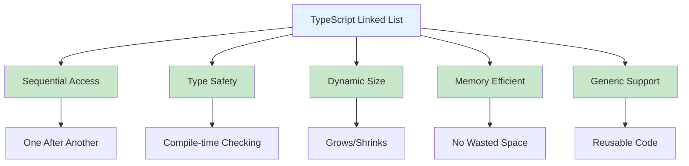
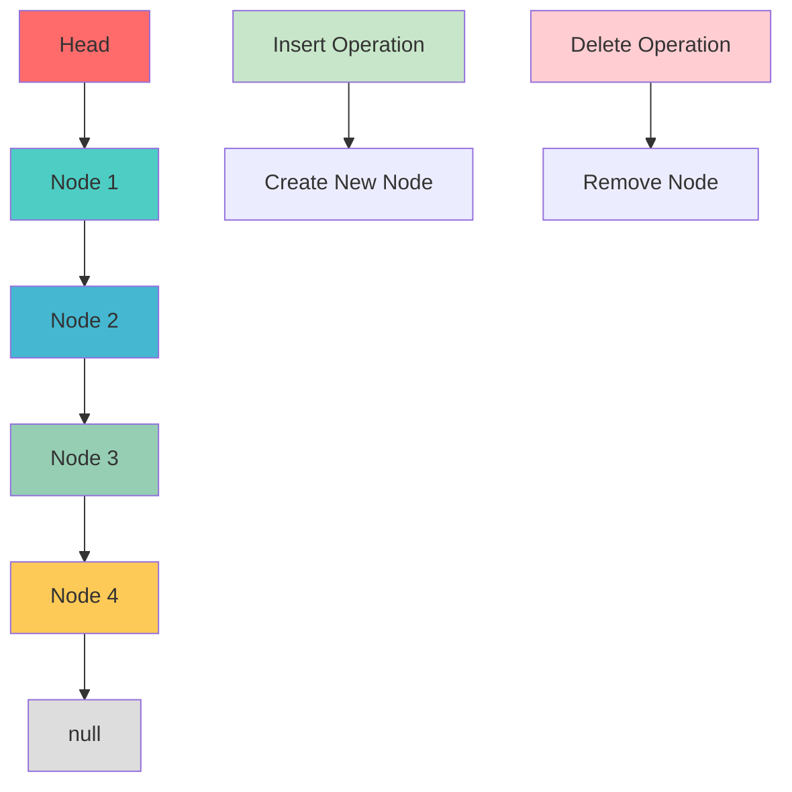
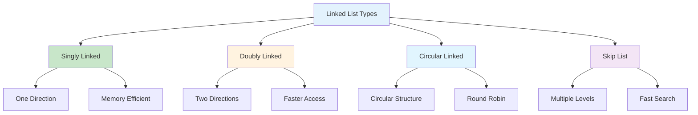
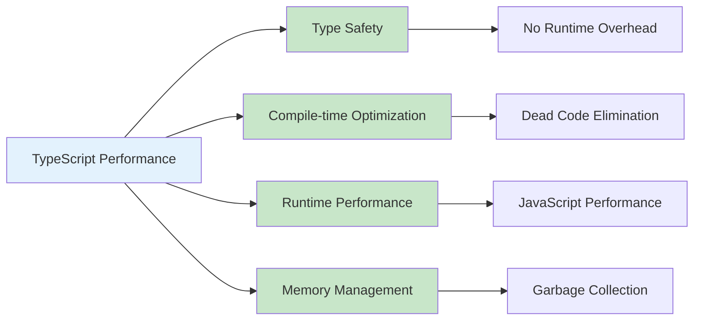
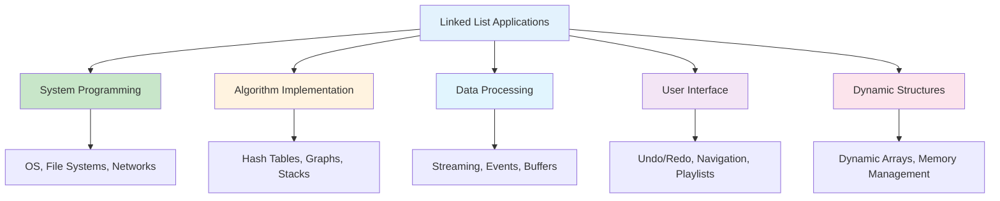
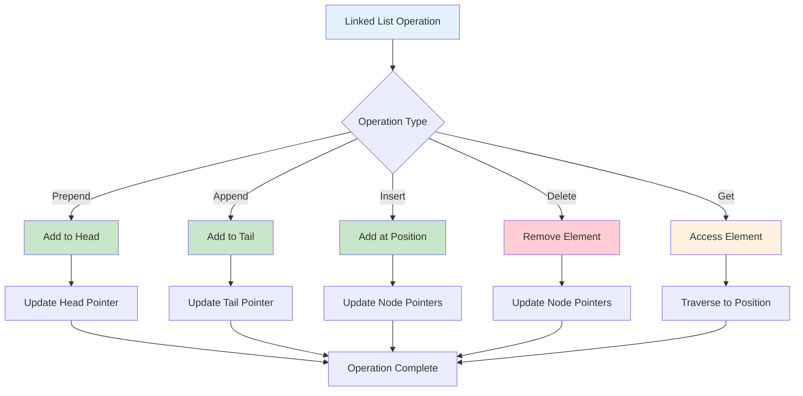
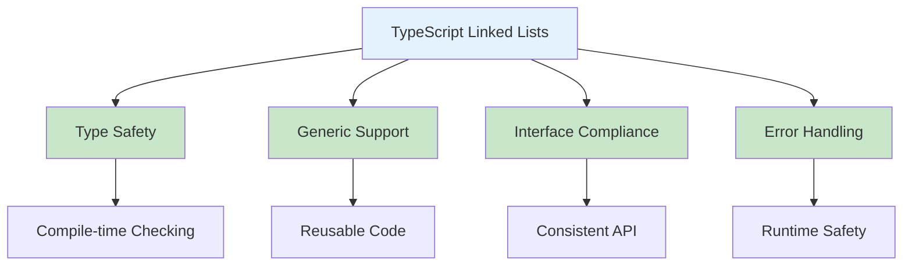
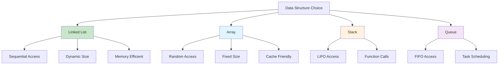

# Linked Lists in TypeScript

## Table of Contents

1. [Introduction](#introduction)
2. [Linked List Fundamentals](#linked-list-fundamentals)
3. [Implementation Methods](#implementation-methods)
4. [Linked List Operations](#linked-list-operations)
5. [Advanced Linked List Applications](#advanced-linked-list-applications)
6. [Performance Analysis](#performance-analysis)
7. [Use Cases and Applications](#use-cases-and-applications)
8. [Best Practices](#best-practices)
9. [Visual Representations](#visual-representations)

## Introduction

A linked list is a linear data structure where elements are stored in nodes, and each node contains a reference to the next node. In TypeScript, linked lists provide type safety, generic support, and powerful abstractions for managing sequential data with compile-time type checking.

### Key Characteristics

- **Sequential Access**: Elements accessed one after another
- **Dynamic Size**: Can grow and shrink as needed
- **Memory Efficiency**: Only allocates memory for actual data
- **No Random Access**: Must traverse from head to find elements
- **Type Safety**: Compile-time type checking for elements



## Linked List Fundamentals

### Basic Linked List Implementation

```typescript
interface ILinkedList<T> {
  prepend(data: T): void;
  append(data: T): void;
  insert(index: number, data: T): void;
  delete(index: number): T | undefined;
  get(index: number): T | undefined;
  set(index: number, data: T): boolean;
  find(data: T): number;
  contains(data: T): boolean;
  size(): number;
  isEmpty(): boolean;
  clear(): void;
  toArray(): T[];
}

class ListNode<T> {
  data: T;
  next: ListNode<T> | null = null;

  constructor(data: T) {
    this.data = data;
  }
}

class SinglyLinkedList<T> implements ILinkedList<T> {
  private head: ListNode<T> | null = null;
  private size: number = 0;

  prepend(data: T): void {
    const newNode = new ListNode(data);
    newNode.next = this.head;
    this.head = newNode;
    this.size++;
  }

  append(data: T): void {
    const newNode = new ListNode(data);

    if (this.isEmpty()) {
      this.head = newNode;
    } else {
      let current = this.head;
      while (current!.next) {
        current = current!.next;
      }
      current!.next = newNode;
    }
    this.size++;
  }

  insert(index: number, data: T): void {
    if (index < 0 || index > this.size) {
      throw new Error("Index out of bounds");
    }

    if (index === 0) {
      this.prepend(data);
      return;
    }

    const newNode = new ListNode(data);
    let current = this.head;

    for (let i = 0; i < index - 1; i++) {
      current = current!.next;
    }

    newNode.next = current!.next;
    current!.next = newNode;
    this.size++;
  }

  delete(index: number): T | undefined {
    if (index < 0 || index >= this.size) {
      return undefined;
    }

    if (index === 0) {
      const data = this.head!.data;
      this.head = this.head!.next;
      this.size--;
      return data;
    }

    let current = this.head;
    for (let i = 0; i < index - 1; i++) {
      current = current!.next;
    }

    const data = current!.next!.data;
    current!.next = current!.next!.next;
    this.size--;
    return data;
  }

  get(index: number): T | undefined {
    if (index < 0 || index >= this.size) {
      return undefined;
    }

    let current = this.head;
    for (let i = 0; i < index; i++) {
      current = current!.next;
    }
    return current!.data;
  }

  set(index: number, data: T): boolean {
    if (index < 0 || index >= this.size) {
      return false;
    }

    let current = this.head;
    for (let i = 0; i < index; i++) {
      current = current!.next;
    }
    current!.data = data;
    return true;
  }

  find(data: T): number {
    let current = this.head;
    let index = 0;

    while (current) {
      if (current.data === data) {
        return index;
      }
      current = current.next;
      index++;
    }

    return -1;
  }

  contains(data: T): boolean {
    return this.find(data) !== -1;
  }

  size(): number {
    return this.size;
  }

  isEmpty(): boolean {
    return this.head === null;
  }

  clear(): void {
    this.head = null;
    this.size = 0;
  }

  toArray(): T[] {
    const result: T[] = [];
    let current = this.head;
    while (current) {
      result.push(current.data);
      current = current.next;
    }
    return result;
  }
}
```

### Linked List Structure Visualization



## Implementation Methods

### 1. Doubly Linked List

```typescript
class DoublyListNode<T> {
  data: T;
  next: DoublyListNode<T> | null = null;
  prev: DoublyListNode<T> | null = null;

  constructor(data: T) {
    this.data = data;
  }
}

class DoublyLinkedList<T> implements ILinkedList<T> {
  private head: DoublyListNode<T> | null = null;
  private tail: DoublyListNode<T> | null = null;
  private size: number = 0;

  prepend(data: T): void {
    const newNode = new DoublyListNode(data);

    if (this.isEmpty()) {
      this.head = newNode;
      this.tail = newNode;
    } else {
      newNode.next = this.head;
      this.head!.prev = newNode;
      this.head = newNode;
    }
    this.size++;
  }

  append(data: T): void {
    const newNode = new DoublyListNode(data);

    if (this.isEmpty()) {
      this.head = newNode;
      this.tail = newNode;
    } else {
      newNode.prev = this.tail;
      this.tail!.next = newNode;
      this.tail = newNode;
    }
    this.size++;
  }

  insert(index: number, data: T): void {
    if (index < 0 || index > this.size) {
      throw new Error("Index out of bounds");
    }

    if (index === 0) {
      this.prepend(data);
      return;
    }

    if (index === this.size) {
      this.append(data);
      return;
    }

    const newNode = new DoublyListNode(data);
    let current = this.head;

    for (let i = 0; i < index; i++) {
      current = current!.next;
    }

    newNode.prev = current!.prev;
    newNode.next = current;
    current!.prev!.next = newNode;
    current!.prev = newNode;
    this.size++;
  }

  delete(index: number): T | undefined {
    if (index < 0 || index >= this.size) {
      return undefined;
    }

    if (index === 0) {
      const data = this.head!.data;
      this.head = this.head!.next;
      if (this.head) {
        this.head.prev = null;
      } else {
        this.tail = null;
      }
      this.size--;
      return data;
    }

    if (index === this.size - 1) {
      const data = this.tail!.data;
      this.tail = this.tail!.prev;
      this.tail!.next = null;
      this.size--;
      return data;
    }

    let current = this.head;
    for (let i = 0; i < index; i++) {
      current = current!.next;
    }

    const data = current!.data;
    current!.prev!.next = current!.next;
    current!.next!.prev = current!.prev;
    this.size--;
    return data;
  }

  get(index: number): T | undefined {
    if (index < 0 || index >= this.size) {
      return undefined;
    }

    if (index < this.size / 2) {
      let current = this.head;
      for (let i = 0; i < index; i++) {
        current = current!.next;
      }
      return current!.data;
    } else {
      let current = this.tail;
      for (let i = this.size - 1; i > index; i--) {
        current = current!.prev;
      }
      return current!.data;
    }
  }

  set(index: number, data: T): boolean {
    if (index < 0 || index >= this.size) {
      return false;
    }

    let current = this.head;
    for (let i = 0; i < index; i++) {
      current = current!.next;
    }
    current!.data = data;
    return true;
  }

  find(data: T): number {
    let current = this.head;
    let index = 0;

    while (current) {
      if (current.data === data) {
        return index;
      }
      current = current.next;
      index++;
    }

    return -1;
  }

  contains(data: T): boolean {
    return this.find(data) !== -1;
  }

  size(): number {
    return this.size;
  }

  isEmpty(): boolean {
    return this.head === null;
  }

  clear(): void {
    this.head = null;
    this.tail = null;
    this.size = 0;
  }

  toArray(): T[] {
    const result: T[] = [];
    let current = this.head;
    while (current) {
      result.push(current.data);
      current = current.next;
    }
    return result;
  }
}
```

### 2. Circular Linked List

```typescript
class CircularLinkedList<T> implements ILinkedList<T> {
  private head: ListNode<T> | null = null;
  private size: number = 0;

  prepend(data: T): void {
    const newNode = new ListNode(data);

    if (this.isEmpty()) {
      this.head = newNode;
      newNode.next = newNode; // Point to itself
    } else {
      newNode.next = this.head;

      // Find the last node
      let current = this.head;
      while (current!.next !== this.head) {
        current = current!.next;
      }

      current!.next = newNode;
      this.head = newNode;
    }
    this.size++;
  }

  append(data: T): void {
    const newNode = new ListNode(data);

    if (this.isEmpty()) {
      this.head = newNode;
      newNode.next = newNode;
    } else {
      newNode.next = this.head;

      // Find the last node
      let current = this.head;
      while (current!.next !== this.head) {
        current = current!.next;
      }

      current!.next = newNode;
    }
    this.size++;
  }

  insert(index: number, data: T): void {
    if (index < 0 || index > this.size) {
      throw new Error("Index out of bounds");
    }

    if (index === 0) {
      this.prepend(data);
      return;
    }

    if (index === this.size) {
      this.append(data);
      return;
    }

    const newNode = new ListNode(data);
    let current = this.head;

    for (let i = 0; i < index - 1; i++) {
      current = current!.next;
    }

    newNode.next = current!.next;
    current!.next = newNode;
    this.size++;
  }

  delete(index: number): T | undefined {
    if (index < 0 || index >= this.size) {
      return undefined;
    }

    if (this.size === 1) {
      const data = this.head!.data;
      this.head = null;
      this.size = 0;
      return data;
    }

    if (index === 0) {
      const data = this.head!.data;

      // Find the last node
      let current = this.head;
      while (current!.next !== this.head) {
        current = current!.next;
      }

      current!.next = this.head!.next;
      this.head = this.head!.next;
      this.size--;
      return data;
    }

    let current = this.head;
    for (let i = 0; i < index - 1; i++) {
      current = current!.next;
    }

    const data = current!.next!.data;
    current!.next = current!.next!.next;
    this.size--;
    return data;
  }

  get(index: number): T | undefined {
    if (index < 0 || index >= this.size) {
      return undefined;
    }

    let current = this.head;
    for (let i = 0; i < index; i++) {
      current = current!.next;
    }
    return current!.data;
  }

  set(index: number, data: T): boolean {
    if (index < 0 || index >= this.size) {
      return false;
    }

    let current = this.head;
    for (let i = 0; i < index; i++) {
      current = current!.next;
    }
    current!.data = data;
    return true;
  }

  find(data: T): number {
    if (this.isEmpty()) {
      return -1;
    }

    let current = this.head;
    let index = 0;

    do {
      if (current!.data === data) {
        return index;
      }
      current = current!.next;
      index++;
    } while (current !== this.head);

    return -1;
  }

  contains(data: T): boolean {
    return this.find(data) !== -1;
  }

  size(): number {
    return this.size;
  }

  isEmpty(): boolean {
    return this.head === null;
  }

  clear(): void {
    this.head = null;
    this.size = 0;
  }

  toArray(): T[] {
    if (this.isEmpty()) {
      return [];
    }

    const result: T[] = [];
    let current = this.head;

    do {
      result.push(current!.data);
      current = current!.next;
    } while (current !== this.head);

    return result;
  }
}
```

### Implementation Comparison



## Linked List Operations

### Basic Operations

```typescript
class LinkedListOperations<T> {
  static reverse<T>(list: ILinkedList<T>): void {
    if (list.size() <= 1) {
      return;
    }

    const tempArray: T[] = [];
    while (!list.isEmpty()) {
      tempArray.push(list.delete(0)!);
    }

    for (const item of tempArray) {
      list.append(item);
    }
  }

  static findMiddle<T>(list: ILinkedList<T>): T | undefined {
    if (list.isEmpty()) {
      return undefined;
    }

    const size = list.size();
    const middleIndex = Math.floor(size / 2);
    return list.get(middleIndex);
  }

  static findNthFromEnd<T>(list: ILinkedList<T>, n: number): T | undefined {
    if (n <= 0 || n > list.size()) {
      return undefined;
    }

    const index = list.size() - n;
    return list.get(index);
  }

  static mergeSorted<T>(
    list1: ILinkedList<T>,
    list2: ILinkedList<T>,
    compareFn?: (a: T, b: T) => number
  ): ILinkedList<T> {
    const result = new SinglyLinkedList<T>();
    const compare =
      compareFn ||
      ((a: T, b: T) => {
        if (a < b) return -1;
        if (a > b) return 1;
        return 0;
      });

    const tempArray1: T[] = [];
    const tempArray2: T[] = [];

    while (!list1.isEmpty()) {
      tempArray1.push(list1.delete(0)!);
    }
    while (!list2.isEmpty()) {
      tempArray2.push(list2.delete(0)!);
    }

    let i = 0,
      j = 0;
    while (i < tempArray1.length && j < tempArray2.length) {
      if (compare(tempArray1[i], tempArray2[j]) <= 0) {
        result.append(tempArray1[i++]);
      } else {
        result.append(tempArray2[j++]);
      }
    }

    while (i < tempArray1.length) {
      result.append(tempArray1[i++]);
    }
    while (j < tempArray2.length) {
      result.append(tempArray2[j++]);
    }

    return result;
  }
}
```

### Advanced Operations

```typescript
class AdvancedLinkedListOperations {
  static detectCycle<T>(list: SinglyLinkedList<T>): boolean {
    if (list.isEmpty() || list.size() === 1) {
      return false;
    }

    let slow = list.get(0);
    let fast = list.get(0);

    while (fast && list.get(list.find(fast) + 1)) {
      slow = list.get(list.find(slow!) + 1);
      fast = list.get(list.find(fast) + 2);

      if (slow === fast) {
        return true;
      }
    }

    return false;
  }

  static findIntersection<T>(list1: ILinkedList<T>, list2: ILinkedList<T>): T | undefined {
    const set = new Set<T>();
    const tempArray1: T[] = [];
    const tempArray2: T[] = [];

    // Collect elements from first list
    while (!list1.isEmpty()) {
      const item = list1.delete(0)!;
      tempArray1.push(item);
      set.add(item);
    }

    // Check second list for intersection
    while (!list2.isEmpty()) {
      const item = list2.delete(0)!;
      tempArray2.push(item);
      if (set.has(item)) {
        // Restore both lists
        for (const item of tempArray1) {
          list1.append(item);
        }
        for (const item of tempArray2) {
          list2.append(item);
        }
        return item;
      }
    }

    // Restore both lists
    for (const item of tempArray1) {
      list1.append(item);
    }
    for (const item of tempArray2) {
      list2.append(item);
    }

    return undefined;
  }

  static removeDuplicates<T>(list: ILinkedList<T>): void {
    const seen = new Set<T>();
    const tempArray: T[] = [];

    while (!list.isEmpty()) {
      const item = list.delete(0)!;
      if (!seen.has(item)) {
        seen.add(item);
        tempArray.push(item);
      }
    }

    for (const item of tempArray) {
      list.append(item);
    }
  }

  static isPalindrome<T>(list: ILinkedList<T>): boolean {
    if (list.isEmpty()) {
      return true;
    }

    const tempArray: T[] = [];
    while (!list.isEmpty()) {
      tempArray.push(list.delete(0)!);
    }

    let left = 0;
    let right = tempArray.length - 1;

    while (left < right) {
      if (tempArray[left] !== tempArray[right]) {
        // Restore list
        for (const item of tempArray) {
          list.append(item);
        }
        return false;
      }
      left++;
      right--;
    }

    // Restore list
    for (const item of tempArray) {
      list.append(item);
    }
    return true;
  }
}
```

## Advanced Linked List Applications

### 1. LRU Cache

```typescript
interface CacheNode<T> {
  key: string;
  value: T;
  next: CacheNode<T> | null;
  prev: CacheNode<T> | null;
}

class LRUCache<T> {
  private capacity: number;
  private cache: Map<string, CacheNode<T>> = new Map();
  private head: CacheNode<T> | null = null;
  private tail: CacheNode<T> | null = null;

  constructor(capacity: number) {
    this.capacity = capacity;
  }

  get(key: string): T | undefined {
    const node = this.cache.get(key);
    if (!node) {
      return undefined;
    }

    this.moveToHead(node);
    return node.value;
  }

  put(key: string, value: T): void {
    const existingNode = this.cache.get(key);

    if (existingNode) {
      existingNode.value = value;
      this.moveToHead(existingNode);
      return;
    }

    if (this.cache.size >= this.capacity) {
      this.removeTail();
    }

    const newNode: CacheNode<T> = {
      key,
      value,
      next: null,
      prev: null,
    };

    this.addToHead(newNode);
    this.cache.set(key, newNode);
  }

  private addToHead(node: CacheNode<T>): void {
    if (this.head) {
      node.next = this.head;
      this.head.prev = node;
    } else {
      this.tail = node;
    }
    this.head = node;
  }

  private removeNode(node: CacheNode<T>): void {
    if (node.prev) {
      node.prev.next = node.next;
    } else {
      this.head = node.next;
    }

    if (node.next) {
      node.next.prev = node.prev;
    } else {
      this.tail = node.prev;
    }
  }

  private moveToHead(node: CacheNode<T>): void {
    this.removeNode(node);
    this.addToHead(node);
  }

  private removeTail(): void {
    if (this.tail) {
      this.cache.delete(this.tail.key);
      this.removeNode(this.tail);
    }
  }

  size(): number {
    return this.cache.size;
  }

  clear(): void {
    this.cache.clear();
    this.head = null;
    this.tail = null;
  }
}
```

### 2. Music Playlist

```typescript
interface Song {
  id: string;
  title: string;
  artist: string;
  duration: number;
}

class MusicPlaylist {
  private playlist: DoublyLinkedList<Song> = new DoublyLinkedList();
  private currentIndex: number = -1;

  addSong(song: Song): void {
    this.playlist.append(song);
  }

  addSongAt(song: Song, index: number): void {
    this.playlist.insert(index, song);
  }

  removeSong(index: number): Song | undefined {
    if (index === this.currentIndex) {
      this.currentIndex = -1;
    } else if (index < this.currentIndex) {
      this.currentIndex--;
    }
    return this.playlist.delete(index);
  }

  playNext(): Song | undefined {
    if (this.currentIndex < this.playlist.size() - 1) {
      this.currentIndex++;
      return this.playlist.get(this.currentIndex);
    }
    return undefined;
  }

  playPrevious(): Song | undefined {
    if (this.currentIndex > 0) {
      this.currentIndex--;
      return this.playlist.get(this.currentIndex);
    }
    return undefined;
  }

  getCurrentSong(): Song | undefined {
    if (this.currentIndex >= 0 && this.currentIndex < this.playlist.size()) {
      return this.playlist.get(this.currentIndex);
    }
    return undefined;
  }

  shuffle(): void {
    const songs = this.playlist.toArray();
    for (let i = songs.length - 1; i > 0; i--) {
      const j = Math.floor(Math.random() * (i + 1));
      [songs[i], songs[j]] = [songs[j], songs[i]];
    }

    this.playlist.clear();
    for (const song of songs) {
      this.playlist.append(song);
    }
    this.currentIndex = -1;
  }

  getPlaylist(): Song[] {
    return this.playlist.toArray();
  }

  getPlaylistSize(): number {
    return this.playlist.size();
  }
}
```

### 3. Undo/Redo System

```typescript
interface Command {
  execute(): void;
  undo(): void;
}

class UndoRedoSystem {
  private undoStack: SinglyLinkedList<Command> = new SinglyLinkedList();
  private redoStack: SinglyLinkedList<Command> = new SinglyLinkedList();

  executeCommand(command: Command): void {
    command.execute();
    this.undoStack.append(command);
    this.redoStack.clear();
  }

  undo(): boolean {
    if (this.undoStack.isEmpty()) {
      return false;
    }

    const command = this.undoStack.get(this.undoStack.size() - 1);
    if (command) {
      command.undo();
      this.redoStack.append(command);
      this.undoStack.delete(this.undoStack.size() - 1);
      return true;
    }
    return false;
  }

  redo(): boolean {
    if (this.redoStack.isEmpty()) {
      return false;
    }

    const command = this.redoStack.get(this.redoStack.size() - 1);
    if (command) {
      command.execute();
      this.undoStack.append(command);
      this.redoStack.delete(this.redoStack.size() - 1);
      return true;
    }
    return false;
  }

  canUndo(): boolean {
    return !this.undoStack.isEmpty();
  }

  canRedo(): boolean {
    return !this.redoStack.isEmpty();
  }

  clear(): void {
    this.undoStack.clear();
    this.redoStack.clear();
  }
}
```

## Performance Analysis

### Time Complexity

| Operation | Time Complexity | Description                        |
| --------- | --------------- | ---------------------------------- |
| Access    | O(n)            | Must traverse to find element      |
| Search    | O(n)            | Linear search through list         |
| Insertion | O(1)            | At head, O(n) at specific position |
| Deletion  | O(1)            | At head, O(n) at specific position |
| Size      | O(1)            | Stored as property                 |

### Space Complexity

| Aspect    | Space Complexity | Description           |
| --------- | ---------------- | --------------------- |
| Storage   | O(n)             | n elements stored     |
| Auxiliary | O(1)             | Constant extra space  |
| Overhead  | O(n)             | n nodes with pointers |

### TypeScript-Specific Performance



## Use Cases and Applications

### 1. Dynamic Data Structures

- **Dynamic Arrays**: When size changes frequently
- **Memory Management**: Efficient memory allocation
- **Data Streaming**: Processing data as it arrives

### 2. System Programming

- **Operating Systems**: Process scheduling, memory management
- **File Systems**: Directory structures, file linking
- **Network Protocols**: Packet queuing, connection management

### 3. Algorithm Implementation

- **Hash Tables**: Collision resolution with chaining
- **Graphs**: Adjacency list representation
- **Stacks and Queues**: Dynamic implementation

### 4. Data Processing

- **Stream Processing**: Real-time data processing
- **Event Handling**: Event queue management
- **Buffer Management**: Dynamic buffer allocation

### 5. User Interface

- **Undo/Redo**: Command history management
- **Navigation**: Browser history, menu systems
- **Playlists**: Music, video playlist management

### Application Areas



## Best Practices

### 1. Type Safety

```typescript
// Use generic types for flexibility
class GenericLinkedList<T> {
  private head: ListNode<T> | null = null;

  prepend(data: T): void {
    const newNode = new ListNode(data);
    newNode.next = this.head;
    this.head = newNode;
  }

  append(data: T): void {
    const newNode = new ListNode(data);
    if (!this.head) {
      this.head = newNode;
      return;
    }

    let current = this.head;
    while (current.next) {
      current = current.next;
    }
    current.next = newNode;
  }
}

// Use type guards for runtime safety
function isStringLinkedList(list: ILinkedList<any>): list is ILinkedList<string> {
  return list.isEmpty() || typeof list.get(0) === "string";
}

// Use branded types for list safety
type ListId = string & { readonly brand: unique symbol };
type ListData = string & { readonly brand: unique symbol };

class TypedLinkedList {
  private data: Map<ListId, ILinkedList<ListData>> = new Map();

  createList(id: ListId): void {
    this.data.set(id, new SinglyLinkedList<ListData>());
  }

  appendToList(id: ListId, data: ListData): void {
    const list = this.data.get(id);
    if (list) {
      list.append(data);
    }
  }
}
```

### 2. Error Handling

```typescript
class SafeLinkedList<T> {
  private head: ListNode<T> | null = null;
  private size: number = 0;

  prepend(data: T): boolean {
    try {
      const newNode = new ListNode(data);
      newNode.next = this.head;
      this.head = newNode;
      this.size++;
      return true;
    } catch (error) {
      console.error("Error prepending item:", error);
      return false;
    }
  }

  append(data: T): boolean {
    try {
      const newNode = new ListNode(data);
      if (!this.head) {
        this.head = newNode;
      } else {
        let current = this.head;
        while (current.next) {
          current = current.next;
        }
        current.next = newNode;
      }
      this.size++;
      return true;
    } catch (error) {
      console.error("Error appending item:", error);
      return false;
    }
  }

  get(index: number): T | null {
    try {
      if (index < 0 || index >= this.size) {
        return null;
      }

      let current = this.head;
      for (let i = 0; i < index; i++) {
        current = current!.next;
      }
      return current!.data;
    } catch (error) {
      console.error("Error getting item:", error);
      return null;
    }
  }

  isEmpty(): boolean {
    return this.head === null;
  }
}
```

### 3. Memory Management

```typescript
class MemoryEfficientLinkedList<T> {
  private head: ListNode<T> | null = null;
  private size: number = 0;
  private maxSize: number;

  constructor(maxSize: number = 10000) {
    this.maxSize = maxSize;
  }

  prepend(data: T): boolean {
    if (this.size >= this.maxSize) {
      console.warn("List capacity reached");
      return false;
    }

    const newNode = new ListNode(data);
    newNode.next = this.head;
    this.head = newNode;
    this.size++;
    return true;
  }

  clear(): void {
    this.head = null;
    this.size = 0;
  }

  trimToSize(size: number): void {
    if (this.size <= size) {
      return;
    }

    let current = this.head;
    for (let i = 0; i < size - 1; i++) {
      current = current!.next;
    }
    current!.next = null;
    this.size = size;
  }

  getMemoryUsage(): { nodes: number; data: number } {
    return {
      nodes: this.size,
      data: this.size,
    };
  }
}
```

### 4. Validation

```typescript
class ValidatedLinkedList<T> {
  private head: ListNode<T> | null = null;
  private size: number = 0;
  private validator?: (item: T) => boolean;

  constructor(validator?: (item: T) => boolean) {
    this.validator = validator;
  }

  prepend(data: T): boolean {
    if (this.validator && !this.validator(data)) {
      throw new Error(`Invalid item: ${data}`);
    }

    const newNode = new ListNode(data);
    newNode.next = this.head;
    this.head = newNode;
    this.size++;
    return true;
  }

  append(data: T): boolean {
    if (this.validator && !this.validator(data)) {
      throw new Error(`Invalid item: ${data}`);
    }

    const newNode = new ListNode(data);
    if (!this.head) {
      this.head = newNode;
    } else {
      let current = this.head;
      while (current.next) {
        current = current.next;
      }
      current.next = newNode;
    }
    this.size++;
    return true;
  }

  isValid(): boolean {
    if (!this.validator) {
      return true;
    }

    let current = this.head;
    while (current) {
      if (!this.validator(current.data)) {
        return false;
      }
      current = current.next;
    }
    return true;
  }

  validateAll(): T[] {
    if (!this.validator) {
      return this.toArray();
    }

    const validItems: T[] = [];
    let current = this.head;
    while (current) {
      if (this.validator(current.data)) {
        validItems.push(current.data);
      }
      current = current.next;
    }
    return validItems;
  }

  private toArray(): T[] {
    const result: T[] = [];
    let current = this.head;
    while (current) {
      result.push(current.data);
      current = current.next;
    }
    return result;
  }
}
```

## Visual Representations

### Linked List Operations Flow



### TypeScript Linked List Features



### Linked List vs Other Structures



## Conclusion

Linked lists in TypeScript provide powerful abstractions for sequential data management with type safety, performance, and rich functionality. The combination of TypeScript's type system and linked list data structures enables robust, maintainable code for managing dynamic sequential data.

Key advantages of TypeScript linked lists:

- **Type Safety**: Compile-time type checking prevents runtime errors
- **Dynamic Size**: Can grow and shrink as needed
- **Memory Efficiency**: Only allocates memory for actual data
- **Generic Support**: Reusable code with type parameters
- **Rich API**: Extensive built-in methods and operations

Linked lists excel in scenarios requiring:

- Dynamic data structures with frequent size changes
- Memory-efficient sequential data storage
- System programming and low-level operations
- Algorithm implementation (hash tables, graphs, stacks)
- Data streaming and real-time processing

Understanding linked list operations, implementation methods, and performance characteristics is crucial for building efficient applications. The choice between different linked list implementations depends on specific requirements:

- **Singly Linked**: Memory efficient, one direction traversal
- **Doubly Linked**: Two direction traversal, more memory overhead
- **Circular Linked**: Round-robin access, continuous traversal
- **Skip List**: Multiple levels, fast search operations

The key to effective TypeScript linked list usage lies in leveraging the type system for safety, understanding performance implications, and following best practices for memory management and error handling.

TypeScript's linked list implementation provides an excellent foundation for building robust applications with compile-time safety and runtime performance, making it an ideal choice for modern web development and system programming.
