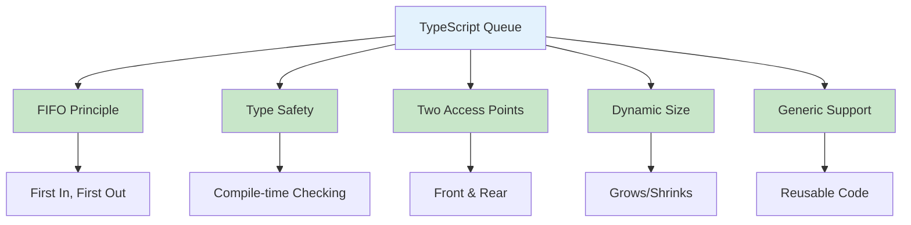
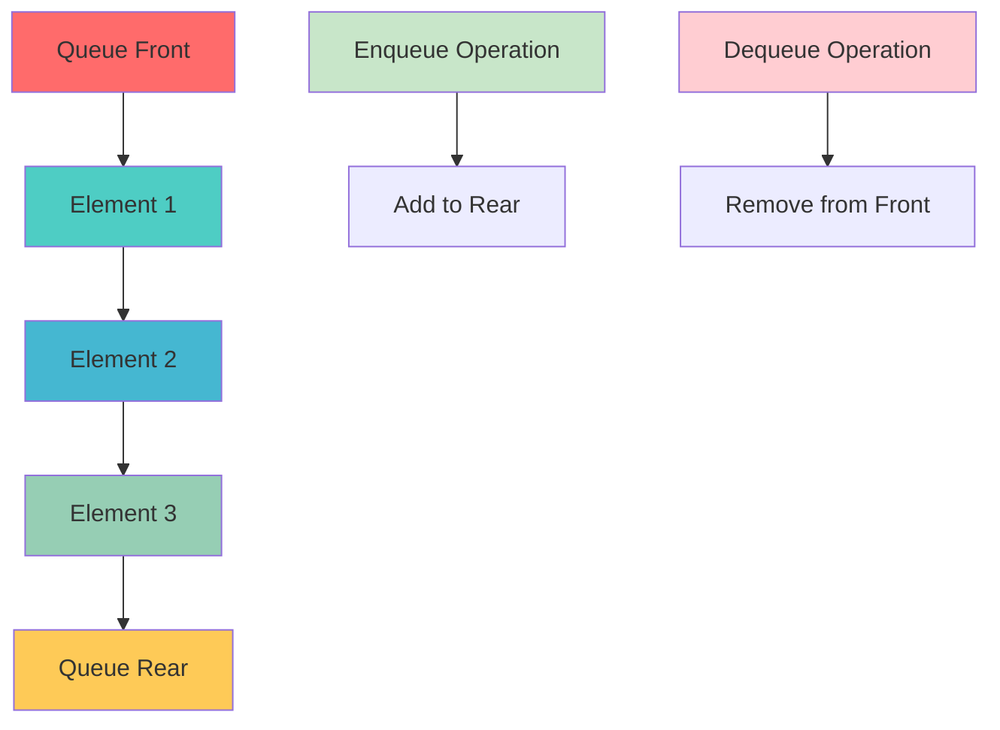
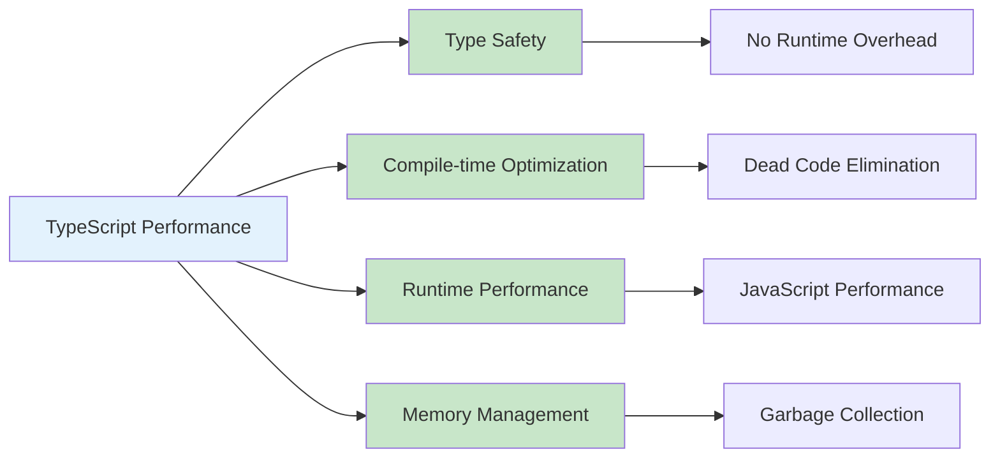
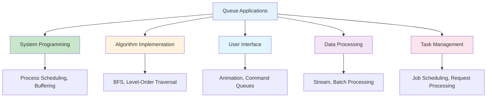
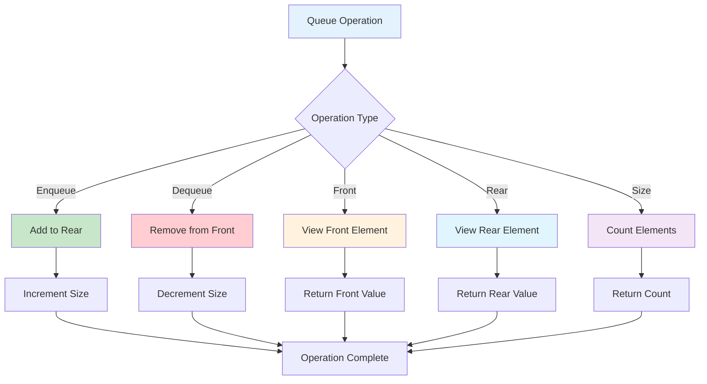
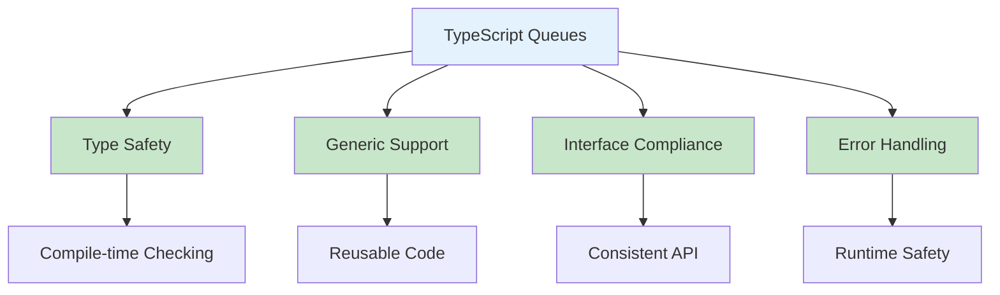
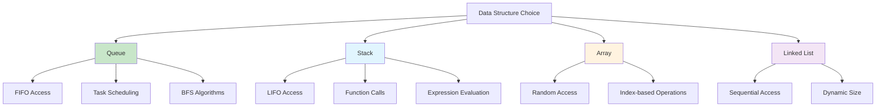

# Queues in TypeScript

## Table of Contents

1. [Introduction](#introduction)
2. [Queue Fundamentals](#queue-fundamentals)
3. [Implementation Methods](#implementation-methods)
4. [Queue Operations](#queue-operations)
5. [Advanced Queue Applications](#advanced-queue-applications)
6. [Performance Analysis](#performance-analysis)
7. [Use Cases and Applications](#use-cases-and-applications)
8. [Best Practices](#best-practices)
9. [Visual Representations](#visual-representations)

## Introduction

A queue is a linear data structure that follows the First In, First Out (FIFO) principle. Elements are added at the rear and removed from the front. In TypeScript, queues provide type safety, generic support, and powerful abstractions for managing data in a FIFO manner with compile-time type checking.

### Key Characteristics

- **FIFO Principle**: First element added is the first to be removed
- **Two Access Points**: Front for removal, rear for insertion
- **Dynamic Size**: Can grow and shrink as needed
- **Simple Operations**: Enqueue, dequeue, front, and isEmpty
- **Type Safety**: Compile-time type checking for elements



## Queue Fundamentals

### Basic Queue Implementation

```typescript
interface IQueue<T> {
  enqueue(item: T): void;
  dequeue(): T | undefined;
  front(): T | undefined;
  rear(): T | undefined;
  isEmpty(): boolean;
  size(): number;
  clear(): void;
  toArray(): T[];
}

class Queue<T> implements IQueue<T> {
  private items: T[] = [];

  enqueue(item: T): void {
    this.items.push(item);
  }

  dequeue(): T | undefined {
    if (this.isEmpty()) {
      return undefined;
    }
    return this.items.shift();
  }

  front(): T | undefined {
    if (this.isEmpty()) {
      return undefined;
    }
    return this.items[0];
  }

  rear(): T | undefined {
    if (this.isEmpty()) {
      return undefined;
    }
    return this.items[this.items.length - 1];
  }

  isEmpty(): boolean {
    return this.items.length === 0;
  }

  size(): number {
    return this.items.length;
  }

  clear(): void {
    this.items = [];
  }

  toArray(): T[] {
    return [...this.items];
  }

  toString(): string {
    return `Queue(${this.items.join(", ")})`;
  }
}
```

### Queue with Linked List Implementation

```typescript
interface QueueNode<T> {
  data: T;
  next: QueueNode<T> | null;
}

class QueueNode<T> implements QueueNode<T> {
  data: T;
  next: QueueNode<T> | null = null;

  constructor(data: T) {
    this.data = data;
  }
}

class LinkedQueue<T> implements IQueue<T> {
  private front: QueueNode<T> | null = null;
  private rear: QueueNode<T> | null = null;
  private size: number = 0;

  enqueue(data: T): void {
    const newNode = new QueueNode(data);

    if (this.isEmpty()) {
      this.front = newNode;
      this.rear = newNode;
    } else {
      this.rear!.next = newNode;
      this.rear = newNode;
    }
    this.size++;
  }

  dequeue(): T | undefined {
    if (this.isEmpty()) {
      return undefined;
    }

    const data = this.front!.data;
    this.front = this.front!.next;

    if (this.front === null) {
      this.rear = null;
    }
    this.size--;
    return data;
  }

  front(): T | undefined {
    if (this.isEmpty()) {
      return undefined;
    }
    return this.front!.data;
  }

  rear(): T | undefined {
    if (this.isEmpty()) {
      return undefined;
    }
    return this.rear!.data;
  }

  isEmpty(): boolean {
    return this.front === null;
  }

  size(): number {
    return this.size;
  }

  clear(): void {
    this.front = null;
    this.rear = null;
    this.size = 0;
  }

  toArray(): T[] {
    const result: T[] = [];
    let current = this.front;
    while (current) {
      result.push(current.data);
      current = current.next;
    }
    return result;
  }
}
```

### Queue Structure Visualization



## Implementation Methods

### 1. Circular Array Queue

```typescript
class CircularArrayQueue<T> implements IQueue<T> {
  private items: T[];
  private capacity: number;
  private frontIndex: number = 0;
  private rearIndex: number = -1;
  private count: number = 0;

  constructor(capacity: number = 10) {
    this.capacity = capacity;
    this.items = new Array(capacity);
  }

  enqueue(item: T): void {
    if (this.isFull()) {
      this.resize();
    }

    this.rearIndex = (this.rearIndex + 1) % this.capacity;
    this.items[this.rearIndex] = item;
    this.count++;
  }

  dequeue(): T | undefined {
    if (this.isEmpty()) {
      return undefined;
    }

    const item = this.items[this.frontIndex];
    this.items[this.frontIndex] = undefined as T;
    this.frontIndex = (this.frontIndex + 1) % this.capacity;
    this.count--;
    return item;
  }

  front(): T | undefined {
    if (this.isEmpty()) {
      return undefined;
    }
    return this.items[this.frontIndex];
  }

  rear(): T | undefined {
    if (this.isEmpty()) {
      return undefined;
    }
    return this.items[this.rearIndex];
  }

  isEmpty(): boolean {
    return this.count === 0;
  }

  isFull(): boolean {
    return this.count === this.capacity;
  }

  size(): number {
    return this.count;
  }

  clear(): void {
    this.items = new Array(this.capacity);
    this.frontIndex = 0;
    this.rearIndex = -1;
    this.count = 0;
  }

  toArray(): T[] {
    const result: T[] = [];
    for (let i = 0; i < this.count; i++) {
      const index = (this.frontIndex + i) % this.capacity;
      result.push(this.items[index]);
    }
    return result;
  }

  private resize(): void {
    const oldCapacity = this.capacity;
    this.capacity *= 2;
    const newItems = new Array(this.capacity);

    for (let i = 0; i < this.count; i++) {
      const oldIndex = (this.frontIndex + i) % oldCapacity;
      newItems[i] = this.items[oldIndex];
    }

    this.items = newItems;
    this.frontIndex = 0;
    this.rearIndex = this.count - 1;
  }
}
```

### 2. Bounded Queue

```typescript
class BoundedQueue<T> implements IQueue<T> {
  private items: T[] = [];
  private maxSize: number;

  constructor(maxSize: number) {
    this.maxSize = maxSize;
  }

  enqueue(item: T): void {
    if (this.isFull()) {
      throw new Error("Queue is full");
    }
    this.items.push(item);
  }

  dequeue(): T | undefined {
    if (this.isEmpty()) {
      return undefined;
    }
    return this.items.shift();
  }

  front(): T | undefined {
    if (this.isEmpty()) {
      return undefined;
    }
    return this.items[0];
  }

  rear(): T | undefined {
    if (this.isEmpty()) {
      return undefined;
    }
    return this.items[this.items.length - 1];
  }

  isEmpty(): boolean {
    return this.items.length === 0;
  }

  isFull(): boolean {
    return this.items.length === this.maxSize;
  }

  size(): number {
    return this.items.length;
  }

  clear(): void {
    this.items = [];
  }

  toArray(): T[] {
    return [...this.items];
  }
}
```

### 3. Priority Queue

```typescript
interface PriorityItem<T> {
  data: T;
  priority: number;
}

class PriorityQueue<T> implements IQueue<T> {
  private items: PriorityItem<T>[] = [];

  enqueue(item: T, priority: number = 0): void {
    const priorityItem: PriorityItem<T> = { data: item, priority };

    let added = false;
    for (let i = 0; i < this.items.length; i++) {
      if (priority > this.items[i].priority) {
        this.items.splice(i, 0, priorityItem);
        added = true;
        break;
      }
    }

    if (!added) {
      this.items.push(priorityItem);
    }
  }

  dequeue(): T | undefined {
    if (this.isEmpty()) {
      return undefined;
    }
    return this.items.shift()!.data;
  }

  front(): T | undefined {
    if (this.isEmpty()) {
      return undefined;
    }
    return this.items[0].data;
  }

  rear(): T | undefined {
    if (this.isEmpty()) {
      return undefined;
    }
    return this.items[this.items.length - 1].data;
  }

  isEmpty(): boolean {
    return this.items.length === 0;
  }

  size(): number {
    return this.items.length;
  }

  clear(): void {
    this.items = [];
  }

  toArray(): T[] {
    return this.items.map(item => item.data);
  }

  getPriorityArray(): PriorityItem<T>[] {
    return [...this.items];
  }
}
```

### 4. Deque (Double-Ended Queue)

```typescript
interface IDeque<T> extends IQueue<T> {
  addFront(item: T): void;
  addRear(item: T): void;
  removeFront(): T | undefined;
  removeRear(): T | undefined;
  peekFront(): T | undefined;
  peekRear(): T | undefined;
}

class Deque<T> implements IDeque<T> {
  private items: T[] = [];

  addFront(item: T): void {
    this.items.unshift(item);
  }

  addRear(item: T): void {
    this.items.push(item);
  }

  removeFront(): T | undefined {
    if (this.isEmpty()) {
      return undefined;
    }
    return this.items.shift();
  }

  removeRear(): T | undefined {
    if (this.isEmpty()) {
      return undefined;
    }
    return this.items.pop();
  }

  peekFront(): T | undefined {
    if (this.isEmpty()) {
      return undefined;
    }
    return this.items[0];
  }

  peekRear(): T | undefined {
    if (this.isEmpty()) {
      return undefined;
    }
    return this.items[this.items.length - 1];
  }

  // IQueue interface methods
  enqueue(item: T): void {
    this.addRear(item);
  }

  dequeue(): T | undefined {
    return this.removeFront();
  }

  front(): T | undefined {
    return this.peekFront();
  }

  rear(): T | undefined {
    return this.peekRear();
  }

  isEmpty(): boolean {
    return this.items.length === 0;
  }

  size(): number {
    return this.items.length;
  }

  clear(): void {
    this.items = [];
  }

  toArray(): T[] {
    return [...this.items];
  }
}
```

### Implementation Comparison

```mermaid
graph TD
    A[Queue Implementations] --> B[Array-Based]
    A --> C[Linked List]
    A --> D[Circular Array]
    A --> E[Priority Queue]
    A --> F[Deque]

    B --> G[Simple Implementation]
    B --> H[O(n) Dequeue]

    C --> I[Dynamic Size]
    C --> J[O(1) Operations]

    D --> K[Efficient Memory]
    D --> L[Fixed Capacity]

    E --> M[Priority Ordering]
    E --> N[O(n) Insertion]

    F --> O[Double-Ended]
    F --> P[Versatile Operations]

    style A fill:#e3f2fd
    style B fill:#c8e6c9
    style C fill:#fff3e0
    style D fill:#e1f5fe
    style E fill:#f3e5f5
    style F fill:#fce4ec
```

## Queue Operations

### Basic Operations

```typescript
class QueueOperations<T> {
  static reverseQueue<T>(queue: IQueue<T>): void {
    if (queue.isEmpty()) {
      return;
    }

    const tempArray: T[] = [];
    while (!queue.isEmpty()) {
      tempArray.push(queue.dequeue()!);
    }

    for (const item of tempArray) {
      queue.enqueue(item);
    }
  }

  static findMiddle<T>(queue: IQueue<T>): T | undefined {
    if (queue.isEmpty()) {
      return undefined;
    }

    const tempArray: T[] = [];
    const size = queue.size();
    const middleIndex = Math.floor(size / 2);

    // Dequeue elements until we reach the middle
    for (let i = 0; i < middleIndex; i++) {
      tempArray.push(queue.dequeue()!);
    }

    const middleElement = queue.front();

    // Restore the queue
    for (const item of tempArray) {
      queue.enqueue(item);
    }

    return middleElement;
  }

  static mergeQueues<T>(queue1: IQueue<T>, queue2: IQueue<T>): IQueue<T> {
    const result = new Queue<T>();
    const tempArray: T[] = [];

    // Collect all elements from both queues
    while (!queue1.isEmpty()) {
      tempArray.push(queue1.dequeue()!);
    }
    while (!queue2.isEmpty()) {
      tempArray.push(queue2.dequeue()!);
    }

    // Enqueue elements in order
    for (const item of tempArray) {
      result.enqueue(item);
    }

    return result;
  }

  static interleaveQueues<T>(queue1: IQueue<T>, queue2: IQueue<T>): IQueue<T> {
    const result = new Queue<T>();
    const tempArray1: T[] = [];
    const tempArray2: T[] = [];

    // Collect elements from both queues
    while (!queue1.isEmpty()) {
      tempArray1.push(queue1.dequeue()!);
    }
    while (!queue2.isEmpty()) {
      tempArray2.push(queue2.dequeue()!);
    }

    // Interleave elements
    const maxLength = Math.max(tempArray1.length, tempArray2.length);
    for (let i = 0; i < maxLength; i++) {
      if (i < tempArray1.length) {
        result.enqueue(tempArray1[i]);
      }
      if (i < tempArray2.length) {
        result.enqueue(tempArray2[i]);
      }
    }

    return result;
  }
}
```

### Advanced Operations

```typescript
class AdvancedQueueOperations {
  static generateBinaryNumbers(n: number): string[] {
    const queue = new Queue<string>();
    const result: string[] = [];

    queue.enqueue("1");

    for (let i = 0; i < n; i++) {
      const binary = queue.dequeue()!;
      result.push(binary);

      queue.enqueue(binary + "0");
      queue.enqueue(binary + "1");
    }

    return result;
  }

  static slidingWindowMaximum(arr: number[], k: number): number[] {
    const queue = new Queue<number>();
    const result: number[] = [];

    // Process first window
    for (let i = 0; i < k; i++) {
      while (!queue.isEmpty() && arr[queue.rear()!] <= arr[i]) {
        queue.dequeue();
      }
      queue.enqueue(i);
    }

    result.push(arr[queue.front()!]);

    // Process remaining windows
    for (let i = k; i < arr.length; i++) {
      // Remove elements outside current window
      while (!queue.isEmpty() && queue.front()! <= i - k) {
        queue.dequeue();
      }

      // Remove elements smaller than current element
      while (!queue.isEmpty() && arr[queue.rear()!] <= arr[i]) {
        queue.dequeue();
      }

      queue.enqueue(i);
      result.push(arr[queue.front()!]);
    }

    return result;
  }

  static taskScheduler(tasks: string[], n: number): number {
    const taskCount: { [key: string]: number } = {};
    for (const task of tasks) {
      taskCount[task] = (taskCount[task] || 0) + 1;
    }

    const maxCount = Math.max(...Object.values(taskCount));
    const maxCountTasks = Object.values(taskCount).filter(count => count === maxCount).length;

    return Math.max(tasks.length, (maxCount - 1) * (n + 1) + maxCountTasks);
  }
}
```

## Advanced Queue Applications

### 1. Task Scheduler

```typescript
interface Task {
  id: string;
  name: string;
  priority: number;
  duration: number;
  dependencies: string[];
}

class TaskScheduler {
  private taskQueue: PriorityQueue<Task> = new PriorityQueue();
  private completedTasks: Set<string> = new Set();
  private runningTasks: Map<string, Task> = new Map();

  addTask(task: Task): void {
    this.taskQueue.enqueue(task, task.priority);
  }

  executeNextTask(): Task | null {
    if (this.taskQueue.isEmpty()) {
      return null;
    }

    const task = this.taskQueue.dequeue();
    if (!task) {
      return null;
    }

    // Check if all dependencies are completed
    const allDependenciesCompleted = task.dependencies.every(dep => this.completedTasks.has(dep));

    if (!allDependenciesCompleted) {
      // Re-queue the task
      this.taskQueue.enqueue(task, task.priority);
      return null;
    }

    this.runningTasks.set(task.id, task);
    return task;
  }

  completeTask(taskId: string): void {
    this.runningTasks.delete(taskId);
    this.completedTasks.add(taskId);
  }

  getQueueStatus(): { queued: number; running: number; completed: number } {
    return {
      queued: this.taskQueue.size(),
      running: this.runningTasks.size,
      completed: this.completedTasks.size,
    };
  }
}
```

### 2. Breadth-First Search

```typescript
interface GraphNode {
  id: string;
  neighbors: string[];
  visited: boolean;
}

class BFS {
  static traverse(graph: Map<string, GraphNode>, startNodeId: string): string[] {
    const queue = new Queue<string>();
    const visited: string[] = [];
    const startNode = graph.get(startNodeId);

    if (!startNode) {
      return visited;
    }

    queue.enqueue(startNodeId);
    startNode.visited = true;

    while (!queue.isEmpty()) {
      const currentNodeId = queue.dequeue()!;
      visited.push(currentNodeId);

      const currentNode = graph.get(currentNodeId);
      if (!currentNode) continue;

      for (const neighborId of currentNode.neighbors) {
        const neighbor = graph.get(neighborId);
        if (neighbor && !neighbor.visited) {
          neighbor.visited = true;
          queue.enqueue(neighborId);
        }
      }
    }

    return visited;
  }

  static findShortestPath(graph: Map<string, GraphNode>, startNodeId: string, endNodeId: string): string[] {
    const queue = new Queue<{ nodeId: string; path: string[] }>();
    const visited = new Set<string>();

    queue.enqueue({ nodeId: startNodeId, path: [startNodeId] });
    visited.add(startNodeId);

    while (!queue.isEmpty()) {
      const { nodeId, path } = queue.dequeue()!;

      if (nodeId === endNodeId) {
        return path;
      }

      const node = graph.get(nodeId);
      if (!node) continue;

      for (const neighborId of node.neighbors) {
        if (!visited.has(neighborId)) {
          visited.add(neighborId);
          queue.enqueue({
            nodeId: neighborId,
            path: [...path, neighborId],
          });
        }
      }
    }

    return []; // No path found
  }
}
```

### 3. Event System

```typescript
interface Event {
  id: string;
  type: string;
  data: any;
  timestamp: number;
  priority: number;
}

interface EventHandler {
  (event: Event): void;
}

class EventSystem {
  private eventQueue: PriorityQueue<Event> = new PriorityQueue();
  private handlers: Map<string, EventHandler[]> = new Map();
  private isProcessing: boolean = false;

  subscribe(eventType: string, handler: EventHandler): void {
    if (!this.handlers.has(eventType)) {
      this.handlers.set(eventType, []);
    }
    this.handlers.get(eventType)!.push(handler);
  }

  unsubscribe(eventType: string, handler: EventHandler): void {
    const handlers = this.handlers.get(eventType);
    if (handlers) {
      const index = handlers.indexOf(handler);
      if (index > -1) {
        handlers.splice(index, 1);
      }
    }
  }

  emit(event: Event): void {
    this.eventQueue.enqueue(event, event.priority);
    this.processEvents();
  }

  private async processEvents(): Promise<void> {
    if (this.isProcessing) {
      return;
    }

    this.isProcessing = true;

    while (!this.eventQueue.isEmpty()) {
      const event = this.eventQueue.dequeue();
      if (!event) break;

      const handlers = this.handlers.get(event.type);
      if (handlers) {
        for (const handler of handlers) {
          try {
            handler(event);
          } catch (error) {
            console.error(`Error handling event ${event.id}:`, error);
          }
        }
      }
    }

    this.isProcessing = false;
  }

  getQueueSize(): number {
    return this.eventQueue.size();
  }
}
```

## Performance Analysis

### Time Complexity

| Operation | Time Complexity | Description               |
| --------- | --------------- | ------------------------- |
| Enqueue   | O(1)            | Add element to rear       |
| Dequeue   | O(1)            | Remove element from front |
| Front     | O(1)            | Access front element      |
| Rear      | O(1)            | Access rear element       |
| Size      | O(1)            | Count elements            |
| IsEmpty   | O(1)            | Check if empty            |

### Space Complexity

| Aspect    | Space Complexity | Description                     |
| --------- | ---------------- | ------------------------------- |
| Storage   | O(n)             | n elements stored               |
| Auxiliary | O(1)             | Constant extra space            |
| Recursion | O(n)             | Queue depth for recursive calls |

### TypeScript-Specific Performance



## Use Cases and Applications

### 1. Task Management

- **Job Scheduling**: Managing background tasks and processes
- **Request Processing**: Handling HTTP requests in order
- **Message Queuing**: Processing messages in sequence

### 2. Algorithm Implementation

- **Breadth-First Search**: Graph traversal algorithms
- **Level-Order Traversal**: Tree traversal algorithms
- **Sliding Window**: Array processing techniques

### 3. System Programming

- **Process Scheduling**: Operating system task management
- **Buffer Management**: Data streaming and buffering
- **Event Handling**: Asynchronous event processing

### 4. User Interface

- **Animation Queues**: Managing UI animations
- **Command Queues**: Undo/redo functionality
- **Input Processing**: Handling user input events

### 5. Data Processing

- **Stream Processing**: Real-time data processing
- **Batch Processing**: Processing data in batches
- **Pipeline Processing**: Multi-stage data processing

### Application Areas



## Best Practices

### 1. Type Safety

```typescript
// Use generic types for flexibility
class GenericQueue<T> {
  private items: T[] = [];

  enqueue(item: T): void {
    this.items.push(item);
  }

  dequeue(): T | undefined {
    return this.items.shift();
  }

  front(): T | undefined {
    return this.items[0];
  }
}

// Use type guards for runtime safety
function isStringQueue(queue: IQueue<any>): queue is IQueue<string> {
  return queue.front() === undefined || typeof queue.front() === "string";
}

// Use branded types for queue safety
type QueueId = string & { readonly brand: unique symbol };
type QueueData = string & { readonly brand: unique symbol };

class TypedQueue {
  private data: Map<QueueId, IQueue<QueueData>> = new Map();

  createQueue(id: QueueId): void {
    this.data.set(id, new Queue<QueueData>());
  }

  enqueueToQueue(id: QueueId, data: QueueData): void {
    const queue = this.data.get(id);
    if (queue) {
      queue.enqueue(data);
    }
  }
}
```

### 2. Error Handling

```typescript
class SafeQueue<T> {
  private items: T[] = [];

  enqueue(item: T): boolean {
    try {
      this.items.push(item);
      return true;
    } catch (error) {
      console.error("Error enqueuing item:", error);
      return false;
    }
  }

  dequeue(): T | null {
    try {
      if (this.isEmpty()) {
        return null;
      }
      return this.items.shift()!;
    } catch (error) {
      console.error("Error dequeuing item:", error);
      return null;
    }
  }

  front(): T | null {
    try {
      if (this.isEmpty()) {
        return null;
      }
      return this.items[0];
    } catch (error) {
      console.error("Error getting front item:", error);
      return null;
    }
  }

  isEmpty(): boolean {
    return this.items.length === 0;
  }
}
```

### 3. Memory Management

```typescript
class MemoryEfficientQueue<T> {
  private items: T[] = [];
  private maxSize: number;

  constructor(maxSize: number = 1000) {
    this.maxSize = maxSize;
  }

  enqueue(item: T): void {
    if (this.items.length >= this.maxSize) {
      // Remove oldest item (front of queue)
      this.items.shift();
    }
    this.items.push(item);
  }

  clear(): void {
    this.items = [];
  }

  trimToSize(size: number): void {
    if (this.items.length > size) {
      this.items = this.items.slice(-size);
    }
  }

  getMemoryUsage(): number {
    return this.items.length;
  }
}
```

### 4. Validation

```typescript
class ValidatedQueue<T> {
  private items: T[] = [];
  private validator?: (item: T) => boolean;

  constructor(validator?: (item: T) => boolean) {
    this.validator = validator;
  }

  enqueue(item: T): boolean {
    if (this.validator && !this.validator(item)) {
      throw new Error(`Invalid item: ${item}`);
    }
    this.items.push(item);
    return true;
  }

  isValid(): boolean {
    if (!this.validator) {
      return true;
    }

    for (const item of this.items) {
      if (!this.validator(item)) {
        return false;
      }
    }
    return true;
  }

  validateAll(): T[] {
    if (!this.validator) {
      return this.items;
    }

    return this.items.filter(item => this.validator!(item));
  }
}
```

## Visual Representations

### Queue Operations Flow



### TypeScript Queue Features



### Queue vs Other Structures



## Conclusion

Queues in TypeScript provide powerful abstractions for FIFO data management with type safety, performance, and rich functionality. The combination of TypeScript's type system and queue data structures enables robust, maintainable code for managing data in a First In, First Out manner.

Key advantages of TypeScript queues:

- **Type Safety**: Compile-time type checking prevents runtime errors
- **Performance**: O(1) time complexity for basic operations
- **Generic Support**: Reusable code with type parameters
- **Rich API**: Extensive built-in methods and operations
- **Interface Compliance**: Consistent API across implementations

Queues excel in scenarios requiring:

- Task scheduling and job management
- Breadth-first search algorithms
- Event processing and message queuing
- Buffer management and streaming
- Level-order traversal of trees

Understanding queue operations, implementation methods, and performance characteristics is crucial for building efficient applications. The choice between different queue implementations depends on specific requirements:

- **Array-based**: Simple implementation, O(n) dequeue
- **Linked List**: Dynamic size, O(1) operations
- **Circular Array**: Efficient memory, fixed capacity
- **Priority Queue**: Priority ordering, O(n) insertion
- **Deque**: Double-ended, versatile operations

The key to effective TypeScript queue usage lies in leveraging the type system for safety, understanding performance implications, and following best practices for memory management and error handling.

TypeScript's queue implementation provides an excellent foundation for building robust applications with compile-time safety and runtime performance, making it an ideal choice for modern web development and system programming.
