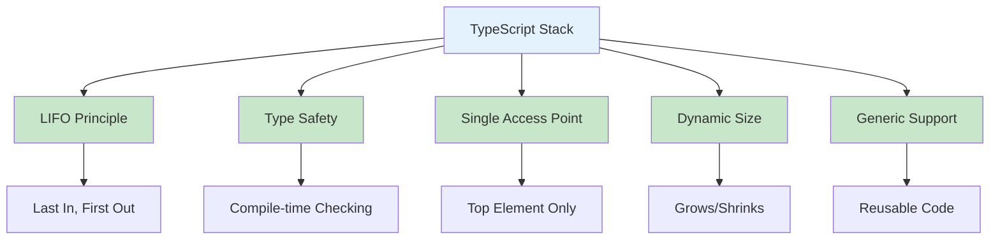
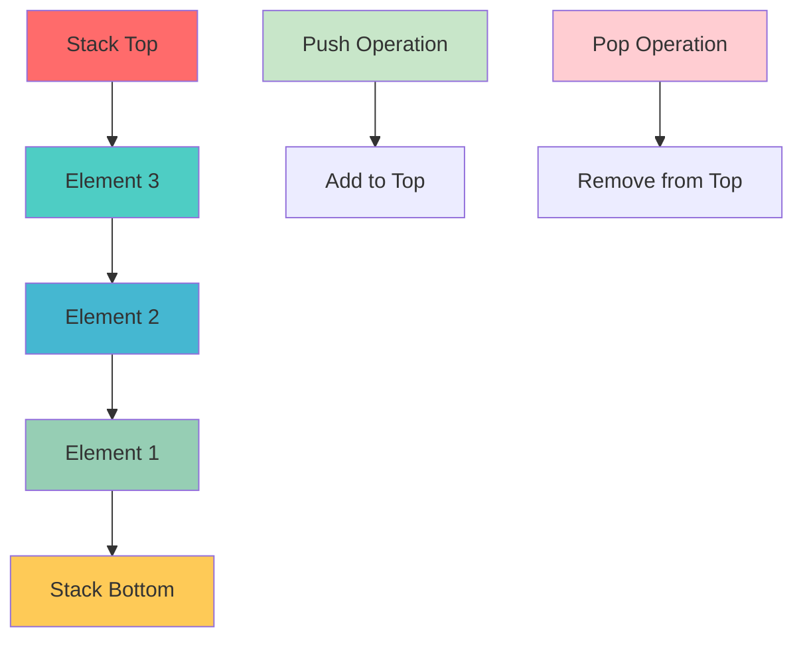
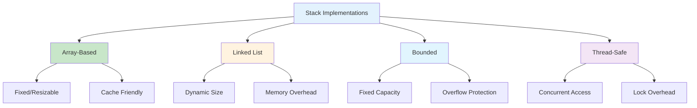
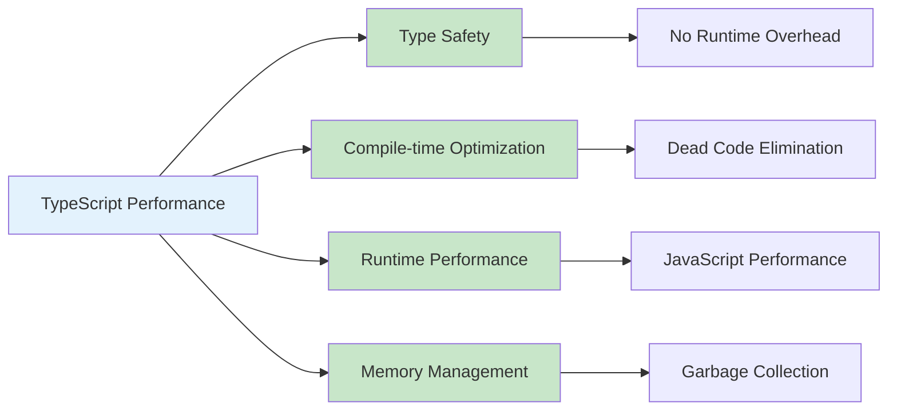
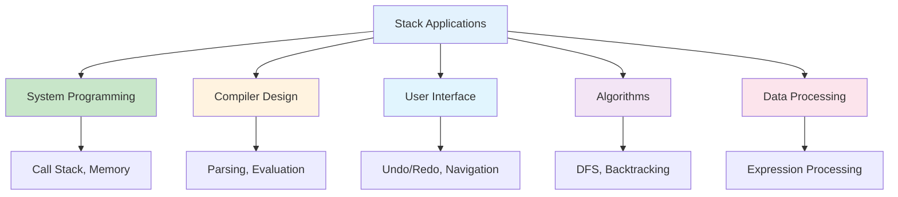
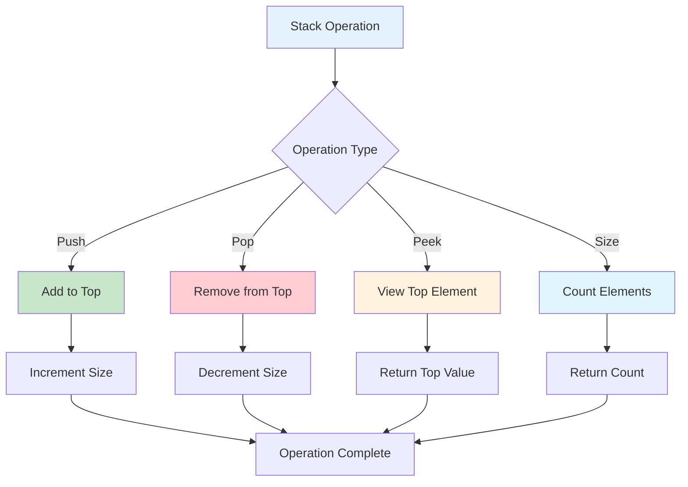
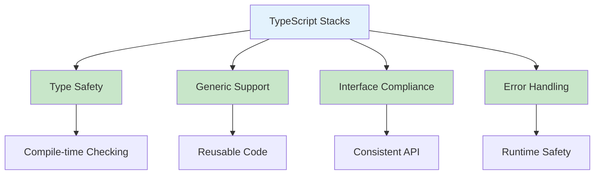
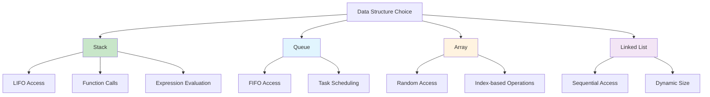

# Stacks in TypeScript

## Table of Contents

1. [Introduction](#introduction)
2. [Stack Fundamentals](#stack-fundamentals)
3. [Implementation Methods](#implementation-methods)
4. [Stack Operations](#stack-operations)
5. [Advanced Stack Applications](#advanced-stack-applications)
6. [Performance Analysis](#performance-analysis)
7. [Use Cases and Applications](#use-cases-and-applications)
8. [Best Practices](#best-practices)
9. [Visual Representations](#visual-representations)

## Introduction

A stack is a linear data structure that follows the Last In, First Out (LIFO) principle. Elements are added and removed from the same end, called the "top" of the stack. In TypeScript, stacks provide type safety, generic support, and powerful abstractions for managing data in a LIFO manner with compile-time type checking.

### Key Characteristics

- **LIFO Principle**: Last element added is the first to be removed
- **Single Access Point**: Only the top element is accessible
- **Dynamic Size**: Can grow and shrink as needed
- **Simple Operations**: Push, pop, peek, and isEmpty
- **Type Safety**: Compile-time type checking for elements



## Stack Fundamentals

### Basic Stack Implementation

```typescript
interface IStack<T> {
  push(item: T): void;
  pop(): T | undefined;
  peek(): T | undefined;
  isEmpty(): boolean;
  size(): number;
  clear(): void;
  toArray(): T[];
}

class Stack<T> implements IStack<T> {
  private items: T[] = [];

  push(item: T): void {
    this.items.push(item);
  }

  pop(): T | undefined {
    if (this.isEmpty()) {
      return undefined;
    }
    return this.items.pop();
  }

  peek(): T | undefined {
    if (this.isEmpty()) {
      return undefined;
    }
    return this.items[this.items.length - 1];
  }

  isEmpty(): boolean {
    return this.items.length === 0;
  }

  size(): number {
    return this.items.length;
  }

  clear(): void {
    this.items = [];
  }

  toArray(): T[] {
    return [...this.items];
  }

  toString(): string {
    return `Stack(${this.items.join(", ")})`;
  }
}
```

### Stack with Linked List Implementation

```typescript
interface StackNode<T> {
  data: T;
  next: StackNode<T> | null;
}

class StackNode<T> implements StackNode<T> {
  data: T;
  next: StackNode<T> | null = null;

  constructor(data: T) {
    this.data = data;
  }
}

class LinkedStack<T> implements IStack<T> {
  private top: StackNode<T> | null = null;
  private size: number = 0;

  push(data: T): void {
    const newNode = new StackNode(data);
    newNode.next = this.top;
    this.top = newNode;
    this.size++;
  }

  pop(): T | undefined {
    if (this.isEmpty()) {
      return undefined;
    }

    const data = this.top!.data;
    this.top = this.top!.next;
    this.size--;
    return data;
  }

  peek(): T | undefined {
    if (this.isEmpty()) {
      return undefined;
    }
    return this.top!.data;
  }

  isEmpty(): boolean {
    return this.top === null;
  }

  size(): number {
    return this.size;
  }

  clear(): void {
    this.top = null;
    this.size = 0;
  }

  toArray(): T[] {
    const result: T[] = [];
    let current = this.top;
    while (current) {
      result.push(current.data);
      current = current.next;
    }
    return result;
  }
}
```

### Stack Structure Visualization



## Implementation Methods

### 1. Array-Based Stack

```typescript
class ArrayStack<T> implements IStack<T> {
  private items: T[];
  private capacity: number;
  private topIndex: number = -1;

  constructor(capacity: number = 10) {
    this.capacity = capacity;
    this.items = new Array(capacity);
  }

  push(item: T): void {
    if (this.isFull()) {
      this.resize();
    }

    this.topIndex++;
    this.items[this.topIndex] = item;
  }

  pop(): T | undefined {
    if (this.isEmpty()) {
      return undefined;
    }

    const item = this.items[this.topIndex];
    this.items[this.topIndex] = undefined as T;
    this.topIndex--;
    return item;
  }

  peek(): T | undefined {
    if (this.isEmpty()) {
      return undefined;
    }
    return this.items[this.topIndex];
  }

  isEmpty(): boolean {
    return this.topIndex === -1;
  }

  isFull(): boolean {
    return this.topIndex === this.capacity - 1;
  }

  size(): number {
    return this.topIndex + 1;
  }

  clear(): void {
    this.items = new Array(this.capacity);
    this.topIndex = -1;
  }

  toArray(): T[] {
    return this.items.slice(0, this.topIndex + 1);
  }

  private resize(): void {
    const oldCapacity = this.capacity;
    this.capacity *= 2;
    const newItems = new Array(this.capacity);

    for (let i = 0; i < oldCapacity; i++) {
      newItems[i] = this.items[i];
    }

    this.items = newItems;
  }
}
```

### 2. Bounded Stack

```typescript
class BoundedStack<T> implements IStack<T> {
  private items: T[] = [];
  private maxSize: number;

  constructor(maxSize: number) {
    this.maxSize = maxSize;
  }

  push(item: T): void {
    if (this.isFull()) {
      throw new Error("Stack is full");
    }
    this.items.push(item);
  }

  pop(): T | undefined {
    if (this.isEmpty()) {
      return undefined;
    }
    return this.items.pop();
  }

  peek(): T | undefined {
    if (this.isEmpty()) {
      return undefined;
    }
    return this.items[this.items.length - 1];
  }

  isEmpty(): boolean {
    return this.items.length === 0;
  }

  isFull(): boolean {
    return this.items.length === this.maxSize;
  }

  size(): number {
    return this.items.length;
  }

  clear(): void {
    this.items = [];
  }

  toArray(): T[] {
    return [...this.items];
  }
}
```

### 3. Thread-Safe Stack

```typescript
class ThreadSafeStack<T> implements IStack<T> {
  private items: T[] = [];
  private lock: boolean = false;

  private async acquireLock(): Promise<void> {
    while (this.lock) {
      await new Promise(resolve => setTimeout(resolve, 1));
    }
    this.lock = true;
  }

  private releaseLock(): void {
    this.lock = false;
  }

  async push(item: T): Promise<void> {
    await this.acquireLock();
    try {
      this.items.push(item);
    } finally {
      this.releaseLock();
    }
  }

  async pop(): Promise<T | undefined> {
    await this.acquireLock();
    try {
      if (this.isEmpty()) {
        return undefined;
      }
      return this.items.pop();
    } finally {
      this.releaseLock();
    }
  }

  async peek(): Promise<T | undefined> {
    await this.acquireLock();
    try {
      if (this.isEmpty()) {
        return undefined;
      }
      return this.items[this.items.length - 1];
    } finally {
      this.releaseLock();
    }
  }

  isEmpty(): boolean {
    return this.items.length === 0;
  }

  size(): number {
    return this.items.length;
  }

  clear(): void {
    this.items = [];
  }

  toArray(): T[] {
    return [...this.items];
  }
}
```

### Implementation Comparison



## Stack Operations

### Basic Operations

```typescript
class StackOperations<T> {
  static reverseStack<T>(stack: IStack<T>): void {
    if (stack.isEmpty()) {
      return;
    }

    const tempArray: T[] = [];
    while (!stack.isEmpty()) {
      tempArray.push(stack.pop()!);
    }

    for (const item of tempArray) {
      stack.push(item);
    }
  }

  static sortStack<T>(stack: IStack<T>, compareFn?: (a: T, b: T) => number): void {
    const tempStack = new Stack<T>();
    const compare =
      compareFn ||
      ((a: T, b: T) => {
        if (a < b) return -1;
        if (a > b) return 1;
        return 0;
      });

    while (!stack.isEmpty()) {
      const temp = stack.pop()!;

      while (!tempStack.isEmpty() && compare(tempStack.peek()!, temp) > 0) {
        stack.push(tempStack.pop()!);
      }

      tempStack.push(temp);
    }

    // Copy back to original stack
    while (!tempStack.isEmpty()) {
      stack.push(tempStack.pop()!);
    }
  }

  static findMiddle<T>(stack: IStack<T>): T | undefined {
    if (stack.isEmpty()) {
      return undefined;
    }

    const tempArray: T[] = [];
    const size = stack.size();
    const middleIndex = Math.floor(size / 2);

    // Pop elements until we reach the middle
    for (let i = 0; i < middleIndex; i++) {
      tempArray.push(stack.pop()!);
    }

    const middleElement = stack.peek();

    // Restore the stack
    for (let i = tempArray.length - 1; i >= 0; i--) {
      stack.push(tempArray[i]);
    }

    return middleElement;
  }

  static mergeStacks<T>(stack1: IStack<T>, stack2: IStack<T>): IStack<T> {
    const result = new Stack<T>();
    const tempArray: T[] = [];

    // Collect all elements from both stacks
    while (!stack1.isEmpty()) {
      tempArray.push(stack1.pop()!);
    }
    while (!stack2.isEmpty()) {
      tempArray.push(stack2.pop()!);
    }

    // Push elements in reverse order to maintain original order
    for (let i = tempArray.length - 1; i >= 0; i--) {
      result.push(tempArray[i]);
    }

    return result;
  }
}
```

### Advanced Operations

```typescript
class AdvancedStackOperations {
  static evaluatePostfix(expression: string): number {
    const stack = new Stack<number>();
    const operators = new Set(["+", "-", "*", "/", "^"]);

    const tokens = expression.split(" ");

    for (const token of tokens) {
      if (operators.has(token)) {
        if (stack.size() < 2) {
          throw new Error("Invalid expression");
        }

        const b = stack.pop()!;
        const a = stack.pop()!;

        let result: number;
        switch (token) {
          case "+":
            result = a + b;
            break;
          case "-":
            result = a - b;
            break;
          case "*":
            result = a * b;
            break;
          case "/":
            if (b === 0) {
              throw new Error("Division by zero");
            }
            result = a / b;
            break;
          case "^":
            result = Math.pow(a, b);
            break;
          default:
            throw new Error(`Unknown operator: ${token}`);
        }

        stack.push(result);
      } else {
        const num = parseFloat(token);
        if (isNaN(num)) {
          throw new Error(`Invalid token: ${token}`);
        }
        stack.push(num);
      }
    }

    if (stack.size() !== 1) {
      throw new Error("Invalid expression");
    }

    return stack.pop()!;
  }

  static infixToPostfix(expression: string): string {
    const stack = new Stack<string>();
    const output: string[] = [];
    const precedence: { [key: string]: number } = {
      "+": 1,
      "-": 1,
      "*": 2,
      "/": 2,
      "^": 3,
    };
    const operators = new Set(Object.keys(precedence));

    const tokens = expression.split(" ");

    for (const token of tokens) {
      if (token.match(/[a-zA-Z0-9]/)) {
        output.push(token);
      } else if (token === "(") {
        stack.push(token);
      } else if (token === ")") {
        while (!stack.isEmpty() && stack.peek() !== "(") {
          output.push(stack.pop()!);
        }
        if (!stack.isEmpty()) {
          stack.pop(); // Remove '('
        }
      } else if (operators.has(token)) {
        while (!stack.isEmpty() && stack.peek() !== "(" && precedence[stack.peek()!] >= precedence[token]) {
          output.push(stack.pop()!);
        }
        stack.push(token);
      }
    }

    while (!stack.isEmpty()) {
      output.push(stack.pop()!);
    }

    return output.join(" ");
  }

  static generateBinaryNumbers(n: number): string[] {
    const stack = new Stack<string>();
    const result: string[] = [];

    stack.push("1");

    for (let i = 0; i < n; i++) {
      const binary = stack.pop()!;
      result.push(binary);

      stack.push(binary + "0");
      stack.push(binary + "1");
    }

    return result;
  }
}
```

## Advanced Stack Applications

### 1. Expression Evaluation

```typescript
class ExpressionEvaluator {
  private operators: { [key: string]: (a: number, b: number) => number } = {
    "+": (a, b) => a + b,
    "-": (a, b) => a - b,
    "*": (a, b) => a * b,
    "/": (a, b) => a / b,
    "^": (a, b) => Math.pow(a, b),
  };

  private precedence: { [key: string]: number } = {
    "+": 1,
    "-": 1,
    "*": 2,
    "/": 2,
    "^": 3,
  };

  evaluateInfix(expression: string): number {
    const values = new Stack<number>();
    const operators = new Stack<string>();

    let i = 0;
    while (i < expression.length) {
      const char = expression[i];

      if (char === " ") {
        i++;
        continue;
      } else if (char === "(") {
        operators.push(char);
      } else if (char.match(/\d/)) {
        let num = 0;
        while (i < expression.length && expression[i].match(/\d/)) {
          num = num * 10 + parseInt(expression[i]);
          i++;
        }
        values.push(num);
        continue;
      } else if (char === ")") {
        while (!operators.isEmpty() && operators.peek() !== "(") {
          this.applyOperator(values, operators);
        }
        operators.pop(); // Remove '('
      } else if (char in this.operators) {
        while (
          !operators.isEmpty() &&
          operators.peek() !== "(" &&
          this.precedence[operators.peek()!] >= this.precedence[char]
        ) {
          this.applyOperator(values, operators);
        }
        operators.push(char);
      }

      i++;
    }

    while (!operators.isEmpty()) {
      this.applyOperator(values, operators);
    }

    return values.pop()!;
  }

  private applyOperator(values: IStack<number>, operators: IStack<string>): void {
    if (values.size() < 2) {
      throw new Error("Invalid expression");
    }

    const b = values.pop()!;
    const a = values.pop()!;
    const op = operators.pop()!;

    if (!(op in this.operators)) {
      throw new Error(`Unknown operator: ${op}`);
    }

    const result = this.operators[op](a, b);
    values.push(result);
  }
}
```

### 2. Balanced Parentheses Checker

```typescript
class ParenthesesChecker {
  static isBalanced(expression: string): boolean {
    const stack = new Stack<string>();
    const opening = new Set(["(", "[", "{"]);
    const closing = new Set([")", "]", "}"]);
    const pairs: { [key: string]: string } = {
      "(": ")",
      "[": "]",
      "{": "}",
    };

    for (const char of expression) {
      if (opening.has(char)) {
        stack.push(char);
      } else if (closing.has(char)) {
        if (stack.isEmpty()) {
          return false;
        }

        const top = stack.pop()!;
        if (pairs[top] !== char) {
          return false;
        }
      }
    }

    return stack.isEmpty();
  }

  static findUnbalancedPosition(expression: string): number {
    const stack = new Stack<{ char: string; position: number }>();
    const opening = new Set(["(", "[", "{"]);
    const closing = new Set([")", "]", "}"]);
    const pairs: { [key: string]: string } = {
      "(": ")",
      "[": "]",
      "{": "}",
    };

    for (let i = 0; i < expression.length; i++) {
      const char = expression[i];

      if (opening.has(char)) {
        stack.push({ char, position: i });
      } else if (closing.has(char)) {
        if (stack.isEmpty()) {
          return i;
        }

        const top = stack.pop()!;
        if (pairs[top.char] !== char) {
          return i;
        }
      }
    }

    if (!stack.isEmpty()) {
      return stack.pop()!.position;
    }

    return -1; // Balanced
  }
}
```

### 3. Undo/Redo System

```typescript
interface Command<T> {
  execute(): T;
  undo(): void;
}

class UndoRedoSystem<T> {
  private undoStack: IStack<Command<T>> = new Stack();
  private redoStack: IStack<Command<T>> = new Stack();
  private currentState: T | null = null;

  executeCommand(command: Command<T>): void {
    if (this.currentState !== null) {
      this.undoStack.push(command);
    }

    // Execute command
    this.currentState = command.execute();

    // Clear redo stack
    this.redoStack.clear();
  }

  undo(): boolean {
    if (this.undoStack.isEmpty()) {
      return false;
    }

    if (this.currentState !== null) {
      this.redoStack.push(this.undoStack.peek()!);
    }

    const command = this.undoStack.pop()!;
    command.undo();
    return true;
  }

  redo(): boolean {
    if (this.redoStack.isEmpty()) {
      return false;
    }

    if (this.currentState !== null) {
      this.undoStack.push(this.redoStack.peek()!);
    }

    const command = this.redoStack.pop()!;
    this.currentState = command.execute();
    return true;
  }

  canUndo(): boolean {
    return !this.undoStack.isEmpty();
  }

  canRedo(): boolean {
    return !this.redoStack.isEmpty();
  }

  getCurrentState(): T | null {
    return this.currentState;
  }
}
```

## Performance Analysis

### Time Complexity

| Operation | Time Complexity | Description             |
| --------- | --------------- | ----------------------- |
| Push      | O(1)            | Add element to top      |
| Pop       | O(1)            | Remove element from top |
| Peek      | O(1)            | Access top element      |
| Size      | O(1)            | Count elements          |
| IsEmpty   | O(1)            | Check if empty          |

### Space Complexity

| Aspect    | Space Complexity | Description                     |
| --------- | ---------------- | ------------------------------- |
| Storage   | O(n)             | n elements stored               |
| Auxiliary | O(1)             | Constant extra space            |
| Recursion | O(n)             | Stack depth for recursive calls |

### TypeScript-Specific Performance



## Use Cases and Applications

### 1. Function Call Management

- **Call Stack**: Managing function calls and returns
- **Recursion**: Implementing recursive algorithms
- **Exception Handling**: Stack unwinding during exceptions

### 2. Expression Processing

- **Infix to Postfix**: Converting mathematical expressions
- **Postfix Evaluation**: Computing expression results
- **Syntax Parsing**: Parsing programming languages

### 3. Memory Management

- **Stack Allocation**: Local variable storage
- **Garbage Collection**: Tracking object references
- **Buffer Management**: Temporary data storage

### 4. User Interface

- **Undo/Redo**: Command history management
- **Browser Navigation**: Back/forward functionality
- **Menu Systems**: Hierarchical navigation

### 5. Algorithm Implementation

- **Depth-First Search**: Graph traversal
- **Backtracking**: Problem-solving algorithms
- **Tower of Hanoi**: Classic recursive problem

### Application Areas



## Best Practices

### 1. Type Safety

```typescript
// Use generic types for flexibility
class GenericStack<T> {
  private items: T[] = [];

  push(item: T): void {
    this.items.push(item);
  }

  pop(): T | undefined {
    return this.items.pop();
  }

  peek(): T | undefined {
    return this.items[this.items.length - 1];
  }
}

// Use type guards for runtime safety
function isStringStack(stack: IStack<any>): stack is IStack<string> {
  return stack.peek() === undefined || typeof stack.peek() === "string";
}

// Use branded types for stack safety
type StackId = string & { readonly brand: unique symbol };
type StackData = string & { readonly brand: unique symbol };

class TypedStack {
  private data: Map<StackId, IStack<StackData>> = new Map();

  createStack(id: StackId): void {
    this.data.set(id, new Stack<StackData>());
  }

  pushToStack(id: StackId, data: StackData): void {
    const stack = this.data.get(id);
    if (stack) {
      stack.push(data);
    }
  }
}
```

### 2. Error Handling

```typescript
class SafeStack<T> {
  private items: T[] = [];

  push(item: T): boolean {
    try {
      this.items.push(item);
      return true;
    } catch (error) {
      console.error("Error pushing item:", error);
      return false;
    }
  }

  pop(): T | null {
    try {
      if (this.isEmpty()) {
        return null;
      }
      return this.items.pop()!;
    } catch (error) {
      console.error("Error popping item:", error);
      return null;
    }
  }

  peek(): T | null {
    try {
      if (this.isEmpty()) {
        return null;
      }
      return this.items[this.items.length - 1];
    } catch (error) {
      console.error("Error peeking item:", error);
      return null;
    }
  }

  isEmpty(): boolean {
    return this.items.length === 0;
  }
}
```

### 3. Memory Management

```typescript
class MemoryEfficientStack<T> {
  private items: T[] = [];
  private maxSize: number;

  constructor(maxSize: number = 1000) {
    this.maxSize = maxSize;
  }

  push(item: T): void {
    if (this.items.length >= this.maxSize) {
      // Remove oldest item (bottom of stack)
      this.items.shift();
    }
    this.items.push(item);
  }

  clear(): void {
    this.items = [];
  }

  trimToSize(size: number): void {
    if (this.items.length > size) {
      this.items = this.items.slice(-size);
    }
  }

  getMemoryUsage(): number {
    return this.items.length;
  }
}
```

### 4. Validation

```typescript
class ValidatedStack<T> {
  private items: T[] = [];
  private validator?: (item: T) => boolean;

  constructor(validator?: (item: T) => boolean) {
    this.validator = validator;
  }

  push(item: T): boolean {
    if (this.validator && !this.validator(item)) {
      throw new Error(`Invalid item: ${item}`);
    }
    this.items.push(item);
    return true;
  }

  isValid(): boolean {
    if (!this.validator) {
      return true;
    }

    for (const item of this.items) {
      if (!this.validator(item)) {
        return false;
      }
    }
    return true;
  }

  validateAll(): T[] {
    if (!this.validator) {
      return this.items;
    }

    return this.items.filter(item => this.validator!(item));
  }
}
```

## Visual Representations

### Stack Operations Flow



### TypeScript Stack Features



### Stack vs Other Structures



## Conclusion

Stacks in TypeScript provide powerful abstractions for LIFO data management with type safety, performance, and rich functionality. The combination of TypeScript's type system and stack data structures enables robust, maintainable code for managing data in a Last In, First Out manner.

Key advantages of TypeScript stacks:

- **Type Safety**: Compile-time type checking prevents runtime errors
- **Performance**: O(1) time complexity for basic operations
- **Generic Support**: Reusable code with type parameters
- **Rich API**: Extensive built-in methods and operations
- **Interface Compliance**: Consistent API across implementations

Stacks excel in scenarios requiring:

- Function call management and recursion
- Expression evaluation and parsing
- Undo/redo functionality
- Depth-first search algorithms
- Memory management and buffering

Understanding stack operations, implementation methods, and performance characteristics is crucial for building efficient applications. The choice between different stack implementations depends on specific requirements:

- **Array-based**: General-purpose, cache-friendly
- **Linked List**: Dynamic size, memory overhead
- **Bounded**: Fixed capacity, overflow protection
- **Thread-safe**: Concurrent access, lock overhead

The key to effective TypeScript stack usage lies in leveraging the type system for safety, understanding performance implications, and following best practices for memory management and error handling.

TypeScript's stack implementation provides an excellent foundation for building robust applications with compile-time safety and runtime performance, making it an ideal choice for modern web development and system programming.
