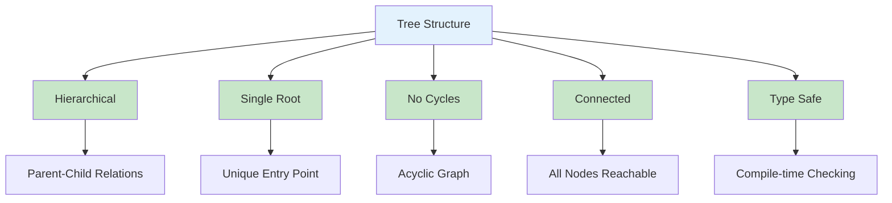
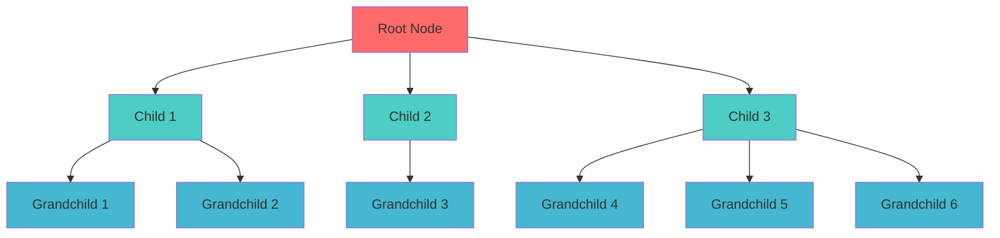
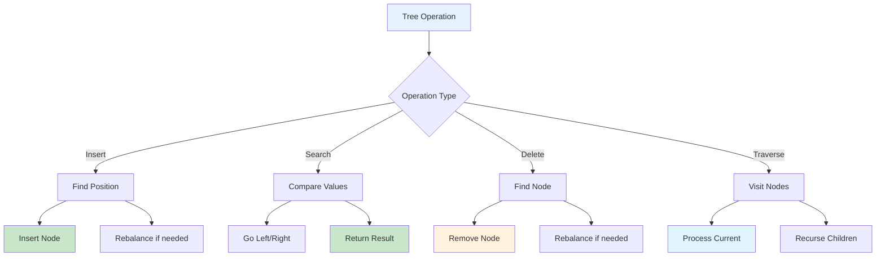
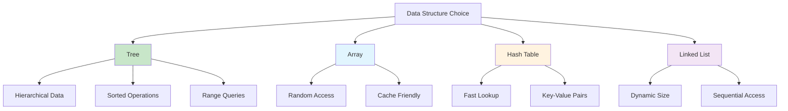

# Trees in TypeScript

## Table of Contents

1. [Introduction](#introduction)
2. [Tree Fundamentals](#tree-fundamentals)
3. [Binary Trees](#binary-trees)
4. [Binary Search Trees](#binary-search-trees)
5. [Balanced Trees](#balanced-trees)
6. [Tree Traversals](#tree-traversals)
7. [Advanced Tree Structures](#advanced-tree-structures)
8. [Performance Analysis](#performance-analysis)
9. [Use Cases and Applications](#use-cases-and-applications)
10. [Best Practices](#best-practices)
11. [Visual Representations](#visual-representations)

## Introduction

A tree is a hierarchical data structure consisting of nodes connected by edges, where each node has a parent (except the root) and zero or more children. In TypeScript, trees provide type safety, generic support, and powerful abstractions for modeling hierarchical relationships and solving complex problems.

### Key Characteristics

- **Hierarchical Structure**: Parent-child relationships
- **Single Root**: One node with no parent
- **No Cycles**: Acyclic graph structure
- **Connected**: Every node reachable from root
- **Type Safety**: Compile-time type checking



## Tree Fundamentals

### Basic Tree Node Structure

```typescript
interface TreeNode<T> {
  data: T;
  children: TreeNode<T>[];
  parent?: TreeNode<T>;
}

class TreeNode<T> implements TreeNode<T> {
  data: T;
  children: TreeNode<T>[] = [];
  parent?: TreeNode<T>;

  constructor(data: T, parent?: TreeNode<T>) {
    this.data = data;
    this.parent = parent;
  }

  addChild(childData: T): TreeNode<T> {
    const child = new TreeNode(childData, this);
    this.children.push(child);
    return child;
  }

  removeChild(child: TreeNode<T>): boolean {
    const index = this.children.indexOf(child);
    if (index !== -1) {
      this.children.splice(index, 1);
      child.parent = undefined;
      return true;
    }
    return false;
  }

  getLevel(): number {
    let level = 0;
    let current = this.parent;
    while (current) {
      level++;
      current = current.parent;
    }
    return level;
  }

  isLeaf(): boolean {
    return this.children.length === 0;
  }

  isRoot(): boolean {
    return this.parent === undefined;
  }
}
```

### Tree Implementation

```typescript
class Tree<T> {
  root: TreeNode<T> | null = null;

  constructor(rootData?: T) {
    if (rootData !== undefined) {
      this.root = new TreeNode(rootData);
    }
  }

  getHeight(): number {
    return this.getHeightRecursive(this.root);
  }

  private getHeightRecursive(node: TreeNode<T> | null): number {
    if (!node) return 0;
    if (node.isLeaf()) return 1;

    let maxChildHeight = 0;
    for (const child of node.children) {
      const childHeight = this.getHeightRecursive(child);
      maxChildHeight = Math.max(maxChildHeight, childHeight);
    }

    return 1 + maxChildHeight;
  }

  getSize(): number {
    return this.getSizeRecursive(this.root);
  }

  private getSizeRecursive(node: TreeNode<T> | null): number {
    if (!node) return 0;

    let size = 1;
    for (const child of node.children) {
      size += this.getSizeRecursive(child);
    }

    return size;
  }

  findNode(data: T): TreeNode<T> | null {
    return this.findNodeRecursive(this.root, data);
  }

  private findNodeRecursive(node: TreeNode<T> | null, data: T): TreeNode<T> | null {
    if (!node) return null;
    if (node.data === data) return node;

    for (const child of node.children) {
      const result = this.findNodeRecursive(child, data);
      if (result) return result;
    }

    return null;
  }

  traverse(callback: (node: TreeNode<T>) => void): void {
    this.traverseRecursive(this.root, callback);
  }

  private traverseRecursive(node: TreeNode<T> | null, callback: (node: TreeNode<T>) => void): void {
    if (!node) return;

    callback(node);
    for (const child of node.children) {
      this.traverseRecursive(child, callback);
    }
  }
}
```

### Tree Structure Visualization



## Binary Trees

### Binary Tree Node Implementation

```typescript
interface BinaryTreeNode<T> {
  data: T;
  left: BinaryTreeNode<T> | null;
  right: BinaryTreeNode<T> | null;
  parent?: BinaryTreeNode<T>;
}

class BinaryTreeNode<T> implements BinaryTreeNode<T> {
  data: T;
  left: BinaryTreeNode<T> | null = null;
  right: BinaryTreeNode<T> | null = null;
  parent?: BinaryTreeNode<T>;

  constructor(data: T, parent?: BinaryTreeNode<T>) {
    this.data = data;
    this.parent = parent;
  }

  isLeaf(): boolean {
    return this.left === null && this.right === null;
  }

  hasLeftChild(): boolean {
    return this.left !== null;
  }

  hasRightChild(): boolean {
    return this.right !== null;
  }

  hasAnyChildren(): boolean {
    return this.hasLeftChild() || this.hasRightChild();
  }

  hasBothChildren(): boolean {
    return this.hasLeftChild() && this.hasRightChild();
  }
}
```

### Binary Tree Implementation

```typescript
class BinaryTree<T> {
  root: BinaryTreeNode<T> | null = null;

  constructor(rootData?: T) {
    if (rootData !== undefined) {
      this.root = new BinaryTreeNode(rootData);
    }
  }

  insertLeft(node: BinaryTreeNode<T>, data: T): BinaryTreeNode<T> | null {
    if (node.left === null) {
      node.left = new BinaryTreeNode(data, node);
      return node.left;
    } else {
      const newNode = new BinaryTreeNode(data, node);
      newNode.left = node.left;
      node.left = newNode;
      return newNode;
    }
  }

  insertRight(node: BinaryTreeNode<T>, data: T): BinaryTreeNode<T> | null {
    if (node.right === null) {
      node.right = new BinaryTreeNode(data, node);
      return node.right;
    } else {
      const newNode = new BinaryTreeNode(data, node);
      newNode.right = node.right;
      node.right = newNode;
      return newNode;
    }
  }

  getHeight(): number {
    return this.getHeightRecursive(this.root);
  }

  private getHeightRecursive(node: BinaryTreeNode<T> | null): number {
    if (!node) return 0;
    return 1 + Math.max(this.getHeightRecursive(node.left), this.getHeightRecursive(node.right));
  }

  getSize(): number {
    return this.getSizeRecursive(this.root);
  }

  private getSizeRecursive(node: BinaryTreeNode<T> | null): number {
    if (!node) return 0;
    return 1 + this.getSizeRecursive(node.left) + this.getSizeRecursive(node.right);
  }
}
```

## Binary Search Trees

### BST Implementation

```typescript
class BSTNode<T> {
  data: T;
  left: BSTNode<T> | null = null;
  right: BSTNode<T> | null = null;
  parent?: BSTNode<T>;

  constructor(data: T, parent?: BSTNode<T>) {
    this.data = data;
    this.parent = parent;
  }

  insert(data: T, compareFn?: (a: T, b: T) => number): BSTNode<T> {
    const compare =
      compareFn ||
      ((a: T, b: T) => {
        if (a < b) return -1;
        if (a > b) return 1;
        return 0;
      });

    if (compare(data, this.data) < 0) {
      if (this.left === null) {
        this.left = new BSTNode(data, this);
        return this.left;
      } else {
        return this.left.insert(data, compareFn);
      }
    } else if (compare(data, this.data) > 0) {
      if (this.right === null) {
        this.right = new BSTNode(data, this);
        return this.right;
      } else {
        return this.right.insert(data, compareFn);
      }
    }

    return this; // Duplicate values not inserted
  }

  find(data: T, compareFn?: (a: T, b: T) => number): BSTNode<T> | null {
    const compare =
      compareFn ||
      ((a: T, b: T) => {
        if (a < b) return -1;
        if (a > b) return 1;
        return 0;
      });

    if (compare(data, this.data) === 0) {
      return this;
    } else if (compare(data, this.data) < 0 && this.left) {
      return this.left.find(data, compareFn);
    } else if (compare(data, this.data) > 0 && this.right) {
      return this.right.find(data, compareFn);
    }

    return null;
  }

  findMin(): BSTNode<T> {
    let current: BSTNode<T> = this;
    while (current.left) {
      current = current.left;
    }
    return current;
  }

  findMax(): BSTNode<T> {
    let current: BSTNode<T> = this;
    while (current.right) {
      current = current.right;
    }
    return current;
  }

  inorderTraversal(): T[] {
    const result: T[] = [];

    if (this.left) {
      result.push(...this.left.inorderTraversal());
    }
    result.push(this.data);
    if (this.right) {
      result.push(...this.right.inorderTraversal());
    }

    return result;
  }
}

class BinarySearchTree<T> {
  root: BSTNode<T> | null = null;
  private compareFn?: (a: T, b: T) => number;

  constructor(compareFn?: (a: T, b: T) => number) {
    this.compareFn = compareFn;
  }

  insert(data: T): BSTNode<T> | null {
    if (this.root === null) {
      this.root = new BSTNode(data);
      return this.root;
    }
    return this.root.insert(data, this.compareFn);
  }

  find(data: T): BSTNode<T> | null {
    if (this.root === null) return null;
    return this.root.find(data, this.compareFn);
  }

  delete(data: T): boolean {
    const node = this.find(data);
    if (!node) return false;

    this.deleteNode(node);
    return true;
  }

  private deleteNode(node: BSTNode<T>): void {
    if (node.left === null && node.right === null) {
      // Leaf node
      this.replaceNode(node, null);
    } else if (node.left === null) {
      // Only right child
      this.replaceNode(node, node.right);
    } else if (node.right === null) {
      // Only left child
      this.replaceNode(node, node.left);
    } else {
      // Two children - find successor
      const successor = node.right.findMin();
      node.data = successor.data;
      this.deleteNode(successor);
    }
  }

  private replaceNode(oldNode: BSTNode<T>, newNode: BSTNode<T> | null): void {
    if (oldNode.parent === null) {
      this.root = newNode;
    } else if (oldNode === oldNode.parent.left) {
      oldNode.parent.left = newNode;
    } else {
      oldNode.parent.right = newNode;
    }

    if (newNode) {
      newNode.parent = oldNode.parent;
    }
  }
}
```

## Balanced Trees

### AVL Tree Implementation

```typescript
class AVLNode<T> {
  data: T;
  left: AVLNode<T> | null = null;
  right: AVLNode<T> | null = null;
  parent?: AVLNode<T>;
  height: number = 1;

  constructor(data: T, parent?: AVLNode<T>) {
    this.data = data;
    this.parent = parent;
  }

  getBalance(): number {
    const leftHeight = this.left ? this.left.height : 0;
    const rightHeight = this.right ? this.right.height : 0;
    return leftHeight - rightHeight;
  }

  updateHeight(): void {
    const leftHeight = this.left ? this.left.height : 0;
    const rightHeight = this.right ? this.right.height : 0;
    this.height = 1 + Math.max(leftHeight, rightHeight);
  }
}

class AVLTree<T> {
  root: AVLNode<T> | null = null;
  private compareFn?: (a: T, b: T) => number;

  constructor(compareFn?: (a: T, b: T) => number) {
    this.compareFn = compareFn;
  }

  insert(data: T): AVLNode<T> | null {
    this.root = this.insertRecursive(this.root, data);
    return this.root;
  }

  private insertRecursive(node: AVLNode<T> | null, data: T): AVLNode<T> {
    if (!node) {
      return new AVLNode(data);
    }

    const compare =
      this.compareFn ||
      ((a: T, b: T) => {
        if (a < b) return -1;
        if (a > b) return 1;
        return 0;
      });

    if (compare(data, node.data) < 0) {
      node.left = this.insertRecursive(node.left, data);
    } else if (compare(data, node.data) > 0) {
      node.right = this.insertRecursive(node.right, data);
    } else {
      return node; // Duplicate values not allowed
    }

    node.updateHeight();

    const balance = node.getBalance();

    // Left Left Case
    if (balance > 1 && node.left && compare(data, node.left.data) < 0) {
      return this.rotateRight(node);
    }

    // Right Right Case
    if (balance < -1 && node.right && compare(data, node.right.data) > 0) {
      return this.rotateLeft(node);
    }

    // Left Right Case
    if (balance > 1 && node.left && compare(data, node.left.data) > 0) {
      node.left = this.rotateLeft(node.left!);
      return this.rotateRight(node);
    }

    // Right Left Case
    if (balance < -1 && node.right && compare(data, node.right.data) < 0) {
      node.right = this.rotateRight(node.right!);
      return this.rotateLeft(node);
    }

    return node;
  }

  private rotateLeft(z: AVLNode<T>): AVLNode<T> {
    const y = z.right!;
    const T2 = y.left;

    y.left = z;
    z.right = T2;

    z.updateHeight();
    y.updateHeight();

    return y;
  }

  private rotateRight(z: AVLNode<T>): AVLNode<T> {
    const y = z.left!;
    const T3 = y.right;

    y.right = z;
    z.left = T3;

    z.updateHeight();
    y.updateHeight();

    return y;
  }
}
```

## Tree Traversals

### Depth-First Traversals

```typescript
class TreeTraversal<T> {
  static preorder<T>(node: BinaryTreeNode<T> | null, result: T[] = []): T[] {
    if (!node) return result;

    result.push(node.data);
    this.preorder(node.left, result);
    this.preorder(node.right, result);

    return result;
  }

  static inorder<T>(node: BinaryTreeNode<T> | null, result: T[] = []): T[] {
    if (!node) return result;

    this.inorder(node.left, result);
    result.push(node.data);
    this.inorder(node.right, result);

    return result;
  }

  static postorder<T>(node: BinaryTreeNode<T> | null, result: T[] = []): T[] {
    if (!node) return result;

    this.postorder(node.left, result);
    this.postorder(node.right, result);
    result.push(node.data);

    return result;
  }

  static preorderIterative<T>(root: BinaryTreeNode<T> | null): T[] {
    if (!root) return [];

    const result: T[] = [];
    const stack: BinaryTreeNode<T>[] = [root];

    while (stack.length > 0) {
      const node = stack.pop()!;
      result.push(node.data);

      if (node.right) stack.push(node.right);
      if (node.left) stack.push(node.left);
    }

    return result;
  }

  static inorderIterative<T>(root: BinaryTreeNode<T> | null): T[] {
    const result: T[] = [];
    const stack: BinaryTreeNode<T>[] = [];
    let current = root;

    while (stack.length > 0 || current) {
      while (current) {
        stack.push(current);
        current = current.left;
      }

      current = stack.pop()!;
      result.push(current.data);
      current = current.right;
    }

    return result;
  }
}
```

### Breadth-First Traversal

```typescript
class TreeTraversal<T> {
  static levelOrder<T>(root: BinaryTreeNode<T> | null): T[] {
    if (!root) return [];

    const result: T[] = [];
    const queue: BinaryTreeNode<T>[] = [root];

    while (queue.length > 0) {
      const node = queue.shift()!;
      result.push(node.data);

      if (node.left) queue.push(node.left);
      if (node.right) queue.push(node.right);
    }

    return result;
  }

  static levelOrderWithLevels<T>(root: BinaryTreeNode<T> | null): T[][] {
    if (!root) return [];

    const result: T[][] = [];
    const queue: BinaryTreeNode<T>[] = [root];

    while (queue.length > 0) {
      const levelSize = queue.length;
      const level: T[] = [];

      for (let i = 0; i < levelSize; i++) {
        const node = queue.shift()!;
        level.push(node.data);

        if (node.left) queue.push(node.left);
        if (node.right) queue.push(node.right);
      }

      result.push(level);
    }

    return result;
  }
}
```

## Advanced Tree Structures

### Trie Implementation

```typescript
class TrieNode {
  children: Map<string, TrieNode> = new Map();
  isEndOfWord: boolean = false;
  wordCount: number = 0;
}

class Trie {
  root: TrieNode = new TrieNode();

  insert(word: string): void {
    let current = this.root;

    for (const char of word) {
      if (!current.children.has(char)) {
        current.children.set(char, new TrieNode());
      }
      current = current.children.get(char)!;
      current.wordCount++;
    }

    current.isEndOfWord = true;
  }

  search(word: string): boolean {
    let current = this.root;

    for (const char of word) {
      if (!current.children.has(char)) {
        return false;
      }
      current = current.children.get(char)!;
    }

    return current.isEndOfWord;
  }

  startsWith(prefix: string): boolean {
    let current = this.root;

    for (const char of prefix) {
      if (!current.children.has(char)) {
        return false;
      }
      current = current.children.get(char)!;
    }

    return true;
  }

  countWordsWithPrefix(prefix: string): number {
    let current = this.root;

    for (const char of prefix) {
      if (!current.children.has(char)) {
        return 0;
      }
      current = current.children.get(char)!;
    }

    return current.wordCount;
  }

  delete(word: string): boolean {
    if (!this.search(word)) return false;

    let current = this.root;
    const path: TrieNode[] = [current];

    for (const char of word) {
      current = current.children.get(char)!;
      path.push(current);
    }

    current.isEndOfWord = false;

    // Remove nodes if they have no children and are not end of word
    for (let i = path.length - 1; i > 0; i--) {
      const node = path[i];
      const parent = path[i - 1];

      if (node.children.size === 0 && !node.isEndOfWord) {
        const char = word[i - 1];
        parent.children.delete(char);
      } else {
        break;
      }
    }

    return true;
  }
}
```

## Performance Analysis

### Time Complexity

| Operation | BST      | AVL      | Trie | Description          |
| --------- | -------- | -------- | ---- | -------------------- |
| Search    | O(log n) | O(log n) | O(m) | m = length of string |
| Insert    | O(log n) | O(log n) | O(m) | m = length of string |
| Delete    | O(log n) | O(log n) | O(m) | m = length of string |
| Min/Max   | O(log n) | O(log n) | O(m) | m = length of string |

### Space Complexity

| Structure | Space Complexity          | Description               |
| --------- | ------------------------- | ------------------------- |
| BST       | O(n)                      | n nodes                   |
| AVL       | O(n)                      | n nodes + height info     |
| Trie      | O(ALPHABET*SIZE * N \_ M) | N words, M average length |

## Use Cases and Applications

### 1. Database Systems

- **B-Trees**: Database indexing, file systems
- **B+ Trees**: Database storage, range queries
- **Tries**: Full-text search, autocomplete

### 2. File Systems

- **Directory Structure**: Hierarchical file organization
- **Inode Management**: File metadata storage
- **Path Resolution**: Efficient file lookup

### 3. Compiler Design

- **Abstract Syntax Trees**: Code representation
- **Symbol Tables**: Variable and function lookup
- **Parse Trees**: Grammar analysis

### 4. Network Routing

- **Routing Tables**: IP address lookup
- **Decision Trees**: Packet routing decisions
- **Trie-based Routing**: Longest prefix matching

## Best Practices

### 1. Type Safety

```typescript
// Use generic types for flexibility
class GenericTree<T> {
  root: TreeNode<T> | null = null;

  insert(data: T): void {
    // Implementation with type safety
  }
}

// Use type guards for runtime safety
function isTreeNode<T>(node: any): node is TreeNode<T> {
  return node && typeof node.data !== "undefined" && Array.isArray(node.children);
}
```

### 2. Memory Management

```typescript
class MemoryEfficientTree<T> {
  private nodePool: TreeNode<T>[] = [];

  private getNode(data: T): TreeNode<T> {
    if (this.nodePool.length > 0) {
      const node = this.nodePool.pop()!;
      node.data = data;
      node.children = [];
      return node;
    }
    return new TreeNode(data);
  }

  private returnNode(node: TreeNode<T>): void {
    node.data = null as any;
    node.children = [];
    this.nodePool.push(node);
  }
}
```

### 3. Error Handling

```typescript
class SafeTree<T> {
  root: TreeNode<T> | null = null;

  safeInsert(data: T): boolean {
    try {
      this.insert(data);
      return true;
    } catch (error) {
      console.error("Error inserting node:", error);
      return false;
    }
  }

  safeDelete(data: T): boolean {
    try {
      return this.delete(data);
    } catch (error) {
      console.error("Error deleting node:", error);
      return false;
    }
  }
}
```

## Visual Representations

### Tree Operations Flow



### Tree vs Other Structures



## Conclusion

Trees in TypeScript provide powerful abstractions for modeling hierarchical relationships with type safety and performance. The combination of TypeScript's type system and tree data structures enables robust, maintainable code for complex problems.

Key advantages of TypeScript trees:

- **Type Safety**: Compile-time type checking prevents runtime errors
- **Generic Support**: Reusable code with type parameters
- **Performance**: Efficient operations with O(log n) complexity
- **Flexibility**: Support for various tree types and operations
- **Maintainability**: Clear interfaces and type definitions

Trees excel in scenarios requiring:

- Hierarchical data modeling
- Sorted data operations
- Range queries and searches
- Database indexing
- File system organization

Understanding tree properties, traversal methods, and balancing techniques is crucial for implementing efficient tree-based solutions in TypeScript applications.
