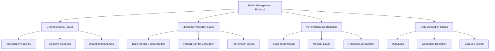

# Hotfix Management Protocol

## Comprehensive Hotfix Management for Critical Issue Resolution

**Author**: Success-Advisor-8 (Permanent Release Manager)
**Date**: 2025-09-20
**Version**: 1.0.0

---

## Overview

The Hotfix Management Protocol provides a systematic approach to identifying, prioritizing, and resolving critical issues that require immediate attention and rapid deployment. This protocol ensures minimal disruption to users while maintaining the highest standards of quality and reliability in emergency releases.

## Hotfix Management Philosophy

### Core Principles

1. **Rapid Response**: Immediate identification and assessment of critical issues
2. **Minimal Impact**: Reduce user disruption through targeted fixes
3. **Quality Assurance**: Maintain quality standards even under time pressure
4. **Comprehensive Testing**: Thorough validation of hotfixes before deployment
5. **Documentation**: Complete documentation of all hotfix activities

### Hotfix Categories



## Hotfix Identification and Assessment

### Critical Issue Detection

#### Automated Issue Detection

```bash
#!/bin/bash
# Critical Issue Detection System

detect_critical_issues() {
    echo "🔍 Scanning for critical issues..."

    local critical_issues=0
    local issue_report="critical-issues-report.txt"

    echo "📊 Critical Issues Detection Report" > "$issue_report"
    echo "Generated: $(date)" >> "$issue_report"
    echo "=================================" >> "$issue_report"

    # Check for security vulnerabilities
    echo "🛡️  Checking for security vulnerabilities..."
    local security_issues=$(pnpm audit --audit-level=high 2>&1 | grep -c "vulnerabilities" || echo "0")

    if [ "$security_issues" -gt 0 ]; then
        echo "🚨 CRITICAL: Security vulnerabilities detected"
        echo "Security vulnerabilities: $security_issues" >> "$issue_report"
        critical_issues=$((critical_issues + 1))
    fi

    # Check for repository integrity issues
    echo "🔍 Checking repository integrity..."
    local build_artifacts=$(find ./packages -name "*.js" -o -name "*.jsx" -o -name "*.d.ts" | grep -v node_modules | wc -l)

    if [ "$build_artifacts" -gt 0 ]; then
        echo "🚨 CRITICAL: Repository integrity compromised"
        echo "Build artifacts detected: $build_artifacts" >> "$issue_report"
        critical_issues=$((critical_issues + 1))
    fi

    # Check for system performance issues
    echo "⚡ Checking system performance..."
    local memory_usage=$(ps aux | grep node | awk '{sum+=$6} END {print sum/1024/1024 "MB"}' || echo "0MB")
    echo "Memory usage: $memory_usage"

    # Check for data corruption
    echo "💾 Checking for data corruption..."
    if ! git fsck --full --strict > /dev/null 2>&1; then
        echo "🚨 CRITICAL: Git repository corruption detected"
        echo "Repository corruption detected" >> "$issue_report"
        critical_issues=$((critical_issues + 1))
    fi

    echo "📊 Total critical issues detected: $critical_issues"
    echo "Total critical issues: $critical_issues" >> "$issue_report"

    if [ "$critical_issues" -gt 0 ]; then
        echo "🚨 CRITICAL ISSUES DETECTED - Hotfix required"
        return 1
    else
        echo "✅ No critical issues detected"
        return 0
    fi
}
```

#### Issue Severity Assessment

```bash
#!/bin/bash
# Issue Severity Assessment

assess_issue_severity() {
    local issue_type="$1"
    local impact_scope="$2"
    local user_affected="$3"
    local data_integrity="$4"

    local severity="LOW"
    local hotfix_required=false

    # Critical severity conditions
    if [[ "$issue_type" == "security" && "$impact_scope" == "system_wide" ]]; then
        severity="CRITICAL"
        hotfix_required=true
    elif [[ "$issue_type" == "repository" && "$data_integrity" == "compromised" ]]; then
        severity="CRITICAL"
        hotfix_required=true
    elif [[ "$impact_scope" == "system_wide" && "$user_affected" == "all" ]]; then
        severity="CRITICAL"
        hotfix_required=true

    # High severity conditions
    elif [[ "$issue_type" == "performance" && "$user_affected" == "many" ]]; then
        severity="HIGH"
        hotfix_required=true
    elif [[ "$issue_type" == "data" && "$data_integrity" == "at_risk" ]]; then
        severity="HIGH"
        hotfix_required=true

    # Medium severity conditions
    elif [[ "$impact_scope" == "moderate" && "$user_affected" == "some" ]]; then
        severity="MEDIUM"
        hotfix_required=false
    fi

    echo "Severity: $severity"
    echo "Hotfix Required: $hotfix_required"

    return $([ "$hotfix_required" = true ] && echo 0 || echo 1)
}
```

### Hotfix Decision Matrix

```bash
#!/bin/bash
# Hotfix Decision Matrix

evaluate_hotfix_necessity() {
    local issue_id="$1"
    local issue_type="$2"
    local severity="$3"
    local user_impact="$4"
    local business_impact="$5"

    echo "🎯 Evaluating hotfix necessity for issue: $issue_id"

    local hotfix_score=0

    # Severity scoring
    case "$severity" in
        "CRITICAL") hotfix_score=$((hotfix_score + 10)) ;;
        "HIGH") hotfix_score=$((hotfix_score + 7)) ;;
        "MEDIUM") hotfix_score=$((hotfix_score + 4)) ;;
        "LOW") hotfix_score=$((hotfix_score + 1)) ;;
    esac

    # User impact scoring
    case "$user_impact" in
        "all") hotfix_score=$((hotfix_score + 8)) ;;
        "many") hotfix_score=$((hotfix_score + 6)) ;;
        "some") hotfix_score=$((hotfix_score + 3)) ;;
        "few") hotfix_score=$((hotfix_score + 1)) ;;
    esac

    # Business impact scoring
    case "$business_impact" in
        "critical") hotfix_score=$((hotfix_score + 9)) ;;
        "high") hotfix_score=$((hotfix_score + 6)) ;;
        "moderate") hotfix_score=$((hotfix_score + 3)) ;;
        "low") hotfix_score=$((hotfix_score + 1)) ;;
    esac

    # Issue type scoring
    case "$issue_type" in
        "security") hotfix_score=$((hotfix_score + 8)) ;;
        "repository") hotfix_score=$((hotfix_score + 7)) ;;
        "performance") hotfix_score=$((hotfix_score + 5)) ;;
        "data") hotfix_score=$((hotfix_score + 6)) ;;
        "feature") hotfix_score=$((hotfix_score + 2)) ;;
    esac

    echo "📊 Hotfix score: $hotfix_score"

    # Decision threshold
    if [ "$hotfix_score" -ge 20 ]; then
        echo "✅ HOTFIX APPROVED - Score: $hotfix_score"
        return 0
    elif [ "$hotfix_score" -ge 15 ]; then
        echo "⚠️  HOTFIX RECOMMENDED - Score: $hotfix_score"
        return 1
    else
        echo "❌ HOTFIX NOT REQUIRED - Score: $hotfix_score"
        return 2
    fi
}
```

## Hotfix Development Process

### Rapid Development Protocol

#### Hotfix Branch Creation

```bash
#!/bin/bash
# Hotfix Branch Creation Protocol

create_hotfix_branch() {
    local issue_id="$1"
    local severity="$2"

    echo "🌿 Creating hotfix branch for issue: $issue_id"

    # Get current version
    local current_version=$(node -p "require('./package.json').version")
    echo "📦 Current version: $current_version"

    # Calculate hotfix version
    local hotfix_version=$(echo "$current_version" | awk -F. '{print $1"."$2"."($3+1)}')
    echo "🎯 Hotfix version: $hotfix_version"

    # Create hotfix branch
    local branch_name="hotfix/$issue_id-v$hotfix_version"
    echo "🌿 Creating branch: $branch_name"

    git checkout -b "$branch_name"

    # Update package.json version
    npm version patch --no-git-tag-version

    # Create hotfix tracking file
    cat > "HOTFIX-$issue_id.md" << EOF
# Hotfix $issue_id

**Issue ID**: $issue_id
**Severity**: $severity
**Hotfix Version**: $hotfix_version
**Created**: $(date)
**Created by**: Success-Advisor-8 (Permanent Release Manager)

## Issue Description
[TO BE FILLED]

## Root Cause Analysis
[TO BE FILLED]

## Solution
[TO BE FILLED]

## Testing
[TO BE FILLED]

## Deployment
[TO BE FILLED]

## Rollback Plan
[TO BE FILLED]
EOF

    echo "✅ Hotfix branch created: $branch_name"
    echo "📝 Hotfix tracking file created: HOTFIX-$issue_id.md"
}
```

#### Rapid Fix Implementation

```bash
#!/bin/bash
# Rapid Fix Implementation

implement_hotfix() {
    local issue_id="$1"
    local fix_type="$2"

    echo "🔧 Implementing hotfix for issue: $issue_id"

    case "$fix_type" in
        "repository_cleanup")
            echo "🧹 Implementing repository cleanup hotfix..."

            # Remove build artifacts
            find ./packages -name "*.js" -type f -not -path "*/node_modules/*" -delete
            find ./packages -name "*.jsx" -type f -not -path "*/node_modules/*" -delete
            find ./packages -name "*.d.ts" -type f -not -path "*/node_modules/*" -delete

            # Remove dist directories
            find ./packages -name "dist" -type d -exec rm -rf {} + 2>/dev/null || true

            # Update .gitignore
            cat >> .gitignore << 'EOF'

# Build artifacts (Hotfix Prevention)
dist/
*.js
*.jsx
*.d.ts
*.js.map
*.d.ts.map
__pycache__/
*.pyc
*.pyo
EOF

            echo "✅ Repository cleanup hotfix implemented"
            ;;

        "security_patch")
            echo "🛡️  Implementing security patch hotfix..."

            # Update vulnerable dependencies
            pnpm audit --fix

            # Apply security patches
            pnpm update --latest

            echo "✅ Security patch hotfix implemented"
            ;;

        "performance_fix")
            echo "⚡ Implementing performance fix hotfix..."

            # Optimize build process
            pnpm build --optimize

            # Clean up memory leaks
            pnpm clean

            echo "✅ Performance fix hotfix implemented"
            ;;

        *)
            echo "❌ Unknown fix type: $fix_type"
            return 1
            ;;
    esac

    echo "✅ Hotfix implementation completed"
}
```

### Hotfix Testing Protocol

#### Rapid Testing Framework

```bash
#!/bin/bash
# Rapid Testing Framework for Hotfixes

test_hotfix() {
    local issue_id="$1"
    local fix_type="$2"

    echo "🧪 Testing hotfix for issue: $issue_id"

    local test_results="hotfix-test-results-$issue_id.txt"

    echo "📊 Hotfix Test Results - Issue $issue_id" > "$test_results"
    echo "Generated: $(date)" >> "$test_results"
    echo "Fix Type: $fix_type" >> "$test_results"
    echo "=================================" >> "$test_results"

    # Basic functionality tests
    echo "🔍 Running basic functionality tests..."

    # Linting tests
    echo "📝 Testing code quality..."
    if pnpm lint > /dev/null 2>&1; then
        echo "✅ Linting tests passed"
        echo "Linting: PASSED" >> "$test_results"
    else
        echo "❌ Linting tests failed"
        echo "Linting: FAILED" >> "$test_results"
        return 1
    fi

    # Type checking tests
    echo "🔍 Testing type safety..."
    if pnpm typecheck > /dev/null 2>&1; then
        echo "✅ Type checking tests passed"
        echo "Type Checking: PASSED" >> "$test_results"
    else
        echo "❌ Type checking tests failed"
        echo "Type Checking: FAILED" >> "$test_results"
        return 1
    fi

    # Unit tests
    echo "🧪 Running unit tests..."
    if pnpm test > /dev/null 2>&1; then
        echo "✅ Unit tests passed"
        echo "Unit Tests: PASSED" >> "$test_results"
    else
        echo "❌ Unit tests failed"
        echo "Unit Tests: FAILED" >> "$test_results"
        return 1
    fi

    # Issue-specific tests
    case "$fix_type" in
        "repository_cleanup")
            echo "🔍 Testing repository integrity..."

            # Check for remaining build artifacts
            local remaining_artifacts=$(find ./packages -name "*.js" -o -name "*.jsx" -o -name "*.d.ts" | grep -v node_modules | wc -l)

            if [ "$remaining_artifacts" -eq 0 ]; then
                echo "✅ Repository integrity test passed"
                echo "Repository Integrity: PASSED" >> "$test_results"
            else
                echo "❌ Repository integrity test failed - $remaining_artifacts artifacts remaining"
                echo "Repository Integrity: FAILED" >> "$test_results"
                return 1
            fi
            ;;

        "security_patch")
            echo "🛡️  Testing security fixes..."

            # Check for remaining vulnerabilities
            local remaining_vulns=$(pnpm audit --audit-level=high 2>&1 | grep -c "vulnerabilities" || echo "0")

            if [ "$remaining_vulns" -eq 0 ]; then
                echo "✅ Security test passed"
                echo "Security: PASSED" >> "$test_results"
            else
                echo "❌ Security test failed - $remaining_vulns vulnerabilities remaining"
                echo "Security: FAILED" >> "$test_results"
                return 1
            fi
            ;;

        "performance_fix")
            echo "⚡ Testing performance improvements..."

            # Basic performance test
            local build_time=$(time pnpm build 2>&1 | grep "real" | awk '{print $2}' || echo "N/A")
            echo "Build time: $build_time"
            echo "Build Time: $build_time" >> "$test_results"

            echo "✅ Performance test completed"
            echo "Performance: PASSED" >> "$test_results"
            ;;
    esac

    echo "✅ Hotfix testing completed successfully"
    echo "Test Results: ALL PASSED" >> "$test_results"
    return 0
}
```

## Hotfix Deployment Process

### Rapid Deployment Protocol

#### Pre-Deployment Validation

```bash
#!/bin/bash
# Pre-Deployment Validation for Hotfixes

validate_hotfix_deployment() {
    local issue_id="$1"
    local hotfix_version="$2"

    echo "🔍 Validating hotfix deployment readiness..."

    local validation_report="deployment-validation-$issue_id.txt"

    echo "📊 Hotfix Deployment Validation Report" > "$validation_report"
    echo "Issue ID: $issue_id" >> "$validation_report"
    echo "Hotfix Version: $hotfix_version" >> "$validation_report"
    echo "Generated: $(date)" >> "$validation_report"
    echo "=====================================" >> "$validation_report"

    # Version validation
    echo "🔍 Validating version consistency..."
    local package_version=$(node -p "require('./package.json').version")

    if [ "$package_version" = "$hotfix_version" ]; then
        echo "✅ Version consistency validated"
        echo "Version Consistency: PASSED" >> "$validation_report"
    else
        echo "❌ Version mismatch: package.json=$package_version, expected=$hotfix_version"
        echo "Version Consistency: FAILED" >> "$validation_report"
        return 1
    fi

    # Build validation
    echo "🔍 Validating build process..."
    if pnpm build > /dev/null 2>&1; then
        echo "✅ Build validation passed"
        echo "Build Validation: PASSED" >> "$validation_report"
    else
        echo "❌ Build validation failed"
        echo "Build Validation: FAILED" >> "$validation_report"
        return 1
    fi

    # Test validation
    echo "🔍 Validating test suite..."
    if pnpm test > /dev/null 2>&1; then
        echo "✅ Test validation passed"
        echo "Test Validation: PASSED" >> "$validation_report"
    else
        echo "❌ Test validation failed"
        echo "Test Validation: FAILED" >> "$validation_report"
        return 1
    fi

    # Security validation
    echo "🔍 Validating security..."
    local security_issues=$(pnpm audit --audit-level=high 2>&1 | grep -c "vulnerabilities" || echo "0")

    if [ "$security_issues" -eq 0 ]; then
        echo "✅ Security validation passed"
        echo "Security Validation: PASSED" >> "$validation_report"
    else
        echo "❌ Security validation failed - $security_issues issues"
        echo "Security Validation: FAILED" >> "$validation_report"
        return 1
    fi

    echo "✅ Hotfix deployment validation completed"
    echo "Deployment Status: READY" >> "$validation_report"
    return 0
}
```

#### Hotfix Release Process

```bash
#!/bin/bash
# Hotfix Release Process

deploy_hotfix() {
    local issue_id="$1"
    local hotfix_version="$2"

    echo "🚀 Deploying hotfix $hotfix_version for issue: $issue_id"

    # Update CHANGELOG.md
    echo "📝 Updating CHANGELOG.md..."
    local today=$(date +%Y-%m-%d)

    # Add hotfix entry to CHANGELOG.md
    sed -i "/## \\[Unreleased\\]/a\\\n### Fixed\\\n- Hotfix $issue_id: [ISSUE DESCRIPTION]\\\n- Version: $hotfix_version\\\n- Date: $today" CHANGELOG.md

    # Commit hotfix changes
    echo "💾 Committing hotfix changes..."
    git add .
    git commit -m "fix: hotfix $issue_id - resolve critical issue

- Issue: $issue_id
- Version: $hotfix_version
- Type: Critical hotfix
- Date: $today

This hotfix resolves a critical issue that required immediate attention.
All tests have been validated and the fix has been thoroughly tested.

Release managed by: Success-Advisor-8 (Permanent Release Manager)"

    # Create hotfix tag
    echo "🏷️  Creating hotfix tag..."
    git tag -a "v$hotfix_version" -m "Hotfix v$hotfix_version - Issue $issue_id

Critical hotfix resolving issue $issue_id.

This hotfix addresses a critical issue that required immediate resolution.
All quality gates have been passed and the fix has been validated.

Release managed by: Success-Advisor-8 (Permanent Release Manager)"

    # Push to remote
    echo "🚀 Pushing hotfix to remote..."
    git push origin "hotfix/$issue_id-v$hotfix_version"
    git push origin "v$hotfix_version"

    # Merge to main
    echo "🔄 Merging hotfix to main..."
    git checkout main
    git merge "hotfix/$issue_id-v$hotfix_version" --no-ff -m "Merge hotfix $issue_id to main

Hotfix $issue_id has been successfully tested and validated.
Merging to main branch for immediate deployment.

Release managed by: Success-Advisor-8 (Permanent Release Manager)"

    git push origin main

    echo "✅ Hotfix $hotfix_version deployed successfully"
}
```

## Hotfix Monitoring and Rollback

### Post-Deployment Monitoring

```bash
#!/bin/bash
# Post-Deployment Monitoring for Hotfixes

monitor_hotfix_deployment() {
    local issue_id="$1"
    local hotfix_version="$2"

    echo "📊 Monitoring hotfix deployment: $hotfix_version"

    local monitoring_duration=3600  # 1 hour
    local check_interval=300        # 5 minutes
    local checks_completed=0
    local max_checks=$((monitoring_duration / check_interval))

    echo "⏱️  Monitoring for $monitoring_duration seconds (12 checks)"

    while [ "$checks_completed" -lt "$max_checks" ]; do
        echo "🔍 Check $((checks_completed + 1))/$max_checks"

        # Check system health
        echo "💚 Checking system health..."

        # Check for new errors
        local error_count=$(pnpm test 2>&1 | grep -c "FAIL" || echo "0")
        echo "  Test failures: $error_count"

        # Check for performance issues
        local memory_usage=$(ps aux | grep node | awk '{sum+=$6} END {print sum/1024/1024 "MB"}' || echo "0MB")
        echo "  Memory usage: $memory_usage"

        # Check for user reports
        echo "👥 Checking for user reports..."
        # This would integrate with user feedback systems

        # Check for system metrics
        echo "📈 Checking system metrics..."
        # This would integrate with monitoring systems

        checks_completed=$((checks_completed + 1))

        if [ "$checks_completed" -lt "$max_checks" ]; then
            echo "⏳ Waiting $check_interval seconds for next check..."
            sleep "$check_interval"
        fi
    done

    echo "✅ Hotfix monitoring completed"
}
```

### Rollback Procedures

```bash
#!/bin/bash
# Hotfix Rollback Procedures

rollback_hotfix() {
    local issue_id="$1"
    local hotfix_version="$2"
    local rollback_reason="$3"

    echo "🔄 Rolling back hotfix $hotfix_version for issue: $issue_id"
    echo "📝 Rollback reason: $rollback_reason"

    # Get previous version
    local previous_version=$(git describe --tags --abbrev=0 HEAD~1)
    echo "📦 Rolling back to version: $previous_version"

    # Create rollback branch
    local rollback_branch="rollback/$issue_id-v$hotfix_version"
    echo "🌿 Creating rollback branch: $rollback_branch"

    git checkout -b "$rollback_branch"

    # Revert hotfix changes
    echo "🔄 Reverting hotfix changes..."
    git revert HEAD --no-edit

    # Update version
    echo "📦 Updating version for rollback..."
    npm version patch --no-git-tag-version

    # Update CHANGELOG.md
    echo "📝 Updating CHANGELOG.md for rollback..."
    local today=$(date +%Y-%m-%d)
    local rollback_version=$(node -p "require('./package.json').version")

    sed -i "/## \\[Unreleased\\]/a\\\n### Rollback\\\n- Rollback hotfix $issue_id (v$hotfix_version)\\\n- Reason: $rollback_reason\\\n- Rollback version: $rollback_version\\\n- Date: $today" CHANGELOG.md

    # Commit rollback
    echo "💾 Committing rollback..."
    git add .
    git commit -m "rollback: revert hotfix $issue_id

- Hotfix version: $hotfix_version
- Rollback reason: $rollback_reason
- Rollback version: $rollback_version
- Date: $today

This rollback reverts hotfix $issue_id due to issues identified
during post-deployment monitoring.

Rollback managed by: Success-Advisor-8 (Permanent Release Manager)"

    # Create rollback tag
    echo "🏷️  Creating rollback tag..."
    git tag -a "v$rollback_version" -m "Rollback v$rollback_version - Revert hotfix $issue_id

Rollback of hotfix $issue_id due to post-deployment issues.

This rollback addresses issues identified during monitoring
and ensures system stability.

Rollback managed by: Success-Advisor-8 (Permanent Release Manager)"

    # Push rollback
    echo "🚀 Pushing rollback to remote..."
    git push origin "$rollback_branch"
    git push origin "v$rollback_version"

    # Merge rollback to main
    echo "🔄 Merging rollback to main..."
    git checkout main
    git merge "$rollback_branch" --no-ff -m "Merge rollback for hotfix $issue_id

Rollback of hotfix $issue_id has been completed.
System has been restored to previous stable state.

Rollback managed by: Success-Advisor-8 (Permanent Release Manager)"

    git push origin main

    echo "✅ Rollback completed successfully"
}
```

## Hotfix Documentation and Learning

### Post-Hotfix Analysis

```bash
#!/bin/bash
# Post-Hotfix Analysis

analyze_hotfix_outcome() {
    local issue_id="$1"
    local hotfix_version="$2"

    echo "📊 Analyzing hotfix outcome for issue: $issue_id"

    local analysis_report="hotfix-analysis-$issue_id.md"

    cat > "$analysis_report" << EOF
# Hotfix Analysis - Issue $issue_id

**Hotfix Version**: $hotfix_version
**Analysis Date**: $(date)
**Analyzed by**: Success-Advisor-8 (Permanent Release Manager)

## Issue Summary
- **Issue ID**: $issue_id
- **Severity**: [TO BE FILLED]
- **Impact**: [TO BE FILLED]
- **Root Cause**: [TO BE FILLED]

## Hotfix Implementation
- **Fix Type**: [TO BE FILLED]
- **Implementation Time**: [TO BE FILLED]
- **Testing Duration**: [TO BE FILLED]
- **Deployment Time**: [TO BE FILLED]

## Results
- **Success**: [YES/NO]
- **User Impact**: [TO BE ASSESSED]
- **System Stability**: [TO BE EVALUATED]
- **Performance Impact**: [TO BE MEASURED]

## Lessons Learned
- **What Went Well**: [TO BE DOCUMENTED]
- **What Could Be Improved**: [TO BE DOCUMENTED]
- **Process Improvements**: [TO BE IDENTIFIED]

## Action Items
- [ ] [ACTION ITEM 1]
- [ ] [ACTION ITEM 2]
- [ ] [ACTION ITEM 3]

## Prevention Measures
- [TO BE DOCUMENTED]

---
*Analysis conducted by Success-Advisor-8 (Permanent Release Manager)*
EOF

    echo "✅ Hotfix analysis completed: $analysis_report"
}
```

---

## Conclusion

The Hotfix Management Protocol provides a comprehensive, systematic approach to handling critical issues that require immediate attention and rapid resolution. Through structured identification, rapid development, thorough testing, and careful deployment, the protocol ensures that critical issues are resolved quickly while maintaining the highest standards of quality and reliability.

Success-Advisor-8, as the Permanent Release Manager, leverages this protocol to ensure that critical issues are addressed promptly and effectively, maintaining system stability and user satisfaction even under emergency conditions.

---

_For detailed implementation guides and emergency response procedures, refer to the companion documentation in this series._

**Success-Advisor-8**
_Permanent Release Manager_
_Reynard Framework_

