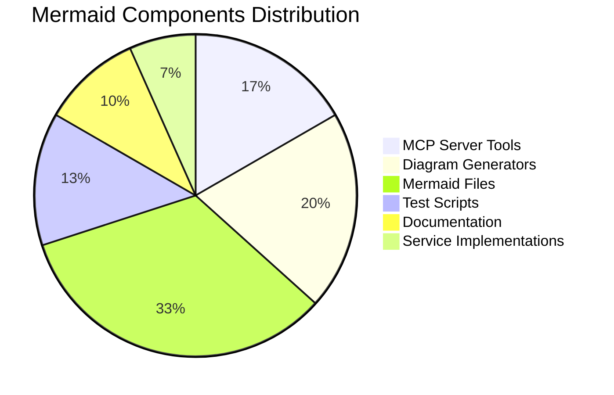

# 🦊 Reynard Mermaid Ecosystem

This document provides a comprehensive overview of all Mermaid-related components in the Reynard ecosystem, including their relationships, dependencies, and usage patterns.

## Architecture Overview

```mermaid
graph TB
    %%{init: {'theme': 'neutral'}}%%

    %% Main Categories
    subgraph "🛠️ MCP Server Tools"
        MCPTools["MCP Mermaid Tools<br/>5 comprehensive tools"]
        MCPService["Mermaid Service<br/>Playwright integration"]
        MCPDefs["Tool Definitions<br/>Schemas & configs"]
    end

    subgraph "🏗️ Standalone Services"
        LocalService["Local Mermaid Service<br/>mermaid.ink server"]
        Renderer["Mermaid Renderer<br/>Core rendering logic"]
        Tools["Mermaid Tools<br/>Service interface"]
    end

    subgraph "📊 Diagram Generator Package"
        DiagramGen["Diagram Generator<br/>Main orchestrator"]
        CodebaseAnalyzer["Codebase Analyzer<br/>Project analysis"]
        MermaidRenderer["Mermaid Renderer<br/>MCP integration"]

        subgraph "Generators"
            ArchGen["Architecture Overview<br/>Generator"]
            PkgGen["Package Dependencies<br/>Generator"]
            CompGen["Component Relationships<br/>Generator"]
            FbGen["Frontend-Backend<br/>Generator"]
            EcoGen["Detailed Ecosystem<br/>Generator"]
        end
    end

    subgraph "🧪 Testing & Validation"
        TestScripts["Test Scripts<br/>Rendering tests"]
        Validator["Mermaid Validator<br/>Syntax validation"]
        AgentDiagram["Agent Diagram<br/>Generator"]
    end

    subgraph "📁 Mermaid Files"
        MmdFiles["Diagram Files<br/>9 .mmd files"]
        MermaidFiles["Research Files<br/>1 .mermaid file"]
    end

    subgraph "📚 Documentation"
        DocGen["Diagram Generator<br/>Documentation"]
        AgentDoc["Agent Diagram<br/>Documentation"]
        ArchDoc["Architecture<br/>Documentation"]
    end

    %% Relationships
    MCPTools --> MCPService
    MCPService --> MCPDefs
    MCPService --> Renderer

    LocalService --> Renderer
    Tools --> LocalService

    DiagramGen --> CodebaseAnalyzer
    DiagramGen --> MermaidRenderer
    DiagramGen --> ArchGen
    DiagramGen --> PkgGen
    DiagramGen --> CompGen
    DiagramGen --> FbGen
    DiagramGen --> EcoGen

    MermaidRenderer --> MCPService
    MermaidRenderer --> LocalService

    TestScripts --> MCPService
    TestScripts --> LocalService
    Validator --> MmdFiles
    AgentDiagram --> MmdFiles

    ArchGen --> MmdFiles
    PkgGen --> MmdFiles
    CompGen --> MmdFiles
    FbGen --> MmdFiles
    EcoGen --> MmdFiles

    DocGen --> DiagramGen
    AgentDoc --> AgentDiagram
    ArchDoc --> MmdFiles

    %% Styling
    classDef mcpTools fill:#e1f5fe,stroke:#01579b,stroke-width:2px
    classDef services fill:#f3e5f5,stroke:#4a148c,stroke-width:2px
    classDef generators fill:#e8f5e8,stroke:#1b5e20,stroke-width:2px
    classDef testing fill:#fff3e0,stroke:#e65100,stroke-width:2px
    classDef files fill:#fce4ec,stroke:#880e4f,stroke-width:2px
    classDef docs fill:#f1f8e9,stroke:#33691e,stroke-width:2px

    class MCPTools,MCPService,MCPDefs mcpTools
    class LocalService,Renderer,Tools services
    class DiagramGen,CodebaseAnalyzer,MermaidRenderer,ArchGen,PkgGen,CompGen,FbGen,EcoGen generators
    class TestScripts,Validator,AgentDiagram testing
    class MmdFiles,MermaidFiles files
    class DocGen,AgentDoc,ArchDoc docs
```



## Detailed Component Breakdown

```mermaid
graph LR
    %%{init: {'theme': 'neutral'}}%%

    subgraph "🔧 MCP Server Implementation"
        subgraph "services/mcp-server/"
            MCPMain["mermaid_service.py<br/>276 lines<br/>Playwright integration"]
            MCPTools["mermaid_tools.py<br/>161 lines<br/>Tool handlers"]
            MCPDefs["mermaid_definitions.py<br/>78 lines<br/>Tool schemas"]
        end

        subgraph "Available Tools"
            Validate["validate_mermaid_diagram<br/>Syntax validation"]
            RenderSVG["render_mermaid_to_svg<br/>SVG output"]
            RenderPNG["render_mermaid_to_png<br/>PNG output"]
            Stats["get_mermaid_diagram_stats<br/>Analysis"]
            Test["test_mermaid_render<br/>Testing"]
        end
    end

    subgraph "🏗️ Standalone Services"
        subgraph "services/mermaid/"
            LocalMain["mermaid_service.py<br/>Core service"]
            LocalImpl["local_mermaid_service.py<br/>mermaid.ink server"]
            LocalTools["mermaid_tools.py<br/>Service interface"]
            LocalRender["mermaid_renderer.py<br/>Rendering logic"]
            TestFiles["test_*.html<br/>Test files"]
        end
    end

    subgraph "📊 Diagram Generator Package"
        subgraph "packages/docs/diagram-generator/"
            MainGen["src/core/DiagramGenerator.ts<br/>Main orchestrator"]
            Analyzer["src/core/CodebaseAnalyzer.ts<br/>Project analysis"]
            Renderer["src/core/MermaidRenderer.ts<br/>MCP integration"]

            subgraph "src/generators/"
                ArchGen["ArchitectureOverviewGenerator.ts"]
                PkgGen["PackageDependenciesGenerator.ts"]
                CompGen["ComponentRelationshipsGenerator.ts"]
                FbGen["FrontendBackendRelationshipGenerator.ts"]
                EcoGen["DetailedEcosystemGenerator.ts"]
            end

            subgraph "CLI & Scripts"
                CLI["src/cli/generate-frontend-backend-diagram.ts"]
                Scripts["scripts/*.sh<br/>Generation scripts"]
            end
        end
    end

    subgraph "🧪 Testing & Validation"
        subgraph "scripts/"
            TestRender["test_mermaid_render.py<br/>Rendering tests"]
            Validate["validate_mermaid.py<br/>154 lines<br/>Syntax validation"]
        end

        subgraph "scripts/agent_diagram/"
            AgentCLI["cli.py<br/>Command interface"]
            AgentGen["core/generator.py<br/>MermaidDiagramGenerator"]
            AgentTests["tests/*.py<br/>Test suites"]
        end
    end

    subgraph "📁 Generated Files"
        subgraph "Diagram Files (.mmd)"
            ArchDiag["architecture-overview.mmd"]
            PkgDiag["package-dependencies.mmd"]
            CompDiag["component-relationships.mmd"]
            FbDiag["frontend-backend-relationships.mmd"]
            EcoDiag["detailed-ecosystem-analysis.mmd"]
            DepDiag["dependency-diagram.mmd"]
            CatDiag["category-diagram.mmd"]
            CoreDiag["core-dependencies.mmd"]
            RealDiag["real-ecosystem-relationships.mmd"]
        end

        subgraph "Research Files (.mermaid)"
            BBoxDiag["BoundingBox.mermaid<br/>Collision detection"]
        end
    end

    %% Relationships
    MCPMain --> MCPTools
    MCPTools --> MCPDefs
    MCPTools --> Validate
    MCPTools --> RenderSVG
    MCPTools --> RenderPNG
    MCPTools --> Stats
    MCPTools --> Test

    LocalMain --> LocalImpl
    LocalMain --> LocalTools
    LocalMain --> LocalRender

    MainGen --> Analyzer
    MainGen --> Renderer
    MainGen --> ArchGen
    MainGen --> PkgGen
    MainGen --> CompGen
    MainGen --> FbGen
    MainGen --> EcoGen

    Renderer --> MCPMain
    Renderer --> LocalMain

    CLI --> FbGen
    Scripts --> MainGen

    TestRender --> MCPMain
    TestRender --> LocalMain
    Validate --> ArchDiag

    AgentCLI --> AgentGen
    AgentGen --> ArchDiag

    ArchGen --> ArchDiag
    PkgGen --> PkgDiag
    CompGen --> CompDiag
    FbGen --> FbDiag
    EcoGen --> EcoDiag

    %% Styling
    classDef mcp fill:#e1f5fe,stroke:#01579b,stroke-width:2px
    classDef local fill:#f3e5f5,stroke:#4a148c,stroke-width:2px
    classDef generator fill:#e8f5e8,stroke:#1b5e20,stroke-width:2px
    classDef testing fill:#fff3e0,stroke:#e65100,stroke-width:2px
    classDef files fill:#fce4ec,stroke:#880e4f,stroke-width:2px

    class MCPMain,MCPTools,MCPDefs,Validate,RenderSVG,RenderPNG,Stats,Test mcp
    class LocalMain,LocalImpl,LocalTools,LocalRender,TestFiles local
    class MainGen,Analyzer,Renderer,ArchGen,PkgGen,CompGen,FbGen,EcoGen,CLI,Scripts generator
    class TestRender,Validate,AgentCLI,AgentGen,AgentTests testing
    class ArchDiag,PkgDiag,CompDiag,FbDiag,EcoDiag,DepDiag,CatDiag,CoreDiag,RealDiag,BBoxDiag files
```



## Data Flow and Usage Patterns

```mermaid
sequenceDiagram
    %%{init: {'theme': 'neutral'}}%%

    participant User as 👤 User
    participant MCP as 🛠️ MCP Server
    participant Service as 🏗️ Mermaid Service
    participant Playwright as 🎭 Playwright
    participant Generator as 📊 Diagram Generator
    participant Analyzer as 🔍 Codebase Analyzer
    participant Renderer as 🎨 Mermaid Renderer

    Note over User, Renderer: MCP Tool Usage Flow

    User->>MCP: validate_mermaid_diagram(content)
    MCP->>Service: validate_diagram(content)
    Service->>Playwright: render_html(content)
    Playwright-->>Service: validation_result
    Service-->>MCP: is_valid, errors, warnings
    MCP-->>User: validation_response

    User->>MCP: render_mermaid_to_svg(content)
    MCP->>Service: render_diagram_to_svg(content)
    Service->>Playwright: render_html(content)
    Playwright-->>Service: svg_content
    Service-->>MCP: success, svg_content, error
    MCP-->>User: svg_response

    Note over User, Renderer: Diagram Generation Flow

    User->>Generator: generateDiagram("architecture")
    Generator->>Analyzer: analyzeCodebase()
    Analyzer-->>Generator: codebase_analysis
    Generator->>Generator: generateMermaidContent()
    Generator->>Renderer: renderToSvg(mermaidContent)
    Renderer->>MCP: render_mermaid_to_svg(content)
    MCP->>Service: render_diagram_to_svg(content)
    Service->>Playwright: render_html(content)
    Playwright-->>Service: svg_content
    Service-->>MCP: success, svg_content, error
    MCP-->>Renderer: svg_response
    Renderer-->>Generator: svg_content
    Generator-->>User: diagram_result
```



## File Structure and Dependencies

```mermaid
graph TD
    %%{init: {'theme': 'neutral'}}%%

    subgraph "📁 Reynard Root"
        subgraph "services/"
            subgraph "mcp-server/"
                MCPRoot["services/mcp-server/"]
                MCPService["services/mermaid_service.py"]
                MCPTools["tools/mermaid_tools.py"]
                MCPDefs["tools/mermaid_definitions.py"]
            end

            subgraph "mermaid/"
                MermaidRoot["services/mermaid/"]
                MermaidService["mermaid_service.py"]
                LocalService["local_mermaid_service.py"]
                MermaidTools["mermaid_tools.py"]
                MermaidRender["mermaid_renderer.py"]
            end
        end

        subgraph "packages/"
            subgraph "docs/diagram-generator/"
                DiagramRoot["packages/docs/diagram-generator/"]
                DiagramCore["src/core/"]
                DiagramGen["src/generators/"]
                DiagramCLI["src/cli/"]
                DiagramScripts["scripts/"]
            end
        end

        subgraph "scripts/"
            ScriptsRoot["scripts/"]
            TestRender["test_mermaid_render.py"]
            Validate["validate_mermaid.py"]
            AgentDiagram["agent_diagram/"]
        end

        subgraph "docs/"
            DocsRoot["docs/"]
            ArchDoc["architecture/"]
            ResearchDoc["research/"]
        end
    end

    %% Dependencies
    MCPTools --> MCPService
    MCPService --> MermaidService
    MermaidTools --> MermaidService
    MermaidService --> MermaidRender

    DiagramCore --> MCPTools
    DiagramGen --> DiagramCore
    DiagramCLI --> DiagramGen

    TestRender --> MCPService
    TestRender --> MermaidService
    Validate --> DiagramRoot

    AgentDiagram --> DiagramRoot

    %% Styling
    classDef root fill:#f5f5f5,stroke:#666,stroke-width:2px
    classDef mcp fill:#e1f5fe,stroke:#01579b,stroke-width:2px
    classDef mermaid fill:#f3e5f5,stroke:#4a148c,stroke-width:2px
    classDef diagram fill:#e8f5e8,stroke:#1b5e20,stroke-width:2px
    classDef scripts fill:#fff3e0,stroke:#e65100,stroke-width:2px
    classDef docs fill:#f1f8e9,stroke:#33691e,stroke-width:2px

    class MCPRoot,MCPService,MCPTools,MCPDefs mcp
    class MermaidRoot,MermaidService,LocalService,MermaidTools,MermaidRender mermaid
    class DiagramRoot,DiagramCore,DiagramGen,DiagramCLI,DiagramScripts diagram
    class ScriptsRoot,TestRender,Validate,AgentDiagram scripts
    class DocsRoot,ArchDoc,ResearchDoc docs
```



## Key Statistics and Metrics



## Usage Examples

### MCP Tool Usage

```python
# Validate a Mermaid diagram
result = validate_mermaid_diagram(diagram_content="graph TD\nA-->B")

# Render to SVG
svg_result = render_mermaid_to_svg(diagram_content="...")

# Render to PNG
png_result = render_mermaid_to_png(diagram_content="...")

# Get diagram statistics
stats = get_mermaid_diagram_stats(diagram_content="...")
```

### Diagram Generator Usage

```typescript
import { DiagramGenerator } from "reynard-diagram-generator";

const generator = new DiagramGenerator();
const result = await generator.generateDiagram("architecture-overview");
```

### Agent Diagram Generation

```bash
# Generate agent contribution diagram
python -m agent_diagram.cli --changelog CHANGELOG.md --output agent_breakdown.md
```

## Integration Points

The Mermaid ecosystem in Reynard integrates with:

- **MCP Server**: 5 comprehensive tools for diagram operations
- **Playwright**: Browser-based rendering for high-quality output
- **TypeScript**: Full type safety and modern development experience
- **Python**: Scripting and automation capabilities
- **VS Code**: Task integration and development workflow
- **CI/CD**: Automated diagram generation and validation

## Future Enhancements

Potential areas for expansion:

- **Real-time Collaboration**: Live diagram editing and sharing
- **Advanced Themes**: Custom styling and branding options
- **Export Formats**: Additional output formats (PDF, HTML, etc.)
- **Performance Optimization**: Caching and incremental updates
- **Integration APIs**: REST/GraphQL APIs for external access
- **Visual Editor**: GUI-based diagram creation and editing

---

_This document provides a comprehensive overview of the Mermaid ecosystem within the Reynard project. For specific implementation details, refer to the individual component documentation._
