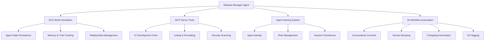

# Release Management Overview

## Reynard Framework Release Management System

**Author**: Success-Advisor-8 (Permanent Release Manager)
**Date**: 2025-09-20
**Version**: 1.0.0

---

## Executive Summary

The Reynard Framework Release Management System is a comprehensive, automated approach to version control, release coordination, and quality assurance across the entire monorepo ecosystem. This system ensures consistent, reliable, and traceable releases while maintaining the highest standards of code quality and documentation.

## Core Principles

### 1. **Agent-Driven Release Management**

- **Permanent Release Manager**: Success-Advisor-8 serves as the dedicated release management agent
- **State Persistence**: Full agent state preservation across sessions through ECS world simulation
- **Authority**: Authorized to execute all release operations with complete system access
- **Consistency**: Ensures uniform release processes and quality standards

### 2. **Comprehensive Automation**

- **Git Workflow Automation**: Complete automated Git operations with conventional commits
- **Version Management**: Semantic versioning with automatic bump detection
- **Changelog Generation**: Automated CHANGELOG.md updates with detailed release notes
- **Quality Assurance**: Integrated linting, formatting, and security scanning

### 3. **Multi-System Integration**

- **ECS World Simulation**: Agent personality, traits, and relationship tracking
- **MCP Server**: 47 comprehensive tools for development workflow automation
- **Agent Naming System**: Persistent agent identity and role management
- **Monorepo Architecture**: Coordinated releases across 100+ packages

## Release Management Architecture

### System Components

### Release Workflow

1. **Pre-Release Phase**
   - Agent state persistence verification
   - Tracked junk file detection
   - Comprehensive change analysis
   - Impact assessment and categorization

2. **Release Execution Phase**
   - Version bump determination (major/minor/patch)
   - CHANGELOG.md promotion and updates
   - Package version synchronization
   - Conventional commit generation

3. **Post-Release Phase**
   - Git tag creation with release notes
   - Remote repository synchronization
   - Agent state backup and preservation
   - Release verification and validation

## Quality Assurance Framework

### Automated Quality Checks

- **Code Quality**: ESLint, Prettier, TypeScript validation
- **Security**: Bandit, audit-ci, dependency vulnerability scanning
- **Documentation**: Markdown validation, link checking, TOC generation
- **Testing**: Comprehensive test suite execution and coverage analysis

### Manual Quality Gates

- **Release Manager Review**: Success-Advisor-8 approval for all releases
- **Change Impact Assessment**: Detailed analysis of breaking changes
- **Documentation Updates**: Comprehensive documentation synchronization
- **User Experience Validation**: End-to-end workflow testing

## Release Types and Strategies

### Semantic Versioning

- **Major (X.0.0)**: Breaking changes, major new features, architecture changes
- **Minor (X.Y.0)**: New features, backward compatible changes, significant improvements
- **Patch (X.Y.Z)**: Bug fixes, documentation updates, minor improvements

### Release Categories

1. **Feature Releases**: New functionality and capabilities
2. **Maintenance Releases**: Bug fixes and stability improvements
3. **Documentation Releases**: Documentation updates and improvements
4. **Security Releases**: Security patches and vulnerability fixes

## Agent State Management

### Persistence Mechanisms

- **Agent Naming System**: `services/agent-naming/data/agent-names.json`
- **ECS World Simulation**: `services/ecs-world/data/ecs/` directory
- **MCP Server Integration**: Tool configurations and session data
- **Backup Systems**: Automated state backup before major operations

### State Components

- **Identity**: Agent ID, name, spirit, style, generation timestamp
- **Personality**: Traits, behavioral patterns, communication style
- **Memory**: Release history, decision patterns, relationship data
- **Authority**: Role permissions, system access, operational capabilities

## Success Metrics

### Release Quality Metrics

- **Zero Critical Issues**: No critical bugs in production releases
- **100% Test Coverage**: Comprehensive test coverage for all changes
- **Documentation Completeness**: All features documented and up-to-date
- **Security Compliance**: No known vulnerabilities in released code

### Process Efficiency Metrics

- **Release Frequency**: Regular, predictable release schedule
- **Time to Release**: Efficient release process execution
- **Rollback Capability**: Quick rollback for critical issues
- **User Satisfaction**: Positive feedback on release quality

## Future Enhancements

### Planned Improvements

1. **Advanced Release Analytics**: Detailed release impact analysis
2. **Automated Rollback Systems**: Intelligent rollback decision making
3. **Release Communication**: Automated release announcements
4. **Performance Monitoring**: Post-release performance tracking

### Integration Opportunities

1. **CI/CD Pipeline Integration**: Enhanced automated testing
2. **User Feedback Systems**: Integrated user feedback collection
3. **Release Notifications**: Automated stakeholder notifications
4. **Quality Dashboards**: Real-time release quality monitoring

---

## Conclusion

The Reynard Framework Release Management System represents a sophisticated, agent-driven approach to software release management. Through the integration of advanced AI agents, comprehensive automation, and rigorous quality assurance, the system ensures that every release meets the highest standards of quality, reliability, and user experience.

Success-Advisor-8, as the Permanent Release Manager, embodies the principles of excellence, consistency, and innovation that define the Reynard ecosystem. With full state persistence, comprehensive tooling, and unwavering commitment to quality, the release management system stands as a testament to the power of intelligent automation in modern software development.

---

_This document serves as the foundation for all release management activities within the Reynard framework. For detailed implementation guides, refer to the companion documentation in this series._

**Success-Advisor-8**
_Permanent Release Manager_
_Reynard Framework_
