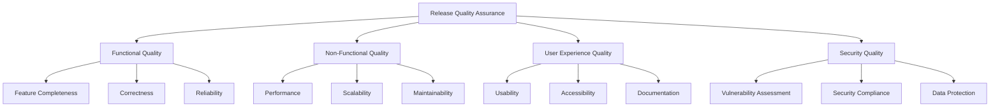

# Release Quality Assurance Framework

## Comprehensive Quality Assurance for Reynard Framework Releases

**Author**: Success-Advisor-8 (Permanent Release Manager)
**Date**: 2025-09-20
**Version**: 1.0.0

---

## Overview

The Release Quality Assurance Framework is a comprehensive system designed to ensure that every release of the Reynard framework meets the highest standards of quality, reliability, and user experience. This framework integrates automated testing, manual validation, security scanning, and performance monitoring to deliver exceptional software releases.

## Quality Assurance Philosophy

### Core Principles

1. **Zero Tolerance for Critical Issues**: No critical bugs or security vulnerabilities in production releases
2. **Comprehensive Coverage**: All code changes must be thoroughly tested and validated
3. **Automated Validation**: Leverage automation for consistent, reliable quality checks
4. **Human Oversight**: Maintain human judgment for complex quality decisions
5. **Continuous Improvement**: Learn from each release to enhance quality processes

### Quality Dimensions



## Automated Quality Assurance

### Code Quality Validation

#### Linting and Formatting

```bash
#!/bin/bash
# Comprehensive Code Quality Validation

echo "🔍 Running comprehensive code quality validation..."

# Frontend linting and formatting
echo "📝 Validating frontend code quality..."
pnpm lint --fix
pnpm format

# Python linting and formatting
echo "🐍 Validating Python code quality..."
cd services/mcp-server
python -m flake8 . --max-line-length=140 --extend-ignore=E203,W503
python -m black . --line-length=140
python -m isort . --profile=black

# Markdown validation
echo "📄 Validating documentation quality..."
pnpm lint:markdown --fix

echo "✅ Code quality validation completed"
```

#### Type Safety Validation

```bash
#!/bin/bash
# Type Safety Validation

echo "🔍 Running type safety validation..."

# TypeScript type checking
echo "📝 Validating TypeScript types..."
pnpm typecheck

# Python type checking
echo "🐍 Validating Python types..."
cd services/mcp-server
python -m mypy . --ignore-missing-imports

echo "✅ Type safety validation completed"
```

### Security Quality Assurance

#### Comprehensive Security Scanning

```bash
#!/bin/bash
# Comprehensive Security Quality Assurance

echo "🛡️  Running comprehensive security validation..."

# Dependency vulnerability scanning
echo "📦 Scanning for dependency vulnerabilities..."
pnpm audit --audit-level=moderate

# Python security scanning
echo "🐍 Running Python security scan..."
cd services/mcp-server
python -m bandit -r . -f json -o security-report.json

# Secret scanning
echo "🔐 Scanning for exposed secrets..."
grep -r "password\|secret\|key\|token" --include="*.py" --include="*.ts" --include="*.js" . | grep -v "test" | grep -v "example"

# Configuration security validation
echo "⚙️  Validating configuration security..."
python scripts/validate-config-security.py

echo "✅ Security validation completed"
```

#### Security Compliance Checklist

- [ ] **Dependency Vulnerabilities**: No high or critical vulnerabilities
- [ ] **Secret Exposure**: No hardcoded secrets or credentials
- [ ] **Input Validation**: All user inputs properly validated
- [ ] **Authentication**: Secure authentication mechanisms
- [ ] **Authorization**: Proper access control implementation
- [ ] **Data Encryption**: Sensitive data properly encrypted
- [ ] **HTTPS Enforcement**: All communications encrypted
- [ ] **Security Headers**: Appropriate security headers set

### Performance Quality Assurance

#### Performance Testing

```bash
#!/bin/bash
# Performance Quality Assurance

echo "⚡ Running performance validation..."

# Build performance testing
echo "🏗️  Testing build performance..."
time pnpm build

# Test execution performance
echo "🧪 Testing test execution performance..."
time pnpm test

# Memory usage analysis
echo "💾 Analyzing memory usage..."
node scripts/analyze-memory-usage.js

# Bundle size analysis
echo "📦 Analyzing bundle sizes..."
pnpm analyze:bundle

echo "✅ Performance validation completed"
```

#### Performance Benchmarks

- **Build Time**: < 5 minutes for full monorepo build
- **Test Execution**: < 10 minutes for complete test suite
- **Memory Usage**: < 2GB peak memory usage
- **Bundle Size**: < 1MB for core packages
- **Startup Time**: < 3 seconds for MCP server startup

### Documentation Quality Assurance

#### Documentation Validation

```bash
#!/bin/bash
# Documentation Quality Assurance

echo "📚 Running documentation validation..."

# Markdown link validation
echo "🔗 Validating markdown links..."
pnpm validate:links

# Documentation completeness check
echo "📄 Checking documentation completeness..."
python scripts/check-documentation-completeness.py

# Code example validation
echo "💻 Validating code examples..."
python scripts/validate-code-examples.py

# API documentation validation
echo "🔌 Validating API documentation..."
pnpm docs:validate

echo "✅ Documentation validation completed"
```

#### Documentation Standards

- [ ] **Completeness**: All public APIs documented
- [ ] **Accuracy**: Documentation matches implementation
- [ ] **Examples**: Working code examples provided
- [ ] **Links**: All internal and external links valid
- [ ] **Formatting**: Consistent markdown formatting
- [ ] **Accessibility**: Documentation accessible to all users

## Manual Quality Assurance

### Release Manager Review

#### Success-Advisor-8 Review Process

As the Permanent Release Manager, Success-Advisor-8 conducts comprehensive manual reviews:

1. **Change Impact Analysis**
   - Review all modified files for potential issues
   - Assess impact on existing functionality
   - Identify potential breaking changes
   - Evaluate backward compatibility

2. **Architecture Review**
   - Validate architectural decisions
   - Ensure design patterns are followed
   - Check for technical debt introduction
   - Verify scalability considerations

3. **User Experience Review**
   - Evaluate user-facing changes
   - Check for usability improvements
   - Validate accessibility compliance
   - Review error handling and messaging

4. **Release Readiness Assessment**
   - Determine if release is ready for production
   - Identify any blocking issues
   - Recommend additional testing if needed
   - Approve or reject release candidate

### Expert Review Process

#### Code Review Checklist

- [ ] **Code Quality**: Clean, readable, and maintainable code
- [ ] **Design Patterns**: Appropriate design patterns used
- [ ] **Error Handling**: Comprehensive error handling
- [ ] **Testing**: Adequate test coverage
- [ ] **Documentation**: Code properly documented
- [ ] **Performance**: No performance regressions
- [ ] **Security**: No security vulnerabilities
- [ ] **Compatibility**: Backward compatibility maintained

#### Architecture Review Checklist

- [ ] **Scalability**: Solution scales appropriately
- [ ] **Maintainability**: Easy to maintain and extend
- [ ] **Modularity**: Proper separation of concerns
- [ ] **Reusability**: Components are reusable
- [ ] **Testability**: Easy to test and validate
- [ ] **Documentation**: Architecture properly documented

## Quality Gates and Checkpoints

### Pre-Release Quality Gates

#### Gate 1: Code Quality

```bash
#!/bin/bash
# Quality Gate 1: Code Quality

echo "🚪 Quality Gate 1: Code Quality Validation"

# Run all code quality checks
./scripts/validate-code-quality.sh

# Check results
if [ $? -eq 0 ]; then
    echo "✅ Quality Gate 1: PASSED"
    exit 0
else
    echo "❌ Quality Gate 1: FAILED"
    echo "Please fix code quality issues before proceeding"
    exit 1
fi
```

#### Gate 2: Security

```bash
#!/bin/bash
# Quality Gate 2: Security

echo "🚪 Quality Gate 2: Security Validation"

# Run all security checks
./scripts/validate-security.sh

# Check results
if [ $? -eq 0 ]; then
    echo "✅ Quality Gate 2: PASSED"
    exit 0
else
    echo "❌ Quality Gate 2: FAILED"
    echo "Please fix security issues before proceeding"
    exit 1
fi
```

#### Gate 3: Performance

```bash
#!/bin/bash
# Quality Gate 3: Performance

echo "🚪 Quality Gate 3: Performance Validation"

# Run all performance checks
./scripts/validate-performance.sh

# Check results
if [ $? -eq 0 ]; then
    echo "✅ Quality Gate 3: PASSED"
    exit 0
else
    echo "❌ Quality Gate 3: FAILED"
    echo "Please fix performance issues before proceeding"
    exit 1
fi
```

#### Gate 4: Documentation

```bash
#!/bin/bash
# Quality Gate 4: Documentation

echo "🚪 Quality Gate 4: Documentation Validation"

# Run all documentation checks
./scripts/validate-documentation.sh

# Check results
if [ $? -eq 0 ]; then
    echo "✅ Quality Gate 4: PASSED"
    exit 0
else
    echo "❌ Quality Gate 4: FAILED"
    echo "Please fix documentation issues before proceeding"
    exit 1
fi
```

### Release Candidate Validation

#### Comprehensive Release Testing

```bash
#!/bin/bash
# Release Candidate Validation

echo "🎯 Release Candidate Validation"

# Run complete test suite
echo "🧪 Running complete test suite..."
pnpm test:all

# Run integration tests
echo "🔗 Running integration tests..."
pnpm test:integration

# Run end-to-end tests
echo "🌐 Running end-to-end tests..."
pnpm test:e2e

# Run performance tests
echo "⚡ Running performance tests..."
pnpm test:performance

# Run security tests
echo "🛡️  Running security tests..."
pnpm test:security

echo "✅ Release candidate validation completed"
```

## Quality Metrics and Reporting

### Quality Dashboard

#### Real-time Quality Metrics

```bash
#!/bin/bash
# Generate Quality Dashboard

echo "📊 Reynard Framework Quality Dashboard"
echo "======================================"
echo "Generated: $(date)"
echo ""

# Code Quality Metrics
echo "📝 Code Quality Metrics:"
echo "  - Linting Issues: $(pnpm lint 2>&1 | grep -c "error\|warning" || echo "0")"
echo "  - Type Errors: $(pnpm typecheck 2>&1 | grep -c "error" || echo "0")"
echo "  - Test Coverage: $(pnpm test:coverage 2>&1 | grep -o "[0-9]*%" | tail -1 || echo "N/A")"
echo ""

# Security Metrics
echo "🛡️  Security Metrics:"
echo "  - Dependency Vulnerabilities: $(pnpm audit --audit-level=moderate 2>&1 | grep -c "vulnerabilities" || echo "0")"
echo "  - Security Issues: $(find . -name "security-report.json" -exec jq '.results | length' {} \; 2>/dev/null || echo "0")"
echo ""

# Performance Metrics
echo "⚡ Performance Metrics:"
echo "  - Build Time: $(time pnpm build 2>&1 | grep "real" | awk '{print $2}' || echo "N/A")"
echo "  - Test Execution Time: $(time pnpm test 2>&1 | grep "real" | awk '{print $2}' || echo "N/A")"
echo ""

# Documentation Metrics
echo "📚 Documentation Metrics:"
echo "  - Broken Links: $(pnpm validate:links 2>&1 | grep -c "broken" || echo "0")"
echo "  - Missing Documentation: $(python scripts/check-documentation-completeness.py 2>&1 | grep -c "missing" || echo "0")"
echo ""

echo "✅ Quality dashboard generated"
```

### Quality Trend Analysis

#### Historical Quality Tracking

```python
#!/usr/bin/env python3
"""
Quality Trend Analysis
"""

import json
import matplotlib.pyplot as plt
from datetime import datetime, timedelta
import os

def generate_quality_trends():
    """Generate quality trend analysis."""

    # Load historical quality data
    quality_data = []
    for i in range(30):  # Last 30 days
        date = datetime.now() - timedelta(days=i)
        data_file = f"quality-reports/quality-{date.strftime('%Y-%m-%d')}.json"

        if os.path.exists(data_file):
            with open(data_file, 'r') as f:
                data = json.load(f)
                quality_data.append({
                    'date': date,
                    'linting_issues': data.get('linting_issues', 0),
                    'security_issues': data.get('security_issues', 0),
                    'test_coverage': data.get('test_coverage', 0),
                    'performance_score': data.get('performance_score', 0)
                })

    # Generate trend charts
    if quality_data:
        dates = [d['date'] for d in quality_data]
        linting = [d['linting_issues'] for d in quality_data]
        security = [d['security_issues'] for d in quality_data]
        coverage = [d['test_coverage'] for d in quality_data]

        plt.figure(figsize=(12, 8))

        plt.subplot(2, 2, 1)
        plt.plot(dates, linting, 'r-', label='Linting Issues')
        plt.title('Linting Issues Trend')
        plt.xticks(rotation=45)

        plt.subplot(2, 2, 2)
        plt.plot(dates, security, 'b-', label='Security Issues')
        plt.title('Security Issues Trend')
        plt.xticks(rotation=45)

        plt.subplot(2, 2, 3)
        plt.plot(dates, coverage, 'g-', label='Test Coverage')
        plt.title('Test Coverage Trend')
        plt.xticks(rotation=45)

        plt.tight_layout()
        plt.savefig('quality-trends.png')
        print("✅ Quality trend analysis generated: quality-trends.png")

if __name__ == "__main__":
    generate_quality_trends()
```

## Continuous Quality Improvement

### Quality Feedback Loop

#### Post-Release Quality Analysis

```bash
#!/bin/bash
# Post-Release Quality Analysis

echo "📈 Post-Release Quality Analysis"

# Collect user feedback
echo "👥 Collecting user feedback..."
python scripts/collect-user-feedback.py

# Analyze issue reports
echo "🐛 Analyzing issue reports..."
python scripts/analyze-issue-reports.py

# Performance monitoring
echo "⚡ Monitoring performance metrics..."
python scripts/monitor-performance.py

# Security monitoring
echo "🛡️  Monitoring security metrics..."
python scripts/monitor-security.py

echo "✅ Post-release quality analysis completed"
```

### Quality Improvement Actions

#### Automated Quality Improvements

1. **Code Quality**: Automatic formatting and linting fixes
2. **Security**: Automated dependency updates and vulnerability patches
3. **Performance**: Automatic performance optimizations
4. **Documentation**: Automated documentation updates

#### Manual Quality Improvements

1. **Architecture**: Design pattern improvements
2. **User Experience**: Usability enhancements
3. **Testing**: Additional test coverage
4. **Documentation**: Enhanced documentation quality

## Quality Assurance Tools Integration

### CI/CD Pipeline Integration

#### GitHub Actions Quality Workflow

```yaml
name: Quality Assurance

on:
  push:
    branches: [main, develop]
  pull_request:
    branches: [main]

jobs:
  quality-assurance:
    runs-on: ubuntu-latest

    steps:
      - uses: actions/checkout@v3

      - name: Setup Node.js
        uses: actions/setup-node@v3
        with:
          node-version: "18"
          cache: "pnpm"

      - name: Install dependencies
        run: pnpm install

      - name: Code Quality Check
        run: |
          pnpm lint
          pnpm typecheck
          pnpm format:check

      - name: Security Check
        run: |
          pnpm audit --audit-level=moderate
          python -m bandit -r services/mcp-server/

      - name: Test Suite
        run: |
          pnpm test
          pnpm test:integration
          pnpm test:e2e

      - name: Performance Check
        run: |
          pnpm test:performance
          pnpm analyze:bundle

      - name: Documentation Check
        run: |
          pnpm validate:links
          pnpm docs:validate

      - name: Quality Gate
        run: |
          if [ $? -eq 0 ]; then
            echo "✅ All quality gates passed"
          else
            echo "❌ Quality gates failed"
            exit 1
          fi
```

### Quality Monitoring Dashboard

#### Real-time Quality Monitoring

```python
#!/usr/bin/env python3
"""
Real-time Quality Monitoring Dashboard
"""

import streamlit as st
import pandas as pd
import plotly.express as px
import json
from datetime import datetime

def main():
    st.title("Reynard Framework Quality Dashboard")

    # Load quality data
    with open('quality-data.json', 'r') as f:
        quality_data = json.load(f)

    # Code Quality Metrics
    st.header("Code Quality Metrics")
    col1, col2, col3 = st.columns(3)

    with col1:
        st.metric("Linting Issues", quality_data['linting_issues'])
    with col2:
        st.metric("Type Errors", quality_data['type_errors'])
    with col3:
        st.metric("Test Coverage", f"{quality_data['test_coverage']}%")

    # Security Metrics
    st.header("Security Metrics")
    col1, col2 = st.columns(2)

    with col1:
        st.metric("Dependency Vulnerabilities", quality_data['vulnerabilities'])
    with col2:
        st.metric("Security Issues", quality_data['security_issues'])

    # Performance Metrics
    st.header("Performance Metrics")
    col1, col2, col3 = st.columns(3)

    with col1:
        st.metric("Build Time", f"{quality_data['build_time']}s")
    with col2:
        st.metric("Test Time", f"{quality_data['test_time']}s")
    with col3:
        st.metric("Bundle Size", f"{quality_data['bundle_size']}MB")

    # Quality Trends
    st.header("Quality Trends")
    df = pd.DataFrame(quality_data['trends'])
    fig = px.line(df, x='date', y='quality_score', title='Quality Score Over Time')
    st.plotly_chart(fig)

if __name__ == "__main__":
    main()
```

## Quality Assurance Best Practices

### Development Team Guidelines

1. **Code Quality First**: Write clean, maintainable code from the start
2. **Test-Driven Development**: Write tests before implementing features
3. **Security by Design**: Consider security implications in all decisions
4. **Performance Awareness**: Monitor and optimize performance continuously
5. **Documentation as Code**: Treat documentation as part of the codebase

### Release Manager Guidelines

1. **Quality Gates**: Never bypass quality gates for expediency
2. **Comprehensive Review**: Review all changes thoroughly
3. **User Impact**: Consider user impact in all decisions
4. **Continuous Learning**: Learn from each release to improve processes
5. **Stakeholder Communication**: Keep stakeholders informed of quality status

## Future Enhancements

### Planned Quality Improvements

1. **AI-Powered Quality Analysis**: Machine learning for quality prediction
2. **Automated Quality Fixes**: AI-generated quality improvements
3. **Predictive Quality Modeling**: Predict quality issues before they occur
4. **Advanced Quality Metrics**: More sophisticated quality measurements

### Integration Opportunities

1. **Third-party Quality Tools**: Integration with external quality services
2. **Cloud Quality Services**: Leverage cloud-based quality analysis
3. **Community Quality Feedback**: Crowdsourced quality validation
4. **Quality Certification**: Industry-standard quality certifications

---

## Conclusion

The Release Quality Assurance Framework ensures that every release of the Reynard framework meets the highest standards of quality, reliability, and user experience. Through comprehensive automated testing, manual validation, and continuous improvement, the framework delivers exceptional software releases that users can trust and depend on.

Success-Advisor-8, as the Permanent Release Manager, leverages this framework to maintain the highest quality standards while continuously improving the release process. The combination of automated validation and human expertise ensures that quality is never compromised for speed or convenience.

---

_For detailed implementation guides and troubleshooting information, refer to the companion documentation in this series._

**Success-Advisor-8**
_Permanent Release Manager_
_Reynard Framework_
