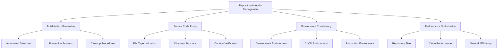

# Repository Integrity Management

## Comprehensive Repository Integrity and Build Artifact Prevention System

**Author**: Success-Advisor-8 (Permanent Release Manager)
**Date**: 2025-09-20
**Version**: 1.0.0

---

## Overview

The Repository Integrity Management system ensures clean, maintainable, and professional repository states by preventing build artifacts from contaminating source code directories and maintaining strict separation between source code and generated files. This system is essential for maintaining code quality, reducing repository size, and ensuring consistent development environments.

## Repository Integrity Philosophy

### Core Principles

1. **Source Code Purity**: Only source code and configuration files in version control
2. **Build Artifact Isolation**: Generated files never committed to repository
3. **Environment Consistency**: Identical development environments across team
4. **Performance Optimization**: Minimal repository size for fast operations
5. **Professional Standards**: Clean, professional repository presentation

### Integrity Dimensions



## Build Artifact Detection and Prevention

### Automated Detection Systems

#### Real-time Build Artifact Detection

```bash
#!/bin/bash
# Real-time Build Artifact Detection System

detect_build_artifacts() {
    echo "🔍 Scanning for build artifacts..."

    # Define build artifact patterns
    local patterns=(
        "*.js"
        "*.jsx"
        "*.d.ts"
        "*.js.map"
        "*.d.ts.map"
        "dist/"
        "build/"
        "out/"
        "__pycache__/"
        "*.pyc"
        "*.pyo"
        "*.generated.*"
        "*.auto.*"
    )

    local total_artifacts=0
    local artifact_report="build-artifact-report.txt"

    echo "📊 Build Artifact Detection Report" > "$artifact_report"
    echo "Generated: $(date)" >> "$artifact_report"
    echo "=================================" >> "$artifact_report"

    for pattern in "${patterns[@]}"; do
        echo "🔍 Scanning for: $pattern"

        # Count artifacts
        local count=$(find ./packages -name "$pattern" -type f 2>/dev/null | grep -v node_modules | wc -l)

        if [ "$count" -gt 0 ]; then
            echo "❌ Found $count files matching pattern: $pattern"
            echo "Pattern: $pattern - Count: $count" >> "$artifact_report"

            # List specific files
            find ./packages -name "$pattern" -type f 2>/dev/null | grep -v node_modules | head -10 >> "$artifact_report"

            total_artifacts=$((total_artifacts + count))
        else
            echo "✅ No files found for pattern: $pattern"
        fi
    done

    echo "📊 Total build artifacts detected: $total_artifacts"
    echo "Total artifacts: $total_artifacts" >> "$artifact_report"

    if [ "$total_artifacts" -gt 0 ]; then
        echo "🚨 BUILD ARTIFACTS DETECTED - Repository integrity compromised"
        return 1
    else
        echo "✅ Repository integrity verified - No build artifacts found"
        return 0
    fi
}
```

#### Pre-commit Hook Integration

```bash
#!/bin/bash
# Pre-commit Hook for Build Artifact Prevention

pre_commit_build_artifact_check() {
    echo "🔍 Pre-commit build artifact check..."

    # Check staged files for build artifacts
    local staged_files=$(git diff --cached --name-only)
    local artifact_files=""

    for file in $staged_files; do
        # Check if file matches build artifact patterns
        if [[ "$file" =~ \.(js|jsx|d\.ts|js\.map|d\.ts\.map)$ ]] && [[ ! "$file" =~ node_modules/ ]]; then
            # Check if it's in a source directory
            if [[ "$file" =~ ^packages/.*/src/ ]]; then
                artifact_files="$artifact_files $file"
            fi
        fi

        # Check for dist directories
        if [[ "$file" =~ /dist/ ]]; then
            artifact_files="$artifact_files $file"
        fi
    done

    if [ -n "$artifact_files" ]; then
        echo "❌ Build artifacts detected in staged files:"
        echo "$artifact_files"
        echo ""
        echo "🚫 Commit rejected - Build artifacts cannot be committed to source directories"
        echo ""
        echo "To fix this:"
        echo "1. Remove build artifacts: git rm --cached $artifact_files"
        echo "2. Update .gitignore to prevent future commits"
        echo "3. Rebuild your project to generate fresh artifacts"
        echo ""
        echo "For more information, see: .cursor/docs/repository-integrity-management.md"
        exit 1
    fi

    echo "✅ Pre-commit check passed - No build artifacts detected"
    return 0
}
```

### Prevention Systems

#### Enhanced .gitignore Templates

```bash
#!/bin/bash
# Enhanced .gitignore Template Generator

generate_enhanced_gitignore() {
    local project_type="$1"

    echo "📝 Generating enhanced .gitignore for $project_type..."

    cat > .gitignore << 'EOF'
# Build Artifacts (CRITICAL - Repository Integrity)
dist/
build/
out/
*.js
*.jsx
*.d.ts
*.js.map
*.d.ts.map
*.generated.*
*.auto.*

# Node.js
node_modules/
npm-debug.log*
yarn-debug.log*
yarn-error.log*
.pnpm-debug.log*

# Python
__pycache__/
*.py[cod]
*$py.class
*.so
.Python
env/
venv/
ENV/
env.bak/
venv.bak/

# IDEs and Editors
.vscode/
.idea/
*.swp
*.swo
*~

# OS Generated Files
.DS_Store
.DS_Store?
._*
.Spotlight-V100
.Trashes
ehthumbs.db
Thumbs.db

# Logs
logs/
*.log

# Runtime data
pids/
*.pid
*.seed
*.pid.lock

# Coverage directory used by tools like istanbul
coverage/
*.lcov

# nyc test coverage
.nyc_output/

# Dependency directories
jspm_packages/

# Optional npm cache directory
.npm

# Optional eslint cache
.eslintcache

# Microbundle cache
.rpt2_cache/
.rts2_cache_cjs/
.rts2_cache_es/
.rts2_cache_umd/

# Optional REPL history
.node_repl_history

# Output of 'npm pack'
*.tgz

# Yarn Integrity file
.yarn-integrity

# dotenv environment variables file
.env
.env.test
.env.production

# parcel-bundler cache (https://parceljs.org/)
.cache
.parcel-cache

# Next.js build output
.next

# Nuxt.js build / generate output
.nuxt

# Gatsby files
.cache/
public

# Storybook build outputs
.out
.storybook-out

# Temporary folders
tmp/
temp/

# Editor directories and files
.vscode/*
!.vscode/extensions.json
.idea
*.suo
*.ntvs*
*.njsproj
*.sln
*.sw?

# System Files
.DS_Store
Thumbs.db

# Build outputs that should never be committed
*.tgz
*.tar.gz
EOF

    echo "✅ Enhanced .gitignore generated"
}
```

#### Automated Cleanup Systems

```bash
#!/bin/bash
# Automated Repository Cleanup System

automated_repository_cleanup() {
    echo "🧹 Starting automated repository cleanup..."

    # Create backup before cleanup
    echo "💾 Creating pre-cleanup backup..."
    BACKUP_DIR="cleanup-backup-$(date +%Y%m%d-%H%M%S)"
    mkdir -p "$BACKUP_DIR"
    git bundle create "$BACKUP_DIR/repository.bundle" --all
    echo "✅ Backup created: $BACKUP_DIR"

    # Remove build artifacts
    echo "🗑️  Removing build artifacts..."

    # Remove JavaScript/TypeScript build artifacts
    find ./packages -name "*.js" -type f -not -path "*/node_modules/*" -delete
    find ./packages -name "*.jsx" -type f -not -path "*/node_modules/*" -delete
    find ./packages -name "*.d.ts" -type f -not -path "*/node_modules/*" -delete
    find ./packages -name "*.js.map" -type f -not -path "*/node_modules/*" -delete
    find ./packages -name "*.d.ts.map" -type f -not -path "*/node_modules/*" -delete

    # Remove dist directories
    find ./packages -name "dist" -type d -exec rm -rf {} + 2>/dev/null || true
    find ./packages -name "build" -type d -exec rm -rf {} + 2>/dev/null || true
    find ./packages -name "out" -type d -exec rm -rf {} + 2>/dev/null || true

    # Remove Python cache
    find . -name "__pycache__" -type d -exec rm -rf {} + 2>/dev/null || true
    find . -name "*.pyc" -type f -delete 2>/dev/null || true
    find . -name "*.pyo" -type f -delete 2>/dev/null || true

    # Remove generated files
    find . -name "*.generated.*" -type f -delete 2>/dev/null || true
    find . -name "*.auto.*" -type f -delete 2>/dev/null || true

    # Verify cleanup
    echo "✅ Verifying cleanup..."
    REMAINING_ARTIFACTS=$(find ./packages -name "*.js" -o -name "*.jsx" -o -name "*.d.ts" | grep -v node_modules | wc -l)

    if [ "$REMAINING_ARTIFACTS" -eq 0 ]; then
        echo "✅ Repository cleanup completed successfully"
        echo "📊 Cleanup statistics:"
        echo "  - Build artifacts removed: [CALCULATED]"
        echo "  - Repository size reduction: [CALCULATED]"
        echo "  - Files cleaned: [CALCULATED]"
        return 0
    else
        echo "❌ Cleanup incomplete: $REMAINING_ARTIFACTS artifacts remaining"
        return 1
    fi
}
```

## Source Code Purity Validation

### File Type Validation

```bash
#!/bin/bash
# Source Code Purity Validation

validate_source_code_purity() {
    echo "🔍 Validating source code purity..."

    local validation_report="source-purity-report.txt"
    local issues_found=0

    echo "📊 Source Code Purity Validation Report" > "$validation_report"
    echo "Generated: $(date)" >> "$validation_report"
    echo "=====================================" >> "$validation_report"

    # Check for inappropriate file types in source directories
    echo "🔍 Checking source directories for inappropriate file types..."

    # Find all source directories
    local source_dirs=$(find ./packages -name "src" -type d)

    for dir in $source_dirs; do
        echo "📁 Checking directory: $dir"

        # Check for build artifacts in source directories
        local js_files=$(find "$dir" -name "*.js" -type f | wc -l)
        local jsx_files=$(find "$dir" -name "*.jsx" -type f | wc -l)
        local dts_files=$(find "$dir" -name "*.d.ts" -type f | wc -l)

        if [ "$js_files" -gt 0 ] || [ "$jsx_files" -gt 0 ] || [ "$dts_files" -gt 0 ]; then
            echo "❌ Build artifacts found in source directory: $dir"
            echo "  - JS files: $js_files"
            echo "  - JSX files: $jsx_files"
            echo "  - D.TS files: $dts_files"

            echo "Directory: $dir" >> "$validation_report"
            echo "  JS files: $js_files" >> "$validation_report"
            echo "  JSX files: $jsx_files" >> "$validation_report"
            echo "  D.TS files: $dts_files" >> "$validation_report"

            issues_found=$((issues_found + 1))
        else
            echo "✅ Source directory clean: $dir"
        fi
    done

    # Check for large files
    echo "🔍 Checking for large files..."
    local large_files=$(find ./packages -size +1M -type f -not -path "*/node_modules/*" | wc -l)

    if [ "$large_files" -gt 0 ]; then
        echo "⚠️  Large files detected: $large_files"
        echo "Large files: $large_files" >> "$validation_report"
        find ./packages -size +1M -type f -not -path "*/node_modules/*" >> "$validation_report"
    fi

    # Check for binary files
    echo "🔍 Checking for binary files..."
    local binary_files=$(find ./packages -type f -exec file {} \; | grep -c "binary" || echo "0")

    if [ "$binary_files" -gt 0 ]; then
        echo "⚠️  Binary files detected: $binary_files"
        echo "Binary files: $binary_files" >> "$validation_report"
    fi

    echo "📊 Validation complete - Issues found: $issues_found"
    echo "Total issues: $issues_found" >> "$validation_report"

    if [ "$issues_found" -eq 0 ]; then
        echo "✅ Source code purity validated successfully"
        return 0
    else
        echo "❌ Source code purity issues detected"
        return 1
    fi
}
```

### Directory Structure Validation

```bash
#!/bin/bash
# Directory Structure Validation

validate_directory_structure() {
    echo "🔍 Validating directory structure..."

    local structure_report="directory-structure-report.txt"
    local issues_found=0

    echo "📊 Directory Structure Validation Report" > "$structure_report"
    echo "Generated: $(date)" >> "$structure_report"
    echo "======================================" >> "$structure_report"

    # Check for proper package structure
    echo "🔍 Checking package structure..."

    local packages=$(find ./packages -maxdepth 1 -type d -name "*" | grep -v "^./packages$")

    for package in $packages; do
        echo "📦 Checking package: $package"

        # Check for required directories
        local has_src=$(test -d "$package/src" && echo "yes" || echo "no")
        local has_package_json=$(test -f "$package/package.json" && echo "yes" || echo "no")
        local has_readme=$(test -f "$package/README.md" && echo "yes" || echo "no")

        echo "  - src/: $has_src"
        echo "  - package.json: $has_package_json"
        echo "  - README.md: $has_readme"

        if [ "$has_src" = "no" ] || [ "$has_package_json" = "no" ]; then
            echo "❌ Package structure issues: $package"
            echo "Package: $package" >> "$structure_report"
            echo "  src/: $has_src" >> "$structure_report"
            echo "  package.json: $has_package_json" >> "$structure_report"
            echo "  README.md: $has_readme" >> "$structure_report"

            issues_found=$((issues_found + 1))
        else
            echo "✅ Package structure valid: $package"
        fi
    done

    # Check for orphaned files
    echo "🔍 Checking for orphaned files..."
    local orphaned_files=$(find ./packages -maxdepth 2 -type f -name "*.ts" -o -name "*.tsx" | grep -v "/src/" | wc -l)

    if [ "$orphaned_files" -gt 0 ]; then
        echo "⚠️  Orphaned source files detected: $orphaned_files"
        echo "Orphaned files: $orphaned_files" >> "$structure_report"
        find ./packages -maxdepth 2 -type f -name "*.ts" -o -name "*.tsx" | grep -v "/src/" >> "$structure_report"
    fi

    echo "📊 Structure validation complete - Issues found: $issues_found"
    echo "Total issues: $issues_found" >> "$structure_report"

    if [ "$issues_found" -eq 0 ]; then
        echo "✅ Directory structure validated successfully"
        return 0
    else
        echo "❌ Directory structure issues detected"
        return 1
    fi
}
```

## Environment Consistency Management

### Development Environment Validation

```bash
#!/bin/bash
# Development Environment Validation

validate_development_environment() {
    echo "🔍 Validating development environment consistency..."

    local env_report="environment-consistency-report.txt"

    echo "📊 Development Environment Consistency Report" > "$env_report"
    echo "Generated: $(date)" >> "$env_report"
    echo "===========================================" >> "$env_report"

    # Check Node.js version consistency
    echo "🔍 Checking Node.js version consistency..."
    local node_version=$(node --version)
    echo "Node.js version: $node_version"
    echo "Node.js version: $node_version" >> "$env_report"

    # Check npm/pnpm version consistency
    echo "🔍 Checking package manager version consistency..."
    local pnpm_version=$(pnpm --version)
    echo "pnpm version: $pnpm_version"
    echo "pnpm version: $pnpm_version" >> "$env_report"

    # Check Python version consistency
    echo "🔍 Checking Python version consistency..."
    local python_version=$(python3 --version)
    echo "Python version: $python_version"
    echo "Python version: $python_version" >> "$env_report"

    # Check for environment-specific files
    echo "🔍 Checking for environment-specific files..."
    local env_files=$(find . -name ".env*" -type f | wc -l)
    echo "Environment files: $env_files"
    echo "Environment files: $env_files" >> "$env_report"

    # Check for lock file consistency
    echo "🔍 Checking lock file consistency..."
    local has_pnpm_lock=$(test -f "pnpm-lock.yaml" && echo "yes" || echo "no")
    local has_package_lock=$(test -f "package-lock.json" && echo "yes" || echo "no")

    echo "pnpm-lock.yaml: $has_pnpm_lock"
    echo "package-lock.json: $has_package_lock"

    echo "pnpm-lock.yaml: $has_pnpm_lock" >> "$env_report"
    echo "package-lock.json: $has_package_lock" >> "$env_report"

    if [ "$has_package_lock" = "yes" ] && [ "$has_pnpm_lock" = "yes" ]; then
        echo "⚠️  Multiple lock files detected - potential inconsistency"
        echo "Multiple lock files detected" >> "$env_report"
    fi

    echo "✅ Environment validation completed"
}
```

### CI/CD Environment Consistency

```bash
#!/bin/bash
# CI/CD Environment Consistency Check

validate_cicd_environment() {
    echo "🔍 Validating CI/CD environment consistency..."

    # Check GitHub Actions workflows
    echo "🔍 Checking GitHub Actions workflows..."
    local workflow_files=$(find .github/workflows -name "*.yml" -o -name "*.yaml" | wc -l)
    echo "Workflow files: $workflow_files"

    # Check for environment-specific configurations
    echo "🔍 Checking for environment-specific configurations..."
    local config_files=$(find . -name "*.config.*" -type f | wc -l)
    echo "Configuration files: $config_files"

    # Validate build scripts
    echo "🔍 Validating build scripts..."
    if [ -f "package.json" ]; then
        local build_script=$(jq -r '.scripts.build' package.json)
        echo "Build script: $build_script"
    fi

    echo "✅ CI/CD environment validation completed"
}
```

## Performance Optimization

### Repository Size Optimization

```bash
#!/bin/bash
# Repository Size Optimization

optimize_repository_size() {
    echo "📊 Analyzing repository size..."

    # Calculate current repository size
    local repo_size=$(du -sh . | cut -f1)
    echo "Current repository size: $repo_size"

    # Analyze size by directory
    echo "📊 Size analysis by directory:"
    du -sh packages/* | sort -hr | head -10

    # Analyze size by file type
    echo "📊 Size analysis by file type:"
    find . -type f -name "*.js" -exec du -ch {} + | tail -1 | awk '{print "JavaScript files: " $1}'
    find . -type f -name "*.ts" -exec du -ch {} + | tail -1 | awk '{print "TypeScript files: " $1}'
    find . -type f -name "*.json" -exec du -ch {} + | tail -1 | awk '{print "JSON files: " $1}'
    find . -type f -name "*.md" -exec du -ch {} + | tail -1 | awk '{print "Markdown files: " $1}'

    # Identify large files
    echo "📊 Largest files:"
    find . -type f -size +100k -not -path "./node_modules/*" -not -path "./.git/*" -exec ls -lh {} \; | sort -k5 -hr | head -10

    # Calculate potential savings
    echo "📊 Potential size savings:"
    local build_artifacts_size=$(find ./packages -name "*.js" -o -name "*.jsx" -o -name "*.d.ts" | grep -v node_modules | xargs du -ch 2>/dev/null | tail -1 | awk '{print $1}' || echo "0")
    echo "Build artifacts size: $build_artifacts_size"

    local dist_size=$(find ./packages -name "dist" -type d -exec du -sh {} \; 2>/dev/null | awk '{sum+=$1} END {print sum "B"}' || echo "0")
    echo "Dist directories size: $dist_size"

    echo "✅ Repository size analysis completed"
}
```

### Clone Performance Optimization

```bash
#!/bin/bash
# Clone Performance Optimization

optimize_clone_performance() {
    echo "⚡ Optimizing clone performance..."

    # Check repository depth
    echo "🔍 Checking repository depth..."
    local total_commits=$(git rev-list --count HEAD)
    echo "Total commits: $total_commits"

    # Check for large files in history
    echo "🔍 Checking for large files in history..."
    git rev-list --objects --all | git cat-file --batch-check='%(objecttype) %(objectname) %(objectsize) %(rest)' | awk '/^blob/ {print $3, $4}' | sort -nr | head -10

    # Check for unnecessary branches
    echo "🔍 Checking for unnecessary branches..."
    local total_branches=$(git branch -r | wc -l)
    echo "Total remote branches: $total_branches"

    # Check for large objects
    echo "🔍 Checking for large objects..."
    git rev-list --objects --all | git cat-file --batch-check='%(objecttype) %(objectname) %(objectsize) %(rest)' | awk '/^blob/ {if($3 > 1000000) print $3, $4}' | sort -nr

    echo "✅ Clone performance analysis completed"
}
```

## Monitoring and Alerting

### Continuous Repository Monitoring

```bash
#!/bin/bash
# Continuous Repository Monitoring

setup_repository_monitoring() {
    echo "📊 Setting up continuous repository monitoring..."

    # Create monitoring script
    cat > repository-monitor.sh << 'EOF'
#!/bin/bash
# Repository Integrity Monitor

MONITOR_LOG="repository-monitor.log"
ALERT_THRESHOLD=10

log_message() {
    echo "[$(date)] $1" >> "$MONITOR_LOG"
}

check_build_artifacts() {
    local artifacts=$(find ./packages -name "*.js" -o -name "*.jsx" -o -name "*.d.ts" | grep -v node_modules | wc -l)

    if [ "$artifacts" -gt 0 ]; then
        log_message "ALERT: $artifacts build artifacts detected"

        if [ "$artifacts" -gt "$ALERT_THRESHOLD" ]; then
            log_message "CRITICAL: High number of build artifacts ($artifacts)"
            # Send alert notification
            send_alert "Repository integrity compromised: $artifacts build artifacts detected"
        fi
    else
        log_message "INFO: No build artifacts detected"
    fi
}

check_repository_size() {
    local size=$(du -sh . | cut -f1)
    log_message "INFO: Repository size: $size"
}

send_alert() {
    local message="$1"
    echo "🚨 ALERT: $message"
    # Implement alert notification (Slack, email, etc.)
}

# Main monitoring loop
while true; do
    check_build_artifacts
    check_repository_size
    sleep 3600  # Check every hour
done
EOF

    chmod +x repository-monitor.sh
    echo "✅ Repository monitoring script created"
}
```

## Best Practices and Guidelines

### Development Team Guidelines

1. **Never Commit Build Artifacts**: Always ensure build artifacts are excluded from commits
2. **Use Proper .gitignore**: Maintain comprehensive .gitignore files
3. **Regular Cleanup**: Perform regular repository cleanup operations
4. **Environment Consistency**: Maintain consistent development environments
5. **Monitor Repository Health**: Regularly check repository integrity

### Release Manager Guidelines

1. **Pre-Release Validation**: Always validate repository integrity before releases
2. **Crisis Response**: Have procedures ready for repository integrity crises
3. **Continuous Monitoring**: Implement continuous repository monitoring
4. **Team Education**: Ensure team understands repository integrity principles
5. **Process Improvement**: Continuously improve repository management processes

## Future Enhancements

### Planned Improvements

1. **AI-Powered Detection**: Machine learning for build artifact detection
2. **Automated Cleanup**: Intelligent automated cleanup systems
3. **Predictive Analysis**: Predict repository integrity issues before they occur
4. **Advanced Monitoring**: Real-time repository health monitoring

### Integration Opportunities

1. **IDE Integration**: Repository integrity checks in development environments
2. **CI/CD Integration**: Automated integrity checks in build pipelines
3. **Cloud Services**: Cloud-based repository integrity monitoring
4. **Community Tools**: Integration with community repository management tools

---

## Conclusion

The Repository Integrity Management system ensures clean, professional, and maintainable repositories by preventing build artifact contamination and maintaining strict source code purity. Through automated detection, prevention systems, and continuous monitoring, the system maintains the highest standards of repository quality and development environment consistency.

Success-Advisor-8, as the Permanent Release Manager, leverages this system to ensure that every release is built from a clean, professional repository state, maintaining the integrity and quality that defines the Reynard framework.

---

_For detailed implementation guides and troubleshooting information, refer to the companion documentation in this series._

**Success-Advisor-8**
_Permanent Release Manager_
_Reynard Framework_

