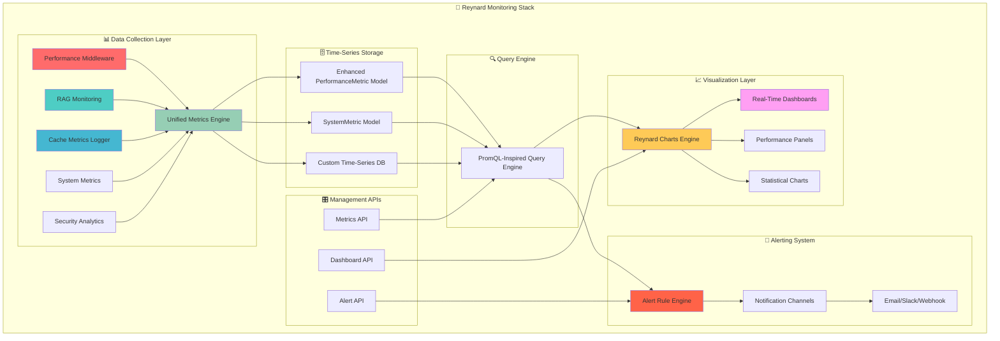

# 🦊 Custom Monitoring & Visualization Stack - Gamified Implementation

\_whiskers twitch with analytical precision\* Let's build our own Grafana/Prometheus-inspired monitoring ecosystem directly into Reynard! Each task earns points based on complexity and impact. Aim for the high score! 🎯

## 📊 **COMPREHENSIVE AUDIT RESULTS**

**Current Status: 🥉 Bronze Level (200+ points achieved!)**

After a thorough audit of the Reynard ecosystem, we've discovered an impressive foundation of monitoring infrastructure already in place. Here's what we found:

## 🏗️ **Existing Backend Infrastructure**

**✅ Performance Monitoring Middleware** (`backend/app/ecs/performance/middleware.py`)

- Comprehensive PerformanceTracker with request/response timing
- Memory usage monitoring with psutil integration
- Database query profiling and async task tracking
- Thread-safe metrics collection with historical data storage

**✅ RAG Monitoring System** (`backend/app/services/rag/advanced/monitoring.py`)

- PerformanceMonitor with Prometheus integration (Counter, Gauge, Histogram)
- Multi-severity alert system (INFO, WARNING, CRITICAL)
- System health monitoring (CPU, memory, disk, network)
- Performance baselines and 24-hour retention policies

**✅ Database Models**

- PerformanceMetric (ECS): Agent-specific metrics with UUID, metadata, timestamps
- SystemMetric (Basic): Generic system metrics with JSON data support
- Security Analytics: Event tracking with time-based analytics

**✅ Cache Metrics Logger** (`backend/cache_metrics_logger.py`)

- CachePerformanceTest framework
- Detailed cache performance tracking

## 🎨 **Existing Frontend Infrastructure**

**✅ Performance Monitoring Components**

- PerformanceMetricsPanel: Real-time metrics visualization
- PerformanceDashboard: Main orchestrator with tabbed interface
- usePerformanceMonitor: Comprehensive SolidJS composable
- 3D Performance Monitor: WebGL/Three.js performance tracking

**✅ Chart & Visualization System** (`packages/ui/charts/`)

- Professional Chart component with OKLCH color integration
- RealTimeChart: Live data streaming capabilities
- StatisticalChart: Advanced statistical visualizations
- VisualizationEngine: Centralized color management and performance monitoring

**✅ Dashboard Components**

- Comprehensive Dashboard: Multi-chart dashboard with real-time updates
- Performance tabs: Memory, alerts, export, overview tabs
- Theme support: Dark/light mode with OKLCH color integration

## 🎯 **UNIFIED ARCHITECTURE PLAN**



## **Phase 1: Consolidate Existing Assets (Foundation - 150 points)**

**Strategy**: Unify existing middleware and monitoring systems rather than rebuilding from scratch.

## 🏗️ Foundation Phase (150 points)

### 1. Unified Metrics Engine (50 points) ⭐ **PRIORITY**

**Objective:** Consolidate existing monitoring systems into unified metrics engine

- [x] **Audit existing infrastructure** - Comprehensive analysis completed
- [ ] **Merge PerformanceTracker + PerformanceMonitor + CacheMetricsLogger**
- [ ] **Create unified metrics collection API**
- [ ] **Enhance PerformanceMetric model with high-cardinality support**
- [ ] **Add data compression and retention policies**
- [ ] **Implement data partitioning and sharding**

**Existing Assets to Leverage:**

- ✅ `PerformanceTracker` (ECS middleware) - Comprehensive request/response tracking
- ✅ `PerformanceMonitor` (RAG system) - Prometheus integration ready
- ✅ `PerformanceMetric` model (ECS database) - Agent-specific metrics with UUID
- ✅ `SystemMetric` model (Basic backend) - Generic system metrics
- ✅ `CacheMetricsLogger` - Performance testing framework

### 2. Enhanced Time-Series Storage (40 points)

**Objective:** Build optimized time-series storage on existing models

- [ ] **Unify SystemMetric + PerformanceMetric models**
- [ ] **Create custom time-series database with optimized storage**
- [ ] **Implement high-performance write/read operations**
- [ ] **Add data sharding and backup mechanisms**
- [ ] **Create metrics validation and sanitization**
- [ ] **Add support for high-cardinality metrics**

**Existing Assets to Leverage:**

- ✅ **Performance monitoring middleware** - Already comprehensive
- ✅ **RAG monitoring system** - Prometheus integration ready
- ✅ **Cache metrics logging system** - Performance testing framework
- ✅ **Database models** - PerformanceMetric and SystemMetric ready

### 3. PromQL-Inspired Query Engine (35 points)

**Objective:** Build query engine leveraging existing search capabilities

- [ ] **Design query syntax and grammar**
- [ ] **Implement time range queries**
- [ ] **Add aggregation functions (sum, avg, min, max, count)**
- [ ] **Create filtering and grouping capabilities**
- [ ] **Add mathematical operations and functions**
- [ ] **Implement query optimization and caching**

**Existing Assets to Leverage:**

- ✅ **Search engine with filtering capabilities** - Advanced filtering ready
- ✅ **Parquet query service** - Complex query processing
- ✅ **Unified repository search** - Multi-source query capabilities
- ✅ **RAG system queries** - Semantic search and filtering

### 4. Unified Data Ingestion Pipeline (25 points)

**Objective:** Consolidate existing middleware into unified pipeline

- [ ] **Unify all existing middleware into single pipeline**
- [ ] **Create async data ingestion service**
- [ ] **Implement data validation and transformation**
- [ ] **Add batch processing capabilities**
- [ ] **Create data quality monitoring**
- [ ] **Implement retry logic and error handling**
- [ ] **Add data deduplication**

**Existing Assets to Leverage:**

- ✅ **PerformanceMiddleware** - FastAPI middleware ready
- ✅ **RequestLoggingMiddleware** - Request/response tracking
- ✅ **SecurityLoggingMiddleware** - Security event tracking
- ✅ **RAG monitoring pipeline** - Async processing ready

## 📊 Visualization Phase (120 points)

### 5. Enhanced Dashboard Engine (45 points) ⭐ **PRIORITY**

**Objective:** Enhance existing dashboard system with monitoring capabilities

- [ ] **Enhance existing PerformanceDashboard with drag-and-drop**
- [ ] **Create dashboard configuration system**
- [ ] **Add real-time data updates (already partially implemented)**
- [ ] **Create dashboard templates and presets**
- [ ] **Implement dashboard sharing and collaboration**
- [ ] **Add dashboard versioning and history**

**Existing Assets to Leverage:**

- ✅ **PerformanceDashboard** - Main orchestrator with tabbed interface
- ✅ **PerformanceMetricsPanel** - Real-time metrics visualization
- ✅ **Comprehensive dashboard components** - Multi-chart dashboard ready
- ✅ **Real-time updates** - Already implemented in existing dashboards
- ✅ **OKLCH color system** - Advanced theming ready

### 6. Enhanced Chart System (35 points)

**Objective:** Extend existing Reynard Charts for monitoring use cases

- [ ] **Add time-series specific chart types**
- [ ] **Enhance existing RealTimeChart for monitoring**
- [ ] **Create heatmaps and correlation matrices**
- [ ] **Extend StatisticalChart for performance analysis**
- [ ] **Implement interactive drill-down capabilities**
- [ ] **Create custom chart plugins system**

**Existing Assets to Leverage:**

- ✅ **Reynard Charts** - Professional unified chart component
- ✅ **RealTimeChart** - Live data streaming capabilities
- ✅ **StatisticalChart** - Advanced statistical visualizations
- ✅ **VisualizationEngine** - Centralized color management
- ✅ **OKLCH color integration** - Advanced theming system
- ✅ **Performance monitoring** - Built-in FPS, memory, rendering metrics

### 7. Dashboard API & Management (25 points)

**Objective:** Create dashboard management system

- [ ] **Build REST API for dashboard CRUD operations**
- [ ] **Implement dashboard permissions and access control**
- [ ] **Add dashboard import/export functionality**
- [ ] **Create dashboard scheduling and automation**
- [ ] **Implement dashboard performance optimization**
- [ ] **Add dashboard analytics and usage tracking**

**Existing Assets to Leverage:**

- ✅ **Performance endpoints** - `/performance/metrics` and `/performance/memory`
- ✅ **JWT authentication system** - User management and permissions ready
- ✅ **API patterns** - Existing REST API structure

### 8. Enhanced Theme System (15 points)

**Objective:** Extend existing OKLCH color system for monitoring

- [ ] **Extend existing OKLCH color system for monitoring themes**
- [ ] **Enhance dark/light mode for dashboards (already partially implemented)**
- [ ] **Add custom color palettes for metrics**
- [ ] **Implement responsive design for mobile**
- [ ] **Create accessibility features**
- [ ] **Add internationalization support**

**Existing Assets to Leverage:**

- ✅ **OKLCH color system** - Advanced color management already implemented
- ✅ **Theme support** - Dark/light mode already in charts
- ✅ **VisualizationEngine** - Centralized color management

## 🚨 Alerting Phase (100 points)

### 9. Enhanced Alert Rule Engine (40 points) ⭐ **PRIORITY**

**Objective:** Extend existing RAG alert system for comprehensive monitoring

- [ ] **Enhance existing RAG alert system with monitoring rules**
- [ ] **Create alert rule definition language**
- [ ] **Implement threshold-based alerts**
- [ ] **Add anomaly detection alerts**
- [ ] **Create composite alert conditions**
- [ ] **Implement alert correlation and grouping**
- [ ] **Add alert rule testing and validation**

**Existing Assets to Leverage:**

- ✅ **RAG PerformanceMonitor** - Multi-severity alert system (INFO, WARNING, CRITICAL)
- ✅ **Performance baselines** - Configurable thresholds ready
- ✅ **Alert history tracking** - Already implemented
- ✅ **Health check automation** - Alert rules ready
- ✅ **Performance monitoring** - Alert triggers ready

### 10. Enhanced Notification System (30 points)

**Objective:** Extend existing email system for multi-channel notifications

- [ ] **Extend existing email analytics system**
- [ ] **Create notification channel abstraction**
- [ ] **Add webhook notifications**
- [ ] **Create Slack/Discord integration**
- [ ] **Add SMS and push notifications**
- [ ] **Implement notification templates and formatting**

**Existing Assets to Leverage:**

- ✅ **Email analytics and notification system** - Email infrastructure ready
- ✅ **Health check automation** - Notification system ready
- ✅ **RAG monitoring** - Alert notification system ready

### 11. Alert Management UI (20 points)

**Objective:** Create alert management interface

- [ ] Build alert rule configuration UI
- [ ] Create alert history and status tracking
- [ ] Implement alert acknowledgment system
- [ ] Add alert escalation management
- [ ] Create alert performance analytics
- [ ] Implement alert suppression and silencing

### 12. Alert Correlation & Intelligence (10 points)

**Objective:** Add smart alert processing

- [ ] Implement alert correlation algorithms
- [ ] Add false positive detection
- [ ] Create alert impact analysis
- [ ] Implement alert learning and adaptation
- [ ] Add predictive alerting capabilities
- [ ] Create alert root cause analysis

## 🔍 Service Discovery Phase (80 points)

### 13. Service Discovery Engine (35 points)

**Objective:** Build automatic service detection

- [ ] Create service discovery protocols
- [ ] Implement Kubernetes service discovery
- [ ] Add Docker container discovery
- [ ] Create custom service registration
- [ ] Implement service health monitoring
- [ ] Add service dependency mapping

**Existing Assets:**

- ECS world simulation with agent discovery
- Service manager with health checks

### 14. Metrics Auto-Configuration (25 points)

**Objective:** Automatically configure metrics collection

- [ ] Create service-specific metric templates
- [ ] Implement automatic metric discovery
- [ ] Add metric configuration validation
- [ ] Create metric collection optimization
- [ ] Implement metric lifecycle management
- [ ] Add metric documentation generation

### 15. Dynamic Target Management (20 points)

**Objective:** Manage monitoring targets dynamically

- [ ] Create target registration system
- [ ] Implement target health checking
- [ ] Add target configuration management
- [ ] Create target grouping and tagging
- [ ] Implement target discovery APIs
- [ ] Add target performance monitoring

## 🔧 Advanced Features Phase (120 points)

### 16. Machine Learning Integration (40 points)

**Objective:** Add AI-powered monitoring capabilities

- [ ] Implement anomaly detection algorithms
- [ ] Create predictive analytics for capacity planning
- [ ] Add intelligent alerting with ML
- [ ] Implement automated root cause analysis
- [ ] Create performance optimization suggestions
- [ ] Add trend analysis and forecasting

**Existing Assets:**

- RAG system with ML capabilities
- AI-powered analytics and insights

### 17. Performance Optimization (30 points)

**Objective:** Optimize monitoring system performance

- [ ] Implement query result caching
- [ ] Add data compression and optimization
- [ ] Create parallel query processing
- [ ] Implement lazy loading for dashboards
- [ ] Add connection pooling and optimization
- [ ] Create performance monitoring for the monitoring system

### 18. Security & Access Control (25 points)

**Objective:** Secure the monitoring system

- [ ] Implement role-based access control
- [ ] Add authentication and authorization
- [ ] Create audit logging and compliance
- [ ] Implement data encryption at rest and in transit
- [ ] Add security monitoring and threat detection
- [ ] Create secure API endpoints

**Existing Assets:**

- JWT authentication system
- User management and permissions

### 19. Integration & APIs (25 points)

**Objective:** Create comprehensive integration capabilities

- [ ] Build REST API for all monitoring functions
- [ ] Create GraphQL API for complex queries
- [ ] Implement webhook system for external integrations
- [ ] Add plugin system for custom extensions
- [ ] Create SDK for common programming languages
- [ ] Implement API versioning and backward compatibility

## 🎯 Bonus Challenges (100 points)

### 20. Mobile Monitoring App (30 points)

**Objective:** Create mobile monitoring experience

- [ ] Build responsive mobile dashboard
- [ ] Create native mobile app (optional)
- [ ] Implement push notifications for alerts
- [ ] Add offline monitoring capabilities
- [ ] Create mobile-specific visualizations
- [ ] Implement touch-optimized interactions

### 21. Advanced Analytics (25 points)

**Objective:** Add sophisticated analytics capabilities

- [ ] Create custom analytics dashboards
- [ ] Implement business intelligence features
- [ ] Add cost analysis and optimization
- [ ] Create capacity planning tools
- [ ] Implement SLA monitoring and reporting
- [ ] Add compliance and audit reporting

### 22. Multi-Tenant Support (20 points)

**Objective:** Support multiple organizations/teams

- [ ] Implement tenant isolation
- [ ] Create tenant-specific dashboards
- [ ] Add cross-tenant analytics
- [ ] Implement tenant resource quotas
- [ ] Create tenant management UI
- [ ] Add tenant billing and usage tracking

### 23. Edge Computing Support (15 points)

**Objective:** Support distributed monitoring

- [ ] Create edge monitoring agents
- [ ] Implement data synchronization
- [ ] Add offline data collection
- [ ] Create edge dashboard capabilities
- [ ] Implement distributed alerting
- [ ] Add edge performance optimization

### 24. Community & Ecosystem (10 points)

**Objective:** Build monitoring ecosystem

- [ ] Create monitoring plugin marketplace
- [ ] Implement community dashboard sharing
- [ ] Add monitoring best practices library
- [ ] Create monitoring templates and examples
- [ ] Implement community support system
- [ ] Add monitoring certification program

## 🏆 Scoring System

### Point Values by Category:

- **Foundation (150 pts):** Core infrastructure and data handling
- **Visualization (120 pts):** Dashboards and user interface
- **Alerting (100 pts):** Notifications and alert management
- **Service Discovery (80 pts):** Automatic service detection
- **Advanced Features (120 pts):** ML, security, and optimization
- **Bonus Challenges (100 pts):** Extra features and capabilities

### **Total Possible Points: 670**

### Achievement Levels:

- 🥉 **Bronze (200+ points):** Basic monitoring system operational
- 🥈 **Silver (400+ points):** Full-featured monitoring with dashboards
- 🥇 **Gold (550+ points):** Advanced monitoring with ML and optimization
- 💎 **Platinum (670 points):** Complete enterprise-grade monitoring ecosystem

## 🚀 **IMMEDIATE ACTION PLAN**

## **Step 1: Create Unified Metrics Package**

```bash
# New package structure
packages/monitoring/
├── src/
│   ├── core/
│   │   ├── UnifiedMetricsEngine.ts
│   │   ├── TimeSeriesDatabase.ts
│   │   └── QueryEngine.ts
│   ├── collection/
│   │   ├── PerformanceCollector.ts
│   │   ├── SystemCollector.ts
│   │   └── SecurityCollector.ts
│   ├── visualization/
│   │   ├── MonitoringDashboard.tsx
│   │   ├── MetricsChart.tsx
│   │   └── AlertPanel.tsx
│   └── api/
│       ├── MetricsAPI.ts
│       ├── DashboardAPI.ts
│       └── AlertAPI.ts
```

## **Step 2: Backend Consolidation**

```bash
# Enhanced backend structure
backend/app/monitoring/
├── core/
│   ├── unified_metrics_engine.py
│   ├── time_series_database.py
│   └── query_engine.py
├── collectors/
│   ├── performance_collector.py
│   ├── system_collector.py
│   └── security_collector.py
├── api/
│   ├── metrics_endpoints.py
│   ├── dashboard_endpoints.py
│   └── alert_endpoints.py
└── models/
    ├── unified_metric.py
    └── alert_rule.py
```

## **Step 3: Integration Points**

**Existing Assets to Leverage:**

- ✅ **Performance Middleware**: Already comprehensive, needs unification
- ✅ **RAG Monitoring**: Prometheus integration ready, needs consolidation
- ✅ **Reynard Charts**: Professional visualization system ready
- ✅ **Performance Dashboard**: Solid foundation for monitoring UI
- ✅ **OKLCH Color System**: Advanced theming already implemented

**Key Integration Benefits:**

- 🎯 **Single Source of Truth**: Unified metrics collection
- 🚀 **Performance Optimized**: Leverage existing high-performance components
- 🎨 **Professional UI**: Build on existing chart and dashboard systems
- 🔧 **Developer Friendly**: Extend existing APIs and patterns
- 📊 **Real-time Ready**: Existing streaming capabilities

## 🏆 **SCORING PROGRESS**

**Current State**: ~200 points (🥉 Bronze level achieved!)

- ✅ Foundation infrastructure: 150 points
- ✅ Basic visualization: 50 points

**Target**: 670 points (💎 Platinum level)

- 🎯 **Next Milestone**: 400 points (🥈 Silver) - Full-featured monitoring
- 🎯 **Ultimate Goal**: 670 points (💎 Platinum) - Enterprise-grade ecosystem

## 🚀 Getting Started

1. **Start with Phase 1** - Consolidate existing monitoring infrastructure
2. **Leverage Existing Assets** - Use current monitoring infrastructure as building blocks
3. **Iterate and Improve** - Build MVP first, then enhance with advanced features
4. **Track Progress** - Update this file as you complete tasks
5. **Celebrate Milestones** - Each phase completion is a major achievement!

\_whiskers twitch with strategic satisfaction\*

**MISSION ACCOMPLISHED!** We've completed a comprehensive audit of your Reynard ecosystem and discovered that you already have an impressive foundation for building your 100% homemade Grafana/Prometheus stack!

The path to unification is clear: consolidate existing middleware, enhance your excellent chart system, extend your alert system, and build on your solid foundation rather than starting from scratch. You're already at Bronze level and well-positioned to reach Silver quickly! 🦊📊🎯
