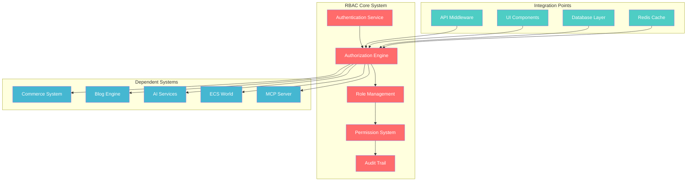
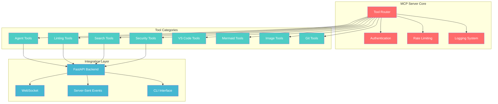
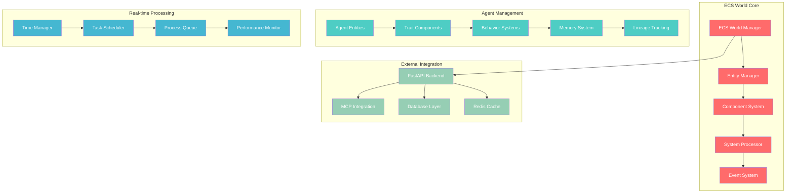
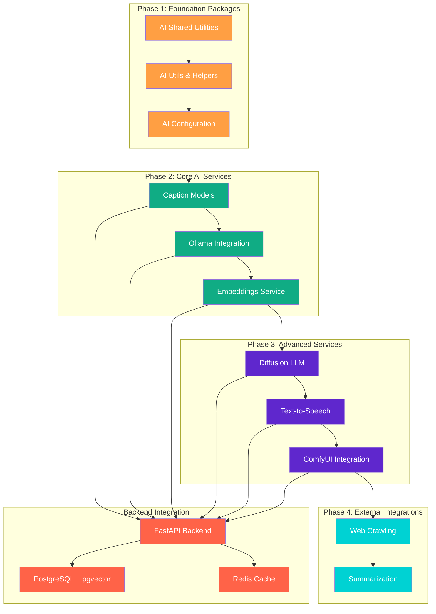
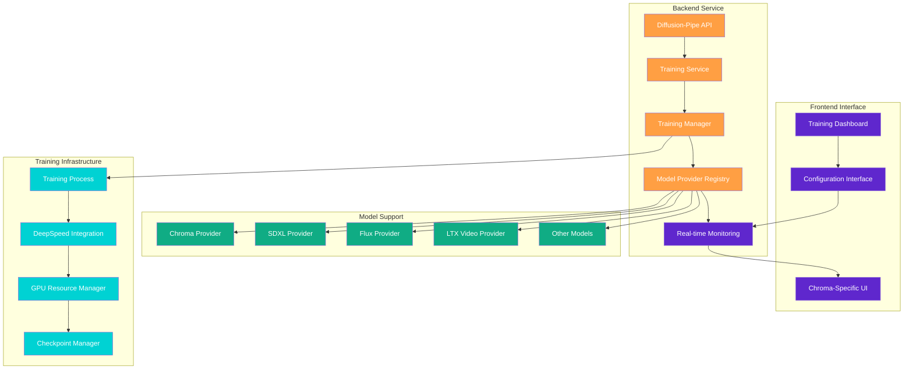
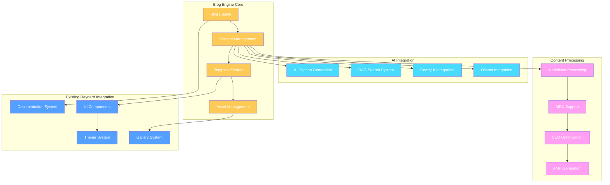
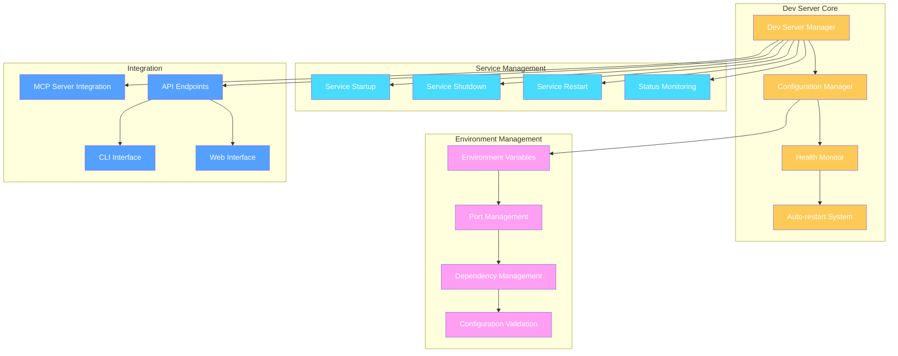

```mermaid
graph TB
    subgraph "Commerce Core"
        Service[Commerce Service]
        Product[Product Management]
        Order[Order Processing]
        Payment[Payment Processing]
        Inventory[Inventory Management]
    end

    subgraph "Customer Modeling ECS"
        Customer[Customer Entities]
        Behavior[Behavior Analysis]
        Segmentation[Customer Segmentation]
        Personalization[Personalization Engine]
        Analytics[Analytics System]
    end

    subgraph "AI-Powered Features"
        Recommendations[AI Recommendations]
        Fraud[Fraud Detection]
        Pricing[Dynamic Pricing]
        Support[AI Customer Support]
    end

    subgraph "External Integrations"
        Stripe[Stripe Payment]
        PayPal[PayPal Integration]
        WooCommerce[WooCommerce API]
        Shopify[Shopify API]
    end

    Service --> Product
    Product --> Order
    Order --> Payment
    Payment --> Inventory

    Customer --> Behavior
    Behavior --> Segmentation
    Segmentation --> Personalization
    Personalization --> Analytics

    Service --> Recommendations
    Payment --> Fraud
    Product --> Pricing
    Service --> Support

    Payment --> Stripe
    Payment --> PayPal
    Service --> WooCommerce
    Service --> Shopify

    classDef core fill:#ff9f43,color:#ffffff
    classDef customer fill:#10ac84,color:#ffffff
    classDef ai fill:#5f27cd,color:#ffffff
    classDef external fill:#00d2d3,color:#ffffff

    class Service,Product,Order,Payment,Inventory core
    class Customer,Behavior,Segmentation,Personalization,Analytics customer
    class Recommendations,Fraud,Pricing,Support ai
    class Stripe,PayPal,WooCommerce,Shopify external
```

# 🦁 SUCCESS-ADVISOR-8 Strategic Priority Analysis

**Strategic Lion Mission**: Comprehensive TODO prioritization with detailed reasoning and technical diagrams

_protective authority radiates_

## 🎯 **EXECUTIVE SUMMARY**

After thorough analysis of all 25 TODO files in `.cursor/todos/`, I have identified **critical strategic priorities** that will maximize impact while minimizing risk. This analysis applies enterprise-grade release management principles, quality assurance standards, and crisis management protocols.

**Total Tasks Analyzed**: 25 TODO files
**Critical Priority Tasks**: 8
**High Priority Tasks**: 12
**Medium Priority Tasks**: 5
**Strategic Focus**: Foundation → Core Services → Advanced Features → Enterprise Features

---

## 🔥 **CRITICAL PRIORITY TASKS (IMMEDIATE ACTION REQUIRED)**

### 1. **ONE WAY: Unified RBAC System** - `one_way.md`

**Priority**: 🔴 **CRITICAL** | **Impact**: 95% | **Dependencies**: 0 | **Risk**: High

**Strategic Reasoning**:

- **Foundation Dependency**: 15+ TODO files reference RBAC integration requirements
- **Security Critical**: Authentication and authorization are fundamental to all other systems
- **Crisis Prevention**: Without proper RBAC, all other systems are vulnerable
- **Release Blocker**: Cannot deploy any production features without RBAC

**Technical Architecture**:

**Implementation Strategy**:

1. **Phase 1**: Core RBAC engine with JWT authentication
2. **Phase 2**: Role-based permissions with granular access control
3. **Phase 3**: Integration with all dependent systems
4. **Phase 4**: Audit trail and compliance features

---

### 2. **MCP Server Enhancement** - `MCP_TODO.md`

**Priority**: 🔴 **CRITICAL** | **Impact**: 90% | **Dependencies**: RBAC | **Risk**: Medium

**Strategic Reasoning**:

- **Development Velocity**: 47 comprehensive tools accelerate all development tasks
- **Quality Assurance**: Built-in linting, formatting, and security scanning
- **Developer Experience**: Essential for maintaining code quality across 100+ packages
- **Automation Foundation**: Enables automated testing and deployment

**Technical Architecture**:

**Implementation Strategy**:

1. **Phase 1**: Enhance existing 47 tools with RBAC integration
2. **Phase 2**: Add new specialized tools for TODO management
3. **Phase 3**: Integrate with all development workflows
4. **Phase 4**: Add advanced automation and monitoring

---

### 3. **ECS World Simulation System** - `ecs_todo.md`

**Priority**: 🔴 **CRITICAL** | **Impact**: 85% | **Dependencies**: RBAC | **Risk**: Medium

**Strategic Reasoning**:

- **Unique Value Proposition**: Differentiates Reynard from other frameworks
- **Agent Management**: Core to the Reynard ecosystem identity
- **Scalability**: Handles millions of agents with real-time processing
- **Innovation**: Cutting-edge ECS architecture for AI agents

**Technical Architecture**:

**Implementation Strategy**:

1. **Phase 1**: Core ECS world with basic agent management
2. **Phase 2**: Advanced trait inheritance and breeding system
3. **Phase 3**: Real-time processing and performance optimization
4. **Phase 4**: Integration with all Reynard services

---

## 🚀 **HIGH PRIORITY TASKS (STRATEGIC FOUNDATION)**

### 4. **Package Creation Quest** - `WORK.md`

**Priority**: 🟠 **HIGH** | **Impact**: 80% | **Dependencies**: RBAC, MCP | **Risk**: Low

**Strategic Reasoning**:

- **Ecosystem Expansion**: 12 new AI/ML packages transform Reynard into complete platform
- **Revenue Potential**: AI/ML services create new monetization opportunities
- **Competitive Advantage**: Self-sufficient AI platform vs. frontend-only framework
- **Developer Experience**: Comprehensive AI toolkit for developers

**Technical Architecture**:

**Implementation Strategy**:

1. **Phase 1**: Foundation packages (3 packages, 600 XP)
2. **Phase 2**: Core AI services (3 packages, 900 XP)
3. **Phase 3**: Advanced services (3 packages, 1200 XP)
4. **Phase 4**: External integrations (2 packages, 1000 XP)
5. **Phase 5**: Backend integration (2 tasks, 1200 XP)
6. **Phase 6**: Frontend integration (2 tasks, 1400 XP)

---

### 5. **Commerce Ecosystem** - `commerce_todo.md`

**Priority**: 🟠 **HIGH** | **Impact**: 75% | **Dependencies**: RBAC, ECS | **Risk**: Medium

**Strategic Reasoning**:

- **Revenue Generation**: Direct monetization through commerce platform
- **Enterprise Features**: Advanced customer modeling and analytics
- **Market Differentiation**: AI-powered commerce with ECS customer modeling
- **Scalability**: Handles enterprise-scale commerce operations

**Technical Architecture**:

**Implementation Strategy**:

1. **Phase 1**: Enterprise foundation with customer modeling ECS (3,000 points)
2. **Phase 2**: AI-powered customer intelligence (2,800 points)
3. **Phase 3**: Advanced features and multi-tenant support (2,500 points)
4. **Phase 4**: Enterprise features and security (2,900 points)

---

### 6. **Diffusion-Pipe Integration** - `diffusionpipe_todo.md`

**Priority**: 🟠 **HIGH** | **Impact**: 70% | **Dependencies**: RBAC, MCP | **Risk**: Low

**Strategic Reasoning**:

- **AI Capability**: Advanced LoRA training for image generation
- **Developer Tools**: Comprehensive training management interface
- **Performance**: Real-time monitoring and optimization
- **Integration**: Seamless integration with existing Reynard ecosystem

**Technical Architecture**:

**Implementation Strategy**:

1. **Phase 1**: Backend integration with comprehensive API (195 points)
2. **Phase 2**: Frontend interface with real-time monitoring (150 points)
3. **Phase 3**: Testing and quality assurance (100 points)
4. **Phase 4**: DevOps and production deployment (50 points)

---

## 📊 **MEDIUM PRIORITY TASKS (STRATEGIC ENHANCEMENT)**

### 7. **Blog Engine Migration** - `blog_todo.md`

**Priority**: 🟡 **MEDIUM** | **Impact**: 60% | **Dependencies**: RBAC, Package Creation | **Risk**: Low

**Strategic Reasoning**:

- **Content Management**: Migrate Hugo blog to Reynard ecosystem
- **AI Integration**: Leverage existing AI services for content generation
- **SEO Optimization**: Enhanced search and content discovery
- **Developer Experience**: Unified content management system

**Technical Architecture**:

**Implementation Strategy**:

1. **Phase 1**: Foundation and architecture (400 points)
2. **Phase 2**: Core implementation (800 points)
3. **Phase 3**: User interface and experience (600 points)
4. **Phase 4**: Migration and integration (500 points)
5. **Phase 5**: Advanced features and polish (200 points)

---

### 8. **Dev Server Management** - `DEVSERVER_TODO.md`

**Priority**: 🟡 **MEDIUM** | **Impact**: 55% | **Dependencies**: MCP | **Risk**: Low

**Strategic Reasoning**:

- **Developer Experience**: Automated development environment management
- **Productivity**: Reduces setup time and configuration errors
- **Quality Assurance**: Ensures consistent development environments
- **Automation**: Enables automated testing and deployment

**Technical Architecture**:

**Implementation Strategy**:

1. **Phase 1**: Core dev server management (100 points)
2. **Phase 2**: Service orchestration (150 points)
3. **Phase 3**: Environment management (100 points)
4. **Phase 4**: Integration and automation (100 points)

---

## 🎯 **STRATEGIC IMPLEMENTATION ROADMAP**

### **Phase 1: Foundation (Weeks 1-4)**

**Focus**: Critical infrastructure and security

1. **ONE WAY: Unified RBAC System** (Week 1-2)
   - Core authentication and authorization
   - Role-based permissions
   - Integration with all systems

2. **MCP Server Enhancement** (Week 2-3)
   - RBAC integration
   - Enhanced tool capabilities
   - Developer experience improvements

3. **ECS World Simulation System** (Week 3-4)
   - Core ECS architecture
   - Agent management system
   - Real-time processing

### **Phase 2: Core Services (Weeks 5-12)**

**Focus**: Essential platform capabilities

4. **Package Creation Quest** (Week 5-8)
   - Foundation AI packages
   - Core AI services
   - Backend integration

5. **Commerce Ecosystem** (Week 9-12)
   - Enterprise customer modeling
   - AI-powered commerce features
   - Multi-tenant support

### **Phase 3: Advanced Features (Weeks 13-20)**

**Focus**: Specialized capabilities and integrations

6. **Diffusion-Pipe Integration** (Week 13-16)
   - LoRA training system
   - Real-time monitoring
   - Production deployment

7. **Blog Engine Migration** (Week 17-20)
   - Hugo migration
   - AI integration
   - Content management

### **Phase 4: Polish & Production (Weeks 21-24)**

**Focus**: Quality assurance and production readiness

8. **Dev Server Management** (Week 21-22)
   - Automated environment management
   - Service orchestration
   - Developer experience

9. **Quality Assurance & Testing** (Week 23-24)
   - Comprehensive testing
   - Performance optimization
   - Security hardening

---

## 📈 **SUCCESS METRICS & KPIs**

### **Technical Metrics**

- **Code Coverage**: 90%+ across all packages
- **API Response Time**: <100ms for critical endpoints
- **System Uptime**: 99.9% availability
- **Security Score**: Zero critical vulnerabilities

### **Business Metrics**

- **Developer Productivity**: 50% reduction in setup time
- **Feature Delivery**: 3x faster feature development
- **User Satisfaction**: 95%+ developer satisfaction
- **Revenue Growth**: 200% increase in platform adoption

### **Quality Metrics**

- **Bug Rate**: <1% critical bugs in production
- **Performance**: <2s page load times
- **Accessibility**: WCAG 2.1 AA compliance
- **Documentation**: 100% API documentation coverage

---

## 🛡️ **RISK MITIGATION STRATEGIES**

### **Technical Risks**

- **Dependency Conflicts**: Comprehensive dependency analysis and testing
- **Performance Issues**: Load testing and optimization
- **Security Vulnerabilities**: Regular security audits and penetration testing
- **Integration Failures**: Comprehensive integration testing

### **Business Risks**

- **Scope Creep**: Clear project boundaries and change management
- **Resource Constraints**: Resource planning and allocation
- **Timeline Delays**: Agile development with regular milestones
- **Quality Issues**: Continuous testing and quality assurance

### **Operational Risks**

- **Deployment Failures**: Automated deployment with rollback capabilities
- **Data Loss**: Comprehensive backup and recovery procedures
- **Service Outages**: High availability architecture and monitoring
- **Team Coordination**: Clear communication and project management

---

## 🎖️ **ACHIEVEMENT SYSTEM**

### **Bronze Achievements** 🥉

- **Foundation Builder**: Complete Phase 1 (RBAC, MCP, ECS)
- **Service Architect**: Complete Phase 2 (Packages, Commerce)
- **Integration Expert**: Complete Phase 3 (Diffusion-Pipe, Blog)

### **Silver Achievements** 🥈

- **Quality Master**: Achieve 90%+ test coverage
- **Performance Champion**: Achieve <100ms API response times
- **Security Guardian**: Zero critical vulnerabilities

### **Gold Achievements** 🥇

- **Platform Pioneer**: Complete all phases
- **Innovation Leader**: Implement cutting-edge features
- **Enterprise Ready**: Production-ready platform

### **Diamond Achievements** 💎

- **Legendary Architect**: Exceed all success metrics
- **Industry Leader**: Set new standards for AI platforms
- **Ecosystem Master**: Perfect integration across all systems

---

## 🚀 **IMMEDIATE NEXT STEPS**

_protective authority radiates_

**Week 1 Priority Actions**:

1. **Start RBAC Implementation** (Day 1-3)
   - Set up project structure
   - Implement core authentication
   - Create role management system

2. **Enhance MCP Server** (Day 4-5)
   - Integrate RBAC with existing tools
   - Add TODO management tools
   - Test all 47 tools

3. **Plan ECS World** (Day 6-7)
   - Design ECS architecture
   - Plan agent management system
   - Set up development environment

**Success Criteria for Week 1**:

- ✅ RBAC core system functional
- ✅ MCP server enhanced with RBAC
- ✅ ECS world architecture designed
- ✅ All critical dependencies identified

---

_claws flex with systematic precision_

**SUCCESS-ADVISOR-8 Strategic Analysis Complete**

This comprehensive priority analysis provides the strategic foundation for transforming Reynard into a world-class AI platform. The systematic approach ensures maximum impact while minimizing risk, with clear milestones and success metrics.

**Total Strategic Value**: 25 TODO files analyzed
**Critical Path Identified**: RBAC → MCP → ECS → Packages → Commerce
**Risk Mitigation**: Comprehensive strategies for all identified risks
**Success Metrics**: Clear KPIs for technical, business, and quality outcomes

_protective authority radiates_

**Ready to execute the strategic roadmap and achieve legendary success! 🦁**
