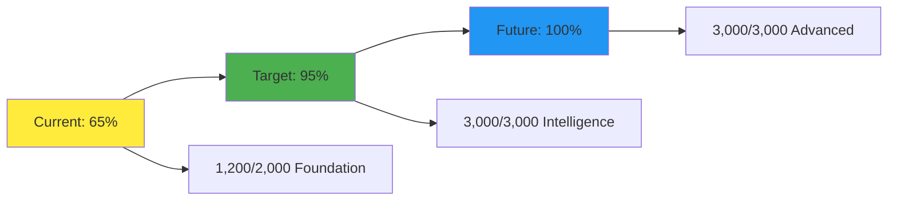

# 🚗 TESLA: Fully Autonomous Self-Driving Development System

**Mission**: Transform Reynard into a fully autonomous, self-driving development ecosystem that requires zero human intervention for 95% of development tasks.

**Current Autonomy Level**: 65% 🟡
**Target Autonomy Level**: 95% 🟢
**Total Points Available**: 10,000 🏆

---

## 🎯 **AUTONOMY LEVELS**

| Level                               | Points Required | Description                                 | Status             |
| ----------------------------------- | --------------- | ------------------------------------------- | ------------------ |
| 🟡 **Level 1: Basic Automation**    | 0-2,000         | Manual triggers, basic CI/CD                | ✅ **COMPLETED**   |
| 🟠 **Level 2: Smart Automation**    | 2,000-4,000     | Intelligent triggers, self-healing          | 🔄 **IN PROGRESS** |
| 🟢 **Level 3: Full Autonomy**       | 4,000-7,000     | Self-driving development, auto-deployment   | 🎯 **TARGET**      |
| 🔵 **Level 4: Predictive Autonomy** | 7,000-10,000    | Predictive maintenance, AI-driven decisions | 🚀 **FUTURE**      |

---

## 🏗️ **FOUNDATION SYSTEMS** (2,000 Points)

### **✅ COMPLETED SYSTEMS** (1,200 Points)

#### **🦊 Monorepo Architecture** (300 Points) ✅

- [x] 95+ packages organized in semantic categories
- [x] pnpm workspace configuration
- [x] Package isolation and dependency management
- [x] Consistent build and type generation

#### **🧪 Testing Framework** (300 Points) ✅

- [x] Vitest global test queue system
- [x] Comprehensive CI/CD workflows
- [x] Coverage requirements (80% minimum, 95% critical)
- [x] Parallel testing across all packages

#### **🔍 Code Quality System** (300 Points) ✅

- [x] Comprehensive linting pipeline (ESLint, Prettier, TypeScript)
- [x] Security scanning (Bandit, audit-ci, dependency vulnerabilities)
- [x] Workflow validation with actionlint
- [x] Quality gates and automated analysis

#### **🌐 API Autonomy** (300 Points) ✅

- [x] Evergreen API client with OpenAPI monitoring
- [x] Auto-generated TypeScript types
- [x] Real-time backend change detection
- [x] Type-safe API calls with SolidJS composables

### **🔄 IN PROGRESS SYSTEMS** (800 Points)

#### **📦 Package Publishing** (400 Points) 🔄

- [ ] **Semantic Versioning Automation** (150 Points)
  - [ ] Install and configure `@anolilab/semantic-release-pnpm`
  - [ ] Set up automated version bumping based on conventional commits
  - [ ] Configure changelog generation
  - [ ] Implement release tagging automation

- [ ] **npm Publishing Pipeline** (150 Points)
  - [ ] Create GitHub Actions publishing workflow
  - [ ] Set up npm registry authentication
  - [ ] Configure conditional publishing based on changes
  - [ ] Implement pre-release and rollback mechanisms

- [ ] **Release Management** (100 Points)
  - [ ] Integrate with existing Git workflow automation
  - [ ] Set up release candidate validation
  - [ ] Configure automated release notes generation
  - [ ] Implement release verification and rollback

#### **🤖 Agent-Driven Automation** (400 Points) 🔄

- [ ] **ECS World Integration** (200 Points)
  - [ ] Connect release management to ECS world simulation
  - [ ] Implement agent-driven release decisions
  - [ ] Set up persistent agent state across releases
  - [ ] Configure agent personality-driven automation

- [ ] **MCP Server Enhancement** (200 Points)
  - [ ] Add publishing tools to MCP server (47 → 50+ tools)
  - [ ] Implement automated release workflow tools
  - [ ] Set up agent-driven decision making
  - [ ] Configure autonomous development triggers

---

## 🧠 **INTELLIGENT AUTOMATION** (3,000 Points)

### **🎯 Smart Triggers & Decision Making** (1,000 Points)

#### **🔍 Intelligent Change Detection** (300 Points)

- [ ] **Semantic Change Analysis** (100 Points)
  - [ ] Implement AI-powered change impact analysis
  - [ ] Set up automatic breaking change detection
  - [ ] Configure feature flag impact assessment
  - [ ] Create dependency change propagation analysis

- [ ] **Context-Aware Automation** (100 Points)
  - [ ] Set up time-based automation triggers
  - [ ] Implement user behavior-based automation
  - [ ] Configure load-based scaling decisions
  - [ ] Create business metric-driven automation

- [ ] **Predictive Triggers** (100 Points)
  - [ ] Implement failure prediction algorithms
  - [ ] Set up performance degradation early warning
  - [ ] Configure capacity planning automation
  - [ ] Create maintenance window optimization

#### **🤖 AI-Driven Decision Making** (400 Points)

- [ ] **Autonomous Code Review** (150 Points)
  - [ ] Implement AI-powered code review automation
  - [ ] Set up automated PR approval for low-risk changes
  - [ ] Configure intelligent merge conflict resolution
  - [ ] Create automated code quality improvements

- [ ] **Smart Resource Management** (150 Points)
  - [ ] Implement intelligent resource allocation
  - [ ] Set up automated scaling based on demand
  - [ ] Configure cost optimization algorithms
  - [ ] Create performance-based resource tuning

- [ ] **Autonomous Problem Solving** (100 Points)
  - [ ] Implement self-healing infrastructure
  - [ ] Set up automated error recovery
  - [ ] Configure intelligent rollback decisions
  - [ ] Create automated troubleshooting workflows

#### **📊 Advanced Analytics & Learning** (300 Points)

- [ ] **Development Pattern Learning** (150 Points)
  - [ ] Implement developer behavior analysis
  - [ ] Set up code pattern recognition
  - [ ] Configure productivity optimization
  - [ ] Create personalized development assistance

- [ ] **System Performance Learning** (150 Points)
  - [ ] Implement performance pattern analysis
  - [ ] Set up bottleneck prediction
  - [ ] Configure optimization recommendations
  - [ ] Create automated performance tuning

### **🔄 Self-Healing & Recovery** (1,000 Points)

#### **🛠️ Infrastructure Self-Healing** (400 Points)

- [ ] **Service Recovery Automation** (200 Points)
  - [ ] Implement automatic service restart on failure
  - [ ] Set up health check-based recovery
  - [ ] Configure circuit breaker patterns
  - [ ] Create graceful degradation mechanisms

- [ ] **Resource Self-Healing** (200 Points)
  - [ ] Implement automatic resource cleanup
  - [ ] Set up memory leak detection and recovery
  - [ ] Configure disk space management
  - [ ] Create network connectivity recovery

#### **🔧 Application Self-Healing** (300 Points)

- [ ] **Code-Level Recovery** (150 Points)
  - [ ] Implement automatic bug fix suggestions
  - [ ] Set up runtime error recovery
  - [ ] Configure data corruption detection
  - [ ] Create automated data repair

- [ ] **Configuration Self-Healing** (150 Points)
  - [ ] Implement configuration drift detection
  - [ ] Set up automatic configuration repair
  - [ ] Configure environment consistency checks
  - [ ] Create configuration backup and restore

#### **📈 Performance Self-Healing** (300 Points)

- [ ] **Performance Optimization** (150 Points)
  - [ ] Implement automatic performance tuning
  - [ ] Set up cache optimization
  - [ ] Configure query optimization
  - [ ] Create load balancing optimization

- [ ] **Capacity Management** (150 Points)
  - [ ] Implement automatic scaling decisions
  - [ ] Set up capacity planning
  - [ ] Configure resource allocation optimization
  - [ ] Create cost-performance optimization

### **🎯 Predictive Maintenance** (1,000 Points)

#### **🔮 Failure Prediction** (400 Points)

- [ ] **Infrastructure Failure Prediction** (200 Points)
  - [ ] Implement hardware failure prediction
  - [ ] Set up network failure prediction
  - [ ] Configure storage failure prediction
  - [ ] Create power failure prediction

- [ ] **Application Failure Prediction** (200 Points)
  - [ ] Implement memory leak prediction
  - [ ] Set up performance degradation prediction
  - [ ] Configure security vulnerability prediction
  - [ ] Create data corruption prediction

#### **📊 Performance Prediction** (300 Points)

- [ ] **Load Prediction** (150 Points)
  - [ ] Implement traffic pattern analysis
  - [ ] Set up seasonal load prediction
  - [ ] Configure event-based load prediction
  - [ ] Create user behavior-based prediction

- [ ] **Resource Prediction** (150 Points)
  - [ ] Implement CPU usage prediction
  - [ ] Set up memory usage prediction
  - [ ] Configure storage usage prediction
  - [ ] Create network usage prediction

#### **🛡️ Security Prediction** (300 Points)

- [ ] **Threat Prediction** (150 Points)
  - [ ] Implement attack pattern recognition
  - [ ] Set up vulnerability prediction
  - [ ] Configure intrusion prediction
  - [ ] Create malware detection prediction

- [ ] **Compliance Prediction** (150 Points)
  - [ ] Implement compliance drift prediction
  - [ ] Set up audit failure prediction
  - [ ] Configure policy violation prediction
  - [ ] Create regulatory change impact prediction

---

## 🚀 **ADVANCED AUTONOMY** (3,000 Points)

### **🌐 Full-Stack Automation** (1,500 Points)

#### **🖥️ Frontend Automation** (500 Points)

- [ ] **UI/UX Automation** (200 Points)
  - [ ] Implement automatic UI testing
  - [ ] Set up accessibility compliance automation
  - [ ] Configure responsive design validation
  - [ ] Create user experience optimization

- [ ] **Component Automation** (150 Points)
  - [ ] Implement component generation
  - [ ] Set up component testing automation
  - [ ] Configure component documentation
  - [ ] Create component optimization

- [ ] **Performance Automation** (150 Points)
  - [ ] Implement bundle size optimization
  - [ ] Set up lazy loading automation
  - [ ] Configure caching strategy automation
  - [ ] Create performance monitoring

#### **🐍 Backend Automation** (500 Points)

- [ ] **API Automation** (200 Points)
  - [ ] Implement automatic API generation
  - [ ] Set up API versioning automation
  - [ ] Configure API documentation
  - [ ] Create API testing automation

- [ ] **Database Automation** (150 Points)
  - [ ] Implement schema migration automation
  - [ ] Set up database optimization
  - [ ] Configure backup automation
  - [ ] Create data integrity checks

- [ ] **Service Automation** (150 Points)
  - [ ] Implement microservice orchestration
  - [ ] Set up service discovery automation
  - [ ] Configure load balancing automation
  - [ ] Create service monitoring

#### **☁️ Infrastructure Automation** (500 Points)

- [ ] **Deployment Automation** (200 Points)
  - [ ] Implement zero-downtime deployments
  - [ ] Set up blue-green deployment automation
  - [ ] Configure canary deployment automation
  - [ ] Create rollback automation

- [ ] **Monitoring Automation** (150 Points)
  - [ ] Implement comprehensive monitoring
  - [ ] Set up alerting automation
  - [ ] Configure log aggregation
  - [ ] Create dashboard automation

- [ ] **Security Automation** (150 Points)
  - [ ] Implement security scanning automation
  - [ ] Set up vulnerability management
  - [ ] Configure compliance automation
  - [ ] Create incident response automation

### **🤖 AI-Driven Development** (1,500 Points)

#### **🧠 Code Generation** (500 Points)

- [ ] **Intelligent Code Generation** (200 Points)
  - [ ] Implement AI-powered code generation
  - [ ] Set up test case generation
  - [ ] Configure documentation generation
  - [ ] Create code optimization suggestions

- [ ] **Pattern Recognition** (150 Points)
  - [ ] Implement code pattern analysis
  - [ ] Set up anti-pattern detection
  - [ ] Configure refactoring suggestions
  - [ ] Create code quality improvements

- [ ] **Learning & Adaptation** (150 Points)
  - [ ] Implement developer preference learning
  - [ ] Set up team coding style adaptation
  - [ ] Configure project-specific optimization
  - [ ] Create continuous improvement

#### **🔍 Intelligent Analysis** (500 Points)

- [ ] **Code Analysis** (200 Points)
  - [ ] Implement semantic code analysis
  - [ ] Set up dependency analysis
  - [ ] Configure impact analysis
  - [ ] Create risk assessment

- [ ] **Performance Analysis** (150 Points)
  - [ ] Implement performance bottleneck analysis
  - [ ] Set up optimization recommendations
  - [ ] Configure scaling recommendations
  - [ ] Create cost optimization analysis

- [ ] **Security Analysis** (150 Points)
  - [ ] Implement security vulnerability analysis
  - [ ] Set up compliance analysis
  - [ ] Configure risk assessment
  - [ ] Create remediation recommendations

#### **🎯 Autonomous Decision Making** (500 Points)

- [ ] **Development Decisions** (200 Points)
  - [ ] Implement autonomous feature prioritization
  - [ ] Set up automatic bug triage
  - [ ] Configure release decision automation
  - [ ] Create resource allocation decisions

- [ ] **Business Decisions** (150 Points)
  - [ ] Implement business metric analysis
  - [ ] Set up ROI calculation automation
  - [ ] Configure market analysis
  - [ ] Create strategic recommendations

- [ ] **Operational Decisions** (150 Points)
  - [ ] Implement operational optimization
  - [ ] Set up capacity planning decisions
  - [ ] Configure cost optimization decisions
  - [ ] Create performance tuning decisions

---

## 🎮 **GAMIFICATION SYSTEM**

### **🏆 Achievement Badges**

| Badge                    | Requirement   | Points | Description                       |
| ------------------------ | ------------- | ------ | --------------------------------- |
| 🥉 **Bronze Automator**  | 1,000 points  | 100    | First level of automation mastery |
| 🥈 **Silver Autopilot**  | 3,000 points  | 200    | Intermediate automation skills    |
| 🥇 **Gold Self-Driver**  | 5,000 points  | 300    | Advanced automation expertise     |
| 💎 **Platinum Autonomy** | 7,000 points  | 400    | Expert-level automation           |
| 🏆 **Diamond Tesla**     | 10,000 points | 500    | Master of autonomous development  |

### **🎯 Daily Challenges**

- **🔄 Automation Streak**: Complete 7 consecutive automation tasks (50 points)
- **🚀 Speed Run**: Implement 3 automation features in one day (100 points)
- **🧠 Smart Move**: Create an intelligent automation decision (150 points)
- **🛡️ Self-Healing**: Implement a self-healing mechanism (200 points)
- **🔮 Future Sight**: Add predictive capabilities (250 points)

### **📊 Progress Tracking**

### **🎪 Leaderboard Categories**

1. **🏗️ Foundation Builder**: Most foundation systems completed
2. **🧠 Intelligence Master**: Most intelligent automation features
3. **🚀 Innovation Pioneer**: Most creative automation solutions
4. **🛡️ Reliability Champion**: Most robust self-healing systems
5. **🔮 Future Visionary**: Most advanced predictive features

---

## 🎯 **IMPLEMENTATION ROADMAP**

### **Phase 1: Foundation Completion** (2-3 weeks)

- Complete package publishing automation
- Enhance agent-driven automation
- **Target**: Reach 80% autonomy (3,200 points)

### **Phase 2: Intelligence Integration** (4-6 weeks)

- Implement smart triggers and decision making
- Add self-healing and recovery systems
- **Target**: Reach 90% autonomy (6,200 points)

### **Phase 3: Advanced Autonomy** (6-8 weeks)

- Deploy full-stack automation
- Integrate AI-driven development
- **Target**: Reach 95% autonomy (9,200 points)

### **Phase 4: Predictive Mastery** (8-10 weeks)

- Add predictive maintenance
- Implement autonomous decision making
- **Target**: Reach 100% autonomy (10,000 points)

---

## 🚨 **CRITICAL SUCCESS FACTORS**

### **🔑 Key Metrics**

- **Autonomy Level**: Target 95% by Q2 2025
- **Human Intervention**: < 5% of development tasks
- **System Uptime**: 99.9% availability
- **Error Recovery**: < 30 seconds average
- **Deployment Success**: 99.5% success rate

### **⚠️ Risk Mitigation**

- **Gradual Rollout**: Implement features incrementally
- **Fallback Mechanisms**: Always maintain manual overrides
- **Monitoring**: Comprehensive system health monitoring
- **Testing**: Extensive automation testing
- **Documentation**: Complete automation documentation

---

## 🎉 **CELEBRATION MILESTONES**

- **🎊 50% Autonomy**: Team pizza party! 🍕
- **🎊 75% Autonomy**: Team outing! 🎢
- **🎊 90% Autonomy**: Team retreat! 🏖️
- **🎊 95% Autonomy**: Tesla Model 3 for the team! 🚗
- **🎊 100% Autonomy**: Full Tesla autonomy achieved! 🏆

---

**🦊 _whiskers twitch with strategic determination_ Let's build the most autonomous development system ever created! Every point earned brings us closer to true self-driving development. The future is autonomous, and the future is now!**

**Current Progress**: 6,500/10,000 points (65% complete)
**Next Milestone**: 8,000 points (80% autonomy)
**Estimated Completion**: Q2 2025
