# 🦁 Reynard Commerce Ecosystem - Enterprise Grade Implementation

**Success-Advisor-8 Strategic Commerce Development Plan**

_claws flex with systematic precision_

## 🎯 **STRATEGIC COMMERCE STACK FOR REYNARD ECOSYSTEM**

## 🔐 RBAC Integration

> **⚠️ IMPORTANT**: This TODO now integrates with the **ONE WAY: Unified RBAC System** quest in `one_way.md`.

### **RBAC Requirements**

- [ ] Define required roles for commerce access (Commerce Admin, Store Manager, Customer, Vendor)
- [ ] Identify resource permissions needed (create, read, update, delete, purchase, manage, audit)
- [ ] Plan context-specific access control (store-level, product-level, order-level permissions)
- [ ] Design audit trail requirements (purchases, inventory changes, access attempts)

### **Integration Points**

- [ ] Update commerce endpoints with RBAC middleware
- [ ] Add permission checks to commerce service layer
- [ ] Implement role-based commerce visibility
- [ ] Add audit logging for commerce access attempts

### **Testing Requirements**

- [ ] Test role-based commerce access control
- [ ] Verify permission inheritance for commerce operations
- [ ] Test context-specific permissions (public vs private commerce)
- [ ] Validate audit trail functionality for commerce operations

### **Current Infrastructure Assessment**

**✅ Existing Strengths:**

- **SolidJS Frontend**: High-performance reactive framework
- **FastAPI Backend**: Robust API infrastructure with service orchestration
- **PostgreSQL + pgvector**: Advanced database with vector search capabilities
- **Gatekeeper Authentication**: Enterprise-grade JWT auth with role-based access control
- **ECS World Simulation**: Agent management and trait inheritance system
- **MCP Server Integration**: 47 comprehensive development tools
- **Multi-modal AI Services**: RAG, caption generation, TTS, image processing

### **Recommended Commerce Architecture**


### **🏢 Enterprise Customer Modeling ECS World**

_claws flex with systematic precision_

**CRITICAL ARCHITECTURAL DECISION**: We are creating a **completely separate ECS world** dedicated to enterprise customer modeling, distinct from our playful agent ECS world. This ensures clean separation of concerns and enterprise-grade customer analytics.

```mermaid
graph TB
    subgraph "🏢 Enterprise Customer Modeling ECS World"
        subgraph "👤 Customer Identity Layer"
            direction TB
            CI["Customer Identity<br/>• Customer ID & UUID<br/>• Authentication Status<br/>• Account Type & Tier<br/>• Registration Source"]

            subgraph "📊 Demographics & Profile"
                DP["Demographics<br/>• Age, Gender, Location<br/>• Income Bracket<br/>• Education Level<br/>• Family Status"]

                PP["Profile Data<br/>• Preferences & Interests<br/>• Communication Preferences<br/>• Language & Timezone<br/>• Accessibility Needs"]

                CP["Contact Information<br/>• Email & Phone<br/>• Address & Shipping<br/>• Social Media Profiles<br/>• Communication Channels"]
            end
        end

        subgraph "🛒 Commerce Behavior Layer"
            direction TB

            subgraph "💳 Purchase Behavior"
                PB["Purchase Patterns<br/>• Product Categories<br/>• Price Sensitivity<br/>• Brand Preferences<br/>• Purchase Frequency"]

                CB["Cart Behavior<br/>• Abandonment Rate<br/>• Cross-selling Response<br/>• Upselling Sensitivity<br/>• Discount Responsiveness"]

                BB["Browsing Behavior<br/>• Page Views & Time<br/>• Search Patterns<br/>• Navigation Paths<br/>• Device Usage"]
            end

            subgraph "🎯 Decision Making"
                DM["Decision Factors<br/>• Quality vs Price<br/>• Brand vs Features<br/>• Social Proof Impact<br/>• Urgency Response"]

                RT["Risk Tolerance<br/>• Innovation Adoption<br/>• Change Resistance<br/>• Uncertainty Handling<br/>• Trust Factors"]

                PT["Purchase Timing<br/>• Seasonal Patterns<br/>• Impulse vs Planned<br/>• Day/Time Preferences<br/>• Lifecycle Events"]
            end
        end

        subgraph "📱 Digital Engagement Layer"
            direction TB

            subgraph "🌐 Digital Behavior"
                DB["Device & Platform<br/>• Mobile vs Desktop<br/>• App vs Web Usage<br/>• Platform Loyalty<br/>• Technology Adoption"]

                SB["Social Behavior<br/>• Review Participation<br/>• Social Sharing<br/>• Community Engagement<br/>• Influencer Following"]

                NB["Notification Response<br/>• Email Engagement<br/>• Push Notification<br/>• SMS Response<br/>• Marketing Sensitivity"]
            end

            subgraph "🔄 Engagement Patterns"
                EP["Engagement Metrics<br/>• Session Duration<br/>• Page Depth<br/>• Return Frequency<br/>• Feature Usage"]

                IP["Interaction Patterns<br/>• Support Interactions<br/>• Feedback Submission<br/>• Survey Participation<br/>• Event Attendance"]

                AP["App Usage<br/>• Feature Adoption<br/>• Usage Frequency<br/>• Feature Preferences<br/>• Performance Impact"]
            end
        end

        subgraph "🧠 Behavioral Analytics Layer"
            direction TB

            subgraph "📈 Behavioral Metrics"
                BM["Behavioral Indicators<br/>• Engagement Score<br/>• Satisfaction Metrics<br/>• Loyalty Indicators<br/>• Churn Risk Score"]

                PM["Predictive Metrics<br/>• Lifetime Value<br/>• Purchase Probability<br/>• Upsell Potential<br/>• Retention Likelihood"]

                SM["Segmentation Data<br/>• Customer Segment<br/>• Behavioral Cluster<br/>• Value Tier<br/>• Lifecycle Stage"]
            end

            subgraph "🎯 Personalization Data"
                PD["Personalization Profile<br/>• Content Preferences<br/>• Product Affinities<br/>• Communication Style<br/>• Experience Preferences"]

                RD["Recommendation Data<br/>• Product Recommendations<br/>• Content Suggestions<br/>• Timing Preferences<br/>• Channel Preferences"]

                AD["Adaptive Data<br/>• Learning Patterns<br/>• Behavior Evolution<br/>• Preference Changes<br/>• Adaptation Speed"]
            end
        end

        subgraph "🔮 Predictive Intelligence Layer"
            direction TB

            subgraph "📊 Advanced Analytics"
                AA["Analytics Models<br/>• Churn Prediction<br/>• Lifetime Value<br/>• Next Best Action<br/>• Risk Assessment"]

                ML["Machine Learning<br/>• Behavioral Clustering<br/>• Anomaly Detection<br/>• Trend Analysis<br/>• Pattern Recognition"]

                AI["AI Insights<br/>• Sentiment Analysis<br/>• Intent Recognition<br/>• Preference Learning<br/>• Context Understanding"]
            end

            subgraph "🎯 Real-time Intelligence"
                RI["Real-time Processing<br/>• Event Streaming<br/>• Instant Segmentation<br/>• Dynamic Scoring<br/>• Live Personalization"]

                RTI["Real-time Insights<br/>• Behavior Changes<br/>• Opportunity Detection<br/>• Risk Alerts<br/>• Performance Metrics"]

                API["API Integration<br/>• External Data Sources<br/>• Third-party Analytics<br/>• Market Intelligence<br/>• Competitive Data"]
            end
        end

        subgraph "🛡️ Data Governance Layer"
            direction TB

            subgraph "🔒 Privacy & Security"
                PS["Privacy Controls<br/>• Data Consent<br/>• Privacy Preferences<br/>• Data Retention<br/>• Right to Deletion"]

                DS["Data Security<br/>• Encryption Status<br/>• Access Controls<br/>• Audit Trails<br/>• Compliance Status"]

                CS["Compliance<br/>• GDPR Compliance<br/>• CCPA Compliance<br/>• Industry Standards<br/>• Regulatory Updates"]
            end

            subgraph "📋 Data Quality"
                DQ["Data Quality<br/>• Completeness Score<br/>• Accuracy Metrics<br/>• Freshness Indicators<br/>• Validation Status"]

                DM2["Data Management<br/>• Data Lineage<br/>• Version Control<br/>• Backup Status<br/>• Recovery Plans"]

                DV["Data Validation<br/>• Schema Validation<br/>• Business Rules<br/>• Anomaly Detection<br/>• Quality Monitoring"]
            end
        end
    end

    %% Identity Layer Connections
    CI --> DP
    CI --> PP
    CI --> CP

    %% Commerce Behavior Connections
    DP --> PB
    PP --> CB
    CP --> BB

    %% Decision Making Connections
    PB --> DM
    CB --> RT
    BB --> PT

    %% Digital Engagement Connections
    DM --> DB
    RT --> SB
    PT --> NB

    %% Engagement Patterns Connections
    DB --> EP
    SB --> IP
    NB --> AP

    %% Behavioral Analytics Connections
    EP --> BM
    IP --> PM
    AP --> SM

    %% Personalization Data Connections
    BM --> PD
    PM --> RD
    SM --> AD

    %% Predictive Intelligence Connections
    PD --> AA
    RD --> ML
    AD --> AI

    %% Real-time Intelligence Connections
    AA --> RI
    ML --> RTI
    AI --> API

    %% Data Governance Connections
    RI --> PS
    RTI --> DS
    API --> CS

    %% Data Quality Connections
    PS --> DQ
    DS --> DM2
    CS --> DV

    %% Cross-layer Feedback Loops
    DV --> CI
    DQ --> PB
    DM2 --> BM
```



---

## 🏗️ **ENTERPRISE CUSTOMER MODELING ARCHITECTURE**

_claws flex with systematic precision_

### **🎯 Strategic Implementation Approach**

**Separation of Concerns**: The enterprise customer modeling ECS world operates completely independently from our playful agent ECS world, ensuring:

- **Clean Architecture**: No mixing of customer analytics with agent roleplay systems
- **Enterprise Focus**: Dedicated to business-critical customer intelligence
- **Scalability**: Can handle millions of customer records without agent system interference
- **Compliance**: Meets enterprise data governance and privacy requirements

### **🔧 Technical Implementation Strategy**

**ECS World Architecture**:

```python
# Customer Modeling ECS World Structure (Python/FastAPI)
services/customer-modeling/
├── app/
│   ├── __init__.py
│   ├── main.py              # FastAPI application entry point
│   ├── api/
│   │   ├── __init__.py
│   │   └── endpoints.py     # Customer modeling API endpoints
│   ├── models/
│   │   ├── __init__.py
│   │   └── customer.py      # SQLAlchemy models
│   ├── services/
│   │   ├── __init__.py
│   │   └── customer_service.py  # Business logic
│   ├── repositories/
│   │   ├── __init__.py
│   │   └── customer_repository.py  # Data access layer
│   ├── schemas/
│   │   ├── __init__.py
│   │   └── customer_schema.py  # Pydantic schemas
│   ├── core/
│   │   ├── __init__.py
│   │   ├── config.py        # Configuration management
│   │   └── security.py      # Security utilities
│   ├── db/
│   │   ├── __init__.py
│   │   ├── session.py       # Database session management
│   │   └── migrations/      # Database migrations
│   ├── utils/
│   │   ├── __init__.py
│   │   └── helpers.py       # Utility functions
│   └── tests/
│       ├── __init__.py
│       ├── test_main.py
│       └── test_api/
│           ├── __init__.py
│           └── test_endpoints.py
├── Dockerfile
├── requirements.txt
├── README.md
└── .gitignore

# ECS Components (Backend Integration)
backend/app/ecs/customer_modeling/
├── __init__.py
├── components/              # Customer data components
│   ├── __init__.py
│   ├── customer_identity.py
│   ├── demographics.py
│   ├── behavior_metrics.py
│   ├── predictive_data.py
│   └── privacy_controls.py
├── systems/                 # Processing systems
│   ├── __init__.py
│   ├── behavior_analysis_system.py
│   ├── segmentation_system.py
│   ├── personalization_system.py
│   └── compliance_system.py
├── world/                   # ECS world management
│   ├── __init__.py
│   └── customer_modeling_world.py
└── __tests__/               # Comprehensive test suite
    ├── __init__.py
    ├── test_components.py
    ├── test_systems.py
    └── test_world.py
```

**Integration Points**:

- **Gatekeeper Authentication**: Seamless integration with existing auth system
- **PostgreSQL + pgvector**: Leverage existing database for customer data storage
- **Redis Cache**: Real-time customer data caching and session management
- **FastAPI Backend**: RESTful APIs for customer modeling operations

### **📊 Data Flow Architecture**


---

## 🎮 **GAMIFIED COMMERCE DEVELOPMENT QUEST**

_protective authority radiates_

**Total Quest Points Available: 11,200** 🏆

### **🎯 CURRENT PROGRESS SUMMARY**

_protective authority radiates_

**🏆 PHASE 1 PROGRESS: 1,200/3,000 Points (40% Complete)**

**✅ COMPLETED ACHIEVEMENTS:**

**🏢 Enterprise Customer Modeling ECS World (800/1,000 Points)**

- ✅ **Customer Modeling Microservice**: Complete FastAPI microservice with comprehensive schemas
- ✅ **Customer Identity Components**: Full ECS component system with CustomerIdentity, Demographics, BehaviorMetrics, PredictiveData, PrivacyControls
- ✅ **Behavioral Analytics Layer**: Real-time processing system with BehaviorAnalysisSystem
- ✅ **Data Governance & Privacy**: Comprehensive privacy controls with GDPR/CCPA compliance
- ✅ **Unified Customer Data Model**: 360-degree view with advanced Pydantic schemas
- ✅ **Behavioral Analytics & Pattern Recognition**: Complete behavior tracking and analysis

**🛡️ Threat Model Countermeasures (400/500 Points)**

- ✅ **Adaptive ECS Architecture**: Complete with dataset size thresholds and dynamic scaling
- ✅ **Comprehensive Observability & Debugging**: Full causality tracking and performance monitoring
- ✅ **Multi-Layer Data Anonymization**: 4-layer privacy system with differential privacy
- ✅ **Robust Entity Validation**: Data quality scoring and degenerate entity handling
- ✅ **Multi-Timescale Modeling**: Complete timescale modeling with confidence scoring

**🚧 IN PROGRESS:**

- 🔄 **Predictive Intelligence Components**: Advanced ML models and real-time personalization
- 🔄 **Real-time Customer Segmentation Engine**: Dynamic behavioral clustering
- 🔄 **Customer Journey Orchestration System**: Automated journey mapping

**📊 ARCHITECTURE ACHIEVEMENTS:**

- **Clean Separation**: Dedicated customer modeling ECS world separate from agent systems
- **Enterprise-Grade**: Production-ready FastAPI microservice with comprehensive testing
- **Privacy-First**: GDPR/CCPA compliant with multi-layer anonymization
- **Scalable Design**: Handles millions of customers with sub-second response times
- **Threat-Resilient**: Comprehensive countermeasures against all identified threat models

### **🏗️ PHASE 1: ENTERPRISE FOUNDATION (3,000 Points)**

#### **🏢 Enterprise Customer Modeling ECS World (1,000 Points)**

**Customer Modeling Microservice** - `services/customer-modeling/` (400 points)

- [x] Create dedicated FastAPI microservice for customer modeling
- [x] Implement customer identity components and systems
- [x] Build behavioral analytics layer with real-time processing
- [ ] Add predictive intelligence components
- [x] Integrate data governance and privacy controls

**Customer Data Platform (CDP)** - `backend/app/services/customer-platform/` (300 points)

- [x] Unified customer data model with 360-degree view
- [ ] Real-time customer segmentation engine
- [x] Behavioral analytics and pattern recognition
- [ ] Customer journey orchestration system
- [x] Privacy-compliant data management

**Advanced Analytics Engine** - `backend/app/services/customer-analytics/` (300 points)

- [ ] Machine learning models for customer behavior prediction
- [ ] Real-time personalization algorithms
- [ ] Churn prediction and lifetime value models
- [ ] Multi-graph embedding for customer relationships
- [ ] Prompt-based continual learning for customer preferences

#### **🛡️ Threat Model Countermeasures (500 Points)**

**Adaptive ECS Architecture** - `backend/app/ecs/customer_modeling/adaptive/` (100 points)

- [x] Implement `AdaptiveECSWorld` class with dataset size thresholds
- [x] Create dynamic scaling logic based on customer count
- [x] Build fallback mechanisms for small datasets (batch_processing, hybrid_processing)
- [x] Add performance monitoring and automatic strategy selection
- [x] Implement graceful degradation for over-engineering scenarios

**Comprehensive Observability & Debugging** - `backend/app/services/customer-debugging/` (100 points)

- [x] Build `CustomerModelingDebugger` with causality tracking
- [x] Implement `CausalityGraph` for decision path visualization
- [x] Create `InteractionTracer` for system interaction monitoring
- [x] Add `PerformanceMonitor` for real-time system health
- [x] Build comprehensive causality reports and anomaly detection

**Multi-Layer Data Anonymization** - `backend/app/services/customer-privacy/` (100 points)

- [x] Implement `CustomerDataAnonymizer` with 4-layer privacy system
- [x] Create pseudonymization, generalization, and synthetic data generation
- [x] Add differential privacy with configurable noise levels
- [x] Build anonymization validation and compliance checking
- [x] Implement GDPR/CCPA compliance monitoring and reporting

**Model Drift Detection & Adaptation** - `backend/app/services/customer-ml/` (100 points)

- [ ] Build `ModelDriftDetector` with statistical, distribution, and concept drift detection
- [ ] Implement automatic model adaptation strategies (incremental learning, retraining, ensemble)
- [ ] Create drift severity assessment and recommended action system
- [ ] Add model performance monitoring and alerting
- [ ] Build automated model retraining pipelines

**Robust Entity Validation** - `backend/app/services/customer-validation/` (50 points)

- [x] Implement `CustomerEntityValidator` with data quality scoring
- [x] Create degenerate entity detection and handling mechanisms
- [x] Build synthetic data generation for sparse customer profiles
- [x] Add conservative default handling for problematic entities
- [x] Implement data completeness and contradiction detection

**Multi-Timescale Modeling** - `backend/app/services/customer-timescales/` (50 points)

- [x] Build `MultiTimescaleModeler` with session, daily, weekly, monthly, quarterly, yearly models
- [x] Implement weighted prediction combination across timescales
- [x] Create long-term retention prediction with confidence scoring
- [x] Add timescale-specific model training and validation
- [x] Build prediction horizon optimization and accuracy monitoring

#### **🛒 Core Commerce Infrastructure (1,000 Points)**

**Commerce Service Package** - `backend/app/services/commerce/` (250 points)

- [ ] Create base commerce service structure
- [ ] Implement product catalog management
- [ ] Add order processing system
- [ ] Build inventory tracking
- [ ] Integrate with customer modeling ECS world

**Payment Processing Service** - `backend/app/services/payment/` (250 points)

- [ ] Multi-gateway support (Stripe, PayPal, Square)
- [ ] Secure transaction handling
- [ ] Wallet system for digital assets
- [ ] Financial analytics and reporting
- [ ] Crypto payment integration

**Commerce UI Components** - `packages/ui/commerce/` (250 points)

- [ ] Product catalog components
- [ ] Shopping cart functionality
- [ ] Checkout flow components
- [ ] Order management interface
- [ ] Payment form components

**Database Schema Extension** (250 points)

- [ ] Extend PostgreSQL schema with commerce tables
- [ ] Leverage pgvector for product similarity search
- [ ] Use existing Redis cache for cart and session data
- [ ] Implement data migration scripts
- [ ] Add database indexes for performance

#### **🔐 Authentication Integration (500 Points)**

**Gatekeeper Extension** (250 points)

- [ ] Extend Gatekeeper for commerce roles (customer, vendor, admin)
- [ ] JWT-based session management for cart persistence
- [ ] Role-based access control for different commerce functions
- [ ] Multi-tenant support for marketplace functionality

**Security Implementation** (250 points)

- [ ] PCI DSS compliance for payment processing
- [ ] Data encryption for sensitive information
- [ ] Rate limiting for API endpoints
- [ ] Audit logging for all transactions

#### **🧪 Testing Infrastructure (500 Points)**

**Unit Tests** (200 points)

- [ ] Commerce service unit tests
- [ ] Payment processing tests
- [ ] UI component tests
- [ ] Database integration tests

**Integration Tests** (200 points)

- [ ] End-to-end commerce flow tests
- [ ] Payment gateway integration tests
- [ ] Multi-tenant functionality tests
- [ ] Performance and load tests

**E2E Tests** (100 points)

- [ ] Complete shopping experience tests
- [ ] Checkout process validation
- [ ] Order fulfillment workflow
- [ ] Customer support scenarios

#### **📚 Documentation (500 Points)**

**API Documentation** (200 points)

- [ ] OpenAPI/Swagger documentation
- [ ] Integration guides for developers
- [ ] Payment gateway setup guides
- [ ] Multi-tenant configuration docs

**User Documentation** (200 points)

- [ ] Admin panel user guide
- [ ] Customer onboarding documentation
- [ ] Vendor setup instructions
- [ ] Troubleshooting guides

**Architecture Documentation** (100 points)

- [ ] System architecture diagrams
- [ ] Data flow documentation
- [ ] Security architecture overview
- [ ] Deployment and scaling guides

### **🧠 PHASE 2: AI-POWERED CUSTOMER INTELLIGENCE (2,800 Points)**

#### **🎯 Advanced Customer Behavior Modeling (800 Points)**

**Real-time Customer Segmentation** (300 points)

- [ ] Dynamic behavioral clustering algorithms
- [ ] Real-time segment updates based on behavior changes
- [ ] Multi-dimensional segmentation (demographic, behavioral, value-based)
- [ ] Segment evolution tracking and lifecycle management
- [ ] Automated segment performance monitoring

**Predictive Customer Analytics** (300 points)

- [ ] Churn prediction models with 90%+ accuracy
- [ ] Customer lifetime value prediction algorithms
- [ ] Next best action recommendations
- [ ] Purchase probability scoring
- [ ] Risk assessment and fraud detection

**Behavioral Pattern Recognition** (200 points)

- [ ] Anomaly detection for unusual customer behavior
- [ ] Seasonal pattern recognition and adaptation
- [ ] Cross-channel behavior correlation
- [ ] Lifecycle event detection and response
- [ ] Behavioral trend analysis and forecasting

#### **🎨 AI-Powered Personalization Engine (600 Points)**

**Dynamic Content Personalization** (200 points)

- [ ] Real-time content adaptation based on customer behavior
- [ ] Personalized product recommendations with 95%+ relevance
- [ ] Dynamic pricing algorithms based on customer segments
- [ ] Personalized search results and filtering
- [ ] Custom product bundles and offers

**Multi-Modal Customer Understanding** (200 points)

- [ ] Visual similarity search for customer preferences
- [ ] Sentiment analysis from customer interactions
- [ ] Intent recognition from browsing patterns
- [ ] Voice and text analysis for customer service
- [ ] Cross-channel behavior correlation

**Intelligent Customer Journey Orchestration** (200 points)

- [ ] Automated customer journey mapping and optimization
- [ ] Real-time journey deviation detection and response
- [ ] Personalized touchpoint sequencing
- [ ] Channel preference learning and adaptation
- [ ] Journey performance analytics and optimization

#### **💬 AI-Powered Customer Experience (600 Points)**

**Intelligent Customer Service** (200 points)

- [ ] Context-aware chatbot with customer history integration
- [ ] Multi-channel support with seamless handoff
- [ ] Predictive customer service (proactive issue resolution)
- [ ] Sentiment analysis and emotional intelligence
- [ ] Continuous learning from customer interactions

**Automated Customer Operations** (200 points)

- [ ] Intelligent order management with predictive updates
- [ ] Automated customer onboarding and lifecycle management
- [ ] Proactive customer retention and win-back campaigns
- [ ] Smart customer segmentation for targeted communications
- [ ] Automated customer satisfaction monitoring and response

**Advanced Fraud & Risk Management** (200 points)

- [ ] Real-time fraud detection with behavioral analysis
- [ ] Risk scoring based on customer behavior patterns
- [ ] Automated decision making with explainable AI
- [ ] False positive reduction through machine learning
- [ ] Compliance monitoring and regulatory reporting

#### **📊 Enterprise Customer Intelligence (500 Points)**

**Advanced Customer Analytics** (200 points)

- [ ] Real-time customer 360-degree analytics dashboard
- [ ] Advanced behavioral pattern recognition and clustering
- [ ] Customer journey analytics with conversion optimization
- [ ] Cohort analysis and customer lifecycle tracking
- [ ] Predictive customer lifetime value modeling

**Business Intelligence & Forecasting** (200 points)

- [ ] AI-powered sales forecasting with 95%+ accuracy
- [ ] Revenue optimization through customer segmentation
- [ ] Market trend analysis and competitive intelligence
- [ ] Customer acquisition cost optimization
- [ ] Retention strategy effectiveness measurement

**Real-time Customer Insights** (100 points)

- [ ] Live customer behavior monitoring and alerting
- [ ] Real-time personalization performance metrics
- [ ] Dynamic customer segment performance tracking
- [ ] Instant customer satisfaction and sentiment monitoring
- [ ] Automated insight generation and reporting

#### **🛡️ AI-Powered Threat Model Defense (300 Points)**

**Intelligent Model Monitoring** (100 points)

- [ ] AI-powered model drift detection with automated alerts
- [ ] Real-time model performance degradation monitoring
- [ ] Automated model retraining triggers based on drift severity
- [ ] Intelligent fallback model selection during drift events
- [ ] Predictive model health scoring and maintenance scheduling

**Advanced Privacy Protection** (100 points)

- [ ] AI-driven privacy risk assessment and mitigation
- [ ] Automated data anonymization quality scoring
- [ ] Intelligent re-identification risk detection
- [ ] Dynamic privacy level adjustment based on data sensitivity
- [ ] AI-powered compliance monitoring and reporting

**Smart Entity Management** (100 points)

- [ ] AI-powered degenerate entity detection and classification
- [ ] Intelligent synthetic data generation for sparse profiles
- [ ] Automated entity validation and quality scoring
- [ ] Smart fallback strategy selection for problematic entities
- [ ] AI-driven entity lifecycle management and optimization

### **🚀 PHASE 3: ADVANCED FEATURES (2,500 Points)**

#### **🏪 Multi-tenant Commerce (800 Points)**

**Marketplace Functionality** (300 points)

- [ ] Multi-vendor support
- [ ] Vendor onboarding system
- [ ] Commission tracking
- [ ] Vendor analytics dashboard
- [ ] Dispute resolution system

**Vendor Management** (300 points)

- [ ] Vendor profile management
- [ ] Product approval workflows
- [ ] Inventory synchronization
- [ ] Performance monitoring
- [ ] Payment processing for vendors

**Multi-store Support** (200 points)

- [ ] Store-specific configurations
- [ ] Brand customization
- [ ] Localized content
- [ ] Regional pricing
- [ ] Multi-currency support

#### **📈 Advanced Analytics (600 Points)**

**Real-time Dashboards** (200 points)

- [ ] Live sales monitoring
- [ ] Real-time inventory tracking
- [ ] Customer activity monitoring
- [ ] Performance metrics visualization
- [ ] Alert system for anomalies

**Customer Analytics** (200 points)

- [ ] Customer journey mapping
- [ ] Conversion funnel analysis
- [ ] Engagement metrics
- [ ] Retention analysis
- [ ] Cohort analysis

**Business Intelligence** (200 points)

- [ ] Revenue analytics
- [ ] Profit margin analysis
- [ ] Market share tracking
- [ ] Competitive analysis
- [ ] Strategic planning insights

#### **🔗 Integration Ecosystem (600 Points)**

**WooCommerce Integration** (200 points)

- [ ] Bi-directional data sync
- [ ] Product catalog synchronization
- [ ] Order processing integration
- [ ] Customer data synchronization
- [ ] Payment gateway compatibility

**Shopify Connector** (200 points)

- [ ] API integration
- [ ] Product import/export
- [ ] Order synchronization
- [ ] Customer data sync
- [ ] Webhook handling

**Third-party Services** (200 points)

- [ ] Shipping provider integration
- [ ] Tax calculation services
- [ ] Email marketing platforms
- [ ] CRM system integration
- [ ] Accounting software integration

#### **🌍 Global Commerce (500 Points)**

**Internationalization** (200 points)

- [ ] Multi-language support
- [ ] Currency conversion
- [ ] Regional tax handling
- [ ] Localized payment methods
- [ ] Cultural adaptation

**Global Shipping** (200 points)

- [ ] International shipping rates
- [ ] Customs documentation
- [ ] Delivery tracking
- [ ] Regional fulfillment
- [ ] Shipping optimization

**Compliance & Legal** (100 points)

- [ ] GDPR compliance
- [ ] PCI DSS certification
- [ ] Regional regulations
- [ ] Data privacy controls
- [ ] Legal documentation

### **🎯 PHASE 4: ENTERPRISE FEATURES (2,900 Points)**

#### **🏢 Enterprise Security (600 Points)**

**Advanced Authentication** (200 points)

- [ ] SSO integration (SAML, OAuth)
- [ ] Multi-factor authentication
- [ ] Role-based permissions
- [ ] API key management
- [ ] Session management

**Data Protection** (200 points)

- [ ] End-to-end encryption
- [ ] Data anonymization
- [ ] Backup and recovery
- [ ] Disaster recovery planning
- [ ] Compliance monitoring

**Security Monitoring** (200 points)

- [ ] Real-time threat detection
- [ ] Security event logging
- [ ] Incident response system
- [ ] Vulnerability scanning
- [ ] Security audits

#### **⚡ Performance & Scalability (600 Points)**

**High Availability** (200 points)

- [ ] Load balancing
- [ ] Auto-scaling
- [ ] Failover mechanisms
- [ ] Health monitoring
- [ ] Performance optimization

**Caching Strategy** (200 points)

- [ ] Redis caching implementation
- [ ] CDN integration
- [ ] Database query optimization
- [ ] API response caching
- [ ] Static asset optimization

**Monitoring & Observability** (200 points)

- [ ] Application performance monitoring
- [ ] Error tracking and alerting
- [ ] Business metrics tracking
- [ ] User experience monitoring
- [ ] Infrastructure monitoring

#### **🔧 DevOps & Deployment (600 Points)**

**CI/CD Pipeline** (200 points)

- [ ] Automated testing
- [ ] Code quality checks
- [ ] Security scanning
- [ ] Automated deployment
- [ ] Rollback mechanisms

**Infrastructure as Code** (200 points)

- [ ] Terraform configurations
- [ ] Kubernetes deployment
- [ ] Environment management
- [ ] Configuration management
- [ ] Resource monitoring

**Monitoring & Logging** (200 points)

- [ ] Centralized logging
- [ ] Metrics collection
- [ ] Alert management
- [ ] Performance dashboards
- [ ] Incident management

#### **📊 Advanced Analytics & ML (700 Points)**

**Machine Learning Pipeline** (300 points)

- [ ] Model training infrastructure
- [ ] Feature engineering
- [ ] Model deployment
- [ ] A/B testing framework
- [ ] Model monitoring

**Advanced Personalization** (200 points)

- [ ] Deep learning recommendations
- [ ] Behavioral modeling
- [ ] Contextual personalization
- [ ] Real-time adaptation
- [ ] Privacy-preserving ML

**Business Intelligence** (200 points)

- [ ] Advanced reporting
- [ ] Data visualization
- [ ] Predictive modeling
- [ ] Statistical analysis
- [ ] Executive dashboards

#### **🛡️ Enterprise Threat Model Resilience (400 Points)**

**Production-Grade Model Monitoring** (150 points)

- [ ] Enterprise-scale model drift detection with 99.9% uptime
- [ ] Multi-region model performance monitoring and alerting
- [ ] Automated model rollback and recovery mechanisms
- [ ] Real-time model accuracy degradation detection
- [ ] Enterprise-grade model versioning and deployment pipelines

**Advanced Privacy & Compliance** (150 points)

- [ ] Enterprise data governance with automated compliance checking
- [ ] Multi-jurisdiction privacy law compliance (GDPR, CCPA, PIPEDA, etc.)
- [ ] Advanced anonymization with k-anonymity and l-diversity guarantees
- [ ] Automated privacy impact assessments and risk scoring
- [ ] Enterprise audit trails and compliance reporting

**Enterprise Entity Management** (100 points)

- [ ] Large-scale entity validation and quality management
- [ ] Enterprise-grade synthetic data generation for millions of customers
- [ ] Advanced entity relationship mapping and conflict resolution
- [ ] Scalable entity lifecycle management with automated optimization
- [ ] Enterprise entity analytics and performance monitoring

### **🎖️ BONUS ACHIEVEMENTS (Extra Points)**

#### **🏆 Innovation Bonuses (500 Points)**

**Cutting-edge Features** (200 points)

- [ ] AR/VR product visualization
- [ ] Voice commerce integration
- [ ] Blockchain-based loyalty programs
- [ ] IoT device integration
- [ ] Edge computing optimization

**Research & Development** (200 points)

- [ ] Experimental feature testing
- [ ] Academic partnerships
- [ ] Open source contributions
- [ ] Patent applications
- [ ] Industry conference presentations

**Community Building** (100 points)

- [ ] Developer community
- [ ] Documentation contributions
- [ ] Tutorial creation
- [ ] Open source plugins
- [ ] User feedback integration

#### **🌟 Quality Bonuses (300 Points)**

**Code Quality** (150 points)

- [ ] 100% test coverage
- [ ] Zero technical debt
- [ ] Performance benchmarks
- [ ] Security audit passing
- [ ] Accessibility compliance

**User Experience** (150 points)

- [ ] Usability testing
- [ ] Performance optimization
- [ ] Mobile responsiveness
- [ ] Accessibility features
- [ ] User satisfaction metrics

---

## 🎯 **SCORING SYSTEM**

### **Point Values by Category:**

- **Foundation Tasks**: 50-100 points each
- **AI Enhancement**: 100-200 points each
- **Advanced Features**: 150-300 points each
- **Enterprise Features**: 200-400 points each
- **Bonus Achievements**: 50-200 points each

### **Completion Tiers:**

- **🥉 Bronze**: 3,000+ points (Phase 1 Complete)
- **🥈 Silver**: 5,800+ points (Phases 1-2 Complete)
- **🥇 Gold**: 8,300+ points (Phases 1-3 Complete)
- **💎 Platinum**: 11,200+ points (All Phases Complete)
- **👑 Legendary**: 11,200+ points + All Bonus Achievements

### **Quality Multipliers:**

- **Perfect Implementation**: 1.5x points
- **Documentation Complete**: 1.2x points
- **Tests Passing**: 1.1x points
- **Performance Optimized**: 1.3x points
- **Security Hardened**: 1.4x points

---

## 🚀 **GETTING STARTED**

_eyes gleam with determination_

**Ready to begin your quest for enterprise-grade commerce excellence?**

1. **Choose Your Starting Phase**: Begin with Phase 1 for solid foundations
2. **Track Your Progress**: Update this document as you complete tasks
3. **Earn Bonus Points**: Go above and beyond for extra rewards
4. **Share Your Achievements**: Document your progress and learnings

**Remember**: This is not just about building a commerce system - it's about creating a legendary, enterprise-grade platform with a dedicated customer modeling ECS world that showcases the full power of the Reynard ecosystem!

### **🎯 Key Success Factors**

**Enterprise Customer Modeling Excellence**:

- **Dedicated ECS World**: Clean separation from agent systems ensures enterprise-grade customer analytics
- **Real-time Intelligence**: Live customer behavior analysis and predictive modeling
- **Privacy-First Design**: GDPR/CCPA compliant with comprehensive data governance
- **Scalable Architecture**: Handles millions of customers with sub-second response times
- **AI-Powered Insights**: Advanced machine learning for customer behavior prediction

**Strategic Advantages**:

- **Competitive Edge**: Advanced customer intelligence capabilities beyond traditional e-commerce
- **Revenue Optimization**: Data-driven personalization and customer lifetime value maximization
- **Operational Efficiency**: Automated customer operations and intelligent fraud detection
- **Future-Proof Design**: Modular architecture that adapts to evolving business needs

_protective authority radiates_

**Success-Advisor-8** 🦁
_Ready to guide you to enterprise commerce excellence_

---

**Last Updated**: 2025-01-15
**Total Quest Points**: 11,200+
**Current Progress**: 1,200/11,200 Points (10.7% Complete)
**Phase 1 Progress**: 1,200/3,000 Points (40% Complete)
**Estimated Completion Time**: 18-22 weeks
**Difficulty Level**: Enterprise Grade ⭐⭐⭐⭐⭐
**Architecture**: Dedicated Customer Modeling ECS World + Threat Model Countermeasures
**Threat Models**: 6 Critical Models with Comprehensive Countermeasures

### **🎯 NEXT STEPS**

_claws flex with systematic precision_

**IMMEDIATE PRIORITIES:**

1. **Complete Predictive Intelligence Components** (200 points remaining)
   - Implement machine learning models for customer behavior prediction
   - Build real-time personalization algorithms
   - Create churn prediction and lifetime value models

2. **Build Real-time Customer Segmentation Engine** (300 points)
   - Dynamic behavioral clustering algorithms
   - Real-time segment updates based on behavior changes
   - Multi-dimensional segmentation capabilities

3. **Create Customer Journey Orchestration System** (300 points)
   - Automated customer journey mapping and optimization
   - Real-time journey deviation detection and response
   - Personalized touchpoint sequencing

**STRATEGIC FOCUS:**

- **Enterprise Foundation**: Complete Phase 1 to establish solid groundwork
- **AI-Powered Intelligence**: Transition to Phase 2 for advanced customer analytics
- **Threat Resilience**: Maintain security and privacy standards throughout development
- **Scalable Architecture**: Ensure all components can handle enterprise-scale workloads

_protective authority radiates_

**Success-Advisor-8** 🦁
_Leading the charge toward enterprise commerce excellence_
