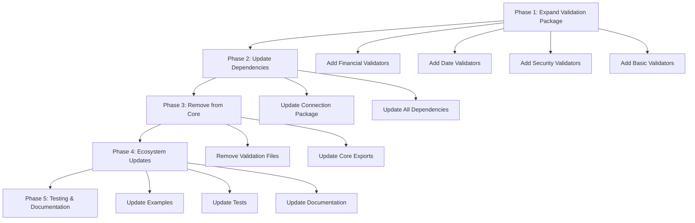

# 🎮 **VALIDATION MIGRATION QUEST** 🎮

## **Complete Migration to `reynard-validation` Package**

**Total Points Available: 2,500** 🏆
**Current Score: 0/2,500** ⭐

---

## 📊 **CURRENT STATE ANALYSIS**

### **🔍 Validation Functions Found in `reynard-core` (NEEDS MIGRATION):**

#### **💰 Financial Validation (150 points)**

- `isValidCreditCard()` - Luhn algorithm implementation
- `isValidPostalCode()` - Multi-country postal code validation
- `isValidSSN()` - US Social Security Number validation

#### **📅 Date Validation (100 points)**

- `isValidDate()` - Date validation with min/max range support
- `isValidAge()` - Age validation from birth date

#### **📁 File Validation (200 points)**

- `validateFileName()` - Comprehensive filename security validation
- `validateFileExtension()` - File extension validation
- `isValidFileType()` - Alias for file extension validation
- `validateFileSize()` - File size validation
- `isValidFileSize()` - Alias for file size validation
- `getSafeFilename()` - Filename sanitization

#### **🔒 Security Validation (400 points)**

- **SQL Validation**: `validateSQLInput()`, `sanitizeSQLInput()`, `validateSQLIdentifier()`, `validateSQLParameter()`
- **JSON Validation**: `validateJSON()`, `sanitizeJSON()`, `hasPrototypePollution()`
- **XSS Validation**: `validateXSSInput()`, `sanitizeXSSInput()`, `validateHTMLContent()`
- **MIME Validation**: `validateMimeType()`, `getMimeTypeFromExtension()`, `validateFileTypeByExtension()`, `isSafeMimeType()`, `getFileCategory()`

#### **🔧 Basic Validation (150 points)**

- `isValidUsername()`, `isValidHexColor()`, `isValidIPAddress()`, `isInRange()`, `isValidLength()`, `isRequired()`

#### **🔄 Duplication Issues (300 points)**

- **Connection Package**: Has its own validation system that duplicates `reynard-validation`

---

## 🎯 **MIGRATION PHASES**

---

## 🏆 **QUEST TASKS**

### **🔥 PHASE 1: EXPAND VALIDATION PACKAGE (800 points)**

#### **💰 Financial Validation Module (150 points)**

- [ ] **Task 1.1**: Create `reynard-validation/src/financial/credit-card.ts` (50 points)
  - Move `isValidCreditCard()` from core
  - Add comprehensive credit card validation with Luhn algorithm
  - Add support for different card types (Visa, MasterCard, etc.)
  - Add tests

- [ ] **Task 1.2**: Create `reynard-validation/src/financial/postal-code.ts` (50 points)
  - Move `isValidPostalCode()` from core
  - Enhance with more countries
  - Add validation result object format
  - Add tests

- [ ] **Task 1.3**: Create `reynard-validation/src/financial/ssn.ts` (50 points)
  - Move `isValidSSN()` from core
  - Add validation result object format
  - Add comprehensive SSN validation rules
  - Add tests

#### **📅 Date Validation Module (100 points)**

- [ ] **Task 1.4**: Create `reynard-validation/src/date/date-validation.ts` (50 points)
  - Move `isValidDate()` from core
  - Add validation result object format
  - Add timezone support
  - Add tests

- [ ] **Task 1.5**: Create `reynard-validation/src/date/age-validation.ts` (50 points)
  - Move `isValidAge()` from core
  - Add validation result object format
  - Add more age validation options
  - Add tests

#### **📁 File Validation Module (200 points)**

- [ ] **Task 1.6**: Create `reynard-validation/src/security/file-security.ts` (100 points)
  - Move `validateFileName()`, `validateFileExtension()`, `isValidFileType()`, `validateFileSize()`, `isValidFileSize()`, `getSafeFilename()` from core
  - Convert to validation result object format
  - Enhance security checks
  - Add tests

- [ ] **Task 1.7**: Create `reynard-validation/src/security/mime-validation.ts` (100 points)
  - Move MIME validation functions from core
  - Convert to validation result object format
  - Add more MIME types
  - Add tests

#### **🔒 Security Validation Module (200 points)**

- [ ] **Task 1.8**: Create `reynard-validation/src/security/sql-validation.ts` (50 points)
  - Move SQL validation functions from core
  - Convert to validation result object format
  - Enhance SQL injection detection
  - Add tests

- [ ] **Task 1.9**: Create `reynard-validation/src/security/json-validation.ts` (50 points)
  - Move JSON validation functions from core
  - Convert to validation result object format
  - Enhance prototype pollution detection
  - Add tests

- [ ] **Task 1.10**: Create `reynard-validation/src/security/xss-validation.ts` (50 points)
  - Move XSS validation functions from core
  - Convert to validation result object format
  - Enhance XSS detection patterns
  - Add tests

- [ ] **Task 1.11**: Create `reynard-validation/src/security/crypto-validation.ts` (50 points)
  - Move `validateCSRFToken()` from core
  - Convert to validation result object format
  - Add more crypto validation functions
  - Add tests

#### **🔧 Basic Validation Module (150 points)**

- [ ] **Task 1.12**: Create `reynard-validation/src/basic/username.ts` (25 points)
  - Move `isValidUsername()` from core
  - Convert to validation result object format
  - Add tests

- [ ] **Task 1.13**: Create `reynard-validation/src/basic/color.ts` (25 points)
  - Move `isValidHexColor()` from core
  - Convert to validation result object format
  - Add support for more color formats
  - Add tests

- [ ] **Task 1.14**: Create `reynard-validation/src/basic/ip-address.ts` (25 points)
  - Move `isValidIPAddress()` from core
  - Convert to validation result object format
  - Add tests

- [ ] **Task 1.15**: Create `reynard-validation/src/basic/range.ts` (25 points)
  - Move `isInRange()`, `isValidLength()`, `isRequired()` from core
  - Convert to validation result object format
  - Add tests

- [ ] **Task 1.16**: Update `reynard-validation/src/index.ts` exports (50 points)
  - Add all new validation functions to main exports
  - Create category-specific export files
  - Update documentation

---

### **🔄 PHASE 2: UPDATE DEPENDENCIES (600 points)**

#### **🔗 Connection Package Migration (300 points)**

- [ ] **Task 2.1**: Remove duplicate validation system from `reynard-connection` (100 points)
  - Delete `src/validation/` directory
  - Remove validation exports from `src/index.ts`
  - Remove validation dependencies

- [ ] **Task 2.2**: Add `reynard-validation` dependency to connection package (50 points)
  - Update `package.json`
  - Update imports throughout connection package

- [ ] **Task 2.3**: Update connection package to use `reynard-validation` (150 points)
  - Update all validation function calls
  - Convert boolean returns to result objects
  - Update error handling
  - Test connection package functionality

#### **📦 Other Package Updates (300 points)**

- [ ] **Task 2.4**: Search entire ecosystem for validation imports from `reynard-core` (50 points)
  - Use grep to find all imports
  - Create comprehensive list of files to update

- [ ] **Task 2.5**: Update all packages using core validation (250 points)
  - Update imports to use `reynard-validation`
  - Add `reynard-validation` dependencies
  - Update function calls to new API
  - Test each package

---

### **🧹 PHASE 3: REMOVE FROM CORE (400 points)**

#### **🗑️ File Cleanup (200 points)**

- [ ] **Task 3.1**: Remove validation files from `reynard-core` (100 points)
  - Delete `src/utils/validation/` directory
  - Delete `src/security/` validation files
  - Remove validation exports from `src/index.ts`
  - Remove validation exports from `src/security/index.ts`

- [ ] **Task 3.2**: Update core package dependencies (50 points)
  - Remove validation-related dependencies
  - Update `package.json`
  - Clean up unused imports

- [ ] **Task 3.3**: Update core package documentation (50 points)
  - Update README.md
  - Remove validation examples
  - Update API documentation

#### **🧪 Test Migration (200 points)**

- [ ] **Task 3.4**: Move validation tests to `reynard-validation` (100 points)
  - Move all validation tests from core to validation package
  - Update test imports and function calls
  - Ensure comprehensive test coverage

- [ ] **Task 3.5**: Remove validation tests from core (50 points)
  - Delete validation test files
  - Update test configurations
  - Clean up test dependencies

- [ ] **Task 3.6**: Update test configurations (50 points)
  - Update `tsconfig.json` path mappings
  - Remove old validation paths
  - Add new validation paths

---

### **🌍 PHASE 4: ECOSYSTEM UPDATES (500 points)**

#### **📚 Example Updates (200 points)**

- [ ] **Task 4.1**: Update `test-app` example (50 points)
  - Add `reynard-validation` dependency
  - Update imports and function calls
  - Test example functionality

- [ ] **Task 4.2**: Update all other example apps (150 points)
  - Update imports in all examples
  - Add `reynard-validation` dependencies
  - Test all examples

#### **📖 Documentation Updates (200 points)**

- [ ] **Task 4.3**: Update package READMEs (100 points)
  - Update `reynard-validation` README
  - Update `reynard-core` README
  - Update other package READMEs

- [ ] **Task 4.4**: Create migration guide (100 points)
  - Document breaking changes
  - Provide migration examples
  - Update API documentation

#### **⚙️ Configuration Updates (100 points)**

- [ ] **Task 4.5**: Update TypeScript configurations (50 points)
  - Update path mappings in all `tsconfig.json` files
  - Remove old validation paths
  - Add new validation paths

- [ ] **Task 4.6**: Update build configurations (50 points)
  - Update Vite configurations
  - Update build scripts
  - Test build processes

---

### **🧪 PHASE 5: TESTING & VALIDATION (200 points)**

#### **🔍 Comprehensive Testing (200 points)**

- [ ] **Task 5.1**: Run full test suite (50 points)
  - Run all validation tests
  - Run integration tests
  - Fix any failing tests

- [ ] **Task 5.2**: Performance testing (50 points)
  - Test validation function performance
  - Ensure no performance regressions
  - Optimize if needed

- [ ] **Task 5.3**: Security testing (50 points)
  - Test security validation functions
  - Ensure security is maintained
  - Run security audits

- [ ] **Task 5.4**: Final validation (50 points)
  - Verify all packages build successfully
  - Verify all examples work
  - Verify no breaking changes for end users

---

## 🎯 **SUCCESS CRITERIA**

- ✅ All validation logic centralized in `reynard-validation` package
- ✅ No validation functions remaining in `reynard-core`
- ✅ All packages updated to use `reynard-validation`
- ✅ No breaking changes for end users
- ✅ Comprehensive test coverage
- ✅ Updated documentation
- ✅ All examples working correctly
- ✅ Performance maintained or improved

---

## 🏅 **ACHIEVEMENTS**

### **🥉 Bronze Tier (500+ points)**

- Basic validation migration complete

### **🥈 Silver Tier (1,000+ points)**

- Core validation system migrated

### **🥇 Gold Tier (1,500+ points)**

- All validation functions migrated

### **💎 Diamond Tier (2,000+ points)**

- Ecosystem fully updated

### **👑 Legendary Tier (2,500+ points)**

- Complete migration with zero breaking changes

---

## 🚀 **READY TO START?**

**Current Progress: 0/2,500 points** ⭐

**Next Task**: Task 1.1 - Create `reynard-validation/src/financial/credit-card.ts` (50 points)

**Estimated Total Time**: 6-10 days

**Difficulty**: ⭐⭐⭐⭐ (Expert Level)

---

_May the validation force be with you! 🦊✨_
