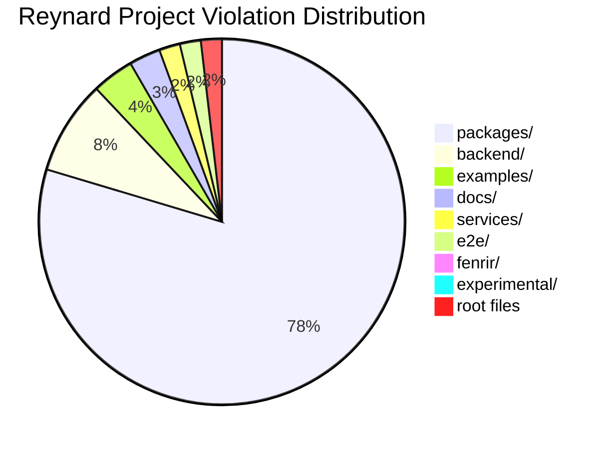
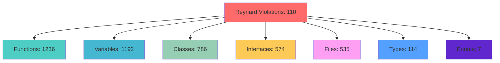
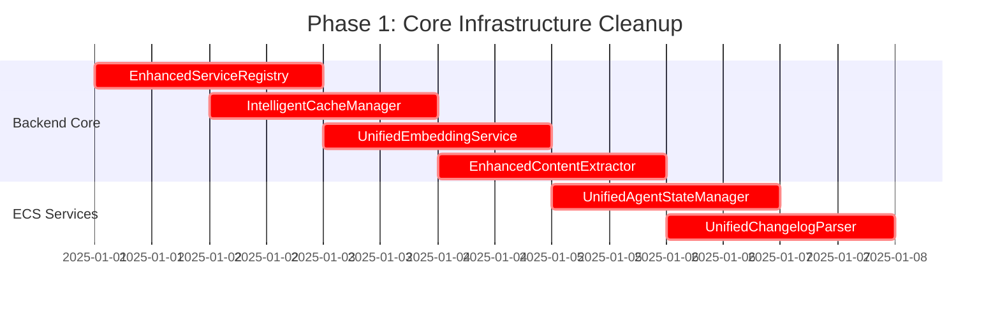
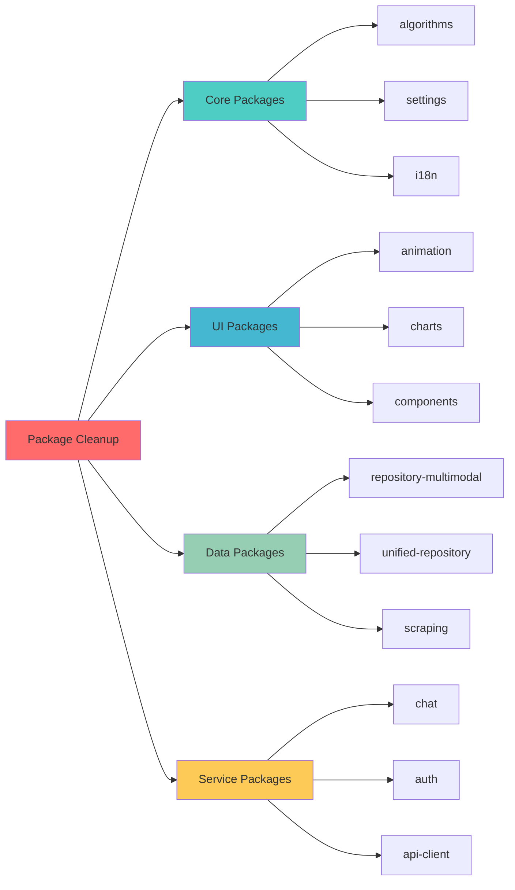
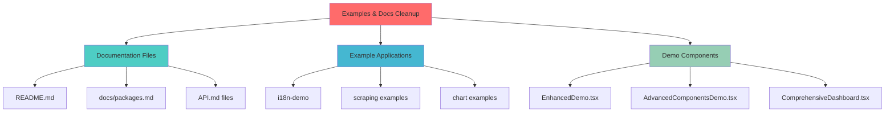
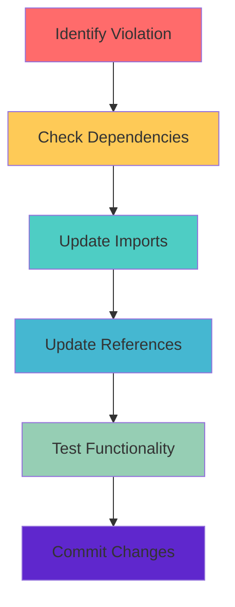
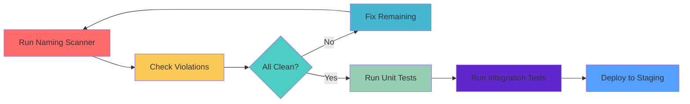
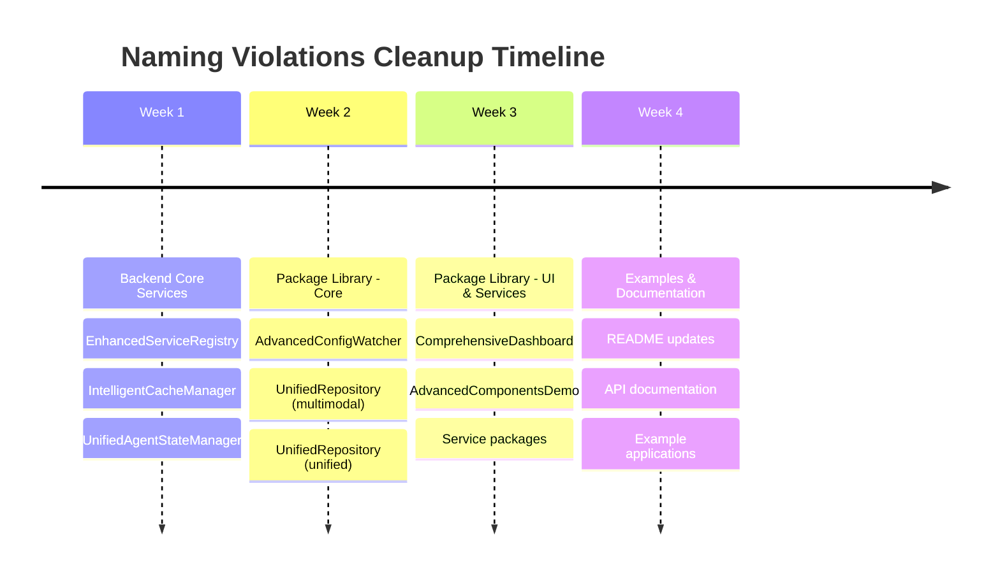

# 🦊 Naming Violations Cleanup Plan

_whiskers twitch with systematic precision_ A comprehensive action plan to eliminate 110 critical naming violations in the Reynard project (excluding third_party dependencies), focusing on removing forbidden marketing prefixes and establishing proper naming conventions.

## 📊 **VIOLATION ANALYSIS SUMMARY**

### Current State (Reynard Project Only)

- **Total Violations**: 4,444 (excluding third_party)
- **Reynard Critical Errors**: 110 (require immediate attention)
- **Reynard Warnings**: 4,334 (should be addressed for consistency)
- **Files Scanned**: 6,420
- **Scan Duration**: 6.5 seconds

> **Note**: Excluding `third_party/` directory (59 violations) as these are external dependencies that should not be modified.

### Distribution by Directory (Reynard Only)



### Violation Types Breakdown (Reynard Only)



## 🎯 **CRITICAL VIOLATIONS IDENTIFIED**

### Top Forbidden Prefixes Found (Reynard Only)

| Prefix           | Count | Examples                                                        | Priority    |
| ---------------- | ----- | --------------------------------------------------------------- | ----------- |
| `Enhanced*`      | 8+    | `EnhancedI`, `EnhancedDemo`, `EnhancedSearchResult`             | 🔴 Critical |
| `Advanced*`      | 6+    | `AdvancedConfigWatcher`, `AdvancedFeatures`, `AdvancedSettings` | 🔴 Critical |
| `Comprehensive*` | 6+    | `ComprehensiveDashboard`, `ComprehensiveModelEvaluator`         | 🔴 Critical |
| `Unified*`       | 4+    | `UnifiedRepository`, `UnifiedECS`, `UnifiedMetricsEngine`       | 🔴 Critical |
| `Smart*`         | 2+    | `SmartImportSystem`, `SmartAnimationCore`                       | 🟡 High     |
| `Complete*`      | 2+    | `CompleteCaptionWorkflow`, `CompleteSuiteDetails`               | 🟡 High     |

## 🗺️ **CLEANUP ROADMAP**

### Phase 1: Core Infrastructure (Week 1) 🔴

**Priority**: Critical - System Stability
**Target**: Backend services and core utilities



**Files to Fix**:

- `backend/app/core/enhanced_service_registry.py` → `service_registry.py`
- `backend/app/core/cache_optimizer.py` → `IntelligentCacheManager` → `CacheManager`
- `backend/app/services/rag/services/core/embedding.py` → `UnifiedEmbeddingService` → `EmbeddingService`
- `backend/app/services/scraping/extractors/enhanced_extractor.py` → `EnhancedContentExtractor` → `ContentExtractor`
- `backend/app/ecs/services/unified_agent_manager.py` → `UnifiedAgentStateManager` → `AgentStateManager`

### Phase 2: Package Library (Week 2-3) 🟡

**Priority**: High - Reusable Components
**Target**: All packages in `packages/` directory



**Critical Package Violations**:

- `packages/core/settings/src/components/AdvancedConfigWatcher.tsx` → `ConfigWatcher.tsx`
- `packages/data/repository-multimodal/src/services/UnifiedRepository.ts` → `Repository.ts`
- `packages/data/unified-repository/src/services/UnifiedRepository.ts` → `Repository.ts`
- `packages/ui/charts/examples/ComprehensiveDashboard.tsx` → `Dashboard.tsx`

### Phase 3: Examples & Documentation (Week 4) 🟢

**Priority**: Medium - Consistency
**Target**: Examples, docs, and demo code



## 🔧 **IMPLEMENTATION STRATEGY**

### Automated Refactoring Scripts

#### 1. Backend Python Refactoring

```python
# refactor_backend.py
import re
import os
from pathlib import Path

FORBIDDEN_PREFIXES = [
    'Enhanced', 'Advanced', 'Unified', 'Intelligent',
    'Smart', 'Comprehensive', 'Complete'
]

def refactor_python_file(file_path):
    """Refactor Python file to remove forbidden prefixes"""
    with open(file_path, 'r') as f:
        content = f.read()

    for prefix in FORBIDDEN_PREFIXES:
        # Replace class definitions
        content = re.sub(
            f'class {prefix}([A-Z][a-zA-Z]*)',
            r'class \1',
            content
        )
        # Replace function definitions
        content = re.sub(
            f'def {prefix}([A-Z][a-zA-Z]*)',
            r'def \1',
            content
        )

    with open(file_path, 'w') as f:
        f.write(content)
```

#### 2. TypeScript/React Refactoring

```typescript
// refactor_typescript.ts
import * as fs from "fs";
import * as path from "path";

const FORBIDDEN_PREFIXES = ["Enhanced", "Advanced", "Unified", "Intelligent", "Smart", "Comprehensive", "Complete"];

function refactorTypeScriptFile(filePath: string): void {
  let content = fs.readFileSync(filePath, "utf8");

  FORBIDDEN_PREFIXES.forEach(prefix => {
    // Replace class definitions
    content = content.replace(new RegExp(`class ${prefix}([A-Z][a-zA-Z]*)`, "g"), "class $1");
    // Replace function definitions
    content = content.replace(new RegExp(`function ${prefix}([A-Z][a-zA-Z]*)`, "g"), "function $1");
    // Replace component exports
    content = content.replace(new RegExp(`export.*${prefix}([A-Z][a-zA-Z]*)`, "g"), "export $1");
  });

  fs.writeFileSync(filePath, content);
}
```

### Manual Review Process

#### Step 1: Impact Analysis



#### Step 2: Naming Convention Application

| Current Violation         | Corrected Name  | Reasoning                                        |
| ------------------------- | --------------- | ------------------------------------------------ |
| `EnhancedSearchResult`    | `SearchResult`  | Remove marketing prefix, keep core functionality |
| `IntelligentCacheManager` | `CacheManager`  | Clear, descriptive, no marketing language        |
| `UnifiedRepository`       | `Repository`    | Simple, direct, follows existing patterns        |
| `AdvancedConfigWatcher`   | `ConfigWatcher` | Focuses on actual functionality                  |
| `ComprehensiveDashboard`  | `Dashboard`     | Clear purpose without marketing fluff            |

## 📋 **DETAILED TASK BREAKDOWN**

### Week 1: Backend Core Services

- [ ] **Day 1-2**: Fix `EnhancedServiceRegistry` → `ServiceRegistry`
  - Update class name in `backend/app/core/enhanced_service_registry.py`
  - Update all imports and references
  - Test service registration functionality
  - Update documentation

- [ ] **Day 3-4**: Fix `IntelligentCacheManager` → `CacheManager`
  - Update class name in `backend/app/core/cache_optimizer.py`
  - Update all imports and references
  - Test cache optimization functionality
  - Update configuration files

- [ ] **Day 5-7**: Fix ECS Services
  - `UnifiedAgentStateManager` → `AgentStateManager`
  - `UnifiedChangelogParser` → `ChangelogParser`
  - Update all ECS-related imports
  - Test agent state management
  - Test changelog parsing functionality

### Week 2: Package Library - Core

- [ ] **Day 1-3**: Fix Core Packages
  - `AdvancedConfigWatcher` → `ConfigWatcher` in `packages/core/settings/`
  - Update all component imports
  - Test configuration watching functionality
  - Update package documentation

- [ ] **Day 4-7**: Fix Data Packages
  - `UnifiedRepository` → `Repository` in `packages/data/repository-multimodal/`
  - `UnifiedRepository` → `Repository` in `packages/data/unified-repository/`
  - Update all repository imports
  - Test data repository functionality
  - Update API documentation

### Week 3: Package Library - UI & Services

- [ ] **Day 1-4**: Fix UI Packages
  - `ComprehensiveDashboard` → `Dashboard` in `packages/ui/charts/examples/`
  - `AdvancedComponentsDemo` → `ComponentsDemo` in `packages/media/gallery/`
  - Update all component imports
  - Test UI functionality
  - Update component documentation

- [ ] **Day 5-7**: Fix Service Packages
  - Update any service-related violations
  - Test service integrations
  - Update service documentation

### Week 4: Examples & Documentation

- [ ] **Day 1-3**: Fix Documentation
  - Update `README.md` files
  - Update `docs/packages.md`
  - Update API documentation files
  - Ensure consistency across all docs

- [ ] **Day 4-7**: Fix Examples & Demos
  - `EnhancedDemo` → `Demo` in `examples/i18n-demo/`
  - `AdvancedScrapingExample` → `ScrapingExample` in `packages/data/scraping/examples/`
  - Update all example imports
  - Test example functionality
  - Update example documentation

## 🧪 **TESTING STRATEGY**

### Automated Testing



### Test Checklist

- [ ] All naming violations resolved
- [ ] Unit tests pass for refactored components
- [ ] Integration tests pass for updated services
- [ ] Documentation updated and consistent
- [ ] Examples work correctly
- [ ] No breaking changes introduced

## 📊 **SUCCESS METRICS**

### Quantitative Goals

- **Target**: 0 critical errors (currently 110 in Reynard project)
- **Target**: <100 warnings (currently 4,334 in Reynard project)
- **Target**: 100% test coverage maintained
- **Target**: 0 breaking changes

### Qualitative Goals

- Consistent naming across entire codebase
- Clear, descriptive component names
- No marketing language in technical code
- Improved developer experience
- Better code maintainability

## 🚀 **EXECUTION TIMELINE**



## 🔧 **SCANNER CONFIGURATION**

### Exclude Third-Party Dependencies

The naming violation scanner should be configured to exclude the `third_party/` directory from scans:

```bash
# Run scanner excluding third_party
npx reynard-code-quality naming-violations --exclude "third_party/**"

# Or update scanner configuration
# In packages/dev-tools/code-quality/src/NamingViolationScanner.ts
const DEFAULT_EXCLUDES = [
  'node_modules/**',
  'dist/**',
  'build/**',
  'third_party/**',  // Add this line
  '**/__tests__/**'
];
```

### Focus on Reynard Project Only

- **Target**: 110 critical violations in Reynard codebase
- **Exclude**: 59 violations in third_party dependencies
- **Scope**: Only modify Reynard-owned code

## 🎯 **IMMEDIATE NEXT STEPS**

1. **Start with Backend Core** (Highest Impact)
   - Fix `EnhancedServiceRegistry` first
   - Test thoroughly before proceeding
   - Update all dependent code

2. **Set up Automated Scanning**
   - Add naming scanner to CI/CD pipeline
   - Configure to exclude third_party directory
   - Prevent future violations
   - Monitor progress automatically

3. **Create Refactoring Scripts**
   - Automate common patterns
   - Reduce manual effort
   - Ensure consistency

4. **Document Progress**
   - Track completion percentage
   - Log any issues encountered
   - Update this plan as needed

---

_whiskers twitch with determined focus_ This systematic approach will transform the Reynard codebase from marketing-heavy naming to clean, professional, and maintainable code that follows the Reynard way of excellence. Each violation fixed brings us closer to a codebase that speaks for itself through clear, purposeful naming. 🦊
