# 🦊 Reynard: The Universal AI Development Ecosystem

**Reynard is a comprehensive AI-powered development ecosystem that aims to bridge the gap between traditional frameworks**
**and modern AI development needs.** Evolved from YipYap's multi-modal content management system, Reynard represents an
attempt to create a unified platform where developers, researchers, enterprises, and creators can build, experiment, and
deploy intelligent applications with greater ease.

## ⚠️ **Implementation Status Warning**

> **🚧 This README describes the intended architecture and feature set. Many features are currently in early development or planning stages.**

**Current Status:**

- **✅ Fully Implemented**: Core framework, basic components, authentication, theming system
- **🚧 In Development**: Advanced AI features, comprehensive backend services, real-time collaboration
- **📋 Planned**: Enterprise features, advanced analytics, distributed processing

**Package Versions:**

- Most packages are at version 0.1.0-0.2.0 (early development)
- Features described may be partially implemented or stubs
- API stability is not guaranteed until v1.0.0

**For Production Use:**

- Review actual package implementations before integration
- Check individual package READMEs for current capabilities
- Consider this a development preview, not production-ready software

## What Reynard Offers

**For Developers**, Reynard provides a full-stack platform combining SolidJS frontend frameworks with FastAPI backend
services, including 20+ npm packages, 47 MCP development tools, and comprehensive testing infrastructure.
**For AI/ML Researchers**, it offers an experimental environment featuring ECS world simulation with agent archetypes,
trait inheritance systems, and AI model integration including caption generation, RAG systems, and TTS.
**For Enterprises**, it provides service orchestration with AI capabilities, security testing through the FENRIR
framework, and deployment tools for digital transformation projects.

Reynard includes:

- **🌍 ECS World Simulation**: Virtual environments where AI agents can evolve and develop behaviors through trait inheritance
- **🤖 Multi-Modal AI Services**: Integrated caption generation, RAG systems, TTS synthesis, and vector databases
- **🛠️ Development Infrastructure**: 47 MCP tools for code quality, security testing, and development workflow automation
- **🔒 Security Research Platform**: FENRIR framework with attack vectors for AI service evaluation
- **📚 Educational Resources**: 15+ example applications, tutorials, and documentation for different skill levels
- **🎨 Creative Toolkit**: Multi-modal content management and AI-powered caption generation for creative workflows

Whether you're a **startup founder** prototyping AI-powered products, a **university researcher** studying digital
ecosystems, an **enterprise architect** building AI infrastructure, or a **creative professional** exploring AI-assisted
workflows, Reynard aims to provide the tools and infrastructure to support your work.

**Built on foundations** from YipYap's multi-modal CMS, enhanced with research in AI agent simulation, and designed with
practical development needs in mind, Reynard represents an attempt to create a more integrated approach to intelligent
application development—where different tools and services work together to reduce complexity and accelerate development.

**This is an attempt to build something more than a framework—a comprehensive ecosystem for the future of development.**

## Table of Contents

- [🦊 Reynard: The Universal AI Development Ecosystem](#-reynard-the-universal-ai-development-ecosystem)
  - [⚠️ **Implementation Status Warning**](#️-implementation-status-warning)
  - [What Reynard Offers](#what-reynard-offers)
  - [Table of Contents](#table-of-contents)
  - [🚀 Quick Start](#-quick-start)
    - [Development Server Management](#development-server-management)
  - [📚 Documentation](#-documentation)
  - [✨ Key Features](#-key-features)
  - [📦 Package Ecosystem](#-package-ecosystem)
    - [🤖 AI \& Machine Learning (`packages/ai/`)](#-ai--machine-learning-packagesai)
    - [🏗️ Core Framework (`packages/core/`)](#️-core-framework-packagescore)
    - [📊 Data Processing (`packages/data/`)](#-data-processing-packagesdata)
    - [🛠️ Development Tools (`packages/dev-tools/`)](#️-development-tools-packagesdev-tools)
    - [📚 Documentation (`packages/docs/`)](#-documentation-packagesdocs)
    - [🎨 Media Processing (`packages/media/`)](#-media-processing-packagesmedia)
    - [🔧 Services (`packages/services/`)](#-services-packagesservices)
    - [🎨 UI \& Components (`packages/ui/`)](#-ui--components-packagesui)
  - [📧 Advanced Email Features](#-advanced-email-features)
    - [🏗️ Email System Architecture](#️-email-system-architecture)
    - [🚀 Email System Capabilities](#-email-system-capabilities)
      - [📊 Advanced Email Analytics](#-advanced-email-analytics)
      - [🔐 Email Encryption (PGP/SMIME)](#-email-encryption-pgpsmime)
      - [📅 Calendar Integration](#-calendar-integration)
      - [🤖 AI-Powered Email Responses](#-ai-powered-email-responses)
      - [👥 Multi-Account Support](#-multi-account-support)
    - [🔧 Technical Implementation](#-technical-implementation)
      - [Architecture](#architecture)
      - [Integration Points](#integration-points)
    - [📈 Performance Features](#-performance-features)
      - [Analytics Performance](#analytics-performance)
      - [AI Response Performance](#ai-response-performance)
    - [🛡️ Security Features](#️-security-features)
      - [Encryption Security](#encryption-security)
      - [Multi-Account Security](#multi-account-security)
    - [🎯 Use Cases](#-use-cases)
      - [For Administrators](#for-administrators)
      - [For Agents](#for-agents)
      - [For Users](#for-users)
  - [🎯 Philosophy](#-philosophy)
  - [🧪 Testing Overview](#-testing-overview)
  - [🐺 Security Testing with FENRIR](#-security-testing-with-fenrir)
  - [🚀 Performance](#-performance)
    - [Bundle Sizes](#bundle-sizes)
  - [📚 Detailed Package Documentation](#-detailed-package-documentation)
    - [Core Package Details](#core-package-details)
    - [Specialized Package Details](#specialized-package-details)
  - [🎨 Theming System Overview](#-theming-system-overview)
  - [📱 Examples and Templates Overview](#-examples-and-templates-overview)
    - [Real-World Applications](#real-world-applications)
    - [Templates](#templates)
    - [reynard-chat](#reynard-chat)
      - [Chat Features](#chat-features)
      - [Chat Components](#chat-components)
      - [Chat Composables](#chat-composables)
      - [Chat Example Usage](#chat-example-usage)
    - [reynard-rag](#reynard-rag)
      - [RAG Features](#rag-features)
      - [RAG Components](#rag-components)
      - [RAG Example Usage](#rag-example-usage)
    - [reynard-auth](#reynard-auth)
      - [Auth Features](#auth-features)
      - [Auth Components](#auth-components)
      - [Auth Composables](#auth-composables)
      - [Auth Example Usage](#auth-example-usage)
    - [reynard-charts](#reynard-charts)
      - [Chart Types](#chart-types)
      - [Charts Features](#charts-features)
      - [Charts Example Usage](#charts-example-usage)
    - [reynard-gallery](#reynard-gallery)
      - [Gallery Features](#gallery-features)
      - [Gallery Components](#gallery-components)
      - [Gallery Composables](#gallery-composables)
      - [Gallery Example Usage](#gallery-example-usage)
    - [reynard-settings](#reynard-settings)
      - [Settings Features](#settings-features)
      - [Setting Types](#setting-types)
      - [Settings Components](#settings-components)
      - [Settings Composables](#settings-composables)
      - [Settings Example Usage](#settings-example-usage)
    - [reynard-algorithms](#reynard-algorithms)
      - [Algorithm Types](#algorithm-types)
      - [Core Features](#core-features)
      - [Algorithms Example Usage](#algorithms-example-usage)
    - [reynard-file-processing](#reynard-file-processing)
      - [Supported File Types](#supported-file-types)
      - [Core Components](#core-components)
      - [File Processing Example Usage](#file-processing-example-usage)
    - [reynard-annotating](#reynard-annotating)
      - [Annotating Features](#annotating-features)
      - [Annotating Components](#annotating-components)
      - [Annotating Example Usage](#annotating-example-usage)
    - [reynard-caption](#reynard-caption)
      - [Caption Features](#caption-features)
      - [Caption Components](#caption-components)
      - [Caption Example Usage](#caption-example-usage)
      - [Complete Caption Workflow Example](#complete-caption-workflow-example)
    - [reynard-email](#reynard-email)
      - [Email Features](#email-features)
      - [Email Components](#email-components)
      - [Email Composables](#email-composables)
      - [Email Example Usage](#email-example-usage)
    - [reynard-testing](#reynard-testing)
      - [Testing Features](#testing-features)
      - [Testing Utilities](#testing-utilities)
      - [Testing Example Usage](#testing-example-usage)
  - [🎨 Advanced Theming System](#-advanced-theming-system)
    - [Custom Themes](#custom-themes)
  - [📱 Comprehensive Examples and Templates](#-comprehensive-examples-and-templates)
    - [**🎯 Real-World Applications**](#-real-world-applications)
    - [Templates](#templates-1)
    - [Running Examples](#running-examples)
  - [🧪 Testing Implementation](#-testing-implementation)
    - [Core Testing Stack](#core-testing-stack)
    - [Test Coverage](#test-coverage)
  - [♿ Accessibility](#-accessibility)
  - [🌍 Internationalization](#-internationalization)
  - [🛠️ Development Tools](#️-development-tools)
    - [CLI Tools](#cli-tools)
    - [VS Code Extension](#vs-code-extension)
  - [📖 API Reference](#-api-reference)
    - [Core API](#core-api)
    - [Component API](#component-api)
  - [🧪 Development](#-development)
    - [**🦊 Getting Started with Reynard**](#-getting-started-with-reynard)
  - [🤝 Contributing](#-contributing)
    - [Development Setup](#development-setup)
    - [Code Style](#code-style)
  - [📄 License](#-license)
  - [🙏 Acknowledgments](#-acknowledgments)
    - [**🦊 Core Framework \& Libraries**](#-core-framework--libraries)
      - [**Frontend Framework**](#frontend-framework)
      - [**Data Visualization**](#data-visualization)
      - [**Code Editing \& Syntax Highlighting**](#code-editing--syntax-highlighting)
      - [**UI Components \& Icons**](#ui-components--icons)
      - [**Security \& Authentication**](#security--authentication)
      - [**Date \& Time Utilities**](#date--time-utilities)
    - [**🦦 Backend \& AI/ML Infrastructure**](#-backend--aiml-infrastructure)
      - [**Web Framework**](#web-framework)
      - [**Database \& Vector Search**](#database--vector-search)
      - [**AI/ML Models \& Services**](#aiml-models--services)
      - [**Security \& Cryptography**](#security--cryptography)
    - [**🦦 AI/ML Models \& Integrations**](#-aiml-models--integrations)
      - [**Core Capabilities**](#core-capabilities)
    - [**🧪 Testing \& Development Tools**](#-testing--development-tools)
      - [**Testing Frameworks**](#testing-frameworks)
      - [**Development Tools**](#development-tools)
    - [**🎯 Research and Development**](#-research-and-development)
      - [**Academic Papers \& Research**](#academic-papers--research)
      - [**Development \& Architecture**](#development--architecture)
    - [**🐺 Security Research**](#-security-research)
      - [**CL4R1T4S Research**](#cl4r1t4s-research)
    - [**📚 Documentation \& Standards**](#-documentation--standards)
  - [📞 Support](#-support)
  - [🚀 The Future of Reynard](#-the-future-of-reynard)
    - [**🦊 Join the Evolution**](#-join-the-evolution)

## 🚀 Quick Start

```bash
# Install core package
pnpm install reynard-core solid-js

# Install additional packages as needed
pnpm install reynard-components reynard-chat reynard-rag reynard-auth

# Start building
pnpm create reynard-app my-app
```

### Development Server Management

Reynard includes a comprehensive dev server management system:

```bash
# List all available projects
dev-server list

# Start a development server
dev-server start test-app

# Start in detached mode (background)
dev-server start test-app --detached

# Check server status
dev-server status

# Stop all servers
dev-server stop-all
```

See the [Dev Server Management README](packages/dev-server-management/README.md) for complete documentation.

```tsx
import { createSignal } from "solid-js";
import { useNotifications } from "reynard-core";
import { Button, Card } from "reynard-components";

function App() {
  const { notify } = useNotifications();

  return (
    <Card padding="lg">
      <h1>Welcome to Reynard!</h1>
      <Button onClick={() => notify("Hello from Reynard!", "success")}>Get Started</Button>
    </Card>
  );
}
```

## 📚 Documentation

- **[📖 Overview](./docs/README.md)** - Framework introduction and philosophy
- **[🚀 Quick Start](./docs/quickstart.md)** - Get up and running in minutes
- **[📚 Complete Tutorial](./docs/tutorial.md)** - Build your first Reynard app
- **[📦 Package Documentation](./docs/packages.md)** - Detailed package documentation
- **[🎨 OKLCH Color System](./docs/oklch-color-system.md)** - Modern color system with perceptual uniformity
- **[📱 Examples & Templates](./docs/examples.md)** - Real-world applications
- **[📖 API Reference](./docs/api.md)** - Complete API documentation
- **[🚀 Performance Guide](./docs/performance.md)** - Optimization and performance tips
- **[🏗️ Architecture Patterns](./docs/architecture/modularity-patterns.md)** - Modularity patterns and refactoring strategies
- **[🤝 Contributing](./CONTRIBUTING.md)** - How to contribute to Reynard
- **[🔒 Security Testing](./fenrir/README.md)** - FENRIR security testing framework

## ✨ Key Features

- **🎯 Multi-Modal Content Management** - Images, videos, audio, documents, and specialized formats
- **🤖 AI/ML Integration** - Caption generation, RAG system, object detection, and TTS
- **📧 Advanced Email System** - AI-powered responses, encryption, analytics, and multi-account support
- **🌍 Single Authoritative ECS World** - Centralized agent simulation with trait inheritance and breeding
- **🔗 MCP Server Integration** - Comprehensive MCP tools for agent management and world simulation
- **🎨 8 Built-in Themes** - Light, dark, and custom themes with CSS custom properties
- **🌍 37 Languages** - Internationalization with RTL support and locale-aware formatting
- **♿ WCAG 2.1 Compliance** - Full accessibility with ARIA labels and keyboard navigation
- **⚡ Performance Optimized** - Bundle splitting, lazy loading, and intelligent caching
- **🔧 TypeScript First** - Full type safety with comprehensive type definitions

## 📦 Package Ecosystem

Reynard's package ecosystem is built on the foundation of YipYap's architecture, with each package designed to be
independently useful while working seamlessly together. The core package has minimal dependencies and works standalone,
while other packages can be added as needed. All packages are published to npm and ready for production use!

### 🤖 AI & Machine Learning (`packages/ai/`)

- **`ai-shared`** - Shared AI utilities and types
- **`annotating-core`** - Core annotation functionality
- **`annotating-florence2`** - Florence2 model integration
- **`annotating-joy`** - Joy model integration
- **`annotating-jtp2`** - JTP2 model integration
- **`annotating-ui`** - Annotation UI components
- **`annotating-wdv3`** - WDV3 model integration
- **`caption`** - Image captioning functionality
- **`caption-core`** - Core captioning functionality
- **`caption-multimodal`** - Multimodal captioning
- **`caption-ui`** - Caption UI components
- **`comfy`** - ComfyUI integration
- **`model-management`** - AI model management
- **`multimodal`** - Multimodal AI capabilities
- **`nlweb`** - Natural language web processing
- **`rag`** - Retrieval-Augmented Generation
- **`tool-calling`** - AI tool calling utilities

### 🏗️ Core Framework (`packages/core/`)

- **`algorithms`** - Algorithm implementations and data structures
- **`composables`** - Reusable Vue composables for common patterns
- **`config`** - Configuration management and environment handling
- **`connection`** - WebSocket and real-time communication utilities
- **`core`** - Core utilities, types, and shared functionality
- **`features`** - Feature flags and conditional functionality
- **`i18n`** - Internationalization with 37 language support
- **`settings`** - User settings and preferences management
- **`testing`** - Testing utilities and configurations
- **`validation`** - Data validation and schema management

### 📊 Data Processing (`packages/data/`)

- **`file-processing`** - File processing utilities
- **`repository-core`** - Core repository functionality
- **`repository-multimodal`** - Multimodal data repository
- **`repository-search`** - Search functionality
- **`repository-storage`** - Storage management
- **`scraping`** - Web scraping utilities
- **`unified-repository`** - Unified data repository

### 🛠️ Development Tools (`packages/dev-tools/`)

- **`adr-system`** - Architecture Decision Records
- **`code-quality`** - Code quality tools and utilities
- **`dev-server-management`** - Development server management
- **`git-automation`** - Git workflow automation
- **`humility-parser`** - Humility parser for documentation
- **`project-architecture`** - Project architecture tools
- **`queue-watcher`** - Queue monitoring and management

### 📚 Documentation (`packages/docs/`)

- **`diagram-generator`** - Diagram generation utilities
- **`docs-components`** - Documentation components
- **`docs-core`** - Core documentation functionality
- **`docs-generator`** - Documentation generation
- **`docs-site`** - Documentation site

### 🎨 Media Processing (`packages/media/`)

- **`3d`** - Three.js integration for 3D graphics
- **`audio`** - Audio processing and playback
- **`boundingbox`** - Bounding box and annotation tools
- **`gallery`** - Advanced file management with drag-and-drop
- **`gallery-ai`** - AI-powered gallery features
- **`gallery-dl`** - Gallery download and scraping
- **`image`** - Image processing and manipulation
- **`segmentation`** - Image segmentation tools
- **`video`** - Video processing and playback

### 🔧 Services (`packages/services/`)

- **`api-client`** - API client utilities
- **`auth`** - Complete authentication system with JWT and security features
- **`chat`** - Real-time chat system with streaming and tool integration
- **`email`** - Comprehensive email system with AI-powered responses, encryption, and analytics
- **`service-manager`** - Service management

### 🎨 UI & Components (`packages/ui/`)

- **`animation`** - Animation utilities
- **`charts`** - Data visualization components built on Chart.js
- **`colors`** - Color utilities and palettes
- **`components-charts`** - Chart-specific components
- **`components-core`** - UI components, modals, tooltips, forms
- **`components-dashboard`** - Dashboard-specific components
- **`components-themes`** - Theme-aware components
- **`components-utils`** - Utility components
- **`dashboard`** - Dashboard layout and functionality
- **`error-boundaries`** - Error handling and boundary components
- **`floating-panel`** - Advanced floating panel system with staggered animations and state management
- **`fluent-icons`** - Icon library and components
- **`games`** - Game development utilities
- **`monaco`** - Code editor integration
- **`themes`** - Theming system with 8 built-in themes and i18n support
- **`ui`** - UI utilities and layout components

_[View complete package list and documentation →](./docs/packages.md)_

## 📧 Advanced Email Features

Reynard includes a comprehensive email system with enterprise-grade capabilities, AI-powered intelligence, and advanced security features.

### 🏗️ Email System Architecture

```mermaid
graph TB
    %% Frontend Layer
    subgraph "Frontend (SolidJS)"
        direction TB
        EC[EmailComposer]
        EA[EmailAnalytics]
        EM[EncryptionManager]
        CS[CalendarScheduler]
        MAM[MultiAccountManager]

        subgraph "Composables"
            UE[useEmail]
            UAE[useAgentEmail]
            UI[useImap]
        end

        subgraph "API Client"
            AC[reynard-api-client]
        end
    end

    %% Backend Services Layer
    subgraph "Backend Services (FastAPI)"
        direction TB

        subgraph "Core Email Services"
            ES[EmailService]
            IS[ImapService]
            AES[AgentEmailService]
        end

        subgraph "Advanced Email Services"
            EAS[EmailAnalyticsService]
            EES[EmailEncryptionService]
            AERS[AIEmailResponseService]
            CIS[CalendarIntegrationService]
            MAS[MultiAccountService]
        end

        subgraph "API Routes"
            ER[EmailRoutes]
            IMR[ImapRoutes]
            AER[AgentEmailRoutes]
            EAR[EmailAnalyticsRoutes]
        end
    end

    %% External Integrations
    subgraph "External Services"
        direction TB

        subgraph "Email Providers"
            SMTP[SMTP Servers]
            IMAP[IMAP Servers]
        end

        subgraph "AI/LLM Services"
            OpenAI[OpenAI GPT]
            Claude[Anthropic Claude]
        end

        subgraph "Calendar Services"
            GC[Google Calendar]
            CD[CalDAV]
        end

        subgraph "Encryption"
            PGP[PGP Keys]
            SMIME[SMIME Certificates]
        end
    end

    %% Data Storage
    subgraph "Data Storage"
        direction TB
        JSON[JSON Files]
        CACHE[Cache Storage]
        KEYS[Key Storage]
    end

    %% ECS World Integration
    subgraph "ECS World"
        direction TB
        AGENTS[Agent System]
        TRAITS[Trait Inheritance]
        BREEDING[Breeding System]
    end

    %% Connections
    EC --> UE
    EA --> UE
    EM --> UE
    CS --> UE
    MAM --> UE

    UE --> AC
    UAE --> AC
    UI --> AC

    AC --> ER
    AC --> IMR
    AC --> AER
    AC --> EAR

    ER --> ES
    IMR --> IS
    AER --> AES
    EAR --> EAS

    ES --> SMTP
    IS --> IMAP

    EAS --> JSON
    EES --> KEYS
    AERS --> OpenAI
    AERS --> Claude
    CIS --> GC
    CIS --> CD
    MAS --> JSON

    EES --> PGP
    EES --> SMIME

    AES --> AGENTS
    AERS --> AGENTS

    EAS --> CACHE
    AERS --> CACHE

    %% Styling
    classDef frontend fill:#e1f5fe,stroke:#01579b,stroke-width:2px
    classDef backend fill:#f3e5f5,stroke:#4a148c,stroke-width:2px
    classDef external fill:#fff3e0,stroke:#e65100,stroke-width:2px
    classDef storage fill:#e8f5e8,stroke:#1b5e20,stroke-width:2px
    classDef ecs fill:#fce4ec,stroke:#880e4f,stroke-width:2px

    class EC,EA,EM,CS,MAM,UE,UAE,UI,AC frontend
    class ES,IS,AES,EAS,EES,AERS,CIS,MAS,ER,IMR,AER,EAR backend
    class SMTP,IMAP,OpenAI,Claude,GC,CD,PGP,SMIME external
    class JSON,CACHE,KEYS storage
    class AGENTS,TRAITS,BREEDING ecs
```



This comprehensive diagram illustrates the complete email system architecture, showing:

- **Frontend Layer**: SolidJS components and composables for user interaction
- **Backend Services**: FastAPI services handling core and advanced email functionality
- **External Integrations**: SMTP/IMAP servers, AI/LLM services, calendar providers, and encryption systems
- **Data Storage**: JSON files, cache storage, and secure key storage
- **ECS World Integration**: Agent system integration with trait inheritance and breeding capabilities

The architecture demonstrates the modular design with clear separation of concerns, comprehensive external integrations, and seamless integration with the Reynard ECS agent system.

### 🚀 Email System Capabilities

#### 📊 Advanced Email Analytics

- **Comprehensive Metrics** - Total emails, response times, volume trends, agent activity
- **Intelligent Insights** - Automated analysis with trend detection, anomaly identification, and recommendations
- **Performance Analytics** - Agent-specific performance tracking and benchmarking
- **Real-time Dashboard** - Live analytics with caching for optimal performance
- **Custom Reports** - Daily, weekly, monthly, and custom period reporting

#### 🔐 Email Encryption (PGP/SMIME)

- **PGP Support** - Full PGP key generation, import, and management
- **SMIME Support** - SMIME encryption and signing capabilities
- **Key Management** - Secure key storage with fingerprint validation
- **Auto-encryption** - Configurable automatic encryption for sensitive emails
- **Digital Signatures** - Email signing and verification

#### 📅 Calendar Integration

- **Meeting Extraction** - AI-powered extraction of meeting requests from emails
- **Smart Scheduling** - Automatic meeting scheduling with conflict detection
- **Calendar Sync** - Integration with Google Calendar and CalDAV
- **Availability Checking** - Real-time availability and time slot suggestions
- **Meeting Management** - Reschedule, cancel, and update meetings

#### 🤖 AI-Powered Email Responses

- **LLM Integration** - Support for OpenAI GPT and Anthropic Claude models
- **Context Analysis** - Intelligent email context extraction and analysis
- **Response Generation** - AI-powered email response creation with tone control
- **Auto-replies** - Automated response generation for agent emails
- **Response History** - Track and analyze AI response patterns

#### 👥 Multi-Account Support

- **Account Management** - Support for multiple email accounts per user/agent
- **Permission System** - Granular permissions and access control
- **Usage Tracking** - Comprehensive usage statistics and monitoring
- **Account Isolation** - Separate configurations for each account
- **Primary Account** - Designated primary accounts with fallback support

### 🔧 Technical Implementation

#### Architecture

- **Modular Design** - Each feature is implemented as a separate service
- **Async Support** - Full async/await support for optimal performance
- **Error Handling** - Comprehensive error handling with detailed logging
- **Data Persistence** - JSON-based storage with automatic serialization
- **Caching** - Intelligent caching for frequently accessed data

#### Integration Points

- **Existing Email Service** - Seamless integration with current email infrastructure
- **IMAP Service** - Enhanced with agent detection and automated processing
- **Agent System** - Full integration with MCP/ECS agent framework
- **Authentication** - Consistent authentication across all endpoints

### 📈 Performance Features

#### Analytics Performance

- **Caching** - 15-minute cache for frequently accessed metrics
- **Parallel Processing** - Concurrent data gathering for dashboard endpoints
- **Efficient Storage** - Optimized JSON storage with compression
- **Real-time Updates** - Live data updates with minimal latency

#### AI Response Performance

- **Model Selection** - Support for multiple LLM providers
- **Response Caching** - Cache frequently generated responses
- **Batch Processing** - Efficient batch processing for multiple requests
- **Confidence Scoring** - Quality assessment for generated responses

### 🛡️ Security Features

#### Encryption Security

- **Key Management** - Secure key generation and storage
- **Access Control** - Permission-based key access
- **Audit Trail** - Complete audit trail for encryption operations
- **Key Rotation** - Support for key rotation and revocation

#### Multi-Account Security

- **Isolation** - Complete account isolation with separate configurations
- **Permission System** - Granular permissions and access control
- **Rate Limiting** - Per-account rate limiting and usage monitoring
- **Domain Control** - Domain-based access restrictions

### 🎯 Use Cases

#### For Administrators

- **Email Analytics** - Comprehensive email system monitoring and optimization
- **Account Management** - Multi-account setup and management
- **Security Control** - Encryption key management and security policies
- **Performance Monitoring** - System-wide performance and usage analytics

#### For Agents

- **AI Responses** - Automated email response generation
- **Meeting Scheduling** - Automatic meeting extraction and scheduling
- **Encrypted Communication** - Secure email communication with PGP/SMIME
- **Multi-Account** - Support for multiple email identities

#### For Users

- **Smart Inbox** - AI-powered email organization and prioritization
- **Meeting Integration** - Seamless meeting scheduling from emails
- **Secure Communication** - End-to-end encrypted email communication
- **Analytics Dashboard** - Personal email analytics and insights

## 🎯 Philosophy

Reynard is guided by the "cunning fox" philosophy. The framework values smart, elegant solutions over unnecessary
complexity, aiming to be adaptable so it can integrate seamlessly with your existing patterns. It is resourceful,
minimizing dependencies while maximizing functionality, and maintains a professional standard with high
expectations for code quality and naming conventions.

## 🧪 Testing Overview

Reynard includes comprehensive testing with a unified testing stack:

> _Core Testing Stack:_

- **Vitest** - Fast, modern test runner with TypeScript support
- **happy-dom** - Lightweight DOM environment (replacing jsdom for better performance)
- **reynard-testing** - Unified testing utilities and configurations
- **@solidjs/testing-library** - SolidJS component testing utilities
- **Playwright** - End-to-end testing

```bash
# Run all tests
pnpm test

# Run tests with coverage
pnpm test:coverage

# Run tests in UI mode
pnpm test:ui

# Run Playwright tests
pnpm run test:e2e

# 🐺 Run FENRIR security testing
python -m fenrir.run_all_exploits --target http://localhost:8000
```

_[View complete testing guide →](./CONTRIBUTING.md#testing)_
_[View FENRIR security testing guide →](./fenrir/README.md)_

## 🐺 Security Testing with FENRIR

Reynard includes comprehensive security testing through **FENRIR** (Framework for
Exploitative Network Reconnaissance and
Intrusion Research), a security testing framework inspired by Elder Pliny's CL4R1T4S research.

> _Security Testing Capabilities:_

- **Traditional Web Security**: SQL injection, XSS, CSRF, path traversal, and more
- **AI Service Exploitation**: LLM prompt injection, system prompt extraction, streaming exploits
- **Advanced Unicode Attacks**: Vaporwave aesthetic exploits using visual confusability
- **Comprehensive Fuzzing**: 1000+ attack vectors with professional vulnerability analysis
- **Authentication Testing**: JWT manipulation, session hijacking, privilege escalation

> _Quick Security Assessment:_

```bash
# Run comprehensive security testing
python -m fenrir.run_all_exploits --target http://localhost:8000

# LLM-specific security testing
python -m fenrir.run_llm_exploits --target http://localhost:8000

# Vaporwave aesthetic exploitation
python -m fenrir.llm_exploits.advanced_ai_exploits.vaporwave_aesthetic_exploits --target http://localhost:8000
```

_[View complete FENRIR security testing guide →](./fenrir/README.md)_

## 🚀 Performance

Reynard is optimized for performance with bundle splitting, lazy loading, and intelligent caching. All packages are
designed with minimal dependencies and maximum functionality.

### Bundle Sizes

Reynard packages are optimized for performance with minimal bundle sizes. The largest package (`reynard-components`)
is only 760K (190.7 kB gzipped), while most specialized packages are under 100K.

_[View complete bundle sizes and performance guide →](./docs/performance.md)_

## 📚 Detailed Package Documentation

### Core Package Details

- **`reynard-core`** - Foundation utilities, notifications, localStorage, validation
- **`reynard-components`** - UI components, modals, tooltips, forms
- **`reynard-themes`** - Theming system with 8 built-in themes and i18n support
- **`reynard-i18n`** - Internationalization with 37 language support

### Specialized Package Details

- **`reynard-chat`** - Real-time chat system with streaming and tool integration
- **`reynard-rag`** - RAG system with EmbeddingGemma integration
- **`reynard-auth`** - Complete authentication system with JWT and security features
- **`reynard-charts`** - Data visualization components built on Chart.js
- **`reynard-gallery`** - Advanced file management with drag-and-drop
- **`reynard-annotating`** - AI-powered caption generation with multiple models
- **`reynard-caption`** - Caption editing UI with tag management
- **`reynard-floating-panel`** - Advanced floating panel system with staggered animations and state management
- **`reynard-3d`** - Three.js integration for 3D graphics
- **`reynard-monaco`** - Code editor integration
- **`reynard-games`** - Game development utilities

_[View complete package documentation →](./docs/packages.md)_

## 🎨 Theming System Overview

Reynard includes a comprehensive theming system with 8 built-in themes:

- **Light** - Clean and bright
- **Dark** - Easy on the eyes
- **Gray** - Professional neutral
- **Banana** - Warm and cheerful
- **Strawberry** - Vibrant and energetic
- **Peanut** - Earthy and cozy
- **High Contrast Black** - Maximum accessibility
- **High Contrast Inverse** - Alternative high contrast

_[View complete theming guide →](./docs/packages.md#reynard-themes)_

## 📱 Examples and Templates Overview

### Real-World Applications

- **🖼️ Image Caption App** - Complete AI-powered image caption generation
- **🔍 RAG Demo** - Retrieval-Augmented Generation system with semantic search
- **💬 Chat Demo** - Real-time chat with streaming, P2P, and tool integration
- **📊 Comprehensive Dashboard** - Full-featured dashboard with charts and analytics
- **🎨 Multi-Theme Gallery** - Advanced theming showcase with component library
- **⏰ Clock App** - Clock, timer, and alarm application with useful features
- **🌍 i18n Demo** - Internationalization showcase with 37 languages and RTL support
- **🎮 3D Demo** - Three.js integration for 3D graphics and visualizations

### Templates

- **Starter Template** - Basic application template with essential features
- **Dashboard Template** - Dashboard-focused template with charts and analytics
- **Portfolio Template** - Portfolio website template with gallery and contact forms

_[View complete examples and templates →](./docs/examples.md)_

### reynard-chat

Production-ready chat messaging system for SolidJS applications with streaming capabilities, markdown parsing,
thinking sections, and tool integration.

#### Chat Features

- **Real-time Streaming** - Advanced streaming text processing with real-time markdown rendering
- **Thinking Sections** - Support for AI assistant thinking process visualization
- **Tool Integration** - Complete tool calling system with progress tracking
- **Markdown Parsing** - Full markdown support including tables, code blocks, and math
- **P2P Support** - Peer-to-peer chat capabilities with WebRTC
- **TypeScript First** - Complete type safety with excellent IntelliSense

#### Chat Components

- **ChatContainer** - Main chat interface with message display and input handling
- **ChatMessage** - Individual message component with markdown rendering
- **MessageInput** - Text input with send functionality and keyboard shortcuts
- **P2PChatContainer** - Peer-to-peer chat interface with user management
- **ThinkingIndicator** - Visual indicator for AI thinking processes
- **ToolCallDisplay** - Display component for tool call results and progress

#### Chat Composables

- **`useChat()`** - Main chat state management with streaming support
- **`useP2PChat()`** - Peer-to-peer chat functionality with WebRTC

#### Chat Example Usage

```tsx
import { ChatContainer, P2PChatContainer } from "reynard-chat";

function ChatApp() {
  return (
    <div>
      <ChatContainer
        endpoint="/api/chat"
        height="600px"
        config={{
          enableThinking: true,
          enableTools: true,
          showTimestamps: true,
        }}
        onMessageSent={message => console.log("Sent:", message)}
        onMessageReceived={message => console.log("Received:", message)}
      />

      <P2PChatContainer
        currentUser={{ id: "user1", name: "Alice", status: "online" }}
        realtimeEndpoint="ws://localhost:8080"
        config={{
          enableTyping: true,
          enablePresence: true,
        }}
      />
    </div>
  );
}
```

### reynard-rag

RAG (Retrieval-Augmented Generation) system for SolidJS applications with EmbeddingGemma integration and comprehensive
search capabilities.

#### RAG Features

- **Advanced Search Interface** - Comprehensive search UI with filtering and sorting
- **EmbeddingGemma Integration** - Built-in support for EmbeddingGemma models
- **Real-time Results** - Live search results with similarity scoring
- **Metadata Support** - Rich metadata display and filtering
- **TypeScript First** - Complete type safety with excellent IntelliSense

#### RAG Components

- **RAGSearch** - Main search interface with query input and result display
- **SearchFilters** - Advanced filtering options for search results
- **ResultCard** - Individual search result display with metadata
- **SimilarityIndicator** - Visual similarity score display

#### RAG Example Usage

```tsx
import { RAGSearch } from "reynard-rag";

function RAGApp() {
  return (
    <RAGSearch
      endpoint="/api/rag/search"
      height="600px"
      config={{
        enableFilters: true,
        showMetadata: true,
        maxResults: 20,
        similarityThreshold: 0.7,
      }}
      onSearch={query => console.log("Searching:", query)}
      onResultClick={result => console.log("Selected:", result)}
    />
  );
}
```

### reynard-auth

Complete authentication and user management system with JWT tokens, password strength analysis, and comprehensive
security features.

#### Auth Features

- **JWT Authentication** - Complete token-based authentication with refresh tokens
- **Login & Registration** - Ready-to-use forms with validation and error handling
- **Password Security** - Advanced password strength analysis using zxcvbn
- **User Management** - Profile management, password changes, and user preferences
- **Security** - Automatic token refresh, secure storage, and CSRF protection

#### Auth Components

- **AuthProvider** - Context provider for authentication state and methods
- **LoginForm** - Complete login form with validation
- **RegisterForm** - Registration form with password strength analysis
- **ProfileForm** - User profile management form
- **PasswordChangeForm** - Secure password change form

#### Auth Composables

- **`useAuth()`** - Main authentication hook with state management and API integration
- **`useAuthContext()`** - Access authentication context
- **`withAuth()`** - Higher-order component for authentication requirements

#### Auth Example Usage

```tsx
import { AuthProvider, LoginForm, RegisterForm, useAuthContext } from "reynard-auth";

function App() {
  return (
    <AuthProvider
      config={{
        apiUrl: "/api/auth",
        tokenStorageKey: "auth_token",
        refreshTokenStorageKey: "refresh_token",
      }}
    >
      <AuthApp />
    </AuthProvider>
  );
}

function AuthApp() {
  const { isAuthenticated, user, login, logout } = useAuthContext();

  return (
    <div>
      {isAuthenticated() ? (
        <div>
          <p>Welcome, {user()?.name}!</p>
          <button onClick={logout}>Logout</button>
        </div>
      ) : (
        <div>
          <LoginForm onSuccess={() => console.log("Logged in!")} />
          <RegisterForm onSuccess={() => console.log("Registered!")} />
        </div>
      )}
    </div>
  );
}
```

### reynard-charts

Advanced data visualization components built on Chart.js with real-time updates and comprehensive theming.

#### Chart Types

- **LineChart** - Perfect for showing trends over time or continuous data
- **BarChart** - Ideal for comparing categories or showing discrete data
- **PieChart** - Great for showing proportions and percentages
- **TimeSeriesChart** - Advanced real-time chart with automatic data management

#### Charts Features

- **Real-time Updates** - Live data streaming with automatic management
- **Theme Integration** - Seamlessly works with Reynard's theming system
- **Responsive Design** - Charts adapt to container size and mobile devices
- **Performance** - Optimized rendering with data aggregation and limits
- **Accessibility** - Screen reader friendly with proper ARIA labels

#### Charts Example Usage

```tsx
import { LineChart, BarChart, PieChart, TimeSeriesChart } from "reynard-charts";

function Dashboard() {
  const salesData = {
    labels: ["Mon", "Tue", "Wed", "Thu", "Fri"],
    datasets: [
      {
        label: "Sales",
        data: [12, 19, 3, 5, 2],
      },
    ],
  };

  const performanceData = [
    { timestamp: Date.now() - 300000, value: 45, label: "5 min ago" },
    { timestamp: Date.now() - 240000, value: 52, label: "4 min ago" },
    { timestamp: Date.now() - 180000, value: 38, label: "3 min ago" },
    { timestamp: Date.now() - 120000, value: 67, label: "2 min ago" },
    { timestamp: Date.now() - 60000, value: 74, label: "1 min ago" },
    { timestamp: Date.now(), value: 82, label: "Now" },
  ];

  return (
    <div
      style={{
        display: "grid",
        "grid-template-columns": "1fr 1fr",
        gap: "2rem",
      }}
    >
      <LineChart
        title="Sales Trend"
        labels={salesData.labels}
        datasets={salesData.datasets}
        yAxis={{ label: "Sales ($)" }}
        responsive
      />

      <TimeSeriesChart
        title="Real-time Performance"
        data={performanceData}
        autoScroll
        maxDataPoints={50}
        valueFormatter={value => `${value}%`}
      />
    </div>
  );
}
```

### reynard-gallery

Advanced file and media management system with drag-and-drop, responsive grids, and comprehensive file handling.

#### Gallery Features

- **File Management** - Complete file browser with folder navigation
- **Media Support** - Images, videos, audio, text, and document preview
- **Responsive Grid** - Adaptive layouts (grid, list, masonry) with virtual scrolling
- **File Upload** - Drag-and-drop upload with progress tracking and validation
- **Search & Filter** - Real-time search with filtering options
- **Favorites** - Mark files as favorites with persistent storage
- **Selection** - Multi-select with keyboard shortcuts and context menus

#### Gallery Components

- **Gallery** - Main gallery component with navigation and management
- **GalleryGrid** - Responsive grid layout with virtual scrolling
- **ImageViewer** - Sophisticated image viewer with zoom, pan, and navigation
- **FileUploadZone** - Drag-and-drop file upload with progress tracking
- **BreadcrumbNavigation** - Folder navigation breadcrumbs

#### Gallery Composables

- **`useGalleryState()`** - Gallery state management with persistence
- **`useFileUpload()`** - File upload handling with progress tracking
- **`useMultiSelect()`** - Multi-selection system with keyboard shortcuts

#### Gallery Example Usage

```tsx
import { Gallery } from "reynard-gallery";
import type { GalleryData } from "reynard-gallery";

function FileManager() {
  const [galleryData, setGalleryData] = createSignal<GalleryData>({
    files: [
      { id: "1", name: "document.pdf", type: "file", size: 1024 },
      { id: "2", name: "image.jpg", type: "file", size: 2048 },
    ],
    folders: [{ id: "3", name: "Documents", type: "folder" }],
    currentPath: "/",
    breadcrumbs: [{ name: "Home", path: "/" }],
  });

  return (
    <Gallery
      data={galleryData()}
      onFileSelect={file => console.log("Selected:", file)}
      onFolderNavigate={path => console.log("Navigate to:", path)}
      onFileUpload={files => console.log("Upload:", files)}
      showUpload={true}
      showBreadcrumbs={true}
      enableDragAndDrop={true}
    />
  );
}
```

### reynard-settings

Comprehensive configuration management system with validation, persistence, and UI components.

#### Settings Features

- **Settings Schema** - Type-safe settings definitions with validation
- **Multiple Storage** - localStorage, sessionStorage, IndexedDB, and remote storage
- **Validation** - Comprehensive validation with custom rules
- **Migration** - Automatic settings migration between versions
- **Backup** - Automatic backup and restore functionality
- **Categories** - Organized settings with categories and search

#### Setting Types

- **Boolean** - Toggle switches and checkboxes
- **String** - Text inputs with validation
- **Number** - Numeric inputs with min/max constraints
- **Select** - Dropdown selections with options
- **MultiSelect** - Multiple selection with tags
- **Range** - Slider inputs with min/max values
- **Color** - Color picker inputs
- **File** - File upload inputs
- **JSON** - JSON object inputs with validation

#### Settings Components

- **SettingsPanel** - Complete settings interface with categories and search
- **SettingControl** - Individual setting control components
- **SettingsProvider** - Context provider for settings management

#### Settings Composables

- **`useSettings()`** - Main settings management hook
- **`useSetting()`** - Individual setting management
- **`useSettingsValidation()`** - Settings validation utilities

#### Settings Example Usage

```tsx
import { SettingsPanel, SettingsProvider, useSettings } from "reynard-settings";

const settingsSchema = {
  appearance: {
    theme: {
      key: "appearance.theme",
      label: "Theme",
      type: "select",
      defaultValue: "light",
      options: [
        { value: "light", label: "Light" },
        { value: "dark", label: "Dark" },
      ],
    },
  },
  behavior: {
    autoSave: {
      key: "behavior.autoSave",
      label: "Auto Save",
      type: "boolean",
      defaultValue: true,
    },
  },
};

function App() {
  return (
    <SettingsProvider config={{ schema: settingsSchema }}>
      <SettingsPanel title="Application Settings" showSearch={true} showCategories={true} showImportExport={true} />
    </SettingsProvider>
  );
}
```

### reynard-algorithms

Algorithm primitives and data structures for efficient spatial operations, performance monitoring, and
geometric calculations.

#### Algorithm Types

- **Union-Find Algorithm** - Efficient set operations and cycle detection with path compression
- **AABB Collision Detection** - Spatial queries and overlap detection with spatial hashing support
- **Spatial Hashing** - Efficient spatial partitioning and nearest neighbor searches
- **Performance Utilities** - Benchmarking, profiling, and monitoring tools
- **Geometry Operations** - 2D geometric calculations and transformations

#### Core Features

- **High Performance** - Optimized algorithms with O(α(n)) Union-Find and O(1) collision detection
- **Memory Efficient** - Minimal memory overhead with automatic cleanup and optimization
- **Type Safe** - Full TypeScript support with comprehensive type definitions
- **Framework Agnostic** - Pure algorithms that work with any JavaScript framework

#### Algorithms Example Usage

```tsx
import {
  UnionFind,
  detectCycle,
  checkCollision,
  SpatialHash,
  PerformanceTimer,
  PointOps,
  VectorOps,
} from "reynard-algorithms";

function AlgorithmDemo() {
  // Union-Find for connected components
  const uf = new UnionFind(10);
  uf.union(0, 1);
  uf.union(1, 2);
  console.log(uf.connected(0, 2)); // true

  // Collision detection
  const aabb1 = { x: 0, y: 0, width: 100, height: 100 };
  const aabb2 = { x: 50, y: 50, width: 100, height: 100 };
  const collision = checkCollision(aabb1, aabb2);
  console.log(collision.colliding); // true

  // Spatial hashing
  const spatialHash = new SpatialHash({ cellSize: 100 });
  spatialHash.insert({ id: "1", x: 50, y: 50, data: { name: "object1" } });
  const nearby = spatialHash.queryRadius(0, 0, 100);

  // Performance monitoring
  const timer = new PerformanceTimer();
  timer.start();
  // ... perform operation
  const duration = timer.stop();

  // Geometry operations
  const point1 = PointOps.create(0, 0);
  const point2 = PointOps.create(3, 4);
  const distance = PointOps.distance(point1, point2); // 5

  return <div>Algorithm demo running...</div>;
}
```

### reynard-file-processing

Advanced file processing pipeline with thumbnail generation, metadata extraction, and comprehensive file type support.

#### Supported File Types

| **Category**    | **Supported File Types**                                                                                                 |
| --------------- | ------------------------------------------------------------------------------------------------------------------------ |
| **Images**      | JPG, PNG, GIF, WebP, BMP, TIFF, JXL, AVIF, HEIC, HEIF, JP2, SVG, EPS, AI, CDR, RAW formats                               |
| **Videos**      | MP4, AVI, MOV, MKV, WebM, FLV, WMV, MPG, MPEG, TS, MTS, M2TS, ProRes, DNxHD, Cine, R3D, BRAW                             |
| **Audio**       | MP3, AAC, OGG, WMA, Opus, WAV, FLAC, ALAC, APE, WV, DSD, DFF, DSF                                                        |
| **Text & Code** | TXT, MD, RST, TEX, LOG, JSON, XML, YAML, TOML, CSV, TSV, Parquet, Arrow, Feather, HDF5, NumPy, and programming languages |
| **Documents**   | PDF, DOCX, PPTX, XLSX, ODT, ODP, ODS, EPUB, MOBI, AZW3, KFX, RTF, Pages, Key, Numbers                                    |
| **LoRA Models** | SafeTensors, Checkpoint, PyTorch, ONNX, Bin                                                                              |

#### Core Components

- **ThumbnailGenerator** - Multi-format thumbnail generation with smart rendering
- **MetadataExtractor** - Comprehensive metadata extraction and analysis
- **ContentAnalyzer** - Content analysis and processing utilities
- **ProgressTracker** - Progress tracking and callback system

#### File Processing Example Usage

```tsx
import { ThumbnailGenerator, MetadataExtractor, useFileProcessing } from "reynard-file-processing";

function FileProcessor() {
  const { generateThumbnail, extractMetadata } = useFileProcessing();

  const handleFileUpload = async (file: File) => {
    // Generate thumbnail
    const thumbnail = await generateThumbnail(file, {
      width: 200,
      height: 200,
      quality: 0.8,
    });

    // Extract metadata
    const metadata = await extractMetadata(file);

    console.log("Thumbnail:", thumbnail);
    console.log("Metadata:", metadata);
  };

  return <input type="file" onChange={e => handleFileUpload(e.target.files[0])} />;
}
```

### reynard-annotating

AI/ML-powered caption generation engine with multiple model support, batch processing, and
comprehensive lifecycle management.

#### Annotating Features

- **Multiple AI Models** - Support for JTP2, JoyCaption, WDv3, Florence2, and other caption generation models
- **Batch Processing** - Efficient batch caption generation with progress tracking
- **Model Management** - Dynamic model loading, switching, and lifecycle management
- **Confidence Scoring** - Confidence threshold management and quality assessment
- **Event System** - Comprehensive event system for annotation lifecycle tracking
- **TypeScript First** - Complete type safety with excellent IntelliSense

#### Annotating Components

- **AnnotationManager** - Main orchestrator for caption generation workflows
- **AnnotationService** - Core caption generation service with model integration
- **BaseCaptionGenerator** - Abstract base class for implementing custom generators
- **ModelRegistry** - Dynamic model registration and management system

#### Annotating Example Usage

```tsx
import { AnnotationManager, AnnotationService } from "reynard-annotating";

function CaptionGenerator() {
  const annotationManager = new AnnotationManager();
  const annotationService = new AnnotationService();

  const generateCaptions = async (images: File[]) => {
    // Configure annotation service
    await annotationService.configure({
      model: "florence2",
      confidenceThreshold: 0.8,
      batchSize: 5,
    });

    // Generate captions with progress tracking
    const results = await annotationService.generateCaptions(images, {
      onProgress: progress => console.log(`Progress: ${progress}%`),
      onComplete: result => console.log("Generation complete:", result),
    });

    return results;
  };

  return (
    <div>
      <input type="file" multiple accept="image/*" onChange={e => generateCaptions(Array.from(e.target.files))} />
    </div>
  );
}
```

### reynard-caption

Caption editing UI components with tag management, validation, and comprehensive user interface for caption workflows.

> **💡 Architecture Note**: `reynard-caption` provides the UI components for caption editing, while
> `reynard-annotating` handles the AI/ML caption generation. Use them together for complete caption workflows!

#### Caption Features

- **Tag Management** - Interactive tag editing with autocomplete and validation
- **Multiple Caption Types** - Support for CAPTION, TAGS, E621, TOML, and custom formats
- **Real-time Validation** - Live validation with error highlighting and suggestions
- **Accessibility** - Full keyboard navigation and screen reader support
- **Theming Integration** - Seamless integration with Reynard's theming system

#### Caption Components

- **TagBubble** - Interactive tag editing component with drag-and-drop
- **CaptionInput** - Comprehensive caption input with multiple caption types
- **TagAutocomplete** - Smart autocomplete for tag suggestions
- **CaptionValidator** - Real-time validation and error display

#### Caption Example Usage

```tsx
import { TagBubble, CaptionInput, CaptionValidator } from "reynard-caption";

function CaptionEditor() {
  const [caption, setCaption] = createSignal("");
  const [tags, setTags] = createSignal<string[]>([]);

  return (
    <div>
      <CaptionInput value={caption()} onInput={setCaption} captionType="CAPTION" placeholder="Enter your caption..." />

      <TagBubble
        tags={tags()}
        onTagsChange={setTags}
        suggestions={["portrait", "landscape", "abstract", "nature"]}
        maxTags={10}
      />

      <CaptionValidator
        caption={caption()}
        tags={tags()}
        onValidationChange={(isValid, errors) => {
          console.log("Validation:", isValid, errors);
        }}
      />
    </div>
  );
}
```

#### Complete Caption Workflow Example

Here's how to combine both packages for a complete caption generation and editing workflow:

```tsx
import { AnnotationManager, AnnotationService } from "reynard-annotating";
import { TagBubble, CaptionInput, CaptionValidator } from "reynard-caption";
import { Button, Card } from "reynard-components";
import { useNotifications } from "reynard-core";

function CompleteCaptionWorkflow() {
  const [image, setImage] = createSignal<File | null>(null);
  const [generatedCaption, setGeneratedCaption] = createSignal("");
  const [editedCaption, setEditedCaption] = createSignal("");
  const [tags, setTags] = createSignal<string[]>([]);
  const [isGenerating, setIsGenerating] = createSignal(false);

  const { notify } = useNotifications();
  const annotationService = new AnnotationService();

  const generateCaption = async () => {
    if (!image()) return;

    setIsGenerating(true);
    try {
      // Use reynard-annotating for AI caption generation
      const result = await annotationService.generateCaptions([image()!], {
        model: "florence2",
        confidenceThreshold: 0.8,
      });

      const caption = result[0]?.caption || "";
      setGeneratedCaption(caption);
      setEditedCaption(caption);

      // Extract tags from generated caption
      const extractedTags = caption.split(/[,\s]+/).filter(tag => tag.length > 2);
      setTags(extractedTags);

      notify("Caption generated successfully!", "success");
    } catch (error) {
      notify("Failed to generate caption", "error");
    } finally {
      setIsGenerating(false);
    }
  };

  const saveCaption = () => {
    // Save the final caption and tags
    const finalData = {
      caption: editedCaption(),
      tags: tags(),
      image: image()?.name,
    };

    console.log("Saving caption data:", finalData);
    notify("Caption saved!", "success");
  };

  return (
    <Card padding="lg">
      <h3>Complete Caption Workflow</h3>

      {/* Image Upload */}
      <div style="margin-bottom: 1rem;">
        <input type="file" accept="image/*" onChange={e => setImage(e.target.files?.[0] || null)} />
        {image() && <p>Selected: {image()!.name}</p>}
      </div>

      {/* AI Generation */}
      <div style="margin-bottom: 1rem;">
        <Button onClick={generateCaption} disabled={!image() || isGenerating()} loading={isGenerating()}>
          {isGenerating() ? "Generating..." : "Generate Caption with AI"}
        </Button>
      </div>

      {/* Generated Caption Display */}
      {generatedCaption() && (
        <div style="margin-bottom: 1rem; padding: 1rem; background: var(--secondary-bg); border-radius: 6px;">
          <h4>AI Generated Caption:</h4>
          <p style="font-style: italic; color: var(--text-secondary);">{generatedCaption()}</p>
        </div>
      )}

      {/* Caption Editing with reynard-caption */}
      <div style="margin-bottom: 1rem;">
        <CaptionInput
          value={editedCaption()}
          onInput={setEditedCaption}
          captionType="CAPTION"
          placeholder="Edit your caption..."
          label="Edit Caption"
        />
      </div>

      {/* Tag Management with reynard-caption */}
      <div style="margin-bottom: 1rem;">
        <TagBubble
          tags={tags()}
          onTagsChange={setTags}
          suggestions={["portrait", "landscape", "abstract", "nature", "art", "photography"]}
          maxTags={15}
          label="Tags"
        />
      </div>

      {/* Validation */}
      <CaptionValidator
        caption={editedCaption()}
        tags={tags()}
        onValidationChange={(isValid, errors) => {
          if (!isValid && errors.length > 0) {
            console.log("Validation errors:", errors);
          }
        }}
      />

      {/* Save Button */}
      <Button onClick={saveCaption} disabled={!editedCaption().trim()} variant="primary">
        Save Caption
      </Button>
    </Card>
  );
}
```

### reynard-email

Comprehensive email management system with AI-powered responses, encryption, analytics, and multi-account support.

#### Email Features

- **Advanced Analytics** - Comprehensive email metrics with intelligent insights and trend analysis
- **AI-Powered Responses** - LLM integration for automated email response generation
- **Email Encryption** - PGP and SMIME encryption support with key management
- **Calendar Integration** - Meeting extraction and scheduling from emails
- **Multi-Account Support** - Multiple email accounts with granular permissions
- **Real-time Processing** - IMAP integration with agent detection and automated processing

#### Email Components

- **EmailComposer** - Rich email composition interface with templates and attachments
- **EmailAnalytics** - Dashboard for email metrics and performance insights
- **EncryptionManager** - PGP/SMIME key management and encryption controls
- **CalendarScheduler** - Meeting scheduling and calendar integration
- **MultiAccountManager** - Account management and permission controls

#### Email Composables

- **`useEmail()`** - Main email management with sending, templates, and status
- **`useAgentEmail()`** - Agent-specific email functionality and automation
- **`useImap()`** - IMAP integration for email receiving and processing

#### Email Example Usage

```tsx
import { EmailComposer, useEmail, useAgentEmail } from "reynard-email";

function EmailApp() {
  const { sendEmail, templates, status } = useEmail();
  const { sendAgentEmail, getAgentStats } = useAgentEmail();

  const handleSendEmail = async () => {
    const success = await sendEmail({
      to_emails: ["user@example.com"],
      subject: "Hello from Reynard",
      body: "This is a test email from the Reynard email system.",
      html_body: "<p>This is a <strong>test email</strong> from the Reynard email system.</p>",
    });

    if (success) {
      console.log("Email sent successfully!");
    }
  };

  return (
    <div>
      <EmailComposer onSend={handleSendEmail} templates={templates()} status={status()} />
    </div>
  );
}
```

### reynard-testing

Comprehensive testing utilities and helpers for SolidJS applications with Vitest integration, mocking capabilities,
and assertion utilities.

#### Testing Features

- **Vitest Integration** - Pre-configured Vitest configurations for different testing scenarios
- **Component Testing** - Utilities for testing SolidJS components with proper rendering
- **Mock Utilities** - Comprehensive mocking for browser APIs, external libraries, and SolidJS
- **Assertion Utilities** - Enhanced assertion helpers for common testing patterns
- **Test Fixtures** - Reusable test fixtures and setup utilities

#### Testing Utilities

- **Test Configurations** - Base, component, integration, and E2E test configurations
- **Render Utilities** - Component rendering with proper context and providers
- **Mock Utilities** - Browser mocks, external library mocks, and SolidJS mocks
- **Assertion Helpers** - Custom matchers and assertion utilities
- **Test Setup** - Automated test setup and teardown utilities

#### Testing Example Usage

```tsx
import { describe, it, expect } from "vitest";
import { render, screen } from "reynard-testing";
import { Button } from "reynard-components";

describe("Button Component", () => {
  it("renders with correct text", () => {
    render(() => <Button>Click me</Button>);
    expect(screen.getByText("Click me")).toBeInTheDocument();
  });

  it("handles click events", async () => {
    const handleClick = vi.fn();
    render(() => <Button onClick={handleClick}>Click me</Button>);

    await userEvent.click(screen.getByText("Click me"));
    expect(handleClick).toHaveBeenCalledTimes(1);
  });
});
```

## 🎨 Advanced Theming System

Reynard includes a comprehensive theming system with 8 built-in themes:

- **Light** - Clean and bright
- **Dark** - Easy on the eyes
- **Gray** - Professional neutral
- **Banana** - Warm and cheerful
- **Strawberry** - Vibrant and energetic
- **Peanut** - Earthy and cozy
- **High Contrast Black** - Maximum accessibility
- **High Contrast Inverse** - Alternative high contrast

### Custom Themes

Create custom themes by extending the base theme configuration:

```tsx
import { createTheme } from "reynard-themes";

const customTheme = createTheme({
  name: "ocean",
  colors: {
    primary: "#0066cc",
    secondary: "#00aaff",
    background: "#f0f8ff",
    surface: "#ffffff",
    text: "#001122",
  },
});
```

## 📱 Comprehensive Examples and Templates

### **🎯 Real-World Applications**

Reynard examples showcase the full spectrum of capabilities, from simple demos to complex multi-modal applications:

- **🖼️ Image Caption App** - Complete AI-powered image caption generation with multiple models
- **🔍 RAG Demo** - Retrieval-Augmented Generation system with semantic search
- **💬 Chat Demo** - Real-time chat with streaming, P2P, and tool integration
- **📊 Comprehensive Dashboard** - Full-featured dashboard with charts, settings, and analytics
- **🎨 Multi-Theme Gallery** - Advanced theming showcase with component library
- **⏰ Clock App** - Clock, timer, and alarm application with useful features
- **🌍 i18n Demo** - Internationalization showcase with 37 languages and RTL support
- **🎮 3D Demo** - Three.js integration for 3D graphics and visualizations
- **🧪 Algorithm Bench** - Performance testing and algorithm demonstrations
- **🔧 Features App** - Feature management system with service dependencies
- **📁 File Test** - Advanced file processing and management capabilities
- **🎯 Error Demo** - Comprehensive error handling and boundary demonstrations
- **🔐 Auth App** - Complete authentication system with JWT and security features

### Templates

- **Starter Template** - Basic application template with essential features
- **Dashboard Template** - Dashboard-focused template with charts and analytics
- **Portfolio Template** - Portfolio website template with gallery and contact forms

### Running Examples

```bash
# Navigate to any example directory
cd examples/basic-app

# Install dependencies
pnpm install

# Start development server
pnpm run dev

# Build for production
pnpm run build
```

## 🧪 Testing Implementation

Reynard includes comprehensive testing with a unified testing stack:

### Core Testing Stack

- **Vitest** - Fast, modern test runner with TypeScript support
- **happy-dom** - Lightweight DOM environment (replacing jsdom for better performance)
- **reynard-testing** - Unified testing utilities and configurations
- **@solidjs/testing-library** - SolidJS component testing utilities
- **Playwright** - End-to-end testing

```bash
# Run all tests
pnpm test

# Run tests with coverage
pnpm test:coverage

# Run tests in UI mode
pnpm test:ui

# Run Playwright tests
pnpm run test:e2e
```

### Test Coverage

- **Core Tests** - All core functionality tests are passing (200+ tests)
- **Component Tests** - Comprehensive component testing with user interactions
- **Integration Tests** - End-to-end testing with Playwright
- **Accessibility Tests** - Automated accessibility testing

## ♿ Accessibility

Reynard prioritizes accessibility:

- **WCAG 2.1 Compliance** - Meets AA standards
- **Screen Reader Support** - Proper ARIA labels and descriptions
- **Keyboard Navigation** - Full keyboard accessibility
- **High Contrast Support** - Built-in high contrast themes
- **Focus Management** - Proper focus handling and management

## 🌍 Internationalization

Built-in i18n support with:

- **Translation Management** - Easy translation file management
- **Reactive Translations** - Automatic re-rendering on language changes
- **Pluralization** - Proper plural form handling
- **Date/Number Formatting** - Locale-aware formatting
- **RTL Support** - Right-to-left language support

## 🛠️ Development Tools

### CLI Tools

```bash
# Create new Reynard project
npx reynard-tools create my-app

# Generate component
npx reynard-tools generate component MyComponent

# Build and analyze bundle
npx reynard-tools build --analyze
```

### VS Code Extension

The Reynard VS Code extension provides:

- **IntelliSense** - Enhanced autocomplete and type checking
- **Snippets** - Code snippets for common patterns
- **Debugging** - Integrated debugging support
- **Theming** - Syntax highlighting for Reynard components

## 📖 API Reference

### Core API

```tsx
// Theme management
const { theme, setTheme, nextTheme } = useTheme();

// Notifications
const { notify, dismiss, clear } = useNotifications();

// Local storage
const [value, setValue] = useLocalStorage("key", defaultValue);

// Debounced values
const [debouncedValue] = useDebounce(value, delay);

// Media queries
const isMobile = useMediaQuery("(max-width: 768px)");

// Internationalization
const { t, locale, setLocale } = useI18n();
```

### Component API

```tsx
// Button variants
<Button variant="primary" size="lg" loading>
  Submit
</Button>

// Card with header and footer
<Card
  variant="elevated"
  padding="lg"
  header={<h3>Title</h3>}
  footer={<Button>Action</Button>}
>
  Content
</Card>

// TextField with validation
<TextField
  label="Email"
  type="email"
  error={hasError}
  errorMessage="Invalid email"
  required
/>

// Modal with custom size
<Modal
  open={isOpen()}
  onClose={() => setIsOpen(false)}
  size="lg"
  title="Custom Modal"
>
  Modal content
</Modal>
```

## 🧪 Development

### **🦊 Getting Started with Reynard**

```bash
# Install dependencies
pnpm install

# Start development
pnpm run dev

# Run tests
pnpm test

# Build all packages
pnpm run build

# Type check
pnpm run typecheck
```

## 🤝 Contributing

We welcome contributions! Please see our [Contributing Guide](CONTRIBUTING.md) for details.

### Development Setup

```bash
# Clone the repository
git clone https://github.com/rakki194/reynard.git
cd reynard

# Install dependencies
pnpm install

# Start development
pnpm run dev

# Run tests
pnpm test
```

### Code Style

- **TypeScript** - Full TypeScript support with strict mode
- **ESLint** - Code linting with SolidJS-specific rules
- **Prettier** - Code formatting
- **Husky** - Git hooks for quality assurance

## 📄 License

MIT License - see [LICENSE](LICENSE) for details.

## 🙏 Acknowledgments

Reynard is built upon the foundation of open-source projects and
research. We extend our gratitude to the communities and
contributors who make this framework possible.

### **🦊 Core Framework & Libraries**

#### **Frontend Framework**

- **[SolidJS](https://solidjs.com)** ([GitHub](https://github.com/solidjs/solid)) - The reactive framework that powers
  Reynard with fine-grained reactivity and good performance
- **[Solid Primitives](https://github.com/solidjs-community/solid-primitives)** - Comprehensive collection of reactive
  primitives and utilities for SolidJS applications

#### **Data Visualization**

- **[Chart.js](https://chartjs.org)** ([GitHub](https://github.com/chartjs/Chart.js)) - Powerful, flexible charting
  library for data visualization components
- **[Three.js](https://threejs.org)** ([GitHub](https://github.com/mrdoob/three.js)) - Cross-browser JavaScript library
  for 3D graphics and WebGL rendering

#### **Code Editing & Syntax Highlighting**

- **[Monaco Editor](https://microsoft.github.io/monaco-editor)** ([GitHub](https://github.com/microsoft/monaco-editor))
  - The code editor that powers VS Code, providing rich editing capabilities
- **[Shiki](https://shiki.matsu.io)** ([GitHub](https://github.com/shikijs/shiki))
  - Beautiful syntax highlighting powered by the same engine as VS Code

#### **UI Components & Icons**

- **[Fluent UI System Icons](https://github.com/microsoft/fluentui-system-icons)** - Microsoft's comprehensive icon
  system for modern applications
- **[Solid ChartJS](https://github.com/orenelbaum/solid-chartjs)** - SolidJS bindings for Chart.js integration

#### **Security & Authentication**

- **[zxcvbn](https://github.com/dropbox/zxcvbn)** - Realistic password strength estimation with intelligent pattern
  matching
- **[JWT Decode](https://github.com/auth0/jwt-decode)** - Browser library for decoding JSON Web Tokens

#### **Date & Time Utilities**

- **[date-fns](https://date-fns.org)** ([GitHub](https://github.com/date-fns/date-fns)) - Modern JavaScript date utility
  library with modular design

### **🦦 Backend & AI/ML Infrastructure**

#### **Web Framework**

- **[FastAPI](https://fastapi.tiangolo.com)** ([GitHub](https://github.com/tiangolo/fastapi)) - Modern, fast web
  framework for building APIs with Python
- **[Uvicorn](https://github.com/encode/uvicorn)** - Lightning-fast ASGI server implementation

#### **Database & Vector Search**

- **[SQLAlchemy](https://sqlalchemy.org)** ([GitHub](https://github.com/sqlalchemy/sqlalchemy)) - Python SQL toolkit
  and Object-Relational Mapping library
- **[pgvector](https://github.com/pgvector/pgvector)** - Open-source vector similarity search for PostgreSQL
- **[psycopg2](https://github.com/psycopg/psycopg2)** - PostgreSQL adapter for Python

#### **AI/ML Models & Services**

- **[PyTorch](https://pytorch.org)** ([GitHub](https://github.com/pytorch/pytorch)) - Open source machine learning framework
- **[Transformers](https://huggingface.co/docs/transformers)** ([GitHub](https://github.com/huggingface/transformers)) -
  State-of-the-art Machine Learning for PyTorch, TensorFlow, and JAX
- **[Ollama](https://ollama.ai)** ([GitHub](https://github.com/ollama/ollama)) - Local LLM inference and model
  management

#### **Security & Cryptography**

- **[Argon2](https://github.com/P-H-C/phc-winner-argon2)** - Password hashing function that won the Password Hashing
  Competition
- **[Python-JOSE](https://github.com/mpdavis/python-jose)** - JavaScript Object Signing and Encryption (JOSE)
  implementation in Python
- **[Cryptography](https://cryptography.io)** ([GitHub](https://github.com/pyca/cryptography)) - Cryptographic recipes
  and primitives for Python

### **🦦 AI/ML Models & Integrations**

- **[YOLOv8](https://huggingface.co/ultralytics/yolov8n)** ([Ultralytics](https://github.com/ultralytics/ultralytics)) - Real-time
  object detection and image segmentation
- **[OWLv2](https://huggingface.co/google/owlv2-base-patch16)** ([Google Research](https://github.com/google-research/scenic)) -
  Open-vocabulary object detection
- **[Florence-2 Models](https://huggingface.co/microsoft/Florence-2-base)** ([Microsoft Research](https://github.com/microsoft/Florence-2)) -
  Vision-language models for image understanding and captioning:
  - [Florence-2 Base](https://huggingface.co/microsoft/Florence-2-base-patch16-224) - Base model for general image
    understanding
  - [Florence-2 Large](https://huggingface.co/microsoft/Florence-2-large-patch16-224) - Large model for enhanced
    performance
  - [Furrence-2 Large](https://huggingface.co/lodestone-horizon/furrence2-large) - Specialized furry content model
- **[Lodestone Horizon Models](https://huggingface.co/lodestone-horizon)** - Advanced image generation and processing
  models
  - **[Chroma1-HD](https://huggingface.co/lodestones/Chroma)** - 8.9B parameter transformer for text-to-image
    generation
- **Specialized Caption Models**:
  - **[JTP2 (Joint Tagger Project PILOT2)](https://huggingface.co/RedRocket/JointTaggerProject)** - Specialized tagger
    for furry artwork and anthropomorphic content
  - **[JoyCaption Beta One](https://huggingface.co/fancyfeast/llama-joycaption-beta-one-hf-llava)** - Large language model
    for detailed image captioning
  - **[WDv3 Tagger Models](https://huggingface.co/SmilingWolf)** - General purpose image taggers with multiple
    architectures:
    - [WD ViT Tagger v3](https://huggingface.co/SmilingWolf/wd-vit-tagger-v3) - Vision Transformer architecture
    - [WD SwinV2 Tagger v3](https://huggingface.co/SmilingWolf/wd-swinv2-tagger-v3) - Swin Transformer v2 architecture
    - [WD ConvNeXt Tagger v3](https://huggingface.co/SmilingWolf/wd-convnext-tagger-v3) - ConvNeXt architecture

#### **Core Capabilities**

- **Multi-Modal Processing**: Advanced image, video, audio, and document processing capabilities
  - **Unified Processor**: Orchestrates processing across 8+ file types (images, videos, audio, text, code, LoRA, OCR,
    documents)
  - **Format Support**: Comprehensive format conversion and metadata extraction
  - **Streaming Pipeline**: Real-time processing with progress tracking and error recovery
  - **Cross-Modal Conversion**: Video-to-image, audio-to-text, text-to-speech transformations

- **Enterprise Architecture**: Production-ready service architecture with comprehensive error handling
  - **Service Lifecycle Management**: Registration, initialization, health monitoring, and graceful shutdown
  - **Error Recovery**: Multi-layered fallback systems with exponential backoff and retry logic
  - **Resource Management**: Memory optimization, model loading/unloading, and conflict resolution
  - **Health Monitoring**: Real-time system health checks and automatic recovery mechanisms

- **RAG System**: Retrieval-Augmented Generation with vector databases and semantic search
  - **Vector Database**: PostgreSQL + pgvector with HNSW indexing for efficient similarity search
  - **Multi-Modal Embeddings**: Text, code, caption, and image embeddings (1024D text, 768D images)
  - **Streaming Ingestion**: Real-time document processing with chunking and batching
  - **Semantic Search**: Advanced query processing with reranking and similarity thresholds

- **Integration Services**: NLWeb, TTS, Diffusion LLM, and web crawling capabilities
  - **NLWeb Router**: Natural language web processing with tool suggestion and MCP proxy
  - **TTS Pipeline**: Multi-backend synthesis (Kokoro, Coqui, XTTS) with voice conversion
  - **Diffusion LLM**: Text generation and infilling with streaming support
  - **Web Crawling**: Firecrawl integration with intelligent caching and content summarization

### **🧪 Testing & Development Tools**

#### **Testing Frameworks**

- **[Vitest](https://vitest.dev)** ([GitHub](https://github.com/vitest-dev/vitest)) - Fast unit test framework powered
  by Vite
- **[Playwright](https://playwright.dev)** ([GitHub](https://github.com/microsoft/playwright)) - End-to-end testing framework
  for web applications
- **[Happy DOM](https://github.com/capricorn86/happy-dom)** - Lightweight DOM implementation for testing

#### **Development Tools**

- **[Vite](https://vitejs.dev)** ([GitHub](https://github.com/vitejs/vite)) - Next generation frontend tooling
- **[TypeScript](https://typescriptlang.org)** ([GitHub](https://github.com/microsoft/TypeScript)) - Typed superset of
  JavaScript
- **[ESLint](https://eslint.org)** ([GitHub](https://github.com/eslint/eslint)) - Pluggable JavaScript linter
- **[Prettier](https://prettier.io)** ([GitHub](https://github.com/prettier/prettier)) - Opinionated code formatter

### **🎯 Research and Development**

#### **Academic Papers & Research**

- **RAG & Vector Databases**:
  - [Retrieval-Augmented Generation for Knowledge-Intensive NLP Tasks](https://arxiv.org/abs/2005.11401) - Lewis et al.,
    2020
  - [pgvector: Open-source vector similarity search for PostgreSQL](https://github.com/pgvector/pgvector) - Official
    implementation

- **Multi-Modal AI Research**:
  - [Bifrost-1: Bridging Multimodal LLMs and Diffusion Models with Patch-level CLIP Latents](https://arxiv.org/abs/2508.12528) -
    2025
  - [Qwen-Image Technical Report](https://arxiv.org/abs/2508.11039) - 2025
  - [UniCode²: Cascaded Large-scale Codebooks for Unified Multimodal Understanding and Generation](https://arxiv.org/abs/2411.07975) -
    2024

- **Enterprise Architecture**:
  - [Microservices Patterns](https://microservices.io/) - Chris Richardson, 2018
  - [Building Microservices](https://samnewman.io/books/building-microservices/) - Sam Newman, 2021

- **Web Crawling & Processing**:
  - [Firecrawl](https://firecrawl.dev) - Intelligent web scraping and content extraction
  - [Beautiful Soup](https://www.crummy.com/software/BeautifulSoup/) - HTML/XML parsing library

- **Integration Services**:
  - [Ollama](https://ollama.ai) - Local LLM inference and embedding generation
  - [ComfyUI](https://github.com/comfyanonymous/ComfyUI) - Node-based UI for Stable Diffusion workflows
  - [LangChain](https://github.com/langchain-ai/langchain) - Framework for developing LLM applications
  - [LlamaIndex](https://github.com/run-llama/llama_index) - Data framework for LLM applications

#### **Development & Architecture**

- **Academic Papers**: Comprehensive research documentation in `docs/research/academic-papers/`
- **Architecture Decisions**: Detailed architectural patterns and design decisions
- **Implementation Studies**: Performance analysis and optimization strategies

### **🐺 Security Research**

#### **CL4R1T4S Research**

Reynard's security testing capabilities are inspired by
[Elder Pliny's CL4R1T4S research](https://github.com/elder-plinius/CL4R1T4S) into AI system prompt transparency and
observability. This work has contributed to our understanding of AI system behavior and
security, directly influencing the development of FENRIR's exploitation techniques.

> _"In order to trust the output, one must understand the input."_ - Elder Pliny

The CL4R1T4S research has contributed to:

- System prompt extraction methodologies
- Unicode visual confusability attack vectors
- AI transparency assessment frameworks
- Advanced prompt injection techniques

_The Reynard framework acknowledges the scholarly contributions that make our security testing more effective and
comprehensive._

### **📚 Documentation & Standards**

- **[Markdown](https://daringfireball.net/projects/markdown/)** - Lightweight markup language for documentation
- **[Mermaid](https://mermaid.js.org)** ([GitHub](https://github.com/mermaid-js/mermaid)) - Diagram and flowchart creation from text
- **[Conventional Commits](https://conventionalcommits.org)** - Specification for adding human and machine readable meaning to commit messages

## 📞 Support

- **📖 Documentation** - [Complete Documentation](./docs/README.md)
- **🐛 Issues** - [GitHub Issues](https://github.com/rakki194/reynard/issues)
- **💬 Discussions** - [GitHub Discussions](https://github.com/rakki194/reynard/discussions)
- **🔒 Security** - [Security Policy](./docs/SECURITY.md)
- **🤝 Contributing** - [Contributing Guide](./CONTRIBUTING.md)
- **📄 License** - [MIT License](./LICENSE.md)

---

## 🚀 The Future of Reynard

Reynard represents the next phase in the evolution of multi-modal content management. As we continue to develop and
refine the framework, we're building toward a future where:

- **🤖 AI-First Development**: Every component is designed with AI integration in mind
- **🌐 Universal Content**: Seamless handling of any content type, from images to 3D models
- **⚡ Real-Time Collaboration**: Live editing and collaboration across all content types
- **🔮 Predictive Interfaces**: AI-powered UI that adapts to user behavior and content
- **🌍 Global Scale**: Built for worldwide deployment with edge computing support

### **🦊 Join the Evolution**

Reynard is more than a framework - it's a movement toward smarter,
more intuitive web development. Whether you're building the next generation of content management systems,
AI-powered applications, or simply want to leverage the power of multi-modal AI in your projects,
Reynard provides the foundation you need.

> _From dataset editor to multi-modal CMS to universal framework - the journey continues!_

---

_Built with ❤️, 🐺 and 🤖!_
