# Agent Contributions Breakdown

_Automatically generated from CHANGELOG.md_

```mermaid
%%{init: {'theme': 'neutral'}}%%
graph TD
    A[Agent Contributions] --> B[Security & Analysis Agents]
    A --> C[Infrastructure & Architecture Agents]
    A --> D[Testing & Quality Agents]
    A --> E[Documentation & Research Agents]
    A --> F[Frontend & UI Agents]
    A --> G[Backend & Python Agents]
    A --> H[Specialized Agents]

    B --> B1["Eclipse-Admiral-56: RAG Configuration Security"]
    B --> B2["Playful-Commander-10: Security Analysis Refactor"]
    B --> B3["Strategic-Analyst-42: Code Quality Analysis System"]
    B --> B4["Crafty-Marshal-21: Bandit Performance"]
    B --> B5["Crafty-Marshal-21: MCP Security Tool"]
    C --> C1["Brush-Negotiator-34: MCP Import Path Fix"]
    C --> C2["Lycan-Negotiator-32: Code Quality Analyzer Refactoring"]
    C --> C3["Crafty-Marshal-21: File Search Tools"]
    C --> C4["Persistent-Diplomat-32: E2E Test Refactoring"]
    C --> C5["Aonyx-Commander-10: Code Refactoring"]
    D --> D1["Stone-Philosopher-8: Fenrir Test Linting Fix"]
    D --> D2["Snuggles-Prophet-25: Enhanced Trace Testing"]
    D --> D3["Cedar-Mediator-3: Video Package Configuration"]
    D --> D4["Marina-Sage-89: Updated Documentation"]
    D --> D5["Creek-Historian-35: Performance Testing Refactor"]
    E --> E1["Otty-Admiral-15: Enhanced Git Development Setup"]
    E --> E2["Otty-Admiral-15: Delta Git Integration"]
    E --> E3["Otty-Admiral-15: Git Workflow Automation Enhancement"]
    E --> E4["Otty-Admiral-15: Documentation Word Diffing Guide"]
    E --> E5["Timber-Theorist-32: REFACTOR Research Paper"]
    H --> H1["Smooth-Mediator-25: REFACTOR Framework"]
    H --> H2["Pteronura-Scientist-35: New Modular Structure"]
    H --> H3["Pteronura-Scientist-35: Complete Modular Refactoring of I18n Performanc..."]
    H --> H4["Pteronura-Scientist-35: Better Code Organization"]
    H --> H5["Reynard-Curator-34: Better Code Organization"]
    F --> F1["Loyal-Librarian-56: SolidJS Reactivity Fix"]
    F --> F2["Loyal-Librarian-56: Modern Todo App Update"]
    F --> F3["Loyal-Librarian-56: Modern Component Integration"]
    F --> F4["Loyal-Librarian-56: Smooth Animations"]
    F --> F5["Loyal-Librarian-56: CSS Animations"]
    G --> G1["Reynard-Curator-34: New Modular Structure"]
    G --> G2["Arctic-Elder-34: Type Safety"]
```

## Summary by Category

### Security & Analysis (11 agents)

- **Eclipse-Admiral-56**: RAG Configuration Security
- **Playful-Commander-10**: Security Analysis Refactor
- **Strategic-Analyst-42**: Code Quality Analysis System
- **Crafty-Marshal-21**: Bandit Performance
- **Crafty-Marshal-21**: MCP Security Tool
- **Stone-Philosopher-8**: CORS Test Attribute Fix
- **Otty-Admiral-15**: AI Agent Diffing Best Practices
- **Persistent-Diplomat-32**: MCP Security Tool
- **Otty-Admiral-15**: CORS Test Attribute Fix
- **Marina-Sage-89**: Enhanced MCP Server
- **Creek-Historian-35**: Enhanced MCP Server

### Infrastructure & Architecture (23 agents)

- **Brush-Negotiator-34**: MCP Import Path Fix
- **Lycan-Negotiator-32**: Code Quality Analyzer Refactoring
- **Crafty-Marshal-21**: File Search Tools
- **Persistent-Diplomat-32**: E2E Test Refactoring
- **Aonyx-Commander-10**: Code Refactoring
- **Crimson-Guide-89**: Package Configuration Modernization
- **Copse-Counselor-55**: Backend Foundation Infrastructure
- **Desert-Theorist-7**: Centralized Error Handler
- **Lupin-Teacher-32**: Validation Package Setup
- **Bandit-Master-55**: E2E Testing Framework Overhaul
- **Arctic-Elder-34**: Modular Architecture
- **Pteronura-Scientist-35**: Performance Metrics
- **Reynard-Curator-34**: New Modular Structure
- **Vulpine-Architect-7**: Fox Names
- **Stone-Philosopher-8**: E2E Test Refactoring
- **Snuggles-Prophet-25**: Code Refactoring
- **Copse-Counselor-55**: Package Configuration Modernization
- **Desert-Theorist-7**: Configuration Management
- **Lupin-Teacher-32**: Dependency Management
- **Bandit-Master-55**: Backend Cleanup
- **Reynard-Chancellor-89**: Performance
- **Vulpine-Architect-7**: MCP Agent Namer Server Refactoring
- **Vulpine-Exo-7**: MCP Agent Namer Server Refactoring

### Testing & Quality (10 agents)

- **Stone-Philosopher-8**: Fenrir Test Linting Fix
- **Snuggles-Prophet-25**: Enhanced Trace Testing
- **Cedar-Mediator-3**: Video Package Configuration
- **Marina-Sage-89**: Updated Documentation
- **Creek-Historian-35**: Performance Testing Refactor
- **Lontra-Arbiter-35**: Comprehensive Trace Analyzer
- **Spellbinding-Counselor-7**: New reynard-validation Package
- **Reynard-Chancellor-89**: useStrikeoutAnimation
- **Spellbinding-Counselor-7**: Extensive Testing
- **Loyal-Librarian-56**: Performance

### Documentation & Research (10 agents)

- **Otty-Admiral-15**: Enhanced Git Development Setup
- **Otty-Admiral-15**: Delta Git Integration
- **Otty-Admiral-15**: Git Workflow Automation Enhancement
- **Otty-Admiral-15**: Documentation Word Diffing Guide
- **Timber-Theorist-32**: REFACTOR Research Paper
- **Mischief-Ambassador-7**: `roll_agent_spirit`
- **Lontra-Arbiter-35**: REFACTOR Paper Update
- **Smooth-Mediator-25**: Academic Format
- **Mischief-Ambassador-7**: Updated Documentation
- **Loyal-Librarian-56**: Agent Integration Guide

### Specialized (5 agents)

- **Smooth-Mediator-25**: REFACTOR Framework
- **Pteronura-Scientist-35**: New Modular Structure
- **Pteronura-Scientist-35**: Complete Modular Refactoring of I18n Performance Reporter
- **Pteronura-Scientist-35**: Better Code Organization
- **Reynard-Curator-34**: Better Code Organization

### Frontend & UI (7 agents)

- **Loyal-Librarian-56**: SolidJS Reactivity Fix
- **Loyal-Librarian-56**: Modern Todo App Update
- **Loyal-Librarian-56**: Modern Component Integration
- **Loyal-Librarian-56**: Smooth Animations
- **Loyal-Librarian-56**: CSS Animations
- **Loyal-Librarian-56**: Theme Integration
- **Loyal-Librarian-56**: Strikeout Animation System

### Backend & Python (2 agents)

- **Reynard-Curator-34**: New Modular Structure
- **Arctic-Elder-34**: Type Safety

## Key Patterns

1. **Modular Refactoring**: 13 agents focused on breaking down large monolithic files into smaller, maintainable modules
2. **140-line Axiom**: Consistent adherence to the 140-line file limit principle
3. **Security Focus**: 12 agents emphasized security analysis, testing, and framework improvements
4. **Testing Infrastructure**: 18 agents improved testing frameworks and quality assurance
5. **Documentation**: 10 agents contributed extensive documentation and research papers
6. **Python Backend**: Significant improvements to Python backend infrastructure and tooling
