# Agent Contributions Breakdown

*Automatically generated from CHANGELOG.md*

```mermaid
%%{init: {'theme': 'neutral'}}%%
graph TD
    A[Agent Contributions] --> B[Security & Analysis Agents]
    A --> C[Infrastructure & Architecture Agents]
    A --> D[Testing & Quality Agents]
    A --> E[Documentation & Research Agents]
    A --> F[Frontend & UI Agents]
    A --> G[Backend & Python Agents]
    A --> H[Specialized Agents]

    E --> E1["Commander-Keeper-56: VS Code Integration Fix"]
    E --> E2["Fluid-Elder-35: Test documentation"]
    E --> E3["Persistent-Prophet-24: ECS Agent Integration Guide"]
    E --> E4["Commander-Keeper-56: ECS Agent Integration Guide"]
    E --> E5["Otty-Admiral-15: Enhanced Git Development Setup"]
    H --> H1["Commander-Keeper-56: VS Code Tool Results"]
    H --> H2["Strategic-Fox-42: Mermaid Diagram Rendering"]
    H --> H3["Fierce-Guardian-8: Gallery-dl Advanced Features"]
    H --> H4["Wit-Mediator-21: VS Code Tool Results"]
    H --> H5["Pteronura-Scientist-35: Complete Modular Refactoring of I18n Performanc..."]
    C --> C1["Nibbles-Pilot-25: ECS Agent Management System"]
    C --> C2["Clan-Coordinator-20: Tag Selection Refactoring"]
    C --> C3["Elegant-Philosopher-15: Modular CLI Architecture"]
    C --> C4["Bubbly-Historian-30: Nginx Configuration Reorganization"]
    C --> C5["Sea-General-30: MCP Time Function"]
    G --> G1["Sea-General-30: MCP Server Restart Tool"]
    G --> G2["Trickle-Chronicler-15: AI-Shared Package Declarations"]
    G --> G3["Playful-Minister-15: Gallery Service Import"]
    G --> G4["Playful-Minister-15: WebSocket Manager Types"]
    G --> G5["Supple-Negotiator-89: Gallery-dl Type Checking"]
    D --> D1["Sweet-Navigator-10: Queue-Based Watcher"]
    D --> D2["Pool-Theorist-35: Component Rendering Benchmark Suite"]
    D --> D3["Fierce-Guardian-8: Gallery-dl Testing  Quality"]
    D --> D4["Fluid-Elder-35: Test runner script"]
    D --> D5["Stone-Philosopher-8: Fenrir Test Linting Fix"]
    B --> B1["Mountain-Curator-56: Reynard Scraping Package"]
    B --> B2["Eclipse-Admiral-56: RAG Configuration Security"]
    B --> B3["Strategic-Analyst-42: Code Quality Analysis System"]
    B --> B4["Playful-Commander-10: Security Analysis Refactor"]
    B --> B5["Crafty-Marshal-21: Bandit Performance"]
    F --> F1["Charming-Prophet-89: Complete tsup to Vite Migration"]
    F --> F2["Fierce-Guardian-8: Gallery-dl Integration Package"]
    F --> F3["Loyal-Librarian-56: Strikeout Animation System"]
    F --> F4["Loyal-Librarian-56: SolidJS Reactivity Fix"]
    F --> F5["Loyal-Librarian-56: Theme Integration"]
```

## Summary by Category

### Documentation & Research (12 agents)

- **Commander-Keeper-56**: VS Code Integration Fix
- **Fluid-Elder-35**: Test documentation
- **Persistent-Prophet-24**: ECS Agent Integration Guide
- **Commander-Keeper-56**: ECS Agent Integration Guide
- **Otty-Admiral-15**: Enhanced Git Development Setup
- **Otty-Admiral-15**: Delta Git Integration
- **Otty-Admiral-15**: Git Workflow Automation Enhancement
- **Lontra-Arbiter-35**: REFACTOR Paper Update
- **Timber-Theorist-32**: REFACTOR Research Paper
- **Smooth-Mediator-25**: Academic Format
- **Mischief-Ambassador-7**: Updated Documentation
- **Loyal-Librarian-56**: Agent Integration Guide

### Specialized (7 agents)

- **Commander-Keeper-56**: VS Code Tool Results
- **Strategic-Fox-42**: Mermaid Diagram Rendering
- **Fierce-Guardian-8**: Gallery-dl Advanced Features
- **Wit-Mediator-21**: VS Code Tool Results
- **Pteronura-Scientist-35**: Complete Modular Refactoring of I18n Performance Reporter
- **Pteronura-Scientist-35**: Better Code Organization
- **Reynard-Curator-34**: Better Code Organization

### Infrastructure & Architecture (41 agents)

- **Nibbles-Pilot-25**: ECS Agent Management System
- **Clan-Coordinator-20**: Tag Selection Refactoring
- **Elegant-Philosopher-15**: Modular CLI Architecture
- **Bubbly-Historian-30**: Nginx Configuration Reorganization
- **Sea-General-30**: MCP Time Function
- **Cascade-Guardian-15**: Package Dependency Optimization
- **Cascade-Guardian-15**: Caption Package Split
- **Cascade-Guardian-15**: Repository Package Split
- **Cascade-Guardian-15**: Components Package Modularization
- **Cascade-Guardian-15**: Peer Dependency Optimization
- **Playful-Minister-15**: Gallery Service Manager
- **Strategic-Fox-42**: Tool Router Refactoring
- **Captivating-Librarian-89**: Monolith Detection Tools Refactoring
- **Happy-Theorist-15**: BM25 Needle-in-Haystack Search Tool
- **Jolly-Guardian-10**: Modular Notifications Refactor
- **Fluid-Elder-35**: Comprehensive pytest test suite
- **Fluid-Elder-35**: Test fixtures and mocking
- **Fluid-Elder-35**: Test configuration
- **Happy-Theorist-15**: Backend Port Documentation
- **Bay-Mentor-30**: MCP Server Documentation
- **Amaruq-Chronicler-32**: TypeScript Declarations
- **Charming-Marshal-35**: Coding Standards Refactor
- **Wild-Chronicler-16**: Desktop Notification MCP Tool
- **Sharp-Planner-55**: Image Viewer MCP Tools
- **Crafty-Marshal-21**: File Search Tools
- **Brush-Negotiator-34**: MCP Import Path Fix
- **Lycan-Negotiator-32**: Code Quality Analyzer Refactoring
- **Falls-Captain-15**: CLI Refactoring
- **Splish-Designer-25**: TagBubbleView Refactoring
- **Stone-Philosopher-8**: E2E Test Refactoring
- **Aonyx-Commander-10**: CLI Refactoring
- **Snuggles-Prophet-25**: Code Refactoring
- **Cedar-Mediator-3**: Video Package Configuration
- **Crimson-Guide-89**: Package Configuration Modernization
- **Copse-Counselor-55**: Package Configuration Modernization
- **Desert-Theorist-7**: Configuration Management
- **Lupin-Teacher-32**: Dependency Management
- **Bandit-Master-55**: Backend Cleanup
- **Reynard-Chancellor-89**: Performance
- **Vulpine-Architect-7**: MCP Agent Namer Server Refactoring
- **Vulpine-Exo-7**: MCP Agent Namer Server Refactoring

### Backend & Python (7 agents)

- **Sea-General-30**: MCP Server Restart Tool
- **Trickle-Chronicler-15**: AI-Shared Package Declarations
- **Playful-Minister-15**: Gallery Service Import
- **Playful-Minister-15**: WebSocket Manager Types
- **Supple-Negotiator-89**: Gallery-dl Type Checking
- **Happy-Theorist-15**: RAG Import Path Issues
- **Arctic-Elder-34**: Type Safety

### Testing & Quality (7 agents)

- **Sweet-Navigator-10**: Queue-Based Watcher
- **Pool-Theorist-35**: Component Rendering Benchmark Suite
- **Fierce-Guardian-8**: Gallery-dl Testing & Quality
- **Fluid-Elder-35**: Test runner script
- **Stone-Philosopher-8**: Fenrir Test Linting Fix
- **Spellbinding-Counselor-7**: Extensive Testing
- **Loyal-Librarian-56**: Performance

### Security & Analysis (11 agents)

- **Mountain-Curator-56**: Reynard Scraping Package
- **Eclipse-Admiral-56**: RAG Configuration Security
- **Strategic-Analyst-42**: Code Quality Analysis System
- **Playful-Commander-10**: Security Analysis Refactor
- **Crafty-Marshal-21**: Bandit Performance
- **Crafty-Marshal-21**: MCP Security Tool
- **Marina-Sage-89**: Enhanced MCP Server
- **Persistent-Diplomat-32**: Bandit Performance
- **Otty-Admiral-15**: CORS Test Attribute Fix
- **Otty-Admiral-15**: AI Agent Diffing Best Practices
- **Creek-Historian-35**: Enhanced MCP Server

### Frontend & UI (5 agents)

- **Charming-Prophet-89**: Complete tsup to Vite Migration
- **Fierce-Guardian-8**: Gallery-dl Integration Package
- **Loyal-Librarian-56**: Strikeout Animation System
- **Loyal-Librarian-56**: SolidJS Reactivity Fix
- **Loyal-Librarian-56**: Theme Integration

## Key Patterns

1. **Modular Refactoring**: 14 agents focused on breaking down large monolithic files into smaller, maintainable modules
2. **140-line Axiom**: Consistent adherence to the 140-line file limit principle
3. **Security Focus**: 8 agents emphasized security analysis, testing, and framework improvements
4. **Testing Infrastructure**: 13 agents improved testing frameworks and quality assurance
5. **Documentation**: 4 agents contributed extensive documentation and research papers
6. **Python Backend**: Significant improvements to Python backend infrastructure and tooling