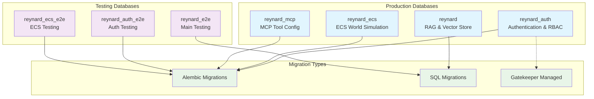
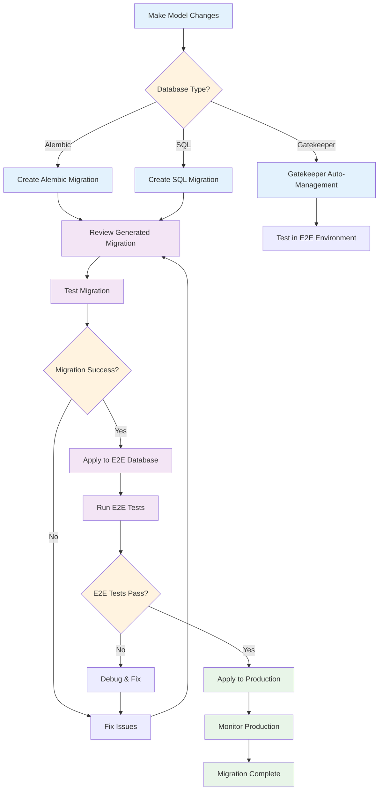
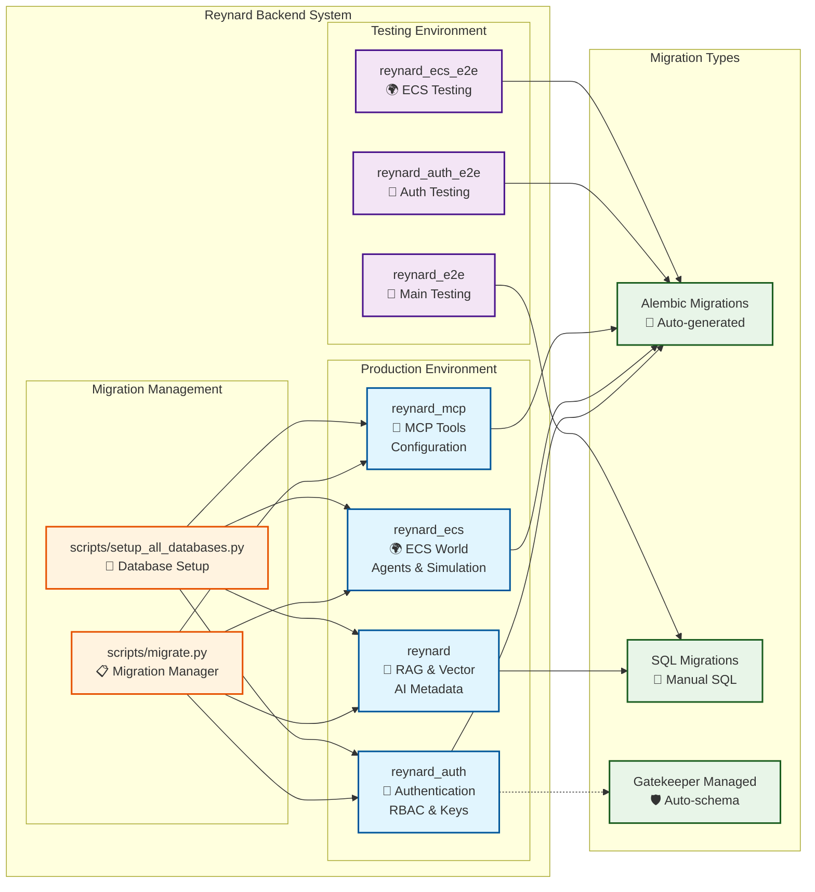

# Alembic Migration Structure

This directory contains the Alembic migration configurations for all databases in the Reynard Backend system.

## Directory Structure

```text
alembic/
├── auth/                   # Authentication database (Gatekeeper)
│   ├── versions/
│   │   ├── 20250926_162815_add_rbac_tables_and_fields.py
│   │   ├── 20250926_165024_populate_default_rbac_data.py
│   │   ├── ba21208304a0_add_pgp_key_management_tables.py
│   │   └── caa8578f93f6_add_ssh_key_management_tables.py
│   ├── env.py             # Alembic environment configuration
│   └── script.py.mako     # Migration template
├── ecs/                    # ECS production database
│   ├── versions/
│   │   ├── ecs/           # ECS-specific migrations
│   │   │   ├── 22ebdcff71c4_populate_base_names.py
│   │   │   ├── 9f94d908afb9_add_complete_race_data.py
│   │   │   ├── b16020be0286_initial_ecs_schema.py
│   │   │   ├── cc04580c04ef_add_initial_data.py
│   │   │   └── fc949a6025ca_fix_success_advisor_8_spirit_to_lion.py
│   │   └── naming/        # Naming system migrations
│   │       └── 183c8980160f_add_naming_configuration_tables.py
│   ├── env.py             # Alembic environment configuration
│   └── script.py.mako     # Migration template
├── main/                   # Main database (RAG/Vector store)
│   ├── versions/
│   │   ├── 20250926_170405_migrate_notes_to_rbac.py
│   │   ├── 20250926_171719_migrate_email_to_rbac.py
│   │   ├── 587157f154aa_create_core_agent_and_notes_tables.py
│   │   ├── 755416c2fdcb_re_enable_aimetadata_relationships.py
│   │   └── c88a9f42e7fc_fix_aimetadata_relationships.py
│   ├── env.py
│   └── script.py.mako
├── mcp/                    # MCP tool configuration database
│   ├── versions/
│   │   └── 001_create_tool_config_tables.py
│   ├── env.py
│   └── script.py.mako
├── e2e/                    # E2E testing database
│   ├── versions/
│   ├── env.py
│   └── script.py.mako
└── ecs_e2e/               # ECS E2E testing database
    ├── versions/
    │   ├── ecs/
    │   │   ├── 22ebdcff71c4_populate_base_names.py
    │   │   ├── 9f94d908afb9_add_complete_race_data.py
    │   │   ├── b16020be0286_initial_ecs_schema.py
    │   │   └── cc04580c04ef_add_initial_data.py
    │   └── naming/
    │       └── 183c8980160f_add_naming_configuration_tables.py
    ├── env.py
    └── script.py.mako
```

## Database Architecture Overview



## Database Configurations

### Authentication Database (`auth/`)

- **Purpose**: Authentication and RBAC system (Gatekeeper)
- **Config File**: `alembic_auth.ini`
- **Database**: `reynard_auth`
- **Migration Types**: Alembic migrations with Gatekeeper integration
- **Key Features**:
  - RBAC tables and fields
  - PGP key management
  - SSH key management
  - Default RBAC data population

### Main Database (`main/`)

- **Purpose**: Main application database (RAG/Vector store)
- **Config File**: `alembic_main.ini`
- **Database**: `reynard`
- **Migration Types**: SQL migrations (Alembic is placeholder)
- **Key Features**:
  - Core agent and notes tables
  - AI metadata relationships
  - RBAC migration support

### ECS Database (`ecs/`)

- **Purpose**: ECS world simulation system
- **Config File**: `alembic_ecs.ini`
- **Database**: `reynard_ecs`
- **Migration Types**: Alembic migrations
- **Key Features**:
  - ECS-specific migrations in `versions/ecs/`
  - Naming system migrations in `versions/naming/`
  - Agent-related migrations
  - Base names and race data

### MCP Database (`mcp/`)

- **Purpose**: MCP tool configuration database
- **Config File**: `alembic_mcp.ini`
- **Database**: `reynard_mcp`
- **Migration Types**: Alembic migrations
- **Key Features**:
  - Tool configuration tables
  - Tool categories and enums
  - MCP server integration

### E2E Database (`e2e/`)

- **Purpose**: E2E testing database (mirror of main)
- **Config File**: `alembic_e2e.ini`
- **Database**: `reynard_e2e`
- **Migration Types**: SQL migrations (Alembic is placeholder)

### ECS E2E Database (`ecs_e2e/`)

- **Purpose**: ECS E2E testing database (mirror of ECS)
- **Config File**: `alembic_ecs_e2e.ini`
- **Database**: `reynard_ecs_e2e`
- **Migration Types**: Alembic migrations (mirrors ECS structure)

## Usage

### Using the Migration Manager Script

```bash
# Upgrade databases
PYTHONPATH=/home/kade/runeset/reynard/backend python3 scripts/migrate.py upgrade auth
PYTHONPATH=/home/kade/runeset/reynard/backend python3 scripts/migrate.py upgrade main
PYTHONPATH=/home/kade/runeset/reynard/backend python3 scripts/migrate.py upgrade ecs
PYTHONPATH=/home/kade/runeset/reynard/backend python3 scripts/migrate.py upgrade mcp

# Create new migrations (Alembic databases only)
PYTHONPATH=/home/kade/runeset/reynard/backend python3 scripts/migrate.py create auth --message "Add new RBAC feature"
PYTHONPATH=/home/kade/runeset/reynard/backend python3 scripts/migrate.py create ecs --message "Add new ECS component"
PYTHONPATH=/home/kade/runeset/reynard/backend python3 scripts/migrate.py create mcp --message "Add new tool configuration"

# Show migration history
PYTHONPATH=/home/kade/runeset/reynard/backend python3 scripts/migrate.py history auth
PYTHONPATH=/home/kade/runeset/reynard/backend python3 scripts/migrate.py history ecs
PYTHONPATH=/home/kade/runeset/reynard/backend python3 scripts/migrate.py history mcp

# Copy migrations between databases
PYTHONPATH=/home/kade/runeset/reynard/backend python3 scripts/migrate.py copy
```

### Using Alembic Directly

```bash
# Authentication Database
PYTHONPATH=/home/kade/runeset/reynard/backend alembic -c alembic_auth.ini upgrade head
PYTHONPATH=/home/kade/runeset/reynard/backend alembic -c alembic_auth.ini revision --autogenerate -m "description"

# ECS Database
PYTHONPATH=/home/kade/runeset/reynard/backend alembic -c alembic_ecs.ini upgrade head
PYTHONPATH=/home/kade/runeset/reynard/backend alembic -c alembic_ecs.ini revision --autogenerate -m "description"

# MCP Database
PYTHONPATH=/home/kade/runeset/reynard/backend alembic -c alembic_mcp.ini upgrade head
PYTHONPATH=/home/kade/runeset/reynard/backend alembic -c alembic_mcp.ini revision --autogenerate -m "description"

# ECS E2E Database
PYTHONPATH=/home/kade/runeset/reynard/backend alembic -c alembic_ecs_e2e.ini upgrade head
PYTHONPATH=/home/kade/runeset/reynard/backend alembic -c alembic_ecs_e2e.ini revision --autogenerate -m "description"
```

## Migration Workflow



### Step-by-Step Process

1. **Development**: Make changes to SQLAlchemy models
2. **Create Migration**: Use the migration manager to create a new migration
   - For Alembic databases: `python3 scripts/migrate.py create <db> --message "description"`
   - For SQL databases: Create SQL files manually
   - For Gatekeeper: Changes are auto-managed
3. **Review**: Check the generated migration file for accuracy
4. **Test**: Apply migration to E2E database first
5. **Validate**: Run comprehensive tests on E2E environment
6. **Deploy**: Apply migration to production database
7. **Monitor**: Watch for any issues in production

## Best Practices

1. **Always test migrations on E2E databases first**
2. **Use descriptive migration messages**
3. **Review auto-generated migrations before applying**
4. **Keep migrations small and focused**
5. **Use the migration manager script for consistency**
6. **Understand migration types**: Alembic vs SQL vs Gatekeeper-managed
7. **Test with different database types**: Production vs E2E environments
8. **Monitor migration performance**: Large migrations may need special handling

## Database-Specific Considerations

### Alembic Databases (auth, ecs, mcp)

- Use `python3 scripts/migrate.py create <db> --message "description"`
- Review auto-generated migrations carefully
- Test in E2E environment before production

### SQL Databases (main, e2e)

- Create SQL migration files manually
- Use `python3 scripts/migrate.py upgrade <db>` to apply
- Ensure SQL compatibility across environments

### Gatekeeper-Managed (auth)

- Gatekeeper handles schema changes automatically
- Use `python3 scripts/migrate.py upgrade auth` for initialization
- Monitor Gatekeeper logs for schema changes

## Troubleshooting

### Common Issues

1. **Import Errors**: Ensure `PYTHONPATH` is set correctly
2. **Database Connection**: Check database URLs in configuration files
3. **Migration Conflicts**: Use `alembic merge` to resolve conflicts
4. **Version Mismatches**: Check `alembic_version` table in database
5. **Permission Issues**: Ensure database user has proper permissions
6. **Extension Dependencies**: Verify pgvector extension is installed

### Database-Specific Troubleshooting

#### Authentication Database

```bash
# Check Gatekeeper status
python3 scripts/init_auth_database.py

# Verify RBAC setup
python3 scripts/bootstrap_rbac_system.py
```

#### ECS Database

```bash
# Check ECS migration status
python3 scripts/migrate.py history ecs

# Verify ECS schema
python3 -c "from app.ecs.models import *; print('ECS models loaded successfully')"
```

#### MCP Database

```bash
# Check MCP tool configuration
python3 scripts/populate_default_tools.py

# Verify tool config tables
python3 -c "from app.models.mcp.tool_config import *; print('MCP models loaded successfully')"
```

### Getting Help

- Check the main `DATABASE_SETUP.md` file for comprehensive documentation
- Use `python3 scripts/migrate.py history <database>` to see migration history
- Check database logs for detailed error messages
- Review the `scripts/setup_all_databases.py` for complete setup process

## Complete Database Ecosystem



---

_This structure provides a clean, organized approach to managing database migrations across multiple databases in the Reynard Backend system, with comprehensive support for different migration types and testing environments._
