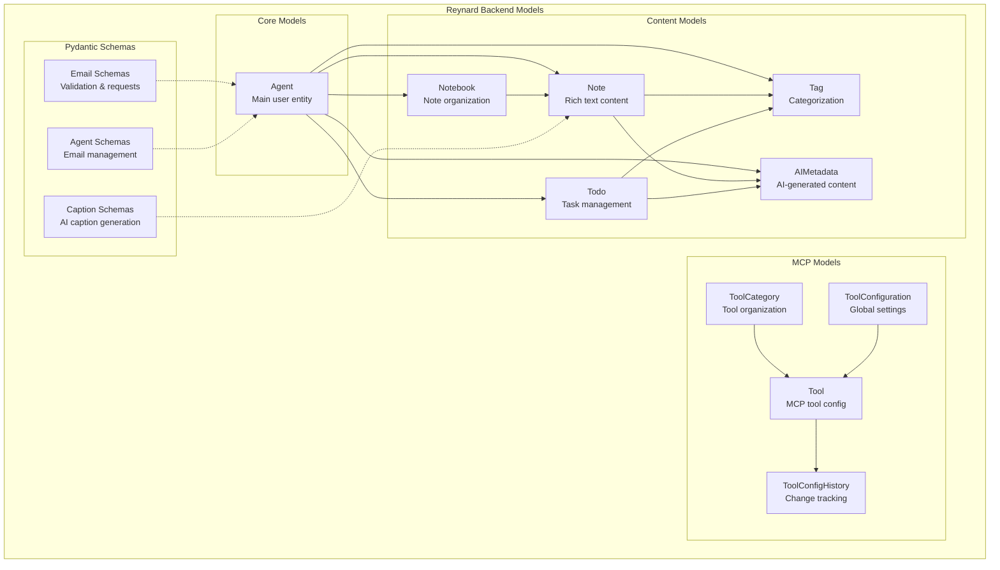
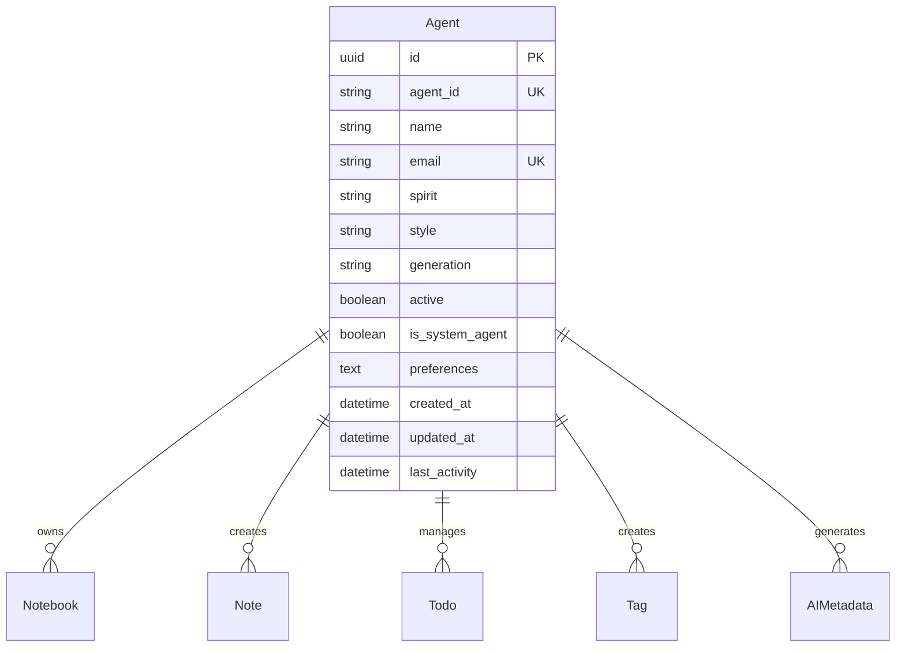
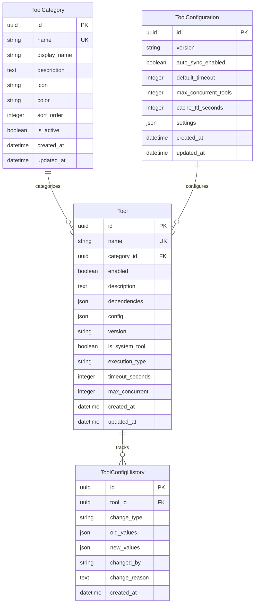
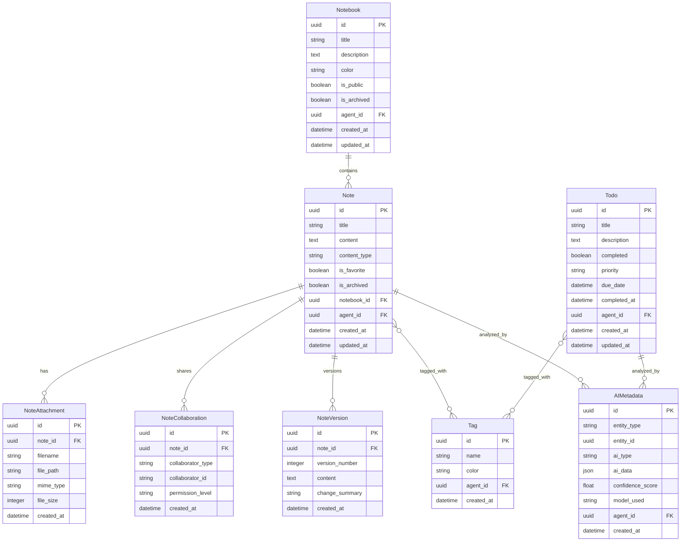
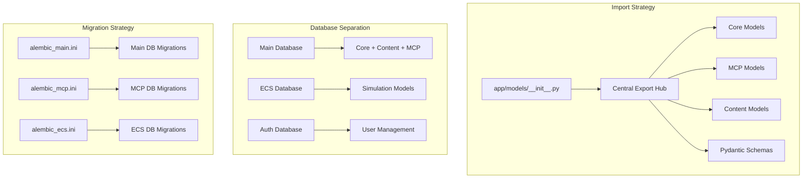
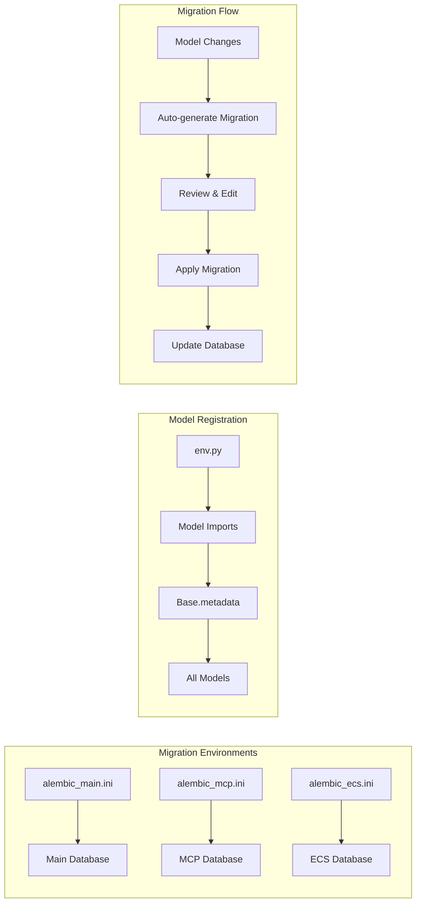

# Reynard Backend Models

This directory contains all database models and schemas for the Reynard backend, organized by domain for better maintainability and clarity.

## Directory Structure

```text
app/models/
├── __init__.py              # Central model exports
├── base.py                  # SQLAlchemy Base class
├── core/                    # Core business models
│   ├── __init__.py
│   └── agent.py            # Main Agent model
├── mcp/                     # MCP tool configuration models
│   ├── __init__.py
│   └── tool_config.py      # Tool configuration models
├── content/                 # Content management models
│   ├── __init__.py
│   └── notes.py            # Notes, todos, tags, AI metadata
└── schemas/                 # Pydantic schemas for API validation
    ├── __init__.py
    ├── email_schemas.py     # Email-related schemas
    ├── caption_schemas.py   # Caption generation schemas
    └── agent_schemas.py     # Agent-related schemas
```

## Model Architecture Overview



## Model Categories

### Core Models (`core/`)

**Agent** - The main user/agent entity in the Reynard system

- `id`: UUID primary key
- `agent_id`: Unique string identifier
- `name`: Display name
- `email`: Email address (optional, unique)
- `spirit`: Animal spirit type
- `style`: Naming style
- `generation`: Generation number
- `active`: Whether agent is active
- `is_system_agent`: Whether this is a system agent
- `preferences`: JSON preferences
- `created_at`, `updated_at`, `last_activity`: Timestamps

### MCP Models (`mcp/`)

**Tool** - MCP tool configuration

- `id`: UUID primary key
- `name`: Tool name (unique)
- `category_id`: Foreign key to ToolCategory
- `enabled`: Whether tool is enabled
- `description`: Tool description
- `dependencies`: JSON array of dependencies
- `config`: JSON configuration
- `version`: Tool version
- `is_system_tool`: Whether this is a system tool
- `execution_type`: 'sync' or 'async'
- `timeout_seconds`: Execution timeout
- `max_concurrent`: Maximum concurrent executions

**ToolCategory** - Tool categorization

- `id`: UUID primary key
- `name`: Category name (unique)
- `display_name`: Human-readable name
- `description`: Category description
- `icon`: Icon identifier
- `color`: Hex color code
- `sort_order`: Display order
- `is_active`: Whether category is active

**ToolConfiguration** - Global tool configuration

- `id`: UUID primary key
- `version`: Configuration version
- `auto_sync_enabled`: Whether auto-sync is enabled
- `default_timeout`: Default timeout in seconds
- `max_concurrent_tools`: Maximum concurrent tools
- `cache_ttl_seconds`: Cache TTL
- `settings`: JSON settings

**ToolConfigHistory** - Tool configuration change history

- `id`: UUID primary key
- `tool_id`: Foreign key to Tool
- `change_type`: Type of change (created, updated, enabled, disabled, deleted)
- `old_values`: JSON of old values
- `new_values`: JSON of new values
- `changed_by`: Who made the change
- `change_reason`: Reason for change

### Content Models (`content/`)

**Notebook** - Note organization

- `id`: UUID primary key
- `title`: Notebook title
- `description`: Notebook description
- `color`: Hex color code
- `is_public`: Whether notebook is public
- `is_archived`: Whether notebook is archived
- `agent_id`: Foreign key to Agent
- `created_at`, `updated_at`: Timestamps

**Note** - Rich text content

- `id`: UUID primary key
- `title`: Note title
- `content`: Note content
- `content_type`: Content type (markdown, rich-text, code)
- `is_favorite`: Whether note is favorited
- `is_archived`: Whether note is archived
- `notebook_id`: Foreign key to Notebook
- `agent_id`: Foreign key to Agent
- `created_at`, `updated_at`: Timestamps

**Todo** - Task management

- `id`: UUID primary key
- `title`: Todo title
- `description`: Todo description
- `completed`: Whether todo is completed
- `priority`: Priority level (low, medium, high, urgent)
- `due_date`: Due date
- `completed_at`: Completion timestamp
- `agent_id`: Foreign key to Agent
- `created_at`, `updated_at`: Timestamps

**Tag** - Categorization system

- `id`: UUID primary key
- `name`: Tag name
- `color`: Hex color code
- `agent_id`: Foreign key to Agent
- `created_at`: Creation timestamp

**AIMetadata** - AI-generated content metadata

- `id`: UUID primary key
- `entity_type`: Type of entity (note, todo, notebook)
- `entity_id`: ID of the entity
- `ai_type`: Type of AI processing (summary, tags, categorization)
- `ai_data`: JSON data from AI processing
- `confidence_score`: AI confidence score
- `model_used`: AI model used
- `agent_id`: Foreign key to Agent
- `created_at`: Creation timestamp

### Pydantic Schemas (`schemas/`)

**Email Schemas**

- `EmailAttachmentModel`: Email attachment validation

**Caption Schemas**

- `CaptionRequest`: Caption generation request
- `CaptionResponse`: Caption generation response

**Agent Schemas**

- `AgentEmailConfig`: Agent email configuration
- `AgentEmailStats`: Agent email statistics
- `AgentEmailTemplate`: Email template
- `AgentEmailSendRequest`: Email send request
- `AgentEmailMessage`: Email message

## Relationships

### Agent Relationships

- `notebooks`: One-to-many with Notebook
- `notes`: One-to-many with Note
- `todos`: One-to-many with Todo
- `tags`: One-to-many with Tag
- `ai_metadata`: One-to-many with AIMetadata

### Tool Relationships

- `category`: Many-to-one with ToolCategory
- `history`: One-to-many with ToolConfigHistory

### Content Relationships

- `Notebook.notes`: One-to-many with Note
- `Note.tags`: Many-to-many with Tag
- `Todo.tags`: Many-to-many with Tag
- `Note.ai_metadata`: One-to-many with AIMetadata
- `Todo.ai_metadata`: One-to-many with AIMetadata

## Detailed Database Schema Diagrams

### Core Model Relationships



### MCP Tool Configuration Relationships



### Content Management Relationships



## Technical Architecture

### Model Organization Strategy



### Import Patterns

**Centralized Imports (Recommended):**

```python
from app.models import Agent, Tool, Note, Todo, Tag
```

**Direct Imports (For specific use cases):**

```python
from app.models.core.agent import Agent
from app.models.mcp.tool_config import Tool, ToolCategory
from app.models.content.notes import Note, Todo, Tag
from app.models.schemas.email_schemas import EmailAttachmentModel
```

### Database Migration Architecture



Migrations are managed using Alembic with separate environments:

- **Main Database**: `alembic_main.ini` - Core application models
- **MCP Database**: `alembic_mcp.ini` - MCP-specific models
- **ECS Database**: `alembic_ecs.ini` - ECS simulation models

## Usage Examples

### Creating an Agent

```python
from app.models import Agent

agent = Agent(
    agent_id="test-agent-001",
    name="Test Agent",
    email="test@example.com",
    spirit="fox",
    style="foundation",
    generation="13"
)
```

### Creating a Tool

```python
from app.models import Tool, ToolCategory

# First get or create a category
category = session.query(ToolCategory).filter_by(name="UTILITY").first()

tool = Tool(
    name="test_tool",
    category_id=category.id,
    enabled=True,
    description="A test tool",
    version="1.0.0",
    execution_type="sync"
)
```

### Creating a Note

```python
from app.models import Note, Notebook

# Get agent and notebook
agent = session.query(Agent).filter_by(agent_id="test-agent-001").first()
notebook = session.query(Notebook).filter_by(agent_id=agent.id).first()

note = Note(
    title="My Note",
    content="# Hello World\nThis is a test note.",
    content_type="markdown",
    notebook_id=notebook.id,
    agent_id=agent.id
)
```

## Best Practices

1. **Always use UUIDs** for primary keys
2. **Include timestamps** for audit trails
3. **Use foreign keys** for relationships
4. **Validate data** with Pydantic schemas
5. **Use transactions** for multi-model operations
6. **Index frequently queried fields**
7. **Use soft deletes** where appropriate
8. **Document relationships** clearly

## Testing

Models should be tested with:

- Unit tests for model creation and validation
- Integration tests for relationships
- Migration tests for schema changes
- Performance tests for queries

See `tests/test_models/` for example test implementations.
