# 🦊 Reynard Real-Time Collaboration Platform Architecture

## Executive Summary

Based on my comprehensive analysis of your Reynard codebase and research into the latest WebRTC/collaboration technologies, I've designed a sophisticated real-time collaboration platform that leverages your existing packages while integrating cutting-edge collaborative editing, video chat, and meeting scheduling capabilities.

## 🏗️ Architecture Overview

### Core Components

1. **Real-Time Collaborative Editor** - Monaco Editor + Yjs CRDT
2. **Video Chat System** - WebRTC + Signaling Server
3. **Meeting Scheduler** - Calendar API Integration
4. **Authentication & Authorization** - Your existing Reynard Auth system
5. **Connection Management** - Your existing Connection package
6. **UI Components** - Your existing UI packages

## 📊 System Architecture Diagram

```mermaid
graph TB
    subgraph "Frontend Layer"
        UI[🖥️ Reynard UI Components]
        Monaco[📝 Monaco Editor]
        Video[📹 Video Chat UI]
        Calendar[📅 Meeting Scheduler UI]
    end

    subgraph "Collaboration Layer"
        Yjs[🔄 Yjs CRDT Engine]
        WebRTC[🌐 WebRTC Peer Connections]
        Presence[👥 User Presence System]
        Cursors[🖱️ Live Cursor Tracking]
    end

    subgraph "Communication Layer"
        WS[🔌 WebSocket Server]
        Signaling[📡 Signaling Server]
        STUN[❄️ STUN/TURN Servers]
    end

    subgraph "Backend Services"
        Auth[🔐 Reynard Auth]
        API[🔗 API Gateway]
        DB[(🗄️ Database)]
        Redis[(⚡ Redis Cache)]
    end

    subgraph "External Services"
        GoogleCal[📅 Google Calendar API]
        OutlookCal[📅 Microsoft Outlook API]
        Email[📧 Email Service]
    end

    UI --> Monaco
    UI --> Video
    UI --> Calendar

    Monaco --> Yjs
    Video --> WebRTC
    Calendar --> GoogleCal
    Calendar --> OutlookCal

    Yjs --> WS
    WebRTC --> Signaling
    WebRTC --> STUN

    WS --> API
    Signaling --> API
    API --> Auth
    API --> DB
    API --> Redis

    Auth --> Email
    Calendar --> Email
```

## 🔧 Technical Implementation Strategy

### 1. Real-Time Collaborative Editing

**Technology Stack:**

- **Monaco Editor** - Your existing `reynard-monaco` package
- **Yjs** - CRDT for conflict-free collaborative editing
- **y-monaco** - Monaco Editor binding for Yjs
- **WebSocket** - Your existing `reynard-connection` package

**Key Features:**

- Real-time cursor tracking and user presence
- Operational transformation for conflict resolution
- Live syntax highlighting and IntelliSense
- Multi-language support
- Version history and branching

### 2. Video Chat Integration

**Technology Stack:**

- **WebRTC** - Peer-to-peer video/audio communication
- **Signaling Server** - WebSocket-based connection establishment
- **STUN/TURN Servers** - NAT traversal support
- **MediaStream API** - Camera/microphone access

**Key Features:**

- HD video and audio quality
- Screen sharing capabilities
- Recording and transcription
- Noise cancellation
- Bandwidth adaptation

### 3. Meeting Scheduling System

**Technology Stack:**

- **Google Calendar API** - Primary calendar integration
- **Microsoft Graph API** - Outlook integration
- **Timezone handling** - Automatic timezone detection
- **Email notifications** - Your existing email service

**Key Features:**

- Smart scheduling with conflict detection
- Timezone-aware meeting coordination
- Recurring meeting support
- Integration with video chat
- Automated reminders and follow-ups

## 📦 Package Integration Strategy

### Leveraging Existing Reynard Packages

1. **`reynard-auth`** - User authentication and authorization
2. **`reynard-connection`** - WebSocket and HTTP connection management
3. **`reynard-monaco`** - Monaco Editor integration
4. **`reynard-ui`** - UI components and theming
5. **`reynard-core`** - Core utilities and composables
6. **`reynard-chat`** - Text chat functionality (extend for collaboration)

### New Packages to Create

1. **`reynard-collaboration`** - Core collaboration engine
2. **`reynard-webrtc`** - WebRTC video chat implementation
3. **`reynard-scheduling`** - Meeting scheduling system
4. **`reynard-presence`** - User presence and activity tracking

## 🚀 Implementation Roadmap

### Phase 1: Foundation (Weeks 1-4)

- Set up Yjs integration with Monaco Editor
- Implement basic WebSocket collaboration
- Create user presence system
- Build core collaboration composables

### Phase 2: Video Chat (Weeks 5-8)

- Implement WebRTC signaling server
- Build video chat UI components
- Add screen sharing capabilities
- Integrate with collaboration system

### Phase 3: Meeting Scheduler (Weeks 9-12)

- Integrate Google Calendar API
- Build scheduling UI components
- Implement timezone handling
- Add email notification system

### Phase 4: Advanced Features (Weeks 13-16)

- Add recording and transcription
- Implement advanced conflict resolution
- Build analytics and insights
- Performance optimization

## 🔒 Security Considerations

1. **End-to-End Encryption** - All collaborative data encrypted
2. **Authentication** - Leverage your existing auth system
3. **Authorization** - Role-based access control
4. **Data Privacy** - GDPR/CCPA compliance
5. **Network Security** - TLS/WSS for all communications

## 📈 Scalability Architecture

1. **Horizontal Scaling** - Multiple WebSocket servers
2. **Load Balancing** - Distribute connections across servers
3. **Caching Strategy** - Redis for session and presence data
4. **Database Optimization** - Efficient querying and indexing
5. **CDN Integration** - Static asset delivery

## 🎯 Key Benefits

1. **Seamless Integration** - Leverages your existing Reynard ecosystem
2. **Modern Technology** - Latest WebRTC and CRDT technologies
3. **Scalable Architecture** - Designed for growth and performance
4. **Rich Features** - Comprehensive collaboration suite
5. **Developer Experience** - Familiar tools and patterns

## 🔍 Competitive Advantages

1. **Monaco Editor Integration** - Professional-grade code editing
2. **Real-Time Collaboration** - Sub-second synchronization
3. **Integrated Video Chat** - No external dependencies
4. **Smart Scheduling** - AI-powered meeting coordination
5. **Customizable UI** - Your existing theming system

This architecture provides a solid foundation for building a world-class real-time collaboration platform that integrates seamlessly with your existing Reynard ecosystem while providing cutting-edge collaborative features.
