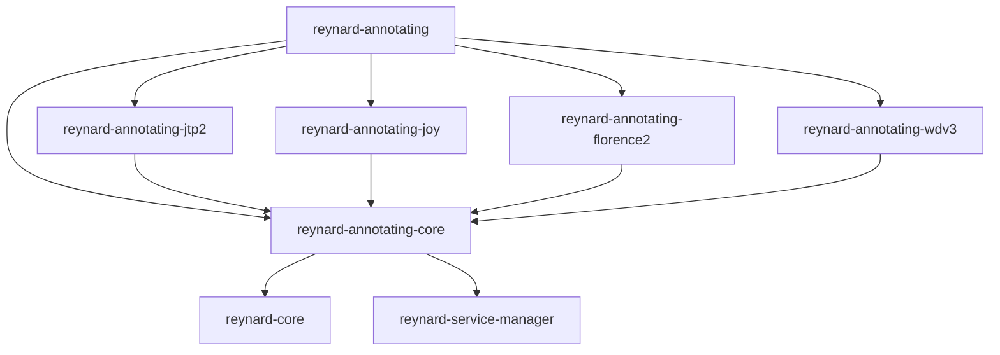
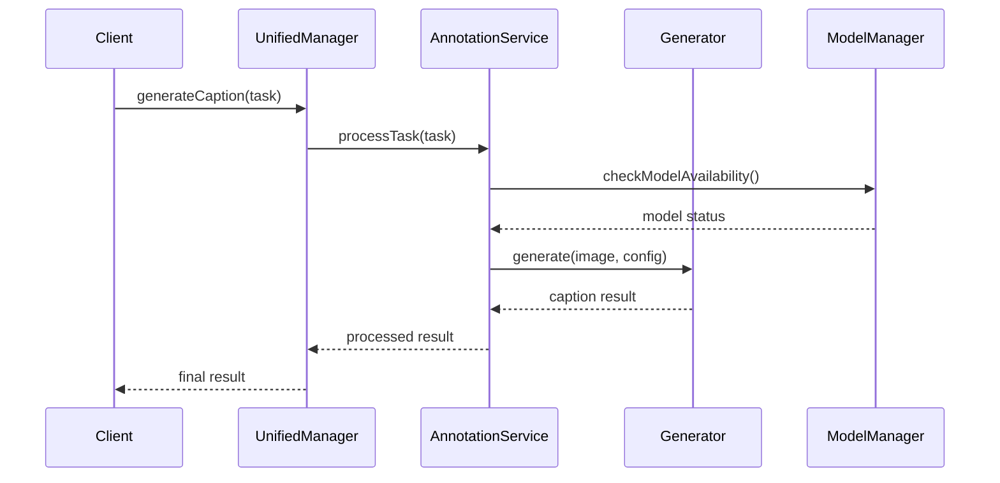
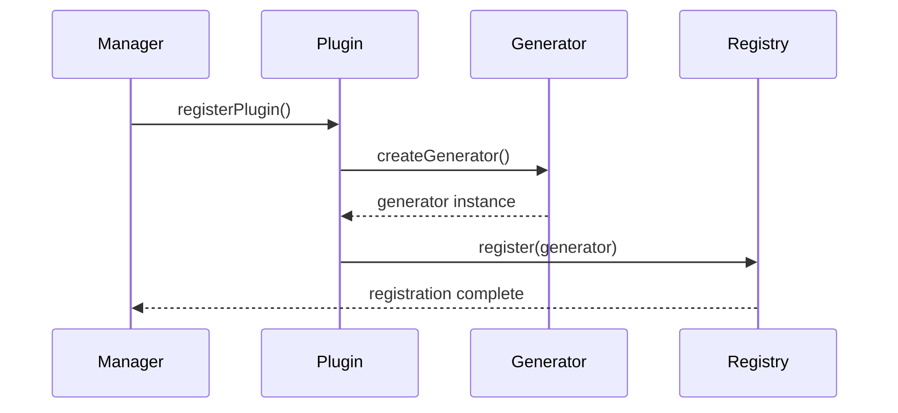

# Annotating System Architecture

This document provides a comprehensive overview of the Reynard annotating system architecture,
including package structure, component relationships, and design patterns.

## Overview

The Reynard annotating system is a modular,
production-ready framework for AI-powered image caption generation. It provides a unified interface while
maintaining clear separation of concerns through a plugin-based architecture.

## Package Architecture

### Core Packages

```
reynard-annotating/
├── annotating-core/          # Foundation package
├── annotating-jtp2/          # JTP2 generator implementation
├── annotating-joy/           # JoyCaption generator implementation
├── annotating-florence2/     # Florence2 generator implementation
├── annotating-wdv3/          # WDv3 generator implementation
└── annotating/               # Unified interface package
```

### Package Dependencies



## Component Architecture

### Core Components (annotating-core)

#### Managers Layer

- **ModelManager**: Central model lifecycle management
- **HealthMonitor**: Real-time health checks and performance metrics
- **CircuitBreaker**: Fault tolerance and error handling
- **DownloadCoordinator**: Model download coordination
- **RequestQueue**: Request queuing and processing
- **ModelUsageTracker**: Usage statistics and performance monitoring
- **EventManager**: Event system management

#### Services Layer

- **AnnotationManager**: Main annotation orchestrator
- **AnnotationService**: Core annotation service
- **BatchProcessor**: Batch processing capabilities
- **CaptionGenerator**: Base caption generator interface
- **EventSystem**: Event system implementation
- **StatisticsService**: Statistics collection and reporting

#### Types Layer

- **TypeScript Definitions**: Comprehensive type definitions for all interfaces and data structures

### Generator Packages

Each generator package follows a consistent structure:

#### JTP2 Package (annotating-jtp2)

```
annotating-jtp2/
├── core/
│   └── JTP2Generator.ts      # Main generator implementation
├── config/
│   ├── index.ts             # Configuration exports
│   └── schema.ts            # Configuration validation
├── plugin/
│   ├── index.ts             # Plugin exports
│   └── registration.ts      # Plugin registration logic
└── simulation/
    ├── index.ts             # Simulation exports
    └── simulator.ts         # Development/testing simulation
```

#### JoyCaption Package (annotating-joy)

```
annotating-joy/
├── JoyCaptionGenerator.ts   # Main generator implementation
├── caption-generators.ts    # Caption generation logic
├── model-simulator.ts       # Development/testing simulation
├── plugin-registration.ts   # Plugin registration
└── config.ts               # Configuration management
```

#### Florence2 Package (annotating-florence2)

```
annotating-florence2/
├── Florence2Generator.ts    # Main generator implementation
└── index.ts                # Package exports
```

#### WDv3 Package (annotating-wdv3)

```
annotating-wdv3/
├── WDv3Generator.ts         # Main generator implementation
├── wdv3-config.ts          # Configuration management
├── wdv3-plugin.ts          # Plugin registration
└── wdv3-simulator.ts       # Development/testing simulation
```

### Unified Interface Package (annotating)

```
annotating/
├── core/
│   ├── manager-delegator.ts # Manager delegation logic
│   └── plugin-manager.ts    # Plugin management
├── factory/
│   └── unified-manager-factory.ts # Factory functions
├── generators/
│   ├── generator-accessors.ts # Generator access methods
│   └── generator-convenience.ts # Convenience methods
├── config/
│   └── production-config.ts # Production configuration
└── UnifiedAnnotationManager.ts # Main unified manager
```

## Design Patterns

### Plugin Architecture

The system uses a plugin-based architecture where
each generator is a separate package that registers with the core system:

```typescript
// Plugin registration pattern
import { registerJTP2Plugin } from "reynard-annotating-jtp2";

const plugin = registerJTP2Plugin();
await manager.registerGenerator(plugin.getGenerator());
```

### Factory Pattern

The unified manager is created using factory functions:

```typescript
import {
  createUnifiedAnnotationManager,
  PRODUCTION_CONFIG,
} from "reynard-annotating";

const manager = createUnifiedAnnotationManager(PRODUCTION_CONFIG);
await manager.initialize();
```

### Observer Pattern

The system uses comprehensive event handling for monitoring and debugging:

```typescript
manager.addEventListener((event) => {
  console.log("Annotation event:", event.type, event.data);
});
```

### Circuit Breaker Pattern

Fault tolerance is implemented using circuit breakers:

```typescript
const circuitState = manager.getModelManager().getCircuitBreakerState("jtp2");
console.log("Circuit state:", circuitState?.state);
```

## Data Flow

### Caption Generation Flow



### Plugin Registration Flow



## Configuration Management

### Production Configuration

The system provides production-ready configuration with sensible defaults:

```typescript
export const PRODUCTION_CONFIG = {
  maxConcurrentDownloads: 2,
  maxConcurrentLoads: 4,
  downloadTimeout: 300000,
  loadTimeout: 60000,
  autoUnloadDelay: 300000,
  healthCheckInterval: 30000,
  usageTrackingEnabled: true,
  preloadEnabled: false,
  preloadModels: [],
};
```

### Generator-Specific Configuration

Each generator can have its own configuration schema:

```typescript
// JTP2 Configuration
interface JTP2Config {
  threshold: number;
  maxTags: number;
  confidence: number;
}

// JoyCaption Configuration
interface JoyCaptionConfig {
  language: string;
  style: "descriptive" | "concise";
  maxLength: number;
}
```

## Error Handling

### Error Types

The system categorizes errors for appropriate handling:

- **model_loading**: Model loading failures
- **model_unavailable**: Model not available
- **model_download**: Download failures
- **generation**: Caption generation errors
- **caption_exists**: Caption already exists
- **network**: Network-related errors
- **timeout**: Request timeouts
- **unexpected**: Unexpected errors

### Retry Logic

Bounded exponential backoff is used for retryable errors:

```typescript
const result = await service.generateCaption(task, {
  retryable: true,
  maxRetries: 3,
  backoffMultiplier: 2,
});
```

## Performance Considerations

### Model Loading Strategy

- **Lightweight Models**: JTP2, WDv3 - loaded eagerly
- **Heavy Models**: JoyCaption, Florence2 - loaded on demand
- **Concurrent Loading**: Limited concurrent model loads
- **Auto-unloading**: Models unloaded after inactivity

### Memory Management

- **Usage Tracking**: Monitor memory usage per model
- **Lifecycle Management**: Proper cleanup of resources
- **Circuit Breakers**: Prevent resource exhaustion

### Batch Processing

- **Progress Tracking**: Real-time progress updates
- **Concurrent Processing**: Configurable concurrency limits
- **Error Isolation**: Individual failures don't stop batch processing

## Testing and Development

### Simulation Support

All generators provide simulation capabilities for development and testing:

```typescript
// Enable simulation mode
const manager = createUnifiedAnnotationManager({
  ...PRODUCTION_CONFIG,
  simulationMode: true,
});
```

### Health Monitoring

Comprehensive health monitoring for production environments:

```typescript
const health = manager.getHealthStatus();
console.log("System healthy:", health.isHealthy);
console.log("Performance metrics:", health.performance);
```

## Security Considerations

### Input Validation

- **Image Path Validation**: Secure path handling
- **Configuration Validation**: Schema-based validation
- **Error Sanitization**: Safe error message handling

### Resource Limits

- **Concurrent Request Limits**: Prevent resource exhaustion
- **Timeout Management**: Prevent hanging requests
- **Memory Limits**: Monitor and limit memory usage

## Future Extensibility

### Adding New Generators

1. Create new package following the established structure
2. Implement `BaseCaptionGenerator` interface
3. Provide plugin registration function
4. Add simulation support for development
5. Update unified package to include new generator

### Custom Configuration

The system supports custom configuration for:

- Model-specific parameters
- Performance tuning
- Feature flags
- Debug settings

## Conclusion

The Reynard annotating system provides a robust, scalable, and
maintainable architecture for AI-powered image caption generation. Its modular design, comprehensive error handling,
and production features make it suitable for both development and production environments.

The plugin architecture ensures easy extensibility, while
the unified interface provides a consistent developer experience across all generators. The system's focus on
monitoring, health checks, and fault tolerance makes it production-ready out of the box.
