# Reynard Package Dependency Architecture

**Updated September 2025** - After resolving circular dependencies and creating the `reynard-primitives` package.

## Dependency Flow Diagram

```mermaid
graph TB
    subgraph "🏗️ Core Foundation Layer"
        CORE[reynard-core]
        ERROR[reynard-error-boundaries]
    end

    subgraph "🎨 Theming & Icons Layer"
        THEMES[reynard-themes]
        ICONS[reynard-fluent-icons]
    end

    subgraph "🧱 UI Primitives Layer"
        PRIMITIVES[reynard-primitives<br/>NEW: Dependency-free base components]
    end

    subgraph "🎯 Higher-Level Components Layer"
        COMPONENTS[reynard-components-core<br/>Modals, Tooltips, Forms]
        CHARTS[reynard-charts]
        ANIMATION[reynard-animation]
        FLOATING[reynard-floating-panel]
    end

    subgraph "🎮 Specialized UI Layer"
        GAMES[reynard-games]
        MONACO[reynard-monaco]
        DASHBOARD[reynard-dashboard]
    end

    subgraph "📊 Media & 3D Layer"
        MEDIA3D[reynard-3d]
        IMAGE[reynard-image]
        VIDEO[reynard-video]
        AUDIO[reynard-audio]
    end

    subgraph "🤖 AI & ML Layer"
        RAG[reynard-rag]
        CAPTION[reynard-caption]
        ANNOTATING[reynard-annotating]
        MULTIMODAL[reynard-multimodal]
    end

    %% Core dependencies
    ERROR --> CORE
    THEMES --> CORE
    ICONS --> CORE
    ICONS --> THEMES

    %% Primitives layer (NEW - dependency-free)
    PRIMITIVES --> CORE

    %% Higher-level components depend on primitives
    COMPONENTS --> PRIMITIVES
    COMPONENTS --> ICONS
    COMPONENTS --> THEMES
    COMPONENTS --> ERROR

    %% Charts and other UI components
    CHARTS --> PRIMITIVES
    CHARTS --> ICONS
    CHARTS --> THEMES
    CHARTS --> CORE

    ANIMATION --> PRIMITIVES
    FLOATING --> PRIMITIVES
    FLOATING --> ICONS

    %% Specialized UI
    GAMES --> PRIMITIVES
    GAMES --> ICONS
    MONACO --> PRIMITIVES
    DASHBOARD --> PRIMITIVES
    DASHBOARD --> COMPONENTS

    %% Media layer
    MEDIA3D --> PRIMITIVES
    MEDIA3D --> ICONS
    IMAGE --> PRIMITIVES
    VIDEO --> PRIMITIVES
    AUDIO --> PRIMITIVES

    %% AI/ML layer
    RAG --> CORE
    CAPTION --> CORE
    ANNOTATING --> CORE
    MULTIMODAL --> CORE

    %% Styling
    classDef coreLayer fill:#e1f5fe,stroke:#01579b,stroke-width:2px
    classDef themeLayer fill:#f3e5f5,stroke:#4a148c,stroke-width:2px
    classDef primitiveLayer fill:#e8f5e8,stroke:#1b5e20,stroke-width:3px
    classDef componentLayer fill:#fff3e0,stroke:#e65100,stroke-width:2px
    classDef specializedLayer fill:#fce4ec,stroke:#880e4f,stroke-width:2px
    classDef mediaLayer fill:#e0f2f1,stroke:#004d40,stroke-width:2px
    classDef aiLayer fill:#f1f8e9,stroke:#33691e,stroke-width:2px

    class CORE,ERROR coreLayer
    class THEMES,ICONS themeLayer
    class PRIMITIVES primitiveLayer
    class COMPONENTS,CHARTS,ANIMATION,FLOATING componentLayer
    class GAMES,MONACO,DASHBOARD specializedLayer
    class MEDIA3D,IMAGE,VIDEO,AUDIO mediaLayer
    class RAG,CAPTION,ANNOTATING,MULTIMODAL aiLayer
```

## Key Architectural Changes

### ✅ **New Primitives Layer**

- **`reynard-primitives`**: Completely dependency-free package containing fundamental UI components
- **Components**: Button, Card, TextField, and other basic building blocks
- **Purpose**: Eliminates circular dependencies by providing a stable foundation

### ✅ **Resolved Circular Dependencies**

- **Before**: `components-core` ↔ `themes` ↔ `fluent-icons` ↔ `charts` (circular)
- **After**: Clear unidirectional flow from primitives to higher-level components

### ✅ **Build Order**

1. **Core Foundation**: `reynard-core` → `reynard-error-boundaries`
2. **Theming Layer**: `reynard-themes` → `reynard-fluent-icons`
3. **Primitives Layer**: `reynard-primitives` (depends only on core)
4. **Components Layer**: `reynard-components-core` → `reynard-charts` → `reynard-animation`
5. **Applications**: All other packages depend on the stable foundation

### ✅ **Import Strategy**

- **Basic UI Elements**: Import from `reynard-primitives`
- **Higher-Level Components**: Import from `reynard-components-core`
- **Icons**: Import from `reynard-fluent-icons`
- **Theming**: Import from `reynard-themes`

## Benefits

1. **Build Stability**: No more circular dependency errors
2. **Clear Separation**: Primitives vs. higher-level components
3. **Maintainability**: Easier to understand and modify
4. **Performance**: Faster builds due to proper dependency order
5. **Extensibility**: Easy to add new components without breaking existing ones
