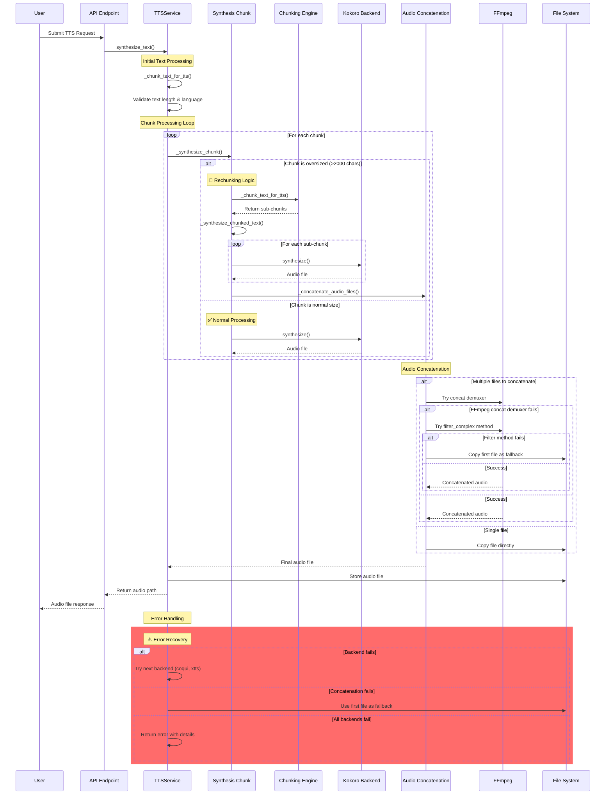

# TTS System Architecture

## System Overview

The TTS (Text-to-Speech) system in yipyap is a comprehensive, multi-backend architecture designed for high-performance audio synthesis with intelligent chunking, fallback mechanisms, and robust error handling.

## Detailed Architecture Diagram

```mermaid
graph TB
    %% User Interface Layer
    subgraph UI["🖥️ User Interface Layer"]
        API[["📡 API Endpoints<br/>• /api/tts/synthesize<br/>• /api/tts/voices<br/>• /api/tts/backends"]]
        WEB[["🌐 Web Interface<br/>• Voice Selection<br/>• Text Input<br/>• Audio Playback"]]
    end

    %% Service Layer
    subgraph SERVICE["🔧 Service Layer"]
        TTS_SERVICE[["🎯 TTSService<br/>• Lifecycle Management<br/>• Backend Orchestration<br/>• Health Monitoring<br/>• Configuration Management"]]

        subgraph CHUNKING["📝 Text Processing"]
            VALIDATE[["✅ Validation<br/>• Text Length Check<br/>• Language Validation<br/>• Voice Compatibility"]]
            CHUNK[["✂️ Chunking Engine<br/>• Sentence Boundary Detection<br/>• Character-based Fallback<br/>• Overlap Management"]]
            RECHUNK[["🔄 Rechunking Logic<br/>• Oversized Chunk Detection<br/>• Automatic Resizing<br/>• Backend Preservation"]]
        end

        subgraph QUEUE["📋 Queue Management"]
            RATE_LIMIT[["⏱️ Rate Limiting<br/>• Per-minute Limits<br/>• Backend-specific Limits<br/>• User Quotas"]]
            PRIORITY[["🎯 Priority Queue<br/>• High-priority Requests<br/>• Background Processing<br/>• Resource Allocation"]]
        end
    end

    %% Backend Layer
    subgraph BACKENDS["🎵 TTS Backends"]
        KOKORO[["🦊 Kokoro Backend<br/>• High-quality Synthesis<br/>• Multiple Voices<br/>• Performance Modes<br/>• GPU Acceleration"]]

        COQUI[["🐸 Coqui Backend<br/>• Open-source TTS<br/>• Multiple Languages<br/>• Custom Models<br/>• CPU/GPU Support"]]

        XTTS[["🤖 XTTS Backend<br/>• Voice Cloning<br/>• Multi-language Support<br/>• High Fidelity<br/>• Real-time Synthesis"]]
    end

    %% Processing Pipeline
    subgraph PIPELINE["⚙️ Processing Pipeline"]
        SYNTHESIS[["🎤 Synthesis Engine<br/>• Chunk Processing<br/>• Backend Selection<br/>• Voice Mapping<br/>• Speed Control"]]

        CONCAT[["🔗 Audio Concatenation<br/>• FFmpeg Integration<br/>• Multiple Methods<br/>• Fallback Strategies<br/>• Error Recovery"]]

        CONVERT[["🔄 Format Conversion<br/>• WAV to OGG<br/>• WAV to OPUS<br/>• Quality Optimization<br/>• Compression"]]
    end

    %% Storage Layer
    subgraph STORAGE["💾 Storage Layer"]
        AUDIO_DIR[["📁 Audio Directory<br/>• Generated Files<br/>• Temporary Storage<br/>• Cleanup Management<br/>• Path Management"]]

        CACHE[["🗄️ Cache System<br/>• Metadata Caching<br/>• Result Caching<br/>• Invalidation<br/>• Performance"]]

        METRICS[["📊 Metrics Database<br/>• Usage Tracking<br/>• Performance Metrics<br/>• Error Logging<br/>• Analytics"]]
    end

    %% Integration Layer
    subgraph INTEGRATION["🔗 Integration Layer"]
        RVC[["🎭 RVC Integration<br/>• Voice Conversion<br/>• Real-time Processing<br/>• Model Management<br/>• Quality Control"]]

        PROTECTION[["🛡️ TTS Protection<br/>• PyTorch Memory<br/>• Model Loading<br/>• Resource Management<br/>• Conflict Resolution"]]

        HEALTH[["❤️ Health Monitoring<br/>• Backend Status<br/>• Resource Usage<br/>• Error Detection<br/>• Recovery"]]
    end

    %% Error Handling
    subgraph ERROR["⚠️ Error Handling"]
        FALLBACK[["🔄 Fallback System<br/>• Backend Switching<br/>• Graceful Degradation<br/>• Error Recovery<br/>• User Notification"]]

        RETRY[["🔄 Retry Logic<br/>• Exponential Backoff<br/>• Max Retries<br/>• Error Classification<br/>• Recovery Strategies"]]

        LOGGING[["📝 Logging System<br/>• Structured Logging<br/>• Correlation IDs<br/>• Error Tracking<br/>• Debug Information"]]
    end

    %% Data Flow
    UI --> SERVICE
    SERVICE --> BACKENDS
    BACKENDS --> PIPELINE
    PIPELINE --> STORAGE
    SERVICE --> INTEGRATION
    SERVICE --> ERROR

    %% Internal Service Connections
    TTS_SERVICE --> CHUNKING
    TTS_SERVICE --> QUEUE
    TTS_SERVICE --> SYNTHESIS
    SYNTHESIS --> CONCAT
    CONCAT --> CONVERT
    CONVERT --> STORAGE

    %% Error Handling Connections
    SYNTHESIS --> FALLBACK
    CONCAT --> RETRY
    FALLBACK --> LOGGING
    RETRY --> LOGGING

    %% Integration Connections
    SYNTHESIS --> PROTECTION
    TTS_SERVICE --> HEALTH
    HEALTH --> RVC

    %% Styling
    classDef brightBox fill:#FF6B6B,stroke:#000000,stroke-width:2px,color:#000000
    classDef brightBox2 fill:#4ECDC4,stroke:#000000,stroke-width:2px,color:#000000
    classDef brightBox3 fill:#45B7D1,stroke:#000000,stroke-width:2px,color:#000000
    classDef brightBox4 fill:#96CEB4,stroke:#000000,stroke-width:2px,color:#000000
    classDef brightBox5 fill:#FFEAA7,stroke:#000000,stroke-width:2px,color:#000000
    classDef brightBox6 fill:#DDA0DD,stroke:#000000,stroke-width:2px,color:#000000
    classDef brightBox7 fill:#98D8C8,stroke:#000000,stroke-width:2px,color:#000000

    class API,WEB brightBox
    class TTS_SERVICE,VALIDATE,CHUNK,RECHUNK brightBox2
    class RATE_LIMIT,PRIORITY,SYNTHESIS,CONCAT,CONVERT brightBox3
    class KOKORO,COQUI,XTTS brightBox4
    class AUDIO_DIR,CACHE,METRICS brightBox5
    class RVC,PROTECTION,HEALTH brightBox6
    class FALLBACK,RETRY,LOGGING brightBox7
```

## Rechunking and Concatenation Flow

## Key Components

### 1. User Interface Layer

- **API Endpoints**: RESTful API for TTS operations
- **Web Interface**: User-friendly web interface for voice selection and text input

### 2. Service Layer

- **TTSService**: Core orchestration service managing the entire TTS pipeline
- **Text Processing**: Validation, chunking, and rechunking logic
- **Queue Management**: Rate limiting and priority queue management

### 3. TTS Backends

- **Kokoro**: High-quality synthesis with multiple voices and performance modes
- **Coqui**: Open-source TTS with multi-language support
- **XTTS**: Voice cloning and high-fidelity synthesis

### 4. Processing Pipeline

- **Synthesis Engine**: Handles chunk processing and backend selection
- **Audio Concatenation**: FFmpeg-based concatenation with fallback strategies
- **Format Conversion**: Audio format conversion and optimization

### 5. Storage Layer

- **Audio Directory**: File management and cleanup
- **Cache System**: Performance optimization through caching
- **Metrics Database**: Usage tracking and analytics

### 6. Integration Layer

- **RVC Integration**: Voice conversion capabilities
- **TTS Protection**: Resource management and conflict resolution
- **Health Monitoring**: System health and recovery

### 7. Error Handling

- **Fallback System**: Graceful degradation and backend switching
- **Retry Logic**: Exponential backoff and error recovery
- **Logging System**: Comprehensive logging and debugging

## Data Flow

1. **Input**: Text and parameters from user interface
2. **Validation**: Text length, language, and voice compatibility checks
3. **Chunking**: Intelligent text chunking with sentence boundary detection
4. **Synthesis**: Backend selection and audio generation
5. **Concatenation**: Audio file concatenation with fallback methods
6. **Conversion**: Optional format conversion (OGG, OPUS)
7. **Storage**: File storage and metadata management
8. **Output**: Audio file delivery to user

## Error Handling Strategy

The system implements a multi-layered error handling approach:

1. **Prevention**: Input validation and resource checks
2. **Detection**: Health monitoring and error detection
3. **Recovery**: Automatic retry and fallback mechanisms
4. **Logging**: Comprehensive error tracking and debugging
5. **Notification**: User feedback and error reporting

## Performance Optimizations

- **Intelligent Chunking**: Optimal text chunking for backend efficiency
- **Caching**: Metadata and result caching for improved performance
- **Resource Management**: Efficient memory and GPU usage
- **Parallel Processing**: Concurrent chunk processing where possible
- **Format Optimization**: Audio compression and quality optimization

## Recent Improvements

### Rechunking Logic

- **Oversized Chunk Detection**: Automatically detects chunks exceeding 2000 characters
- **Backend Preservation**: Rechunks oversized chunks instead of falling back to other backends
- **Seamless Processing**: Maintains the preferred backend (Kokoro) throughout the process

### Enhanced Concatenation

- **Multiple FFmpeg Methods**: Primary concat demuxer with filter_complex fallback
- **File Descriptor Fix**: Resolved 'fd' protocol issues with temporary file handling
- **Robust Fallbacks**: Graceful degradation when concatenation methods fail
- **Single File Optimization**: Direct file copying for single-chunk synthesis
