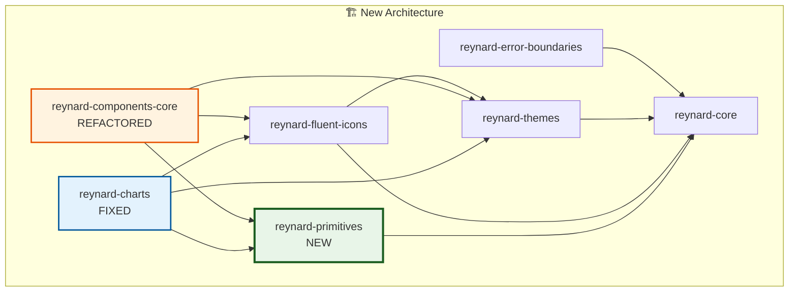

# Architecture Refactor Migration Guide

**September 2025** - Major architectural refactoring to resolve circular dependencies and improve build stability.

## 🎯 Overview

This migration addresses critical circular dependency issues that were preventing package builds and introduces a new `reynard-primitives` package to provide a stable foundation for UI components.

## 🏗️ Key Changes

### ✅ **New Package: `reynard-primitives`**

A new dependency-free package containing fundamental UI components:

- **Purpose**: Eliminates circular dependencies by providing a stable foundation
- **Contents**: Button, Card, TextField, and other basic UI primitives
- **Dependencies**: Only `solid-js` (peer dependency)

### ✅ **Refactored: `reynard-components-core`**

- **Removed**: Basic primitives (Button, Card, TextField, etc.)
- **Retained**: Higher-level components (Modal, Tooltip, IconButton, etc.)
- **New Dependency**: Now imports from `reynard-primitives`

### ✅ **Fixed: Build Dependencies**

- **Resolved**: Circular dependency chains
- **Established**: Clear build order: `core` → `error-boundaries` → `themes` → `fluent-icons` → `primitives` → `components-core` → applications
- **Eliminated**: Build failures caused by circular imports

## 📦 Package Changes

### New Package Structure

```
packages/ui/
├── primitives/          # NEW: Dependency-free UI primitives
│   ├── Button
│   ├── Card
│   ├── TextField
│   └── ...
├── components-core/     # REFACTORED: Higher-level components
│   ├── Modal
│   ├── Tooltip
│   ├── IconButton
│   └── ...
└── charts/             # FIXED: Now builds successfully
    └── ...
```

### Dependency Flow



## 🔄 Migration Steps

### 1. Update Package Dependencies

Add `reynard-primitives` to your dependencies:

```json
{
  "dependencies": {
    "reynard-primitives": "^0.1.0"
  }
}
```

### 2. Update Imports

#### Basic UI Components

```typescript
// ❌ Old imports (no longer available)
import { Button, Card, TextField } from "reynard-components-core";

// ✅ New imports
import { Button, Card, TextField } from "reynard-primitives";
```

#### Higher-Level Components

```typescript
// ✅ These remain the same
import { Modal, Tooltip, IconButton } from "reynard-components-core";
```

### 3. Update Build Scripts

Ensure your build order follows the new dependency hierarchy:

```bash
# Build in correct order
pnpm run build:core
pnpm run build:error-boundaries
pnpm run build:themes
pnpm run build:fluent-icons
pnpm run build:primitives
pnpm run build:components-core
pnpm run build:charts
# ... other packages
```

## 📋 Component Migration Map

### Moved to `reynard-primitives`

| Component | Old Location              | New Location         |
| --------- | ------------------------- | -------------------- |
| Button    | `reynard-components-core` | `reynard-primitives` |
| Card      | `reynard-components-core` | `reynard-primitives` |
| TextField | `reynard-components-core` | `reynard-primitives` |
| Text      | `reynard-components-core` | `reynard-primitives` |
| Container | `reynard-components-core` | `reynard-primitives` |
| Flex      | `reynard-components-core` | `reynard-primitives` |
| Grid      | `reynard-components-core` | `reynard-primitives` |
| Input     | `reynard-components-core` | `reynard-primitives` |
| Label     | `reynard-components-core` | `reynard-primitives` |
| Fieldset  | `reynard-components-core` | `reynard-primitives` |

### Remained in `reynard-components-core`

| Component       | Status  | Notes                     |
| --------------- | ------- | ------------------------- |
| Modal           | ✅ Kept | Higher-level component    |
| Tooltip         | ✅ Kept | Higher-level component    |
| IconButton      | ✅ Kept | Depends on Icon component |
| SidebarButton   | ✅ Kept | Depends on Icon component |
| Dropdown        | ✅ Kept | Higher-level component    |
| Form Components | ✅ Kept | Complex form logic        |

## 🐛 Common Issues & Solutions

### Issue: "Cannot find module 'reynard-components-core/primitives'"

**Solution**: Update imports to use `reynard-primitives`:

```typescript
// ❌ This will fail
import { Button } from "reynard-components-core/primitives";

// ✅ Use this instead
import { Button } from "reynard-primitives";
```

### Issue: Build failures due to circular dependencies

**Solution**: Ensure you're building packages in the correct order:

1. Core packages first (`reynard-core`, `reynard-error-boundaries`)
2. Theming packages (`reynard-themes`, `reynard-fluent-icons`)
3. Primitives (`reynard-primitives`)
4. Higher-level components (`reynard-components-core`)
5. Applications (`reynard-charts`, etc.)

### Issue: TypeScript errors in chart components

**Solution**: These have been fixed in the refactor. If you still see errors:

1. Clear your build cache: `rm -rf node_modules/.cache`
2. Rebuild: `pnpm run build`
3. Check that you're using the latest versions

## ✅ Verification Checklist

- [ ] Added `reynard-primitives` to dependencies
- [ ] Updated all imports from `reynard-components-core` to `reynard-primitives` for basic components
- [ ] Verified that higher-level components still import from `reynard-components-core`
- [ ] Confirmed build order follows the new dependency hierarchy
- [ ] Tested that all packages build successfully
- [ ] Verified that applications work with the new structure

## 🚀 Benefits

After migration, you'll experience:

- **✅ Build Stability**: No more circular dependency errors
- **✅ Faster Builds**: Proper dependency order reduces build time
- **✅ Clear Architecture**: Separation between primitives and higher-level components
- **✅ Better Maintainability**: Easier to understand and modify
- **✅ Improved Performance**: Optimized bundle sizes and tree-shaking

## 📞 Support

If you encounter issues during migration:

1. Check the [CHANGELOG.md](../../CHANGELOG.md) for detailed changes
2. Review the [dependency graph documentation](../architecture/dependency-graph.md)
3. Open an issue with specific error messages and your package.json

---

**🦊 This migration ensures the Reynard ecosystem remains stable and maintainable for future development.**
