# E2E Testing Framework for Reynard

A comprehensive end-to-end testing framework for the Reynard ecosystem, featuring modular architecture, domain-specific testing modules, advanced security testing capabilities, documentation validation, unified coverage integration, and intelligent results management.

## Architecture Overview

The E2E testing framework is organized into a clean, modular structure that separates concerns and provides clear boundaries between different testing domains:

```text
e2e/
├── core/                    # Core testing infrastructure
│   ├── setup/              # Global setup and teardown
│   ├── config/             # Configuration management
│   ├── types/              # Shared type definitions
│   ├── utils/              # Utility functions
│   ├── analysis/           # Trace analysis tools
│   └── monitoring/         # Performance monitoring
├── modules/                # Domain-specific testing modules
│   ├── auth/               # Authentication testing
│   ├── dom/                # DOM testing utilities
│   ├── i18n/               # Internationalization testing
│   ├── security/           # Security and penetration testing
│   ├── mock/               # Mock server utilities
│   └── documentation/      # Documentation validation
├── suites/                 # Test suites (organized by domain)
│   ├── auth/               # Authentication test suites
│   ├── dom/                # DOM assertion test suites
│   ├── i18n/               # I18n benchmark test suites
│   ├── security/           # Security test suites
│   ├── documentation/      # Documentation validation suites
│   ├── games/              # Game testing suites
│   └── effects/            # SolidJS effects testing
├── fixtures/               # Test data and fixtures
├── results/                # Test results and reports
├── configs/                # Playwright configurations
├── scripts/                # Automation and processing scripts
└── backend/                # E2E test backend
```

## System Architecture

The Reynard E2E testing ecosystem is a sophisticated, multi-layered framework that provides comprehensive testing capabilities across the entire development lifecycle:


## Core Features

### Authentication Testing

- **Complete Auth Flows**: Registration, login, logout, password change, profile updates
- **Token Management**: Access token refresh, expiration handling, secure storage
- **Session Management**: Session persistence, concurrent logins, state management
- **Security Testing**: XSS protection, CSRF protection, rate limiting, input validation

### DOM Testing

- **Comprehensive Assertions**: Visibility, presence, attributes, focus, forms
- **Accessibility Testing**: ARIA attributes, keyboard navigation, screen reader support
- **Responsive Testing**: Mobile viewport testing, responsive design validation
- **Interactive Testing**: Form interactions, button states, dynamic content

### I18n Testing

- **Performance Benchmarking**: Load times, render times, memory usage analysis
- **Language Switching**: Multi-language support testing, RTL language support
- **Bundle Analysis**: Size impact analysis, compression effectiveness
- **Pluralization Testing**: Complex pluralization rules, edge case handling

### Security Testing

- **Penetration Testing**: Comprehensive security assessment with Fenrir integration
- **Vulnerability Scanning**: SQL injection, XSS, CSRF, path traversal, SSRF
- **Attack Simulation**: Advanced attack patterns, race conditions, HTTP smuggling
- **Security Assessment**: Automated security recommendations and reporting

### Mock Testing

- **API Mocking**: Comprehensive mock server with configurable endpoints
- **Response Simulation**: Success, error, and edge case response handling
- **Performance Testing**: Load testing with mock backends
- **Integration Testing**: Frontend-backend integration with controlled responses

### Documentation Validation

- **Code Example Validation**: Automated testing of all code examples in documentation
- **Multi-language Support**: Bash, TypeScript, JSON, Python, Dockerfile validation
- **Isolated Testing**: Each example runs in its own `/tmp/` environment
- **Comprehensive Reporting**: HTML, JSON, JUnit reports with success criteria
- **Dependency Analysis**: Automatic detection and validation of required packages

### Coverage Integration

- **Unified Coverage**: Merges E2E and Vitest coverage into comprehensive reports
- **Browser Coverage**: JavaScript and CSS coverage collection from Playwright
- **Threshold Checking**: Automated quality gates with configurable thresholds
- **Multiple Formats**: HTML dashboard, text summary, LCOV, and JSON reports
- **CI/CD Ready**: Seamless integration with continuous integration pipelines

### Unified Results Management

- **Timestamped Organization**: All test results organized by date and run ID
- **Complete Traceability**: Full audit trail with environment and git metadata
- **Rich Artifacts**: Screenshots, traces, videos, and performance metrics
- **Multiple Report Formats**: HTML, JSON, JUnit XML for different use cases
- **Automatic Cleanup**: Configurable retention policies for old test runs

## Module Structure

### Core Infrastructure (`core/`)

#### Setup (`core/setup/`)

- `global-setup.ts` - Main global test setup
- `global-teardown.ts` - Main global test cleanup
- `global-i18n-setup.ts` - I18n-specific setup
- `global-i18n-teardown.ts` - I18n-specific cleanup
- `global-penetration-setup.ts` - Security testing setup
- `global-penetration-teardown.ts` - Security testing cleanup

#### Configuration (`core/config/`)

- `port-detector.ts` - Automatic port detection for test servers

#### Types (`core/types/`)

- `index.ts` - Shared type definitions for all testing modules

### Testing Modules (`modules/`)

#### Authentication Module (`modules/auth/`)

- `auth-helpers.ts` - Main authentication test helpers class
- `auth-core-operations.ts` - Core authentication operations
- `auth-form-handlers.ts` - Form interaction handlers
- `auth-verification-helpers.ts` - Authentication state verification
- `auth-flow-scenarios.ts` - Complete authentication flow scenarios
- `auth-utility-helpers.ts` - Utility functions and environment setup
- `auth-token-manager.ts` - Token management utilities
- `auth-form-utilities.ts` - Form-specific utilities
- `auth-element-verification.ts` - Element verification helpers
- `auth-mock-helpers.ts` - Mock authentication helpers

#### DOM Testing Module (`modules/dom/`)

- `dom-test-helpers.ts` - Core DOM testing utilities
- `dom-assertion-helpers.ts` - DOM assertion utilities
- `dom-element-assertions.ts` - Element-specific assertions
- `dom-test-page-utils.ts` - Test page management utilities

#### I18n Testing Module (`modules/i18n/`)

- `i18n-benchmark-helpers.ts` - Main i18n benchmark helper class
- `i18n-benchmark-types.ts` - I18n benchmark type definitions
- `i18n-cache-utils.ts` - I18n caching utilities
- `i18n-memory-utils.ts` - Memory usage analysis
- `i18n-translation-utils.ts` - Translation testing utilities
- `i18n-test-data-utils.ts` - Test data generation
- `i18n-reporting-utils.ts` - Report generation utilities
- `i18n-file-manager.ts` - File management utilities
- `i18n-json-generator.ts` - JSON report generation
- `i18n-markdown-generator.ts` - Markdown report generation
- `i18n-performance-analyzer.ts` - Performance analysis
- `i18n-performance-reporter.ts` - Performance reporting
- `i18n-performance-types.ts` - Performance type definitions
- `i18n-report-generator.ts` - Report generation
- `i18n-section-generator.ts` - Section generation
- `i18n-table-generator.ts` - Table generation

#### Security Testing Module (`modules/security/`)

- `security-assessor.ts` - Main security assessment class
- `penetration-helpers.ts` - Penetration testing utilities
- `penetration-test-config.ts` - Security test configuration
- `penetration-types.ts` - Security testing type definitions
- `exploit-class-mapper.ts` - Exploit class mapping
- `exploit-recommendations.ts` - Security recommendations
- `exploit-runner.ts` - Exploit execution utilities
- `fenrir-class-mapper.ts` - Fenrir integration mapping
- `fenrir-runner.ts` - Fenrir execution utilities
- `fenrir-suite-runner.ts` - Fenrir test suite runner

#### Mock Testing Module (`modules/mock/`)

- `mock-backend-server.ts` - Mock backend server implementation
- `mock-server-factory.ts` - Mock server factory
- `backend-mock.ts` - Backend mocking utilities
- `mock-api-client.ts` - Mock API client
- `mock-endpoint-configs.ts` - Endpoint configuration
- `mock-types.ts` - Mock type definitions

#### Documentation Validation Module (`modules/documentation/`)

- `doc-scanner-core.ts` - Core scanning utilities (140 lines)
- `doc-scanner-patterns.ts` - Pattern-based file discovery (80 lines)
- `doc-scanner.ts` - Main scanner class (20 lines)
- `example-validator.ts` - Code execution and validation (400+ lines)
- `index.ts` - Barrel exports

## Test Suites

### Authentication Suites (`suites/auth/`)

- `auth.spec.ts` - Basic authentication tests

### DOM Testing Suites (`suites/dom/`)

- `dom-accessibility.spec.ts` - Accessibility testing
- `dom-attributes.spec.ts` - Attribute testing
- `dom-content.spec.ts` - Content testing
- `dom-focus.spec.ts` - Focus testing
- `dom-forms.spec.ts` - Form testing
- `dom-interactions.spec.ts` - Interaction testing
- `dom-presence.spec.ts` - Presence testing
- `dom-text.spec.ts` - Text testing
- `dom-visibility.spec.ts` - Visibility testing

### I18n Testing Suites (`suites/i18n/`)

- `i18n-benchmark.spec.ts` - Core i18n benchmarks
- `i18n-bundle-analysis.spec.ts` - Bundle size analysis
- `i18n-rendering-approaches.spec.ts` - Rendering approach comparison

### Security Testing Suites (`suites/security/`)

- `penetration-tests.spec.ts` - Main penetration tests
- `direct-penetration.spec.ts` - Direct penetration tests
- `advanced-attacks.spec.ts` - Advanced attack patterns
- `api-security.spec.ts` - API security testing
- `comprehensive-assessment.spec.ts` - Comprehensive security assessment
- `csrf-attacks.spec.ts` - CSRF attack testing
- `fuzzing-tests.spec.ts` - Fuzzing tests
- `fuzzing-quick-tests.spec.ts` - Quick fuzzing tests
- `fuzzing-comprehensive-tests.spec.ts` - Comprehensive fuzzing
- `http-smuggling-attacks.spec.ts` - HTTP smuggling tests
- `jwt-security.spec.ts` - JWT security testing
- `path-traversal.spec.ts` - Path traversal testing
- `race-condition-attacks.spec.ts` - Race condition testing
- `sql-injection.spec.ts` - SQL injection testing
- `ssrf-attacks.spec.ts` - SSRF attack testing
- `unicode-attacks.spec.ts` - Unicode attack testing

### Documentation Validation Suites (`suites/documentation/`)

- `documentation-validation.spec.ts` - Main documentation validation tests

### Games Testing Suites (`suites/games/`)

- `games-demo.spec.ts` - Main games demo tests
- `roguelike-game.spec.ts` - Roguelike game tests
- `3d-games.spec.ts` - 3D games tests
- `game-performance.spec.ts` - Game performance tests
- `memory-performance.spec.ts` - Memory performance tests
- `accessibility.spec.ts` - Game accessibility tests
- `error-handling.spec.ts` - Game error handling tests

### Effects Testing Suites (`suites/effects/`)

- `solidjs-prevention-patterns.spec.ts` - SolidJS prevention patterns
- `empirical-analysis.spec.ts` - Empirical analysis tests
- `cloudflare-prevention-patterns.spec.ts` - Cloudflare prevention patterns
- `cloudflare-outage-prevention.spec.ts` - Cloudflare outage prevention
- `backend-protection-demo.spec.ts` - Backend protection demo

## Configuration

### Playwright Configurations (`configs/`)

#### Main Configuration (`configs/playwright.config.ts`)

- **Purpose**: General E2E testing for auth and DOM
- **Test Directory**: `../suites`
- **Excludes**: Security and I18n tests
- **Output**: `../results/e2e-results/`

#### DOM Configuration (`configs/playwright.config.dom.ts`)

- **Purpose**: DOM and basic auth testing
- **Test Directory**: `../suites`
- **Includes**: DOM and auth tests
- **Output**: `../results/dom-assertions-results/`

#### I18n Configuration (`configs/playwright.config.i18n.ts`)

- **Purpose**: I18n performance benchmarking
- **Test Directory**: `../suites`
- **Includes**: I18n tests only
- **Output**: `../results/i18n-benchmark-results/`
- **Features**: Performance-optimized settings, extended timeouts

#### Security Configuration (`configs/playwright.config.penetration.ts`)

- **Purpose**: Security and penetration testing
- **Test Directory**: `../suites`
- **Includes**: Security tests only
- **Output**: `../results/penetration-results/`
- **Features**: Sequential execution, extended timeouts, security-focused settings

#### Coverage Configuration (`configs/playwright.config.coverage.ts`)

- **Purpose**: E2E tests with coverage collection
- **Test Directory**: `../suites`
- **Includes**: Auth tests with coverage
- **Output**: `../results/coverage-results/`
- **Features**: Coverage collection, browser instrumentation, comprehensive reporting

#### Documentation Configuration (`configs/playwright.config.documentation.ts`)

- **Purpose**: Documentation validation testing
- **Test Directory**: `../suites/documentation`
- **Includes**: Documentation validation tests
- **Output**: `../results/documentation-validation-results/`
- **Features**: Extended timeouts, isolated environments, comprehensive reporting

#### Games Configuration (`configs/playwright.config.games.ts`)

- **Purpose**: Game testing and performance validation
- **Test Directory**: `../suites/games`
- **Includes**: Game-specific tests
- **Output**: `../results/games-results/`
- **Features**: Performance monitoring, 3D rendering tests, memory analysis

#### Effects Configuration (`configs/playwright.config.effects.ts`)

- **Purpose**: SolidJS effects testing
- **Test Directory**: `../suites/effects`
- **Includes**: Effects and prevention pattern tests
- **Output**: `../results/effects-results/`
- **Features**: Effect monitoring, prevention pattern validation

## Setup and Usage

### Prerequisites

- Node.js 18+
- Python 3.13
- pnpm package manager

### Installation

```bash
# Install dependencies
pnpm install

# Install Playwright browsers
pnpm exec playwright install
```

### Running Tests

#### All Tests

```bash
# Run all tests with main configuration
pnpm exec playwright test --config=configs/playwright.config.ts
```

#### Domain-Specific Tests

```bash
# Authentication and DOM tests
pnpm exec playwright test --config=configs/playwright.config.dom.ts

# I18n performance benchmarks
pnpm exec playwright test --config=configs/playwright.config.i18n.ts

# Security and penetration tests
pnpm exec playwright test --config=configs/playwright.config.penetration.ts
```

#### Specific Test Suites

```bash
# Run specific test suite
pnpm exec playwright test suites/auth/auth.spec.ts
pnpm exec playwright test suites/dom/dom-accessibility.spec.ts
pnpm exec playwright test suites/i18n/i18n-benchmark.spec.ts
pnpm exec playwright test suites/security/penetration-tests.spec.ts
```

### Development Mode

```bash
# Run tests in headed mode
pnpm exec playwright test --headed

# Run tests in debug mode
pnpm exec playwright test --debug

# Run tests with UI
pnpm exec playwright test --ui
```

## Documentation Validation System

A comprehensive E2E test suite that validates all code examples in documentation files by creating isolated `/tmp/` environments and executing them.

### Documentation Validation Overview

The Documentation Validation System ensures that every code example in the Reynard project documentation is:

- **Syntactically correct** - Code compiles and runs without errors
- **Executable** - Commands and scripts work as intended
- **Up-to-date** - Examples reflect current API and usage patterns
- **Dependency-aware** - Required packages and tools are available

### Documentation Validation Architecture

```mermaid
graph TD
    A[📚 Documentation Files] --> B[🔍 Doc Scanner Core]
    B --> C[📝 Extract Code Examples]
    C --> D{Code Type?}

    D -->|Bash| E[🐚 Bash Validator]
    D -->|TypeScript| F[📘 TS Validator]
    D -->|JSON| G[📄 JSON Validator]
    D -->|Python| H[🐍 Python Validator]
    D -->|Dockerfile| I[🐳 Docker Validator]

    E --> J[🏗️ Create Test Environment]
    F --> J
    G --> J
    H --> J
    I --> J

    J --> K[📁 /tmp/reynard-doc-test-*]
    K --> L[⚙️ Setup Dependencies]
    L --> M[▶️ Execute Code]
    M --> N{Success?}

    N -->|Yes| O[✅ Validation Passed]
    N -->|No| P[❌ Validation Failed]

    O --> Q[📊 Generate Report]
    P --> Q

    Q --> R[📈 HTML Report]
    Q --> S[📋 JSON Report]
    Q --> T[📝 JUnit Report]

    R --> U[🎯 Success Criteria]
    S --> U
    T --> U

    U --> V{Thresholds Met?}
    V -->|Yes| W[🎉 Documentation Valid]
    V -->|No| X[⚠️ Needs Improvement]

    style A fill:#e1f5fe
    style B fill:#f3e5f5
    style J fill:#fff3e0
    style O fill:#e8f5e8
    style P fill:#ffebee
    style W fill:#e8f5e8
    style X fill:#fff3e0
```



### Usage

```bash
# Run all documentation validation tests
cd e2e
pnpm run test:documentation

# Use the comprehensive script
./scripts/run-documentation-validation.sh

# View results
pnpm run test:documentation:report
```

### Supported Code Types

- **Bash/Shell Scripts**: Command execution, directory operations, package management
- **TypeScript/JavaScript**: Syntax checking, import resolution, compilation
- **JSON Configuration**: Syntax validation, schema compliance
- **Python Scripts**: Syntax checking, import resolution, execution
- **Dockerfile**: Syntax validation, build process

### Success Criteria

- **README.md Examples**: ≥80% success rate
- **Package Documentation**: ≥70% success rate
- **Example Applications**: ≥75% success rate
- **Bash/Shell Scripts**: ≥85% success rate
- **TypeScript Examples**: ≥80% success rate
- **JSON Configuration**: 100% success rate (syntax only)

## E2E Coverage Integration System

A comprehensive system that bridges Playwright E2E tests with Vitest coverage reporting to provide unified coverage metrics across the entire ecosystem.

### Coverage Integration Overview

The Coverage Integration System provides:

- **Unified Coverage Metrics** across unit and E2E tests
- **Comprehensive Auth Workflow Validation** with 15 detailed scenarios
- **Automated Quality Gates** with threshold checking
- **Visual Coverage Reports** for easy analysis
- **CI/CD Integration Ready** with standard tooling

### Coverage Integration Architecture

```mermaid
graph TD
    A[🧪 E2E Tests] --> B[🌐 Browser Coverage]
    C[🔬 Vitest Tests] --> D[📊 Unit Coverage]

    B --> E[📁 E2E Coverage Data]
    D --> F[📁 Vitest Coverage Data]

    E --> G[🔄 Coverage Integration]
    F --> G

    G --> H[📈 Merge Coverage Reports]
    H --> I[📊 Comprehensive Report]

    I --> J[🎨 HTML Dashboard]
    I --> K[📝 Text Summary]
    I --> L[📋 LCOV Report]
    I --> M[🔧 JSON Data]

    J --> N[📊 Coverage Metrics]
    K --> N
    L --> N
    M --> N

    N --> O{Thresholds Check}
    O -->|Pass| P[✅ Quality Gates Passed]
    O -->|Fail| Q[⚠️ Quality Gates Failed]

    P --> R[🚀 CI/CD Integration]
    Q --> S[📋 Improvement Recommendations]

    R --> T[🎯 Production Ready]
    S --> U[🔧 Code Quality Improvements]

    style A fill:#e3f2fd
    style C fill:#f3e5f5
    style G fill:#fff3e0
    style I fill:#e8f5e8
    style P fill:#e8f5e8
    style Q fill:#ffebee
    style T fill:#e8f5e8
    style U fill:#fff3e0
```



### Coverage Integration Usage

```bash
# Full coverage pipeline
npm run coverage:comprehensive

# Individual steps
npm run coverage:vitest     # Run Vitest unit tests with coverage
npm run coverage:collect    # Run E2E tests with coverage collection
npm run coverage:merge      # Merge coverage from both sources
npm run coverage:report     # Generate comprehensive reports
```

### Coverage Collection

- **15 comprehensive test scenarios** covering authentication workflows
- **Form validation and interaction** testing
- **Accessibility compliance** validation
- **Security features** testing
- **Performance metrics** monitoring
- **Cross-browser compatibility** testing
- **Mobile responsiveness** validation

### Report Formats

- **HTML Reports**: Visual coverage reports with file-by-file breakdown
- **Text Summaries**: Command-line friendly coverage summaries
- **LCOV Reports**: Industry-standard format for external tools
- **JSON Reports**: Machine-readable data for CI/CD integration
- **Threshold Checking**: Automated quality gates

## Unified Results Management System

A centralized system for managing all E2E test results in a unified, date-organized structure with complete traceability.

### Unified Results Overview

The Unified Results Management System provides:

- **Complete Traceability** with timestamped runs and unique IDs
- **Environment and Git Metadata** for full audit trail
- **Rich Artifacts** including screenshots, traces, videos, and performance metrics
- **Multiple Report Formats** for different use cases
- **Automatic Cleanup** with configurable retention policies

### Unified Results Architecture

```mermaid
graph TD
    A[🧪 Test Execution] --> B[📅 Timestamp Generation]
    B --> C[🆔 Run ID Generation]
    C --> D[📁 Results Directory Creation]

    D --> E[results/]
    E --> F[📂 e2e/]
    E --> G[📂 effects/]
    E --> H[📂 benchmark/]
    E --> I[📂 i18n/]
    E --> J[📂 penetration/]
    E --> K[📂 performance/]
    E --> L[📂 components/]
    E --> M[📂 dom/]

    F --> N[📅 2025-01-15_14-30-25_a1b2c3d4/]
    G --> O[📅 2025-01-15_14-35-10_e5f6g7h8/]
    H --> P[📅 2025-01-15_14-40-15_i9j0k1l2/]
    I --> Q[📅 2025-01-15_14-45-30_m3n4o5p6/]
    J --> R[📅 2025-01-15_14-50-45_q7r8s9t0/]
    K --> S[📅 2025-01-15_14-55-00_u1v2w3x4/]
    L --> T[📅 2025-01-15_15-00-15_y5z6a7b8/]
    M --> U[📅 2025-01-15_15-05-30_c9d0e1f2/]

    N --> V[📄 report.html]
    N --> W[📋 results.json]
    N --> X[📝 results.xml]
    N --> Y[📊 summary.md]
    N --> Z[⚡ performance.json]

    N --> AA[📁 artifacts/]
    N --> BB[📸 screenshots/]
    N --> CC[🔍 traces/]
    N --> DD[🎥 videos/]

    V --> EE[🎯 HTML Test Report]
    W --> FF[🔧 JSON Results]
    X --> GG[📊 JUnit XML]
    Y --> HH[📝 Test Summary]
    Z --> II[⚡ Performance Metrics]

    AA --> JJ[🗂️ Test Artifacts]
    BB --> KK[📷 Failure Screenshots]
    CC --> LL[🔍 Playwright Traces]
    DD --> MM[🎬 Test Videos]

    style A fill:#e3f2fd
    style E fill:#f3e5f5
    style N fill:#fff3e0
    style V fill:#e8f5e8
    style W fill:#e8f5e8
    style X fill:#e8f5e8
    style Y fill:#e8f5e8
    style Z fill:#e8f5e8
```



### Unified Results Directory Structure

All E2E test results are organized in a single `results/` directory:

```text
results/
├── e2e/                           # Main E2E authentication tests
│   └── 2025-01-15_14-30-25_a1b2c3d4/
│       ├── report.html            # HTML test report
│       ├── results.json           # JSON test results
│       ├── results.xml            # JUnit XML results
│       ├── summary.md             # Test summary
│       ├── performance.json       # Performance metrics
│       ├── artifacts/             # Test artifacts
│       ├── screenshots/           # Failure screenshots
│       ├── traces/                # Playwright traces
│       └── videos/                # Test videos
├── effects/                       # SolidJS effects tests
├── benchmark/                     # Performance benchmarks
├── i18n/                          # Internationalization tests
├── penetration/                   # Security penetration tests
├── performance/                   # Load and performance tests
├── components/                    # Component tests
└── dom/                           # DOM assertion tests
```

### Unified Results Usage

```bash
# View latest E2E results
pnpm exec playwright show-report results/e2e/$(ls -t results/e2e/ | head -1)

# View latest benchmark results
pnpm exec playwright show-report results/benchmark/$(ls -t results/benchmark/ | head -1)

# List all test runs for a type
ls -la results/e2e/
```

### Programmatic Access

```typescript
import { ResultsManager, TEST_TYPES } from "./core/utils/results-manager";

// Get latest run directory
const latestRun = ResultsManager.getLatestRunDir(TEST_TYPES.E2E);

// List all runs for a test type
const runs = ResultsManager.listTestRuns(TEST_TYPES.BENCHMARK);

// Clean up old runs (keep last 10)
ResultsManager.cleanupOldRuns(TEST_TYPES.E2E, 10);
```

## Test Results

All test results are now organized using the **Unified Results Management System** in the `results/` directory with timestamped, organized structure:

### Current Results Structure

- `e2e/` - Main E2E authentication tests (timestamped runs)
- `dom/` - DOM testing results (timestamped runs)
- `i18n/` - I18n performance results (timestamped runs)
- `penetration/` - Security testing results (timestamped runs)
- `effects/` - SolidJS effects tests (timestamped runs)
- `benchmark/` - Performance benchmarks (timestamped runs)
- `components/` - Component tests (timestamped runs)
- `performance/` - Load and performance tests (timestamped runs)
- `documentation-validation-results/` - Documentation validation results

### Viewing Results

```bash
# View latest E2E results
pnpm exec playwright show-report results/e2e/$(ls -t results/e2e/ | head -1)

# View latest benchmark results
pnpm exec playwright show-report results/benchmark/$(ls -t results/benchmark/ | head -1)

# View latest documentation validation results
pnpm exec playwright show-report results/documentation-validation-results/

# List all test runs for a specific type
ls -la results/e2e/
ls -la results/penetration/
ls -la results/i18n/
```

### Legacy Results (Deprecated)

The following legacy result directories are being phased out in favor of the unified system:

- `e2e-results/` - Legacy E2E test results
- `dom-assertions-results/` - Legacy DOM testing results
- `i18n-benchmark-results/` - Legacy I18n performance results
- `penetration-results/` - Legacy security testing results

## Development

### Adding New Tests

1. **Choose the appropriate module** based on functionality
2. **Create test file** in the corresponding suite directory
3. **Import utilities** from the appropriate module
4. **Follow naming conventions** for consistency
5. **Update documentation** if adding new functionality

### Module Development

1. **Create utility files** in the appropriate module directory
2. **Export from module index** for clean imports
3. **Add type definitions** to `core/types/` if needed
4. **Update main module index** for global exports
5. **Add tests** for new utilities

### Configuration Updates

1. **Modify appropriate config** in `configs/` directory
2. **Update test paths** if moving files
3. **Adjust output directories** if needed
4. **Update global setup/teardown** paths if moved

## Troubleshooting

### Common Issues

#### Import Errors

- Check that module index files are properly exporting utilities
- Verify import paths match the new structure
- Ensure all dependencies are properly installed

#### Test Failures

- Check that test servers are running on correct ports
- Verify test data is properly loaded
- Check browser console for JavaScript errors

#### Configuration Issues

- Verify Playwright configuration paths are correct
- Check that output directories exist
- Ensure global setup/teardown files are accessible

### Debug Mode

```bash
# Run specific test in debug mode
pnpm exec playwright test --debug suites/auth/auth.spec.ts

# Run with trace viewer
pnpm exec playwright test --trace on
```

## Contributing

### Code Style

- Follow the existing naming conventions
- Use TypeScript for all new code
- Add comprehensive JSDoc comments
- Include error handling and validation

### Testing

- Add tests for new utilities
- Ensure all tests pass in CI
- Update documentation for new features
- Follow the modular architecture principles

### Documentation

- Update README files for new functionality
- Add examples for complex features
- Document configuration changes
- Maintain professional technical standards

## License

This E2E testing framework is part of the Reynard project and follows the same license terms.

---

The Reynard E2E testing framework provides a comprehensive, multi-layered ecosystem that delivers:

- **Strategic Testing Architecture** with modular design and clear separation of concerns
- **Documentation Validation** ensuring every code example is accurate and executable
- **Coverage Integration** providing unified metrics across unit and E2E tests
- **Unified Results Management** with complete traceability and rich artifacts
- **Advanced Security Testing** with comprehensive penetration testing capabilities
- **Game Testing** with 3D rendering and performance validation
- **Effects Testing** for SolidJS prevention patterns and empirical analysis
- **Multi-browser Support** with comprehensive cross-platform testing
- **Performance Monitoring** with detailed metrics and analysis
- **CI/CD Integration** ready for production deployment

The framework provides the tools, infrastructure, and intelligence needed to maintain the highest standards of software quality across the entire Reynard project.
