# 🦦 Gallery-dl Analysis Diagram

_Stream-Designer-25_

```mermaid
graph TD
    A["🦦 Gallery-dl Analysis<br/>Stream-Designer-25"] --> B["📊 Architecture Overview"]
    A --> C["🔧 Integration Points"]
    A --> D["🎯 Reynard Integration Plan"]

    B --> B1["Core Modules"]
    B --> B2["Extractor System"]
    B --> B3["Downloader Framework"]
    B --> B4["Postprocessor Pipeline"]

    B1 --> B1a["gallery_dl/__init__.py<br/>Main entry point"]
    B1 --> B1b["job.py<br/>Job orchestration"]
    B1 --> B1c["config.py<br/>Configuration management"]
    B1 --> B1d["formatter.py<br/>String templating"]

    B2 --> B2a["230+ Extractors<br/>Site-specific modules"]
    B2 --> B2b["Pattern Matching<br/>URL recognition"]
    B2 --> B2c["Message System<br/>Data flow control"]
    B2 --> B2d["Extensible Design<br/>Plugin architecture"]

    B3 --> B3a["HTTP Downloader<br/>Primary download method"]
    B3 --> B3b["Text Downloader<br/>Text content handling"]
    B3 --> B3c["YTDL Integration<br/>Video support"]

    B4 --> B4a["11 Postprocessors<br/>File processing"]
    B4 --> B4b["Hook System<br/>Event-driven processing"]
    B4 --> B4c["Metadata Handling<br/>File information"]

    C --> C1["API Integration"]
    C --> C2["Configuration System"]
    C --> C3["Extension Points"]
    C --> C4["Testing Framework"]

    C1 --> C1a["Python API<br/>Programmatic access"]
    C1 --> C1b["CLI Interface<br/>Command-line tool"]
    C1 --> C1c["Job System<br/>Async processing"]

    C2 --> C2a["JSON Configuration<br/>Flexible settings"]
    C2 --> C2b["Environment Variables<br/>Runtime configuration"]
    C2 --> C2c["Command-line Options<br/>Override support"]

    C3 --> C3a["Custom Extractors<br/>Site-specific logic"]
    C3 --> C3b["Custom Downloaders<br/>Protocol support"]
    C3 --> C3c["Custom Postprocessors<br/>File processing"]

    C4 --> C4a["Unit Tests<br/>Component testing"]
    C4 --> C4b["Integration Tests<br/>End-to-end testing"]
    C4 --> C4c["Mock Framework<br/>Isolated testing"]

    D --> D1["Package Integration"]
    D --> D2["Backend Services"]
    D --> D3["Frontend Components"]
    D --> D4["Testing Strategy"]

    D1 --> D1a["reynard-gallery-dl<br/>Core package"]
    D1 --> D1b["reynard-extractors<br/>Custom extractors"]
    D1 --> D1c["reynard-downloaders<br/>Enhanced downloaders"]

    D2 --> D2a["Gallery Service<br/>Download orchestration"]
    D2 --> D2b["Extractor Registry<br/>Site management"]
    D2 --> D2c["Job Queue<br/>Async processing"]

    D3 --> D3a["Download UI<br/>User interface"]
    D3 --> D3b["Progress Tracking<br/>Real-time updates"]
    D3 --> D3c["Configuration Panel<br/>Settings management"]

    D4 --> D4a["Unit Test Suite<br/>Component coverage"]
    D4 --> D4b["Integration Tests<br/>End-to-end validation"]
    D4 --> D4c["Performance Tests<br/>Load testing"]

    style A fill:#e1f5fe
    style B fill:#f3e5f5
    style C fill:#e8f5e8
    style D fill:#fff3e0
```

## Architecture Overview

### Core Modules

- **gallery_dl/**init**.py** - Main entry point
- **job.py** - Job orchestration
- **config.py** - Configuration management
- **formatter.py** - String templating

### Extractor System

- **230+ Extractors** - Site-specific modules
- **Pattern Matching** - URL recognition
- **Message System** - Data flow control
- **Extensible Design** - Plugin architecture

### Downloader Framework

- **HTTP Downloader** - Primary download method
- **Text Downloader** - Text content handling
- **YTDL Integration** - Video support

### Postprocessor Pipeline

- **11 Postprocessors** - File processing
- **Hook System** - Event-driven processing
- **Metadata Handling** - File information

## Integration Points

### API Integration

- **Python API** - Programmatic access
- **CLI Interface** - Command-line tool
- **Job System** - Async processing

### Configuration System

- **JSON Configuration** - Flexible settings
- **Environment Variables** - Runtime configuration
- **Command-line Options** - Override support

### Extension Points

- **Custom Extractors** - Site-specific logic
- **Custom Downloaders** - Protocol support
- **Custom Postprocessors** - File processing

### Testing Framework

- **Unit Tests** - Component testing
- **Integration Tests** - End-to-end testing
- **Mock Framework** - Isolated testing

## Reynard Integration Plan

### Package Integration

- **reynard-gallery-dl** - Core package
- **reynard-extractors** - Custom extractors
- **reynard-downloaders** - Enhanced downloaders

### Backend Services

- **Gallery Service** - Download orchestration
- **Extractor Registry** - Site management
- **Job Queue** - Async processing

### Frontend Components

- **Download UI** - User interface
- **Progress Tracking** - Real-time updates
- **Configuration Panel** - Settings management

### Testing Strategy

- **Unit Test Suite** - Component coverage
- **Integration Tests** - End-to-end validation
- **Performance Tests** - Load testing

---

_This diagram represents the comprehensive analysis of gallery-dl architecture and its integration strategy within the Reynard ecosystem, designed with the strategic precision of an otter navigating complex digital streams._
