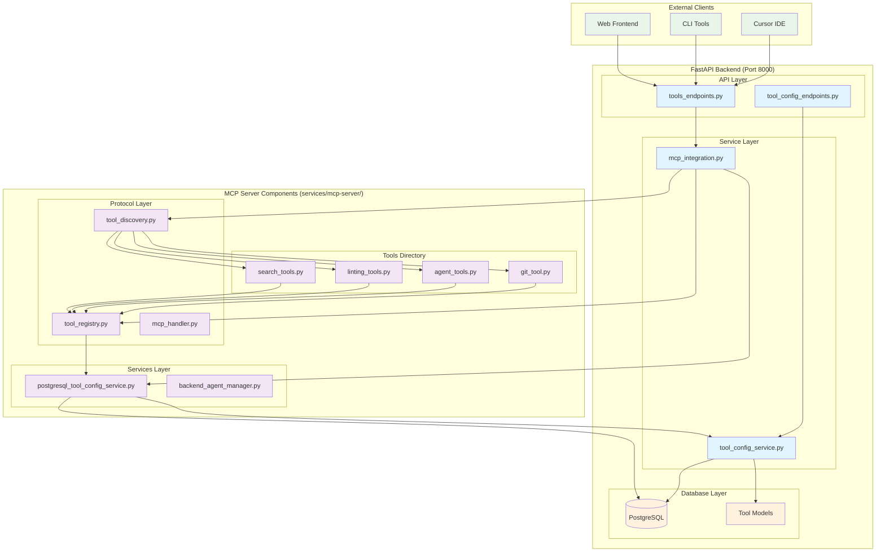

# MCP Integration Architecture

## System Overview

The `mcp_integration.py` serves as a **bridge service** that integrates the standalone MCP server components directly into the FastAPI backend, allowing the backend to provide MCP tool functionality through REST API endpoints without requiring a separate MCP server process.

## Architecture Diagram



## Key Components Analysis

### 1. mcp_integration.py - The Bridge Service

**Purpose**: Integrates MCP server functionality directly into the FastAPI backend

**Key Features**:

- **Lazy Initialization**: Only initializes MCP components when first needed
- **Path Management**: Dynamically adds MCP server to Python path
- **Component Integration**: Imports and initializes core MCP components
- **Tool Discovery**: Automatically discovers and registers tools from MCP server
- **Health Monitoring**: Provides health check capabilities

**Core Methods**:

```python
async def _ensure_initialized()  # Lazy initialization
async def list_tools()          # List available tools
async def call_tool()           # Execute tool functions
async def health_check()        # System health status
```

### 2. MCP Server Components (services/mcp-server/)

**Tool Registry** (`protocol/tool_registry.py`):

- Central registry for all MCP tools
- Decorator-based tool registration system
- PostgreSQL-backed configuration management
- Tool metadata and execution management

**Tool Discovery** (`protocol/tool_discovery.py`):

- Automatic scanning of Python files for `@register_tool` decorators
- AST-based tool discovery
- Module import and registration
- Validation and error handling

**PostgreSQL Tool Config Service** (`services/postgresql_tool_config_service.py`):

- HTTP client for backend API communication
- Caching layer for performance
- Tool configuration CRUD operations
- Backward compatibility wrapper

### 3. Backend Services

**Tool Config Service** (`app/services/tool_config_service.py`):

- PostgreSQL-based tool configuration management
- CRUD operations for tools and categories
- Audit trail and change history
- Global configuration management

**API Endpoints**:

- `/api/mcp/tools/*` - Tool execution endpoints
- `/api/mcp/tool-config/*` - Tool configuration management

## Data Flow

### 1. Tool Discovery and Registration

```
MCP Server Tools → Tool Discovery → Tool Registry → PostgreSQL Config Service → Backend Database
```

### 2. Tool Execution Flow

```
Client Request → FastAPI Endpoint → mcp_integration.py → Tool Registry → Tool Handler → Response
```

### 3. Configuration Management

```
Backend API → Tool Config Service → PostgreSQL → MCP Server Config Service → Tool Registry
```

## Integration Benefits

### 1. **Unified Architecture**

- Single backend service provides both REST API and MCP functionality
- No need for separate MCP server process
- Shared database and configuration

### 2. **Performance Optimization**

- Lazy initialization reduces startup time
- Caching layer in PostgreSQL service
- Direct in-process tool execution

### 3. **Simplified Deployment**

- Single service to deploy and manage
- Unified logging and monitoring
- Shared authentication and security

### 4. **Development Efficiency**

- Hot reloading works for both backend and MCP components
- Unified development environment
- Shared testing and debugging tools

## Configuration Management

The system uses a **dual-layer configuration approach**:

1. **MCP Server Layer**: Uses `@register_tool` decorators for tool definitions
2. **Backend Layer**: Uses PostgreSQL database for runtime configuration

This allows for:

- **Development**: Decorator-based tool registration
- **Production**: Database-backed configuration management
- **Runtime**: Dynamic tool enabling/disabling without code changes

## Error Handling and Resilience

- **Graceful Degradation**: MCP integration failures don't crash the backend
- **Health Monitoring**: Comprehensive health checks for all components
- **Error Propagation**: Proper error handling and logging throughout the stack
- **Fallback Mechanisms**: Fallback to default configurations when services are unavailable

## Security Considerations

- **Path Isolation**: MCP server components are imported dynamically
- **Access Control**: Tool execution through authenticated API endpoints
- **Input Validation**: All tool inputs are validated before execution
- **Audit Trail**: All tool executions and configuration changes are logged

This architecture provides a robust, scalable, and maintainable solution for integrating MCP functionality directly into the FastAPI backend while maintaining the flexibility and power of the standalone MCP server components.
