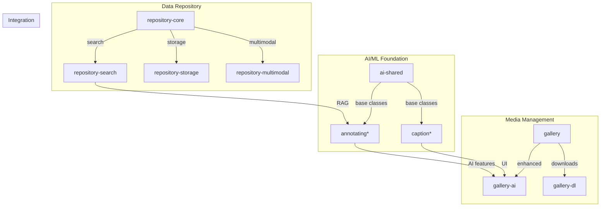
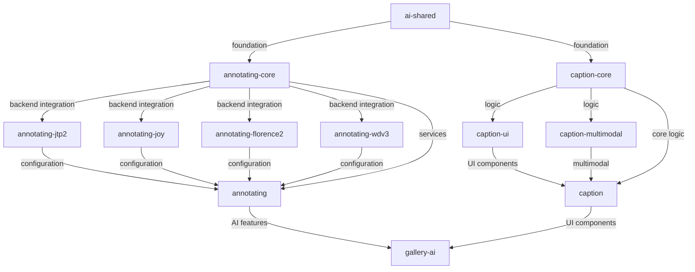

# Reynard Packages

_Comprehensive AI/ML ecosystem for modern SolidJS applications_ 🦊

The Reynard packages directory contains a sophisticated collection of AI/ML, media management, and
data processing packages designed to work together seamlessly. Each package follows the Reynard philosophy of
modular architecture, type safety, and production-ready features.

## 🏗️ Architecture Overview

The Reynard packages are organized into several key categories that
work together to provide a complete AI/ML development ecosystem:



## 📦 Package Categories

### 🤖 AI/ML Foundation

#### `ai-shared` - The AI/ML Foundation

**Version**: 0.1.3 | **Status**: Production Ready

Provides the foundational building blocks for all AI/ML operations in Reynard. This package serves as the architectural
foundation that all other AI/ML packages build upon.

**What it does**:

- **Base Classes**: `BaseAIService` and `BaseModel` for consistent AI service architecture with lifecycle management
- **Service Registry**: Central management system for AI services with dependency resolution and health monitoring
- **Utility Classes**: `ValidationUtils`, `PerformanceMonitor`, `ErrorUtils`, `DataUtils`, `ProgressTracker`
- **Type System**: Comprehensive TypeScript types for services, models, errors, and configurations
- **Error Handling**: Standardized error types (`AIError`, `ModelError`, `ServiceError`) with retry logic

**Key Exports**:

```typescript
// Base classes for building AI services
(BaseAIService, BaseModel, BaseCaptionModel);

// Registries for service management
(ServiceRegistry, ModelRegistry, getServiceRegistry, getModelRegistry);

// Utilities for validation, performance, and data processing
(ValidationUtils, PerformanceMonitor, DataUtils, ProgressTracker);

// Error handling with retry logic
(errorHandler, retry, retryWithExponentialBackoff, NetworkError, ReynardError);
```

**Quick Start**:

```typescript
import { BaseAIService, ServiceConfig, ValidationUtils } from "reynard-ai-shared";

class MyAIService extends BaseAIService {
  constructor() {
    const config: ServiceConfig = {
      name: "my-ai-service",
      dependencies: ["database-service"],
      startupPriority: 50,
      autoStart: true,
    };
    super(config);
  }

  async initialize(): Promise<void> {
    // Validate configuration
    const validation = ValidationUtils.validateValue(this.config, {
      type: "object",
      required: ["name", "dependencies"],
    });
    if (!validation.isValid) throw new ValidationError(validation.errors);
  }
}
```

#### `caption*` - Caption Generation & Editing System

**Versions**: 0.2.0 | **Status**: Production Ready

Modular caption generation and editing system with specialized packages for different use cases:

**Package Breakdown**:

- **`caption-core`**: Core caption generation logic without UI dependencies
- **`caption-ui`**: Specialized UI components for caption generation and text editing
- **`caption-multimodal`**: Multimodal caption support (audio, video, image, text) with Monaco editor integration
- **`caption`**: Main caption editing UI package that combines all caption functionality

**What each package does**:

**`caption-core`**:

- **Core Types**: `MultiModalTypes`, `TextTypes` for caption data structures
- **Composables**: Reusable logic for caption state management and processing
- **Utilities**: Core caption processing functions and validation
- **No UI**: Pure logic layer that can be used by any UI framework

**`caption-ui`**:

- **UI Components**: Specialized components for caption editing interfaces
- **Text Editing**: Advanced text editing capabilities for captions
- **Utilities**: UI-specific utilities for caption display and interaction

**`caption-multimodal`**:

- **Multimodal Components**: Components that work with different media types
- **Media Processing**: Integration with audio, video, and image processing
- **Monaco Editor**: Advanced code editor integration for complex caption editing
- **Cross-Modal**: Handles captions that span multiple media types

**`caption`** (Main Package):

- **TagBubble Component**: Interactive tag bubbles with editing and navigation
- **CaptionInput Component**: Comprehensive caption input with different caption types
- **Tag Management**: Utilities for tag parsing, validation, and autocomplete
- **Accessibility**: Full keyboard navigation and screen reader support

**Key Exports**:

```typescript
// Main UI components (from caption package)
(TagBubble, CaptionInput, CaptionGenerator, TagManager, TagAutocomplete);

// Core types (from caption-core)
(MultiModalTypes, TextTypes, CaptionType, CaptionData);

// Multimodal components (from caption-multimodal)
(MultimodalCaptionEditor, MediaCaptionProcessor, useMultimodalCaption);

// UI components (from caption-ui)
(CaptionEditor, TextEditor, CaptionDisplay);
```

**Quick Start**:

```typescript
import { TagBubble, CaptionInput, CaptionType } from 'reynard-caption';

// Basic tag bubble with full functionality
<TagBubble
  tag="furry"
  index={0}
  onEdit={(newTag) => setTag(newTag)}
  onRemove={() => setTag('')}
  onNavigate={(direction) => handleNavigation(direction)}
  editable={true}
  removable={true}
  size="medium"
/>

// Comprehensive caption input
<CaptionInput
  caption={{ type: CaptionType.TAGS, content: 'furry, anthro, digital art' }}
  state="expanded"
  onCaptionChange={setCaption}
  onSave={(caption) => saveCaption(caption)}
  placeholder="Enter tags..."
  maxLength={1000}
/>
```

#### `annotating*` - Unified Annotation System

**Versions**: 0.3.0 | **Status**: Production Ready

Backend-integrated annotation system with modular architecture. Each package provides specific functionality for
the unified annotation interface.

**Package Architecture**:

- **`annotating-core`**: Backend integration core with FastAPI client and service management
- **`annotating-jtp2`**: JTP2 (Joint Tagger Project PILOT2) configuration for furry artwork tagging
- **`annotating-joy`**: JoyCaption configuration for detailed multilingual captioning
- **`annotating-florence2`**: Florence2 configuration for general-purpose captioning
- **`annotating-wdv3`**: WDv3 (Waifu Diffusion v3) configuration for anime/manga tagging
- **`annotating`**: Main unified interface that coordinates all generators

**What each package does**:

**`annotating-core`**:

- **Backend Services**: `BackendAnnotationManager`, `BackendAnnotationService`, `AnnotationServiceRegistry`
- **API Clients**: FastAPI client for communicating with the backend
- **Health Monitoring**: Service health checks and status monitoring
- **Event System**: Real-time event handling for annotation lifecycle
- **Core Types**: `CaptionTask`, `CaptionResult`, `AnnotationProgress`, `HealthStatus`

**`annotating-jtp2`** (Furry Specialization):

- **Configuration Schema**: JSON schema for JTP2 parameters
- **Specialized Settings**: `threshold: 0.2`, `max_tags: 20`, `include_ratings: true`
- **Model Metadata**: ~400MB model, 95%+ accuracy for furry content
- **Features**: Character recognition, artist identification, rating detection

**`annotating-joy`** (Multilingual Captioning):

- **Multilingual Support**: EN, ES, FR, DE, JA, ZH language support
- **Style Options**: Descriptive, concise, detailed, artistic caption styles
- **Content Control**: Emotions, actions, environmental context options
- **Model Metadata**: ~2GB model, 90%+ accuracy for general content

**`annotating-florence2`** (General Purpose):

- **Versatile Configuration**: General-purpose captioning tasks
- **Multiple Tasks**: Supports various captioning and vision tasks
- **Heavy Model**: High-quality but resource-intensive processing

**`annotating-wdv3`** (Anime Specialization):

- **Anime Focus**: Configured specifically for anime/manga content
- **Danbooru Tags**: Uses Danbooru-style tagging system
- **Lightweight**: Fast processing with good accuracy for anime content

**`annotating`** (Unified Interface):

- **Unified Manager**: `BackendAnnotationManager` that coordinates all generators
- **Convenience Methods**: `generateFurryTags()`, `generateDetailedCaption()`, `generateAnimeTags()`
- **Batch Processing**: UI components for batch annotation operations

**Key Exports**:

```typescript
// Main manager (from annotating package)
(createBackendAnnotationManager, BackendAnnotationManager);

// Backend services (from annotating-core)
(BackendAnnotationService, AnnotationServiceRegistry, CaptionApiClient);

// Generator configurations
(JTP2_CONFIG_SCHEMA, JOY_CAPTION_CONFIG_SCHEMA, FLORENCE2_CONFIG_SCHEMA, WDV3_CONFIG_SCHEMA);

// Core types
(CaptionTask, CaptionResult, AnnotationProgress, HealthStatus, CaptionGeneratorConfig);
```

**Quick Start**:

```typescript
import { createBackendAnnotationManager } from "reynard-annotating";

// Initialize the unified manager
const manager = createBackendAnnotationManager({
  baseUrl: "http://localhost:8000",
  timeout: 30000,
});

await manager.initialize();

// Use specialized generators
const furryTags = await manager.generateFurryTags("/path/to/image.jpg");
const detailedCaption = await manager.generateDetailedCaption("/path/to/image.jpg");
const animeTags = await manager.generateAnimeTags("/path/to/image.jpg");

// Or use the service directly with custom configuration
const service = manager.getService();
const task = {
  imagePath: "/path/to/image.jpg",
  generatorName: "jtp2",
  config: { threshold: 0.2, max_tags: 20 },
};
const result = await service.generateCaption(task);
```

## 🔄 Technical Architecture & Data Flow

### **How the AI/ML Packages Work Together**

The Reynard AI/ML ecosystem follows a layered architecture where each package has a specific role:

```text
┌─────────────────────────────────────────────────────────────┐
│                    Application Layer                        │
│  (gallery-ai, caption components, user interfaces)         │
└─────────────────────┬───────────────────────────────────────┘
                      │
┌─────────────────────▼───────────────────────────────────────┐
│                 Unified Interface Layer                     │
│  (annotating, caption - main packages)                     │
└─────────────────────┬───────────────────────────────────────┘
                      │
┌─────────────────────▼───────────────────────────────────────┐
│                Specialized Component Layer                  │
│  (caption-core, caption-ui, caption-multimodal)            │
└─────────────────────┬───────────────────────────────────────┘
                      │
┌─────────────────────▼───────────────────────────────────────┐
│                Configuration & Backend Layer                │
│  (annotating-core, annotating-{generator} packages)        │
└─────────────────────┬───────────────────────────────────────┘
                      │
┌─────────────────────▼───────────────────────────────────────┐
│                   Foundation Layer                          │
│  (ai-shared - base classes, utilities, types)              │
└─────────────────────────────────────────────────────────────┘
```

### **Data Flow Example: Caption Generation**

1. **User Interaction**: User clicks "Generate Caption" in `gallery-ai`
2. **UI Layer**: `caption` package handles the UI interaction
3. **Logic Layer**: `caption-core` processes the caption request
4. **Unified Interface**: `annotating` package coordinates the generation
5. **Backend Integration**: `annotating-core` communicates with FastAPI backend
6. **Generator Configuration**: Specific generator package (e.g., `annotating-jtp2`) provides configuration
7. **Foundation**: `ai-shared` provides base classes and utilities throughout the process

### **Package Dependencies**



### 🖼️ Media Management

#### `gallery` - Advanced File & Media Management

**Version**: 0.2.0 | **Status**: Production Ready

Advanced file and media management system for SolidJS applications with drag-and-drop, responsive grids, and
comprehensive file handling.

**Key Features**:

- Complete file browser with folder navigation
- Media support for images, videos, audio, text, and documents
- Responsive grid layouts (grid, list, masonry) with virtual scrolling
- Drag-and-drop file upload with progress tracking
- Real-time search with advanced filtering options
- Multi-select with keyboard shortcuts and context menus

**Quick Start**:

```typescript
import { Gallery } from "reynard-gallery";

<Gallery
  data={galleryData}
  showUpload={true}
  showBreadcrumbs={true}
  callbacks={{
    onNavigate: (path) => console.log("Navigate to:", path),
    onItemOpen: (item) => console.log("Open item:", item.name),
  }}
/>
```

#### `gallery-ai` - AI-Enhanced Gallery Components

**Version**: 0.2.0 | **Status**: Production Ready

AI-enhanced gallery components that transform your gallery into an intelligent media management powerhouse.

**Key Features**:

- Caption generation for images using multiple AI models
- Batch processing with real-time progress tracking
- Smart context menus with AI-powered actions
- Enhanced image viewer with caption editing
- Configurable AI settings and workflows

**Quick Start**:

```typescript
import { AIGalleryProvider, AIGalleryGrid } from "reynard-gallery-ai";

<AIGalleryProvider initialConfig={aiConfig}>
  <AIGalleryGrid
    items={galleryData.items}
    aiProps={{
      showAIIndicators: true,
      availableGenerators: ["jtp2", "wdv3", "joy", "florence2"],
    }}
  />
</AIGalleryProvider>
```

#### `gallery-dl` - Gallery Download Integration

**Version**: 0.1.0 | **Status**: Production Ready

Comprehensive gallery download system with progress tracking, batch processing, and
seamless integration with the Reynard ecosystem.

**Key Features**:

- Download galleries from 1000+ supported websites
- Real-time progress monitoring with detailed statistics
- Batch processing for multiple galleries
- URL validation with automatic extractor detection
- Comprehensive error recovery and retry mechanisms

**Quick Start**:

```typescript
import { GalleryDownloader } from "reynard-gallery-dl";

const downloader = createDefaultGalleryDownloader();
const result = await downloader.download("https://example.com/gallery");
```

### 🗄️ Data Repository System

#### `repository-core` - Core Repository Types & Constants

**Version**: 0.1.0 | **Status**: Development\*\*

Core types, constants, and base functionality for the Reynard repository system.

**Key Features**:

- Core repository types and interfaces
- Constants and configuration schemas
- Base error handling and validation
- Foundation for all repository packages

#### `repository-search` - Search & Vector Operations

**Version**: 0.1.0 | **Status**: Development\*\*

Search, embedding, and vector operations for the Reynard repository system.

**Key Features**:

- Vector search and embedding operations
- RAG (Retrieval-Augmented Generation) integration
- Search indexing and query processing
- Integration with AI/ML services

#### `repository-storage` - File Management & Processing

**Version**: 0.1.0 | **Status**: Development\*\*

File management, Parquet processing, and storage operations for the Reynard repository system.

**Key Features**:

- File management and organization
- Parquet file processing and optimization
- Storage operations and data persistence
- Integration with file processing utilities

#### `repository-multimodal` - Multimodal Integration

**Version**: 0.1.0 | **Status**: Development\*\*

Multimodal integration, dataset management, and versioning for the Reynard repository system.

**Key Features**:

- Multimodal data integration
- Dataset management and versioning
- Cross-modal search and retrieval
- Integration with multimodal processing

## 🚀 Quick Start Guide

### 1. Install Core Packages

```bash
# AI/ML Foundation
pnpm install reynard-ai-shared reynard-annotating reynard-caption

# Media Management
pnpm install reynard-gallery reynard-gallery-ai reynard-gallery-dl

# Repository System (when ready)
pnpm install reynard-repository-core reynard-repository-search
```

### 2. Basic AI Gallery Setup

```typescript
import { AIGalleryProvider, AIGalleryGrid } from "reynard-gallery-ai";
import { createBackendAnnotationManager } from "reynard-annotating";

function MyAIGallery() {
  const [annotationManager] = createSignal(
    createBackendAnnotationManager({
      baseUrl: "http://localhost:8000",
    })
  );

  return (
    <AIGalleryProvider
      initialConfig={{
        defaultGenerator: "jtp2",
        autoGenerateOnUpload: false,
        batchSettings: { maxConcurrent: 3 },
      }}
    >
      <AIGalleryGrid
        items={galleryData.items}
        aiProps={{
          showAIIndicators: true,
          availableGenerators: ["jtp2", "wdv3", "joy", "florence2"],
        }}
      />
    </AIGalleryProvider>
  );
}
```

### 3. Caption Generation

```typescript
import { useGalleryAI } from "reynard-gallery-ai";

function CaptionGenerator() {
  const ai = useGalleryAI();

  const handleGenerateCaption = async (item) => {
    try {
      const result = await ai.generateCaption(item, "jtp2");
      console.log("Generated caption:", result.caption);
    } catch (error) {
      console.error("Caption generation failed:", error);
    }
  };

  return (
    <button onClick={() => handleGenerateCaption(selectedItem)}>
      Generate Caption
    </button>
  );
}
```

## 🔧 Development Workflow

### Package Development

Each package follows the Reynard development standards:

```bash
# Development build with watch mode
pnpm dev

# Production build
pnpm build

# Run tests
pnpm test

# Run tests with coverage
pnpm test:coverage

# Type checking
pnpm typecheck
```

### Testing Strategy

All packages use Vitest with comprehensive test coverage:

- **Unit Tests**: Individual component and utility testing
- **Integration Tests**: Cross-package functionality testing
- **E2E Tests**: Complete workflow testing
- **Performance Tests**: Benchmarking and optimization

### Code Quality

- **TypeScript**: Full type safety with strict configuration
- **ESLint**: Code quality and consistency enforcement
- **Prettier**: Code formatting and style consistency
- **140-Line Axiom**: Maximum 140 lines per source file for maintainability

## 📊 Package Status

| Package                 | Version | Status         | Purpose                                | Dependencies                           | Tests |
| ----------------------- | ------- | -------------- | -------------------------------------- | -------------------------------------- | ----- |
| `ai-shared`             | 0.1.3   | ✅ Production  | AI/ML foundation (base classes, utils) | reynard-core, reynard-connection       | ✅    |
| `caption`               | 0.2.0   | ✅ Production  | Main caption editing UI                | reynard-annotating, reynard-components | ✅    |
| `caption-core`          | 0.1.0   | 🚧 Development | Core caption logic (no UI)             | reynard-core                           | 🚧    |
| `caption-multimodal`    | 0.1.0   | 🚧 Development | Multimodal caption support             | reynard-multimodal                     | 🚧    |
| `caption-ui`            | 0.1.0   | 🚧 Development | Specialized caption UI components      | reynard-components                     | 🚧    |
| `annotating`            | 0.3.0   | ✅ Production  | Unified annotation interface           | reynard-annotating-core                | ✅    |
| `annotating-core`       | 0.2.0   | ✅ Production  | Backend integration core               | reynard-ai-shared                      | ✅    |
| `annotating-jtp2`       | 0.1.0   | ✅ Production  | JTP2 config (furry tagging)            | reynard-annotating-core                | ✅    |
| `annotating-joy`        | 0.1.0   | ✅ Production  | JoyCaption config (multilingual)       | reynard-annotating-core                | ✅    |
| `annotating-florence2`  | 0.1.0   | ✅ Production  | Florence2 config (general purpose)     | reynard-annotating-core                | ✅    |
| `annotating-wdv3`       | 0.1.0   | ✅ Production  | WDv3 config (anime tagging)            | reynard-annotating-core                | ✅    |
| `gallery`               | 0.2.0   | ✅ Production  | File & media management                | reynard-core, reynard-components       | ✅    |
| `gallery-ai`            | 0.2.0   | ✅ Production  | AI-enhanced gallery                    | reynard-gallery, reynard-annotating    | ✅    |
| `gallery-dl`            | 0.1.0   | ✅ Production  | Gallery download integration           | reynard-core, reynard-ai-shared        | ✅    |
| `repository-core`       | 0.1.0   | 🚧 Development | Core repository types & constants      | reynard-core                           | 🚧    |
| `repository-search`     | 0.1.0   | 🚧 Development | Search & vector operations             | reynard-repository-core                | 🚧    |
| `repository-storage`    | 0.1.0   | 🚧 Development | File management & Parquet processing   | reynard-repository-core                | 🚧    |
| `repository-multimodal` | 0.1.0   | 🚧 Development | Multimodal integration & versioning    | reynard-repository-core                | 🚧    |

**Legend**: ✅ Production Ready | 🚧 Development | ⚠️ Beta | ❌ Deprecated

## 🎯 Use Cases

### Content Creators

- **AI-Powered Tagging**: Automatically generate tags for artwork and media
- **Batch Processing**: Process large collections of images efficiently
- **Smart Organization**: AI-assisted file organization and categorization

### Developers

- **AI Integration**: Easy integration of AI/ML services into applications
- **Media Management**: Comprehensive file and media handling capabilities
- **Data Processing**: Advanced data repository and search capabilities

### Researchers

- **Dataset Management**: Organize and version large datasets
- **Multimodal Analysis**: Process and analyze different types of media
- **Search & Retrieval**: Advanced search capabilities with vector operations

## 🔗 Integration Examples

### With SolidJS Applications

```typescript
import { render } from "solid-js/web";
import { AIGalleryProvider } from "reynard-gallery-ai";
import { createBackendAnnotationManager } from "reynard-annotating";

function App() {
  return (
    <AIGalleryProvider>
      {/* Your application components */}
    </AIGalleryProvider>
  );
}

render(() => <App />, document.getElementById("root")!);
```

### With Backend Services

```typescript
// Backend integration with FastAPI
const annotationManager = createBackendAnnotationManager({
  baseUrl: "http://localhost:8000",
  timeout: 30000,
});

await annotationManager.initialize();
```

### With File Systems

```typescript
// File system integration
import { Gallery } from "reynard-gallery";

<Gallery
  data={fileSystemData}
  callbacks={{
    onNavigate: async (path) => {
      const data = await fileSystem.listFiles(path);
      setGalleryData(data);
    },
  }}
/>
```

## 📚 Documentation

Each package includes comprehensive documentation:

- **README.md**: Package overview, features, and quick start
- **API Reference**: Complete API documentation with examples
- **Examples**: Working examples and integration patterns
- **Type Definitions**: Full TypeScript support with IntelliSense

## 🤝 Contributing

We welcome contributions to the Reynard packages! Please see our [Contributing Guide](../../CONTRIBUTING.md) for
details on:

- Code style and standards
- Testing requirements
- Documentation expectations
- Pull request process

## 📄 License

All packages are part of the Reynard ecosystem and
follow the same licensing terms. See the main [LICENSE](../../LICENSE.md) file for details.

## 🆘 Support

For support and questions:

- **Documentation**: Check individual package README files
- **Issues**: Report bugs and request features on [GitHub](https://github.com/reynard/reynard)
- **Community**: Join our [Discord community](https://discord.gg/reynard)
- **Discussions**: Use GitHub Discussions for questions and ideas

---

## Credits

Built with 🦊 by the Reynard team - where AI meets elegance in modern web development
