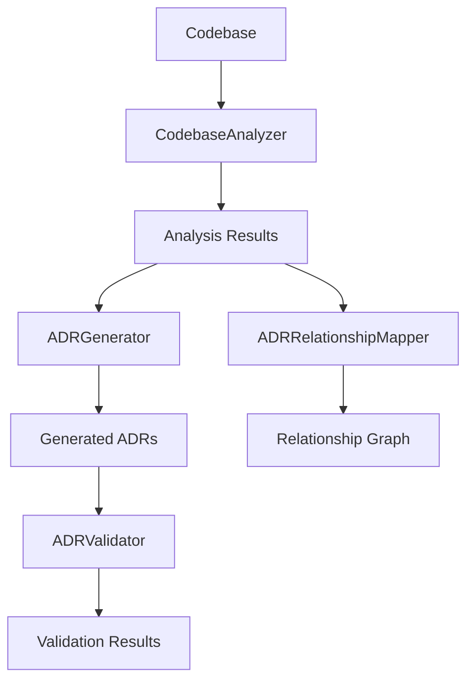

# Reynard ADR System

_Intelligent Architecture Decision Record (ADR) generation, analysis, and management for the Reynard framework_

## Overview

The Reynard ADR System is a comprehensive tool for managing Architecture Decision Records (ADRs) in
the Reynard framework. It provides intelligent codebase analysis, automated ADR generation, validation, and
relationship mapping to help teams maintain high-quality architectural documentation.

## Features

### Intelligent Analysis

- **Codebase Analysis Engine**: Comprehensive analysis of code structure, dependencies, and patterns
- **Architecture Pattern Detection**: Automatic identification of microservices, modular, and layered architectures
- **Code Quality Assessment**: Metrics for test coverage, documentation, and complexity
- **Performance Bottleneck Detection**: Identification of large files and performance issues

### Automated Generation

- **Smart ADR Suggestions**: AI-powered suggestions based on codebase analysis
- **Template-Based Generation**: Specialized templates for security, performance, scalability, and integration
- **Priority-Based Recommendations**: Suggestions ranked by impact and urgency
- **Evidence-Based Reasoning**: Clear evidence and reasoning for each suggestion

### Quality Assurance

- **Automated Validation**: Comprehensive validation of ADR structure and content
- **Relationship Mapping**: Analysis of dependencies, conflicts, and superseding relationships
- **Circular Dependency Detection**: Identification of problematic dependency cycles
- **Compliance Checking**: Validation against architectural standards

## Installation

```bash
# Install dependencies
pnpm install

# Build the package
pnpm build

# Run tests
pnpm test
```

## Usage

### Command Line Interface

```bash
# Analyze codebase and generate suggestions
npx adr-analyze analyze --path ./src --generate

# Validate existing ADRs
npx adr-analyze validate --path ./docs/architecture/decisions

# Analyze ADR relationships
npx adr-analyze relationships --path ./docs/architecture/decisions
```

### Programmatic Usage

```typescript
import { CodebaseAnalyzer, ADRGenerator, ADRValidator } from "reynard-adr-system";

// Analyze codebase
const analyzer = new CodebaseAnalyzer("./src");
const analysis = await analyzer.analyzeCodebase();

// Generate ADRs from suggestions
const generator = new ADRGenerator("./docs/architecture/decisions", "./templates");
const generatedFiles = await generator.generateMultipleADRs(analysis.suggestions);

// Validate ADRs
const validator = new ADRValidator("./docs/architecture/decisions");
const results = await validator.validateAllADRs();
```

## Architecture

### Core Components

#### CodebaseAnalyzer

- **Purpose**: Comprehensive codebase analysis and pattern detection
- **Key Features**:
  - File discovery and metrics calculation
  - Dependency analysis and circular dependency detection
  - Architecture pattern identification
  - Code quality assessment
  - ADR suggestion generation

#### ADRGenerator

- **Purpose**: Intelligent ADR creation from analysis results
- **Key Features**:
  - Template-based ADR generation
  - Priority-based suggestion processing
  - Evidence-based content generation
  - Multiple output formats

#### ADRValidator

- **Purpose**: Quality assurance for ADR documents
- **Key Features**:
  - Structure validation
  - Content quality assessment
  - Compliance checking
  - Improvement suggestions

#### ADRRelationshipMapper

- **Purpose**: Analysis of ADR dependencies and relationships
- **Key Features**:
  - Relationship detection and mapping
  - Circular dependency identification
  - Dependency chain analysis
  - Graph-based relationship visualization

### Data Flow



## Templates

The system includes specialized templates for different types of architectural decisions:

### Security ADR Template

- Threat modeling and risk assessment
- Security controls and implementation details
- Compliance and testing requirements
- Incident response procedures

### Performance ADR Template

- Performance requirements and baselines
- Optimization strategies and implementation
- Testing and monitoring approaches
- Metrics and alerting

### Scalability ADR Template

- Growth projections and requirements
- Scaling strategies and patterns
- Implementation planning
- Cost optimization

### Integration ADR Template

- Integration requirements and architecture
- Implementation details and testing
- Monitoring and security considerations
- Error handling and recovery

## Configuration

### Analysis Configuration

```typescript
const analyzer = new CodebaseAnalyzer("./src", {
  supportedExtensions: [".ts", ".tsx", ".js", ".jsx"],
  excludePatterns: ["node_modules", ".git", "dist"],
  maxFileSize: 10000,
  complexityThreshold: 0.7,
});
```

### Validation Rules

```typescript
const validator = new ADRValidator("./docs/architecture/decisions", {
  requiredSections: ["status", "context", "decision", "consequences"],
  minContentLength: 500,
  allowPlaceholders: false,
  strictMode: true,
});
```

## Metrics and Monitoring

### Codebase Metrics

- **File Count**: Total number of source files
- **Line Count**: Total lines of code
- **Complexity Score**: Overall codebase complexity
- **Architecture Patterns**: Detected architectural patterns

### Quality Metrics

- **Test Coverage**: Percentage of code covered by tests
- **Documentation Coverage**: Percentage of documented code
- **Code Smells**: Number and severity of code quality issues
- **Maintainability Index**: Overall maintainability score

### ADR Metrics

- **Suggestion Accuracy**: Percentage of accurate suggestions
- **Generation Success Rate**: Percentage of successful ADR generations
- **Validation Pass Rate**: Percentage of ADRs passing validation
- **Relationship Coverage**: Percentage of relationships detected

## Best Practices

### ADR Creation

1. **Use Appropriate Templates**: Select the right template for your decision type
2. **Provide Clear Context**: Explain the situation and problem being addressed
3. **Document Consequences**: Include both positive and negative outcomes
4. **Include Evidence**: Provide concrete evidence for your decisions
5. **Plan Implementation**: Include detailed implementation plans

### Codebase Analysis

1. **Regular Analysis**: Run analysis regularly to catch issues early
2. **Review Suggestions**: Always review and validate generated suggestions
3. **Update Templates**: Keep templates current with best practices
4. **Monitor Metrics**: Track quality metrics over time

### Relationship Management

1. **Document Dependencies**: Explicitly document ADR relationships
2. **Avoid Circular Dependencies**: Resolve circular dependencies promptly
3. **Update Relationships**: Keep relationship mappings current
4. **Review Conflicts**: Address conflicting ADRs proactively

## Troubleshooting

### Common Issues

#### Analysis Fails

- **Cause**: Insufficient permissions or corrupted files
- **Solution**: Check file permissions and run with appropriate access

#### Low Suggestion Accuracy

- **Cause**: Insufficient codebase context or outdated patterns
- **Solution**: Update analysis rules and improve codebase documentation

#### Validation Errors

- **Cause**: Missing required sections or invalid content
- **Solution**: Review validation rules and update ADR content

#### Relationship Mapping Issues

- **Cause**: Inconsistent ADR naming or missing metadata
- **Solution**: Standardize ADR naming conventions and include proper metadata

### Debug Mode

```bash
# Enable debug logging
DEBUG=reynard-adr-system npx adr-analyze analyze --path ./src
```

## Contributing

1. **Fork the repository**
2. **Create a feature branch**
3. **Make your changes**
4. **Add tests for new functionality**
5. **Run the test suite**
6. **Submit a pull request**

### Development Setup

```bash
# Clone the repository
git clone <repository-url>

# Install dependencies
pnpm install

# Run in development mode
pnpm dev

# Run tests
pnpm test

# Run linting
pnpm lint
```

## License

MIT License - see LICENSE file for details.

## Support

For questions, issues, or contributions:

- **Issues**: GitHub Issues
- **Discussions**: GitHub Discussions
- **Documentation**: [Reynard Architecture Guide](../docs/architecture/README.md)

---

_Built with 🦊 fox cunning, 🦦 otter thoroughness, and 🐺 wolf precision for the Reynard framework_
