# reynard-model-management

A comprehensive model management system for Reynard applications that handles ML model registration, downloading,
loading, and lifecycle management.

## Architecture


## Model Lifecycle Flow


## Model Status & Health Flow


## Component Architecture

```mermaid
graph TB
    subgraph "🎨 UI Component Architecture"
        A[ModelManager] --> B[HealthOverview]
        A --> C[ModelsGrid]
        A --> D[ErrorDisplay]

        subgraph "📊 Health Overview"
            B --> B1[System Health Status]
            B --> B2[Performance Metrics]
            B --> B3[Resource Usage]
            B --> B4[Health Indicators]
            B1 --> B5[Overall Health Score]
            B2 --> B6[Memory Usage]
            B2 --> B7[CPU Usage]
            B3 --> B8[Model Count]
            B3 --> B9[Loaded Models]
            B4 --> B10[Health Icons]
            B4 --> B11[Status Colors]
        end

        subgraph "📋 Models Grid"
            C --> C1[Model Cards]
            C --> C2[Model Controls]
            C --> C3[Status Indicators]
            C --> C4[Progress Bars]
            C1 --> C5[Model Information]
            C1 --> C6[Model Metadata]
            C2 --> C7[Load/Unload Buttons]
            C2 --> C8[Download Button]
            C3 --> C9[Status Badges]
            C3 --> C10[Health Indicators]
            C4 --> C11[Download Progress]
            C4 --> C12[Loading Progress]
        end

        subgraph "⚠️ Error Display"
            D --> D1[Error Messages]
            D --> D2[Error Actions]
            D --> D3[Error History]
            D1 --> D4[Error Text]
            D1 --> D5[Error Icons]
            D2 --> D6[Dismiss Button]
            D2 --> D7[Retry Button]
            D3 --> D8[Error Log]
            D3 --> D9[Error Analytics]
        end

        subgraph "🔄 useModelManager Hook"
            E[useModelManager] --> E1[Reactive State]
            E --> E2[Model Operations]
            E --> E3[Error Handling]
            E --> E4[Backend Integration]
            E1 --> E5[models Signal]
            E1 --> E6[systemHealth Signal]
            E1 --> E7[error Signal]
            E2 --> E8[loadModel Function]
            E2 --> E9[unloadModel Function]
            E3 --> E10[clearError Function]
            E4 --> E11[API Calls]
            E4 --> E12[WebSocket Updates]
        end
    end

    subgraph "🎯 Model Card Components"
        F[Model Card] --> F1[Model Header]
        F --> F2[Model Body]
        F --> F3[Model Footer]
        F1 --> F4[Model Name]
        F1 --> F5[Model Type]
        F1 --> F6[Status Badge]
        F2 --> F7[Model Description]
        F2 --> F8[Model Metadata]
        F2 --> F9[Progress Indicators]
        F3 --> F10[Action Buttons]
        F3 --> F11[Health Status]
    end

    A -->|Uses| E
    B -->|Displays| F
    C -->|Renders| F
    E -->|Manages| A
```



## Features

- **Model Registry**: Centralized registration and discovery of ML models
- **Download Management**: Concurrent model downloading with progress tracking
- **Model Loading**: Lifecycle management for loaded models
- **Health Monitoring**: Built-in health checks for loaded models
- **Event System**: Comprehensive event system for model lifecycle events
- **TypeScript Support**: Full TypeScript support with comprehensive type definitions

## Installation

```bash
npm install reynard-model-management
```

## Quick Start

```typescript
import { ModelManager, ModelType, ModelStatus, ModelHealth } from "reynard-model-management";

// Create model manager
const modelManager = new ModelManager({
  maxConcurrentDownloads: 3,
  maxConcurrentLoads: 2,
  downloadTimeout: 300000,
  loadTimeout: 120000,
});

// Register a model
modelManager.registerModel({
  modelId: "my-caption-model",
  modelType: ModelType.CAPTION_GENERATOR,
  repoId: "my-org/my-caption-model",
  description: "A caption generation model",
  totalSizeEstimate: 500_000_000, // 500MB
  fileCountEstimate: 3,
});

// Download the model
await modelManager.downloadModel("my-caption-model", progress => {
  console.log(`Download progress: ${progress.progress}%`);
});

// Load the model
const instance = await modelManager.loadModel("my-caption-model", {
  threshold: 0.2,
  forceCpu: false,
});

console.log("Model loaded:", instance);

// Check model health
const health = modelManager.getModelHealth("my-caption-model");
console.log("Model health:", health);

// Unload the model
await modelManager.unloadModel("my-caption-model");
```

## API Reference

### ModelManager

The main orchestrator for model management.

#### ModelManager Constructor

```typescript
new ModelManager(config?: ModelManagerConfig)
```

#### Methods

- `registerModel(modelInfo: ModelInfo): void` - Register a model
- `downloadModel(modelId: string, progressCallback?: (progress: ModelDownloadProgress) => void): Promise<void>` - Download a model
- `loadModel(modelId: string, config?: Record<string, any>): Promise<ModelInstance>` - Load a model
- `unloadModel(modelId: string): Promise<void>` - Unload a model
- `getModelInfo(modelId: string): ModelInfo | undefined` - Get model information
- `getModelInstance(modelId: string): ModelInstance | undefined` - Get loaded model instance
- `isModelAvailable(modelId: string): boolean` - Check if model is available
- `isModelLoaded(modelId: string): boolean` - Check if model is loaded
- `getModelStatus(modelId: string): ModelStatus` - Get model status
- `getModelHealth(modelId: string): ModelHealth` - Get model health

### BaseModel

Abstract base class that all model implementations must extend.

#### BaseModel Constructor

```typescript
constructor(modelId: string, modelType: ModelType, config: Record<string, any> = {})
```

#### Abstract Methods

- `download(): Promise<void>` - Download the model
- `load(config?: Record<string, any>): Promise<void>` - Load the model
- `unload(): Promise<void>` - Unload the model
- `healthCheck(): Promise<ModelHealth>` - Perform health check
- `isAvailable(): Promise<boolean>` - Check if model is available

#### Properties

- `modelId: string` - Model identifier
- `modelType: ModelType` - Model type
- `status: ModelStatus` - Current model status
- `health: ModelHealth` - Current model health
- `config: Record<string, any>` - Model configuration

### Types

#### ModelType

```typescript
enum ModelType {
  CAPTION_GENERATOR = "caption_generator",
  DETECTION_MODEL = "detection_model",
  EMBEDDING_MODEL = "embedding_model",
  DIFFUSION_LM = "diffusion_lm",
  CLASSIFICATION_MODEL = "classification_model",
}
```

#### ModelStatus

```typescript
enum ModelStatus {
  NOT_DOWNLOADED = "not_downloaded",
  DOWNLOADING = "downloading",
  DOWNLOADED = "downloaded",
  LOADING = "loading",
  LOADED = "loaded",
  ERROR = "error",
}
```

#### ModelHealth

```typescript
enum ModelHealth {
  HEALTHY = "healthy",
  DEGRADED = "degraded",
  UNHEALTHY = "unhealthy",
  UNKNOWN = "unknown",
}
```

## Advanced Usage

### Event Handling

```typescript
modelManager.addEventListener(event => {
  console.log("Model event:", event);
});
```

### Custom Model Implementation

```typescript
import { BaseModel, ModelType, ModelHealth } from "reynard-model-management";

class MyCaptionModel extends BaseModel {
  constructor() {
    super("my-caption-model", ModelType.CAPTION_GENERATOR, {
      threshold: 0.2,
      forceCpu: false,
    });
  }

  async download(): Promise<void> {
    // Implement model download logic
  }

  async load(config?: Record<string, any>): Promise<void> {
    // Implement model loading logic
  }

  async unload(): Promise<void> {
    // Implement model unloading logic
  }

  async healthCheck(): Promise<ModelHealth> {
    // Implement health check logic
    return ModelHealth.HEALTHY;
  }

  async isAvailable(): Promise<boolean> {
    // Check if model files exist
    return true;
  }
}
```

### Model Configuration

```typescript
// Update model configuration
modelManager.updateModelConfig("my-caption-model", {
  threshold: 0.3,
  batchSize: 8,
});

// Get model configuration
const instance = modelManager.getModelInstance("my-caption-model");
console.log("Model config:", instance?.config);
```

### Statistics and Monitoring

```typescript
// Get model manager statistics
const stats = modelManager.getStatistics();
console.log("Total models:", stats.totalModels);
console.log("Loaded models:", stats.loadedModels);
console.log("Active downloads:", stats.activeDownloads);

// Get model manager state
const state = modelManager.getState();
console.log("Manager state:", state);
```

## License

MIT
