# Reynard RAG System 🦊🔍

A comprehensive RAG (Retrieval-Augmented Generation) system for SolidJS applications with
EmbeddingGemma integration and advanced search capabilities.

## Architecture


## Search Flow


## Document Processing Flow

```mermaid
flowchart TD
    A[File Upload] --> B{File Type?}

    B -->|Text/Code| C[Text Processing]
    B -->|Image| D[Image Processing]
    B -->|Mixed| E[Multi-modal Processing]

    C --> C1[Content Extraction]
    C1 --> C2[Text Chunking]
    C2 --> C3[Text Embedding]
    C3 --> C4[Vector Storage]

    D --> D1[Image Analysis]
    D1 --> D2[CLIP Embedding]
    D2 --> D3[Caption Generation]
    D3 --> D4[Caption Embedding]
    D4 --> D5[Vector Storage]

    E --> E1[Content Separation]
    E1 --> C
    E1 --> D

    C4 --> F[Search Index]
    D5 --> F

    F --> G[Search Ready]

    subgraph "🔧 Processing Configuration"
        H[Chunking Config] --> H1[Max Tokens: 512]
        H --> H2[Min Tokens: 100]
        H --> H3[Overlap Ratio: 0.15]

        I[Embedding Config] --> I1[Text Model: mxbai-embed-large]
        I --> I2[Code Model: bge-m3]
        I --> I3[Caption Model: nomic-embed-text]
        I --> I4[CLIP Model: ViT-L-14/openai]
    end
```



## 3D Visualization System


## ✨ Features

### 🚀 **Core Capabilities**

- **Advanced Search Interface**: Comprehensive search UI with filtering and sorting
- **EmbeddingGemma Integration**: Built-in support for EmbeddingGemma models
- **Real-time Results**: Live search results with similarity scoring
- **Metadata Support**: Rich metadata display and filtering
- **TypeScript First**: Complete type safety with excellent IntelliSense

### 🎨 **UI/UX Excellence**

- **Responsive Design**: Mobile-first with adaptive layouts
- **Accessibility**: Full WCAG 2.1 compliance with keyboard navigation
- **Theming**: Seamless integration with Reynard's theming system
- **Animations**: Smooth transitions and engaging micro-interactions
- **Dark Mode**: Built-in dark mode support

### ⚡ **Performance**

- **Optimized Search**: Efficient query processing and result caching
- **Memory Management**: Smart result limiting and cleanup
- **Lazy Loading**: Progressive result loading
- **Tree Shakable**: Import only what you need

## 📦 Installation

```bash
npm install reynard-rag reynard-components solid-js
```

## 🎯 Quick Start

### Basic RAG Search Implementation

```tsx
import { RAGSearch } from "reynard-rag";
import "reynard-rag/styles";

function App() {
  return (
    <RAGSearch
      endpoint="/api/rag/search"
      height="600px"
      config={{
        enableFilters: true,
        showMetadata: true,
        maxResults: 20,
      }}
      onSearch={query => console.log("Searching:", query)}
      onResultClick={result => console.log("Selected:", result)}
    />
  );
}
```

### Advanced Usage with Custom Configuration

```tsx
import { RAGSearch } from "reynard-rag";

function CustomRAGApp() {
  const handleSearch = (query: string) => {
    // Custom search logic
    console.log("Custom search:", query);
  };

  const handleResultClick = (result: RAGResult) => {
    // Custom result handling
    console.log("Result selected:", result);
  };

  return (
    <RAGSearch
      endpoint="/api/rag/search"
      config={{
        enableFilters: true,
        showMetadata: true,
        maxResults: 50,
        similarityThreshold: 0.7,
        enableReranking: true,
      }}
      onSearch={handleSearch}
      onResultClick={handleResultClick}
    />
  );
}
```

## 🔧 API Reference

### RAGSearch Props

| Prop            | Type                          | Default   | Description                 |
| --------------- | ----------------------------- | --------- | --------------------------- |
| `endpoint`      | `string`                      | -         | API endpoint for RAG search |
| `config`        | `RAGConfig`                   | `{}`      | Configuration options       |
| `height`        | `string`                      | `"400px"` | Container height            |
| `onSearch`      | `(query: string) => void`     | -         | Search callback             |
| `onResultClick` | `(result: RAGResult) => void` | -         | Result click callback       |

### RAGConfig

```typescript
interface RAGConfig {
  enableFilters?: boolean;
  showMetadata?: boolean;
  maxResults?: number;
  similarityThreshold?: number;
  enableReranking?: boolean;
  defaultFilters?: Record<string, any>;
}
```

### RAGResult

```typescript
interface RAGResult {
  chunk_id: string;
  document_id: string;
  text: string;
  similarity_score: number;
  rank: number;
  metadata: {
    chunk_length?: number;
    document_source?: string;
    embedding_model?: string;
    [key: string]: any;
  };
}
```

## 🎨 Styling

The RAG system comes with built-in styles that integrate seamlessly with Reynard's theming system:

```tsx
import "reynard-rag/styles";
```

### Custom Styling

You can customize the appearance using CSS custom properties:

```css
:root {
  --rag-primary-color: #0078d4;
  --rag-background: #ffffff;
  --rag-border: #e1e1e1;
  --rag-text: #323130;
}
```

## 🧪 Testing

```bash
npm test
npm run test:coverage
```

## 📚 Examples

Check out the examples directory for complete implementation examples:

- Basic RAG search
- Advanced filtering
- Custom result rendering
- Integration with chat systems

## 🤝 Contributing

Contributions are welcome! Please read our contributing guidelines and submit pull requests to our repository.

## 📄 License

MIT License - see LICENSE file for details.
