# reynard-core

> **The Foundation of the Reynard Framework** 🦊

Core utilities, composables, and modules that
power the entire Reynard ecosystem. This package provides the essential building blocks for reactive state management,
security, HTTP clients, and comprehensive utility functions.

## Architecture

```mermaid
graph TB
    subgraph "🦊 Reynard Core Framework"
        A[Core Index] --> B[Modules]
        A --> C[Composables]
        A --> D[Utils]
        A --> E[Clients]
        A --> F[Security]

        subgraph "🎯 Core Modules"
            B --> B1[Notification System]
            B --> B2[Notification Manager]
            B --> B3[Notification Factories]
            B --> B4[Notification Utils]
        end

        subgraph "⚡ SolidJS Composables"
            C --> C1[useNotifications]
            C --> C2[useLocalStorage]
            C --> C3[useMediaQuery]
            C --> C4[useDebounce]
            C --> C5[useApiClient]
        end

        subgraph "🛠️ Utility Functions"
            D --> D1[Date Utils]
            D --> D2[Formatters]
            D --> D3[Language Utils]
            D --> D4[Validation]
            D --> D5[Async Utils]
            D --> D6[Package Exports]
            D --> D7[Optional i18n]
        end

        subgraph "🌐 HTTP Clients"
            E --> E1[API Client]
            E --> E2[HTTP Client]
            E --> E3[Health Monitoring]
            E --> E4[Error Handling]
        end

        subgraph "🛡️ Security Module"
            F --> F1[Crypto Utils]
            F --> F2[Input Validation]
            F --> F3[File Validation]
            F --> F4[Headers Security]
            F --> F5[XSS Protection]
            F --> F6[SQL Injection Prevention]
        end

        subgraph "🔧 Specialized Modules"
            G[Lazy Loading] --> G1[Package Export Registry]
            G --> G2[Dynamic Module Loading]
            H[HF Cache] --> H1[ML Model Caching]
            I[Image Utils] --> I1[Format Detection]
            J[Executor] --> J1[Task Management]
        end

        subgraph "🌍 Internationalization"
            K[Language Support] --> K1[Core Translations]
            K --> K2[Language Detection]
            K --> K3[Fallback Translations]
        end
    end

    subgraph "📦 External Dependencies"
        L[SolidJS] --> C
        M[Optional i18n] --> K
        N[Browser APIs] --> C1
        N --> C2
    end

    A -->|Exports| O[Framework Integration]
    B1 -->|Toast System| P[UI Components]
    C1 -->|Reactive State| Q[Application State]
    F1 -->|Security| R[Secure Operations]
    E1 -->|API Calls| S[Backend Services]
```



## Data Flow


## Table of Contents

- [reynard-core](#reynard-core)
  - [Table of Contents](#table-of-contents)
  - [✨ Features](#-features)
    - [🎯 **Core Composables**](#-core-composables)
    - [🛡️ **Security Module**](#️-security-module)
    - [🌐 **HTTP Clients**](#-http-clients)
    - [🛠️ **Utility Functions**](#️-utility-functions)
    - [🎨 **Core Modules**](#-core-modules)
  - [📦 Installation](#-installation)
  - [🚀 Quick Start](#-quick-start)
    - [Basic Notifications](#basic-notifications)
    - [Security Validation](#security-validation)
    - [HTTP Client Usage](#http-client-usage)
    - [Notifications System](#notifications-system)
    - [Local Storage with Reactivity](#local-storage-with-reactivity)
  - [📚 API Reference](#-api-reference)
    - [Composables](#composables)
      - [`useNotifications()`](#usenotifications)
      - [`useMediaQuery(query)`](#usemediaqueryquery)
      - [`useLocalStorage<T>(key, options)`](#uselocalstorage)
      - [`useDebounce<T>(value, delay)`](#usedebounce)
      - [`useDebouncedCallback<TArgs>(callback, delay)`](#usedebouncedcallback)
    - [Security Functions](#security-functions)
      - [Input Validation](#input-validation)
      - [XSS Protection](#xss-protection)
      - [File Security](#file-security)
      - [Cryptographic Utilities](#cryptographic-utilities)
      - [Additional Utility Functions](#additional-utility-functions)
      - [Formatting Utilities](#formatting-utilities)
      - [Language Detection](#language-detection)
      - [Async Utilities](#async-utilities)
      - [Core Modules](#core-modules)
  - [🧪 Testing](#-testing)
  - [🔧 Optional Dependencies](#-optional-dependencies)
  - [📦 Bundle Size](#-bundle-size)
  - [🎯 Feature Overview](#-feature-overview)
    - [Security-First Design](#security-first-design)
    - [Performance Optimized](#performance-optimized)
    - [Developer Experience](#developer-experience)
    - [Modular Architecture](#modular-architecture)
  - [🤝 Contributing](#-contributing)
    - [Development Setup](#development-setup)

## ✨ Features

### 🎯 **Core Composables**

- **Notifications**: Toast notification system with queue management and auto-dismiss
- **Local Storage**: Reactive localStorage with cross-tab synchronization and type safety
- **Debouncing**: Performance-optimized debounced values and callbacks
- **Media Queries**: Responsive breakpoint detection with preference support
- **Optional Internationalization**: Multi-language support when i18n package is available

### 🛡️ **Security Module**

- **Input Validation**: Comprehensive validation for forms, files, and user input
- **XSS Protection**: HTML sanitization and XSS prevention utilities
- **SQL Injection Prevention**: SQL input validation and sanitization
- **File Security**: Secure file upload validation and MIME type checking
- **Cryptographic Utilities**: Secure random generation, hashing, and token management
- **Security Headers**: CSP, HSTS, and other security header management
- **CSRF Protection**: Token generation and validation

### 🌐 **HTTP Clients**

- **API Client**: High-level API client with health monitoring and error handling
- **HTTP Client**: Low-level HTTP client with retry logic and timeout management
- **Connection Management**: Unified connection handling across the framework

### 🛠️ **Utility Functions**

- **Validation**: Input validation, sanitization, and security utilities
- **Formatting**: Date, number, currency, and file size formatting functions
- **Async Operations**: Batch processing, concurrency control, retry logic, and polling
- **Language Detection**: File type detection, language mapping, and syntax highlighting
- **Date Utilities**: Comprehensive date manipulation and formatting
- **Performance**: Timing utilities and performance monitoring
- **Type Safety**: Comprehensive TypeScript definitions

### 🎨 **Core Modules**

- **Notification System**: Toast notifications with auto-dismiss and queue management
- **Lazy Loading**: Dynamic module loading and package export management
- **HuggingFace Cache**: ML model caching and management utilities
- **Image Processing**: Image format detection and processing utilities
- **Executor**: Task execution and management system

## 📦 Installation

```bash
# Core package only (minimal dependencies)
pnpm install reynard-core solid-js

# With optional i18n support
pnpm install reynard-core reynard-i18n solid-js

# With connection management (recommended)
pnpm install reynard-core reynard-connection solid-js
```

## 🚀 Quick Start

### Basic Notifications

```tsx
import { createSignal } from "solid-js";
import { NotificationsProvider, createNotifications, useNotifications } from "reynard-core";

function App() {
  const notificationsModule = createNotifications();

  return (
    <NotificationsProvider value={notificationsModule}>
      <NotificationDemo />
    </NotificationsProvider>
  );
}

function NotificationDemo() {
  const { notify } = useNotifications();

  return (
    <div>
      <button onClick={() => notify("Hello World!", "success")}>Show Notification</button>
    </div>
  );
}
```

### Security Validation

```tsx
import { validateInput, sanitizeHTML, validateFileName, generateSecurePassword } from "reynard-core";

function SecurityDemo() {
  // Input validation
  const emailResult = validateInput("user@example.com", {
    type: "email",
    required: true,
  });

  // HTML sanitization
  const cleanHTML = sanitizeHTML('<script>alert("xss")</script><p>Safe content</p>');

  // File validation
  const fileResult = validateFileName("document.pdf", {
    allowedExtensions: [".pdf", ".doc", ".docx"],
    maxLength: 100,
  });

  // Secure password generation
  const password = generateSecurePassword(16, {
    includeUppercase: true,
    includeLowercase: true,
    includeNumbers: true,
    includeSymbols: true,
  });

  return (
    <div>
      <p>Email valid: {emailResult.isValid ? "Yes" : "No"}</p>
      <p>Clean HTML: {cleanHTML}</p>
      <p>File valid: {fileResult.isValid ? "Yes" : "No"}</p>
      <p>Generated password: {password}</p>
    </div>
  );
}
```

### HTTP Client Usage

```tsx
import { ApiClient, HTTPClient } from "reynard-core";

function ApiDemo() {
  // High-level API client
  const apiClient = new ApiClient({
    baseUrl: "https://api.example.com",
    apiKey: "your-api-key",
  });

  // Low-level HTTP client
  const httpClient = new HTTPClient({
    baseUrl: "https://api.example.com",
    timeout: 5000,
    retries: 3,
  });

  const fetchData = async () => {
    try {
      // Using API client
      const users = await apiClient.get("/users");

      // Using HTTP client
      const posts = await httpClient.get("/posts");

      return { users, posts };
    } catch (error) {
      console.error("API Error:", error);
    }
  };

  return <button onClick={fetchData}>Fetch Data</button>;
}
```

### Notifications System

```tsx
import { NotificationsProvider, createNotifications, useNotifications } from "reynard-core";

function App() {
  const notificationsModule = createNotifications();

  return (
    <NotificationsProvider value={notificationsModule}>
      <NotificationDemo />
    </NotificationsProvider>
  );
}

function NotificationDemo() {
  const { notify, dismiss, clear } = useNotifications();

  const showSuccess = () => notify("Operation completed!", "success");
  const showError = () => notify("Something went wrong!", "error");
  const showWarning = () => notify("Please check your input", "warning");

  return (
    <div>
      <button onClick={showSuccess}>Success</button>
      <button onClick={showError}>Error</button>
      <button onClick={showWarning}>Warning</button>
      <button onClick={clear}>Clear All</button>
    </div>
  );
}
```

### Local Storage with Reactivity

```tsx
import { useLocalStorage } from "reynard-core";

function SettingsComponent() {
  const [settings, setSettings] = useLocalStorage("app-settings", {
    language: "en",
    notifications: true,
  });

  const updateLanguage = (language: string) => {
    setSettings(prev => ({ ...prev, language }));
  };

  return (
    <div>
      <p>Current language: {settings().language}</p>
      <button onClick={() => updateLanguage("es")}>Switch to Spanish</button>
    </div>
  );
}
```

## 📚 API Reference

### Composables

#### `useNotifications()`

Toast notification system with queue management and auto-dismiss.

```tsx
const { notify, dismiss, clear, notifications } = useNotifications();
```

> _Methods:_

- `notify(message, type?, options?)`: Show notification
- `dismiss(id)`: Dismiss specific notification
- `clear()`: Clear all notifications

**Types:** `"success" | "error" | "warning" | "info"`

> _Example:_

```tsx
function NotificationDemo() {
  const { notify } = useNotifications();

  const handleSubmit = async () => {
    try {
      await submitForm();
      notify("Form submitted successfully!", "success");
    } catch (error) {
      notify("Failed to submit form", "error");
    }
  };

  return <button onClick={handleSubmit}>Submit</button>;
}
```

#### `useMediaQuery(query)`

Reactive media query detection for responsive design.

```tsx
const isMobile = useMediaQuery("(max-width: 768px)");
const isDark = useMediaQuery("(prefers-color-scheme: dark)");
```

> _Example:_

```tsx
function ResponsiveComponent() {
  const isMobile = useMediaQuery("(max-width: 768px)");
  const isTablet = useMediaQuery("(max-width: 1024px)");

  return (
    <div>
      {isMobile() && <MobileLayout />}
      {isTablet() && !isMobile() && <TabletLayout />}
      {!isTablet() && <DesktopLayout />}
    </div>
  );
}
```

#### `useLocalStorage<T>(key, options)`

Reactive localStorage with type safety and cross-tab synchronization.

```tsx
const [value, setValue] = useLocalStorage<T>(key, defaultValue, options);
```

> _Options:_

- `defaultValue`: Default value if key doesn't exist
- `serializer`: Custom serialization functions
- `syncAcrossTabs`: Enable cross-tab synchronization (default: true)

> _Example:_

```tsx
function UserPreferences() {
  const [preferences, setPreferences] = useLocalStorage("user-prefs", {
    darkMode: false,
    language: "en",
    fontSize: 16,
  });

  const toggleDarkMode = () => {
    setPreferences(prev => ({ ...prev, darkMode: !prev.darkMode }));
  };

  return (
    <div>
      <label>
        <input type="checkbox" checked={preferences().darkMode} onChange={toggleDarkMode} />
        Dark Mode
      </label>
    </div>
  );
}
```

#### `useDebounce<T>(value, delay)`

Debounced reactive values for performance optimization.

```tsx
const debouncedValue = useDebounce(value, delay);
```

> _Example:_

```tsx
function SearchComponent() {
  const [searchTerm, setSearchTerm] = createSignal("");
  const debouncedSearchTerm = useDebounce(searchTerm, 300);

  createEffect(() => {
    if (debouncedSearchTerm()) {
      performSearch(debouncedSearchTerm());
    }
  });

  return <input value={searchTerm()} onInput={e => setSearchTerm(e.target.value)} placeholder="Search..." />;
}
```

#### `useDebouncedCallback<TArgs>(callback, delay)`

Debounced function calls to prevent excessive execution.

```tsx
const debouncedCallback = useDebouncedCallback(callback, delay);
```

> _Example:_

```tsx
function AutoSaveComponent() {
  const [content, setContent] = createSignal("");
  const debouncedSave = useDebouncedCallback((text: string) => saveToServer(text), 1000);

  createEffect(() => {
    if (content()) {
      debouncedSave(content());
    }
  });

  return <textarea value={content()} onInput={e => setContent(e.target.value)} />;
}
```

### Security Functions

#### Input Validation

```tsx
import { validateInput, validateEmail, validatePassword, validateURL, validatePhoneNumber } from "reynard-core";

// Comprehensive input validation
const result = validateInput("user@example.com", {
  type: "email",
  required: true,
  maxLength: 100,
});

// Email validation
const isValidEmail = validateEmail("user@example.com"); // true

// Password validation
const passwordStrength = validatePassword("MySecure123!", {
  minLength: 8,
  requireUppercase: true,
  requireLowercase: true,
  requireNumbers: true,
  requireSpecialChars: true,
});

// URL validation
const isValidUrl = validateURL("https://example.com"); // true

// Phone number validation
const isValidPhone = validatePhoneNumber("+1-555-123-4567"); // true
```

#### XSS Protection

```tsx
import { sanitizeHTML, validateXSSInput, sanitizeXSSInput } from "reynard-core";

// HTML sanitization
const cleanHTML = sanitizeHTML('<script>alert("xss")</script><p>Safe content</p>');
// Returns: '<p>Safe content</p>'

// XSS validation
const xssResult = validateXSSInput('');
// Returns: { isValid: false, sanitized: '' }

// XSS sanitization
const sanitized = sanitizeXSSInput('<div onclick="alert(1)">Click me</div>');
// Returns: '<div>Click me</div>'
```

#### File Security

```tsx
import { validateFileName, validateFileSize, validateMimeType, getSafeFilename } from "reynard-core";

// File name validation
const fileResult = validateFileName("document.pdf", {
  allowedExtensions: [".pdf", ".doc", ".docx"],
  maxLength: 100,
  allowHidden: false,
});

// File size validation
const sizeResult = validateFileSize(1024 * 1024, { maxSize: 10 * 1024 * 1024 }); // 1MB file, 10MB limit

// MIME type validation
const mimeResult = validateMimeType("application/pdf", {
  allowedTypes: ["application/pdf", "image/jpeg", "image/png"],
});

// Safe filename generation
const safeName = getSafeFilename("My Document (2024).pdf");
// Returns: "My_Document_2024_.pdf"
```

#### Cryptographic Utilities

```tsx
import {
  generateSecurePassword,
  generateSecureString,
  generateSecureUUID,
  hashString,
  generateCSRFToken,
  validateCSRFToken,
} from "reynard-core";

// Secure password generation
const password = generateSecurePassword(16, {
  includeUppercase: true,
  includeLowercase: true,
  includeNumbers: true,
  includeSymbols: true,
});

// Secure string generation
const secureString = generateSecureString(32);

// UUID generation
const uuid = generateSecureUUID();

// String hashing
const hash = hashString("password", "sha256");

// CSRF token management
const csrfToken = generateCSRFToken();
const isValid = validateCSRFToken(csrfToken, "session-id");
```

#### Additional Utility Functions

```tsx
import { validateEmail, validatePassword, sanitizeInput } from "reynard-core";

// Email validation
const isValidEmail = validateEmail("user@example.com"); // true

// Password validation
const passwordStrength = validatePassword("MySecure123!", {
  minLength: 8,
  requireUppercase: true,
  requireLowercase: true,
  requireNumbers: true,
  requireSpecialChars: true,
});

// Input sanitization
const cleanInput = sanitizeInput("<script>alert('xss')</script>"); // "alert('xss')"
```

#### Formatting Utilities

```tsx
import { formatDate, formatNumber, formatCurrency } from "reynard-core";

// Date formatting
const formattedDate = formatDate(new Date(), "YYYY-MM-DD"); // "2024-01-15"
const relativeDate = formatDate(new Date(), "relative"); // "2 hours ago"

// Number formatting
const formattedNumber = formatNumber(1234.56, { decimals: 2 }); // "1,234.56"
const percentage = formatNumber(0.75, { style: "percent" }); // "75%"

// Currency formatting
const price = formatCurrency(99.99, "USD"); // "$99.99"
const euro = formatCurrency(89.5, "EUR"); // "€89.50"
```

#### Language Detection

```tsx
import {
  detectLanguageFromExtension,
  detectLanguageFromContent,
  getLanguageInfo,
  getAllLanguages,
  getLanguagesByCategory,
} from "reynard-core";

// Detect language from file extension
const language = detectLanguageFromExtension("test.js"); // "javascript"

// Detect language from content
const contentLanguage = detectLanguageFromContent("def hello(): print('world')"); // "python"

// Get comprehensive language info
const info = getLanguageInfo("test.tsx");
// Returns: { monacoLanguage: "typescript", displayName: "TypeScript", isCode: true }

// Get all supported languages
const allLanguages = getAllLanguages();

// Get languages by category
const webLanguages = getLanguagesByCategory("web");
const programmingLanguages = getLanguagesByCategory("programming");
```

#### Async Utilities

```tsx
import { batchExecute, mapWithConcurrency, retryWithBackoff, pollUntil, sleep, withTimeout, delay } from "reynard-core";

// Batch execution
const results = await batchExecute(
  [() => fetch("/api/users"), () => fetch("/api/posts"), () => fetch("/api/comments")],
  2
); // Process 2 at a time

// Concurrency control
const processedData = await mapWithConcurrency(
  items,
  async item => processItem(item),
  5 // Max 5 concurrent operations
);

// Retry with exponential backoff
const result = await retryWithBackoff(
  () => riskyOperation(),
  3, // Max 3 retries
  1000 // Base delay 1 second
);

// Polling
const data = await pollUntil(
  () => checkCondition(),
  1000, // Check every 1 second
  30000 // Timeout after 30 seconds
);

// Sleep utility
await sleep(1000); // Wait 1 second

// Timeout wrapper
const result = await withTimeout(
  fetch("/api/slow-endpoint"),
  5000, // 5 second timeout
  "Request timed out"
);

// Delay with value
const delayedValue = await delay("Hello", 1000); // Returns "Hello" after 1 second
```

#### Core Modules

```tsx
import { createNotifications, NotificationsProvider } from "reynard-core";

// Create notifications module
const notificationsModule = createNotifications({
  maxNotifications: 5,
  defaultDuration: 5000,
  position: "top-right",
});

// Use in app
function App() {
  return (
    <NotificationsProvider value={notificationsModule}>
      <YourApp />
    </NotificationsProvider>
  );
}
```

## 🧪 Testing

Run the test suite:

```bash
pnpm test
```

## 🔧 Optional Dependencies

The core package is designed to work independently, but can be enhanced with optional packages:

- **reynard-i18n**: Provides internationalization support with fallback to English strings
- **reynard-connection**: Enhanced connection management (already included)

When optional dependencies are not available, the core package gracefully falls back to built-in functionality.

## 📦 Bundle Size

- **Core composables**: ~6 kB (gzipped)
- **Security module**: ~8 kB (gzipped)
- **HTTP clients**: ~4 kB (gzipped)
- **Utility functions**: ~12 kB (gzipped)
- **Language detection**: ~3 kB (gzipped)
- **Async utilities**: ~2 kB (gzipped)
- **Total**: ~35 kB (gzipped)
- **With i18n**: +~8 kB (gzipped)
- **With connection**: +~5 kB (gzipped)

> _Modular Loading:_
> The package supports tree-shaking, so you only include what you use. Individual modules can be imported separately:

```tsx
// Import only what you need
import { useNotifications } from "reynard-core/composables";
import { validateInput } from "reynard-core/security";
import { formatDate } from "reynard-core/utils";
```

## 🎯 Feature Overview

### Security-First Design

The core package prioritizes security with comprehensive validation, sanitization, and
protection against common web vulnerabilities:

- **XSS Prevention**: HTML sanitization and input validation
- **SQL Injection Protection**: Parameterized query validation
- **File Upload Security**: MIME type validation and filename sanitization
- **CSRF Protection**: Token generation and validation
- **Cryptographic Utilities**: Secure random generation and hashing

### Performance Optimized

Built for performance with modern web standards:

- **Tree-shaking Support**: Import only what you need
- **Lazy Loading**: Dynamic module loading capabilities
- **Debounced Operations**: Performance-optimized user interactions
- **Concurrent Processing**: Batch operations and concurrency control
- **Memory Efficient**: Minimal memory footprint

### Developer Experience

Designed for excellent developer experience:

- **TypeScript First**: Comprehensive type definitions
- **SolidJS Integration**: Native reactive composables
- **Optional Dependencies**: Graceful fallbacks when packages aren't available
- **Comprehensive Testing**: 500+ tests covering all functionality
- **Clear Documentation**: Extensive examples and API reference

### Modular Architecture

Clean, modular design that scales:

- **Composables**: Reusable reactive utilities
- **Security Module**: Centralized security utilities
- **HTTP Clients**: Unified API and HTTP client management
- **Utility Functions**: Comprehensive utility library
- **Language Detection**: File type and language detection
- **Async Utilities**: Advanced async operation handling

## 🤝 Contributing

See the main [Reynard repository](../../README.md) for contribution guidelines.

### Development Setup

```bash
# Clone the repository
git clone https://github.com/your-org/reynard.git
cd reynard/packages/core

# Install dependencies
pnpm install

# Run tests
pnpm test

# Build the package
pnpm build

# Run in development mode
pnpm dev
```

---

**Built with ❤️ using SolidJS and modern web standards** 🦊

_The Reynard Core package provides the foundation for building secure, performant, and
maintainable web applications with the cunning agility of a fox._
