# Reynard I18n

🦊 **Enterprise-grade internationalization system for the Reynard framework** -
Now with advanced debugging, Intl API integration, and enterprise features!

Comprehensive internationalization system with support for 37 languages,
featuring sophisticated pluralization rules, grammar helpers, advanced
debugging tools, performance monitoring, and enterprise-grade translation
management.

## Architecture

```mermaid
graph TB
    subgraph "🌐 Reynard I18n System"
        A[I18n Core] --> B[Context System]
        A --> C[Translation Engine]
        A --> D[Loading System]
        A --> E[Intl Integration]
        A --> F[Features System]

        subgraph "🎯 Core Context"
            B --> B1[I18nProvider]
            B --> B2[I18nState]
            B --> B3[I18nActions]
            B --> B4[useI18n Hook]
            B1 --> B5[Locale Management]
            B1 --> B6[Translation Context]
            B2 --> B7[Reactive State]
            B2 --> B8[Locale Signals]
            B3 --> B9[setLocale]
            B3 --> B10[Translation Function]
            B4 --> B11[Component Access]
        end

        subgraph "🔄 Translation Engine"
            C --> C1[Translation Core]
            C --> C2[Translation Features]
            C --> C3[Translation Namespace]
            C --> C4[Module Factory]
            C1 --> C5[loadTranslations]
            C1 --> C6[createCoreTranslationFunction]
            C2 --> C7[Advanced Features]
            C2 --> C8[Enterprise Features]
            C3 --> C9[Namespace Loading]
            C3 --> C10[Namespace Management]
            C4 --> C11[createBaseI18nModule]
            C4 --> C12[createAnalyticsI18nModule]
        end

        subgraph "📥 Loading System"
            D --> D1[Core Loader]
            D --> D2[Optimized Loader]
            D --> D3[Cache System]
            D --> D4[Namespace Loader]
            D1 --> D5[Basic Loading]
            D1 --> D6[Error Handling]
            D2 --> D7[Performance Optimization]
            D2 --> D8[Bundle Optimization]
            D3 --> D9[Translation Cache]
            D3 --> D10[Cache Management]
            D4 --> D11[Namespace Loading]
            D4 --> D12[Dynamic Imports]
        end

        subgraph "🌍 Intl Integration"
            E --> E1[Intl Formatter]
            E --> E2[Date Formatting]
            E --> E3[Number Formatting]
            E --> E4[Relative Formatting]
            E --> E5[Plural Rules]
            E1 --> E6[Unified Formatting]
            E1 --> E7[Locale-aware Formatting]
            E2 --> E8[Date/Time Formats]
            E3 --> E9[Number/Currency Formats]
            E4 --> E10[Relative Time]
            E5 --> E11[Language-specific Rules]
        end

        subgraph "🚀 Features System"
            F --> F1[Analytics]
            F --> F2[Debug System]
            F --> F3[Performance Monitoring]
            F --> F4[Enterprise Features]
            F --> F5[Migration Support]
            F1 --> F6[Translation Analytics]
            F1 --> F7[Usage Tracking]
            F2 --> F8[I18n Debugger]
            F2 --> F9[Debug Stats]
            F2 --> F10[Validation]
            F3 --> F11[Performance Monitor]
            F3 --> F12[Bundle Optimization]
            F4 --> F13[Translation Manager]
            F4 --> F14[Enterprise Analytics]
            F5 --> F15[i18next Migration]
            F5 --> F16[solidI18n Migration]
        end

        subgraph "🗣️ Language Support"
            G[37 Languages] --> G1[European Languages]
            G --> G2[Asian Languages]
            G --> G3[Middle Eastern Languages]
            G --> G4[RTL Languages]
            G1 --> G5[English, German, French, Spanish, Italian, etc.]
            G2 --> G6[Japanese, Korean, Chinese, Thai, Vietnamese, etc.]
            G3 --> G7[Arabic, Hebrew, Turkish, etc.]
            G4 --> G8[Arabic, Hebrew, Persian, etc.]
        end

        subgraph "📚 Translation Data"
            H[Translation Files] --> H1[37 Language Directories]
            H --> H2[Namespace Structure]
            H --> H3[Type Definitions]
            H1 --> H4[ar/, bg/, cs/, da/, de/, el/, en/, es/, etc.]
            H2 --> H5[Component Translations]
            H2 --> H6[Feature Translations]
            H2 --> H7[Settings Translations]
            H3 --> H8[Type-safe Translations]
            H3 --> H9[Translation Types]
        end

        subgraph "🧠 Grammar & Pluralization"
            I[Grammar System] --> I1[Pluralization Rules]
            I --> I2[Grammar Helpers]
            I --> I3[Language-specific Logic]
            I1 --> I4[Russian: one/few/many]
            I1 --> I5[Arabic: singular/dual/plural/large]
            I1 --> I6[Polish: teen number handling]
            I1 --> I7[Turkish: vowel harmony]
            I2 --> I8[Hungarian: article selection]
            I2 --> I9[Portuguese: complex plurals]
            I3 --> I10[Language-specific Rules]
        end

        subgraph "🛠️ Utilities"
            J[Utility System] --> J1[Basic Utils]
            J --> J2[Formatting Utils]
            J --> J3[Grammar Utils]
            J --> J4[Pluralization Utils]
            J1 --> J5[Language Data]
            J1 --> J6[Locale Utils]
            J1 --> J7[Translation Utils]
            J2 --> J8[Formatting Helpers]
            J3 --> J9[Hungarian Grammar]
            J4 --> J10[Arabic Plural]
            J4 --> J11[Czech Plural]
            J4 --> J12[Polish Plural]
        end
    end

    subgraph "🌐 External Integration"
        K[SolidJS] --> K1[Reactive System]
        K --> K2[Context API]
        K --> K3[Component Integration]
        L[Intl API] --> L1[Browser Intl]
        L --> L2[Formatting APIs]
        L --> L3[Plural Rules]
    end

    A -->|Provides| M[Translation API]
    B -->|Manages| N[Locale State]
    C -->|Handles| O[Translation Logic]
    D -->|Loads| P[Language Data]
    E -->|Formats| Q[Localized Content]
    F -->|Enhances| R[Enterprise Features]
```



## Translation Flow


## Language Support Matrix


## Performance & Caching Flow


## ✨ Features

### 🌍 **37 Language Support**

Complete translations for major world languages including European, Asian,
Middle Eastern, and RTL languages with modular namespace-based architecture.

### 🎯 **Advanced Pluralization**

The Reynard i18n system provides language-specific pluralization rules
tailored for complex languages. For Russian and other Slavic languages, it
supports three-form pluralization (one, few, many). Arabic is handled with a
four-form system (singular, dual, plural, large plural). Polish and Czech
benefit from special handling for teen numbers, while Romanian uses a unique
three-form system. Turkish pluralization is managed with vowel harmony-based
rules.

### 🧠 **Grammar Helpers**

The Reynard i18n system provides advanced grammar helpers tailored for a
wide range of languages. For Russian and other Slavic languages, it supports
three-form pluralization (one, few, many). Arabic is handled with a four-form
system, distinguishing between singular, dual, plural, and large plural forms.
Polish and Czech benefit from special handling for teen numbers, while Romanian
uses a unique three-form system. Turkish pluralization is managed with vowel
harmony-based rules. Hungarian grammar helpers include article selection (a/az)
and vowel harmony suffixes, and Portuguese is supported with complex plural form
handling.

### 🚀 **Performance Optimized**

Performance is a core focus of Reynard i18n. The system features dynamic
translation loading using `import.meta.glob`, a smart caching system with
namespace support, and bundle optimization through tree-shaking. Language files
are loaded lazily to minimize initial load times, and preloading capabilities
are available for critical locales to ensure a seamless user experience.

### 🎨 **Developer Experience**

Reynard i18n is designed for an exceptional developer experience. It offers
full TypeScript support with comprehensive type definitions, seamless SolidJS
integration with a reactive system, and automatic browser language detection.
User language preferences are persisted across sessions, and the package is
backed by a comprehensive test suite to ensure reliability.

### 🔧 **Advanced Debugging & Monitoring**

For advanced debugging and monitoring, Reynard i18n includes the
I18nDebugger, which tracks missing keys, unused translations, and validates
translation files. Performance monitoring tools provide translation call
tracking and load time metrics. The system supports template literal
translation for complex scenarios and offers enhanced pluralization debugging
features.

### 🌐 **Intl API Integration**

Reynard i18n leverages the Intl API for robust internationalization
features. Number formatting supports currencies, percentages, and compact
notation. Date formatting is available in short, medium, long, and full
formats with timezone support. The system also provides smart relative time
formatting and integrates natively with Intl.PluralRules for accurate
pluralization.

### 🏢 **Enterprise Features**

Enterprise-grade features are built into Reynard i18n, including a
Translation Manager for version control and change tracking, Translation
Analytics for usage statistics and key popularity tracking, and automated
migration tools for transitioning from other i18n libraries. A comprehensive
validation system ensures translation quality and consistency.

## 📦 Installation

```bash
npm install reynard-i18n
```

## 🚀 Quick Start

### Basic Usage

```typescript
import { createI18nModule, useI18n, I18nProvider } from 'reynard-i18n';

// Create i18n module
const i18n = createI18nModule();

// Use in SolidJS component
function App() {
  return (
    <I18nProvider value={i18n}>
      <MyComponent />
    </I18nProvider>
  );
}

function MyComponent() {
  const { t, locale, setLocale, languages } = useI18n();

  return (
    <div>
      <h1>{t('common.welcome')}</h1>
      <select onChange={(e) => setLocale(e.target.value)}>
        {languages.map(lang => (
          <option value={lang.code}>{lang.nativeName}</option>
        ))}
      </select>
    </div>
  );
}
```

### Enhanced Usage with Advanced Features

```typescript
import {
  createI18nModule,
  useI18n,
  I18nProvider,
  type EnhancedI18nOptions
} from 'reynard-i18n';

// Create enhanced i18n module with debugging and performance monitoring
const i18nOptions: EnhancedI18nOptions = {
  enableDebug: true,
  enablePerformanceMonitoring: true,
  usedNamespaces: ['common', 'components', 'auth'],
  preloadLocales: ['en', 'es', 'fr'],
  intlConfig: {
    timeZone: 'UTC',
    currency: 'USD'
  }
};

const i18n = createI18nModule(i18nOptions);

function EnhancedApp() {
  return (
    <I18nProvider value={i18n}>
      <MyEnhancedComponent />
    </I18nProvider>
  );
}

function MyEnhancedComponent() {
  const {
    t,
    locale,
    setLocale,
    languages,
    debugger: i18nDebugger,
    performanceMonitor,
    intlFormatter,
    templateTranslator,
    pluralTranslator
  } = useI18n();

  // Access debugging information
  const debugStats = i18nDebugger.getStats();
  const performanceMetrics = performanceMonitor.getMetrics();

  // Use Intl API formatting
  const formattedNumber = intlFormatter.number.formatCurrency(99.99);
  const formattedDate = intlFormatter.date.formatLong(new Date());

  // Use template translation
  const templateResult = templateTranslator`Hello ${'John'}, you have ${5} messages`;

  // Use enhanced plural translation
  const pluralResult = pluralTranslator('common.itemCount', 5, { item: 'file' });

  return (
    <div>
      <h1>{t('common.welcome')}</h1>
      <p>Price: {formattedNumber}</p>
      <p>Date: {formattedDate}</p>
      <p>{templateResult}</p>
      <p>{pluralResult}</p>

      {/* Debug information in development */}
      {process.env.NODE_ENV === 'development' && (
        <details>
          <summary>Debug Info</summary>
          <pre>{JSON.stringify({ debugStats, performanceMetrics }, null, 2)}</pre>
        </details>
      )}
    </div>
  );
}
```

## 🌍 Supported Languages

### European Languages

- **Germanic**: English, German, Dutch, Swedish, Norwegian, Danish
- **Romance**: French, Spanish, Italian, Portuguese, Romanian
- **Slavic**: Russian, Polish, Czech, Bulgarian, Croatian, Slovenian, Slovak, Ukrainian
- **Baltic**: Estonian, Latvian, Lithuanian
- **Others**: Hungarian, Finnish, Greek, Maltese

### Asian Languages

- **East Asian**: Japanese, Chinese, Korean
- **Southeast Asian**: Vietnamese, Thai, Indonesian
- **South Asian**: Hindi

### Middle Eastern Languages

- **Semitic**: Arabic, Hebrew
- **Turkic**: Turkish

### RTL Languages

- Arabic (العربية)
- Hebrew (עברית)

## 🔧 Advanced Features

### Sophisticated Pluralization

#### Russian Pluralization (3 Forms)

```typescript
import { getRussianPlural } from "reynard-i18n";

const forms: [string, string, string] = ["файл", "файла", "файлов"];
getRussianPlural(1, forms); // "файл" (singular)
getRussianPlural(2, forms); // "файла" (few)
getRussianPlural(5, forms); // "файлов" (many)
getRussianPlural(21, forms); // "файл" (singular)
getRussianPlural(22, forms); // "файла" (few)
```

#### Arabic Pluralization (4 Forms)

```typescript
import { getArabicPlural } from "reynard-i18n";

const forms = {
  singular: "كتاب",
  dual: "كتابان",
  plural: "كتب",
  pluralLarge: "كتاب",
};
getArabicPlural(1, forms); // "كتاب" (singular)
getArabicPlural(2, forms); // "كتابان" (dual)
getArabicPlural(3, forms); // "كتب" (plural)
getArabicPlural(11, forms); // "كتاب" (large plural)
```

#### Polish Pluralization (Special Teen Handling)

```typescript
import { getPolishPlural } from "reynard-i18n";

const forms = {
  singular: "plik",
  plural2_4: "pliki",
  plural5_: "plików",
};
getPolishPlural(1, forms); // "plik" (singular)
getPolishPlural(2, forms); // "pliki" (2-4)
getPolishPlural(5, forms); // "plików" (5+)
getPolishPlural(12, forms); // "plików" (teens)
```

### Grammar Helpers

#### Hungarian Articles

```typescript
import { getHungarianArticle } from "reynard-i18n";

getHungarianArticle("alma"); // "az" (vowel)
getHungarianArticle("ház"); // "a" (consonant)
getHungarianArticle("egy"); // "az" (special case)
getHungarianArticle(1); // "az" (egy)
getHungarianArticle(2); // "a" (kettő)
```

#### Hungarian Vowel Harmony

```typescript
import { getHungarianSuffix } from "reynard-i18n";

getHungarianSuffix("ház", "ban", "ben"); // "ban" (back vowel)
getHungarianSuffix("ember", "ban", "ben"); // "ben" (front vowel)
getHungarianSuffix("kert", "nak", "nek"); // "nak" (back vowel)
getHungarianSuffix("iskola", "nak", "nek"); // "nek" (front vowel)
```

#### Turkish Vowel Harmony

```typescript
import { getTurkishPlural } from "reynard-i18n";

const forms = {
  singular: "kitap",
  pluralLar: "kitaplar", // back vowels
  pluralLer: "kitapler", // front vowels
};
getTurkishPlural("kitap", forms); // "kitaplar" (back vowel)
getTurkishPlural("ev", forms); // "kitapler" (front vowel)
```

### Advanced Loading & Caching

#### Dynamic Translation Loading

```typescript
import { loadTranslations, loadNamespace, createOptimizedLoader } from "reynard-i18n";

// Load specific locale with caching
const englishTranslations = await loadTranslations("en", true);

// Load specific namespace for bundle optimization
const authTranslations = await loadNamespace("en", "auth");

// Create optimized loader for specific namespaces
const loader = createOptimizedLoader(["common", "components", "auth"]);
const optimizedTranslations = await loader.loadFull("en");
```

#### Cache Management

```typescript
import { clearTranslationCache, getCacheStats, preloadTranslations } from "reynard-i18n";

// Clear cache for specific locale or all locales
clearTranslationCache("en"); // Clear specific locale
clearTranslationCache(); // Clear all

// Get cache statistics
const stats = getCacheStats();
console.log(stats); // { fullTranslations: 5, namespaces: [...] }

// Preload critical locales
await preloadTranslations(["en", "es", "fr"]);
```

### Intl API Integration

#### Advanced Number Formatting

```typescript
import { createIntlFormatter } from "reynard-i18n";

const formatter = createIntlFormatter({ locale: "en", currency: "USD" });

// Various number formats
formatter.number.formatInteger(1234); // "1,234"
formatter.number.formatDecimal(1234.56, 2); // "1,234.56"
formatter.number.formatCurrency(99.99); // "$99.99"
formatter.number.formatPercent(0.15); // "15%"
formatter.number.formatCompact(1234567); // "1.2M"
```

#### Advanced Date Formatting

```typescript
const formatter = createIntlFormatter({ locale: "en", timeZone: "UTC" });

const date = new Date();

// Various date formats
formatter.date.formatShort(date); // "12/25/2023"
formatter.date.formatMedium(date); // "Dec 25, 2023"
formatter.date.formatLong(date); // "December 25, 2023"
formatter.date.formatFull(date); // "Monday, December 25, 2023"
formatter.date.formatTime(date); // "2:30 PM"
formatter.date.formatDateTime(date); // "12/25/2023, 2:30 PM"
```

#### Smart Relative Time

```typescript
const formatter = createIntlFormatter({ locale: "en" });

// Manual relative time
formatter.relativeTime.format(2, "days"); // "in 2 days"
formatter.relativeTime.format(-1, "hour"); // "1 hour ago"

// Smart relative time (automatically chooses appropriate unit)
const pastDate = new Date(Date.now() - 2 * 24 * 60 * 60 * 1000); // 2 days ago
formatter.relativeTime.formatSmart(pastDate); // "2 days ago"
```

### Debugging & Performance Monitoring

#### I18n Debugger

```typescript
import { I18nDebugger } from "reynard-i18n";

const debugger = new I18nDebugger(i18nModule, true);

// Get debug statistics
const stats = debugger.getStats();
console.log(stats); // { totalKeys: 150, usedKeys: 45, missingKeys: 3, ... }

// Get missing keys
const missingKeys = debugger.getMissingKeys();
console.log(missingKeys); // ["common.welcome", "auth.login", ...]

// Get unused keys
const unusedKeys = debugger.getUnusedKeys(translations);
console.log(unusedKeys); // ["common.oldFeature", ...]

// Print comprehensive debug report
debugger.printReport(translations);
```

#### Performance Monitoring

```typescript
import { I18nPerformanceMonitor } from "reynard-i18n";

const monitor = new I18nPerformanceMonitor();

// Record metrics (automatically done by the system)
monitor.recordTranslationCall();
monitor.recordLoadTime(150); // 150ms

// Get performance metrics
const metrics = monitor.getMetrics();
console.log(metrics); // { translationCalls: 1250, cacheHitRate: 0.85,
// averageLoadTime: 120, ... }
```

### Enterprise Features

#### Translation Manager

```typescript
import { TranslationManager } from "reynard-i18n";

const manager = new TranslationManager({ locale: "en" });

// Set translations with change tracking
manager.setTranslation("en", "common.welcome", "Welcome!", "john.doe");

// Get translation
const welcome = manager.getTranslation("en", "common.welcome");

// Get change history
const history = manager.getChangeHistory();
console.log(history); // [{ timestamp: Date, locale: "en",
// key: "common.welcome", ... }]

// Export/Import translations
const jsonExport = manager.exportTranslations("en");
manager.importTranslations("es", jsonExport, "migration.bot");
```

#### Translation Analytics

```typescript
import { TranslationAnalytics } from "reynard-i18n";

const analytics = new TranslationAnalytics();

// Track usage (automatically done by the system)
analytics.trackUsage("common.welcome", "en");

// Get usage statistics
const stats = analytics.getUsageStats();
console.log(stats);
// {
//   mostUsedKeys: [{ key: "common.welcome", count: 1250 }, ...],
//   localeUsage: [{ locale: "en", count: 5000 }, ...],
//   totalUsage: 10000
// }
```

### Migration Tools

#### Migrate from Other Libraries

```typescript
import { migrateTranslations } from "reynard-i18n";

// Migrate from solid-i18n
const result = migrateTranslations({
  sourceLibrary: "solid-i18n",
  sourceTranslations: oldTranslations,
  targetLocale: "en",
  preserveStructure: true,
  validateAfterMigration: true,
});

console.log(result);
// {
//   success: true,
//   migratedTranslations: { common: {...}, components: {...} },
//   warnings: ["Key 'old.key' mapped to common namespace"],
//   errors: [],
//   statistics: { totalKeys: 150, migratedKeys: 148, skippedKeys: 0,
//   errorKeys: 2 }
// }
```

## 🎯 API Reference

### Core Functions

#### `createI18nModule(options?: EnhancedI18nOptions)`

Creates a new i18n module instance with optional enhanced configuration.

```typescript
interface EnhancedI18nOptions {
  initialTranslations?: Partial<Translations>;
  enableDebug?: boolean;
  enablePerformanceMonitoring?: boolean;
  intlConfig?: Partial<IntlConfig>;
  usedNamespaces?: string[];
  preloadLocales?: LanguageCode[];
}
```

#### `useI18n(): TranslationContext`

SolidJS hook to access i18n functionality within a component. Returns
enhanced context with debugging and performance monitoring capabilities.

#### `loadTranslations(locale: LanguageCode, useCache?: boolean)`

Dynamically loads translations for a specific locale with caching support.

### Translation Function

#### `t(key: string, params?: TranslationParams)`

Translates a key with optional parameter interpolation.

```typescript
t("common.welcome"); // "Welcome"
t("common.greeting", { name: "John" }); // "Hello, John!"
t("common.itemCount", { count: 5 }); // "You have 5 items"
```

### Language Management

#### `setLocale(locale: LanguageCode)`

Changes the current locale and persists the preference.

#### `locale(): LanguageCode`

Gets the current locale.

#### `languages: Language[]`

Array of supported languages with metadata (code, name, nativeName, rtl).

#### `isRTL: boolean`

Boolean indicating if current locale is right-to-left.

### Advanced Loading & Caching

#### `loadNamespace<T>(locale: LanguageCode, namespace: string, useCache?: boolean)`

Loads a specific namespace for bundle optimization.

#### `createOptimizedLoader(usedNamespaces: string[])`

Creates an optimized loader that only loads specified namespaces.

#### `clearTranslationCache(locale?: LanguageCode)`

Clears translation cache for specific locale or all locales.

#### `getCacheStats()`

Returns cache statistics including hit rates and memory usage.

#### `preloadTranslations(locales: LanguageCode[])`

Preloads translations for specified locales.

### Advanced Pluralization Functions

- `getRussianPlural(num, forms)` - Russian/Slavic pluralization
- `getArabicPlural(count, forms)` - Arabic pluralization
- `getPolishPlural(count, forms)` - Polish pluralization
- `getSpanishPlural(count, forms)` - Spanish pluralization
- `getTurkishPlural(word, forms)` - Turkish vowel harmony
- `getCzechPlural(count, forms)` - Czech pluralization
- `getRomanianPlural(count, forms)` - Romanian pluralization
- `getPortuguesePlural(num, forms)` - Portuguese pluralization

### Grammar Helper Functions

- `getHungarianArticle(word)` - Hungarian article selection
- `getHungarianSuffix(word, backSuffix, frontSuffix)` - Hungarian vowel harmony

### Intl API Integration

#### `createIntlFormatter(config: IntlConfig)`

Creates an enhanced Intl formatter with caching and presets.

#### `IntlNumberFormatter`

Advanced number formatting with currency, percentages, and compact notation.

#### `IntlDateFormatter`

Advanced date formatting with timezone support and multiple presets.

#### `IntlRelativeTimeFormatter`

Smart relative time formatting with automatic unit selection.

#### `IntlPluralRules`

Native Intl.PluralRules integration for advanced pluralization.

### Debugging & Performance

#### `I18nDebugger`

Comprehensive debugging tool for translation validation and key tracking.

#### `I18nPerformanceMonitor`

Performance monitoring with metrics collection and analysis.

#### `createTemplateTranslator(t: TranslationFunction)`

Template literal support for complex translations.

#### `createDebugPluralTranslator(t: TranslationFunction, locale: () => LanguageCode)`

Enhanced pluralization with debugging capabilities.

### Enterprise Features

#### `TranslationManager`

Enterprise-grade translation management with version control and change tracking.

#### `TranslationAnalytics`

Usage analytics and key popularity tracking.

#### `migrateTranslations(options: MigrationOptions)`

Automated migration from other i18n libraries.

### Utility Functions

- `formatNumber(value, locale, options?)` - Locale-specific number formatting
- `formatDate(date, locale, options?)` - Locale-specific date formatting
- `formatCurrency(value, locale, currency)` - Locale-specific currency formatting
- `formatRelativeTime(value, unit, locale)` - Locale-specific relative time formatting
- `isRTL(locale)` - Check if locale is right-to-left
- `getBrowserLocale()` - Detect browser language
- `getInitialLocale()` - Get initial locale from storage or browser

## 🧪 Testing

The package includes comprehensive test suites:

```bash
# Run all tests
npm test

# Run tests with UI
npm run test:ui

# Run tests once
npm run test:run

# Run tests with coverage
npm run test:coverage
```

### Test Coverage

- ✅ **Pluralization Rules**: All language-specific pluralization functions
- ✅ **Grammar Helpers**: Hungarian articles and vowel harmony
- ✅ **Core I18n**: Translation loading, locale management, RTL support
- ✅ **Utility Functions**: Formatting, validation, browser detection
- ✅ **Edge Cases**: Error handling, fallbacks, parameter interpolation

## 📝 Type Definitions

The package provides comprehensive TypeScript definitions:

```typescript
interface Translations {
  common: CommonTranslations;
  themes: ThemeTranslations;
  core: CoreTranslations;
  components: ComponentTranslations;
  gallery: GalleryTranslations;
  charts: ChartTranslations;
  auth: AuthTranslations;
  chat: ChatTranslations;
  monaco: MonacoTranslations;
  settings: SettingsTranslations; // Enhanced from Yipyap
}

type LanguageCode =
  | "en"
  | "ja"
  | "fr"
  | "ru"
  | "zh"
  | "sv"
  | "pl"
  | "uk"
  | "fi"
  | "de"
  | "es"
  | "it"
  | "pt"
  | "pt-BR"
  | "ko"
  | "nl"
  | "tr"
  | "vi"
  | "th"
  | "ar"
  | "he"
  | "hi"
  | "id"
  | "cs"
  | "el"
  | "hu"
  | "ro"
  | "bg"
  | "da"
  | "nb"
  | "sk"
  | "sl"
  | "hr"
  | "et"
  | "lv"
  | "lt"
  | "mt";

interface Language {
  code: LanguageCode;
  name: string;
  nativeName: string;
  rtl?: boolean;
}
```

## 🔄 Migration from Other I18n Libraries

The enhanced Reynard I18n provides comprehensive migration tools and backward compatibility:

### From solid-i18n

```typescript
import { migrateTranslations } from "reynard-i18n";

const result = migrateTranslations({
  sourceLibrary: "solid-i18n",
  sourceTranslations: yourOldTranslations,
  targetLocale: "en",
  preserveStructure: true,
  validateAfterMigration: true,
});

if (result.success) {
  // Use result.migratedTranslations
  const i18n = createI18nModule({
    initialTranslations: result.migratedTranslations,
  });
}
```

### From solid-primitives/i18n

```typescript
const result = migrateTranslations({
  sourceLibrary: "solid-primitives",
  sourceTranslations: yourOldTranslations,
  targetLocale: "en",
});
```

### From i18next/react-i18next

```typescript
const result = migrateTranslations({
  sourceLibrary: "i18next",
  sourceTranslations: yourOldTranslations,
  targetLocale: "en",
});
```

### Backward Compatibility

1. **API Compatibility**: All existing APIs work as before
2. **Enhanced Features**: Access to advanced pluralization and grammar helpers
3. **Better Performance**: Dynamic loading and optimized fallbacks
4. **Comprehensive Types**: Full TypeScript support for all features
5. **Migration Tools**: Automated migration from popular i18n libraries

## 🤝 Contributing

Contributions are welcome! The package follows these guidelines:

1. **Translation Quality**: All translations must be native-level quality
2. **Type Safety**: All new features must include TypeScript definitions
3. **Test Coverage**: New features require comprehensive test coverage
4. **Documentation**: All public APIs must be documented
5. **Performance**: New features should not impact bundle size significantly
6. **Enterprise Standards**: Follow enterprise-grade patterns for debugging and monitoring

### Adding New Languages

1. Create translation file in `src/lang/[code].ts` with modular namespace structure
2. Add language metadata to `languages` array in `utils/basic/language-data.ts`
3. Add pluralization rules if needed in `utils/pluralization/`
4. Update type definitions in `src/types.ts`
5. Add comprehensive tests in `src/__tests__/`
6. Update migration tools if language has special requirements

### Adding Grammar Helpers

1. Implement helper functions in `utils/grammar/`
2. Add comprehensive test coverage
3. Document usage patterns with examples
4. Export from main index file
5. Consider adding debugging support

### Adding Enterprise Features

1. Follow the established patterns in `src/debugger.ts`, `src/migration.ts`
2. Include comprehensive error handling and validation
3. Add performance monitoring capabilities
4. Provide migration tools for existing users
5. Include analytics and usage tracking where appropriate

### Development Setup

```bash
# Install dependencies
pnpm install

# Run tests
pnpm test

# Run tests with coverage
pnpm test:coverage

# Build the package
pnpm build

# Type checking
pnpm type-check

# Linting
pnpm lint
```

## 📄 License

MIT License - see LICENSE file for details.

---
